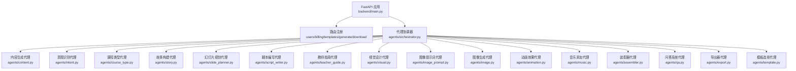
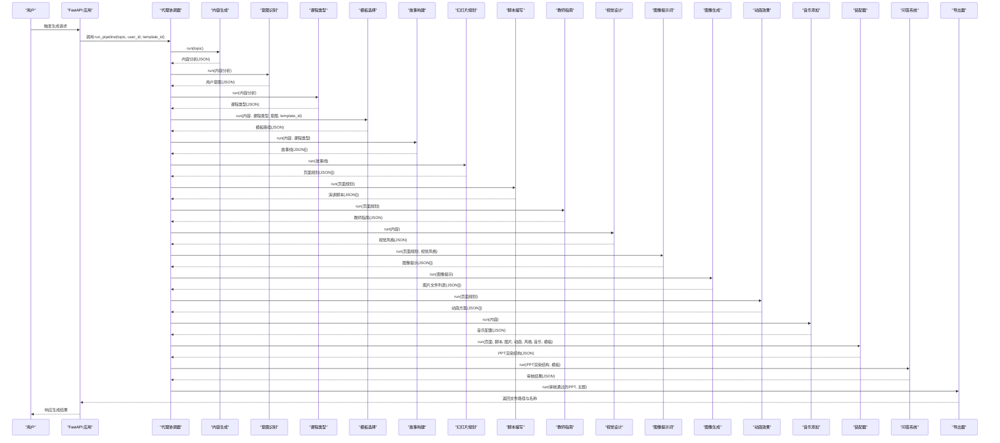
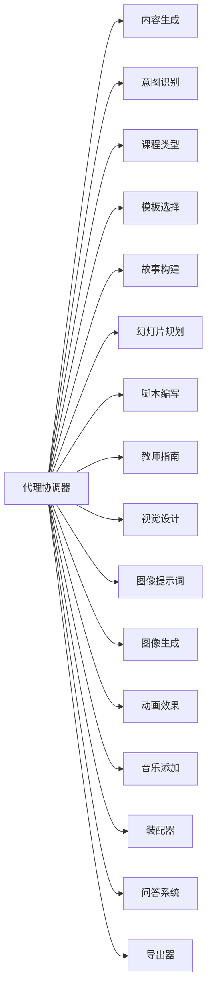

# AI代理系统

<cite>
**本文引用的文件**
- [backend/main.py](file://backend/main.py)
- [backend/agents/orchestrator.py](file://backend/agents/orchestrator.py)
- [backend/agents/base.py](file://backend/agents/base.py)
- [backend/agents/content.py](file://backend/agents/content.py)
- [backend/agents/intent.py](file://backend/agents/intent.py)
- [backend/agents/story.py](file://backend/agents/story.py)
- [backend/agents/slide_planner.py](file://backend/agents/slide_planner.py)
- [backend/agents/script_writer.py](file://backend/agents/script_writer.py)
- [backend/agents/visual.py](file://backend/agents/visual.py)
- [backend/agents/image_prompt.py](file://backend/agents/image_prompt.py)
- [backend/agents/image.py](file://backend/agents/image.py)
- [backend/agents/animation.py](file://backend/agents/animation.py)
- [backend/agents/music.py](file://backend/agents/music.py)
- [backend/agents/assembler.py](file://backend/agents/assembler.py)
- [backend/agents/qa.py](file://backend/agents/qa.py)
</cite>

## 目录
1. [引言](#引言)
2. [项目结构](#项目结构)
3. [核心组件](#核心组件)
4. [架构总览](#架构总览)
5. [详细组件分析](#详细组件分析)
6. [依赖分析](#依赖分析)
7. [性能考虑](#性能考虑)
8. [故障排除指南](#故障排除指南)
9. [结论](#结论)
10. [附录](#附录)

## 引言
本技术文档面向AI代理系统，聚焦于15个AI代理的架构设计、职责分工与协作机制。系统通过“代理协调器”编排各专业代理完成从内容生成到最终PPT导出的全链路流程；代理间以结构化的JSON数据作为通用契约进行通信，并在装配阶段统一为PPT渲染结构，最后由质量审核代理进行一致性与完整性校验，再进入导出阶段。本文将对每个代理的功能边界、调用关系、接口规范与领域模型进行深入解析，并提供可视化图示与排障建议。

## 项目结构
后端采用FastAPI提供REST服务入口，路由注册集中在应用启动时完成；核心业务逻辑位于agents目录下的多个专业代理，以及一个编排器负责流水线调度。整体呈现“分层+按功能域划分”的组织方式：API层负责请求接入与静态资源挂载；业务层由代理构成；引擎层负责PPT装配与导出。

图表来源
- [backend/main.py:30-34](file://backend/main.py#L30-L34)
- [backend/agents/orchestrator.py:1-56](file://backend/agents/orchestrator.py#L1-L56)

章节来源
- [backend/main.py:16-40](file://backend/main.py#L16-L40)

## 核心组件
- 代理基类BaseAgent：封装统一的LLM调用接口（chat/json_output），提供系统提示词、模型与温度参数配置，确保所有代理具备一致的对话能力与JSON输出约束。
- 代理协调器run_pipeline：串联15个代理，定义完整的PPT生成流水线，形成“内容→意图→课程类型→模板→故事→页面→脚本→教师指南→视觉风格→图像提示→图像→动画→音乐→装配→审核→导出”的闭环。
- 专业代理：分别承担内容策划、故事设计、页面规划、脚本撰写、视觉风格、图像提示、图像检索、动画设计、音乐配置、PPT装配、质量审核、模板选择与导出等职责。

章节来源
- [backend/agents/base.py:5-24](file://backend/agents/base.py#L5-L24)
- [backend/agents/orchestrator.py:19-56](file://backend/agents/orchestrator.py#L19-L56)

## 架构总览
系统采用“流水线编排+领域代理”的架构模式。代理协调器作为编排中枢，按顺序调用各代理并传递结构化数据；每个代理专注于单一职责并通过JSON契约与上游/下游交互。装配阶段将多源数据整合为PPT渲染结构，质量审核保障产物质量，导出阶段生成最终文件。

图表来源
- [backend/agents/orchestrator.py:19-56](file://backend/agents/orchestrator.py#L19-L56)
- [backend/agents/content.py:7-21](file://backend/agents/content.py#L7-L21)
- [backend/agents/intent.py:8-21](file://backend/agents/intent.py#L8-L21)
- [backend/agents/story.py:8-31](file://backend/agents/story.py#L8-L31)
- [backend/agents/slide_planner.py:9-32](file://backend/agents/slide_planner.py#L9-L32)
- [backend/agents/script_writer.py:9-25](file://backend/agents/script_writer.py#L9-L25)
- [backend/agents/visual.py:9-34](file://backend/agents/visual.py#L9-L34)
- [backend/agents/image_prompt.py:9-29](file://backend/agents/image_prompt.py#L9-L29)
- [backend/agents/image.py:10-41](file://backend/agents/image.py#L10-L41)
- [backend/agents/animation.py:9-35](file://backend/agents/animation.py#L9-L35)
- [backend/agents/music.py:9-29](file://backend/agents/music.py#L9-L29)
- [backend/agents/assembler.py:16-89](file://backend/agents/assembler.py#L16-L89)
- [backend/agents/qa.py:8-28](file://backend/agents/qa.py#L8-L28)

## 详细组件分析

### 代理基类 BaseAgent
- 职责：统一对话与JSON解析，屏蔽LLM调用细节。
- 关键点：
  - 提供chat与json_output两个核心方法，后者自动清洗LLM输出并解析为dict/list。
  - 统一的system_prompt、model与temperature便于策略调整。
- 复杂度：O(1)调用开销，JSON解析为O(n)（n为输出长度）。
- 错误处理：json_output对三重反引号与多余文本进行清理，异常向上抛出由调用方处理。

章节来源
- [backend/agents/base.py:5-24](file://backend/agents/base.py#L5-L24)

### 代理协调器 Orchestrator.run_pipeline
- 职责：编排15个代理的执行顺序与数据流，产出最终PPT产物与元数据。
- 数据契约：以JSON对象作为跨代理的传输格式，保证强结构化与可扩展性。
- 控制流：严格顺序执行，前序代理的输出作为后序代理的输入；部分代理（如图像生成）并行处理以提升吞吐。
- 输出：包含主题、页数、文件路径、文件名、教师指南、脚本等。

章节来源
- [backend/agents/orchestrator.py:19-56](file://backend/agents/orchestrator.py#L19-L56)

### 内容生成代理 ContentAgent
- 输入：用户提供的主题字符串。
- 输出：结构化内容分析，包含主题类型、教学层级、受众、核心要点、预估页数、情感基调、应用场景等。
- 使用模式：作为后续所有代理的输入基础，决定课程类型与故事线方向。

章节来源
- [backend/agents/content.py:7-21](file://backend/agents/content.py#L7-L21)

### 意图识别代理 IntentAgent
- 输入：ContentAgent输出。
- 输出：Primary/Secondary意图、痛点、成功标准等。
- 作用：指导故事线与页面目标设定，使内容更具目的性与说服力。

章节来源
- [backend/agents/intent.py:8-21](file://backend/agents/intent.py#L8-L21)

### 课程类型代理 CourseTypeAgent
- 输入：ContentAgent输出。
- 输出：课程类型与教学方法等，用于影响故事结构与页面规划。
- 作用：为StoryAgent与SlidePlannerAgent提供上下文约束。

章节来源
- [backend/agents/course_type.py](file://backend/agents/course_type.py)

### 模板选择代理 TemplateAgent
- 输入：ContentAgent、CourseTypeAgent、IntentAgent输出及可选template_id。
- 输出：模板文件路径，若未指定则返回None。
- 作用：为装配阶段提供可选模板，影响最终PPT外观。

章节来源
- [backend/agents/template.py](file://backend/agents/template.py)

### 故事构建代理 StoryAgent
- 输入：ContentAgent与CourseTypeAgent输出。
- 输出：页面级叙事结构（标题、目标、情感、视觉需求、内容大纲、过渡语）数组。
- 作用：将知识点转化为有情感起伏的故事线，指导页面规划与脚本撰写。

章节来源
- [backend/agents/story.py:8-31](file://backend/agents/story.py#L8-L31)

### 幻灯片规划代理 SlidePlannerAgent
- 输入：StoryAgent输出。
- 输出：页面排版规划（布局类型、标题、目标、情感、视觉需求、内容要点、图像关键词、备注）数组。
- 关键约束：每页2-4个图像关键词，用于后续图像生成。

章节来源
- [backend/agents/slide_planner.py:9-32](file://backend/agents/slide_planner.py#L9-L32)

### 脚本编写代理 ScriptWriterAgent
- 输入：SlidePlannerAgent输出。
- 输出：每页演讲脚本（含字数、时间分配、强调词、停顿点）数组。
- 作用：将页面内容转化为可讲授的口语化脚本，支撑教师指南与动画节奏。

章节来源
- [backend/agents/script_writer.py:9-25](file://backend/agents/script_writer.py#L9-L25)

### 教师指南代理 TeacherGuideAgent
- 输入：SlidePlannerAgent输出。
- 输出：教师教学建议、重难点提示、课堂互动建议等。
- 作用：辅助教师使用PPT开展教学活动。

章节来源
- [backend/agents/teacher_guide.py](file://backend/agents/teacher_guide.py)

### 视觉设计代理 VisualStyleAgent
- 输入：ContentAgent输出。
- 输出：主题名称、配色方案、字体、图片风格、装饰风格、情绪板、封面风格等。
- 作用：为图像生成与PPT装配提供统一的视觉规范。

章节来源
- [backend/agents/visual.py:9-34](file://backend/agents/visual.py#L9-L34)

### 图像提示词代理 ImagePromptAgent
- 输入：SlidePlannerAgent输出与VisualStyleAgent输出。
- 输出：每页英文/中文提示词、风格、宽高比、参考关键词等。
- 作用：将页面内容与视觉风格转化为AI图像生成的精确提示。

章节来源
- [backend/agents/image_prompt.py:9-29](file://backend/agents/image_prompt.py#L9-L29)

### 图像生成代理 ImageAgent
- 输入：ImagePromptAgent输出。
- 输出：每页图片文件路径与状态，支持并发下载。
- 关键点：使用外部下载器批量获取图片，异常捕获并记录错误信息。

章节来源
- [backend/agents/image.py:10-41](file://backend/agents/image.py#L10-L41)

### 动画效果代理 AnimationAgent
- 输入：SlidePlannerAgent输出。
- 输出：页面过渡与元素入场动画方案数组。
- 作用：为每页PPT匹配合适的动画风格，增强表现力。

章节来源
- [backend/agents/animation.py:9-35](file://backend/agents/animation.py#L9-L35)

### 音乐添加代理 MusicAgent
- 输入：ContentAgent输出。
- 输出：背景音乐开关、来源、曲目编号、URL、音量、跨页播放、起始页、情绪匹配与说明。
- 作用：为PPT提供与内容情感相匹配的背景音乐。

章节来源
- [backend/agents/music.py:9-29](file://backend/agents/music.py#L9-L29)

### 装配器代理 PPTAssemblerAgent
- 输入：SlidePlannerAgent、ScriptWriterAgent、ImageAgent、AnimationAgent、VisualStyleAgent、MusicAgent、TemplateAgent输出。
- 输出：统一的PPT渲染结构（样式、音乐、页面集合、模板引用）。
- 关键映射：将页面布局类型映射为内部索引，合并各源数据形成最终结构。

章节来源
- [backend/agents/assembler.py:16-89](file://backend/agents/assembler.py#L16-L89)

### 问答系统代理 QAAgent
- 输入：PPTAssemblerAgent输出与模板信息。
- 输出：审核通过标志、问题清单（严重程度与消息）、总页数与原始数据副本。
- 作用：校验结构完整性、内容一致性与视觉一致性，发现并报告潜在问题。

章节来源
- [backend/agents/qa.py:8-28](file://backend/agents/qa.py#L8-L28)

### 导出器代理 ExportAgent
- 输入：QAAgent输出与主题。
- 输出：文件路径与文件名。
- 作用：将审核通过的PPT渲染结构导出为最终文件。

章节来源
- [backend/agents/export.py](file://backend/agents/export.py)

## 依赖分析
- 组件耦合：代理协调器对所有代理存在直接依赖；其余代理之间保持弱耦合，仅通过JSON契约交互。
- 外部依赖：图像生成依赖外部下载器；音乐依赖SoundHelix公开资源；模板依赖模板市场。
- 并发优化：图像生成阶段通过异步gather并发执行，显著降低I/O等待时间。
- 循环依赖：未见循环导入；数据单向流动，符合流水线设计。

图表来源
- [backend/agents/orchestrator.py:1-16](file://backend/agents/orchestrator.py#L1-L16)

章节来源
- [backend/agents/orchestrator.py:1-56](file://backend/agents/orchestrator.py#L1-L56)

## 性能考虑
- 并行化：图像生成使用异步并发，减少整体等待时间。
- JSON契约：统一的数据结构避免了中间转换成本，提高序列化/反序列化效率。
- 缓存与复用：建议在模板与风格层面引入缓存，减少重复计算。
- I/O瓶颈：图像下载与网络请求是主要瓶颈，可通过限速与重试策略优化。
- 可观测性：在关键节点增加日志与指标，便于定位性能热点。

## 故障排除指南
- JSON解析失败：检查LLM输出是否包含额外文本或非JSON片段，确认BaseAgent的清理逻辑生效。
- 图像下载失败：检查关键词长度限制与网络访问权限；查看异常返回中的错误信息。
- 页面缺失或内容为空：由QAAgent检测并报告，需回溯上流代理（故事/规划/脚本）。
- 模板未命中：确认TemplateAgent传入的template_id与模板市场一致。
- 动画/音乐不匹配：检查VisualStyleAgent与AnimationAgent/MusicAgent的输出字段是否满足装配器预期。

章节来源
- [backend/agents/base.py:20-24](file://backend/agents/base.py#L20-L24)
- [backend/agents/image.py:35-41](file://backend/agents/image.py#L35-L41)
- [backend/agents/qa.py:12-21](file://backend/agents/qa.py#L12-L21)

## 结论
该AI代理系统通过清晰的职责划分与严格的JSON契约实现了从内容到PPT成品的自动化生产。代理协调器作为编排中枢，确保各专业代理协同工作；装配与审核环节保障产物质量；导出环节完成最终交付。系统具备良好的扩展性与可维护性，适合进一步引入更多代理与优化I/O性能。

## 附录
- 使用模式建议：
  - 在调用run_pipeline前，先准备主题与可选模板ID。
  - 对于长文本或复杂主题，建议先通过ContentAgent与IntentAgent细化目标，再进入故事与页面规划。
  - 若出现图像下载失败，可尝试缩短关键词或更换关键词组合。
- 代码示例路径（不展示具体代码内容）：
  - [代理基类调用示例:10-23](file://backend/agents/base.py#L10-L23)
  - [内容生成代理调用示例:7-21](file://backend/agents/content.py#L7-L21)
  - [图像生成代理并发示例:38-40](file://backend/agents/image.py#L38-L40)
  - [装配器数据合并示例:29-76](file://backend/agents/assembler.py#L29-L76)