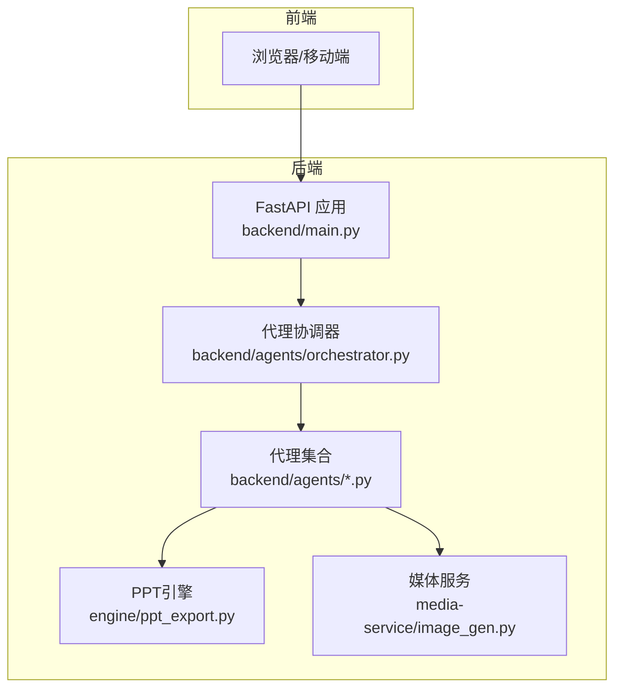
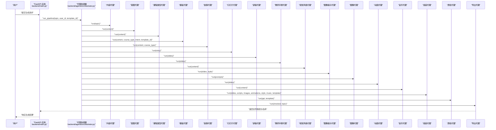
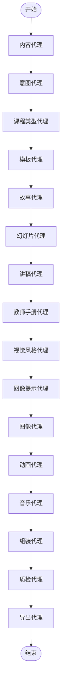
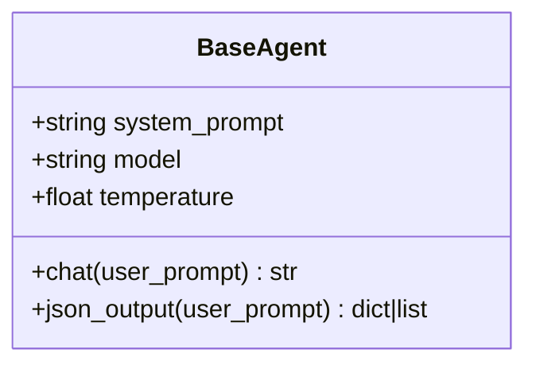
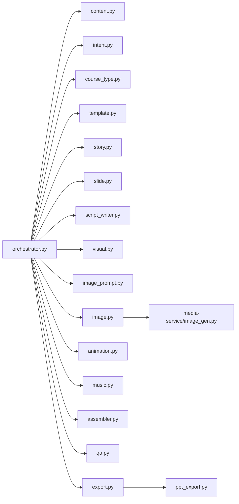

# 代理架构总览

<cite>
**本文引用的文件**
- [backend/main.py](file://backend/main.py)
- [backend/agents/orchestrator.py](file://backend/agents/orchestrator.py)
- [backend/agents/base.py](file://backend/agents/base.py)
- [backend/agents/content.py](file://backend/agents/content.py)
- [backend/agents/intent.py](file://backend/agents/intent.py)
- [backend/agents/course_type.py](file://backend/agents/course_type.py)
- [backend/agents/story.py](file://backend/agents/story.py)
- [backend/agents/slide.py](file://backend/agents/slide.py)
- [backend/agents/script_writer.py](file://backend/agents/script_writer.py)
- [backend/agents/visual.py](file://backend/agents/visual.py)
- [backend/agents/template.py](file://backend/agents/template.py)
- [backend/agents/image.py](file://backend/agents/image.py)
- [backend/agents/export.py](file://backend/agents/export.py)
- [engine/ppt_export.py](file://engine/ppt_export.py)
- [media-service/image_gen.py](file://media-service/image_gen.py)
</cite>

## 目录
1. [引言](#引言)
2. [项目结构](#项目结构)
3. [核心组件](#核心组件)
4. [架构总览](#架构总览)
5. [详细组件分析](#详细组件分析)
6. [依赖分析](#依赖分析)
7. [性能考虑](#性能考虑)
8. [故障排查指南](#故障排查指南)
9. [结论](#结论)
10. [附录](#附录)

## 引言
本文件面向AI代理架构的总体设计与实现，聚焦于15个AI代理的职责分工、协作流程与状态管理，系统性阐述代理协调器的设计思想与执行路径；同时覆盖扩展性、错误处理与性能优化策略，并给出与PPT引擎、媒体服务等模块的集成方式与交互示意图。

## 项目结构
后端以FastAPI作为入口，统一注册路由与中间件；AI代理位于backend/agents目录，围绕“内容-故事-幻灯片-素材-导出”的流水线组织；PPT引擎位于engine目录，负责最终PPT生成；媒体服务位于media-service，提供图像检索与下载能力；前端通过API与后端交互。

**图表来源**
- [backend/main.py:16-40](file://backend/main.py#L16-L40)
- [backend/agents/orchestrator.py:19-56](file://backend/agents/orchestrator.py#L19-L56)
- [engine/ppt_export.py:245-257](file://engine/ppt_export.py#L245-L257)
- [media-service/image_gen.py:19-26](file://media-service/image_gen.py#L19-L26)

**章节来源**
- [backend/main.py:16-40](file://backend/main.py#L16-L40)

## 核心组件
- 基类代理：统一LLM调用、JSON解析与系统提示词配置，确保各代理一致性与可替换性。
- 内容代理：抽取主题、受众、层级、情感基调、页数预估等基础信息。
- 意图代理：识别用户真实目标与成功标准，指导后续结构与风格设计。
- 课程类型代理：确定课程类型、教学方法、结构分布与互动设计。
- 故事代理：基于“起承转合”构建叙事结构，形成每页的教学目标与情感设计。
- 讲稿代理：为每页生成口语化、有节奏感的演讲词与时间安排。
- 教师手册代理：生成教师引导与课堂互动建议。
- 视觉风格代理：定义主题色、字体、图片风格、装饰风格与封面风格。
- 图像提示代理：结合故事与风格生成每页图像关键词。
- 图像代理：批量下载图像资源，支持并发与错误恢复。
- 动画代理：为每页分配入场动画与页面切换动效。
- 音乐代理：为演示添加背景音乐。
- 模板代理：根据主题关键词选择合适的PPT模板。
- 组装代理：将结构化数据与资源组装为可导出的PPT数据结构。
- 质检代理：对生成结果进行质量检查与修正。
- 导出代理：将数据结构保存为PPTX文件。

**章节来源**
- [backend/agents/base.py:5-24](file://backend/agents/base.py#L5-L24)
- [backend/agents/content.py:4-21](file://backend/agents/content.py#L4-L21)
- [backend/agents/intent.py:5-21](file://backend/agents/intent.py#L5-L21)
- [backend/agents/course_type.py:5-27](file://backend/agents/course_type.py#L5-L27)
- [backend/agents/story.py:4-31](file://backend/agents/story.py#L4-L31)
- [backend/agents/script_writer.py:5-25](file://backend/agents/script_writer.py#L5-L25)
- [backend/agents/visual.py:5-34](file://backend/agents/visual.py#L5-L34)
- [backend/agents/template.py:7-33](file://backend/agents/template.py#L7-L33)
- [backend/agents/image.py:7-41](file://backend/agents/image.py#L7-L41)
- [backend/agents/export.py:10-65](file://backend/agents/export.py#L10-L65)

## 架构总览
代理协调器以流水线形式编排15个代理，形成从“内容理解”到“成品导出”的完整链路。其核心流程如下：
- 输入主题与可选模板ID
- 依次运行内容、意图、课程类型、模板选择
- 生成故事、幻灯片、讲稿、教师手册、视觉风格
- 生成图像关键词、下载图像、设置动画与音乐
- 组装PPT数据、质检、导出文件

**图表来源**
- [backend/agents/orchestrator.py:19-56](file://backend/agents/orchestrator.py#L19-L56)
- [backend/agents/content.py:7-21](file://backend/agents/content.py#L7-L21)
- [backend/agents/intent.py:8-21](file://backend/agents/intent.py#L8-L21)
- [backend/agents/course_type.py:8-27](file://backend/agents/course_type.py#L8-L27)
- [backend/agents/story.py:8-31](file://backend/agents/story.py#L8-L31)
- [backend/agents/slide.py:4-17](file://backend/agents/slide.py#L4-L17)
- [backend/agents/script_writer.py:9-25](file://backend/agents/script_writer.py#L9-L25)
- [backend/agents/visual.py:9-34](file://backend/agents/visual.py#L9-L34)
- [backend/agents/template.py:8-33](file://backend/agents/template.py#L8-L33)
- [backend/agents/image.py:10-41](file://backend/agents/image.py#L10-L41)
- [backend/agents/export.py:11-65](file://backend/agents/export.py#L11-L65)

## 详细组件分析

### 代理协调器（Orchestrator）
- 设计思想：以顺序流水线串联多个专业代理，每个代理专注单一职责，通过标准化输入/输出进行解耦。
- 执行流程：按固定顺序调用各代理，逐步构建PPT数据结构；在关键节点进行模板选择与质量检查。
- 状态管理：通过函数参数与返回值传递中间状态；最终汇总页面数量、教师手册、讲稿等元数据。
- 错误处理：当前实现未显式捕获异常，建议在关键步骤增加try/except与降级策略（见“性能考虑”与“故障排查指南”）。

**图表来源**
- [backend/agents/orchestrator.py:19-56](file://backend/agents/orchestrator.py#L19-L56)

**章节来源**
- [backend/agents/orchestrator.py:19-56](file://backend/agents/orchestrator.py#L19-L56)

### 基类代理（BaseAgent）
- 统一模型调用：封装系统提示词、温度与LLM对话接口。
- JSON输出：自动清洗LLM输出中的多余文本，保证下游解析稳定。
- 可扩展性：子类仅需定义system_prompt与少量字段即可接入流水线。

**图表来源**
- [backend/agents/base.py:5-24](file://backend/agents/base.py#L5-L24)

**章节来源**
- [backend/agents/base.py:5-24](file://backend/agents/base.py#L5-L24)

### 内容代理（ContentAgent）
- 职责：抽取主题、类型、受众、层级、关键点、页数预估与情感基调。
- 边界：不参与结构设计与资源生成，仅提供结构化内容描述。

**章节来源**
- [backend/agents/content.py:4-21](file://backend/agents/content.py#L4-L21)

### 意图代理（IntentAgent）
- 职责：识别主要与次要意图、痛点与成功标准。
- 边界：为课程类型与模板选择提供高层目标依据。

**章节来源**
- [backend/agents/intent.py:5-21](file://backend/agents/intent.py#L5-L21)

### 课程类型代理（CourseTypeAgent）
- 职责：确定课程类型、教学方法、结构分布与互动设计。
- 边界：为故事与幻灯片规划提供结构性约束。

**章节来源**
- [backend/agents/course_type.py:5-27](file://backend/agents/course_type.py#L5-L27)

### 故事代理（StoryAgent）
- 职责：基于“起承转合”构建叙事结构，明确每页教学目标与情感设计。
- 边界：产出结构化故事列表，供幻灯片与讲稿代理使用。

**章节来源**
- [backend/agents/story.py:4-31](file://backend/agents/story.py#L4-L31)

### 幻灯片代理（SlideAgent）
- 职责：将故事转换为幻灯片数据，填充布局、图像关键词与动画类型。
- 边界：不直接生成图像或动画效果，仅负责数据层。

**章节来源**
- [backend/agents/slide.py:1-17](file://backend/agents/slide.py#L1-L17)

### 讲稿代理（ScriptWriterAgent）
- 职责：为每页生成演讲词、时长与强调词。
- 边界：不关心图像与动画，专注于语言表达。

**章节来源**
- [backend/agents/script_writer.py:5-25](file://backend/agents/script_writer.py#L5-L25)

### 教师手册代理（TeacherGuideAgent）
- 职责：提供课堂引导、互动建议与注意事项。
- 边界：面向教师使用，不参与PPT数据结构。

**章节来源**
- [backend/agents/teacher_guide.py](file://backend/agents/teacher_guide.py)

### 视觉风格代理（VisualStyleAgent）
- 职责：定义主题色、字体、图片风格与装饰风格。
- 边界：为图像提示与PPT样式提供设计规范。

**章节来源**
- [backend/agents/visual.py:5-34](file://backend/agents/visual.py#L5-L34)

### 图像提示代理（ImagePromptAgent）
- 职责：结合故事与风格生成每页图像关键词。
- 边界：仅生成关键词，不负责下载。

**章节来源**
- [backend/agents/image_prompt.py](file://backend/agents/image_prompt.py)

### 图像代理（ImageAgent）
- 职责：批量下载图像资源，支持并发与错误恢复。
- 边界：输出文件路径与状态，供导出阶段使用。

**章节来源**
- [backend/agents/image.py:7-41](file://backend/agents/image.py#L7-L41)

### 动画代理（AnimationAgent）
- 职责：为每页分配入场动画与页面切换动效。
- 边界：仅负责数据层，不直接操作PPT对象。

**章节来源**
- [backend/agents/animation.py](file://backend/agents/animation.py)

### 音乐代理（MusicAgent）
- 职责：为演示添加背景音乐。
- 边界：输出音乐资源标识，供导出阶段使用。

**章节来源**
- [backend/agents/music.py](file://backend/agents/music.py)

### 模板代理（TemplateAgent）
- 职责：根据主题关键词匹配合适模板。
- 边界：返回模板文件路径或None。

**章节来源**
- [backend/agents/template.py:7-33](file://backend/agents/template.py#L7-L33)

### 组装代理（PPTAssemblerAgent）
- 职责：将结构化数据与资源组装为可导出的PPT数据结构。
- 边界：不直接写文件，仅构造数据。

**章节来源**
- [backend/agents/assembler.py](file://backend/agents/assembler.py)

### 质检代理（QAAgent）
- 职责：对生成结果进行质量检查与修正。
- 边界：返回可导出的最终数据结构。

**章节来源**
- [backend/agents/qa.py](file://backend/agents/qa.py)

### 导出代理（ExportAgent）
- 职责：将数据结构保存为PPTX文件。
- 边界：负责文件系统IO与PPTX写入。

**章节来源**
- [backend/agents/export.py:10-65](file://backend/agents/export.py#L10-L65)

### PPT引擎（engine/ppt_export.py）
- 职责：在Windows平台通过COM接口生成PPTX，支持图片下载、音频嵌入与动画应用。
- 特性：异步导出、临时资源清理、多线程隔离。

**章节来源**
- [engine/ppt_export.py:92-257](file://engine/ppt_export.py#L92-L257)

### 媒体服务（media-service/image_gen.py）
- 职责：为每页生成图像关键词并下载单张图片，支持并发。
- 特性：按页号组织输出目录，便于调试与追踪。

**章节来源**
- [media-service/image_gen.py:6-26](file://media-service/image_gen.py#L6-L26)

## 依赖分析
- 协调器对所有代理存在直接依赖，体现强中心化控制。
- 基类代理向上抽象，向下被具体代理继承，降低重复代码。
- 模板代理依赖PPT引擎模板目录，导出代理依赖PPTX库。
- 图像代理与媒体服务均依赖外部图像下载库，存在网络与权限风险。
- PPT引擎依赖Windows COM接口，部署环境需满足平台要求。

**图表来源**
- [backend/agents/orchestrator.py:1-16](file://backend/agents/orchestrator.py#L1-L16)
- [engine/ppt_export.py:10-10](file://engine/ppt_export.py#L10-L10)
- [media-service/image_gen.py:19-26](file://media-service/image_gen.py#L19-L26)

**章节来源**
- [backend/agents/orchestrator.py:1-16](file://backend/agents/orchestrator.py#L1-L16)

## 性能考虑
- 并发与异步：图像代理与媒体服务采用异步并发下载，显著缩短I/O等待时间。
- 线程隔离：PPT引擎通过独立线程执行COM操作，避免阻塞事件循环。
- 缓存与复用：模板代理基于关键词映射快速选择模板，减少计算开销。
- 降级策略：建议在图像下载失败时回退至占位图或空图，保障流程连续性。
- 资源清理：PPT引擎在完成后清理临时目录与音频缓存，避免磁盘膨胀。
- 扩展建议：引入任务队列与重试机制，增强系统弹性与可观测性。

[本节为通用性能建议，无需特定文件引用]

## 故障排查指南
- LLM输出解析失败：检查BaseAgent的JSON清洗逻辑是否正确处理非标准输出。
- 图像下载异常：确认外部下载库可用、网络连通与关键字长度限制。
- 模板文件缺失：核对模板目录路径与文件存在性，确保模板代理返回有效路径。
- PPT导出失败：检查Windows COM接口可用性与PowerPoint安装状态。
- 文件写入权限：导出代理需具备输出目录写权限，必要时切换到非受限目录。

**章节来源**
- [backend/agents/base.py:20-24](file://backend/agents/base.py#L20-L24)
- [backend/agents/image.py:35-41](file://backend/agents/image.py#L35-L41)
- [backend/agents/template.py:22-33](file://backend/agents/template.py#L22-L33)
- [engine/ppt_export.py:92-257](file://engine/ppt_export.py#L92-L257)
- [backend/agents/export.py:11-65](file://backend/agents/export.py#L11-L65)

## 结论
该代理架构以“专业化分工+流水线编排”为核心设计原则，通过15个专业代理覆盖从内容理解到成品导出的全链路。协调器承担全局编排与状态汇聚，基类代理提供统一抽象与可替换性。系统在并发下载与线程隔离方面具备良好性能表现，建议进一步引入任务队列、重试与可观测性机制以提升稳定性与可维护性。

## 附录
- 与PPT引擎集成：导出代理与PPT引擎分别负责数据结构与底层生成，二者通过文件系统衔接。
- 与媒体服务集成：图像代理与媒体服务均依赖外部下载库，建议统一配置与限流策略。
- 部署建议：后端需满足Windows平台与PowerPoint安装要求；前端通过FastAPI路由访问后端接口。

[本节为概念性总结，无需特定文件引用]