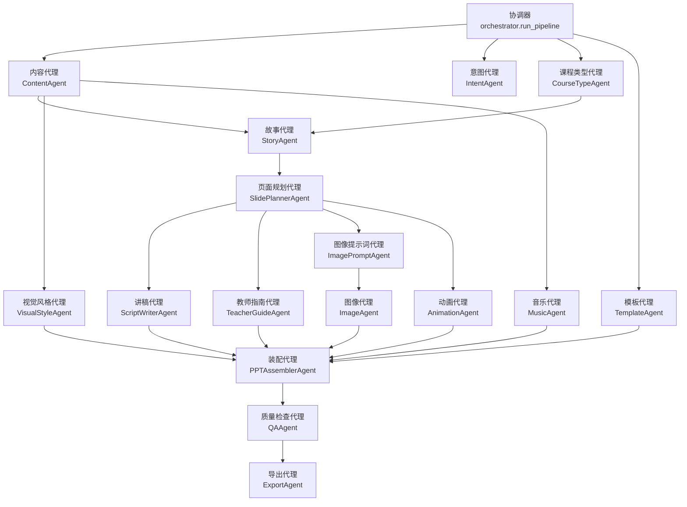
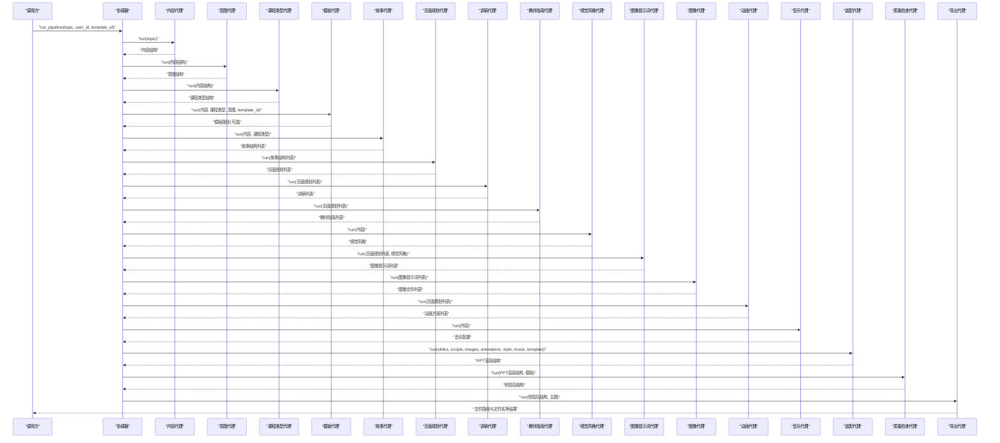
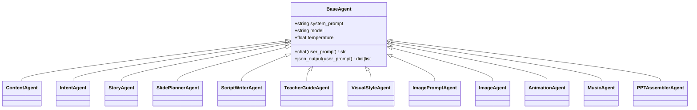
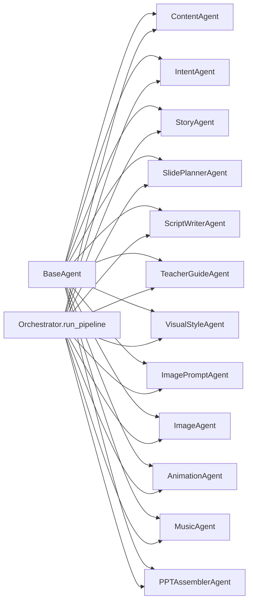
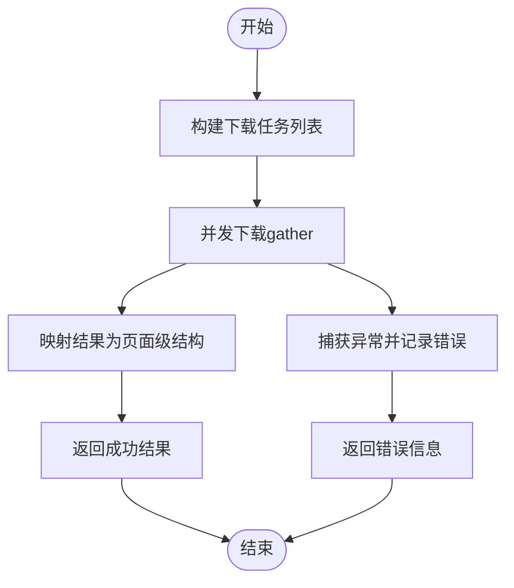

# 代理间通信机制

<cite>
**本文引用的文件**
- [backend/agents/orchestrator.py](file://backend/agents/orchestrator.py)
- [backend/agents/base.py](file://backend/agents/base.py)
- [backend/agents/assembler.py](file://backend/agents/assembler.py)
- [backend/agents/content.py](file://backend/agents/content.py)
- [backend/agents/intent.py](file://backend/agents/intent.py)
- [backend/agents/story.py](file://backend/agents/story.py)
- [backend/agents/slide_planner.py](file://backend/agents/slide_planner.py)
- [backend/agents/script_writer.py](file://backend/agents/script_writer.py)
- [backend/agents/visual.py](file://backend/agents/visual.py)
- [backend/agents/image_prompt.py](file://backend/agents/image_prompt.py)
- [backend/agents/image.py](file://backend/agents/image.py)
- [backend/agents/animation.py](file://backend/agents/animation.py)
- [backend/agents/music.py](file://backend/agents/music.py)
- [backend/agents/teacher_guide.py](file://backend/agents/teacher_guide.py)
</cite>

## 目录
1. [引言](#引言)
2. [项目结构](#项目结构)
3. [核心组件](#核心组件)
4. [架构总览](#架构总览)
5. [详细组件分析](#详细组件分析)
6. [依赖分析](#依赖分析)
7. [性能考虑](#性能考虑)
8. [故障排查指南](#故障排查指南)
9. [结论](#结论)
10. [附录](#附录)

## 引言
本文件聚焦于系统中“代理间通信机制”的实现与运行方式，围绕以下主题展开：
- 代理协调器的调度算法、任务分配策略与执行顺序控制
- 代理间的数据传递格式、消息协议与状态同步机制
- 异步通信模式、错误传播机制与重试策略
- 代理生命周期管理、资源清理与内存优化
- 通信流程与时序图
- 如何扩展新的代理类型与调整现有代理的依赖关系
- 调试技巧与性能监控方法

## 项目结构
系统采用“代理驱动”的流水线架构，所有业务逻辑以“代理”为最小执行单元，通过一个顶层协调器按固定顺序编排各代理的执行，并在必要时进行数据汇聚与装配。

图表来源
- [backend/agents/orchestrator.py:19-55](file://backend/agents/orchestrator.py#L19-L55)
- [backend/agents/assembler.py:16-88](file://backend/agents/assembler.py#L16-L88)

章节来源
- [backend/agents/orchestrator.py:1-56](file://backend/agents/orchestrator.py#L1-L56)

## 核心组件
- 协调器（Orchestrator）
  - 作用：定义端到端流水线的执行顺序，串联各代理；负责将上游输出作为下游输入传递；最终汇总结果并返回。
  - 关键点：严格顺序执行；部分步骤可并行（例如图像下载阶段）；对模板路径进行条件装配。
- 基类代理（BaseAgent）
  - 作用：统一LLM交互接口（chat/json_output）、模型参数与系统提示词配置。
  - 关键点：统一的JSON解析与清洗流程；便于扩展新代理时复用一致的交互范式。
- 装配代理（PPTAssemblerAgent）
  - 作用：将来自不同代理的结构化数据整合为最终PPT渲染结构，完成跨域数据对齐与映射。
  - 关键点：基于页面号进行多源数据聚合；布局索引映射；可选模板注入。

章节来源
- [backend/agents/orchestrator.py:19-55](file://backend/agents/orchestrator.py#L19-L55)
- [backend/agents/base.py:5-24](file://backend/agents/base.py#L5-L24)
- [backend/agents/assembler.py:4-88](file://backend/agents/assembler.py#L4-L88)

## 架构总览
下图展示从主题输入到最终导出的完整时序：

图表来源
- [backend/agents/orchestrator.py:19-55](file://backend/agents/orchestrator.py#L19-L55)
- [backend/agents/assembler.py:16-88](file://backend/agents/assembler.py#L16-L88)

## 详细组件分析

### 协调器与调度算法
- 调度策略
  - 明确的串行顺序：内容 → 意图/课程类型 → 模板 → 故事 → 页面规划 → 讲稿/教师指南 → 视觉风格 → 图像提示词 → 图像 → 动画 → 音乐 → 装配 → 质检 → 导出。
  - 可并行化点：图像下载阶段（见“图像代理”），通过并发gather实现批量请求。
- 任务分配与数据传递
  - 每个代理接收上游输出作为输入，返回结构化数据供下游使用。
  - 模板路径在装配阶段有条件注入，避免无模板时的空值问题。
- 执行顺序控制
  - 通过函数调用链保证依赖满足；若上游失败，后续步骤将无法执行，需结合错误处理策略。

章节来源
- [backend/agents/orchestrator.py:19-55](file://backend/agents/orchestrator.py#L19-L55)

### 数据传递格式与消息协议
- 统一约定
  - 代理间传递的数据均为结构化对象（字典/列表），字段命名遵循各代理职责域内的约定。
  - 页面级数据普遍包含“page_number”或“index”，用于跨代理对齐。
- 典型数据域
  - 内容域：主题、类型、受众、关键点、情感基调等
  - 页面域：标题、教学目标、情感、内容大纲、叙事、布局、图像关键词等
  - 资源域：图像文件路径、动画类型与元素配置、音乐URL与音量等
- 装配映射
  - 装配代理将多源数据按页面号合并，形成最终PPT渲染结构，包含样式、音乐、幻灯片集合及模板信息。

章节来源
- [backend/agents/content.py:7-20](file://backend/agents/content.py#L7-L20)
- [backend/agents/story.py:8-30](file://backend/agents/story.py#L8-L30)
- [backend/agents/slide_planner.py:9-31](file://backend/agents/slide_planner.py#L9-L31)
- [backend/agents/script_writer.py:9-24](file://backend/agents/script_writer.py#L9-L24)
- [backend/agents/teacher_guide.py:9-28](file://backend/agents/teacher_guide.py#L9-L28)
- [backend/agents/visual.py:9-33](file://backend/agents/visual.py#L9-L33)
- [backend/agents/image_prompt.py:9-28](file://backend/agents/image_prompt.py#L9-L28)
- [backend/agents/image.py:10-40](file://backend/agents/image.py#L10-L40)
- [backend/agents/animation.py:9-34](file://backend/agents/animation.py#L9-L34)
- [backend/agents/music.py:9-28](file://backend/agents/music.py#L9-L28)
- [backend/agents/assembler.py:16-88](file://backend/agents/assembler.py#L16-L88)

### 异步通信模式、错误传播与重试
- 异步模式
  - 所有代理的run方法均声明为异步；协调器按顺序await每个步骤。
  - 图像代理内部使用并发gather对多个提示词进行并行下载，提升吞吐。
- 错误传播
  - 代理基类未显式捕获异常；若上游抛错，将沿调用栈向上传播，导致后续步骤中断。
  - 图像代理对单个下载任务进行了try/except包裹，返回带错误码的结果，避免整体失败。
- 重试策略
  - 当前代码未实现自动重试；可在图像代理的并发任务中引入指数退避与重试逻辑，或在上层协调器中对特定步骤增加重试包装。

章节来源
- [backend/agents/orchestrator.py:19-55](file://backend/agents/orchestrator.py#L19-L55)
- [backend/agents/image.py:14-40](file://backend/agents/image.py#L14-L40)

### 生命周期管理、资源清理与内存优化
- 生命周期
  - 代理实例在每次流水线执行时临时创建与销毁，避免状态污染。
- 资源清理
  - 图像代理在下载前确保输出目录存在；下载完成后不主动删除文件，由外部流程或定时任务清理。
- 内存优化
  - 使用列表推导与生成器表达式减少中间拷贝；并发下载时注意控制并发度，避免内存峰值过高。
  - 对长文本提示词进行长度截断（如图像代理对关键词长度限制），降低LLM调用成本与内存占用。

章节来源
- [backend/agents/image.py:10-40](file://backend/agents/image.py#L10-L40)

### 类关系与继承结构

图表来源
- [backend/agents/base.py:5-24](file://backend/agents/base.py#L5-L24)
- [backend/agents/content.py:4-20](file://backend/agents/content.py#L4-L20)
- [backend/agents/intent.py:5-20](file://backend/agents/intent.py#L5-L20)
- [backend/agents/story.py:4-30](file://backend/agents/story.py#L4-L30)
- [backend/agents/slide_planner.py:5-31](file://backend/agents/slide_planner.py#L5-L31)
- [backend/agents/script_writer.py:5-24](file://backend/agents/script_writer.py#L5-L24)
- [backend/agents/teacher_guide.py:5-28](file://backend/agents/teacher_guide.py#L5-L28)
- [backend/agents/visual.py:5-33](file://backend/agents/visual.py#L5-L33)
- [backend/agents/image_prompt.py:5-28](file://backend/agents/image_prompt.py#L5-L28)
- [backend/agents/image.py:7-40](file://backend/agents/image.py#L7-L40)
- [backend/agents/animation.py:5-34](file://backend/agents/animation.py#L5-L34)
- [backend/agents/music.py:5-28](file://backend/agents/music.py#L5-L28)
- [backend/agents/assembler.py:4-88](file://backend/agents/assembler.py#L4-L88)

## 依赖分析
- 外部依赖
  - LLM调用：通过统一的chat与json_output接口封装，便于替换与限流。
  - 图像下载：依赖第三方库进行Bing搜索结果抓取与本地落盘。
- 内部耦合
  - 协调器对各代理强耦合（顺序与输入输出约定）；代理之间通过结构化数据弱耦合。
  - 装配代理承担跨域数据对齐职责，是数据耦合的集中点。

图表来源
- [backend/agents/orchestrator.py:1-16](file://backend/agents/orchestrator.py#L1-L16)
- [backend/agents/base.py:5-24](file://backend/agents/base.py#L5-L24)

章节来源
- [backend/agents/orchestrator.py:1-16](file://backend/agents/orchestrator.py#L1-L16)
- [backend/agents/base.py:1-24](file://backend/agents/base.py#L1-L24)

## 性能考虑
- 并发优化
  - 在图像下载阶段使用并发gather，显著缩短I/O等待时间；可根据网络与服务端限速动态调整并发数。
- 提示词与调用成本
  - 对长文本进行截断与摘要，减少LLM上下文开销；统一温度与模型参数，平衡质量与速度。
- 数据对齐与映射
  - 装配阶段按页面号进行多路数据聚合，避免重复扫描；布局映射表可缓存以减少查找成本。
- I/O与存储
  - 输出目录提前创建，避免频繁IO错误；定期清理临时图像文件，防止磁盘膨胀。

## 故障排查指南
- 常见问题定位
  - LLM调用失败：检查系统提示词与温度设置；确认网络连通性与服务端限流策略。
  - 图像下载为空：检查关键词长度与合法性；确认下载库可用性与代理设置。
  - 页面对齐异常：核对页面号一致性；确保装配阶段的过滤与默认值逻辑正确。
- 调试技巧
  - 在关键代理的run方法前后打印输入/输出结构，快速定位数据断点。
  - 将长JSON输出写入临时文件，便于人工审阅与对比。
- 性能监控
  - 为每个代理记录耗时与成功率；统计并发下载的吞吐与错误率。
  - 对关键步骤添加超时与熔断保护，避免雪崩效应。

## 结论
该系统通过“代理+协调器”的架构实现了清晰的职责划分与稳定的流水线执行。数据以结构化形式在代理间传递，装配代理承担跨域整合职责。当前实现强调顺序稳定与并发I/O优化，建议在错误处理与重试方面进一步增强鲁棒性，并完善可观测性与资源治理策略。

## 附录

### 扩展新代理类型与修改依赖关系
- 新增代理步骤
  - 定义新代理类，继承BaseAgent并实现run方法；
  - 在协调器中插入新步骤，并将其输出作为下游输入；
  - 若涉及并行I/O，使用并发gather提升吞吐。
- 修改依赖关系
  - 若需并行化已有步骤（如图像下载），保持输入不变，仅调整并发策略；
  - 若需引入前置步骤，更新协调器顺序并在装配阶段补充对应字段映射。

### 通信流程与时序图（补充）
- 流程图（图像下载）

图表来源
- [backend/agents/image.py:14-40](file://backend/agents/image.py#L14-L40)