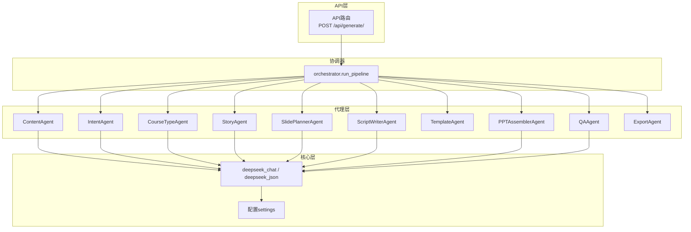
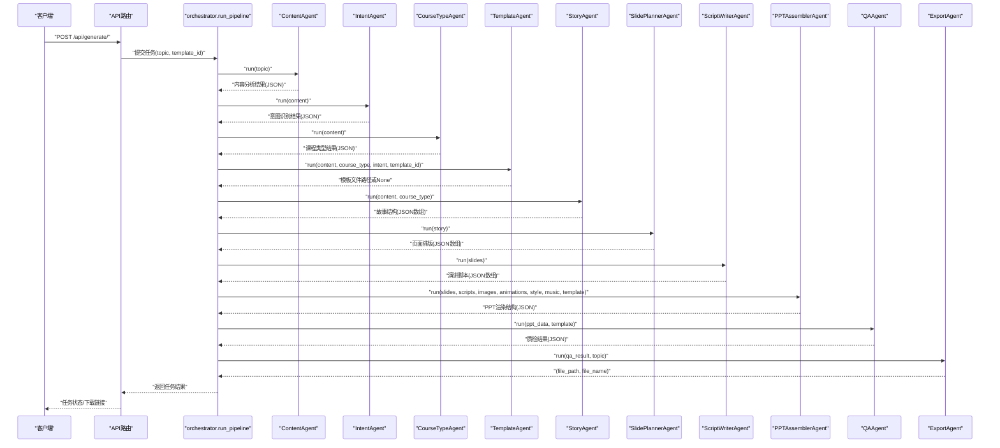
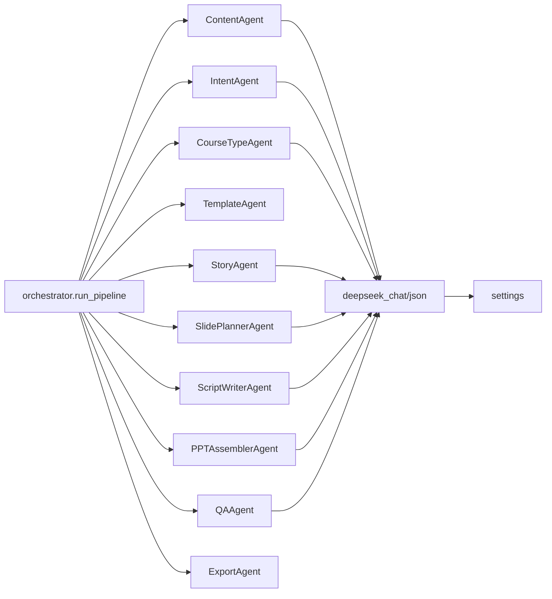

# 内容处理类代理

<cite>
**本文引用的文件**
- [backend/agents/base.py](file://backend/agents/base.py)
- [backend/core/deepseek.py](file://backend/core/deepseek.py)
- [backend/agents/content.py](file://backend/agents/content.py)
- [backend/agents/intent.py](file://backend/agents/intent.py)
- [backend/agents/course_type.py](file://backend/agents/course_type.py)
- [backend/agents/story.py](file://backend/agents/story.py)
- [backend/agents/slide_planner.py](file://backend/agents/slide_planner.py)
- [backend/agents/script_writer.py](file://backend/agents/script_writer.py)
- [backend/agents/template.py](file://backend/agents/template.py)
- [backend/agents/assembler.py](file://backend/agents/assembler.py)
- [backend/agents/qa.py](file://backend/agents/qa.py)
- [backend/agents/export.py](file://backend/agents/export.py)
- [backend/agents/orchestrator.py](file://backend/agents/orchestrator.py)
- [backend/api/generate.py](file://backend/api/generate.py)
- [backend/main.py](file://backend/main.py)
- [backend/core/config.py](file://backend/core/config.py)
</cite>

## 目录
1. [简介](#简介)
2. [项目结构](#项目结构)
3. [核心组件](#核心组件)
4. [架构总览](#架构总览)
5. [详细组件分析](#详细组件分析)
6. [依赖分析](#依赖分析)
7. [性能考虑](#性能考虑)
8. [故障排除指南](#故障排除指南)
9. [结论](#结论)
10. [附录](#附录)

## 简介
本文件面向内容处理类AI代理系统，围绕以下核心代理展开：ContentAgent（内容提取与分析）、IntentAgent（意图识别）、CourseTypeAgent（课程类型判断）、StoryAgent（故事构建）。文档从系统架构、数据流、处理逻辑、输入输出规范、错误处理到实际调用方式进行全面说明，并提供可直接定位到源码的路径指引，便于开发者快速上手与扩展。

## 项目结构
后端采用“代理分层 + 协调器编排”的结构组织：
- 代理层：各功能代理封装LLM调用与JSON解析，负责单一职责（内容、意图、课程类型、故事、页面规划、脚本、模板、装配、质检、导出等）
- 核心层：统一的LLM适配器（DeepSeek），提供chat与json两种输出能力
- 协调器：orchestrator.run_pipeline串联多个代理，形成完整的PPT生成流水线
- API层：FastAPI路由接收请求，触发异步任务并返回任务状态查询接口

图表来源
- [backend/agents/orchestrator.py:19-55](file://backend/agents/orchestrator.py#L19-L55)
- [backend/agents/content.py:7-20](file://backend/agents/content.py#L7-L20)
- [backend/agents/intent.py:8-20](file://backend/agents/intent.py#L8-L20)
- [backend/agents/course_type.py:8-26](file://backend/agents/course_type.py#L8-L26)
- [backend/agents/story.py:8-30](file://backend/agents/story.py#L8-L30)
- [backend/agents/slide_planner.py:9-31](file://backend/agents/slide_planner.py#L9-L31)
- [backend/agents/script_writer.py:9-24](file://backend/agents/script_writer.py#L9-L24)
- [backend/agents/template.py:7-32](file://backend/agents/template.py#L7-L32)
- [backend/agents/assembler.py:16-88](file://backend/agents/assembler.py#L16-L88)
- [backend/agents/qa.py:8-27](file://backend/agents/qa.py#L8-L27)
- [backend/agents/export.py:10-64](file://backend/agents/export.py#L10-L64)
- [backend/core/deepseek.py:9-39](file://backend/core/deepseek.py#L9-L39)
- [backend/core/config.py:4-33](file://backend/core/config.py#L4-L33)

章节来源
- [backend/main.py:16-39](file://backend/main.py#L16-L39)
- [backend/api/generate.py:20-51](file://backend/api/generate.py#L20-L51)
- [backend/agents/orchestrator.py:19-55](file://backend/agents/orchestrator.py#L19-L55)

## 核心组件
- 基类BaseAgent：统一系统提示词、模型与温度设置；提供chat与json_output两类LLM交互方法
- DeepSeek适配器：封装HTTP调用，提供chat与json两种输出能力，并进行JSON文本清洗
- ContentAgent：对用户输入主题进行内容结构化分析，输出主题、类型、受众、关键点、页数、情感基调、场景等
- IntentAgent：基于内容分析结果，识别主次意图、痛点与成功标准
- CourseTypeAgent：结合内容与意图，给出课程类型、教学方法、结构、页数分布与互动设计
- StoryAgent：将内容与课程类型融合，输出按“起承转合”设计的页面级叙事结构
- SlidePlannerAgent：将故事结构转化为具体页面排版、内容模块与图像关键词
- ScriptWriterAgent：为每页生成演讲脚本、时长、强调词与停顿点
- TemplateAgent：根据主题与分类匹配模板文件
- PPTAssemblerAgent：将页面、脚本、图像、动画、样式、音乐整合为PPT渲染结构
- QAAgent：对生成结果进行结构完整性与内容一致性检查
- ExportAgent：将渲染结构保存为PPTX文件并返回路径与文件名

章节来源
- [backend/agents/base.py:5-23](file://backend/agents/base.py#L5-L23)
- [backend/core/deepseek.py:9-39](file://backend/core/deepseek.py#L9-L39)
- [backend/agents/content.py:4-20](file://backend/agents/content.py#L4-L20)
- [backend/agents/intent.py:5-20](file://backend/agents/intent.py#L5-L20)
- [backend/agents/course_type.py:5-26](file://backend/agents/course_type.py#L5-L26)
- [backend/agents/story.py:4-30](file://backend/agents/story.py#L4-L30)
- [backend/agents/slide_planner.py:5-31](file://backend/agents/slide_planner.py#L5-L31)
- [backend/agents/script_writer.py:5-24](file://backend/agents/script_writer.py#L5-L24)
- [backend/agents/template.py:7-32](file://backend/agents/template.py#L7-L32)
- [backend/agents/assembler.py:4-88](file://backend/agents/assembler.py#L4-L88)
- [backend/agents/qa.py:4-27](file://backend/agents/qa.py#L4-L27)
- [backend/agents/export.py:10-64](file://backend/agents/export.py#L10-L64)

## 架构总览
下图展示了从API入口到最终导出的完整流水线，以及各代理之间的依赖关系与数据传递方向。

图表来源
- [backend/agents/orchestrator.py:19-55](file://backend/agents/orchestrator.py#L19-L55)
- [backend/api/generate.py:20-51](file://backend/api/generate.py#L20-L51)

## 详细组件分析

### ContentAgent（内容提取与分析）
- 输入参数
  - topic: str，用户输入的主题字符串
- 输出JSON结构
  - topic: 主题原文
  - type: 课程类型枚举（课程PPT/商业PPT/演讲PPT）
  - level: 受众层级（小学/中学/高中/大学/专业）
  - audience: 目标受众描述
  - key_points: 核心要点列表
  - estimated_pages: 预估页数
  - emotion_tone: 情感基调（温暖鼓励/专业严谨/激情澎湃/幽默风趣）
  - scenario: 应用场景（课堂教学/学术报告/产品发布/工作总结）
- 业务逻辑
  - 使用系统提示词引导模型从主题中抽取结构化要素
  - 调用基类json_output，确保仅返回JSON
- 错误处理
  - 若LLM未返回有效JSON，将由上游json.loads抛出异常
- 典型调用位置
  - [backend/agents/orchestrator.py:20](file://backend/agents/orchestrator.py#L20)
  - [backend/agents/content.py:7-20](file://backend/agents/content.py#L7-L20)

章节来源
- [backend/agents/content.py:4-20](file://backend/agents/content.py#L4-L20)
- [backend/agents/base.py:20-23](file://backend/agents/base.py#L20-L23)

### IntentAgent（意图识别）
- 输入参数
  - content: dict，ContentAgent输出的结构化内容
- 输出JSON结构
  - primary_intent: 主要意图（教学/汇报/推广/演讲）
  - secondary_intent: 次要意图（激发兴趣/传授知识/说服决策/展示成果）
  - pain_points: 用户痛点列表
  - success_criteria: 成功标准列表
- 业务逻辑
  - 基于content进行深层意图挖掘，识别用户真实目标
- 错误处理
  - 若传入非dict或字段缺失，需在上游校验
- 典型调用位置
  - [backend/agents/orchestrator.py:21](file://backend/agents/orchestrator.py#L21)
  - [backend/agents/intent.py:8-20](file://backend/agents/intent.py#L8-L20)

章节来源
- [backend/agents/intent.py:5-20](file://backend/agents/intent.py#L5-L20)

### CourseTypeAgent（课程类型判断）
- 输入参数
  - content: dict，ContentAgent输出
- 输出JSON结构
  - course_type: 课程类型（新知讲授/复习巩固/技能训练/项目展示/产品发布）
  - teaching_method: 教学方法（5E教学法/支架式教学/PBL项目式/故事化教学）
  - structure: 课程结构（导入-讲解-练习-总结/问题-分析-方案-评估）
  - page_distribution: 各部分页数分配（数组，含section/pages）
  - interaction_design: 互动设计（提问/小组讨论/课堂小测等）
- 业务逻辑
  - 综合内容与意图，给出教学设计建议与页数分配
- 错误处理
  - 字段缺失时使用get默认值，保证下游可用性
- 典型调用位置
  - [backend/agents/orchestrator.py:22](file://backend/agents/orchestrator.py#L22)
  - [backend/agents/course_type.py:8-26](file://backend/agents/course_type.py#L8-L26)

章节来源
- [backend/agents/course_type.py:5-26](file://backend/agents/course_type.py#L5-L26)

### StoryAgent（故事构建）
- 输入参数
  - content: dict，ContentAgent输出
  - course_type: dict，CourseTypeAgent输出
- 输出JSON数组
  - 每页对象包含：title、goal、emotion、visual_need、content_outline、narrative
- 业务逻辑
  - 将知识点融入“起承转合”的叙事结构，确保每页有明确教学目标与情感设计
- 错误处理
  - 缺失字段通过get提供默认值，避免崩溃
- 典型调用位置
  - [backend/agents/orchestrator.py:27](file://backend/agents/orchestrator.py#L27)
  - [backend/agents/story.py:8-30](file://backend/agents/story.py#L8-L30)

章节来源
- [backend/agents/story.py:4-30](file://backend/agents/story.py#L4-L30)

### SlidePlannerAgent（页面规划）
- 输入参数
  - story: list，StoryAgent输出的页面级故事结构
- 输出JSON数组
  - 每页对象包含：page_number、layout、title、goal、emotion、visual_need、content、narrative、image_keywords、notes
- 业务逻辑
  - 将故事转化为具体页面排版、内容模块与图像关键词，关键词用于后续图像生成
- 错误处理
  - image_keywords数量控制在2-4个，保证检索精度
- 典型调用位置
  - [backend/agents/orchestrator.py:28](file://backend/agents/orchestrator.py#L28)
  - [backend/agents/slide_planner.py:9-31](file://backend/agents/slide_planner.py#L9-L31)

章节来源
- [backend/agents/slide_planner.py:5-31](file://backend/agents/slide_planner.py#L5-L31)

### ScriptWriterAgent（脚本撰写）
- 输入参数
  - slides: list，SlidePlannerAgent输出
- 输出JSON数组
  - 每页对象包含：page_number、speech（演讲词）、timing_seconds（时长）、emphasis_words（强调词）、pause_points（停顿点）
- 业务逻辑
  - 为每页生成自然流畅、富有感染力的演讲脚本，注意页面间过渡
- 错误处理
  - 保持与slides一一对应，缺失时需在上游补齐
- 典型调用位置
  - [backend/agents/orchestrator.py:29](file://backend/agents/orchestrator.py#L29)
  - [backend/agents/script_writer.py:9-24](file://backend/agents/script_writer.py#L9-L24)

章节来源
- [backend/agents/script_writer.py:5-24](file://backend/agents/script_writer.py#L5-L24)

### TemplateAgent（模板选择）
- 输入参数
  - content: str 或 dict，topic或content分析结果
  - course_type: dict（可选）
  - intent: dict（可选）
  - template_id: str（可选，优先使用）
- 返回值
  - 模板文件绝对路径或None
- 业务逻辑
  - 基于主题关键词匹配预置模板目录下的模板；若无匹配则回退至通用讲稿模板
- 错误处理
  - 文件不存在时返回None，由调用方决定是否降级
- 典型调用位置
  - [backend/agents/orchestrator.py:24](file://backend/agents/orchestrator.py#L24)
  - [backend/agents/template.py:7-32](file://backend/agents/template.py#L7-L32)

章节来源
- [backend/agents/template.py:7-32](file://backend/agents/template.py#L7-L32)

### PPTAssemblerAgent（PPT装配）
- 输入参数
  - slides: list，SlidePlannerAgent输出
  - scripts: list，ScriptWriterAgent输出
  - images: list，图像生成代理输出
  - animations: list，动画代理输出
  - style: dict，视觉风格
  - music: dict，背景音乐
  - template: dict，模板文件信息
- 输出JSON
  - 包含style、music、slides及pptx_schema（template/theme/slides）
- 业务逻辑
  - 将页面、脚本、图像、动画、样式、音乐按页号匹配组装为渲染结构
- 错误处理
  - 未匹配到资源时保留None占位，保证结构完整性
- 典型调用位置
  - [backend/agents/orchestrator.py:37-41](file://backend/agents/orchestrator.py#L37-L41)
  - [backend/agents/assembler.py:16-88](file://backend/agents/assembler.py#L16-L88)

章节来源
- [backend/agents/assembler.py:4-88](file://backend/agents/assembler.py#L4-L88)

### QAAgent（质量审核）
- 输入参数
  - ppt_data: dict，PPTAssemblerAgent输出
  - template: str（可选）
- 输出JSON
  - passed: 是否通过
  - issues: 问题清单（含严重程度与消息）
  - total_slides: 总页数
  - ppt_data: 原始数据（透传）
- 业务逻辑
  - 检查页面缺失、标题缺失、内容为空、布局非法等问题
- 错误处理
  - 通过布尔值与问题清单反馈，供上层决定是否继续导出
- 典型调用位置
  - [backend/agents/orchestrator.py:44](file://backend/agents/orchestrator.py#L44)
  - [backend/agents/qa.py:8-27](file://backend/agents/qa.py#L8-L27)

章节来源
- [backend/agents/qa.py:4-27](file://backend/agents/qa.py#L4-L27)

### ExportAgent（导出）
- 输入参数
  - qa_result: dict，QAAgent输出
  - topic: str，原始主题
- 输出元组
  - (file_path, file_name)
- 业务逻辑
  - 依据模板或空模板创建PPTX，遍历渲染结构写入标题与内容占位符
- 错误处理
  - 模板加载失败时回退到空模板；路径不存在自动创建目录
- 典型调用位置
  - [backend/agents/orchestrator.py:46](file://backend/agents/orchestrator.py#L46)
  - [backend/agents/export.py:10-64](file://backend/agents/export.py#L10-L64)

章节来源
- [backend/agents/export.py:10-64](file://backend/agents/export.py#L10-L64)

### BaseAgent与DeepSeek适配器
- BaseAgent
  - 提供chat与json_output两个方法，统一系统提示词与模型参数
- DeepSeek适配器
  - 实现HTTP调用，封装错误处理与JSON清洗（去除代码块标记）

章节来源
- [backend/agents/base.py:5-23](file://backend/agents/base.py#L5-L23)
- [backend/core/deepseek.py:9-39](file://backend/core/deepseek.py#L9-L39)

## 依赖分析
- 组件耦合
  - 协调器orchestrator对所有代理存在顺序依赖，体现为流水线式调用
  - TemplateAgent独立于LLM，仅依赖文件系统
  - ExportAgent独立于LLM，仅依赖本地文件系统
- 外部依赖
  - DeepSeek API密钥配置于settings，未配置时会抛出异常
  - 输出目录与上传目录由settings管理
- 循环依赖
  - 无循环依赖，代理之间为单向数据流

图表来源
- [backend/agents/orchestrator.py:19-55](file://backend/agents/orchestrator.py#L19-L55)
- [backend/core/deepseek.py:9-39](file://backend/core/deepseek.py#L9-L39)
- [backend/core/config.py:4-33](file://backend/core/config.py#L4-L33)

章节来源
- [backend/agents/orchestrator.py:19-55](file://backend/agents/orchestrator.py#L19-L55)
- [backend/core/config.py:4-33](file://backend/core/config.py#L4-L33)

## 性能考虑
- 并发与超时
  - DeepSeek调用使用异步HTTP客户端，默认超时60秒，建议在生产环境根据网络状况调整
- JSON解析与清洗
  - 基类与适配器均对LLM返回的JSON进行清洗，避免代码块标记影响解析
- 模板与导出
  - 模板文件存在性检查与回退策略减少运行时异常
  - 导出阶段按布局索引写入，避免不必要的渲染开销

## 故障排除指南
- 缺少API密钥
  - 现象：调用LLM时报错
  - 处理：在环境变量中配置DEEPSEEK_API_KEY
  - 参考路径：[backend/core/deepseek.py:15-16](file://backend/core/deepseek.py#L15-L16)，[backend/core/config.py:8](file://backend/core/config.py#L8)
- 任务参数无效
  - 现象：API返回400错误
  - 处理：确认topic长度至少为2个字符
  - 参考路径：[backend/api/generate.py:31-32](file://backend/api/generate.py#L31-L32)
- 任务不存在
  - 现象：查询状态返回404
  - 处理：检查task_id是否正确
  - 参考路径：[backend/api/generate.py:41-42](file://backend/api/generate.py#L41-L42)
- 生成次数超限
  - 现象：API返回429错误
  - 处理：升级Pro套餐或等待次日重置
  - 参考路径：[backend/api/generate.py:26-29](file://backend/api/generate.py#L26-L29)
- 模板文件缺失
  - 现象：导出阶段回退到空模板
  - 处理：确认模板目录存在且文件可访问
  - 参考路径：[backend/agents/template.py:24-30](file://backend/agents/template.py#L24-L30)，[backend/agents/export.py:25-31](file://backend/agents/export.py#L25-L31)
- PPT为空或页面缺失
  - 现象：QA检测到critical/warning问题
  - 处理：检查上游代理输出是否完整
  - 参考路径：[backend/agents/qa.py:12-20](file://backend/agents/qa.py#L12-L20)

章节来源
- [backend/core/deepseek.py:15-16](file://backend/core/deepseek.py#L15-L16)
- [backend/api/generate.py:26-32](file://backend/api/generate.py#L26-L32)
- [backend/agents/template.py:24-30](file://backend/agents/template.py#L24-L30)
- [backend/agents/export.py:25-31](file://backend/agents/export.py#L25-L31)
- [backend/agents/qa.py:12-20](file://backend/agents/qa.py#L12-L20)

## 结论
该系统通过“代理分层 + 协调器编排”的方式，将复杂的PPT生成过程拆解为多个职责清晰的步骤：内容抽取、意图识别、课程类型判断、故事构建、页面规划、脚本撰写、模板选择、装配、质检与导出。每个代理均以JSON作为标准输入输出，便于扩展与测试。建议在生产环境中完善超时与重试策略、增加缓存与并发控制，并持续优化模板匹配与图像关键词生成以提升整体质量与性能。

## 附录

### API调用示例（路径指引）
- 创建生成任务
  - 请求：POST /api/generate/
  - 参数：topic、template_id、pages（可选）
  - 返回：task_id与状态
  - 参考路径：[backend/api/generate.py:20-35](file://backend/api/generate.py#L20-L35)
- 查询任务状态
  - 请求：GET /api/generate/status/{task_id}
  - 返回：状态、文件URL、文件名、可下载标志、结果、进度、错误
  - 参考路径：[backend/api/generate.py:38-51](file://backend/api/generate.py#L38-L51)

### 流水线调用示例（路径指引）
- 触发完整流水线
  - 调用：orchestrator.run_pipeline(topic, user_id, template_id)
  - 返回：包含topic、pages、file_path、file_name、teacher_guide、scripts
  - 参考路径：[backend/agents/orchestrator.py:19-55](file://backend/agents/orchestrator.py#L19-L55)