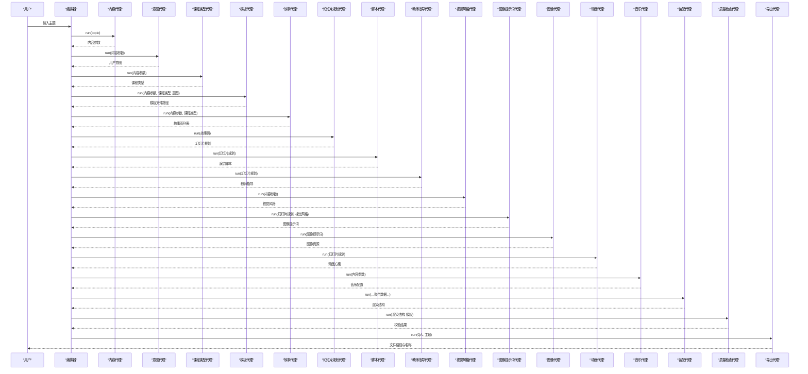
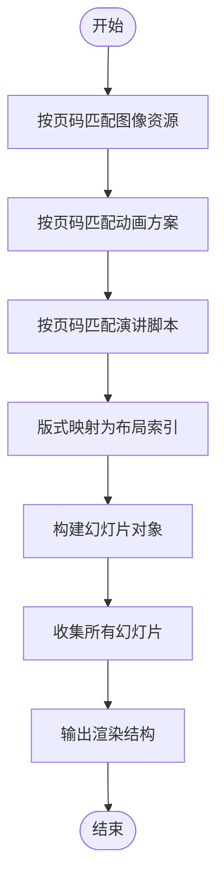
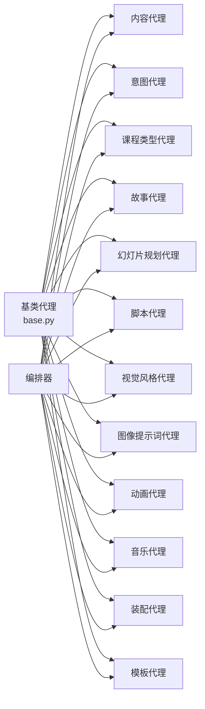

# 创意设计类代理

<cite>
**本文引用的文件**
- [backend/agents/base.py](file://backend/agents/base.py)
- [backend/agents/orchestrator.py](file://backend/agents/orchestrator.py)
- [backend/agents/content.py](file://backend/agents/content.py)
- [backend/agents/intent.py](file://backend/agents/intent.py)
- [backend/agents/course_type.py](file://backend/agents/course_type.py)
- [backend/agents/story.py](file://backend/agents/story.py)
- [backend/agents/slide_planner.py](file://backend/agents/slide_planner.py)
- [backend/agents/script_writer.py](file://backend/agents/script_writer.py)
- [backend/agents/teacher_guide.py](file://backend/agents/teacher_guide.py)
- [backend/agents/visual.py](file://backend/agents/visual.py)
- [backend/agents/image_prompt.py](file://backend/agents/image_prompt.py)
- [backend/agents/template.py](file://backend/agents/template.py)
- [backend/agents/assembler.py](file://backend/agents/assembler.py)
- [backend/agents/animation.py](file://backend/agents/animation.py)
- [backend/agents/music.py](file://backend/agents/music.py)
</cite>

## 目录
1. [简介](#简介)
2. [项目结构](#项目结构)
3. [核心组件](#核心组件)
4. [架构总览](#架构总览)
5. [详细组件分析](#详细组件分析)
6. [依赖分析](#依赖分析)
7. [性能考虑](#性能考虑)
8. [故障排查指南](#故障排查指南)
9. [结论](#结论)
10. [附录](#附录)

## 简介
本项目是一套面向创意设计与教学演示的AI代理系统，围绕“内容策划—故事化叙事—幻灯片规划—脚本写作—视觉风格—模板选择—素材生成—装配渲染—质量检查—导出”的端到端流水线展开。系统通过多个专业化代理协同工作，完成从主题到成品PPT的自动化生产，覆盖教学、汇报、推广、演讲等多种场景。

## 项目结构
后端采用“代理分层 + 流水线编排”的架构模式：
- 顶层编排器负责按序调用各代理，串联内容分析、故事化、幻灯片规划、脚本、风格、模板、图像提示词、图像、动画、音乐、装配、质检与导出。
- 基类代理统一提供模型对话与JSON解析能力，确保各代理职责清晰、接口一致。
- 模板选择基于主题关键词映射到预置模板目录中的具体模板文件。
- 装配器将多源数据整合为PPT渲染结构，供引擎渲染与导出。

```mermaid
graph TB
Orchestrator["编排器<br/>orchestrator.py"] --> Content["内容代理<br/>content.py"]
Orchestrator --> Intent["意图代理<br/>intent.py"]
Orchestrator --> CourseType["课程类型代理<br/>course_type.py"]
Orchestrator --> Template["模板代理<br/>template.py"]
Orchestrator --> Story["故事代理<br/>story.py"]
Orchestrator --> SlidePlanner["幻灯片规划代理<br/>slide_planner.py"]
Orchestrator --> ScriptWriter["脚本代理<br/>script_writer.py"]
Orchestrator --> TeacherGuide["教师指导代理<br/>teacher_guide.py"]
Orchestrator --> VisualStyle["视觉风格代理<br/>visual.py"]
Orchestrator --> ImagePrompt["图像提示词代理<br/>image_prompt.py"]
Orchestrator --> Image["图像代理<br/>image.py"]
Orchestrator --> Animation["动画代理<br/>animation.py"]
Orchestrator --> Music["音乐代理<br/>music.py"]
Orchestrator --> Assembler["装配代理<br/>assembler.py"]
Orchestrator --> QA["质量检查代理<br/>qa.py"]
Orchestrator --> Export["导出代理<br/>export.py"]
```

图表来源
- [backend/agents/orchestrator.py:19-56](file://backend/agents/orchestrator.py#L19-L56)

章节来源
- [backend/agents/orchestrator.py:19-56](file://backend/agents/orchestrator.py#L19-L56)

## 核心组件
- 基类代理 BaseAgent：封装系统提示词、模型调用与JSON解析，统一各代理的输入输出协议。
- 编排器 run_pipeline：定义完整的创意生成流水线，协调各代理执行顺序与数据传递。
- 内容/意图/课程类型代理：对主题进行多维抽象，形成后续创作的基础参数。
- 故事代理：将知识点转化为“起承转合”的课程故事线，为每页设定教学目标与情感基调。
- 幻灯片规划代理：将故事页转换为具体版式、内容模块与视觉布局方案。
- 脚本代理：为每页生成口语化、有节奏感的演讲脚本与时间标注。
- 视觉风格代理：输出整套PPT的配色、字体、图片风格与装饰风格。
- 模板代理：依据主题与课程类型选择合适的模板文件路径。
- 图像提示词代理：结合风格与页面内容生成高质量图像提示词。
- 装配代理：将幻灯片、脚本、图像、动画、风格、音乐等整合为渲染结构。
- 动画/音乐代理：分别输出页面过渡与元素入场动画方案及背景音乐配置。
- 教师指导代理：输出教师逐字稿、提问设计、活动组织与课堂管理建议。
- 质量检查与导出：对成品进行校验并输出最终文件。

章节来源
- [backend/agents/base.py:5-24](file://backend/agents/base.py#L5-L24)
- [backend/agents/orchestrator.py:19-56](file://backend/agents/orchestrator.py#L19-L56)

## 架构总览
系统采用“流水线 + 代理协作”架构，编排器作为入口，按固定顺序调用各代理；每个代理专注于单一创意任务，输出标准化JSON结构，便于后续装配与渲染。

图表来源
- [backend/agents/orchestrator.py:19-56](file://backend/agents/orchestrator.py#L19-L56)

## 详细组件分析

### 幻灯片规划代理（SlidePlannerAgent）
职责
- 将“故事页”转化为“幻灯片页”，明确版式、标题、教学目标、情感状态、视觉需求、内容要点、过渡语、图像关键词与排版备注。
- 输出每页2-4个精准图像关键词，用于后续图像搜索与生成。

创意算法与设计原则
- 版式选择：覆盖、章节、纯文本、图文、左右分栏、对比、时间轴、引言、总结等布局类型，与教学目标和情感状态相匹配。
- 内容模块化：每页提炼3-5个要点，确保信息密度与认知负荷平衡。
- 过渡语设计：保证页面间自然衔接，符合“起承转合”的叙事节奏。

输出格式规范
- 字段：页码、版式、标题、目标、情感、视觉需求、内容要点数组、过渡语、图像关键词数组、备注。
- 关键约束：图像关键词数量2-4个，确保检索与生成精度。

最佳实践
- 在“视觉需求”中明确风格倾向，便于图像提示词与视觉风格对齐。
- “过渡语”与“情感状态”需与前后页保持连贯，避免突兀跳转。

章节来源
- [backend/agents/slide_planner.py:5-32](file://backend/agents/slide_planner.py#L5-L32)

### 脚本写作代理（ScriptWriterAgent）
职责
- 为每页幻灯片生成口语化、有节奏感的演讲脚本，标注时长与强调词、停顿点，确保表达自然且富于感染力。

创意算法与设计原则
- 句式节奏：长短句搭配，配合停顿点营造呼吸感。
- 情感一致性：脚本情感基调与页面“情感状态”保持一致。
- 过渡衔接：相邻页脚本在主题与情感上自然承接。

输出格式规范
- 字段：页码、完整演讲词（200-400字）、时长（秒）、强调词数组、停顿点数组。

最佳实践
- 结合“过渡语”与“内容要点”，将知识点转化为可讲述的故事片段。
- 在强调词与停顿点处留白，便于录制与现场发挥。

章节来源
- [backend/agents/script_writer.py:5-25](file://backend/agents/script_writer.py#L5-L25)

### 视觉风格代理（VisualStyleAgent）
职责
- 定义整套PPT的视觉风格体系：主题名、主色/辅色/强调色/背景/文字、标题与正文字体、图片风格、装饰风格、情绪板关键词、封面风格描述。

创意算法与设计原则
- 配色体系：主色用于强调重要信息，辅色用于辅助元素，背景与文字色确保可读性。
- 字体搭配：标题字体突出个性，正文字体保证易读。
- 风格匹配：图片风格与装饰风格与主题、受众与情感基调一致。

输出格式规范
- 字段：主题名、颜色方案对象、字体对象、图片风格、装饰风格、情绪板、封面风格描述。

最佳实践
- 与“课程类型”和“情感基调”联动，确保风格与场景契合。
- 使用情绪板关键词指导图像与图标选择。

章节来源
- [backend/agents/visual.py:5-34](file://backend/agents/visual.py#L5-L34)

### 模板选择代理（TemplateAgent）
职责
- 基于主题、课程类型与意图，选择最合适的模板文件路径；若未命中则回退至通用讲稿模板。

模板适配逻辑
- 关键词映射：英语、语文、数学、信息/编程/AI/技术、教育等关键词映射到对应模板目录。
- 组合匹配：将主题、课程类型与意图目的拼接后进行关键词匹配。
- 回退策略：若无匹配，优先选择通用讲稿模板，确保流程可用性。

输出格式规范
- 返回模板文件绝对路径字符串，若无可用模板则返回空值。

最佳实践
- 在主题中尽量包含明确的学科或用途关键词，提高匹配准确度。
- 若模板缺失，需在部署时补齐相应模板文件。

章节来源
- [backend/agents/template.py:7-33](file://backend/agents/template.py#L7-L33)

### 装配代理（PPTAssemblerAgent）
职责
- 将幻灯片规划、脚本、图像、动画、风格、音乐与模板整合为渲染结构，供引擎渲染与导出。

处理逻辑
- 数据对齐：按页码将脚本、图像、动画进行匹配与归档。
- 版式映射：将语义版式映射为引擎可识别的布局索引。
- 结构化输出：输出样式、音乐、幻灯片数组与PPTX渲染Schema。

复杂度与性能
- 时间复杂度：O(N)（N为页数），主要为单次遍历与常数次查找。
- 空间复杂度：O(N)，存储结果幻灯片数组。

最佳实践
- 确保每页仅有一条脚本与最多两张图像（主图+背景）。
- 动画字段需与版式兼容，避免元素入场与布局冲突。

图表来源
- [backend/agents/assembler.py:16-89](file://backend/agents/assembler.py#L16-L89)

章节来源
- [backend/agents/assembler.py:4-89](file://backend/agents/assembler.py#L4-L89)

### 图像提示词代理（ImagePromptAgent）
职责
- 为每页生成适合SDXL与DALL-E 3的英文提示词，包含风格、构图、光线、氛围等要素，并给出中文参考与宽高比。

创意算法与设计原则
- 提示词结构：主体描述 + 风格 + 构图 + 光线 + 氛围 + 参考关键词。
- 多语言对照：英文提示词用于图像生成，中文参考用于理解与校对。
- 风格一致性：与视觉风格代理输出的图片风格、装饰风格保持一致。

输出格式规范
- 字段：页码、英文提示词、中文提示词参考、风格标签、宽高比、参考关键词。

最佳实践
- 在“参考关键词”中引用页面的图像关键词，提升检索与生成的一致性。
- 控制提示词长度与复杂度，避免过度冗余导致生成偏差。

章节来源
- [backend/agents/image_prompt.py:5-29](file://backend/agents/image_prompt.py#L5-L29)

### 动画代理（AnimationAgent）
职责
- 为每页设计页面过渡动画与元素入场动画，匹配内容与情感状态。

创意算法与设计原则
- 动画类型：页面过渡（如渐隐、平滑过渡、推移、揭示）与元素入场（淡入、自底部飞入、缩放、浮动、分割）。
- 情感匹配：封面用平滑过渡，情感高潮用揭示，知识点用揭示以突出信息密度。
- 时间分配：合理设置过渡时长与元素延迟，确保节奏自然。

输出格式规范
- 字段：页码、页面过渡动画、过渡时长、元素动画数组（含元素标识、动画类型、延迟、时长）、设计说明。

最佳实践
- 元素动画与内容模块一一对应，避免过多动画造成干扰。
- 控制动画数量与强度，兼顾流畅性与可读性。

章节来源
- [backend/agents/animation.py:5-35](file://backend/agents/animation.py#L5-L35)

### 音乐代理（MusicAgent）
职责
- 根据主题与情感曲线选择合适的背景音乐方案，提供音源URL与播放参数。

创意算法与设计原则
- 情绪匹配：音乐情绪与页面情感状态一致，如温暖鼓励、专业严谨、激情澎湃、幽默风趣。
- 播放策略：可跨页播放，控制音量与起始页，避免喧宾夺主。

输出格式规范
- 字段：是否启用音乐、音源类型、曲目编号、曲目URL、音量、跨页播放、起始页、音乐情绪描述、说明。

最佳实践
- 优先使用免费资源，确保版权合规。
- 根据主题与受众选择合适风格的曲目，避免与画面风格冲突。

章节来源
- [backend/agents/music.py:5-29](file://backend/agents/music.py#L5-L29)

### 教师指导代理（TeacherGuideAgent）
职责
- 为每页生成教师逐字稿、提问设计、学生活动、时间分配与课堂管理建议，体现商业版核心价值。

创意算法与设计原则
- 逐字稿：包含开场引导、知识点讲解、提问衔接与总结提升。
- 提问设计：区分开放与封闭式，匹配学习目标与认知水平。
- 活动组织：设计互动环节与课堂管理策略，提升参与度。

输出格式规范
- 字段：页码、教师逐字稿、提问数组（含问题、预期答案、类型）、学生活动、时间分配、教学小贴士、课堂管理建议。

最佳实践
- 将提问与页面内容紧密关联，避免脱离主题。
- 明确时间分配，确保课堂节奏可控。

章节来源
- [backend/agents/teacher_guide.py:5-29](file://backend/agents/teacher_guide.py#L5-L29)

## 依赖分析
- 组件耦合
  - 编排器对所有代理存在直接依赖，是系统的控制中心。
  - 装配代理依赖幻灯片规划、脚本、图像、动画、风格、音乐与模板的输出结构。
  - 模板代理依赖模板目录的存在性，需确保部署时模板文件齐全。
- 外部依赖
  - 基类代理通过统一模型接口调用大模型服务，输出严格限制为JSON。
  - 导出代理依赖引擎与媒体服务生成最终文件，需关注文件路径与权限。

图表来源
- [backend/agents/orchestrator.py:1-16](file://backend/agents/orchestrator.py#L1-L16)
- [backend/agents/base.py:5-24](file://backend/agents/base.py#L5-L24)

章节来源
- [backend/agents/orchestrator.py:1-16](file://backend/agents/orchestrator.py#L1-L16)
- [backend/agents/base.py:5-24](file://backend/agents/base.py#L5-L24)

## 性能考虑
- JSON解析与模型调用
  - 基类代理统一限制输出为JSON，减少解析歧义与错误重试成本。
  - 合理设置温度与模型参数，平衡创造性与稳定性。
- 数据对齐与遍历
  - 装配阶段按页码匹配，采用一次遍历与常数次查找，整体复杂度低。
- 模板加载
  - 模板代理在启动时进行路径拼接与存在性检查，建议缓存模板目录扫描结果以降低IO开销。
- 并发与批处理
  - 对图像提示词与图像生成可采用批处理策略，提升吞吐量；注意控制单批次大小与并发度，避免资源瓶颈。

## 故障排查指南
- 模板未命中
  - 现象：返回空模板路径。
  - 排查：确认主题关键词是否包含预设映射中的关键字；检查模板目录是否存在默认模板文件。
  - 参考
    - [backend/agents/template.py:22-30](file://backend/agents/template.py#L22-L30)
- JSON解析失败
  - 现象：模型返回非标准JSON或夹杂多余文本。
  - 排查：确认代理提示词中明确要求仅输出JSON；检查模型响应前缀与后缀清理逻辑。
  - 参考
    - [backend/agents/base.py:20-24](file://backend/agents/base.py#L20-L24)
- 装配数据不一致
  - 现象：某页缺少脚本、图像或动画。
  - 排查：核对页码一致性；检查上游代理输出是否包含该页；确认匹配逻辑是否正确。
  - 参考
    - [backend/agents/assembler.py:33-46](file://backend/agents/assembler.py#L33-L46)
- 音乐/图像资源不可用
  - 现象：导出时无法访问音源或图像资源。
  - 排查：验证URL可达性与跨域策略；检查网络环境与代理设置。
  - 参考
    - [backend/agents/music.py:17-27](file://backend/agents/music.py#L17-L27)

章节来源
- [backend/agents/template.py:22-30](file://backend/agents/template.py#L22-L30)
- [backend/agents/base.py:20-24](file://backend/agents/base.py#L20-L24)
- [backend/agents/assembler.py:33-46](file://backend/agents/assembler.py#L33-L46)
- [backend/agents/music.py:17-27](file://backend/agents/music.py#L17-L27)

## 结论
本系统通过多代理协作与严格的JSON输出规范，实现了从主题到成品PPT的高效自动化生产。各代理职责清晰、接口统一，便于扩展与维护。建议在实际部署中重点关注模板完整性、资源可用性与输出一致性，持续优化创意算法与设计原则，以提升生成质量与用户体验。

## 附录
- 代码示例路径（不展示具体代码内容）
  - 幻灯片规划代理运行示例：[backend/agents/slide_planner.py:9-32](file://backend/agents/slide_planner.py#L9-L32)
  - 脚本写作代理运行示例：[backend/agents/script_writer.py:9-25](file://backend/agents/script_writer.py#L9-L25)
  - 视觉风格代理运行示例：[backend/agents/visual.py:9-34](file://backend/agents/visual.py#L9-L34)
  - 模板选择代理运行示例：[backend/agents/template.py:8-33](file://backend/agents/template.py#L8-L33)
  - 装配代理运行示例：[backend/agents/assembler.py:16-89](file://backend/agents/assembler.py#L16-L89)
  - 图像提示词代理运行示例：[backend/agents/image_prompt.py:9-29](file://backend/agents/image_prompt.py#L9-L29)
  - 动画代理运行示例：[backend/agents/animation.py:9-35](file://backend/agents/animation.py#L9-L35)
  - 音乐代理运行示例：[backend/agents/music.py:9-29](file://backend/agents/music.py#L9-L29)
  - 教师指导代理运行示例：[backend/agents/teacher_guide.py:9-29](file://backend/agents/teacher_guide.py#L9-L29)
  - 编排器流水线示例：[backend/agents/orchestrator.py:19-56](file://backend/agents/orchestrator.py#L19-L56)