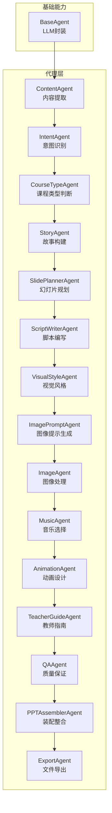
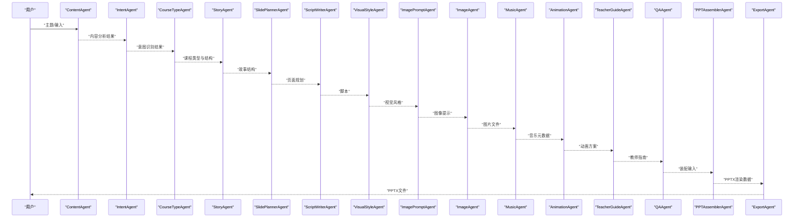
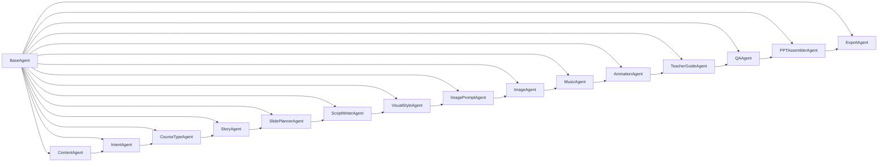

# 单个代理详解

<cite>
**本文引用的文件**
- [backend/agents/base.py](file://backend/agents/base.py)
- [backend/agents/content.py](file://backend/agents/content.py)
- [backend/agents/intent.py](file://backend/agents/intent.py)
- [backend/agents/course_type.py](file://backend/agents/course_type.py)
- [backend/agents/story.py](file://backend/agents/story.py)
- [backend/agents/slide_planner.py](file://backend/agents/slide_planner.py)
- [backend/agents/script_writer.py](file://backend/agents/script_writer.py)
- [backend/agents/visual.py](file://backend/agents/visual.py)
- [backend/agents/image_prompt.py](file://backend/agents/image_prompt.py)
- [backend/agents/image.py](file://backend/agents/image.py)
- [backend/agents/music.py](file://backend/agents/music.py)
- [backend/agents/animation.py](file://backend/agents/animation.py)
- [backend/agents/teacher_guide.py](file://backend/agents/teacher_guide.py)
- [backend/agents/qa.py](file://backend/agents/qa.py)
- [backend/agents/assembler.py](file://backend/agents/assembler.py)
- [backend/agents/export.py](file://backend/agents/export.py)
</cite>

## 目录
1. [简介](#简介)
2. [项目结构](#项目结构)
3. [核心组件](#核心组件)
4. [架构总览](#架构总览)
5. [详细组件分析](#详细组件分析)
6. [依赖关系分析](#依赖关系分析)
7. [性能考量](#性能考量)
8. [故障排查指南](#故障排查指南)
9. [结论](#结论)
10. [附录](#附录)

## 简介
本文件面向单个AI代理，系统性梳理并解读各代理的功能职责、输入输出、参数配置、异常处理与性能特征。覆盖从内容抽取到最终PPT装配导出的完整链路，包括：ContentAgent、IntentAgent、CourseTypeAgent、StoryAgent、SlidePlannerAgent、ScriptWriterAgent、VisualStyleAgent、ImagePromptAgent、ImageAgent、MusicAgent、AnimationAgent、TeacherGuideAgent、QAAgent、PPTAssemblerAgent、ExportAgent、TemplateAgent（由外部模板市场提供，此处作为集成点说明）。文档以“可操作”的方式呈现，便于开发者快速定位实现位置与调用路径。

## 项目结构
后端采用按“代理”分层的模块化设计，每个代理专注单一职责并通过统一的BaseAgent封装通用的LLM交互能力；最终由ExportAgent负责PPTX文件生成，PPTAssemblerAgent完成结构化数据装配。

图表来源
- [backend/agents/base.py:1-24](file://backend/agents/base.py#L1-L24)
- [backend/agents/content.py:1-21](file://backend/agents/content.py#L1-L21)
- [backend/agents/intent.py:1-21](file://backend/agents/intent.py#L1-L21)
- [backend/agents/course_type.py:1-27](file://backend/agents/course_type.py#L1-L27)
- [backend/agents/story.py:1-31](file://backend/agents/story.py#L1-L31)
- [backend/agents/slide_planner.py:1-32](file://backend/agents/slide_planner.py#L1-L32)
- [backend/agents/script_writer.py:1-25](file://backend/agents/script_writer.py#L1-L25)
- [backend/agents/visual.py:1-34](file://backend/agents/visual.py#L1-L34)
- [backend/agents/image_prompt.py:1-29](file://backend/agents/image_prompt.py#L1-L29)
- [backend/agents/image.py:1-41](file://backend/agents/image.py#L1-L41)
- [backend/agents/music.py:1-29](file://backend/agents/music.py#L1-L29)
- [backend/agents/animation.py:1-35](file://backend/agents/animation.py#L1-L35)
- [backend/agents/teacher_guide.py:1-29](file://backend/agents/teacher_guide.py#L1-L29)
- [backend/agents/qa.py:1-28](file://backend/agents/qa.py#L1-L28)
- [backend/agents/assembler.py:1-89](file://backend/agents/assembler.py#L1-L89)
- [backend/agents/export.py:1-65](file://backend/agents/export.py#L1-L65)

章节来源
- [backend/agents/base.py:1-24](file://backend/agents/base.py#L1-L24)
- [backend/agents/content.py:1-21](file://backend/agents/content.py#L1-L21)
- [backend/agents/intent.py:1-21](file://backend/agents/intent.py#L1-L21)
- [backend/agents/course_type.py:1-27](file://backend/agents/course_type.py#L1-L27)
- [backend/agents/story.py:1-31](file://backend/agents/story.py#L1-L31)
- [backend/agents/slide_planner.py:1-32](file://backend/agents/slide_planner.py#L1-L32)
- [backend/agents/script_writer.py:1-25](file://backend/agents/script_writer.py#L1-L25)
- [backend/agents/visual.py:1-34](file://backend/agents/visual.py#L1-L34)
- [backend/agents/image_prompt.py:1-29](file://backend/agents/image_prompt.py#L1-L29)
- [backend/agents/image.py:1-41](file://backend/agents/image.py#L1-L41)
- [backend/agents/music.py:1-29](file://backend/agents/music.py#L1-L29)
- [backend/agents/animation.py:1-35](file://backend/agents/animation.py#L1-L35)
- [backend/agents/teacher_guide.py:1-29](file://backend/agents/teacher_guide.py#L1-L29)
- [backend/agents/qa.py:1-28](file://backend/agents/qa.py#L1-L28)
- [backend/agents/assembler.py:1-89](file://backend/agents/assembler.py#L1-L89)
- [backend/agents/export.py:1-65](file://backend/agents/export.py#L1-L65)

## 核心组件
- BaseAgent：封装系统提示词、模型与温度参数，提供chat与json_output两类通用接口，统一LLM调用与JSON解析流程。
- 各具体代理：在各自run方法中接收上游传入的数据结构，产出下游所需的标准化JSON结构，形成“数据契约”。

章节来源
- [backend/agents/base.py:5-24](file://backend/agents/base.py#L5-L24)

## 架构总览
下图展示了典型工作流：从主题输入开始，经内容抽取、意图识别、课程类型判定、故事构建、页面规划、脚本撰写、视觉风格、图像提示、图像抓取、音乐与动画、教师指南、质量审核，最终装配并导出PPTX。

图表来源
- [backend/agents/content.py:7-21](file://backend/agents/content.py#L7-L21)
- [backend/agents/intent.py:8-21](file://backend/agents/intent.py#L8-L21)
- [backend/agents/course_type.py:8-27](file://backend/agents/course_type.py#L8-L27)
- [backend/agents/story.py:8-31](file://backend/agents/story.py#L8-L31)
- [backend/agents/slide_planner.py:9-32](file://backend/agents/slide_planner.py#L9-L32)
- [backend/agents/script_writer.py:9-25](file://backend/agents/script_writer.py#L9-L25)
- [backend/agents/visual.py:9-34](file://backend/agents/visual.py#L9-L34)
- [backend/agents/image_prompt.py:9-29](file://backend/agents/image_prompt.py#L9-L29)
- [backend/agents/image.py:10-41](file://backend/agents/image.py#L10-L41)
- [backend/agents/music.py:9-29](file://backend/agents/music.py#L9-L29)
- [backend/agents/animation.py:9-35](file://backend/agents/animation.py#L9-L35)
- [backend/agents/teacher_guide.py:9-29](file://backend/agents/teacher_guide.py#L9-L29)
- [backend/agents/qa.py:8-28](file://backend/agents/qa.py#L8-L28)
- [backend/agents/assembler.py:16-89](file://backend/agents/assembler.py#L16-L89)
- [backend/agents/export.py:11-65](file://backend/agents/export.py#L11-L65)

## 详细组件分析

### ContentAgent（内容提取与处理）
- 职责：对用户输入的主题进行深度内容分析，抽取课程类型、受众、关键点、页数估算、情感基调与适用场景。
- 输入：字符串主题topic。
- 输出：字典，包含topic、type、level、audience、key_points、estimated_pages、emotion_tone、scenario等键。
- 关键实现点：
  - 继承BaseAgent，使用json_output约束LLM输出为JSON。
  - 在run中构造结构化提示词，限定输出字段集合。
- 参数配置：继承自BaseAgent的system_prompt、model、temperature。
- 异常处理：json_output内部会剥离代码块标记并尝试解析，若解析失败则抛出异常；调用方需捕获并处理。
- 性能特征：一次LLM调用，耗时取决于网络与模型响应；建议批量任务时合并请求或使用缓存。

章节来源
- [backend/agents/content.py:4-21](file://backend/agents/content.py#L4-L21)
- [backend/agents/base.py:20-24](file://backend/agents/base.py#L20-L24)

### IntentAgent（意图识别）
- 职责：基于ContentAgent的结果，识别用户生成PPT的主次意图、痛点与成功标准。
- 输入：ContentAgent输出的dict。
- 输出：字典，包含primary_intent、secondary_intent、pain_points、success_criteria。
- 实现要点：将上游内容序列化后注入提示词，确保上下文一致。
- 参数配置：同BaseAgent。
- 异常处理：同上。
- 性能特征：轻量LLM调用，延迟低。

章节来源
- [backend/agents/intent.py:5-21](file://backend/agents/intent.py#L5-L21)
- [backend/agents/base.py:20-24](file://backend/agents/base.py#L20-L24)

### CourseTypeAgent（课程类型判断）
- 职责：识别最适合的课程类型、教学方法、结构、页数分布与互动设计。
- 输入：ContentAgent输出的dict。
- 输出：字典，包含course_type、teaching_method、structure、page_distribution、interaction_design。
- 实现要点：通过JSON数组/对象组合返回复杂结构，便于后续StoryAgent消费。
- 参数配置：同BaseAgent。
- 异常处理：同上。
- 性能特征：中等规模JSON输出，耗时适中。

章节来源
- [backend/agents/course_type.py:5-27](file://backend/agents/course_type.py#L5-L27)
- [backend/agents/base.py:20-24](file://backend/agents/base.py#L20-L24)

### StoryAgent（故事构建）
- 职责：将知识点融入“起承转合”的叙事结构，为每页设计教学目标、情感状态、视觉需求、内容大纲与过渡语。
- 输入：ContentAgent与CourseTypeAgent的输出。
- 输出：列表，每项代表一页的结构化故事信息。
- 实现要点：结合课程类型与受众，控制页数与节奏。
- 参数配置：同BaseAgent。
- 异常处理：同上。
- 性能特征：中等规模JSON数组输出。

章节来源
- [backend/agents/story.py:4-31](file://backend/agents/story.py#L4-L31)
- [backend/agents/base.py:20-24](file://backend/agents/base.py#L20-L24)

### SlidePlannerAgent（幻灯片规划）
- 职责：将故事结构转化为具体的页面排版、内容模块与视觉布局方案，输出image_keywords供图像检索。
- 输入：StoryAgent输出的列表。
- 输出：列表，每项包含page_number、layout、title、goal、emotion、visual_need、content、narrative、image_keywords、notes。
- 实现要点：限定布局类型集合，强制每页2-4个关键词，提高图像检索精度。
- 参数配置：同BaseAgent。
- 异常处理：同上。
- 性能特征：中等规模JSON数组输出。

章节来源
- [backend/agents/slide_planner.py:5-32](file://backend/agents/slide_planner.py#L5-L32)
- [backend/agents/base.py:20-24](file://backend/agents/base.py#L20-L24)

### ScriptWriterAgent（脚本编写）
- 职责：为每页PPT撰写自然流畅的演讲脚本，标注时长、强调词与停顿点。
- 输入：SlidePlannerAgent输出的列表。
- 输出：列表，每项包含page_number、speech、timing_seconds、emphasis_words、pause_points。
- 实现要点：关注页面间过渡与口语化表达。
- 参数配置：同BaseAgent。
- 异常处理：同上。
- 性能特征：中等规模JSON数组输出。

章节来源
- [backend/agents/script_writer.py:5-25](file://backend/agents/script_writer.py#L5-L25)
- [backend/agents/base.py:20-24](file://backend/agents/base.py#L20-L24)

### VisualStyleAgent（视觉风格确定）
- 职责：定义整套PPT的视觉风格体系，包括配色、字体、图片风格、装饰风格与封面设计。
- 输入：ContentAgent输出的dict。
- 输出：字典，包含theme_name、color_scheme、fonts、image_style、decoration_style、mood_board、cover_style。
- 实现要点：输出完整的风格规范，供后续ImagePromptAgent与PPTAssemblerAgent使用。
- 参数配置：同BaseAgent。
- 异常处理：同上。
- 性能特征：小规模JSON输出。

章节来源
- [backend/agents/visual.py:5-34](file://backend/agents/visual.py#L5-L34)
- [backend/agents/base.py:20-24](file://backend/agents/base.py#L20-L24)

### ImagePromptAgent（图像提示生成）
- 职责：为每页PPT生成AI图像生成提示词，包含风格、构图、光线、氛围等要素。
- 输入：SlidePlannerAgent输出的列表与VisualStyleAgent输出的dict。
- 输出：列表，每项包含page_number、prompt_en、prompt_cn、style、aspect_ratio、reference。
- 实现要点：结合风格与页面关键词，确保提示词可被SDXL/DALL-E 3理解。
- 参数配置：同BaseAgent。
- 异常处理：同上。
- 性能特征：中等规模JSON数组输出。

章节来源
- [backend/agents/image_prompt.py:5-29](file://backend/agents/image_prompt.py#L5-L29)
- [backend/agents/base.py:20-24](file://backend/agents/base.py#L20-L24)

### ImageAgent（图像处理）
- 职责：根据提示词抓取图片，保存至本地目录，返回文件路径与状态。
- 输入：ImagePromptAgent输出的列表。
- 输出：列表，每项包含page_number、file_path、status或error。
- 实现要点：并发下载，使用bing_image_downloader；异常捕获并记录；限制关键词长度避免API限流。
- 参数配置：硬编码输出目录（需结合部署环境调整）。
- 异常处理：对单个下载任务独立try-except，避免整体失败；返回错误信息。
- 性能特征：IO密集型，受网络与第三方服务影响；并发可显著提升吞吐。

章节来源
- [backend/agents/image.py:7-41](file://backend/agents/image.py#L7-L41)

### MusicAgent（音乐选择）
- 职责：为PPT选择背景音乐方案，包含音源、音量、跨页播放策略与情绪匹配。
- 输入：ContentAgent输出的dict。
- 输出：字典，包含has_music、source、track_number、track_url、volume、play_across_slides、start_slide、mood_match、notes。
- 实现要点：基于SoundHelix免费资源生成URL。
- 参数配置：同BaseAgent。
- 异常处理：同上。
- 性能特征：小规模JSON输出。

章节来源
- [backend/agents/music.py:5-29](file://backend/agents/music.py#L5-L29)
- [backend/agents/base.py:20-24](file://backend/agents/base.py#L20-L24)

### AnimationAgent（动画设计）
- 职责：为每页PPT设计页面切换动画与元素入场动画，匹配内容与情感状态。
- 输入：SlidePlannerAgent输出的列表。
- 输出：列表，每项包含page_number、transition、transition_duration、elements、notes。
- 实现要点：限定动画类型选项，提供设计说明与推荐策略。
- 参数配置：同BaseAgent。
- 异常处理：同上。
- 性能特征：小规模JSON数组输出。

章节来源
- [backend/agents/animation.py:5-35](file://backend/agents/animation.py#L5-L35)
- [backend/agents/base.py:20-24](file://backend/agents/base.py#L20-L24)

### TeacherGuideAgent（教师指南生成）
- 职责：为每页PPT生成教师引导语教案，包含提问设计、学生活动、时间分配与课堂管理建议。
- 输入：SlidePlannerAgent输出的列表。
- 输出：列表，每项包含page_number、teacher_script、questions、student_activity、time_allocation、tips、classroom_management。
- 实现要点：面向教学落地，强调可执行性。
- 参数配置：同BaseAgent。
- 异常处理：同上。
- 性能特征：中等规模JSON数组输出。

章节来源
- [backend/agents/teacher_guide.py:5-29](file://backend/agents/teacher_guide.py#L5-L29)
- [backend/agents/base.py:20-24](file://backend/agents/base.py#L20-L24)

### QAAgent（质量保证）
- 职责：检查PPT结构完整性、内容连贯性与视觉一致性，发现并报告问题。
- 输入：装配后的PPT数据与模板信息。
- 输出：字典，包含passed、issues、total_slides与回传的ppt_data。
- 实现要点：校验空幻灯片、标题缺失、内容为空等常见问题。
- 参数配置：无。
- 异常处理：无显式异常，返回结构化问题清单。
- 性能特征：纯逻辑检查，开销极低。

章节来源
- [backend/agents/qa.py:4-28](file://backend/agents/qa.py#L4-L28)

### PPTAssemblerAgent（装配整合）
- 职责：将各代理产物整合为PPT渲染结构，建立页面与图片、动画、脚本的映射关系。
- 输入：slides、scripts、images、animations、style、music、template。
- 输出：字典，包含style、music、slides与pptx_schema（含template、theme、slides）。
- 实现要点：通过page_number关联多源数据；将布局名映射为索引；组装image与animation子结构。
- 参数配置：无。
- 异常处理：无显式异常，返回聚合后的结构。
- 性能特征：O(n)遍历与查找，性能稳定。

章节来源
- [backend/agents/assembler.py:4-89](file://backend/agents/assembler.py#L4-L89)

### ExportAgent（文件导出）
- 职责：将装配后的数据渲染为PPTX文件，支持模板加载与占位符填充。
- 输入：QAAgent输出（包含ppt_data）与topic。
- 输出：元组（文件路径, 文件名）。
- 实现要点：安全处理文件名；优先加载模板；逐页添加幻灯片并写入标题与内容；保存文件。
- 参数配置：依赖settings.output_dir（来自core.config.settings）。
- 异常处理：模板加载失败时降级为新建Presentation；对非整型/越界布局索引做容错。
- 性能特征：IO密集型，受模板与内容数量影响；建议异步或批处理优化。

章节来源
- [backend/agents/export.py:10-65](file://backend/agents/export.py#L10-L65)

### TemplateAgent（模板选择）
- 职责：从模板市场加载模板文件，作为ExportAgent的输入之一。
- 输入：无（运行时从模板市场读取）。
- 输出：模板文件路径（供ExportAgent使用）。
- 实现要点：作为外部集成点，不直接参与LLM推理。
- 参数配置：无。
- 异常处理：模板不存在时由ExportAgent降级处理。
- 性能特征：IO与静态资源加载，开销低。

章节来源
- [backend/agents/export.py:20-32](file://backend/agents/export.py#L20-L32)

## 依赖关系分析

图表来源
- [backend/agents/base.py:5-24](file://backend/agents/base.py#L5-L24)
- [backend/agents/content.py:4-21](file://backend/agents/content.py#L4-L21)
- [backend/agents/intent.py:5-21](file://backend/agents/intent.py#L5-L21)
- [backend/agents/course_type.py:5-27](file://backend/agents/course_type.py#L5-L27)
- [backend/agents/story.py:4-31](file://backend/agents/story.py#L4-L31)
- [backend/agents/slide_planner.py:5-32](file://backend/agents/slide_planner.py#L5-L32)
- [backend/agents/script_writer.py:5-25](file://backend/agents/script_writer.py#L5-L25)
- [backend/agents/visual.py:5-34](file://backend/agents/visual.py#L5-L34)
- [backend/agents/image_prompt.py:5-29](file://backend/agents/image_prompt.py#L5-L29)
- [backend/agents/image.py:7-41](file://backend/agents/image.py#L7-L41)
- [backend/agents/music.py:5-29](file://backend/agents/music.py#L5-L29)
- [backend/agents/animation.py:5-35](file://backend/agents/animation.py#L5-L35)
- [backend/agents/teacher_guide.py:5-29](file://backend/agents/teacher_guide.py#L5-L29)
- [backend/agents/qa.py:4-28](file://backend/agents/qa.py#L4-L28)
- [backend/agents/assembler.py:4-89](file://backend/agents/assembler.py#L4-L89)
- [backend/agents/export.py:10-65](file://backend/agents/export.py#L10-L65)

## 性能考量
- LLM调用成本：ContentAgent、IntentAgent、CourseTypeAgent、StoryAgent、SlidePlannerAgent、ScriptWriterAgent、VisualStyleAgent、ImagePromptAgent、MusicAgent、AnimationAgent、TeacherGuideAgent均为一次或少量LLM调用，建议：
  - 合理设置temperature以平衡创造性与稳定性。
  - 对重复主题进行缓存，减少重复推理。
- 图像抓取：ImageAgent并发下载，建议：
  - 控制并发度，避免触发第三方服务限流。
  - 预先清洗关键词，缩短长度。
- 导出阶段：ExportAgent逐页渲染，建议：
  - 使用模板可减少布局计算。
  - 大量内容时分批写入，降低内存峰值。
- 质量审核：QAAgent为纯逻辑检查，几乎无性能负担。

## 故障排查指南
- JSON解析失败：检查json_output是否正确剥离代码块标记并解析；必要时打印原始回复进行调试。
- 图像抓取失败：确认关键词长度与合法性；检查网络与第三方服务可用性；查看返回的error字段。
- 模板加载失败：ExportAgent已做降级处理，可忽略；若需强制使用模板，请检查模板路径与文件有效性。
- 布局索引异常：ExportAgent对越界布局做了容错，但建议上游严格控制布局类型与索引映射。
- 并发异常：ImageAgent对单任务独立捕获异常，整体仍可能因部分失败而返回混合结果，需在调用方汇总处理。

章节来源
- [backend/agents/base.py:20-24](file://backend/agents/base.py#L20-L24)
- [backend/agents/image.py:35-41](file://backend/agents/image.py#L35-L41)
- [backend/agents/export.py:24-32](file://backend/agents/export.py#L24-L32)
- [backend/agents/export.py:37-38](file://backend/agents/export.py#L37-L38)

## 结论
该系统以“代理即服务”的思想将PPT生成拆解为多个可独立演进的智能体，通过标准化的输入输出与统一的LLM封装，实现了从内容到成品的自动化流水线。建议在生产环境中：
- 明确各代理的边界与契约，避免耦合。
- 加强监控与日志，尤其是LLM与外部服务的调用链。
- 针对热点路径（LLM、图像抓取、PPTX导出）进行性能优化与容量规划。

## 附录
- 使用场景示例（路径指引）：
  - 主题驱动的内容抽取：[backend/agents/content.py:7-21](file://backend/agents/content.py#L7-L21)
  - 教学设计与故事化构建：[backend/agents/story.py:8-31](file://backend/agents/story.py#L8-L31)
  - 视觉风格与图像提示：[backend/agents/visual.py:9-34](file://backend/agents/visual.py#L9-L34)、[backend/agents/image_prompt.py:9-29](file://backend/agents/image_prompt.py#L9-L29)
  - 动画与音乐：[backend/agents/animation.py:9-35](file://backend/agents/animation.py#L9-L35)、[backend/agents/music.py:9-29](file://backend/agents/music.py#L9-L29)
  - 装配与导出：[backend/agents/assembler.py:16-89](file://backend/agents/assembler.py#L16-L89)、[backend/agents/export.py:11-65](file://backend/agents/export.py#L11-L65)