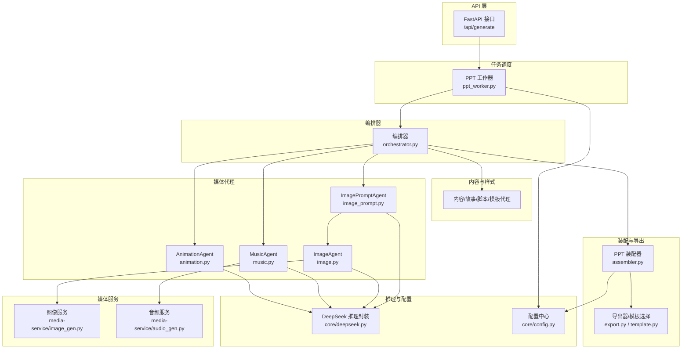
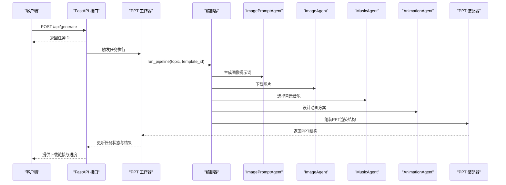
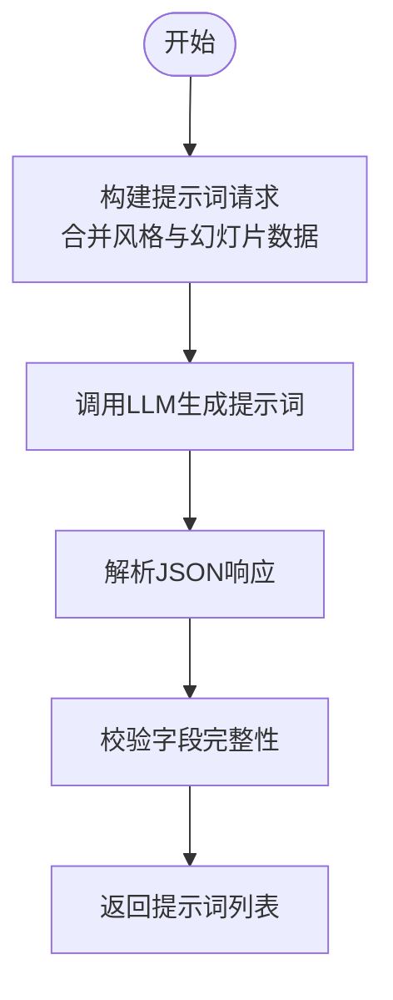
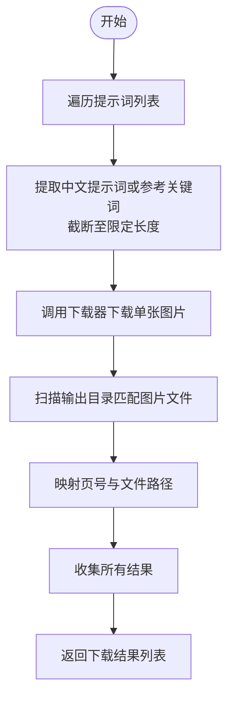
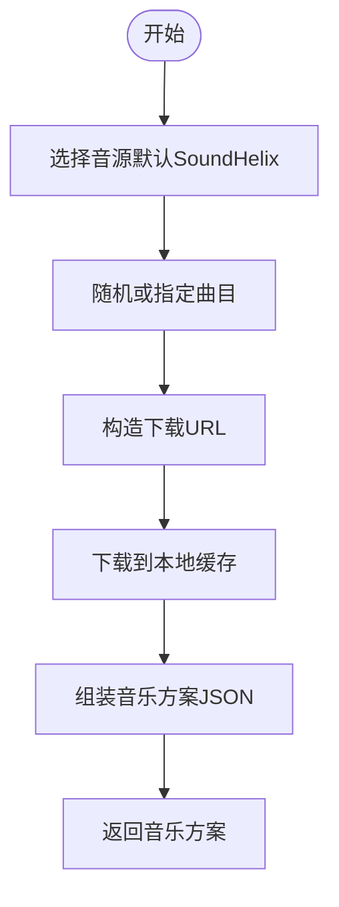
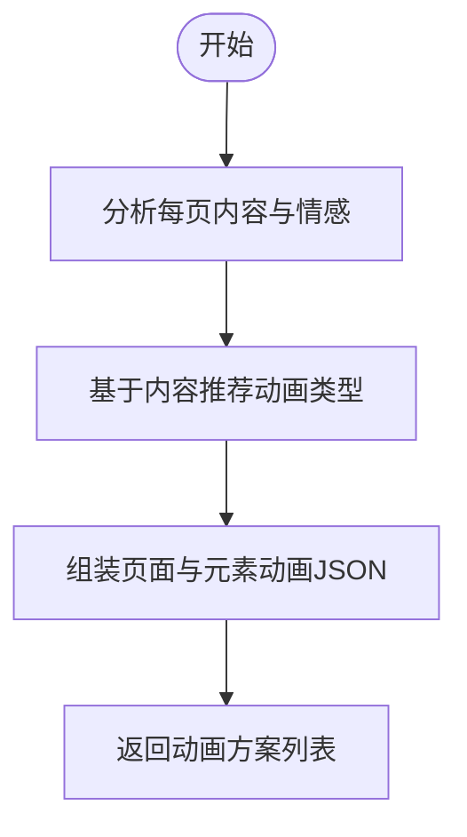
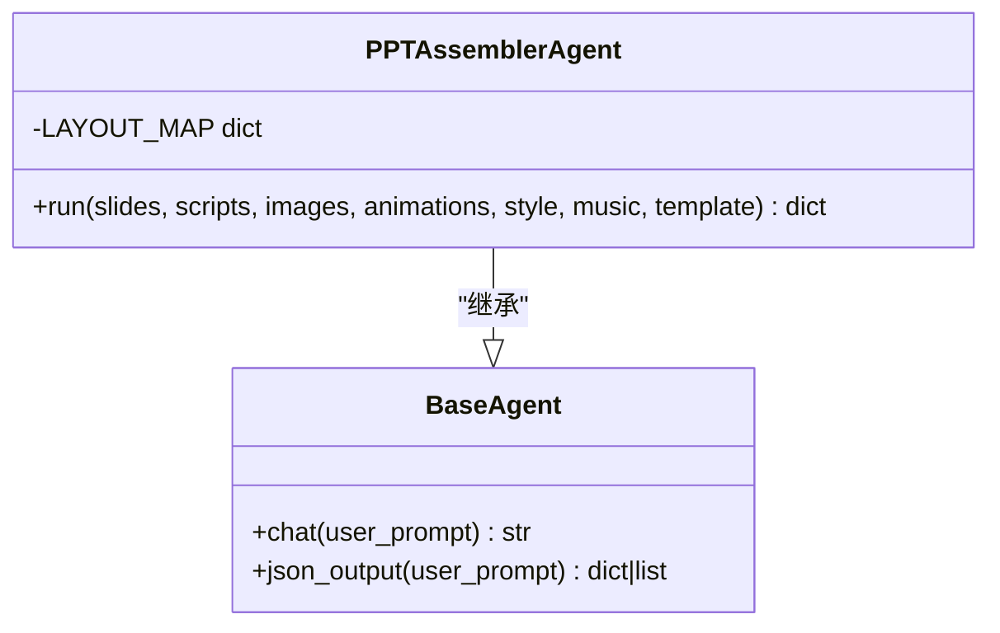
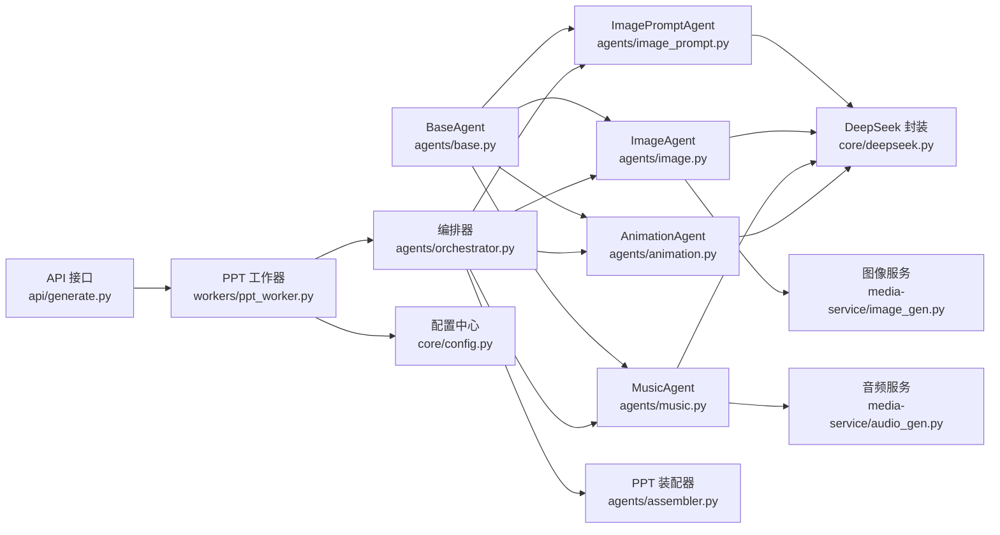

# 媒体处理类代理

<cite>
**本文引用的文件**
- [backend/agents/image_prompt.py](file://backend/agents/image_prompt.py)
- [backend/agents/image.py](file://backend/agents/image.py)
- [backend/agents/music.py](file://backend/agents/music.py)
- [backend/agents/animation.py](file://backend/agents/animation.py)
- [backend/agents/base.py](file://backend/agents/base.py)
- [backend/agents/assembler.py](file://backend/agents/assembler.py)
- [backend/agents/template.py](file://backend/agents/template.py)
- [backend/agents/orchestrator.py](file://backend/agents/orchestrator.py)
- [backend/core/deepseek.py](file://backend/core/deepseek.py)
- [backend/core/config.py](file://backend/core/config.py)
- [backend/workers/ppt_worker.py](file://backend/workers/ppt_worker.py)
- [backend/api/generate.py](file://backend/api/generate.py)
- [media-service/image_gen.py](file://media-service/image_gen.py)
- [media-service/audio_gen.py](file://media-service/audio_gen.py)
</cite>

## 目录
1. [简介](#简介)
2. [项目结构](#项目结构)
3. [核心组件](#核心组件)
4. [架构总览](#架构总览)
5. [详细组件分析](#详细组件分析)
6. [依赖分析](#依赖分析)
7. [性能考虑](#性能考虑)
8. [故障排查指南](#故障排查指南)
9. [结论](#结论)
10. [附录](#附录)

## 简介
本技术文档聚焦于媒体处理类AI代理在PPT自动化生成流水线中的作用与实现，重点覆盖以下代理的功能与实现细节：
- ImagePromptAgent：为每页PPT生成高质量图像提示词，确保与SDXL/DALL-E 3兼容的风格、构图、光线与氛围描述。
- ImageAgent：基于提示词检索并下载图片，产出可用于PPT的图像文件。
- MusicAgent：依据主题与情感曲线选择合适的背景音乐方案，支持免费音源。
- AnimationAgent：为每页PPT设计页面切换与元素入场动画，匹配内容与情感状态。

文档同时阐述媒体生成算法、资源管理策略、格式转换与质量控制机制，并给出媒体集成的最佳实践与排障建议。

## 项目结构
后端采用“代理分层 + 核心引擎”的组织方式，媒体相关能力由独立的媒体服务模块与各代理协作完成；前端通过FastAPI接口触发生成任务，后台以异步工作器执行完整流水线。

图表来源
- [backend/api/generate.py:1-52](file://backend/api/generate.py#L1-L52)
- [backend/workers/ppt_worker.py:1-24](file://backend/workers/ppt_worker.py#L1-L24)
- [backend/agents/orchestrator.py:1-56](file://backend/agents/orchestrator.py#L1-L56)
- [backend/agents/image_prompt.py:1-29](file://backend/agents/image_prompt.py#L1-L29)
- [backend/agents/image.py:1-41](file://backend/agents/image.py#L1-L41)
- [backend/agents/music.py:1-29](file://backend/agents/music.py#L1-L29)
- [backend/agents/animation.py:1-35](file://backend/agents/animation.py#L1-L35)
- [backend/agents/assembler.py:1-89](file://backend/agents/assembler.py#L1-L89)
- [backend/agents/template.py:1-33](file://backend/agents/template.py#L1-L33)
- [media-service/image_gen.py:1-26](file://media-service/image_gen.py#L1-L26)
- [media-service/audio_gen.py:1-34](file://media-service/audio_gen.py#L1-L34)
- [backend/core/deepseek.py:1-40](file://backend/core/deepseek.py#L1-L40)
- [backend/core/config.py:1-34](file://backend/core/config.py#L1-L34)

章节来源
- [backend/api/generate.py:1-52](file://backend/api/generate.py#L1-L52)
- [backend/workers/ppt_worker.py:1-24](file://backend/workers/ppt_worker.py#L1-L24)
- [backend/agents/orchestrator.py:1-56](file://backend/agents/orchestrator.py#L1-L56)

## 核心组件
- 基础代理基类 BaseAgent：统一系统提示词、模型与温度参数，提供通用聊天与JSON解析能力，屏蔽LLM调用细节。
- 编排器 Orchestrator：串联内容规划、脚本生成、样式设计、媒体生成与装配导出的完整流程。
- 媒体代理群：
  - ImagePromptAgent：面向图像生成的提示工程，强调风格、构图、光线与氛围。
  - ImageAgent：基于提示词检索图片，产出可直接嵌入PPT的文件路径。
  - MusicAgent：根据主题与情感曲线选择背景音乐方案，支持免费音源。
  - AnimationAgent：为每页PPT设计页面过渡与元素入场动画，匹配内容节奏。
- 媒体服务：
  - 图像服务：封装Bing图片下载器，按关键词与页码组织输出目录，支持并发抓取。
  - 音频服务：随机或指定曲目下载SoundHelix免费MP3，缓存到本地避免重复下载。
- 装配器 PPTAssemblerAgent：将多源媒体与内容整合为PPT渲染结构，映射布局索引、装配图片与动画元数据。
- 模板选择 TemplateAgent：基于主题与课程类型选择预置模板路径。

章节来源
- [backend/agents/base.py:1-24](file://backend/agents/base.py#L1-L24)
- [backend/agents/orchestrator.py:1-56](file://backend/agents/orchestrator.py#L1-L56)
- [backend/agents/image_prompt.py:1-29](file://backend/agents/image_prompt.py#L1-L29)
- [backend/agents/image.py:1-41](file://backend/agents/image.py#L1-L41)
- [backend/agents/music.py:1-29](file://backend/agents/music.py#L1-L29)
- [backend/agents/animation.py:1-35](file://backend/agents/animation.py#L1-L35)
- [media-service/image_gen.py:1-26](file://media-service/image_gen.py#L1-L26)
- [media-service/audio_gen.py:1-34](file://media-service/audio_gen.py#L1-L34)
- [backend/agents/assembler.py:1-89](file://backend/agents/assembler.py#L1-L89)
- [backend/agents/template.py:1-33](file://backend/agents/template.py#L1-L33)

## 架构总览
媒体处理类代理在整体流水线中承担“提示生成—检索下载—方案设计—装配渲染”的职责。下图展示从API到工作器、再到编排器与媒体代理的调用链路与数据流。

图表来源
- [backend/api/generate.py:1-52](file://backend/api/generate.py#L1-L52)
- [backend/workers/ppt_worker.py:1-24](file://backend/workers/ppt_worker.py#L1-L24)
- [backend/agents/orchestrator.py:1-56](file://backend/agents/orchestrator.py#L1-L56)
- [backend/agents/image_prompt.py:1-29](file://backend/agents/image_prompt.py#L1-L29)
- [backend/agents/image.py:1-41](file://backend/agents/image.py#L1-L41)
- [backend/agents/music.py:1-29](file://backend/agents/music.py#L1-L29)
- [backend/agents/animation.py:1-35](file://backend/agents/animation.py#L1-L35)
- [backend/agents/assembler.py:1-89](file://backend/agents/assembler.py#L1-L89)

## 详细组件分析

### ImagePromptAgent：图像提示生成
- 职责：为每页PPT生成面向AI图像生成器（如SDXL、DALL-E 3）的提示词，包含风格、构图、光线、氛围等要素。
- 输入：幻灯片列表与视觉风格字典。
- 输出：每页对应的英文提示词、中文参考、风格标签、宽高比与参考关键词。
- 实现要点：
  - 使用BaseAgent的JSON输出能力，约束LLM仅输出JSON。
  - 将风格与幻灯片数据拼接为用户提示，明确输出结构与字段。
  - 通过系统提示词引导生成符合演示场景的高质量提示词。

图表来源
- [backend/agents/image_prompt.py:1-29](file://backend/agents/image_prompt.py#L1-L29)
- [backend/agents/base.py:1-24](file://backend/agents/base.py#L1-L24)

章节来源
- [backend/agents/image_prompt.py:1-29](file://backend/agents/image_prompt.py#L1-L29)
- [backend/agents/base.py:1-24](file://backend/agents/base.py#L1-L24)

### ImageAgent：图像检索与下载
- 职责：根据提示词检索并下载图片，产出可用于PPT的文件路径。
- 输入：ImagePromptAgent生成的提示词列表。
- 输出：每页对应的图片文件路径与状态。
- 实现要点：
  - 并发下载：为每页提示词创建下载任务，使用gather聚合执行。
  - 关键词截断：限制关键词长度，避免检索超限。
  - 结果映射：按页号匹配下载结果，记录成功/失败状态。
  - 错误兜底：异常捕获并返回错误信息，保证流水线健壮性。

图表来源
- [backend/agents/image.py:1-41](file://backend/agents/image.py#L1-L41)
- [media-service/image_gen.py:1-26](file://media-service/image_gen.py#L1-L26)

章节来源
- [backend/agents/image.py:1-41](file://backend/agents/image.py#L1-L41)
- [media-service/image_gen.py:1-26](file://media-service/image_gen.py#L1-L26)

### MusicAgent：背景音乐选择
- 职责：根据主题与情感曲线选择合适的背景音乐方案，支持免费音源。
- 输入：内容摘要与主题信息。
- 输出：是否启用音乐、音源类型、曲目编号、URL、音量、跨页播放、起始页、情绪匹配与说明。
- 实现要点：
  - 使用固定范围的免费音源列表（SoundHelix），支持随机或指定曲目。
  - 通过LLM生成音乐方案的JSON结构，便于后续装配与播放控制。

图表来源
- [backend/agents/music.py:1-29](file://backend/agents/music.py#L1-L29)
- [media-service/audio_gen.py:1-34](file://media-service/audio_gen.py#L1-L34)

章节来源
- [backend/agents/music.py:1-29](file://backend/agents/music.py#L1-L29)
- [media-service/audio_gen.py:1-34](file://media-service/audio_gen.py#L1-L34)

### AnimationAgent：动画设计
- 职责：为每页PPT设计页面切换动画与元素入场动画，匹配内容与情感状态。
- 输入：幻灯片列表。
- 输出：每页的页面过渡动画、时长、元素级动画序列与设计说明。
- 实现要点：
  - 明确入场与过渡动画类型选项，结合内容节奏进行推荐。
  - 通过LLM生成标准化JSON，便于装配器映射到PPT渲染结构。

图表来源
- [backend/agents/animation.py:1-35](file://backend/agents/animation.py#L1-L35)

章节来源
- [backend/agents/animation.py:1-35](file://backend/agents/animation.py#L1-L35)

### PPTAssemblerAgent：媒体装配与渲染结构
- 职责：将内容、脚本、图片、动画与样式整合为PPT渲染结构，映射布局索引并装配主图/背景图。
- 输入：幻灯片、脚本、图片、动画、样式、音乐与模板。
- 输出：包含样式、音乐与幻灯片集合的PPT渲染结构。
- 实现要点：
  - 布局映射：将布局类型映射为内部索引，便于引擎渲染。
  - 多源匹配：按页号匹配图片、动画与脚本，形成每页渲染对象。
  - 结构化输出：统一输出PPTX渲染schema，供导出器使用。

图表来源
- [backend/agents/assembler.py:1-89](file://backend/agents/assembler.py#L1-L89)
- [backend/agents/base.py:1-24](file://backend/agents/base.py#L1-L24)

章节来源
- [backend/agents/assembler.py:1-89](file://backend/agents/assembler.py#L1-L89)
- [backend/agents/base.py:1-24](file://backend/agents/base.py#L1-L24)

### TemplateAgent：模板选择
- 职责：根据主题、课程类型与目标意图选择合适的预置模板。
- 输入：内容摘要、课程类型、意图与可选模板ID。
- 输出：模板文件绝对路径或None。
- 实现要点：
  - 关键词映射：针对不同学科与场景匹配模板路径。
  - 默认回退：若未命中关键词，默认使用通用讲稿模板。

章节来源
- [backend/agents/template.py:1-33](file://backend/agents/template.py#L1-L33)

## 依赖分析
- 代理与LLM：所有媒体代理均继承BaseAgent，统一通过deepseek_chat与deepseek_json进行推理与JSON解析。
- 媒体服务：图像与音频分别由独立服务模块提供下载与缓存能力，降低代理耦合度。
- 配置中心：核心配置（如输出目录、代理密钥、每日限额等）集中于core/config.py，被工作器与API层共享。
- 异步与并发：图像下载与任务执行采用asyncio并发，提升吞吐与响应速度。

图表来源
- [backend/agents/base.py:1-24](file://backend/agents/base.py#L1-L24)
- [backend/agents/image_prompt.py:1-29](file://backend/agents/image_prompt.py#L1-L29)
- [backend/agents/image.py:1-41](file://backend/agents/image.py#L1-L41)
- [backend/agents/music.py:1-29](file://backend/agents/music.py#L1-L29)
- [backend/agents/animation.py:1-35](file://backend/agents/animation.py#L1-L35)
- [backend/agents/assembler.py:1-89](file://backend/agents/assembler.py#L1-L89)
- [backend/agents/orchestrator.py:1-56](file://backend/agents/orchestrator.py#L1-L56)
- [backend/core/deepseek.py:1-40](file://backend/core/deepseek.py#L1-L40)
- [media-service/image_gen.py:1-26](file://media-service/image_gen.py#L1-L26)
- [media-service/audio_gen.py:1-34](file://media-service/audio_gen.py#L1-L34)
- [backend/workers/ppt_worker.py:1-24](file://backend/workers/ppt_worker.py#L1-L24)
- [backend/api/generate.py:1-52](file://backend/api/generate.py#L1-L52)
- [backend/core/config.py:1-34](file://backend/core/config.py#L1-L34)

章节来源
- [backend/agents/base.py:1-24](file://backend/agents/base.py#L1-L24)
- [backend/core/deepseek.py:1-40](file://backend/core/deepseek.py#L1-L40)
- [backend/core/config.py:1-34](file://backend/core/config.py#L1-L34)

## 性能考虑
- 并发优化：图像下载与任务执行采用异步并发，显著缩短媒体生成时间。
- 缓存策略：音频服务对已下载曲目进行本地缓存，避免重复网络请求。
- 关键词截断：对图像检索关键词进行长度限制，减少无效请求与超时风险。
- 输出目录隔离：按页号组织图像输出目录，便于快速定位与清理。
- JSON约束：通过系统提示词与解析器确保LLM输出结构化，降低后处理成本。

## 故障排查指南
- LLM调用失败
  - 现象：生成JSON失败或为空。
  - 排查：检查DeepSeek API密钥配置与网络连通性；确认系统提示词要求仅输出JSON。
  - 参考
    - [backend/core/deepseek.py:1-40](file://backend/core/deepseek.py#L1-L40)
    - [backend/agents/base.py:1-24](file://backend/agents/base.py#L1-L24)
- 图像下载异常
  - 现象：部分页无图片或报错。
  - 排查：确认关键词长度与字符集；检查下载器权限与输出目录可写；查看异常返回的错误信息。
  - 参考
    - [backend/agents/image.py:1-41](file://backend/agents/image.py#L1-L41)
    - [media-service/image_gen.py:1-26](file://media-service/image_gen.py#L1-L26)
- 音频下载失败
  - 现象：无法获取背景音乐或文件损坏。
  - 排查：检查网络访问与代理设置；确认URL有效性与缓存目录权限。
  - 参考
    - [media-service/audio_gen.py:1-34](file://media-service/audio_gen.py#L1-L34)
- 任务状态异常
  - 现象：任务卡住或状态不更新。
  - 排查：检查工作器日志与任务存储；确认任务ID有效且未过期。
  - 参考
    - [backend/workers/ppt_worker.py:1-24](file://backend/workers/ppt_worker.py#L1-L24)
    - [backend/api/generate.py:1-52](file://backend/api/generate.py#L1-L52)

章节来源
- [backend/core/deepseek.py:1-40](file://backend/core/deepseek.py#L1-L40)
- [backend/agents/base.py:1-24](file://backend/agents/base.py#L1-L24)
- [backend/agents/image.py:1-41](file://backend/agents/image.py#L1-L41)
- [media-service/image_gen.py:1-26](file://media-service/image_gen.py#L1-L26)
- [media-service/audio_gen.py:1-34](file://media-service/audio_gen.py#L1-L34)
- [backend/workers/ppt_worker.py:1-24](file://backend/workers/ppt_worker.py#L1-L24)
- [backend/api/generate.py:1-52](file://backend/api/generate.py#L1-L52)

## 结论
媒体处理类代理通过“提示工程—检索下载—方案设计—装配渲染”的闭环，实现了高质量PPT媒体内容的自动化生成。其模块化设计与异步并发策略提升了整体性能与可维护性；统一的配置中心与缓存机制保障了稳定性与效率。建议在实际部署中关注API密钥安全、网络代理与输出目录权限，并持续优化提示词模板与动画推荐策略以提升演示体验。

## 附录
- 最佳实践
  - 提示词工程：确保每条提示词包含风格、构图、光线与氛围描述，必要时加入宽高比与参考关键词。
  - 资源管理：优先使用本地缓存与并发下载，避免重复网络请求；定期清理过期输出。
  - 质量控制：对LLM输出进行字段校验与异常捕获，保证装配阶段的数据一致性。
  - 模板适配：根据学科与场景选择合适模板，必要时扩展关键词映射规则。
- 扩展建议
  - 支持更多图像生成器与音源平台，提升多样性。
  - 引入图像质量评估与自动裁剪，提高适配度。
  - 增加动画元数据的细粒度控制（延迟、时长、缓动函数）。