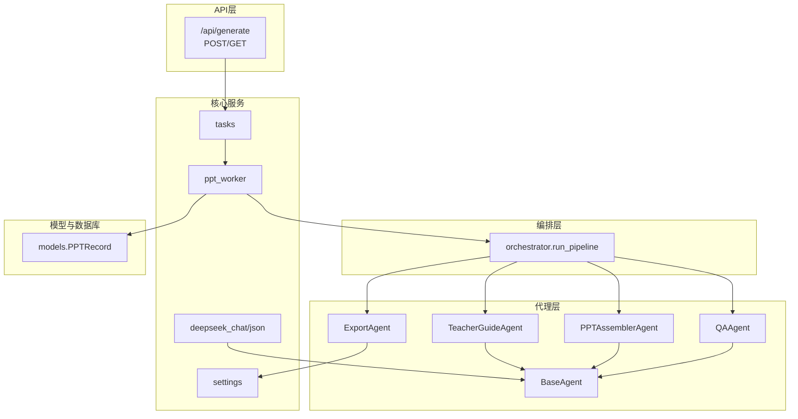
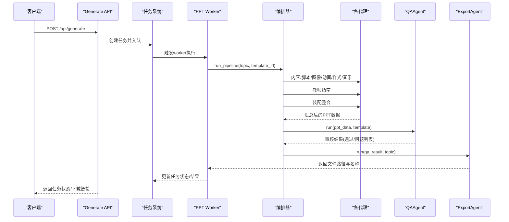
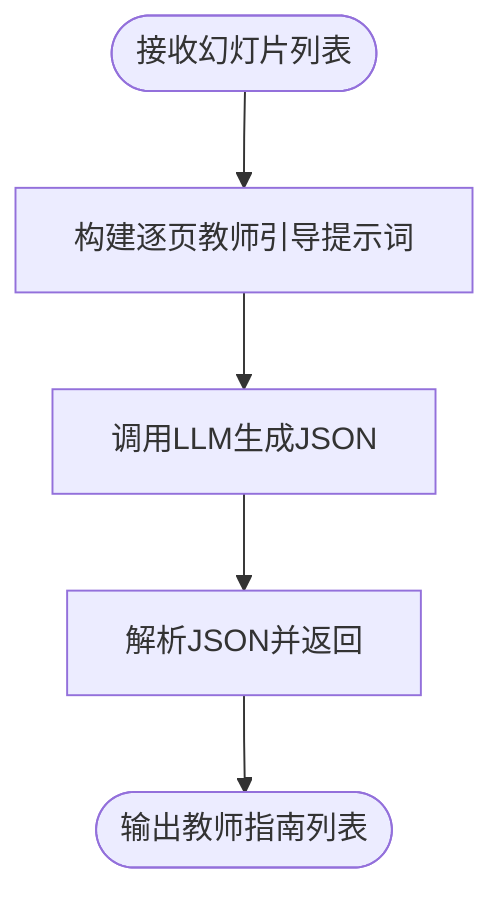
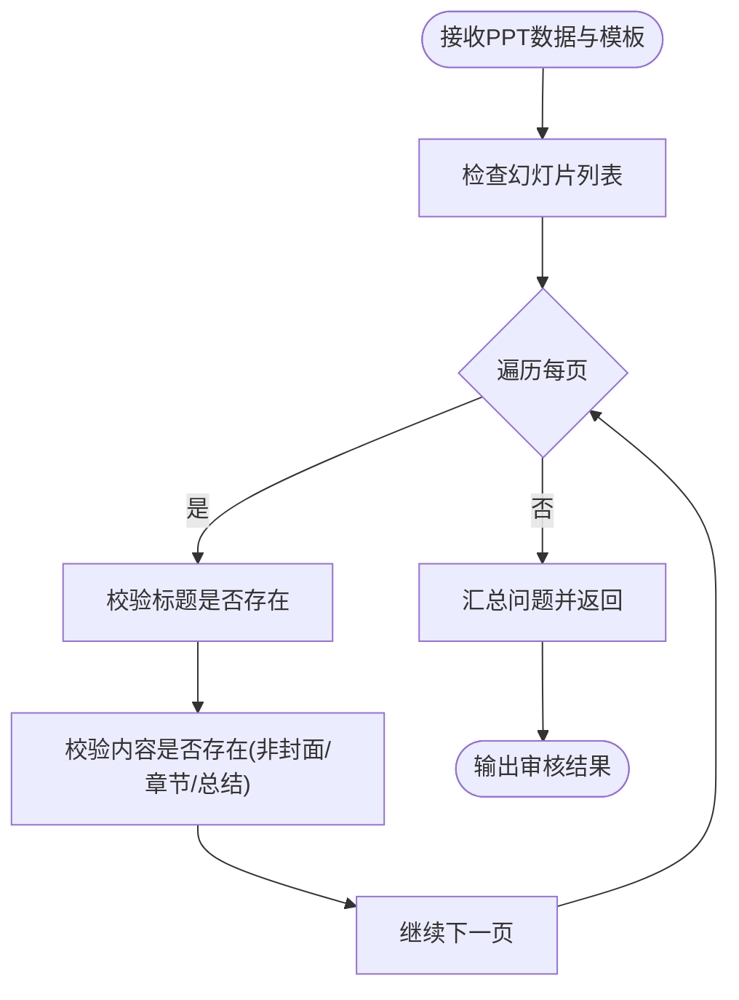
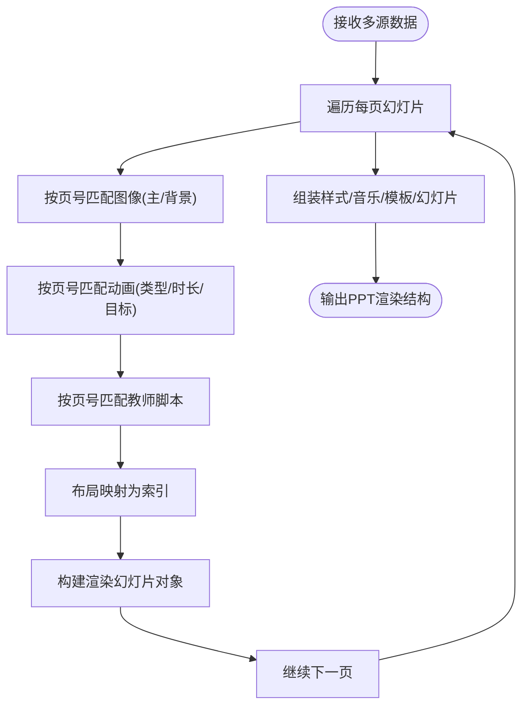
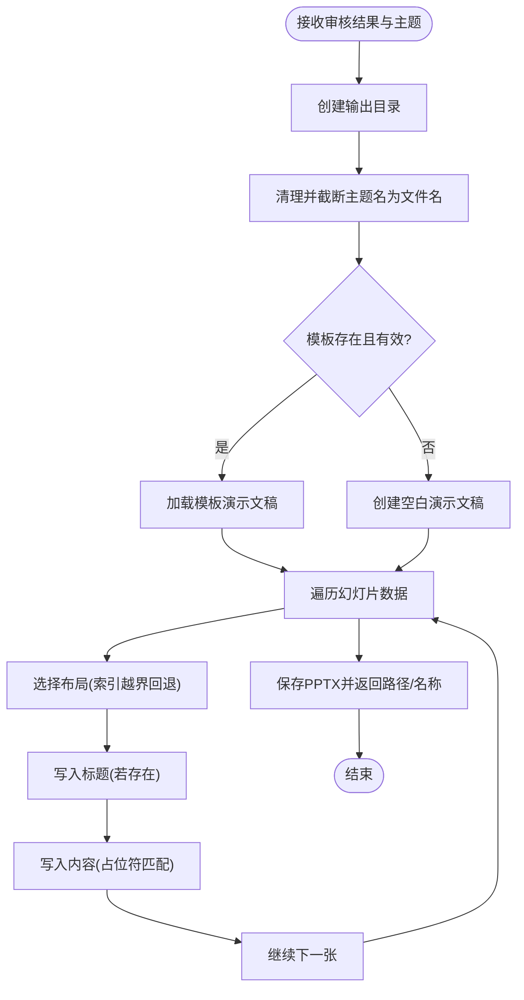
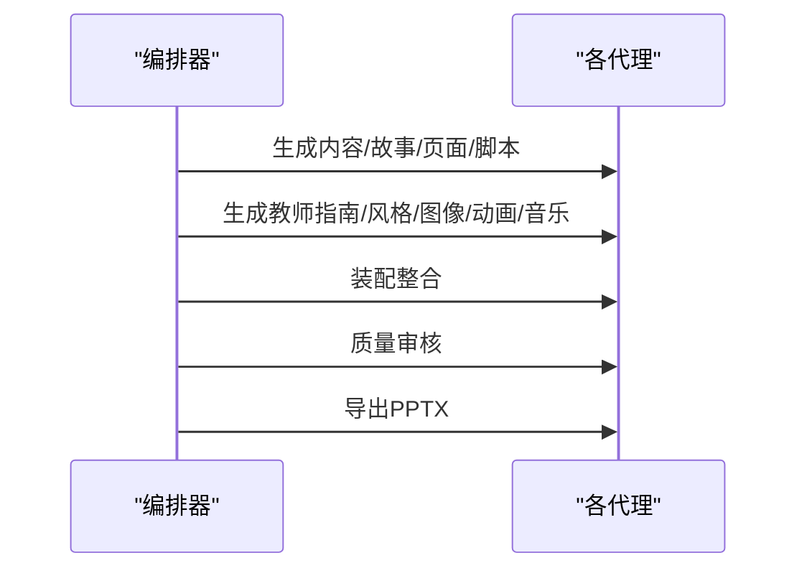
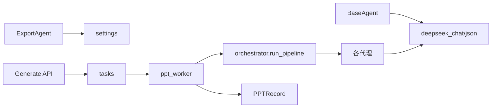

# 质量控制类代理

<cite>
**本文引用的文件**
- [backend/agents/teacher_guide.py](file://backend/agents/teacher_guide.py)
- [backend/agents/qa.py](file://backend/agents/qa.py)
- [backend/agents/assembler.py](file://backend/agents/assembler.py)
- [backend/agents/export.py](file://backend/agents/export.py)
- [backend/agents/base.py](file://backend/agents/base.py)
- [backend/agents/orchestrator.py](file://backend/agents/orchestrator.py)
- [backend/core/deepseek.py](file://backend/core/deepseek.py)
- [backend/models/ppt.py](file://backend/models/ppt.py)
- [backend/api/generate.py](file://backend/api/generate.py)
- [backend/workers/ppt_worker.py](file://backend/workers/ppt_worker.py)
- [backend/core/tasks.py](file://backend/core/tasks.py)
- [engine/ppt_export.py](file://engine/ppt_export.py)
- [backend/core/config.py](file://backend/core/config.py)
- [backend/main.py](file://backend/main.py)
</cite>

## 目录
1. [简介](#简介)
2. [项目结构](#项目结构)
3. [核心组件](#核心组件)
4. [架构总览](#架构总览)
5. [详细组件分析](#详细组件分析)
6. [依赖分析](#依赖分析)
7. [性能考虑](#性能考虑)
8. [故障排查指南](#故障排查指南)
9. [结论](#结论)
10. [附录](#附录)

## 简介
本技术文档聚焦于质量控制类AI代理在PPT自动化生产流水线中的作用与实现，重点解析以下代理的职责、数据流与质量保障机制：
- TeacherGuideAgent：教师指南生成，面向教学落地与课堂实施
- QAAgent：质量保证，对PPT结构、内容、页面连贯性与视觉一致性进行校验
- PPTAssemblerAgent：装配整合，将多源数据（内容、脚本、图像、动画、样式、音乐）整合为可渲染的PPT结构
- ExportAgent：文件导出，将最终PPT数据持久化为PPTX文件并返回下载信息

文档同时给出质量评估标准、错误检测机制、组装流程与导出格式规范，并提供最佳实践与排障建议。

## 项目结构
后端采用模块化代理架构，通过编排器统一调度各代理完成从内容到成品的全流程；前端通过FastAPI提供生成与状态查询接口；引擎层负责PPTX导出与资源下载。

图表来源
- [backend/agents/orchestrator.py:19-55](file://backend/agents/orchestrator.py#L19-L55)
- [backend/agents/teacher_guide.py:5-28](file://backend/agents/teacher_guide.py#L5-L28)
- [backend/agents/assembler.py:4-88](file://backend/agents/assembler.py#L4-L88)
- [backend/agents/qa.py:4-27](file://backend/agents/qa.py#L4-L27)
- [backend/agents/export.py:10-64](file://backend/agents/export.py#L10-L64)
- [backend/agents/base.py:5-23](file://backend/agents/base.py#L5-L23)
- [backend/core/deepseek.py:9-39](file://backend/core/deepseek.py#L9-L39)
- [backend/core/config.py:25-26](file://backend/core/config.py#L25-L26)
- [backend/workers/ppt_worker.py:5-23](file://backend/workers/ppt_worker.py#L5-L23)
- [backend/models/ppt.py:6-17](file://backend/models/ppt.py#L6-L17)
- [backend/api/generate.py:20-35](file://backend/api/generate.py#L20-L35)

章节来源
- [backend/main.py:16-39](file://backend/main.py#L16-L39)
- [backend/api/generate.py:20-51](file://backend/api/generate.py#L20-L51)
- [backend/workers/ppt_worker.py:5-23](file://backend/workers/ppt_worker.py#L5-L23)
- [backend/core/tasks.py:14-28](file://backend/core/tasks.py#L14-L28)

## 核心组件
- 基础代理基类 BaseAgent：封装系统提示词、温度参数与DeepSeek调用，提供通用聊天与JSON输出能力
- 编排器 orchestrator.run_pipeline：串联内容规划、脚本生成、教师指南、视觉风格、图像与动画、装配、质量审核与导出
- TeacherGuideAgent：面向教学实施的逐页教师引导，包含提问设计、学生活动、时间分配与课堂管理建议
- QAAgent：结构完整性、内容准确性、页面连贯性与视觉一致性的质量审核
- PPTAssemblerAgent：将多源数据映射为PPT渲染结构，建立布局索引、图像与动画匹配、脚本关联
- ExportAgent：根据模板与样式生成PPTX文件，处理占位符与布局边界情况

章节来源
- [backend/agents/base.py:5-23](file://backend/agents/base.py#L5-L23)
- [backend/agents/orchestrator.py:19-55](file://backend/agents/orchestrator.py#L19-L55)
- [backend/agents/teacher_guide.py:5-28](file://backend/agents/teacher_guide.py#L5-L28)
- [backend/agents/qa.py:4-27](file://backend/agents/qa.py#L4-L27)
- [backend/agents/assembler.py:4-88](file://backend/agents/assembler.py#L4-L88)
- [backend/agents/export.py:10-64](file://backend/agents/export.py#L10-L64)

## 架构总览
下图展示从API请求到最终PPTX导出的完整序列流程，涵盖质量控制的关键节点。

图表来源
- [backend/api/generate.py:20-35](file://backend/api/generate.py#L20-L35)
- [backend/core/tasks.py:14-28](file://backend/core/tasks.py#L14-L28)
- [backend/workers/ppt_worker.py:5-23](file://backend/workers/ppt_worker.py#L5-L23)
- [backend/agents/orchestrator.py:19-55](file://backend/agents/orchestrator.py#L19-L55)
- [backend/agents/qa.py:8-27](file://backend/agents/qa.py#L8-L27)
- [backend/agents/export.py:11-64](file://backend/agents/export.py#L11-L64)

## 详细组件分析

### TeacherGuideAgent（教师指南生成）
- 职责：为每页PPT生成详细的教师引导语教案，覆盖提问设计、学生活动组织、时间分配与应变预案
- 输入：由编排器传入的幻灯片结构列表
- 输出：每页对应的教师逐字稿、问题清单、学生活动、时间分配、教学小贴士与课堂管理建议
- 质量保障：通过系统提示词强调“商业版核心卖点”，确保输出具备教学落地价值；使用JSON输出约束，便于后续解析与整合

图表来源
- [backend/agents/teacher_guide.py:9-28](file://backend/agents/teacher_guide.py#L9-L28)

章节来源
- [backend/agents/teacher_guide.py:5-28](file://backend/agents/teacher_guide.py#L5-L28)

### QAAgent（质量保证）
- 职责：对PPT结构完整性、内容准确性、页面连贯性与视觉一致性进行质量审核
- 审核规则：
  - 幻灯片为空：严重问题
  - 缺少标题或内容为空（除封面/章节/总结外）：警告
- 输出：是否通过、问题列表、总页数、原始PPT数据
- 质量评估标准：
  - 通过条件：问题数量为0
  - 严重问题影响最终导出决策，警告用于提醒优化

图表来源
- [backend/agents/qa.py:8-27](file://backend/agents/qa.py#L8-L27)

章节来源
- [backend/agents/qa.py:4-27](file://backend/agents/qa.py#L4-L27)

### PPTAssemblerAgent（装配整合）
- 职责：将内容、脚本、图像、动画、样式、音乐与模板整合为可渲染的PPT结构
- 关键映射：
  - 布局映射：将输入布局字符串映射为内部布局索引
  - 图像匹配：按页号匹配主图与背景图
  - 动画匹配：按页号匹配进入动画类型、时长与目标
  - 脚本匹配：按页号匹配对应教师脚本
- 输出：样式、音乐、幻灯片列表与PPTX渲染Schema（含模板、主题与幻灯片）

图表来源
- [backend/agents/assembler.py:16-88](file://backend/agents/assembler.py#L16-L88)

章节来源
- [backend/agents/assembler.py:4-88](file://backend/agents/assembler.py#L4-L88)

### ExportAgent（文件导出）
- 职责：将PPT渲染结构保存为PPTX文件，支持模板继承与占位符填充
- 导出流程：
  - 创建输出目录
  - 清理并安全化主题名作为文件名
  - 优先加载模板，否则创建空白演示文稿
  - 遍历幻灯片数据，选择布局并添加标题与内容
  - 保存文件并返回路径与文件名
- 错误处理：
  - 模板加载失败回退至空白演示文稿
  - 布局索引越界回退至默认布局
  - 占位符匹配失败时跳过该占位符

图表来源
- [backend/agents/export.py:11-64](file://backend/agents/export.py#L11-L64)

章节来源
- [backend/agents/export.py:10-64](file://backend/agents/export.py#L10-L64)

### 编排器与工作流
- 编排器 orchestrator.run_pipeline 统一调度各代理，形成从内容到成品的完整流水线
- 工作流要点：
  - 先生成内容与故事，再规划页面与脚本
  - 同步生成教师指南、视觉风格、图像与动画、音乐
  - 装配整合后进行质量审核，最后导出
- 任务系统与异步执行：通过任务存储与worker异步运行，避免阻塞API响应

图表来源
- [backend/agents/orchestrator.py:19-55](file://backend/agents/orchestrator.py#L19-L55)
- [backend/workers/ppt_worker.py:5-23](file://backend/workers/ppt_worker.py#L5-L23)
- [backend/core/tasks.py:14-28](file://backend/core/tasks.py#L14-L28)

章节来源
- [backend/agents/orchestrator.py:19-55](file://backend/agents/orchestrator.py#L19-L55)
- [backend/workers/ppt_worker.py:5-23](file://backend/workers/ppt_worker.py#L5-L23)
- [backend/core/tasks.py:14-28](file://backend/core/tasks.py#L14-L28)

## 依赖分析
- 大模型调用：BaseAgent通过 deepseek_chat 与 deepseek_json 封装LLM交互，统一系统提示词与JSON输出约束
- 配置中心：settings 提供输出目录、模板路径、API密钥等全局配置
- 数据模型：PPTRecord 记录生成结果（文件路径、文件名、状态、幻灯片数量等）
- 异步任务：任务存储与worker异步执行，API仅返回任务状态，下载通过独立路由提供

图表来源
- [backend/agents/base.py:5-23](file://backend/agents/base.py#L5-L23)
- [backend/core/deepseek.py:9-39](file://backend/core/deepseek.py#L9-L39)
- [backend/agents/orchestrator.py:19-55](file://backend/agents/orchestrator.py#L19-L55)
- [backend/agents/export.py:10-64](file://backend/agents/export.py#L10-L64)
- [backend/core/config.py:25-26](file://backend/core/config.py#L25-L26)
- [backend/workers/ppt_worker.py:5-23](file://backend/workers/ppt_worker.py#L5-L23)
- [backend/models/ppt.py:6-17](file://backend/models/ppt.py#L6-L17)
- [backend/api/generate.py:20-35](file://backend/api/generate.py#L20-L35)

章节来源
- [backend/core/deepseek.py:9-39](file://backend/core/deepseek.py#L9-L39)
- [backend/core/config.py:25-26](file://backend/core/config.py#L25-L26)
- [backend/models/ppt.py:6-17](file://backend/models/ppt.py#L6-L17)
- [backend/api/generate.py:20-51](file://backend/api/generate.py#L20-L51)

## 性能考虑
- 异步与并发：API层与worker层分离，避免同步阻塞；任务系统支持并发排队与执行
- LLM调用成本控制：统一温度与系统提示词，减少无效输出；JSON输出约束降低解析开销
- 文件I/O优化：导出前预创建目录，避免多次IO异常；模板加载失败快速回退
- 资源清理：导出完成后清理临时目录与音频缓存，避免磁盘占用累积

## 故障排查指南
- LLM未配置API密钥：deepseek_chat 抛出密钥未配置错误，需检查环境变量
- 模板文件无效：ExportAgent在模板加载失败时回退至空白演示文稿，确认模板路径与权限
- 布局索引越界：ExportAgent对越界布局回退至默认布局，检查装配阶段布局映射
- 占位符不匹配：ExportAgent跳过无法匹配的占位符，检查装配阶段内容结构
- 任务状态异常：通过 /api/generate/status/{task_id} 查询任务状态与错误详情

章节来源
- [backend/core/deepseek.py:15-16](file://backend/core/deepseek.py#L15-L16)
- [backend/agents/export.py:24-31](file://backend/agents/export.py#L24-L31)
- [backend/agents/export.py:37-38](file://backend/agents/export.py#L37-L38)
- [backend/api/generate.py:38-51](file://backend/api/generate.py#L38-L51)

## 结论
本质量控制类代理体系以编排器为核心，通过TeacherGuideAgent、QAAgent、PPTAssemblerAgent与ExportAgent的协同，实现了从内容到成品的高质量交付。系统通过严格的审核规则、多源数据整合与稳健的导出流程，确保输出符合教学与演示标准。建议在生产环境中进一步完善模板校验、图像与音频资源的缓存策略，并扩展更细粒度的质量指标与告警机制。

## 附录
- 质量评估标准
  - 通过条件：问题数量为0
  - 严重问题：幻灯片为空
  - 警告问题：缺少标题或内容为空（封面/章节/总结除外）
- 错误检测机制
  - LLM输出JSON解析失败：BaseAgent统一去除代码块标记并解析
  - 模板加载异常：ExportAgent回退至空白演示文稿
  - 布局索引越界：ExportAgent回退至默认布局
- 组装流程与导出格式规范
  - 布局映射：输入布局字符串映射为内部索引
  - 图像与动画：按页号匹配，支持主图与背景图、进入动画
  - 导出格式：PPTX，支持模板继承与占位符填充
- 最佳实践
  - 在编排阶段尽早暴露问题（如缺少标题/内容），减少下游浪费
  - 对教师脚本与图像生成进行并行化，提升吞吐
  - 使用任务系统异步执行，API层保持低延迟
  - 对导出过程增加重试与日志记录，便于排障