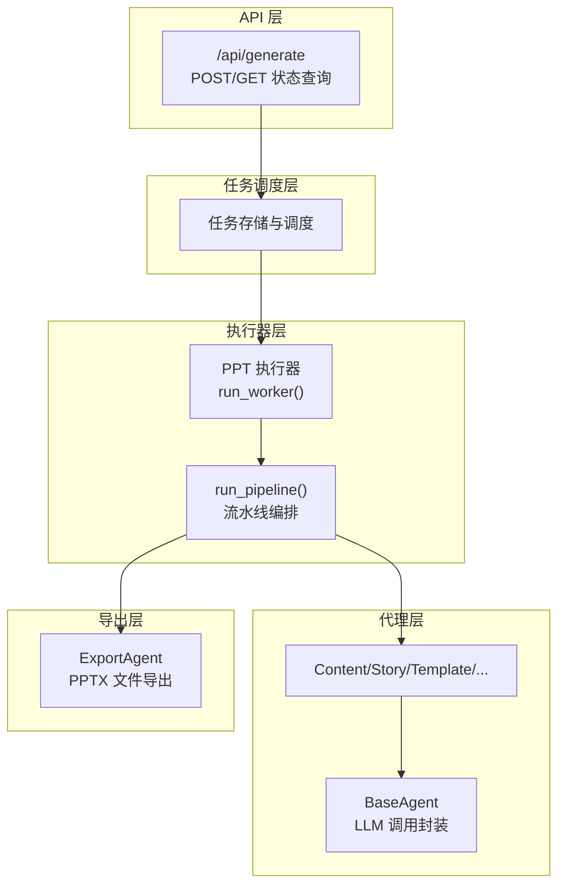
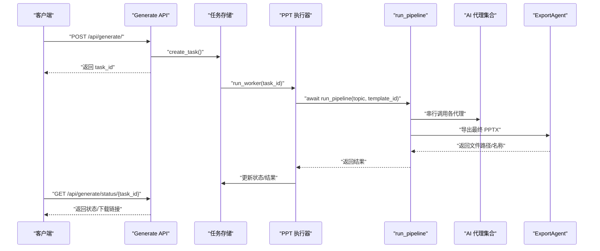
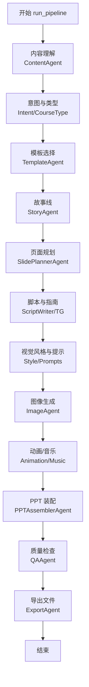
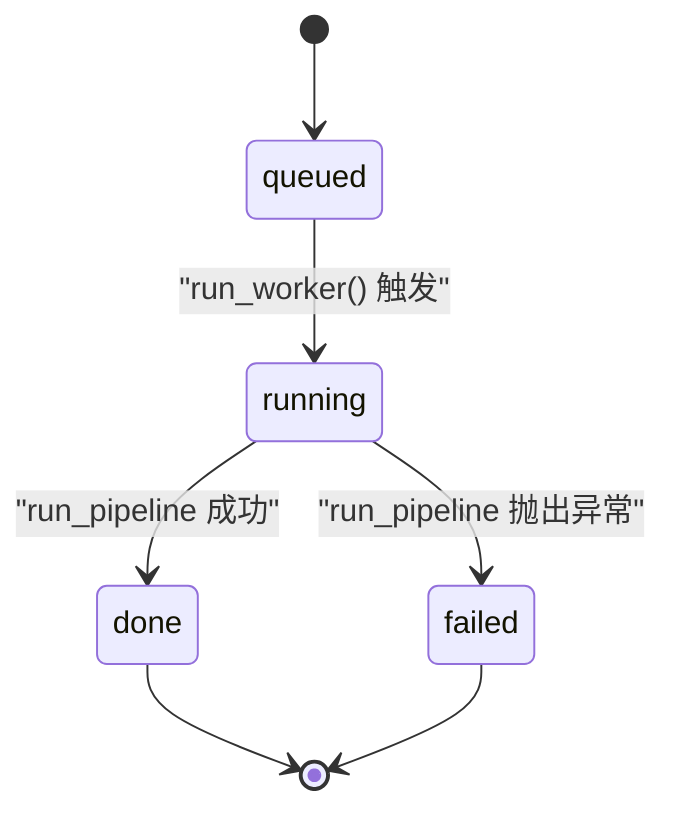
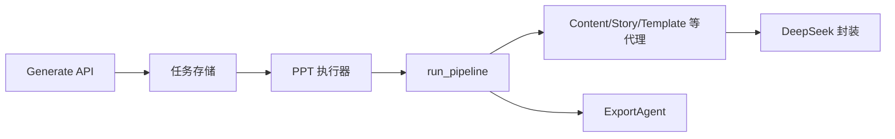

# 流水线执行流程

<cite>
**本文引用的文件**
- [backend/main.py](file://backend/main.py)
- [backend/agents/orchestrator.py](file://backend/agents/orchestrator.py)
- [backend/workers/ppt_worker.py](file://backend/workers/ppt_worker.py)
- [backend/core/tasks.py](file://backend/core/tasks.py)
- [backend/api/generate.py](file://backend/api/generate.py)
- [backend/agents/base.py](file://backend/agents/base.py)
- [backend/agents/content.py](file://backend/agents/content.py)
- [backend/agents/story.py](file://backend/agents/story.py)
- [backend/agents/template.py](file://backend/agents/template.py)
- [backend/agents/export.py](file://backend/agents/export.py)
- [backend/core/deepseek.py](file://backend/core/deepseek.py)
</cite>

## 目录
1. [引言](#引言)
2. [项目结构](#项目结构)
3. [核心组件](#核心组件)
4. [架构总览](#架构总览)
5. [详细组件分析](#详细组件分析)
6. [依赖关系分析](#依赖关系分析)
7. [性能考虑](#性能考虑)
8. [故障排查指南](#故障排查指南)
9. [结论](#结论)
10. [附录](#附录)

## 引言
本文围绕 AI 代理流水线的执行流程展开，聚焦于 run_pipeline 函数的完整执行路径与阶段划分，系统阐述各阶段的任务切换条件、数据验证与错误处理机制，并给出并行化策略、依赖关系管理、执行优化建议以及性能瓶颈分析方法。同时提供执行流程图与状态转换图，帮助读者快速理解从请求到结果输出的全链路。

## 项目结构
后端采用模块化分层组织，核心包括：
- API 层：接收外部请求，校验参数与配额，创建异步任务并返回任务状态查询接口
- 任务调度层：维护任务存储、触发执行器
- 执行器层：封装流水线编排逻辑，协调各 AI 代理完成内容生成与导出
- 代理层：面向具体任务的 AI 代理，负责对话调用、结构化解析与中间产物产出
- 导出层：将 QA 校验后的 PPT 数据渲染为最终文件

图表来源
- [backend/api/generate.py:20-51](file://backend/api/generate.py#L20-L51)
- [backend/core/tasks.py:8-28](file://backend/core/tasks.py#L8-L28)
- [backend/workers/ppt_worker.py:5-23](file://backend/workers/ppt_worker.py#L5-L23)
- [backend/agents/orchestrator.py:19-55](file://backend/agents/orchestrator.py#L19-L55)
- [backend/agents/base.py:5-24](file://backend/agents/base.py#L5-L24)
- [backend/agents/export.py:10-64](file://backend/agents/export.py#L10-L64)

章节来源
- [backend/main.py:16-39](file://backend/main.py#L16-L39)
- [backend/api/generate.py:20-51](file://backend/api/generate.py#L20-L51)
- [backend/core/tasks.py:14-28](file://backend/core/tasks.py#L14-L28)

## 核心组件
- run_pipeline：定义完整的流水线步骤，按序串行执行，产出最终 PPT 文件路径与元数据
- BaseAgent：统一的 LLM 对话封装，支持 JSON 输出解析
- TemplateAgent：根据内容与意图选择模板
- ExportAgent：将结构化 PPT 数据渲染为 PPTX 文件
- run_worker：任务执行器，负责状态更新与异常捕获
- 任务存储与调度：基于内存字典的任务存储，异步调度执行

章节来源
- [backend/agents/orchestrator.py:19-55](file://backend/agents/orchestrator.py#L19-L55)
- [backend/agents/base.py:5-24](file://backend/agents/base.py#L5-L24)
- [backend/agents/template.py:7-32](file://backend/agents/template.py#L7-L32)
- [backend/agents/export.py:10-64](file://backend/agents/export.py#L10-L64)
- [backend/workers/ppt_worker.py:5-23](file://backend/workers/ppt_worker.py#L5-L23)
- [backend/core/tasks.py:5-28](file://backend/core/tasks.py#L5-L28)

## 架构总览
下图展示从 API 请求到任务完成的端到端交互：

图表来源
- [backend/api/generate.py:20-51](file://backend/api/generate.py#L20-L51)
- [backend/core/tasks.py:14-28](file://backend/core/tasks.py#L14-L28)
- [backend/workers/ppt_worker.py:5-23](file://backend/workers/ppt_worker.py#L5-L23)
- [backend/agents/orchestrator.py:19-55](file://backend/agents/orchestrator.py#L19-L55)
- [backend/agents/export.py:10-64](file://backend/agents/export.py#L10-L64)

## 详细组件分析

### run_pipeline 执行流程与阶段分解
run_pipeline 将 PPT 生成拆分为若干阶段，每个阶段的输入来自上一阶段的输出，形成严格的串行依赖。以下为阶段划分与切换条件：

- 阶段 1：内容理解
  - 输入：topic
  - 处理：ContentAgent 分析主题，输出结构化内容信息
  - 切换条件：成功解析 JSON 后进入下一阶段；失败则抛出异常中断
  - 章节来源
    - [backend/agents/orchestrator.py:20](file://backend/agents/orchestrator.py#L20)
    - [backend/agents/content.py:7-20](file://backend/agents/content.py#L7-L20)

- 阶段 2：意图与课程类型
  - 输入：content
  - 处理：IntentAgent 与 CourseTypeAgent 基于内容推断用途与类型
  - 切换条件：两个代理均成功返回后合并进入模板选择
  - 章节来源
    - [backend/agents/orchestrator.py:21-22](file://backend/agents/orchestrator.py#L21-L22)

- 阶段 3：模板选择
  - 输入：content、course_type、intent、可选 template_id
  - 处理：TemplateAgent 根据关键词匹配与默认策略选择模板文件路径
  - 切换条件：无论是否命中模板，均继续后续流程
  - 章节来源
    - [backend/agents/orchestrator.py:24-25](file://backend/agents/orchestrator.py#L24-L25)
    - [backend/agents/template.py:7-32](file://backend/agents/template.py#L7-L32)

- 阶段 4：故事线与幻灯片规划
  - 输入：content、course_type
  - 处理：StoryAgent 产出叙事结构；SlidePlannerAgent 生成页面清单
  - 切换条件：故事线与页面规划完成后进入脚本与可视化阶段
  - 章节来源
    - [backend/agents/orchestrator.py:27-28](file://backend/agents/orchestrator.py#L27-L28)
    - [backend/agents/story.py:8-30](file://backend/agents/story.py#L8-L30)

- 阶段 5：脚本与教师指南
  - 输入：slides
  - 处理：ScriptWriterAgent 生成逐页脚本；TeacherGuideAgent 生成教师指导
  - 切换条件：两者完成后进入视觉与媒体阶段
  - 章节来源
    - [backend/agents/orchestrator.py:29-30](file://backend/agents/orchestrator.py#L29-L30)

- 阶段 6：视觉风格与图像提示
  - 输入：content、slides
  - 处理：VisualStyleAgent 推导风格；ImagePromptAgent 生成图像关键词
  - 切换条件：风格与提示完成后进入图像生成阶段
  - 章节来源
    - [backend/agents/orchestrator.py:31-32](file://backend/agents/orchestrator.py#L31-L32)

- 阶段 7：图像生成与动画/音乐
  - 输入：prompts、slides、content
  - 处理：ImageAgent 生成图片；AnimationAgent 生成动画；MusicAgent 生成背景音乐
  - 切换条件：三类媒体均完成后进入装配阶段
  - 章节来源
    - [backend/agents/orchestrator.py:33-35](file://backend/agents/orchestrator.py#L33-L35)

- 阶段 8：PPT 装配与模板注入
  - 输入：slides、scripts、images、animations、style、music、template
  - 处理：PPTAssemblerAgent 组装结构化 PPT 数据，并注入模板文件
  - 切换条件：装配完成后进入质量检查
  - 章节来源
    - [backend/agents/orchestrator.py:37-42](file://backend/agents/orchestrator.py#L37-L42)

- 阶段 9：质量检查
  - 输入：装配后的 PPT 数据、模板
  - 处理：QAAgent 进行一致性与完整性检查
  - 切换条件：通过检查后进入导出阶段
  - 章节来源
    - [backend/agents/orchestrator.py:44](file://backend/agents/orchestrator.py#L44)

- 阶段 10：文件导出
  - 输入：QA 结果、topic
  - 处理：ExportAgent 渲染 PPTX 文件，返回文件路径与名称
  - 切换条件：导出完成后流水线结束
  - 章节来源
    - [backend/agents/orchestrator.py:46](file://backend/agents/orchestrator.py#L46)
    - [backend/agents/export.py:10-64](file://backend/agents/export.py#L10-L64)

图表来源
- [backend/agents/orchestrator.py:19-55](file://backend/agents/orchestrator.py#L19-L55)

### 任务状态与控制流
run_worker 负责将任务标记为运行中，调用 run_pipeline 并在完成后回填结果或错误信息。状态机如下：

图表来源
- [backend/workers/ppt_worker.py:5-23](file://backend/workers/ppt_worker.py#L5-L23)
- [backend/core/tasks.py:5-28](file://backend/core/tasks.py#L5-L28)

### 数据验证与错误处理
- API 层
  - 参数校验：主题非空且长度有效
  - 配额限制：当日生成次数上限检查
  - 返回：任务 ID 与初始状态
  - 章节来源
    - [backend/api/generate.py:26-35](file://backend/api/generate.py#L26-L35)

- 执行器层
  - 状态流转：成功/失败分支分别写入结果与错误信息
  - 异常捕获：记录堆栈便于定位问题
  - 章节来源
    - [backend/workers/ppt_worker.py:10-23](file://backend/workers/ppt_worker.py#L10-L23)

- 代理层
  - JSON 输出解析：统一清理 LLM 返回的代码块标记，确保结构化数据
  - 章节来源
    - [backend/agents/base.py:20-23](file://backend/agents/base.py#L20-L23)
    - [backend/core/deepseek.py:36-40](file://backend/core/deepseek.py#L36-L40)

- 导出层
  - 安全文件名：过滤非法字符并截断长度
  - 模板容错：模板文件无效时回退至空白演示文稿
  - 章节来源
    - [backend/agents/export.py:15-31](file://backend/agents/export.py#L15-L31)

### 并行化策略与依赖管理
当前实现为严格串行流水线，阶段间存在强依赖关系，无法直接并行化。若需引入并行，建议：
- 将独立且耗时的阶段（如图像生成、动画/音乐生成）改为并发执行，但需注意资源竞争与限速
- 使用信号量或队列控制并发度，避免 LLM 或外部服务过载
- 在代理内部增加重试与超时控制，提升鲁棒性
- 为每个阶段增加进度上报与断点信息，便于断点续传

说明：以上为优化建议，当前仓库未实现并行化。

### 执行时间统计与资源监控
- 当前实现未内置计时与资源监控
- 建议在 run_pipeline 的关键节点插入时间戳与内存/进程指标采集
- 可结合日志系统输出阶段耗时，用于性能瓶颈定位

### 性能瓶颈分析
- LLM 调用延迟：deepseek_chat 的网络往返是主要开销
- 外部服务依赖：图像/音频生成与模板文件读取可能成为瓶颈
- I/O 密集：PPTX 导出与磁盘写入
- 建议优化方向
  - 缓存常用 LLM 结果
  - 批量处理与并发限流
  - 模板预热与本地缓存
  - 使用更高效的导出引擎或异步写盘

### 执行顺序调整与业务适配
- 模板优先：可通过传入 template_id 强制指定模板，跳过关键词匹配阶段
- 内容定制：在 ContentAgent 中扩展字段以适配不同业务场景
- 步骤裁剪：对于不需要教师指南或特定媒体类型的场景，可在上游阶段进行条件判断与短路
- 注意：任何调整都应保持下游代理对输入格式的兼容性

章节来源
- [backend/agents/orchestrator.py:24-25](file://backend/agents/orchestrator.py#L24-L25)
- [backend/agents/content.py:7-20](file://backend/agents/content.py#L7-L20)

### 故障恢复与断点续传
- 当前实现
  - run_worker 捕获异常并标记失败，不进行自动重试
  - 任务存储仅保存最新状态与错误信息
- 建议改进
  - 引入指数退避重试与最大重试次数
  - 记录每个阶段的中间产物与索引，支持断点续传
  - 提供任务取消与暂停能力
  - 增加健康检查与告警通知

章节来源
- [backend/workers/ppt_worker.py:20-23](file://backend/workers/ppt_worker.py#L20-L23)
- [backend/core/tasks.py:5-28](file://backend/core/tasks.py#L5-L28)

## 依赖关系分析
- API 依赖任务存储与认证模块，创建任务并暴露状态查询接口
- 任务存储依赖执行器，触发异步执行
- 执行器依赖流水线编排，流水线编排依赖各代理与导出模块
- 代理依赖 LLM 封装，统一调用 deepseek 接口

图表来源
- [backend/api/generate.py:7-35](file://backend/api/generate.py#L7-L35)
- [backend/core/tasks.py:3-28](file://backend/core/tasks.py#L3-L28)
- [backend/workers/ppt_worker.py:2-23](file://backend/workers/ppt_worker.py#L2-L23)
- [backend/agents/orchestrator.py:1-16](file://backend/agents/orchestrator.py#L1-L16)
- [backend/core/deepseek.py:9-40](file://backend/core/deepseek.py#L9-L40)

章节来源
- [backend/api/generate.py:1-51](file://backend/api/generate.py#L1-L51)
- [backend/core/tasks.py:1-33](file://backend/core/tasks.py#L1-L33)
- [backend/workers/ppt_worker.py:1-24](file://backend/workers/ppt_worker.py#L1-L24)
- [backend/agents/orchestrator.py:1-56](file://backend/agents/orchestrator.py#L1-L56)
- [backend/core/deepseek.py:1-40](file://backend/core/deepseek.py#L1-L40)

## 性能考虑
- LLM 调用优化
  - 合理设置温度与模型，平衡创造性与稳定性
  - 对重复输入进行缓存，减少重复调用
- I/O 优化
  - 使用异步文件操作与批量写入
  - 模板文件与媒体资源本地缓存
- 并发与限流
  - 为外部服务设置连接池与超时
  - 控制并发度，避免服务端限流
- 监控与可观测性
  - 记录每个阶段耗时与错误率
  - 建立告警阈值与日志聚合

## 故障排查指南
- 常见问题
  - LLM API Key 未配置：deepseek_chat 将抛出异常
  - 主题无效：API 层拒绝请求
  - 任务不存在：状态查询返回 404
- 排查步骤
  - 查看 run_worker 是否进入 except 分支并记录错误
  - 检查任务状态与错误字段
  - 核对模板路径是否存在与可读
  - 关注导出阶段的安全文件名与模板回退逻辑

章节来源
- [backend/core/deepseek.py:15-16](file://backend/core/deepseek.py#L15-L16)
- [backend/api/generate.py:31-32](file://backend/api/generate.py#L31-L32)
- [backend/api/generate.py:41-42](file://backend/api/generate.py#L41-L42)
- [backend/workers/ppt_worker.py:20-23](file://backend/workers/ppt_worker.py#L20-L23)
- [backend/agents/export.py:24-31](file://backend/agents/export.py#L24-L31)

## 结论
该流水线以清晰的阶段划分实现了从主题到 PPTX 的自动化生成。当前为串行执行，具备良好的可读性与可控性；在高并发与大规模生产场景下，建议引入并行化、断点续传与完善的监控体系，以进一步提升吞吐与稳定性。

## 附录
- 关键实现位置参考
  - run_pipeline：[backend/agents/orchestrator.py:19-55](file://backend/agents/orchestrator.py#L19-L55)
  - 任务创建与查询：[backend/core/tasks.py:14-32](file://backend/core/tasks.py#L14-L32)
  - API 入口与状态查询：[backend/api/generate.py:20-51](file://backend/api/generate.py#L20-L51)
  - LLM 封装与 JSON 解析：[backend/agents/base.py:5-24](file://backend/agents/base.py#L5-L24), [backend/core/deepseek.py:9-40](file://backend/core/deepseek.py#L9-L40)
  - 模板选择与导出：[backend/agents/template.py:7-32](file://backend/agents/template.py#L7-L32), [backend/agents/export.py:10-64](file://backend/agents/export.py#L10-L64)
  - 执行器与状态机：[backend/workers/ppt_worker.py:5-23](file://backend/workers/ppt_worker.py#L5-L23)