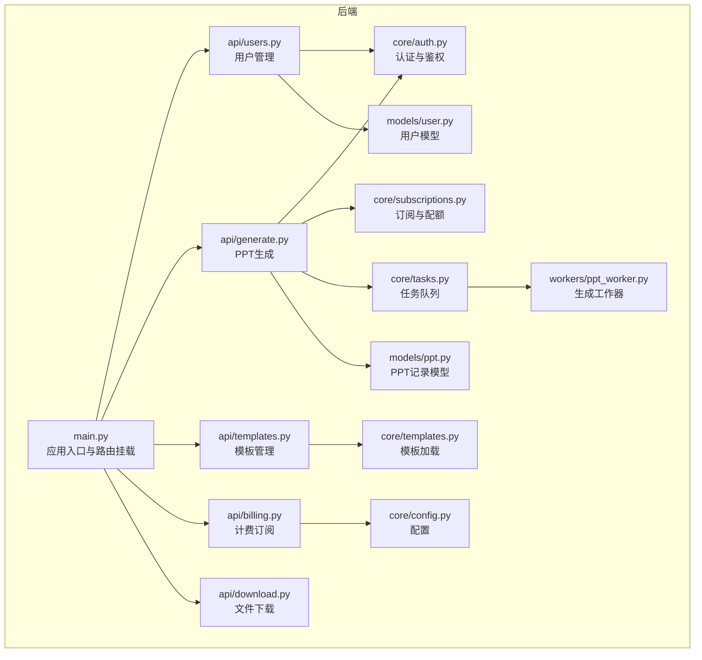
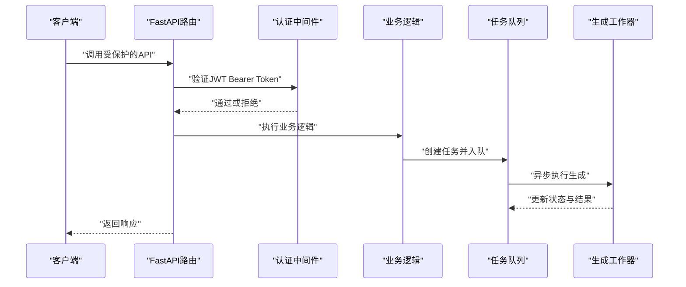
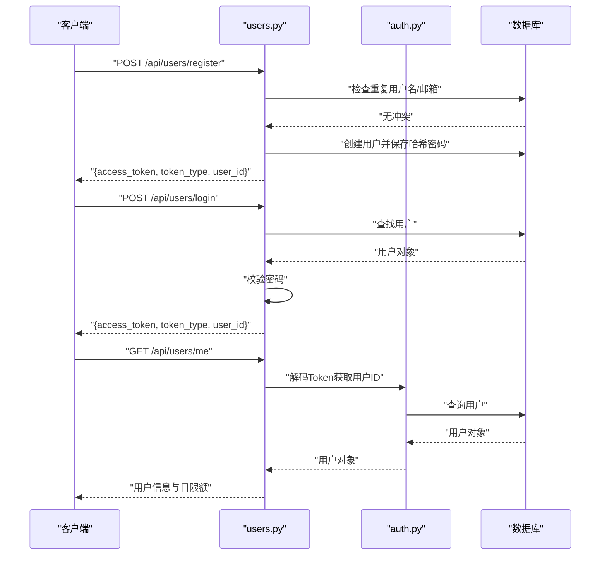
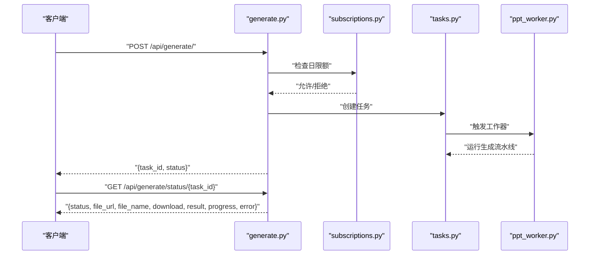
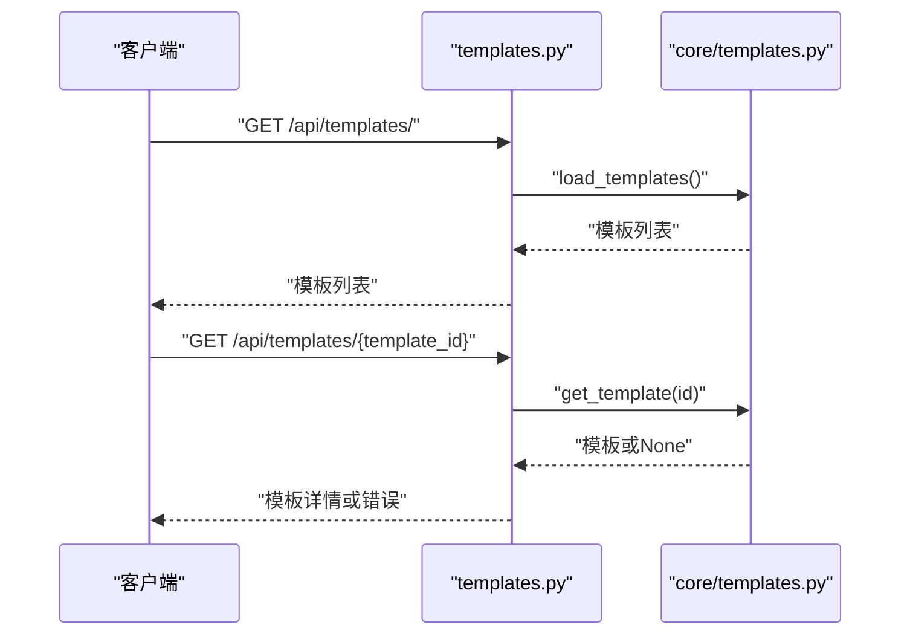
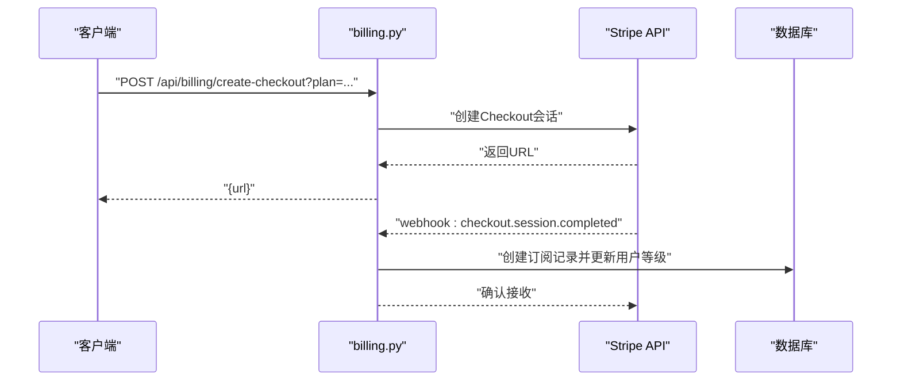
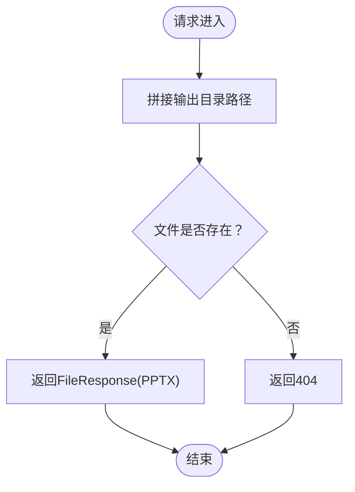
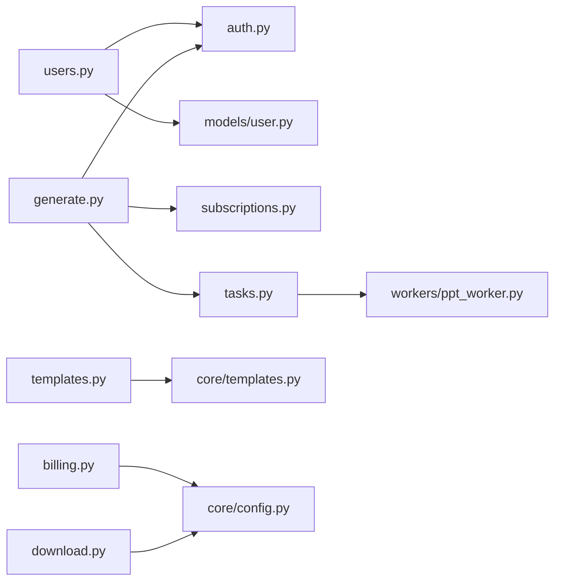
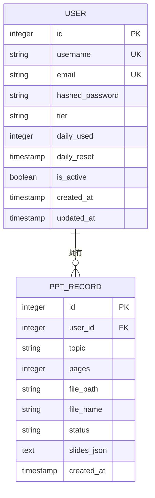

# API参考文档

<cite>
**本文档引用的文件**
- [backend/main.py](file://backend/main.py)
- [backend/api/users.py](file://backend/api/users.py)
- [backend/api/generate.py](file://backend/api/generate.py)
- [backend/api/templates.py](file://backend/api/templates.py)
- [backend/api/billing.py](file://backend/api/billing.py)
- [backend/api/download.py](file://backend/api/download.py)
- [backend/core/auth.py](file://backend/core/auth.py)
- [backend/core/subscriptions.py](file://backend/core/subscriptions.py)
- [backend/core/tasks.py](file://backend/core/tasks.py)
- [backend/core/config.py](file://backend/core/config.py)
- [backend/core/templates.py](file://backend/core/templates.py)
- [backend/models/user.py](file://backend/models/user.py)
- [backend/models/ppt.py](file://backend/models/ppt.py)
- [backend/workers/ppt_worker.py](file://backend/workers/ppt_worker.py)
- [frontend/src/api/client.js](file://frontend/src/api/client.js)
</cite>

## 目录
1. [简介](#简介)
2. [项目结构](#项目结构)
3. [核心组件](#核心组件)
4. [架构总览](#架构总览)
5. [详细组件分析](#详细组件分析)
6. [依赖关系分析](#依赖关系分析)
7. [性能考虑](#性能考虑)
8. [故障排除指南](#故障排除指南)
9. [结论](#结论)
10. [附录](#附录)

## 简介
本API参考文档面向AI-PPT项目的后端服务，覆盖用户管理、PPT生成、模板管理、计费与订阅、文件下载等完整RESTful接口。文档提供每个端点的HTTP方法、URL模式、请求/响应结构、认证方式、参数说明、返回值格式、错误码定义与使用示例，并补充API版本控制、速率限制策略与安全考虑，以及客户端实现与性能优化建议。

## 项目结构
后端采用FastAPI框架，路由按功能模块划分：用户、生成、模板、计费、下载。核心认证通过JWT实现，数据库访问基于SQLAlchemy异步会话，任务队列以内存字典模拟，工作进程负责执行PPT生成流水线。

**图表来源**
- [backend/main.py:16-40](file://backend/main.py#L16-L40)
- [backend/api/users.py:11](file://backend/api/users.py#L11)
- [backend/api/generate.py:11](file://backend/api/generate.py#L11)
- [backend/api/templates.py:6](file://backend/api/templates.py#L6)
- [backend/api/billing.py:11](file://backend/api/billing.py#L11)
- [backend/api/download.py:6](file://backend/api/download.py#L6)
- [backend/core/auth.py:13](file://backend/core/auth.py#L13)
- [backend/core/subscriptions.py:10](file://backend/core/subscriptions.py#L10)
- [backend/core/tasks.py:5](file://backend/core/tasks.py#L5)
- [backend/workers/ppt_worker.py:5](file://backend/workers/ppt_worker.py#L5)
- [backend/core/config.py:4](file://backend/core/config.py#L4)
- [backend/core/templates.py:4](file://backend/core/templates.py#L4)
- [backend/models/user.py:6](file://backend/models/user.py#L6)
- [backend/models/ppt.py:6](file://backend/models/ppt.py#L6)

**章节来源**
- [backend/main.py:16-40](file://backend/main.py#L16-L40)

## 核心组件
- 应用与版本控制
  - 应用名称与版本在应用初始化时声明，健康检查端点返回应用名与版本。
- 认证与授权
  - 使用HTTP Bearer Token进行鉴权；JWT密钥、算法与过期时间由配置提供；未通过鉴权的请求返回401。
- 速率限制与配额
  - 基于用户等级的每日生成次数限制；当超出限制返回429。
- 任务系统
  - 任务以内存字典存储，工作器异步执行生成流水线，更新任务状态与结果。
- 模板系统
  - 从模板市场JSON加载模板列表与详情。
- 文件下载
  - 从输出目录返回PPT文件，不存在则返回404。

**章节来源**
- [backend/main.py:16-40](file://backend/main.py#L16-L40)
- [backend/core/auth.py:13-57](file://backend/core/auth.py#L13-L57)
- [backend/core/subscriptions.py:10-58](file://backend/core/subscriptions.py#L10-L58)
- [backend/core/tasks.py:5-33](file://backend/core/tasks.py#L5-L33)
- [backend/core/templates.py:7-20](file://backend/core/templates.py#L7-L20)
- [backend/api/download.py:9-15](file://backend/api/download.py#L9-L15)

## 架构总览
下图展示客户端到后端各模块的交互流程，包括认证、业务处理与工作器执行。

**图表来源**
- [backend/core/auth.py:47-57](file://backend/core/auth.py#L47-L57)
- [backend/api/generate.py:20-52](file://backend/api/generate.py#L20-L52)
- [backend/core/tasks.py:14-33](file://backend/core/tasks.py#L14-L33)
- [backend/workers/ppt_worker.py:5-24](file://backend/workers/ppt_worker.py#L5-L24)

## 详细组件分析

### 用户管理API
- 路由前缀：/api/users
- 认证：除注册与登录外，其他端点需Bearer Token
- 端点定义
  - POST /register
    - 请求体：username, email, password
    - 成功：返回access_token, token_type, user_id
    - 错误：400（用户名或邮箱已存在）
  - POST /login
    - 请求体：username, password
    - 成功：返回access_token, token_type, user_id
    - 错误：401（用户名或密码错误）
  - GET /me
    - 成功：返回用户信息及日限额
    - 错误：404（用户不存在）

**图表来源**
- [backend/api/users.py:34-75](file://backend/api/users.py#L34-L75)
- [backend/core/auth.py:47-57](file://backend/core/auth.py#L47-L57)

**章节来源**
- [backend/api/users.py:14-75](file://backend/api/users.py#L14-L75)
- [backend/core/auth.py:16-57](file://backend/core/auth.py#L16-L57)
- [backend/models/user.py:6-21](file://backend/models/user.py#L6-L21)

### PPT生成API
- 路由前缀：/api/generate
- 认证：需要Bearer Token
- 端点定义
  - POST /
    - 请求体：topic, template_id(可选), pages(可选)
    - 成功：返回task_id与初始状态pending
    - 错误：400（主题无效），429（超出日限额）
  - GET /status/{task_id}
    - 成功：返回状态、文件URL、文件名、是否可下载、结果、进度、错误信息
    - 错误：404（任务不存在）

**图表来源**
- [backend/api/generate.py:20-52](file://backend/api/generate.py#L20-L52)
- [backend/core/subscriptions.py:46-58](file://backend/core/subscriptions.py#L46-L58)
- [backend/core/tasks.py:14-33](file://backend/core/tasks.py#L14-L33)
- [backend/workers/ppt_worker.py:5-24](file://backend/workers/ppt_worker.py#L5-L24)

**章节来源**
- [backend/api/generate.py:14-52](file://backend/api/generate.py#L14-L52)
- [backend/core/subscriptions.py:10-58](file://backend/core/subscriptions.py#L10-L58)
- [backend/core/tasks.py:5-33](file://backend/core/tasks.py#L5-L33)
- [backend/models/ppt.py:6-18](file://backend/models/ppt.py#L6-L18)

### 模板管理API
- 路由前缀：/api/templates
- 认证：需要Bearer Token
- 端点定义
  - GET /
    - 返回模板列表（来自模板市场JSON）
  - GET /{template_id}
    - 返回指定模板详情；未找到返回错误提示

**图表来源**
- [backend/api/templates.py:9-20](file://backend/api/templates.py#L9-L20)
- [backend/core/templates.py:7-20](file://backend/core/templates.py#L7-L20)

**章节来源**
- [backend/api/templates.py:9-20](file://backend/api/templates.py#L9-L20)
- [backend/core/templates.py:7-20](file://backend/core/templates.py#L7-L20)

### 计费API
- 路由前缀：/api/billing
- 认证：需要Bearer Token
- 端点定义
  - POST /create-checkout
    - 查询参数：plan（默认pro）
    - 成功：返回Stripe Checkout链接
    - 错误：400（无效计划），500（Stripe异常）
  - POST /webhook
    - 接收Stripe Webhook事件，完成订阅创建与用户等级更新

**图表来源**
- [backend/api/billing.py:14-80](file://backend/api/billing.py#L14-L80)

**章节来源**
- [backend/api/billing.py:14-80](file://backend/api/billing.py#L14-L80)
- [backend/core/config.py:18-23](file://backend/core/config.py#L18-L23)

### 文件下载API
- 路由前缀：/api/download
- 认证：无需认证
- 端点定义
  - GET /{file_name}
    - 成功：返回PPT文件（.pptx）
    - 错误：404（文件不存在）

**图表来源**
- [backend/api/download.py:9-15](file://backend/api/download.py#L9-L15)

**章节来源**
- [backend/api/download.py:9-15](file://backend/api/download.py#L9-L15)
- [backend/core/config.py:25](file://backend/core/config.py#L25)

## 依赖关系分析
- 组件耦合
  - 用户管理依赖认证与数据库模型；生成API依赖认证、订阅与任务系统；模板API依赖模板加载；计费API依赖Stripe与配置；下载API依赖输出目录配置。
- 外部依赖
  - Stripe用于订阅与支付；bcrypt用于密码哈希；JWT用于令牌编码与解码；SQLAlchemy用于ORM；Redis/数据库用于持久化（配置中提供连接串）。

**图表来源**
- [backend/api/users.py:6-9](file://backend/api/users.py#L6-L9)
- [backend/api/generate.py:5-9](file://backend/api/generate.py#L5-L9)
- [backend/api/templates.py:3](file://backend/api/templates.py#L3)
- [backend/api/billing.py:7](file://backend/api/billing.py#L7)
- [backend/api/download.py:4](file://backend/api/download.py#L4)
- [backend/core/tasks.py:3](file://backend/core/tasks.py#L3)
- [backend/workers/ppt_worker.py:2](file://backend/workers/ppt_worker.py#L2)

**章节来源**
- [backend/api/users.py:6-9](file://backend/api/users.py#L6-L9)
- [backend/api/generate.py:5-9](file://backend/api/generate.py#L5-L9)
- [backend/api/templates.py:3](file://backend/api/templates.py#L3)
- [backend/api/billing.py:7](file://backend/api/billing.py#L7)
- [backend/api/download.py:4](file://backend/api/download.py#L4)
- [backend/core/tasks.py:3](file://backend/core/tasks.py#L3)
- [backend/workers/ppt_worker.py:2](file://backend/workers/ppt_worker.py#L2)

## 性能考虑
- 连接池与异步
  - 数据库访问采用异步会话，建议生产环境配置连接池与超时参数，避免阻塞。
- 任务并发
  - 任务队列当前为内存字典，建议替换为Redis或消息队列（如Celery/RQ）以支持多实例扩展与持久化。
- 缓存策略
  - 对模板列表与热门资源可增加缓存层，减少磁盘IO。
- 限流与熔断
  - 在网关或中间件层实施速率限制（如每IP每分钟请求数），对下游服务设置超时与重试。
- 文件服务
  - 大文件下载建议使用CDN或对象存储直链分发，减轻应用服务器压力。

## 故障排除指南
- 认证失败（401）
  - 检查请求头Authorization是否为Bearer Token，Token是否过期或被篡改。
- 用户不存在（404）
  - 确认用户ID是否正确，数据库中是否存在该用户。
- 超出日限额（429）
  - 提示用户升级至更高套餐或等待次日重置。
- 任务不存在（404）
  - 检查task_id是否正确，任务是否仍在有效期内。
- 文件不存在（404）
  - 确认文件名与输出目录配置一致，文件是否已生成。

**章节来源**
- [backend/core/auth.py:47-57](file://backend/core/auth.py#L47-L57)
- [backend/api/generate.py:41-42](file://backend/api/generate.py#L41-L42)
- [backend/api/download.py:12-13](file://backend/api/download.py#L12-L13)

## 结论
本API文档覆盖了AI-PPT项目的核心功能接口，明确了认证方式、数据模型、任务流程与计费集成。建议在生产环境中引入外部任务队列、CDN与限流策略，确保高可用与高性能。

## 附录

### API版本控制
- 版本号：3.0.0
- 健康检查：GET /api/health 返回应用名与版本

**章节来源**
- [backend/main.py:18-39](file://backend/main.py#L18-L39)

### 客户端实现指南
- 基础URL：/api
- 认证：在请求头添加Authorization: Bearer {token}
- 超时：建议设置较长超时以适应PPT生成耗时
- 401处理：清除本地token并跳转登录页

**章节来源**
- [frontend/src/api/client.js:3-28](file://frontend/src/api/client.js#L3-L28)

### 错误码速查
- 400：请求参数无效或业务校验失败
- 401：未认证或Token无效
- 404：资源不存在
- 429：超出速率或配额限制
- 500：服务器内部错误

### 数据模型概览

**图表来源**
- [backend/models/user.py:6-21](file://backend/models/user.py#L6-L21)
- [backend/models/ppt.py:6-18](file://backend/models/ppt.py#L6-L18)