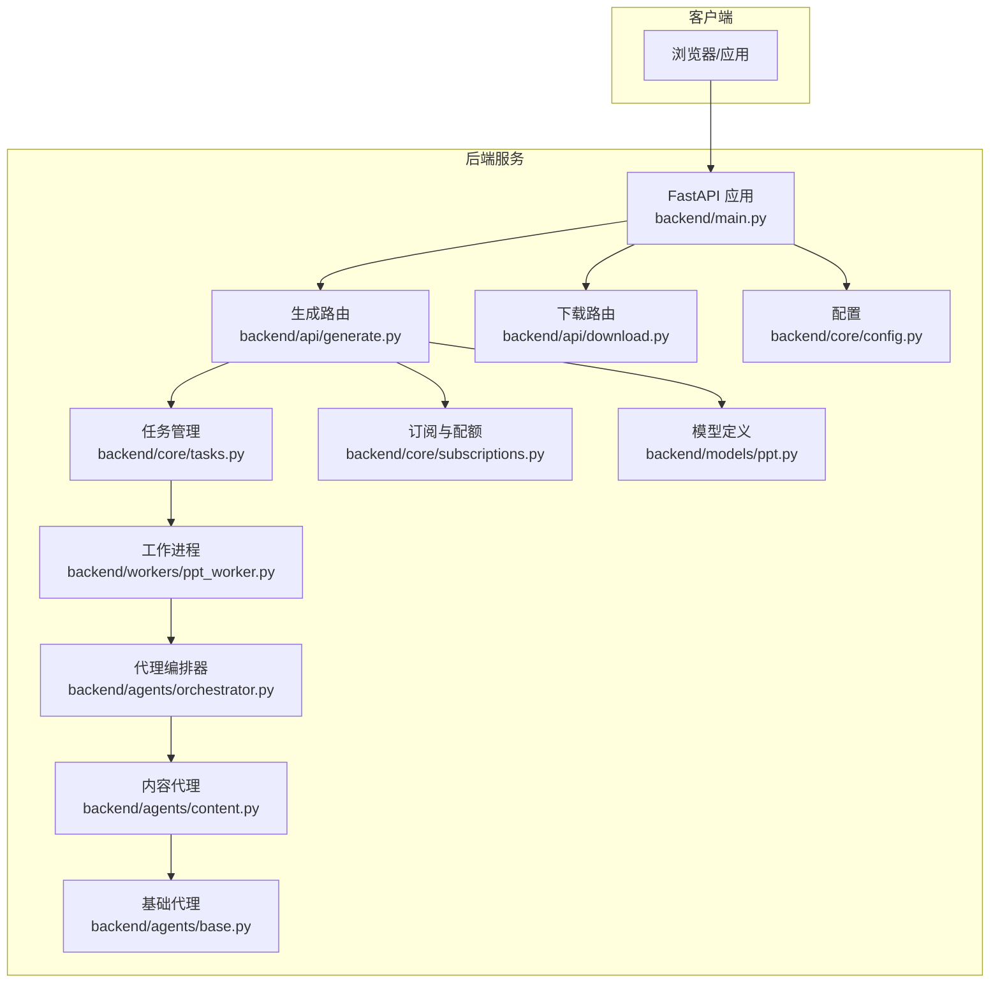
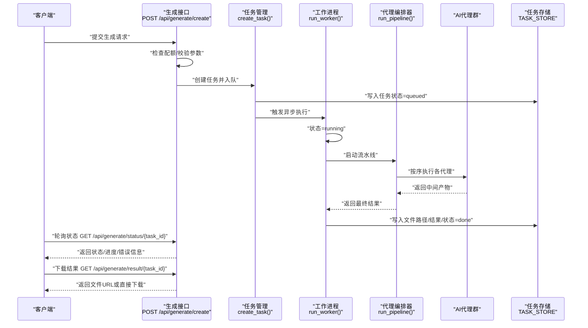
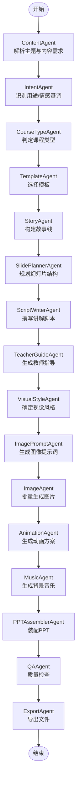
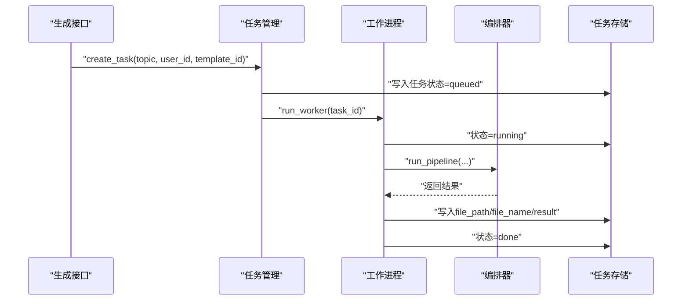
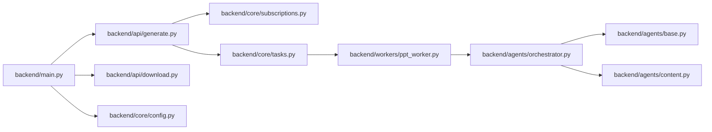

# PPT生成API

<cite>
**本文档引用的文件**
- [backend/main.py](file://backend/main.py)
- [backend/api/generate.py](file://backend/api/generate.py)
- [backend/api/download.py](file://backend/api/download.py)
- [backend/core/tasks.py](file://backend/core/tasks.py)
- [backend/workers/ppt_worker.py](file://backend/workers/ppt_worker.py)
- [backend/agents/orchestrator.py](file://backend/agents/orchestrator.py)
- [backend/agents/content.py](file://backend/agents/content.py)
- [backend/agents/base.py](file://backend/agents/base.py)
- [backend/core/subscriptions.py](file://backend/core/subscriptions.py)
- [backend/models/ppt.py](file://backend/models/ppt.py)
- [backend/core/config.py](file://backend/core/config.py)
</cite>

## 目录
1. [简介](#简介)
2. [项目结构](#项目结构)
3. [核心组件](#核心组件)
4. [架构总览](#架构总览)
5. [详细组件分析](#详细组件分析)
6. [依赖关系分析](#依赖关系分析)
7. [性能考虑](#性能考虑)
8. [故障排除指南](#故障排除指南)
9. [结论](#结论)
10. [附录](#附录)

## 简介
本文件为“PPT生成API”的完整接口文档，覆盖以下三个核心接口：
- 创建PPT生成任务：POST /api/generate/create
- 查询任务状态：GET /api/generate/status/{task_id}
- 获取生成结果：GET /api/generate/result/{task_id}

同时，文档阐述了AI代理协调器的工作流程、异步任务处理机制、任务状态管理与错误处理策略，并提供性能优化建议与故障排除指南。

## 项目结构
后端采用FastAPI框架，路由集中在backend/api目录，业务逻辑分布在agents、core、workers等模块；任务队列通过内存字典模拟，工作进程在独立协程中执行。

图表来源
- [backend/main.py:16-39](file://backend/main.py#L16-L39)
- [backend/api/generate.py:11-51](file://backend/api/generate.py#L11-L51)
- [backend/api/download.py:6-14](file://backend/api/download.py#L6-L14)
- [backend/core/tasks.py:5-32](file://backend/core/tasks.py#L5-L32)
- [backend/workers/ppt_worker.py:5-23](file://backend/workers/ppt_worker.py#L5-L23)
- [backend/agents/orchestrator.py:19-55](file://backend/agents/orchestrator.py#L19-L55)
- [backend/agents/content.py:4-20](file://backend/agents/content.py#L4-L20)
- [backend/agents/base.py:5-23](file://backend/agents/base.py#L5-L23)
- [backend/core/subscriptions.py:46-57](file://backend/core/subscriptions.py#L46-L57)
- [backend/models/ppt.py:6-17](file://backend/models/ppt.py#L6-L17)
- [backend/core/config.py:4-33](file://backend/core/config.py#L4-L33)

章节来源
- [backend/main.py:16-39](file://backend/main.py#L16-L39)
- [backend/api/generate.py:11-51](file://backend/api/generate.py#L11-L51)
- [backend/api/download.py:6-14](file://backend/api/download.py#L6-L14)
- [backend/core/tasks.py:5-32](file://backend/core/tasks.py#L5-L32)
- [backend/workers/ppt_worker.py:5-23](file://backend/workers/ppt_worker.py#L5-L23)
- [backend/agents/orchestrator.py:19-55](file://backend/agents/orchestrator.py#L19-L55)
- [backend/agents/content.py:4-20](file://backend/agents/content.py#L4-L20)
- [backend/agents/base.py:5-23](file://backend/agents/base.py#L5-L23)
- [backend/core/subscriptions.py:46-57](file://backend/core/subscriptions.py#L46-L57)
- [backend/models/ppt.py:6-17](file://backend/models/ppt.py#L6-L17)
- [backend/core/config.py:4-33](file://backend/core/config.py#L4-L33)

## 核心组件
- 生成接口层：负责接收请求、鉴权、校验配额、创建任务并返回任务ID。
- 任务管理层：维护内存中的任务存储，调度工作进程执行。
- 工作进程：异步运行代理编排器，执行完整的PPT生成流水线。
- 代理编排器：串联多个AI代理，完成内容规划、模板选择、脚本写作、素材生成、装配导出等步骤。
- 下载接口：提供生成文件的下载能力。

章节来源
- [backend/api/generate.py:20-35](file://backend/api/generate.py#L20-L35)
- [backend/core/tasks.py:14-28](file://backend/core/tasks.py#L14-L28)
- [backend/workers/ppt_worker.py:5-23](file://backend/workers/ppt_worker.py#L5-L23)
- [backend/agents/orchestrator.py:19-55](file://backend/agents/orchestrator.py#L19-L55)
- [backend/api/download.py:9-14](file://backend/api/download.py#L9-L14)

## 架构总览
下图展示了从客户端到工作进程的完整调用链路与数据流。

图表来源
- [backend/api/generate.py:20-35](file://backend/api/generate.py#L20-L35)
- [backend/core/tasks.py:14-28](file://backend/core/tasks.py#L14-L28)
- [backend/workers/ppt_worker.py:5-23](file://backend/workers/ppt_worker.py#L5-L23)
- [backend/agents/orchestrator.py:19-55](file://backend/agents/orchestrator.py#L19-L55)
- [backend/api/download.py:9-14](file://backend/api/download.py#L9-L14)

## 详细组件分析

### 接口定义与使用说明

- 接口一：创建PPT生成任务
  - 方法与路径：POST /api/generate/create
  - 功能：根据主题、模板ID等参数创建异步生成任务，返回任务ID与初始状态。
  - 请求参数：
    - topic: 字符串，必填，长度至少2个字符
    - template_id: 字符串，可选
    - pages: 整数，可选
  - 响应字段：
    - task_id: 字符串，任务唯一标识
    - status: 字符串，初始状态为"pending"
  - 鉴权与配额：
    - 需要登录态
    - 检查用户当日生成次数是否超过套餐限额
  - 使用示例：
    - 客户端提交请求后立即收到task_id，随后轮询状态接口获取结果

- 接口二：查询任务状态
  - 方法与路径：GET /api/generate/status/{task_id}
  - 功能：返回任务当前状态及附加信息（如文件名、下载标记、进度、错误等）
  - 响应字段：
    - status: 字符串，可能值包括"queued"/"running"/"done"/"failed"
    - file_url: 字符串，文件可用时提供下载地址
    - file_name: 字符串，生成文件名
    - download: 布尔值，当状态为"done"时为true
    - result: 对象，包含生成的核心结果（如页面数量、教师指南、脚本等）
    - progress: 字符串，进度描述（若代理层未填充则为空）
    - error: 字符串，失败时的错误信息
  - 错误处理：
    - 任务不存在返回404

- 接口三：获取生成结果
  - 方法与路径：GET /api/generate/result/{task_id}
  - 功能：当任务完成时，返回文件下载链接或直接下载文件
  - 实现方式：
    - 若任务状态为"done"，返回文件下载链接
    - 后端提供下载路由，根据文件名从输出目录返回文件
  - 注意：
    - 文件名来自任务存储中的file_name字段

章节来源
- [backend/api/generate.py:14-35](file://backend/api/generate.py#L14-L35)
- [backend/api/generate.py:38-51](file://backend/api/generate.py#L38-L51)
- [backend/api/download.py:9-14](file://backend/api/download.py#L9-L14)
- [backend/core/tasks.py:31-32](file://backend/core/tasks.py#L31-L32)

### AI代理协调器工作流程
代理编排器以流水线形式组织多个AI代理，依次完成内容解析、课程类型识别、故事构建、幻灯片规划、脚本写作、教师指南、视觉风格、图像提示、图片生成、动画与音乐等步骤，最后进行质量检查并导出PPT。

图表来源
- [backend/agents/orchestrator.py:19-55](file://backend/agents/orchestrator.py#L19-L55)
- [backend/agents/content.py:4-20](file://backend/agents/content.py#L4-L20)
- [backend/agents/base.py:5-23](file://backend/agents/base.py#L5-L23)

章节来源
- [backend/agents/orchestrator.py:19-55](file://backend/agents/orchestrator.py#L19-L55)
- [backend/agents/content.py:4-20](file://backend/agents/content.py#L4-L20)
- [backend/agents/base.py:5-23](file://backend/agents/base.py#L5-L23)

### 异步任务处理机制
- 任务创建：生成接口调用create_task创建任务并写入内存存储，状态初始化为"queued"，随后触发run_worker。
- 工作进程：run_worker将任务状态更新为"running"，异步执行代理编排器流水线。
- 结果回写：成功时写入文件路径、文件名与完整结果，状态置为"done"；异常时记录错误并置为"failed"。
- 状态查询：get_status从内存存储读取任务状态与附加信息。

图表来源
- [backend/core/tasks.py:14-28](file://backend/core/tasks.py#L14-L28)
- [backend/workers/ppt_worker.py:5-23](file://backend/workers/ppt_worker.py#L5-L23)
- [backend/agents/orchestrator.py:19-55](file://backend/agents/orchestrator.py#L19-L55)

章节来源
- [backend/core/tasks.py:14-28](file://backend/core/tasks.py#L14-L28)
- [backend/workers/ppt_worker.py:5-23](file://backend/workers/ppt_worker.py#L5-L23)

### 任务状态管理与错误处理
- 状态枚举：queued（排队）、running（执行中）、done（已完成）、failed（失败）
- 进度与结果：代理编排器可扩展注入progress字段；result包含页面数量、教师指南、脚本等
- 错误处理：
  - 生成接口：参数校验失败返回400；超出配额返回429；任务不存在返回404
  - 工作进程：捕获异常并记录错误信息，状态置为"failed"

章节来源
- [backend/api/generate.py:26-32](file://backend/api/generate.py#L26-L32)
- [backend/api/generate.py:40-42](file://backend/api/generate.py#L40-L42)
- [backend/workers/ppt_worker.py:20-23](file://backend/workers/ppt_worker.py#L20-L23)

### 数据模型与持久化
- PPT记录模型包含用户ID、主题、页数、文件路径、文件名、状态、创建时间等字段，可用于后续审计与统计。
- 当前任务存储为内存字典，生产环境建议替换为数据库或Redis以支持多实例与持久化。

章节来源
- [backend/models/ppt.py:6-17](file://backend/models/ppt.py#L6-L17)

## 依赖关系分析
- 路由注册：主应用在启动时注册所有API路由，包括生成与下载。
- 配置依赖：配置类集中管理数据库、密钥、输出目录等参数。
- 订阅与配额：生成接口依赖订阅模块检查用户配额。

图表来源
- [backend/main.py:30-34](file://backend/main.py#L30-L34)
- [backend/api/generate.py:1-9](file://backend/api/generate.py#L1-L9)
- [backend/core/subscriptions.py:46-57](file://backend/core/subscriptions.py#L46-L57)
- [backend/core/tasks.py:1-3](file://backend/core/tasks.py#L1-L3)
- [backend/workers/ppt_worker.py:1-2](file://backend/workers/ppt_worker.py#L1-L2)
- [backend/agents/orchestrator.py:1-16](file://backend/agents/orchestrator.py#L1-L16)
- [backend/agents/base.py:1-2](file://backend/agents/base.py#L1-L2)
- [backend/agents/content.py:1-1](file://backend/agents/content.py#L1-L1)
- [backend/core/config.py:4-33](file://backend/core/config.py#L4-L33)

章节来源
- [backend/main.py:30-34](file://backend/main.py#L30-L34)
- [backend/api/generate.py:1-9](file://backend/api/generate.py#L1-L9)
- [backend/core/subscriptions.py:46-57](file://backend/core/subscriptions.py#L46-L57)
- [backend/core/tasks.py:1-3](file://backend/core/tasks.py#L1-L3)
- [backend/workers/ppt_worker.py:1-2](file://backend/workers/ppt_worker.py#L1-L2)
- [backend/agents/orchestrator.py:1-16](file://backend/agents/orchestrator.py#L1-L16)
- [backend/agents/base.py:1-2](file://backend/agents/base.py#L1-L2)
- [backend/agents/content.py:1-1](file://backend/agents/content.py#L1-L1)
- [backend/core/config.py:4-33](file://backend/core/config.py#L4-L33)

## 性能考虑
- 并发与资源：当前工作进程基于内存队列，单实例并发受限。建议引入消息队列（如Celery/RabbitMQ/Redis Streams）与多worker实例提升吞吐。
- I/O密集优化：代理调用外部大模型与媒体服务，建议增加超时控制、重试与熔断机制。
- 缓存策略：对常用模板、图像提示词等结果进行缓存，减少重复计算。
- 输出目录：确保输出目录具备足够磁盘空间与权限，避免I/O瓶颈。
- 配额与限流：结合订阅层级限制生成频率，防止突发流量压垮系统。

## 故障排除指南
- 400 参数错误：检查topic长度与必填项，确保模板ID与页数合法。
- 401 未授权：确认登录态有效，Token正确。
- 404 任务不存在：确认task_id正确且尚未过期清理。
- 429 超出配额：升级套餐或等待次日重置。
- 500/failed：查看工作进程日志，定位具体代理环节异常；检查代理模型调用与外部服务连通性。
- 下载失败：确认文件名与输出目录配置一致，文件是否存在。

章节来源
- [backend/api/generate.py:26-32](file://backend/api/generate.py#L26-L32)
- [backend/api/generate.py:40-42](file://backend/api/generate.py#L40-L42)
- [backend/workers/ppt_worker.py:20-23](file://backend/workers/ppt_worker.py#L20-L23)
- [backend/api/download.py:11-13](file://backend/api/download.py#L11-L13)

## 结论
该PPT生成API通过清晰的接口设计与代理编排流水线，实现了从主题到成品PPT的自动化生成。当前实现适合演示与小规模使用，建议在生产环境中引入持久化任务存储、消息队列与完善的监控告警体系，以提升稳定性与可扩展性。

## 附录

### 接口清单与规范
- 创建任务
  - 方法：POST
  - 路径：/api/generate/create
  - 请求体：topic, template_id?, pages?
  - 响应：task_id, status
- 查询状态
  - 方法：GET
  - 路径：/api/generate/status/{task_id}
  - 响应：status, file_url?, file_name?, download?, result?, progress?, error?
- 获取结果
  - 方法：GET
  - 路径：/api/generate/result/{task_id}
  - 响应：文件下载或下载链接

章节来源
- [backend/api/generate.py:20-35](file://backend/api/generate.py#L20-L35)
- [backend/api/generate.py:38-51](file://backend/api/generate.py#L38-L51)
- [backend/api/download.py:9-14](file://backend/api/download.py#L9-L14)