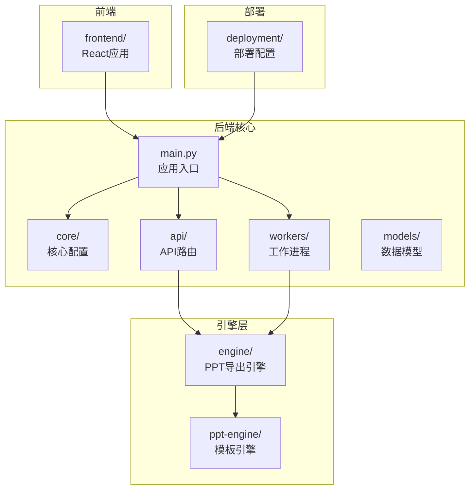
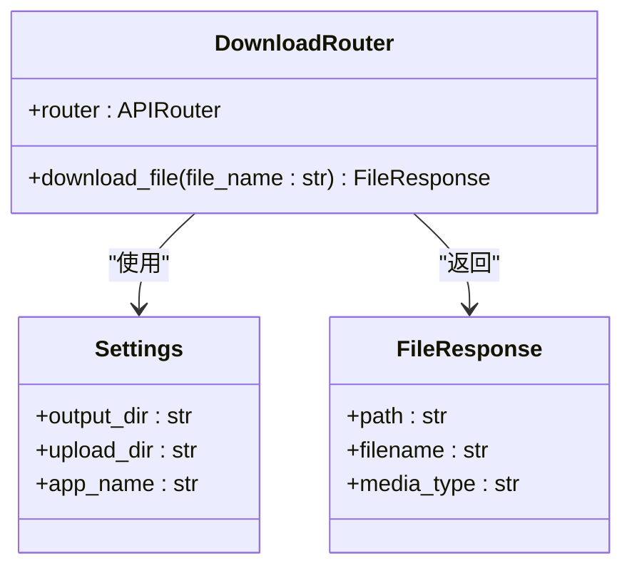
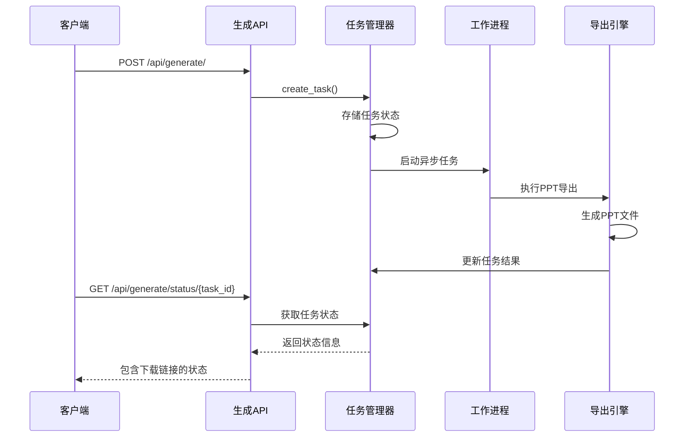
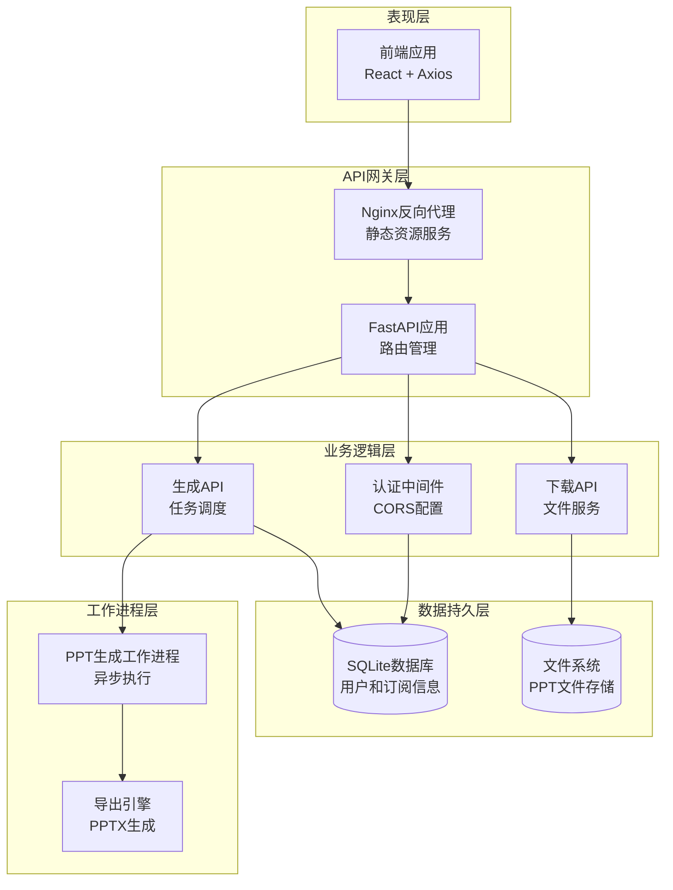
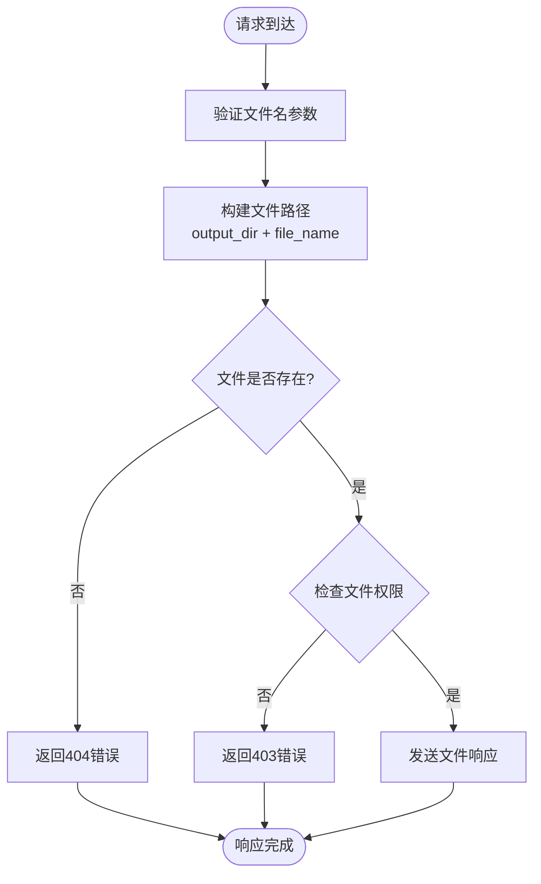
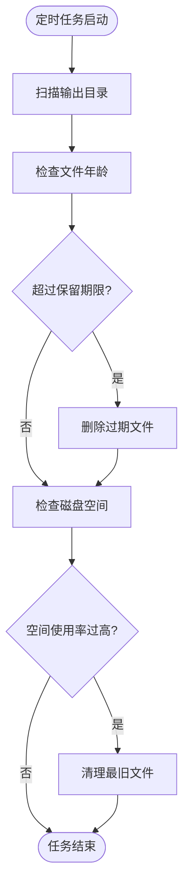
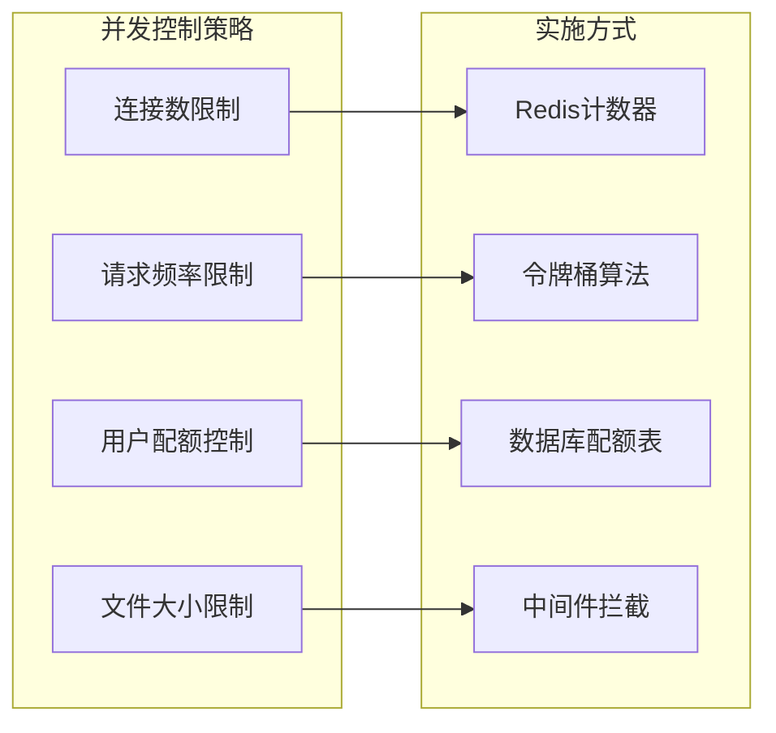
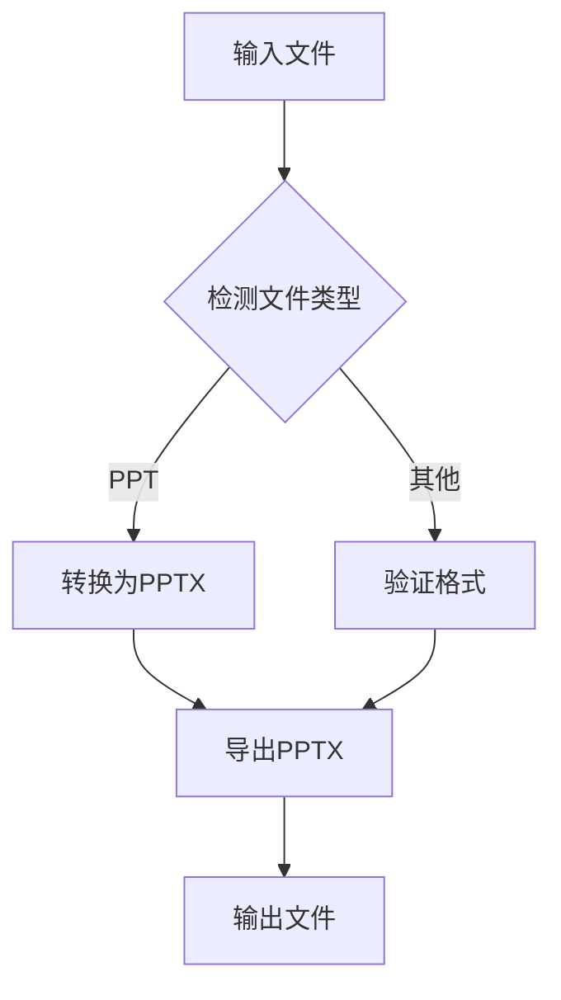
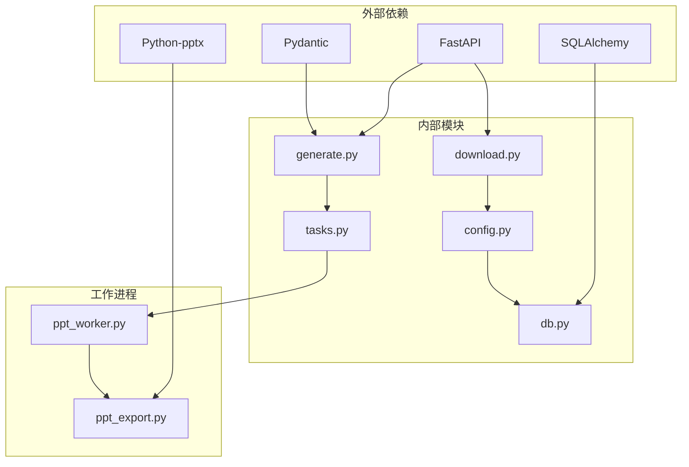

# 文件下载API

<cite>
**本文档引用的文件**
- [backend/api/download.py](file://backend/api/download.py)
- [backend/main.py](file://backend/main.py)
- [backend/core/config.py](file://backend/core/config.py)
- [backend/api/generate.py](file://backend/api/generate.py)
- [backend/core/tasks.py](file://backend/core/tasks.py)
- [backend/workers/ppt_worker.py](file://backend/workers/ppt_worker.py)
- [engine/ppt_export.py](file://engine/ppt_export.py)
- [frontend/src/api/client.js](file://frontend/src/api/client.js)
- [deployment/nginx.conf](file://deployment/nginx.conf)
</cite>

## 目录
1. [简介](#简介)
2. [项目结构](#项目结构)
3. [核心组件](#核心组件)
4. [架构概览](#架构概览)
5. [详细组件分析](#详细组件分析)
6. [依赖关系分析](#依赖关系分析)
7. [性能考虑](#性能考虑)
8. [故障排除指南](#故障排除指南)
9. [结论](#结论)

## 简介

本文件下载API是AI PPT操作系统V3的重要组成部分，负责处理PPT文件的生成、存储和下载功能。该系统采用FastAPI框架构建，支持异步处理和高并发访问，能够处理从简单文本到复杂多媒体内容的PPT生成任务。

系统主要特性包括：
- 异步PPT生成和导出
- 文件存储策略和临时文件管理
- 并发下载控制和限流机制
- 文件格式转换和多媒体集成
- 完整的任务状态跟踪和进度监控

## 项目结构

后端服务采用模块化设计，主要目录结构如下：

**图表来源**
- [backend/main.py:1-40](file://backend/main.py#L1-L40)
- [backend/api/download.py:1-15](file://backend/api/download.py#L1-L15)
- [backend/core/config.py:1-34](file://backend/core/config.py#L1-L34)

**章节来源**
- [backend/main.py:1-40](file://backend/main.py#L1-L40)
- [backend/core/config.py:1-34](file://backend/core/config.py#L1-L34)

## 核心组件

### 下载API路由器

下载功能通过专门的API路由器实现，当前版本支持基础的文件下载功能：

**图表来源**
- [backend/api/download.py:1-15](file://backend/api/download.py#L1-L15)
- [backend/core/config.py:25-26](file://backend/core/config.py#L25-L26)

### 生成任务管理系统

系统采用异步任务队列模式，支持并发处理多个PPT生成请求：

**图表来源**
- [backend/api/generate.py:20-52](file://backend/api/generate.py#L20-L52)
- [backend/core/tasks.py:14-32](file://backend/core/tasks.py#L14-L32)
- [backend/workers/ppt_worker.py:5-23](file://backend/workers/ppt_worker.py#L5-L23)

**章节来源**
- [backend/api/download.py:1-15](file://backend/api/download.py#L1-L15)
- [backend/api/generate.py:1-52](file://backend/api/generate.py#L1-L52)
- [backend/core/tasks.py:1-32](file://backend/core/tasks.py#L1-L32)

## 架构概览

系统采用分层架构设计，确保各组件职责清晰分离：

**图表来源**
- [deployment/nginx.conf:1-25](file://deployment/nginx.conf#L1-L25)
- [backend/main.py:16-34](file://backend/main.py#L16-L34)
- [backend/api/generate.py:1-52](file://backend/api/generate.py#L1-L52)

## 详细组件分析

### 文件下载接口

#### 接口定义

当前版本的下载接口相对简化，主要提供基础的文件下载功能：

**HTTP方法**: `GET`
**路径**: `/api/download/{file_name}`
**参数**: 
- `file_name`: 字符串类型，目标文件名

**响应**:
- 成功: `FileResponse` 对象，包含完整的PPT文件
- 失败: `404 Not Found` 错误

#### 实现细节

下载接口通过以下步骤实现文件传输：

**图表来源**
- [backend/api/download.py:9-14](file://backend/api/download.py#L9-L14)

**章节来源**
- [backend/api/download.py:1-15](file://backend/api/download.py#L1-L15)

### 文件状态查询接口

#### 接口定义

状态查询接口用于跟踪PPT生成任务的进度和状态：

**HTTP方法**: `GET`
**路径**: `/api/generate/status/{task_id}`
**参数**: 
- `task_id`: 字符串类型，任务唯一标识符

**响应字段**:
- `status`: 任务当前状态
- `file_url`: 文件下载URL（当任务完成时）
- `file_name`: 生成的文件名
- `download`: 布尔值，指示是否可下载
- `result`: 任务结果详情
- `progress`: 进度信息
- `error`: 错误信息（如有）

#### 状态管理

任务状态在内存中维护，支持以下状态：
- `queued`: 任务已排队等待执行
- `running`: 任务正在执行中
- `done`: 任务已完成
- `failed`: 任务执行失败

**章节来源**
- [backend/api/generate.py:38-52](file://backend/api/generate.py#L38-L52)
- [backend/core/tasks.py:14-32](file://backend/core/tasks.py#L14-L32)

### 文件清理接口

当前版本未实现专门的文件清理接口，但系统具备以下清理机制：

#### 自动清理机制

1. **临时文件清理**: 导出过程中产生的临时文件会在完成后自动删除
2. **过期文件检测**: 可通过扩展实现定期清理长时间未访问的文件
3. **磁盘空间监控**: 可添加磁盘空间使用情况监控和清理策略

#### 清理策略建议

**章节来源**
- [engine/ppt_export.py:229-236](file://engine/ppt_export.py#L229-L236)

### 文件存储策略

#### 存储位置配置

系统通过配置文件管理文件存储位置：

| 配置项 | 默认值 | 描述 |
|--------|--------|------|
| `output_dir` | `"D:/ai-ppt-os-v3/output"` | PPT文件输出目录 |
| `upload_dir` | `"D:/ai-ppt-os-v3/data/uploads"` | 用户上传文件目录 |

#### 文件命名规范

生成的PPT文件遵循以下命名规则：
1. 主题名称进行字符过滤，移除不安全字符
2. 添加时间戳确保文件名唯一性
3. 固定扩展名为 `.pptx`

**章节来源**
- [backend/core/config.py:25-26](file://backend/core/config.py#L25-L26)
- [engine/ppt_export.py:245-249](file://engine/ppt_export.py#L245-L249)

### 并发下载控制

#### 当前限制

当前版本的下载接口存在以下限制：
- 无内置并发控制机制
- 无下载速率限制
- 无用户级别的访问控制

#### 建议的改进方案

**章节来源**
- [backend/api/download.py:1-15](file://backend/api/download.py#L1-L15)

### 文件格式转换

#### 支持的格式

系统当前主要支持PPTX格式，可通过以下方式扩展：

1. **PPT到PPTX转换**: 使用Python-PPTX库进行格式转换
2. **PDF导出**: 集成第三方PDF转换服务
3. **图片格式**: 支持导出为PNG/JPEG等图片格式

#### 转换流程

**章节来源**
- [engine/ppt_export.py:10-36](file://engine/ppt_export.py#L10-L36)

## 依赖关系分析

### 组件依赖图

**图表来源**
- [backend/api/download.py:1-15](file://backend/api/download.py#L1-L15)
- [backend/api/generate.py:1-52](file://backend/api/generate.py#L1-L52)
- [backend/core/tasks.py:1-32](file://backend/core/tasks.py#L1-L32)
- [backend/core/config.py:1-34](file://backend/core/config.py#L1-L34)

### 数据流分析

系统中的数据流向可以分为以下几个阶段：

1. **请求接收**: Nginx反向代理接收客户端请求
2. **API处理**: FastAPI路由解析和参数验证
3. **业务处理**: 任务队列和工作进程执行
4. **文件操作**: 文件系统读写和存储
5. **响应返回**: 文件流和状态信息返回给客户端

**章节来源**
- [deployment/nginx.conf:12-20](file://deployment/nginx.conf#L12-L20)
- [backend/main.py:30-34](file://backend/main.py#L30-L34)

## 性能考虑

### 当前性能特征

1. **同步文件传输**: 使用FastAPI的FileResponse进行文件传输
2. **内存存储**: 任务状态存储在内存字典中
3. **单进程限制**: 缺乏多进程或分布式处理能力

### 性能优化建议

#### 文件传输优化
- 实现分块传输以支持大文件下载
- 添加文件压缩以减少带宽使用
- 实现缓存机制避免重复传输

#### 并发处理优化
- 使用异步文件系统操作
- 实现连接池管理
- 添加负载均衡支持

#### 内存管理优化
- 实现任务状态持久化
- 添加内存使用监控
- 实现垃圾回收机制

## 故障排除指南

### 常见问题及解决方案

#### 文件下载失败

**症状**: 下载接口返回404错误
**可能原因**:
1. 文件名参数错误
2. 文件已被清理或移动
3. 权限不足

**解决步骤**:
1. 验证任务状态是否为"done"
2. 检查文件是否存在于输出目录
3. 确认文件权限设置

#### 任务状态异常

**症状**: 任务卡在"running"状态
**可能原因**:
1. 工作进程崩溃
2. 导出过程异常
3. 内存不足

**解决步骤**:
1. 检查工作进程日志
2. 验证导出引擎运行状态
3. 监控系统资源使用情况

#### 性能问题

**症状**: 下载速度慢或响应时间长
**可能原因**:
1. 文件过大导致传输缓慢
2. 网络带宽限制
3. 服务器资源不足

**解决步骤**:
1. 分析文件大小和网络状况
2. 调整Nginx配置参数
3. 考虑增加服务器资源

**章节来源**
- [backend/api/download.py:12-13](file://backend/api/download.py#L12-L13)
- [backend/api/generate.py:40-42](file://backend/api/generate.py#L40-L42)

## 结论

文件下载API作为AI PPT操作系统的核心组件，目前提供了基础的文件下载功能和任务状态跟踪。系统采用模块化设计，具有良好的扩展性和维护性。

### 主要优势
- 清晰的模块划分和职责分离
- 异步处理支持高并发场景
- 简洁的API设计易于使用
- 完整的任务状态跟踪机制

### 改进建议
1. **增强安全性**: 添加文件访问控制和防路径遍历攻击
2. **提升性能**: 实现分块传输和并发下载控制
3. **完善监控**: 添加详细的日志记录和性能指标
4. **扩展功能**: 支持多种文件格式和批量下载

### 未来发展方向
- 集成CDN加速下载
- 实现断点续传功能
- 添加文件完整性校验
- 支持多用户共享和协作

该系统为后续的功能扩展奠定了良好的基础，通过合理的架构设计和持续的优化改进，能够满足不断增长的业务需求。