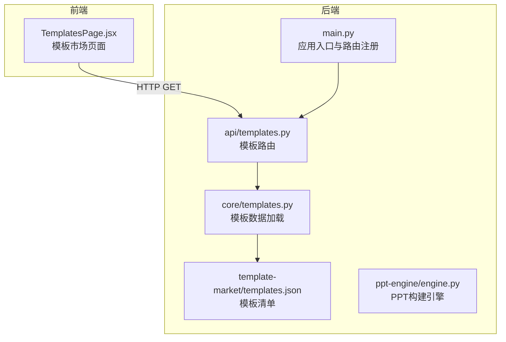
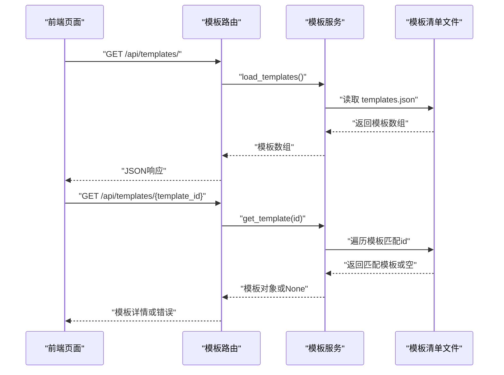
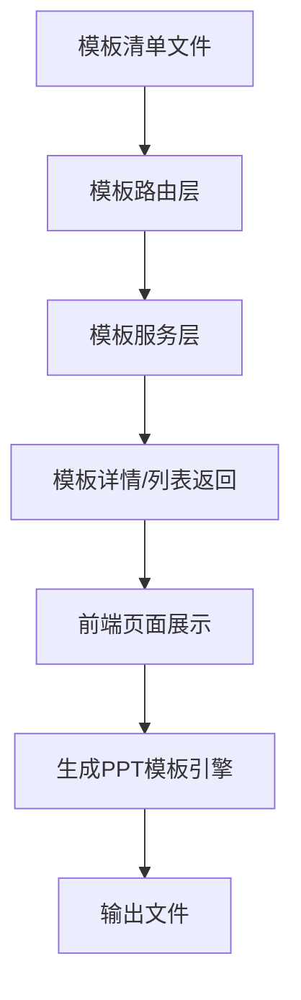

# 模板管理API

<cite>
**本文引用的文件**
- [backend/api/templates.py](file://backend/api/templates.py)
- [backend/core/templates.py](file://backend/core/templates.py)
- [backend/main.py](file://backend/main.py)
- [template-market/templates.json](file://template-market/templates.json)
- [backend/agents/template.py](file://backend/agents/template.py)
- [ppt-engine/engine.py](file://ppt-engine/engine.py)
- [frontend/src/pages/TemplatesPage.jsx](file://frontend/src/pages/TemplatesPage.jsx)
- [backend/core/config.py](file://backend/core/config.py)
</cite>

## 目录
1. [简介](#简介)
2. [项目结构](#项目结构)
3. [核心组件](#核心组件)
4. [架构总览](#架构总览)
5. [详细组件分析](#详细组件分析)
6. [依赖分析](#依赖分析)
7. [性能考虑](#性能考虑)
8. [故障排除指南](#故障排除指南)
9. [结论](#结论)
10. [附录](#附录)

## 简介
本文件为模板管理API的详细接口文档，覆盖以下接口：
- 获取模板列表：GET /api/templates/
- 查询模板详情：GET /api/templates/{template_id}
- 预览模板：GET /api/templates/preview/{template_id}
- 按分类筛选模板：GET /api/templates/category/{category}

同时，文档阐述模板系统架构、模板格式规范、分类体系与缓存策略，给出模板元数据结构、预览生成机制与使用示例，并提供模板定制与扩展指南。

## 项目结构
后端采用FastAPI框架，路由在主应用中注册；模板数据来源于本地JSON文件；前端通过HTTP客户端调用模板接口。

图表来源
- [backend/main.py:30-34](file://backend/main.py#L30-L34)
- [backend/api/templates.py:6-20](file://backend/api/templates.py#L6-L20)
- [backend/core/templates.py:4-12](file://backend/core/templates.py#L4-L12)
- [template-market/templates.json:1-55](file://template-market/templates.json#L1-L55)

章节来源
- [backend/main.py:1-40](file://backend/main.py#L1-L40)
- [backend/api/templates.py:1-20](file://backend/api/templates.py#L1-L20)
- [backend/core/templates.py:1-20](file://backend/core/templates.py#L1-L20)
- [template-market/templates.json:1-55](file://template-market/templates.json#L1-L55)

## 核心组件
- 模板路由层：定义模板相关REST接口，负责请求分发与响应返回。
- 模板数据层：从模板清单文件读取模板元数据，提供模板检索能力。
- 应用入口：注册模板路由，统一处理CORS与静态资源访问。
- 前端页面：拉取模板列表并在UI中展示。

章节来源
- [backend/api/templates.py:6-20](file://backend/api/templates.py#L6-L20)
- [backend/core/templates.py:7-20](file://backend/core/templates.py#L7-L20)
- [backend/main.py:30-34](file://backend/main.py#L30-L34)
- [frontend/src/pages/TemplatesPage.jsx:11-15](file://frontend/src/pages/TemplatesPage.jsx#L11-L15)

## 架构总览
模板管理API采用“路由-服务-数据源”三层结构：
- 路由层：提供HTTP接口，参数校验与错误处理。
- 服务层：封装模板数据访问逻辑，支持全量列表与按ID检索。
- 数据源：模板清单文件，存储模板元数据与预览URL。

图表来源
- [backend/api/templates.py:9-19](file://backend/api/templates.py#L9-L19)
- [backend/core/templates.py:7-20](file://backend/core/templates.py#L7-L20)
- [template-market/templates.json:1-55](file://template-market/templates.json#L1-L55)

## 详细组件分析

### 接口定义与行为
- 获取模板列表
  - 方法与路径：GET /api/templates/
  - 功能：返回所有模板的元数据数组
  - 返回：模板数组；若文件不存在则返回空数组
  - 错误：无显式错误码，业务层以空数组表示
- 查询模板详情
  - 方法与路径：GET /api/templates/{template_id}
  - 参数：path参数template_id
  - 功能：根据ID查找模板
  - 返回：模板对象；未找到返回包含错误键的对象
- 预览模板
  - 方法与路径：GET /api/templates/preview/{template_id}
  - 功能：返回模板预览URL（来自模板元数据）
  - 注意：当前实现直接返回元数据中的预览URL字段
- 分类筛选
  - 方法与路径：GET /api/templates/category/{category}
  - 功能：按category字段过滤模板
  - 当前实现：需在路由层添加该接口

章节来源
- [backend/api/templates.py:9-19](file://backend/api/templates.py#L9-L19)
- [backend/core/templates.py:7-20](file://backend/core/templates.py#L7-L20)
- [template-market/templates.json:1-55](file://template-market/templates.json#L1-L55)

### 模板元数据结构
模板清单文件包含每个模板的元数据，字段如下：
- id：模板唯一标识
- name：模板名称
- description：模板描述
- category：分类标签
- preview_url：预览图相对URL
- features：功能特性数组
- price_tier：价格层级（free/pro/school）
- color_scheme：色彩方案（主色、次色、强调色、背景、文字）
- fonts：字体设置（标题、正文字体）
- image_style：图片风格
- decoration_style：装饰风格

章节来源
- [template-market/templates.json:2-14](file://template-market/templates.json#L2-L14)
- [template-market/templates.json:15-27](file://template-market/templates.json#L15-L27)
- [template-market/templates.json:28-40](file://template-market/templates.json#L28-L40)
- [template-market/templates.json:41-53](file://template-market/templates.json#L41-L53)

### 预览生成机制
- 元数据预览：模板元数据中包含预览URL字段，用于前端展示缩略图。
- 引擎预览：PPT构建引擎可基于模板样式与布局生成演示文稿，但当前API未暴露该能力。
- 扩展建议：可在后端新增预览生成接口，结合模板样式与示例内容生成临时预览文件并返回URL。

章节来源
- [template-market/templates.json:7,21,34,47:7-7](file://template-market/templates.json#L7-L7)
- [ppt-engine/engine.py:124-147](file://ppt-engine/engine.py#L124-L147)

### 分类体系
- 分类字段：category
- 示例分类：education、business
- 过滤方式：前端或后端按category字段筛选

章节来源
- [template-market/templates.json:6,19,32,45:6-6](file://template-market/templates.json#L6-L6)
- [template-market/templates.json:13,26,39,52:13-13](file://template-market/templates.json#L13-L13)

### 缓存策略
- 文件缓存：模板数据来自本地JSON文件，可利用操作系统文件系统缓存提升读取性能。
- 应用级缓存：可在服务层增加内存缓存（如lru_cache），减少重复解析JSON的成本。
- CDN缓存：预览图与静态资源可通过CDN加速。
- 建议：对模板列表与详情分别设置合理的缓存时间，避免频繁I/O。

章节来源
- [backend/core/templates.py:7-12](file://backend/core/templates.py#L7-L12)
- [backend/core/config.py:25-27](file://backend/core/config.py#L25-L27)

### 使用示例
- 获取模板列表
  - 请求：GET /api/templates/
  - 响应：模板数组
- 查看模板详情
  - 请求：GET /api/templates/{template_id}
  - 响应：模板对象或错误对象
- 展示预览
  - 请求：GET /api/templates/preview/{template_id}
  - 响应：返回元数据中的预览URL字段
- 分类筛选
  - 请求：GET /api/templates/category/{category}
  - 响应：按分类过滤后的模板数组

章节来源
- [frontend/src/pages/TemplatesPage.jsx:11-15](file://frontend/src/pages/TemplatesPage.jsx#L11-L15)
- [backend/api/templates.py:9-19](file://backend/api/templates.py#L9-L19)

### 模板定制与扩展指南
- 新增模板
  - 在模板清单文件中追加一条模板记录，确保id唯一且包含必需字段
  - 提供对应预览图并更新preview_url
- 自定义样式
  - 在模板元数据中调整color_scheme、fonts、image_style、decoration_style
- 新增分类
  - 在模板元数据中设置新的category值
- 扩展接口
  - 在路由层新增分类筛选与预览生成接口
  - 在服务层实现对应的过滤与生成逻辑

章节来源
- [template-market/templates.json:1-55](file://template-market/templates.json#L1-L55)
- [backend/api/templates.py:6-20](file://backend/api/templates.py#L6-L20)

## 依赖分析
- 路由依赖：模板路由依赖模板服务函数
- 服务依赖：模板服务依赖模板清单文件
- 应用依赖：应用入口注册模板路由并启用CORS

图表来源
- [backend/api/templates.py:1-5](file://backend/api/templates.py#L1-L5)
- [backend/core/templates.py:1-4](file://backend/core/templates.py#L1-L4)
- [backend/main.py:30-34](file://backend/main.py#L30-L34)

章节来源
- [backend/api/templates.py:1-5](file://backend/api/templates.py#L1-L5)
- [backend/core/templates.py:1-4](file://backend/core/templates.py#L1-L4)
- [backend/main.py:30-34](file://backend/main.py#L30-L34)

## 性能考虑
- I/O优化：模板清单文件较小，可常驻内存；对频繁访问的模板ID可做LRU缓存
- 并发安全：多用户并发读取模板列表时，注意JSON解析的线程安全
- 前端缓存：前端可缓存模板列表与预览图，减少重复请求
- 存储位置：将模板清单文件置于SSD或使用更快的存储介质

## 故障排除指南
- 模板未找到
  - 现象：查询模板详情返回错误对象
  - 处理：确认template_id是否正确，检查模板清单文件是否存在
- 文件不存在
  - 现象：模板列表为空数组
  - 处理：确认模板清单文件路径与权限
- CORS问题
  - 现象：跨域请求失败
  - 处理：检查CORS中间件配置

章节来源
- [backend/api/templates.py:17-19](file://backend/api/templates.py#L17-L19)
- [backend/core/templates.py:9-12](file://backend/core/templates.py#L9-L12)
- [backend/main.py:22-28](file://backend/main.py#L22-L28)

## 结论
模板管理API提供了简洁高效的模板数据访问能力，配合模板清单文件即可实现模板市场的展示与筛选。建议后续增强预览生成与分类筛选接口，并引入缓存与CDN以提升性能与用户体验。

## 附录
- 模板系统与生成流程概览

图表来源
- [template-market/templates.json:1-55](file://template-market/templates.json#L1-L55)
- [backend/api/templates.py:9-19](file://backend/api/templates.py#L9-L19)
- [ppt-engine/engine.py:124-147](file://ppt-engine/engine.py#L124-L147)