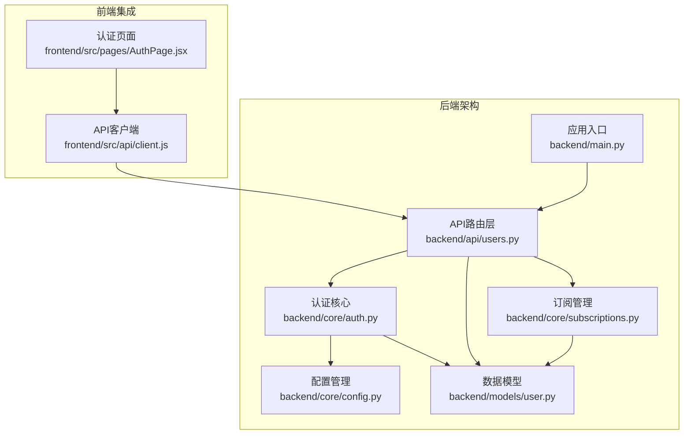
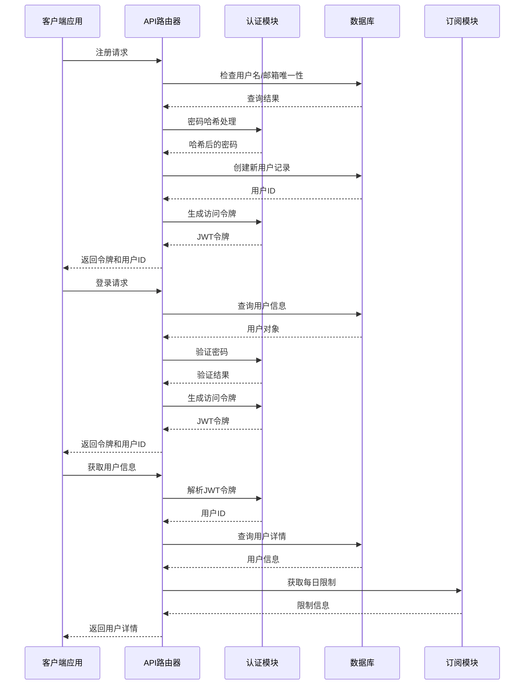
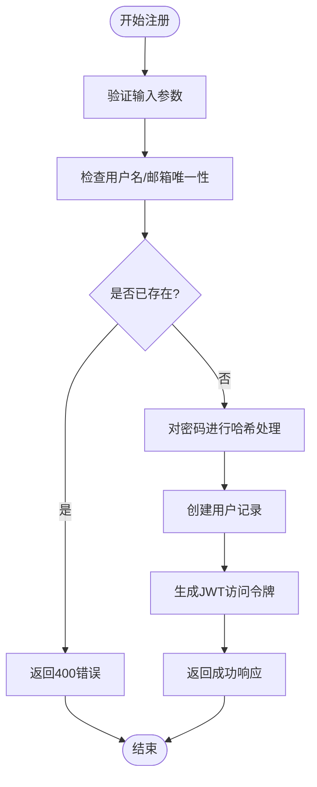
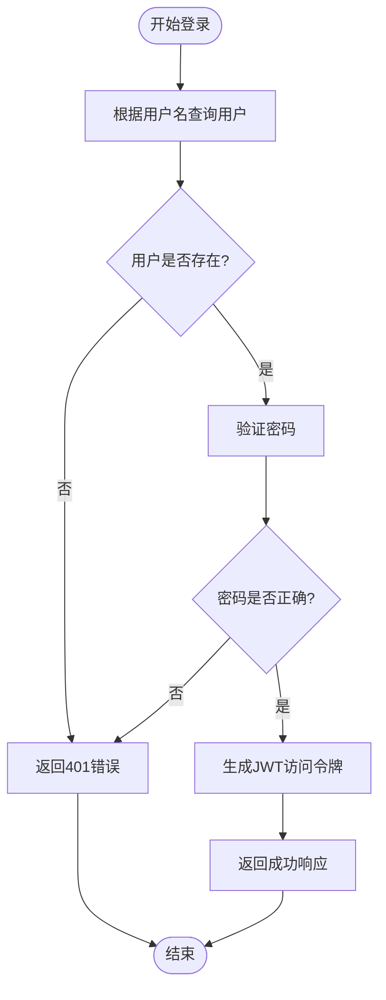
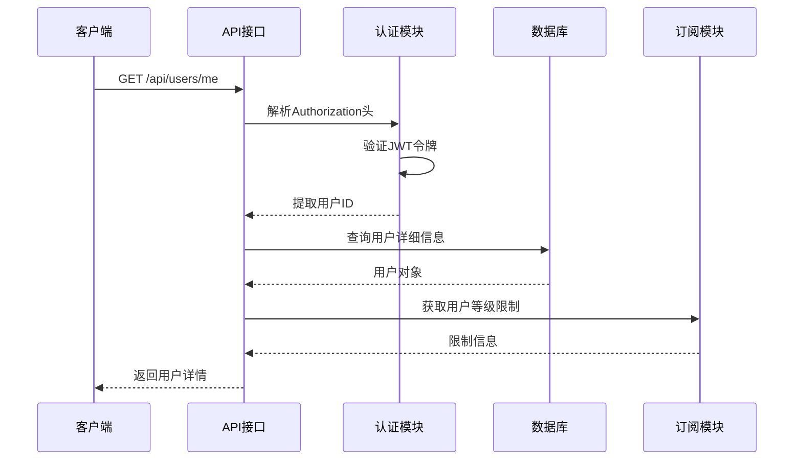
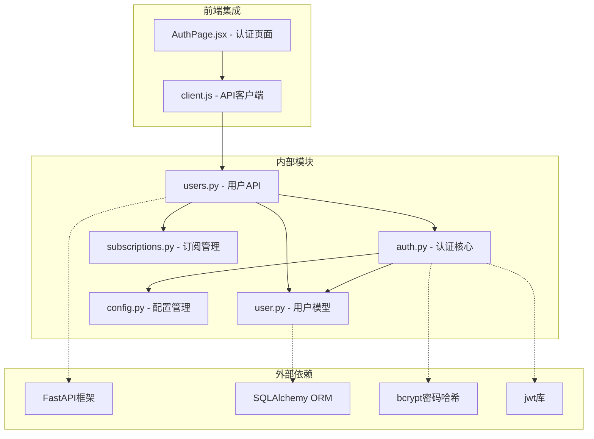

# 用户管理API

<cite>
**本文档引用的文件**
- [backend/api/users.py](file://backend/api/users.py)
- [backend/core/auth.py](file://backend/core/auth.py)
- [backend/models/user.py](file://backend/models/user.py)
- [backend/core/config.py](file://backend/core/config.py)
- [backend/core/subscriptions.py](file://backend/core/subscriptions.py)
- [backend/main.py](file://backend/main.py)
- [frontend/src/api/client.js](file://frontend/src/api/client.js)
- [frontend/src/pages/AuthPage.jsx](file://frontend/src/pages/AuthPage.jsx)
</cite>

## 目录
1. [简介](#简介)
2. [项目结构](#项目结构)
3. [核心组件](#核心组件)
4. [架构概览](#架构概览)
5. [详细组件分析](#详细组件分析)
6. [依赖关系分析](#依赖关系分析)
7. [性能考虑](#性能考虑)
8. [故障排除指南](#故障排除指南)
9. [结论](#结论)
10. [附录](#附录)

## 简介

用户管理API是AI PPT操作系统的核心认证和授权模块，负责处理用户的注册、登录和信息查询功能。该系统基于FastAPI构建，采用JWT（JSON Web Token）进行身份验证，使用bcrypt进行密码哈希加密，并通过SQLAlchemy ORM进行数据库操作。

本API提供了完整的用户生命周期管理功能，包括：
- 用户注册（用户名、邮箱、密码验证）
- 用户登录（凭据验证和令牌颁发）
- 用户信息查询（受保护的个人信息获取）

## 项目结构

用户管理API位于后端服务的特定目录结构中，采用分层架构设计：



**图表来源**
- [backend/api/users.py:1-75](file://backend/api/users.py#L1-L75)
- [backend/core/auth.py:1-57](file://backend/core/auth.py#L1-L57)
- [backend/main.py:1-40](file://backend/main.py#L1-L40)

**章节来源**
- [backend/api/users.py:1-75](file://backend/api/users.py#L1-L75)
- [backend/main.py:1-40](file://backend/main.py#L1-L40)

## 核心组件

### 数据模型定义

用户实体采用SQLAlchemy ORM映射到数据库表，包含以下关键字段：

| 字段名 | 类型 | 描述 | 约束 |
|--------|------|------|------|
| id | Integer | 用户唯一标识符 | 主键，自增 |
| username | String(50) | 用户名 | 唯一，非空 |
| email | String(255) | 邮箱地址 | 唯一，非空 |
| hashed_password | String(255) | 加密后的密码 | 非空 |
| tier | String(20) | 用户等级 | 默认"free" |
| daily_used | Integer | 当日使用次数 | 默认0 |
| daily_reset | DateTime | 日使用量重置时间 | 可为空 |
| is_active | Boolean | 账户激活状态 | 默认True |
| created_at | DateTime | 创建时间 | 服务器默认值 |
| updated_at | DateTime | 更新时间 | 自动更新 |

### 认证配置

系统使用以下安全配置参数：

| 配置项 | 默认值 | 描述 |
|--------|--------|------|
| jwt_secret | "ppt-os-v3-secret-key-change-in-production" | JWT签名密钥 |
| jwt_algorithm | "HS256" | JWT算法 |
| access_token_expire_minutes | 1440 | 令牌过期时间（分钟） |
| database_url | sqlite+aiosqlite:///data/pptv3.db | 数据库连接字符串 |

**章节来源**
- [backend/models/user.py:1-21](file://backend/models/user.py#L1-L21)
- [backend/core/config.py:1-34](file://backend/core/config.py#L1-L34)

## 架构概览

用户管理API采用现代Web应用的标准架构模式：



**图表来源**
- [backend/api/users.py:34-74](file://backend/api/users.py#L34-L74)
- [backend/core/auth.py:24-56](file://backend/core/auth.py#L24-L56)

## 详细组件分析

### 用户注册接口

#### 接口定义
- **URL**: `POST /api/users/register`
- **功能**: 创建新用户账户
- **认证**: 无需认证
- **内容类型**: application/json

#### 请求参数

| 参数名 | 类型 | 必需 | 描述 |
|--------|------|------|------|
| username | string | 是 | 用户名，长度限制在50字符以内 |
| email | string | 是 | 邮箱地址，必须符合邮箱格式 |
| password | string | 是 | 密码，将自动进行哈希处理 |

#### 响应格式

成功响应返回JSON对象：

| 字段名 | 类型 | 描述 |
|--------|------|------|
| access_token | string | JWT访问令牌 |
| token_type | string | 令牌类型，固定为"bearer" |
| user_id | integer | 新创建用户的ID |

#### 错误处理

| HTTP状态码 | 错误详情 | 描述 |
|------------|----------|------|
| 400 | "用户名或邮箱已存在" | 用户名或邮箱已被其他用户使用 |
| 500 | 数据库异常 | 数据库操作失败 |

#### 实现流程图



**图表来源**
- [backend/api/users.py:34-51](file://backend/api/users.py#L34-L51)
- [backend/core/auth.py:16-17](file://backend/core/auth.py#L16-L17)

**章节来源**
- [backend/api/users.py:14-51](file://backend/api/users.py#L14-L51)

### 用户登录接口

#### 接口定义
- **URL**: `POST /api/users/login`
- **功能**: 用户身份验证和令牌颁发
- **认证**: 无需认证
- **内容类型**: application/json

#### 请求参数

| 参数名 | 类型 | 必需 | 描述 |
|--------|------|------|------|
| username | string | 是 | 用户名 |
| password | string | 是 | 用户密码 |

#### 响应格式

成功响应返回与注册相同的JSON结构：

| 字段名 | 类型 | 描述 |
|--------|------|------|
| access_token | string | JWT访问令牌 |
| token_type | string | 令牌类型，固定为"bearer" |
| user_id | integer | 用户ID |

#### 错误处理

| HTTP状态码 | 错误详情 | 描述 |
|------------|----------|------|
| 401 | "用户名或密码错误" | 用户名不存在或密码不正确 |
| 500 | 数据库异常 | 数据库查询失败 |

#### 登录流程图



**图表来源**
- [backend/api/users.py:54-61](file://backend/api/users.py#L54-L61)
- [backend/core/auth.py:20-21](file://backend/core/auth.py#L20-L21)

**章节来源**
- [backend/api/users.py:20-61](file://backend/api/users.py#L20-L61)

### 用户信息查询接口

#### 接口定义
- **URL**: `GET /api/users/me`
- **功能**: 获取当前认证用户的信息
- **认证**: 需要有效的JWT访问令牌
- **内容类型**: application/json

#### 请求头参数

| 头部名称 | 类型 | 必需 | 描述 |
|----------|------|------|------|
| Authorization | string | 是 | Bearer + 空格 + JWT令牌 |

#### 响应格式

用户信息响应包含以下字段：

| 字段名 | 类型 | 描述 |
|--------|------|------|
| id | integer | 用户ID |
| username | string | 用户名 |
| email | string | 邮箱地址 |
| tier | string | 用户等级（free/pro/school） |
| daily_used | integer | 当日已使用次数 |
| daily_limit | integer | 当日使用限制 |

#### 错误处理

| HTTP状态码 | 错误详情 | 描述 |
|------------|----------|------|
| 401 | "Invalid token" | JWT令牌无效或已过期 |
| 404 | "User not found" | 令牌有效但用户不存在 |

#### 用户信息查询流程



**图表来源**
- [backend/api/users.py:64-74](file://backend/api/users.py#L64-L74)
- [backend/core/auth.py:47-56](file://backend/core/auth.py#L47-L56)

**章节来源**
- [backend/api/users.py:25-74](file://backend/api/users.py#L25-L74)

### 认证和授权机制

#### JWT令牌生成

系统使用以下参数生成JWT令牌：
- **载荷内容**: 包含用户ID（sub字段）和过期时间（exp字段）
- **算法**: HS256
- **过期时间**: 默认24小时（1440分钟）

#### 密码安全

- **哈希算法**: bcrypt
- **盐值生成**: 自动生成
- **验证过程**: 使用bcrypt.checkpw进行密码验证

#### 令牌解析

令牌解析过程包含以下步骤：
1. 验证JWT签名
2. 检查令牌是否过期
3. 提取用户ID
4. 在数据库中查找对应用户
5. 返回用户对象

**章节来源**
- [backend/core/auth.py:16-56](file://backend/core/auth.py#L16-L56)
- [backend/core/config.py:14-16](file://backend/core/config.py#L14-L16)

## 依赖关系分析

用户管理API的依赖关系体现了清晰的分层架构：



**图表来源**
- [backend/api/users.py:1-11](file://backend/api/users.py#L1-L11)
- [backend/core/auth.py:1-11](file://backend/core/auth.py#L1-L11)

### 关键依赖关系

1. **API层依赖认证层**: 所有用户操作都依赖于认证模块提供的密码处理和令牌管理功能
2. **认证层依赖配置层**: 认证功能依赖于配置文件中的安全参数设置
3. **模型层独立**: 用户模型作为数据持久化的抽象层，被多个业务模块共享
4. **前端依赖API层**: 前端通过统一的API客户端访问所有用户管理功能

**章节来源**
- [backend/api/users.py:1-9](file://backend/api/users.py#L1-L9)
- [backend/core/auth.py:1-11](file://backend/core/auth.py#L1-L11)

## 性能考虑

### 数据库优化

- **索引策略**: 用户名和邮箱字段具有唯一约束，自动创建数据库索引
- **查询优化**: 使用异步SQLAlchemy查询避免阻塞
- **连接池**: 使用异步数据库连接池提高并发性能

### 缓存策略

- **令牌缓存**: JWT令牌在内存中验证，避免频繁的数据库查询
- **会话管理**: 使用HTTP Bearer令牌，减少服务器状态存储

### 安全优化

- **密码哈希**: 使用bcrypt进行密码哈希，防止彩虹表攻击
- **令牌过期**: 设置合理的令牌过期时间，降低安全风险
- **CORS配置**: 允许跨域请求，便于前端开发调试

## 故障排除指南

### 常见问题及解决方案

#### 注册失败
**症状**: 注册时返回"用户名或邮箱已存在"
**原因**: 用户名或邮箱已被其他用户使用
**解决方法**: 
1. 检查用户名和邮箱的唯一性
2. 提示用户使用不同的用户名或邮箱
3. 验证前端输入格式

#### 登录失败
**症状**: 登录时返回"用户名或密码错误"
**原因**: 用户名不存在或密码不正确
**解决方法**:
1. 确认用户名大小写
2. 检查密码是否正确
3. 验证用户账户状态

#### 令牌验证失败
**症状**: 获取用户信息时返回"Invalid token"
**原因**: JWT令牌无效、过期或格式不正确
**解决方法**:
1. 检查Authorization头格式
2. 验证令牌是否过期
3. 确认令牌签名密钥正确

#### 数据库连接问题
**症状**: API调用时出现数据库错误
**原因**: 数据库连接字符串配置错误或数据库服务不可用
**解决方法**:
1. 检查DATABASE_URL配置
2. 验证数据库服务状态
3. 确认数据库权限设置

**章节来源**
- [backend/api/users.py:39,58,59](file://backend/api/users.py#L39,L58-L59)
- [backend/core/auth.py:42-44](file://backend/core/auth.py#L42-L44)

## 结论

用户管理API提供了完整的用户生命周期管理功能，具有以下特点：

### 技术优势
- **安全性**: 采用JWT令牌认证、bcrypt密码哈希和严格的输入验证
- **可扩展性**: 清晰的分层架构支持功能扩展和模块化开发
- **易用性**: RESTful API设计，易于前端集成和第三方调用

### 功能完整性
- 支持用户注册、登录和信息查询的核心功能
- 集成订阅管理和使用量控制
- 提供完整的错误处理和状态码

### 最佳实践建议
1. **生产环境部署**: 更改默认JWT密钥，配置生产数据库
2. **安全加固**: 实施IP白名单、速率限制和双因素认证
3. **监控告警**: 添加API调用监控和异常告警机制
4. **文档维护**: 保持API文档与代码同步更新

## 附录

### 客户端集成指南

#### 基础设置
1. **安装依赖**: 确保项目中包含axios库
2. **配置基础URL**: 设置 `/api` 作为API基础路径
3. **设置超时**: 配置120秒的请求超时时间

#### 认证流程

```javascript
// 注册用户
const register = async (username, email, password) => {
  const response = await client.post('/users/register', {
    username,
    email,
    password
  });
  // 存储JWT令牌
  localStorage.setItem('token', response.data.access_token);
  return response.data;
};

// 用户登录
const login = async (username, password) => {
  const response = await client.post('/users/login', {
    username,
    password
  });
  localStorage.setItem('token', response.data.access_token);
  return response.data;
};
```

#### 受保护的API调用

```javascript
// 获取用户信息
const getUserInfo = async () => {
  try {
    const response = await client.get('/users/me');
    return response.data;
  } catch (error) {
    if (error.response?.status === 401) {
      // 令牌过期，跳转到登录页
      localStorage.removeItem('token');
      window.location.href = '/auth';
    }
    throw error;
  }
};
```

#### 安全最佳实践

1. **令牌存储**: 使用localStorage存储JWT令牌，注意XSS防护
2. **请求拦截**: 自动添加Authorization头到所有请求
3. **错误处理**: 实现401错误的自动登出逻辑
4. **输入验证**: 前端和后端双重验证用户输入
5. **HTTPS**: 生产环境必须使用HTTPS协议传输

**章节来源**
- [frontend/src/api/client.js:1-28](file://frontend/src/api/client.js#L1-L28)
- [frontend/src/pages/AuthPage.jsx:12-29](file://frontend/src/pages/AuthPage.jsx#L12-L29)