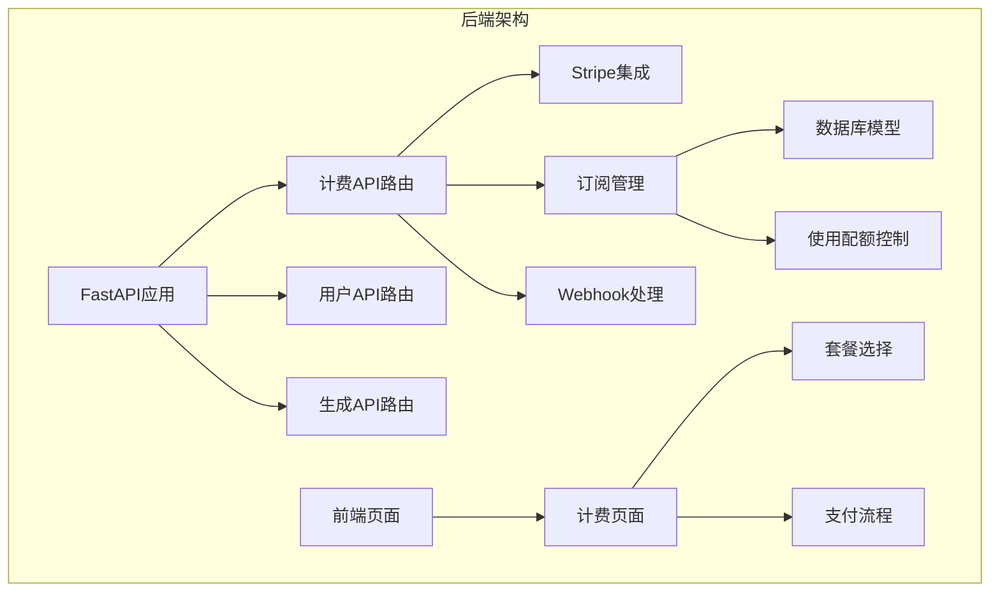
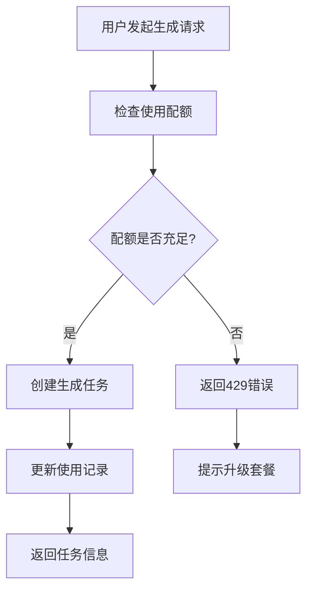
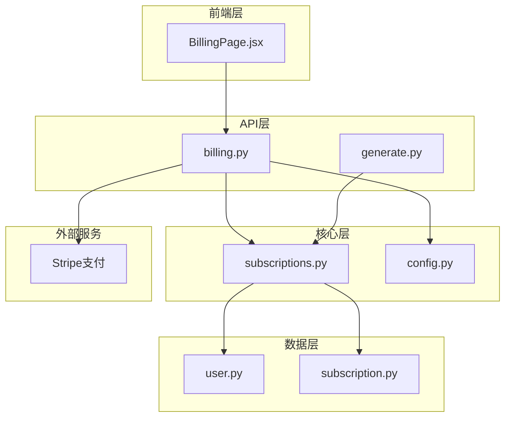
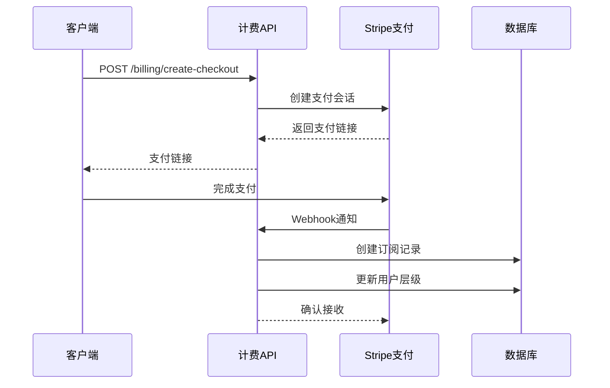
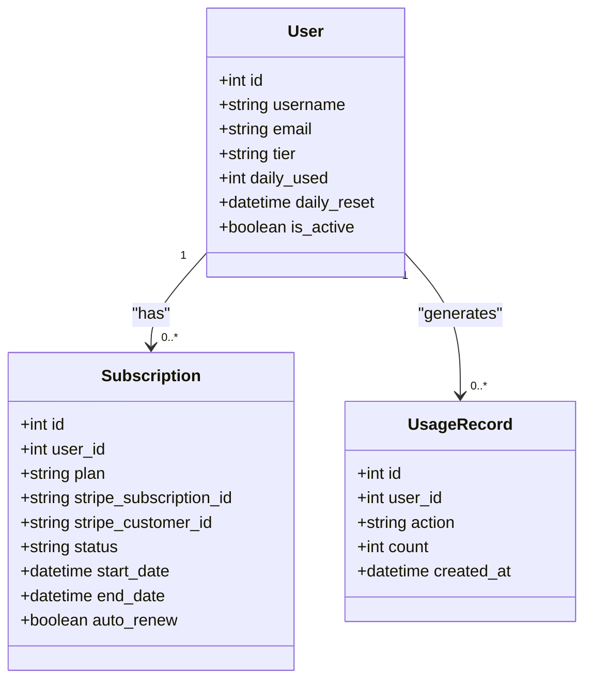
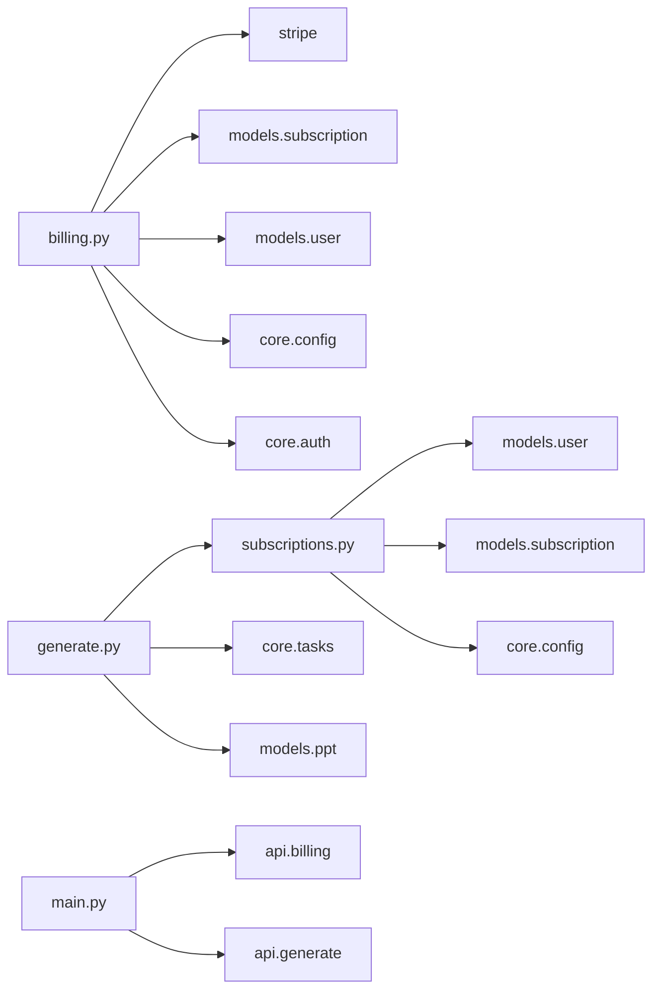

# 计费订阅API

<cite>
**本文档引用的文件**
- [billing.py](file://backend/api/billing.py)
- [subscriptions.py](file://backend/core/subscriptions.py)
- [subscription.py](file://backend/models/subscription.py)
- [user.py](file://backend/models/user.py)
- [config.py](file://backend/core/config.py)
- [main.py](file://backend/main.py)
- [generate.py](file://backend/api/generate.py)
- [tasks.py](file://backend/core/tasks.py)
- [BillingPage.jsx](file://frontend/src/pages/BillingPage.jsx)
</cite>

## 目录
1. [简介](#简介)
2. [项目结构](#项目结构)
3. [核心组件](#核心组件)
4. [架构概览](#架构概览)
5. [详细组件分析](#详细组件分析)
6. [依赖关系分析](#依赖关系分析)
7. [性能考虑](#性能考虑)
8. [故障排除指南](#故障排除指南)
9. [结论](#结论)

## 简介

AI课件大师计费订阅API是一个基于FastAPI构建的完整订阅管理系统，集成了Stripe支付服务，提供了多层次的订阅套餐、使用配额控制和自动化的计费周期管理。该系统支持免费、Pro和学校版三种订阅层级，通过每日生成次数限制来控制用户使用量，并提供了完整的支付处理流程和Webhook事件处理机制。

## 项目结构

计费订阅API位于后端项目的`backend/api/billing.py`文件中，与核心订阅管理逻辑分离，形成了清晰的模块化架构：

**图表来源**
- [main.py:30-34](file://backend/main.py#L30-L34)
- [billing.py:11](file://backend/api/billing.py#L11)

**章节来源**
- [main.py:16-34](file://backend/main.py#L16-L34)
- [billing.py:1-80](file://backend/api/billing.py#L1-L80)

## 核心组件

### 订阅层级设计

系统实现了三层订阅层级，每层都有不同的功能权限和使用限制：

| 层级 | 日生成次数 | 功能权限 | 价格 |
|------|------------|----------|------|
| 免费 | 3次 | 基础导出 | ¥0/月 |
| Pro | 100次 | 所有功能 | ¥29/月 |
| 学校版 | 无限次 | 全部功能+API | ¥2999/年 |

### 使用配额控制系统

每个用户都维护着独立的使用配额，系统在每次生成操作前进行配额检查：

**图表来源**
- [generate.py:26-29](file://backend/api/generate.py#L26-L29)
- [subscriptions.py:46-50](file://backend/core/subscriptions.py#L46-L50)

**章节来源**
- [subscriptions.py:10-35](file://backend/core/subscriptions.py#L10-L35)
- [user.py:14-16](file://backend/models/user.py#L14-L16)

## 架构概览

计费订阅API采用分层架构设计，将支付处理、订阅管理和使用控制逻辑分离：

**图表来源**
- [billing.py:14-79](file://backend/api/billing.py#L14-L79)
- [generate.py:20-35](file://backend/api/generate.py#L20-L35)

## 详细组件分析

### Stripe支付集成

计费API通过Stripe提供完整的支付处理能力，包括：

#### 创建支付会话
- 支持多种套餐类型：pro_monthly、pro_yearly、school_yearly
- 自动设置货币为人民币(CNY)
- 集成成功和取消回调URL
- 包含用户ID和套餐信息的元数据

#### Webhook事件处理
- 处理`checkout.session.completed`事件
- 自动创建订阅记录
- 更新用户层级
- 同步Stripe客户和订阅ID

**图表来源**
- [billing.py:14-42](file://backend/api/billing.py#L14-L42)
- [billing.py:45-79](file://backend/api/billing.py#L45-L79)

**章节来源**
- [billing.py:14-79](file://backend/api/billing.py#L14-L79)
- [config.py:18-19](file://backend/core/config.py#L18-L19)

### 订阅管理

订阅管理模块负责处理用户的订阅状态和使用配额：

#### 订阅状态管理
- 支持active、inactive等状态
- 自动续费功能
- 计费周期跟踪
- Stripe集成同步

#### 使用配额控制
- 每日使用次数限制
- 实时配额检查
- 自动生成使用记录
- 配额重置机制

**章节来源**
- [subscription.py:6-19](file://backend/models/subscription.py#L6-L19)
- [subscriptions.py:46-58](file://backend/core/subscriptions.py#L46-L58)

### 用户权限系统

用户模型包含了完整的订阅相关信息：

**图表来源**
- [user.py:6-21](file://backend/models/user.py#L6-L21)
- [subscription.py:6-29](file://backend/models/subscription.py#L6-L29)

**章节来源**
- [user.py:6-21](file://backend/models/user.py#L6-L21)
- [subscription.py:21-29](file://backend/models/subscription.py#L21-L29)

## 依赖关系分析

系统的关键依赖关系如下：

**图表来源**
- [billing.py:1-10](file://backend/api/billing.py#L1-L10)
- [generate.py:1-10](file://backend/api/generate.py#L1-L10)

**章节来源**
- [billing.py:1-10](file://backend/api/billing.py#L1-L10)
- [generate.py:1-10](file://backend/api/generate.py#L1-L10)

## 性能考虑

### 缓存策略
- 使用Redis作为缓存存储
- 配额检查结果缓存
- 用户层级信息缓存

### 异步处理
- 使用asyncio处理并发请求
- 异步数据库操作
- 任务队列管理

### 数据库优化
- 合理的索引设计
- 连接池管理
- 查询优化

## 故障排除指南

### 常见问题及解决方案

#### Stripe配置问题
- 确认`STRIPE_SECRET_KEY`和`STRIPE_WEBHOOK_SECRET`环境变量正确设置
- 验证Webhook签名验证
- 检查支付会话创建参数

#### 订阅状态异常
- 检查Webhook处理是否正常
- 验证用户层级更新逻辑
- 确认数据库连接状态

#### 使用配额错误
- 检查每日重置时间设置
- 验证配额检查逻辑
- 确认使用记录生成

**章节来源**
- [billing.py:45-79](file://backend/api/billing.py#L45-L79)
- [subscriptions.py:46-58](file://backend/core/subscriptions.py#L46-L58)

## 结论

AI课件大师计费订阅API提供了一个完整、可扩展的订阅管理系统。通过清晰的模块化设计、完善的Stripe集成和智能的使用配额控制，该系统能够有效支持从个人用户到企业客户的多样化需求。系统的架构设计确保了良好的可维护性和扩展性，为未来的功能增强奠定了坚实的基础。