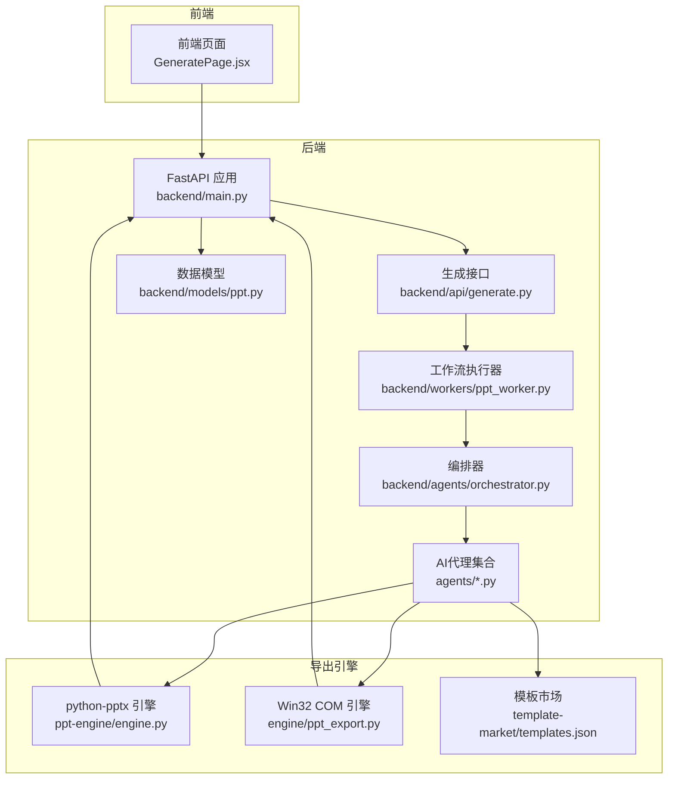
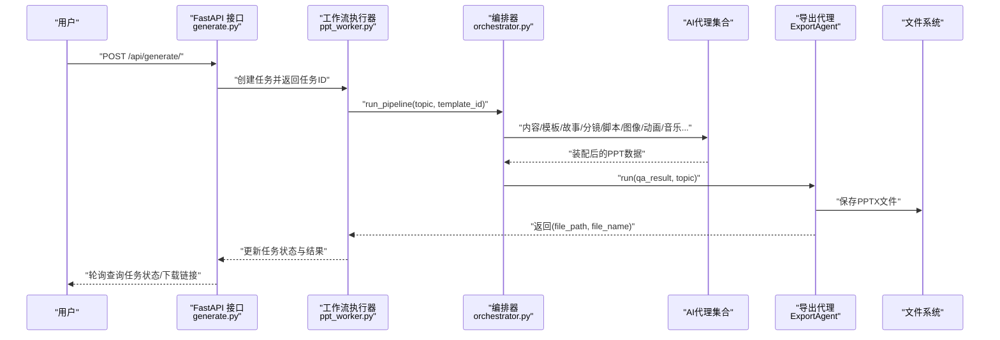
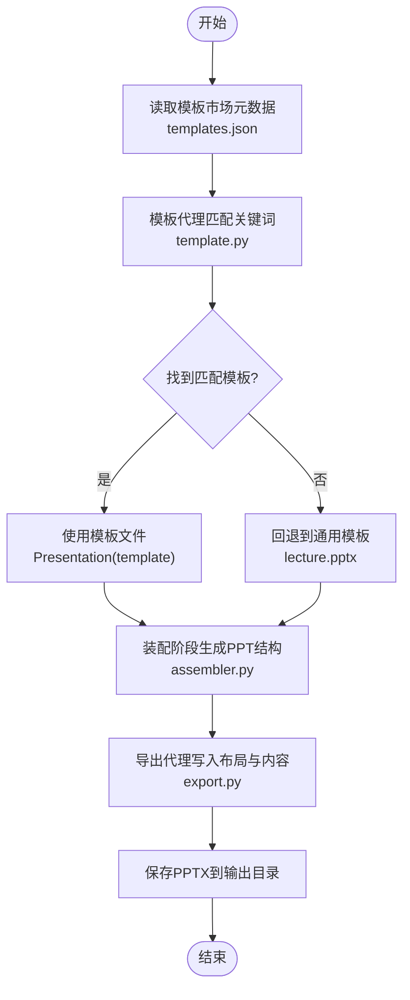
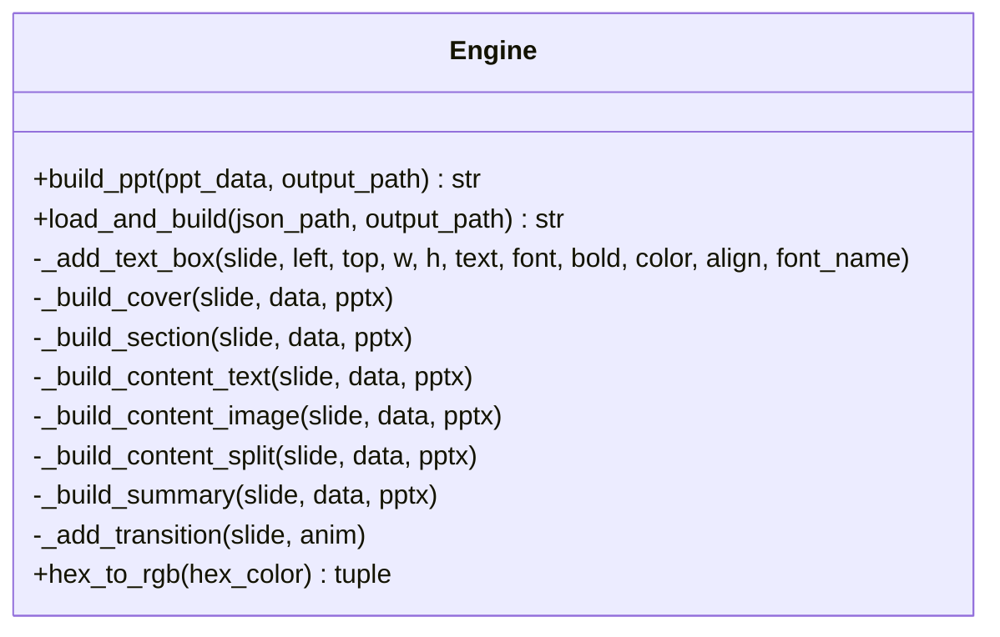
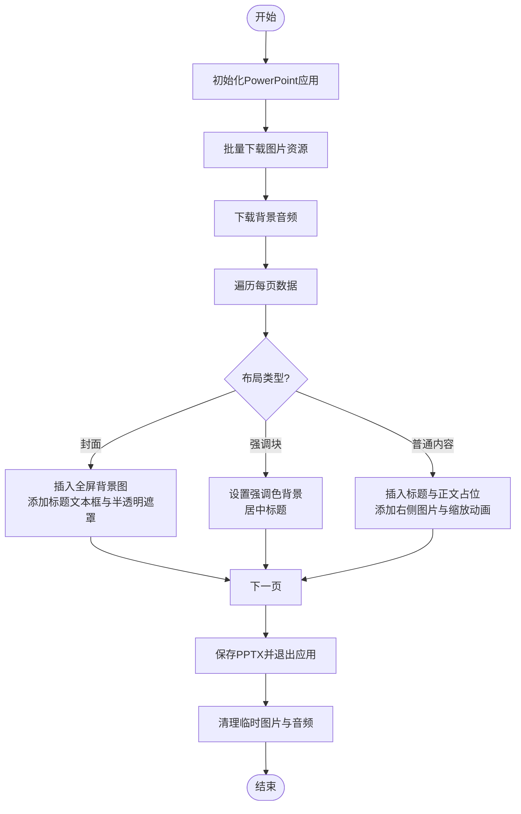
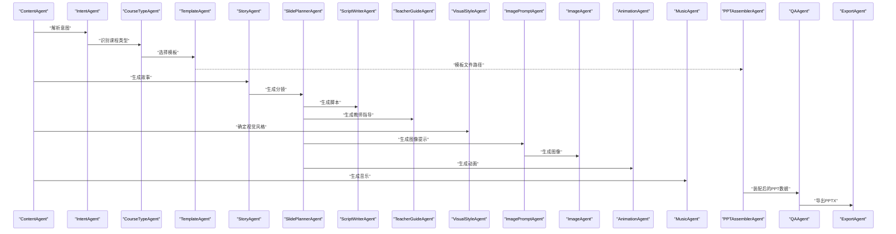
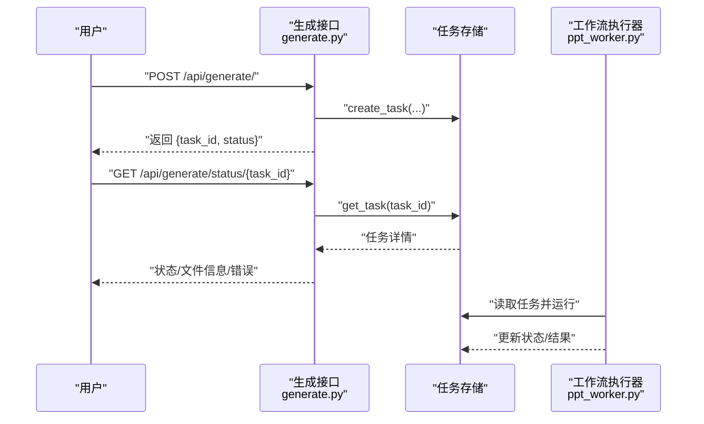
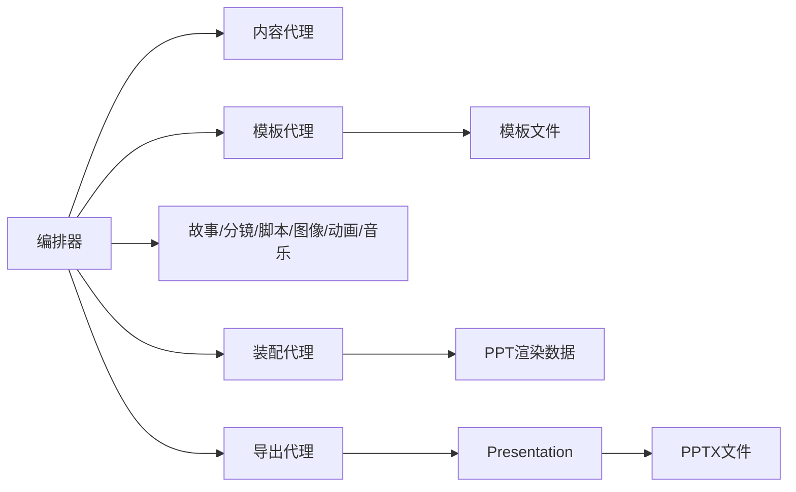

# PPT引擎

<cite>
**本文引用的文件**
- [backend/main.py](file://backend/main.py)
- [backend/api/generate.py](file://backend/api/generate.py)
- [backend/workers/ppt_worker.py](file://backend/workers/ppt_worker.py)
- [backend/agents/orchestrator.py](file://backend/agents/orchestrator.py)
- [backend/agents/base.py](file://backend/agents/base.py)
- [backend/agents/content.py](file://backend/agents/content.py)
- [backend/agents/template.py](file://backend/agents/template.py)
- [backend/agents/assembler.py](file://backend/agents/assembler.py)
- [backend/agents/export.py](file://backend/agents/export.py)
- [backend/models/ppt.py](file://backend/models/ppt.py)
- [engine/ppt_export.py](file://engine/ppt_export.py)
- [ppt-engine/engine.py](file://ppt-engine/engine.py)
- [template-market/templates.json](file://template-market/templates.json)
</cite>

## 目录
1. [简介](#简介)
2. [项目结构](#项目结构)
3. [核心组件](#核心组件)
4. [架构总览](#架构总览)
5. [详细组件分析](#详细组件分析)
6. [依赖关系分析](#依赖关系分析)
7. [性能考虑](#性能考虑)
8. [故障排查指南](#故障排查指南)
9. [结论](#结论)
10. [附录](#附录)

## 简介
本技术文档面向“PPT生成引擎”的整体架构与实现，覆盖以下主题：
- 引擎架构：后端FastAPI服务、AI代理流水线、工作流调度与导出模块
- 模板系统：模板分类、模板加载机制与动态内容填充
- 布局构建：基于python-pptx的对象模型与样式处理
- 导出流程：PPTX生成、文件保存与质量控制
- 集成与数据传递：与AI代理系统的协作与数据格式约定
- 开发与优化：模板开发指南、样式定制方法、性能优化与常见问题排查

## 项目结构
该仓库采用前后端分离与多模块协作的组织方式：
- 后端（FastAPI）：提供REST接口、任务队列与数据库交互
- AI代理层：由多个专门Agent组成流水线，负责内容规划、模板选择、装配与导出
- 导出引擎：封装两种导出路径（Win32 COM与python-pptx）
- 模板市场：提供模板元数据与分类信息
- 前端：Web界面用于发起生成任务与下载结果

图表来源
- [backend/main.py:16-40](file://backend/main.py#L16-L40)
- [backend/api/generate.py:20-52](file://backend/api/generate.py#L20-L52)
- [backend/workers/ppt_worker.py:5-24](file://backend/workers/ppt_worker.py#L5-L24)
- [backend/agents/orchestrator.py:19-56](file://backend/agents/orchestrator.py#L19-L56)
- [ppt-engine/engine.py:124-166](file://ppt-engine/engine.py#L124-L166)
- [engine/ppt_export.py:245-257](file://engine/ppt_export.py#L245-L257)
- [template-market/templates.json:1-55](file://template-market/templates.json#L1-L55)

章节来源
- [backend/main.py:1-40](file://backend/main.py#L1-L40)
- [backend/api/generate.py:1-52](file://backend/api/generate.py#L1-L52)
- [backend/workers/ppt_worker.py:1-24](file://backend/workers/ppt_worker.py#L1-L24)
- [backend/agents/orchestrator.py:1-56](file://backend/agents/orchestrator.py#L1-L56)
- [ppt-engine/engine.py:1-166](file://ppt-engine/engine.py#L1-L166)
- [engine/ppt_export.py:1-257](file://engine/ppt_export.py#L1-L257)
- [template-market/templates.json:1-55](file://template-market/templates.json#L1-L55)

## 核心组件
- FastAPI应用与路由
  - 初始化数据库连接生命周期
  - 注册用户、计费、模板、生成、下载等路由
  - 提供健康检查端点
- 生成接口
  - 校验主题有效性与配额限制
  - 创建异步任务并返回任务ID
- 工作流执行器
  - 从任务存储中取出任务，标记运行状态
  - 调用编排器执行完整流水线
  - 记录成功/失败状态与结果
- 编排器
  - 组织内容、意图、课程类型、故事、分镜、脚本、教师指导、视觉风格、图像提示、图像、动画、音乐、装配与导出
- AI代理基类
  - 统一的LLM对话与JSON解析能力
- 模板代理
  - 基于关键词匹配选择模板文件
- 装配代理
  - 将各模块产物整合为PPT渲染结构
- 导出代理
  - 使用python-pptx或模板文件生成PPTX
- python-pptx引擎
  - 定义布局构建器、样式工具与PPT生成入口
- Win32 COM引擎
  - 在Windows环境下通过PowerPoint进程直接生成PPTX
- 模板市场
  - 提供模板元数据（颜色方案、字体、风格等）

章节来源
- [backend/main.py:16-40](file://backend/main.py#L16-L40)
- [backend/api/generate.py:20-52](file://backend/api/generate.py#L20-L52)
- [backend/workers/ppt_worker.py:5-24](file://backend/workers/ppt_worker.py#L5-L24)
- [backend/agents/orchestrator.py:19-56](file://backend/agents/orchestrator.py#L19-L56)
- [backend/agents/base.py:5-24](file://backend/agents/base.py#L5-L24)
- [backend/agents/template.py:7-33](file://backend/agents/template.py#L7-L33)
- [backend/agents/assembler.py:4-89](file://backend/agents/assembler.py#L4-L89)
- [backend/agents/export.py:10-65](file://backend/agents/export.py#L10-L65)
- [ppt-engine/engine.py:124-166](file://ppt-engine/engine.py#L124-L166)
- [engine/ppt_export.py:92-237](file://engine/ppt_export.py#L92-L237)
- [template-market/templates.json:1-55](file://template-market/templates.json#L1-L55)

## 架构总览
下图展示了从用户请求到PPTX生成与落盘的全链路：

图表来源
- [backend/api/generate.py:20-52](file://backend/api/generate.py#L20-L52)
- [backend/workers/ppt_worker.py:5-24](file://backend/workers/ppt_worker.py#L5-L24)
- [backend/agents/orchestrator.py:19-56](file://backend/agents/orchestrator.py#L19-L56)
- [backend/agents/export.py:10-65](file://backend/agents/export.py#L10-L65)

## 详细组件分析

### 模板系统与加载机制
- 模板分类与元数据
  - 模板市场提供模板列表，包含ID、名称、描述、分类、预览、特性、价格层级、颜色方案、字体、图像风格与装饰风格等
- 模板选择策略
  - 模板代理根据主题词与课程类型、用途进行关键词匹配，优先返回匹配度最高的模板文件路径
  - 若无匹配则回退至通用讲稿模板
- 模板加载与应用
  - 导出代理在存在有效模板文件时优先加载模板Presentation，否则创建空白Presentation
  - 对每页幻灯片按索引选择布局，并写入标题与内容占位符文本

图表来源
- [template-market/templates.json:1-55](file://template-market/templates.json#L1-L55)
- [backend/agents/template.py:7-33](file://backend/agents/template.py#L7-L33)
- [backend/agents/assembler.py:16-89](file://backend/agents/assembler.py#L16-L89)
- [backend/agents/export.py:24-65](file://backend/agents/export.py#L24-L65)

章节来源
- [template-market/templates.json:1-55](file://template-market/templates.json#L1-L55)
- [backend/agents/template.py:7-33](file://backend/agents/template.py#L7-L33)
- [backend/agents/assembler.py:16-89](file://backend/agents/assembler.py#L16-L89)
- [backend/agents/export.py:24-65](file://backend/agents/export.py#L24-L65)

### 布局构建与样式处理（python-pptx）
- 布局构建器
  - 定义封面、章节标题、纯文本、图文、左右分割、总结等布局构建函数
  - 统一使用文本框添加、段落设置、对齐与字体配置
- 样式工具
  - 颜色方案转换（十六进制到RGB）、背景填充、透明度与对齐方式
- PPT生成入口
  - 设置幻灯片宽高、遍历每页数据，选择对应布局构建器并应用动画过渡

图表来源
- [ppt-engine/engine.py:124-166](file://ppt-engine/engine.py#L124-L166)

章节来源
- [ppt-engine/engine.py:124-166](file://ppt-engine/engine.py#L124-L166)

### Win32 COM导出引擎
- 功能概述
  - 通过win32com调用PowerPoint进程，动态创建演示文稿
  - 下载图片与音频资源，按布局插入图片、文本框与媒体对象
  - 应用入场动画与切换效果，保存为PPTX并清理临时资源
- 关键流程
  - 图片下载与映射
  - 不同布局分支（封面、强调块、普通内容）
  - 动画与过渡映射表
  - 多线程事件循环与异步等待

图表来源
- [engine/ppt_export.py:92-237](file://engine/ppt_export.py#L92-L237)

章节来源
- [engine/ppt_export.py:92-237](file://engine/ppt_export.py#L92-L237)

### AI代理流水线与数据传递
- 代理职责
  - 内容代理：解析主题，抽取类型、受众、关键点、页数与情感基调
  - 模板代理：根据主题与课程类型选择模板文件
  - 故事与分镜：将内容拆解为故事片段与分镜
  - 脚本与教师指导：生成讲解脚本与教学建议
  - 视觉风格与图像提示：定义风格与图像生成提示
  - 图像与动画：生成图像与动画配置
  - 音乐：生成背景音乐建议
  - 装配：将上述产物整合为PPT渲染结构
  - 导出：生成PPTX并落盘
- 数据格式
  - 统一以字典/列表形式在代理间传递
  - 装配阶段将页面号、布局索引、标题、内容、图像、动画与脚本等字段标准化

图表来源
- [backend/agents/orchestrator.py:19-56](file://backend/agents/orchestrator.py#L19-L56)
- [backend/agents/content.py:7-21](file://backend/agents/content.py#L7-L21)
- [backend/agents/template.py:7-33](file://backend/agents/template.py#L7-L33)
- [backend/agents/assembler.py:16-89](file://backend/agents/assembler.py#L16-L89)
- [backend/agents/export.py:10-65](file://backend/agents/export.py#L10-L65)

章节来源
- [backend/agents/orchestrator.py:19-56](file://backend/agents/orchestrator.py#L19-L56)
- [backend/agents/content.py:7-21](file://backend/agents/content.py#L7-L21)
- [backend/agents/template.py:7-33](file://backend/agents/template.py#L7-L33)
- [backend/agents/assembler.py:16-89](file://backend/agents/assembler.py#L16-L89)
- [backend/agents/export.py:10-65](file://backend/agents/export.py#L10-L65)

### 生成接口与任务管理
- 接口行为
  - 校验主题长度与配额
  - 创建任务并返回任务ID
  - 支持查询任务状态、文件URL与进度
- 任务存储
  - 工作流执行器从内存任务存储中读取任务，更新状态与结果
- 数据模型
  - PPT记录模型包含用户ID、主题、页数、文件路径、文件名、状态与创建时间等字段

图表来源
- [backend/api/generate.py:20-52](file://backend/api/generate.py#L20-L52)
- [backend/workers/ppt_worker.py:5-24](file://backend/workers/ppt_worker.py#L5-L24)
- [backend/models/ppt.py:6-18](file://backend/models/ppt.py#L6-L18)

章节来源
- [backend/api/generate.py:20-52](file://backend/api/generate.py#L20-L52)
- [backend/workers/ppt_worker.py:5-24](file://backend/workers/ppt_worker.py#L5-L24)
- [backend/models/ppt.py:6-18](file://backend/models/ppt.py#L6-L18)

## 依赖关系分析
- 组件耦合
  - 编排器集中协调多个代理，耦合度较高但职责清晰
  - 导出代理与模板代理之间存在间接依赖（模板文件路径）
  - 工作流执行器仅依赖任务存储与编排器
- 外部依赖
  - python-pptx：PPT对象模型与布局占位符写入
  - win32com：Windows环境下的PowerPoint自动化
  - 模板市场JSON：模板元数据与样式参数
- 可能的循环依赖
  - 当前结构未见直接循环导入；若后续扩展需避免代理间相互import

图表来源
- [backend/agents/orchestrator.py:19-56](file://backend/agents/orchestrator.py#L19-L56)
- [backend/agents/template.py:7-33](file://backend/agents/template.py#L7-L33)
- [backend/agents/assembler.py:16-89](file://backend/agents/assembler.py#L16-L89)
- [backend/agents/export.py:24-65](file://backend/agents/export.py#L24-L65)

章节来源
- [backend/agents/orchestrator.py:19-56](file://backend/agents/orchestrator.py#L19-L56)
- [backend/agents/template.py:7-33](file://backend/agents/template.py#L7-L33)
- [backend/agents/assembler.py:16-89](file://backend/agents/assembler.py#L16-L89)
- [backend/agents/export.py:24-65](file://backend/agents/export.py#L24-L65)

## 性能考虑
- I/O与并发
  - 图片与音频下载应限制并发数量，避免阻塞主线程
  - 使用异步事件循环与线程池隔离阻塞操作（参考Win32导出中的线程模式）
- 模板加载
  - 预热常用模板，减少重复IO
  - 对模板文件进行缓存与校验，避免无效模板导致的异常开销
- 文本与布局
  - 批量写入文本时合并换行与段落设置，减少对象创建次数
  - 控制图片尺寸与分辨率，避免超大资源影响生成速度
- 动画与过渡
  - 过渡时长与动画类型应适度，避免过多复杂效果导致PPT体积增大与播放卡顿
- 任务调度
  - 任务队列与重试策略，避免单点瓶颈

## 故障排查指南
- 主题校验失败
  - 现象：返回400错误，提示主题无效
  - 排查：确认主题长度与字符合法性
- 配额限制
  - 现象：返回429错误，提示生成次数用尽
  - 排查：检查订阅状态与使用统计
- 任务状态异常
  - 现象：任务状态长期pending或报错
  - 排查：检查任务存储是否存在、工作流执行器是否正常运行、日志是否有异常堆栈
- 模板加载失败
  - 现象：导出时使用默认Presentation而非模板
  - 排查：确认模板文件路径存在且可读，模板布局索引不越界
- Win32导出失败
  - 现象：PowerPoint未安装或COM调用失败
  - 排查：确保Windows环境、PowerPoint安装、权限与杀软拦截情况；检查图片/音频下载是否成功
- 图片/音频资源缺失
  - 现象：部分页面缺少媒体元素
  - 排查：检查下载逻辑与临时目录清理策略，确认网络可用性

章节来源
- [backend/api/generate.py:26-35](file://backend/api/generate.py#L26-L35)
- [backend/workers/ppt_worker.py:20-24](file://backend/workers/ppt_worker.py#L20-L24)
- [backend/agents/export.py:24-32](file://backend/agents/export.py#L24-L32)
- [engine/ppt_export.py:40-72](file://engine/ppt_export.py#L40-L72)

## 结论
本PPT引擎通过“FastAPI + AI代理流水线 + 多导出引擎”的组合，实现了从主题到PPTX的自动化生产。模板系统与样式参数通过模板市场与装配阶段统一管理，python-pptx与Win32 COM两条导出路径满足不同部署环境的需求。建议在生产环境中加强资源下载限流、模板缓存与异常监控，持续优化动画与媒体资源以提升生成效率与质量。

## 附录

### 模板开发指南
- 模板命名与分类
  - 使用清晰的分类目录（如education、chinese、general、english），便于关键词匹配
- 元数据规范
  - 在模板市场JSON中提供颜色方案、字体、图像风格与装饰风格，保证一致性
- 布局适配
  - 确保模板布局索引与装配阶段的布局映射一致
- 质量控制
  - 提供预览图与最小可用示例，验证封面、标题、正文、图片与动画占位

章节来源
- [template-market/templates.json:1-55](file://template-market/templates.json#L1-L55)
- [backend/agents/assembler.py:48-51](file://backend/agents/assembler.py#L48-L51)

### 样式定制方法
- 颜色方案
  - 使用十六进制颜色值，通过转换函数映射到RGB
- 字体与字号
  - 统一字体族与字号层级，确保跨平台一致性
- 对齐与间距
  - 明确段落对齐与行距，避免内容拥挤
- 动画与过渡
  - 为不同页面设定合理的入场与切换效果，保持节奏一致

章节来源
- [ppt-engine/engine.py:25-43](file://ppt-engine/engine.py#L25-L43)
- [ppt-engine/engine.py:124-166](file://ppt-engine/engine.py#L124-L166)

### 性能优化技巧
- 异步与并发
  - 将I/O密集型操作（下载、保存）放入线程池或异步事件循环
- 资源复用
  - 复用Presentation对象与布局，减少重复初始化
- 渐进式生成
  - 分批写入内容，避免一次性创建大量形状对象
- 输出优化
  - 控制图片分辨率与压缩率，减少PPTX体积

### 实际代码示例与最佳实践
- 示例路径（请在相应文件中查看）
  - “创建任务”接口实现：[backend/api/generate.py:20-35](file://backend/api/generate.py#L20-L35)
  - “工作流执行器”运行逻辑：[backend/workers/ppt_worker.py:5-24](file://backend/workers/ppt_worker.py#L5-L24)
  - “编排器”流水线调用：[backend/agents/orchestrator.py:19-56](file://backend/agents/orchestrator.py#L19-L56)
  - “模板代理”关键词匹配：[backend/agents/template.py:15-30](file://backend/agents/template.py#L15-L30)
  - “装配代理”数据结构组装：[backend/agents/assembler.py:27-76](file://backend/agents/assembler.py#L27-L76)
  - “导出代理”PPTX生成：[backend/agents/export.py:24-65](file://backend/agents/export.py#L24-L65)
  - “python-pptx引擎”布局构建：[ppt-engine/engine.py:124-166](file://ppt-engine/engine.py#L124-L166)
  - “Win32 COM引擎”导出流程：[engine/ppt_export.py:92-237](file://engine/ppt_export.py#L92-L237)
  - “模板市场元数据”：[template-market/templates.json:1-55](file://template-market/templates.json#L1-L55)