# 布局构建器

<cite>
**本文引用的文件**
- [backend/agents/assembler.py](file://backend/agents/assembler.py)
- [backend/agents/slide.py](file://backend/agents/slide.py)
- [backend/agents/template.py](file://backend/agents/template.py)
- [ppt-engine/engine.py](file://ppt-engine/engine.py)
- [backend/agents/base.py](file://backend/agents/base.py)
- [backend/agents/slide_planner.py](file://backend/agents/slide_planner.py)
- [backend/agents/content.py](file://backend/agents/content.py)
- [backend/agents/orchestrator.py](file://backend/agents/orchestrator.py)
- [backend/workers/ppt_worker.py](file://backend/workers/ppt_worker.py)
- [backend/api/generate.py](file://backend/api/generate.py)
</cite>

## 目录
1. [引言](#引言)
2. [项目结构](#项目结构)
3. [核心组件](#核心组件)
4. [架构总览](#架构总览)
5. [详细组件分析](#详细组件分析)
6. [依赖关系分析](#依赖关系分析)
7. [性能考虑](#性能考虑)
8. [故障排查指南](#故障排查指南)
9. [结论](#结论)
10. [附录](#附录)

## 引言
本文件围绕“布局构建器”系统进行深入技术说明，覆盖以下方面：
- 各种布局类型的实现原理、构建算法与视觉效果
- 封面页、章节页、文本内容页、图片内容页、分割内容页、总结页的构建逻辑
- 布局构建器的设计模式、参数传递与返回值规范
- 布局定制指南、自定义布局开发与布局组合技巧
- 与模板系统的集成方式、数据流转与错误处理机制
- 性能优化与调试技巧

## 项目结构
该系统采用“智能体流水线 + 布局引擎”的分层设计：
- 上游智能体负责内容规划、脚本撰写、图像与动画等素材准备
- 中游装配器将多源数据整合为统一的PPT渲染结构
- 下游布局引擎根据布局类型调用对应构建器，生成最终PPT

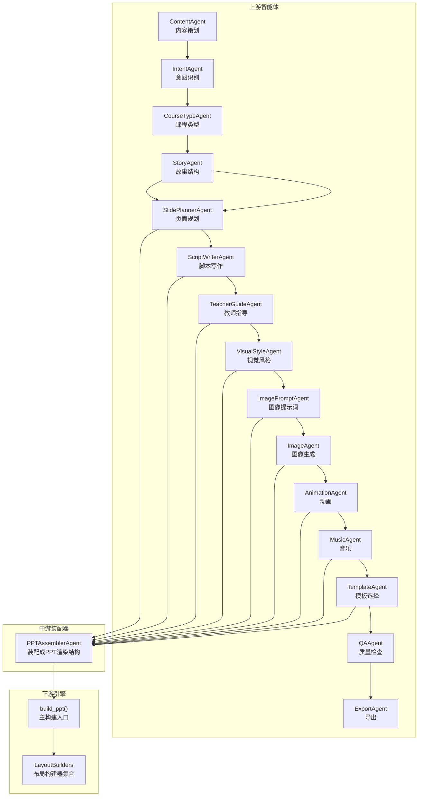

图表来源
- [backend/agents/orchestrator.py:19-55](file://backend/agents/orchestrator.py#L19-L55)
- [backend/agents/assembler.py:16-88](file://backend/agents/assembler.py#L16-L88)
- [ppt-engine/engine.py:15-22](file://ppt-engine/engine.py#L15-L22)

章节来源
- [backend/agents/orchestrator.py:1-56](file://backend/agents/orchestrator.py#L1-L56)
- [backend/agents/assembler.py:1-89](file://backend/agents/assembler.py#L1-L89)
- [ppt-engine/engine.py:1-166](file://ppt-engine/engine.py#L1-L166)

## 核心组件
- 布局构建器集合：以键值映射的方式注册不同布局类型的构建函数，运行时按布局名动态选择。
- 文本框工具：统一的文本框添加接口，支持字体、字号、颜色、对齐与自动换行。
- 背景与配色：通过样式主题中的色彩方案为背景着色或强调色。
- 动画与转场：在构建完成后附加转场元素，增强演示流畅度。

章节来源
- [ppt-engine/engine.py:15-22](file://ppt-engine/engine.py#L15-L22)
- [ppt-engine/engine.py:30-44](file://ppt-engine/engine.py#L30-L44)
- [ppt-engine/engine.py:124-147](file://ppt-engine/engine.py#L124-L147)
- [ppt-engine/engine.py:150-158](file://ppt-engine/engine.py#L150-L158)

## 架构总览
从请求到PPT生成的关键路径如下：

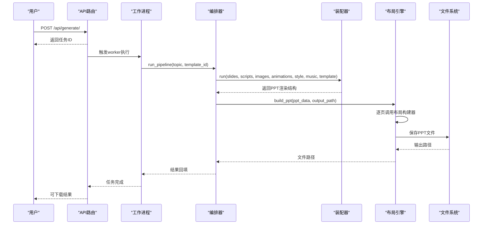

图表来源
- [backend/api/generate.py:20-35](file://backend/api/generate.py#L20-L35)
- [backend/workers/ppt_worker.py:5-24](file://backend/workers/ppt_worker.py#L5-L24)
- [backend/agents/orchestrator.py:19-55](file://backend/agents/orchestrator.py#L19-L55)
- [backend/agents/assembler.py:16-88](file://backend/agents/assembler.py#L16-L88)
- [ppt-engine/engine.py:124-147](file://ppt-engine/engine.py#L124-L147)

## 详细组件分析

### 组件一：布局构建器集合与主构建入口
- 布局构建器集合：以布局名为键，绑定对应的构建函数；默认回退到“文本内容页”布局。
- 主构建入口：遍历每一页数据，选择对应构建器，注入样式，附加转场，保存PPT。

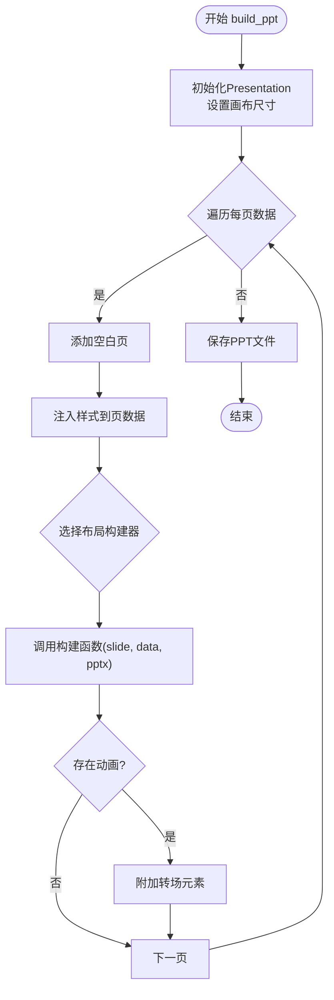

图表来源
- [ppt-engine/engine.py:124-147](file://ppt-engine/engine.py#L124-L147)
- [ppt-engine/engine.py:150-158](file://ppt-engine/engine.py#L150-L158)

章节来源
- [ppt-engine/engine.py:15-22](file://ppt-engine/engine.py#L15-L22)
- [ppt-engine/engine.py:124-147](file://ppt-engine/engine.py#L124-L147)

### 组件二：封面页布局（cover）
- 背景填充为主色方案的主色调
- 居中标题与居中副标题（叙事语），使用高对比度白色与浅灰字色

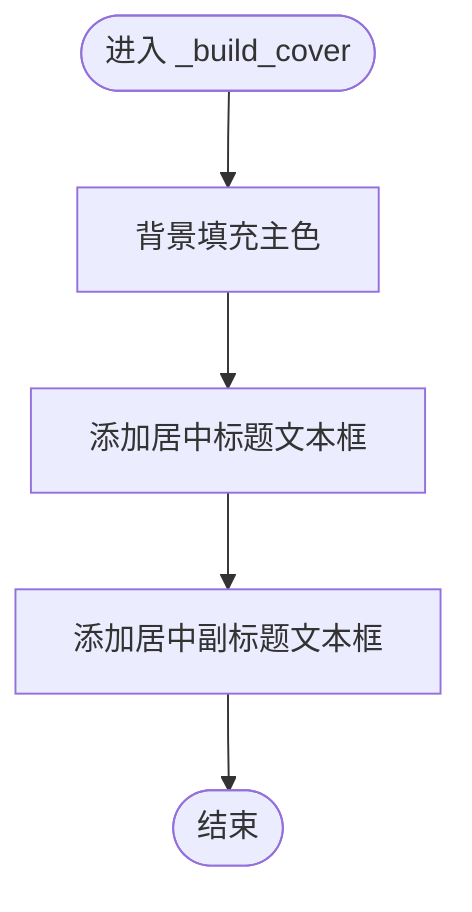

图表来源
- [ppt-engine/engine.py:46-59](file://ppt-engine/engine.py#L46-L59)

章节来源
- [ppt-engine/engine.py:46-59](file://ppt-engine/engine.py#L46-L59)

### 组件三：章节页布局（section）
- 背景填充为强调色
- 居中显示章节标题

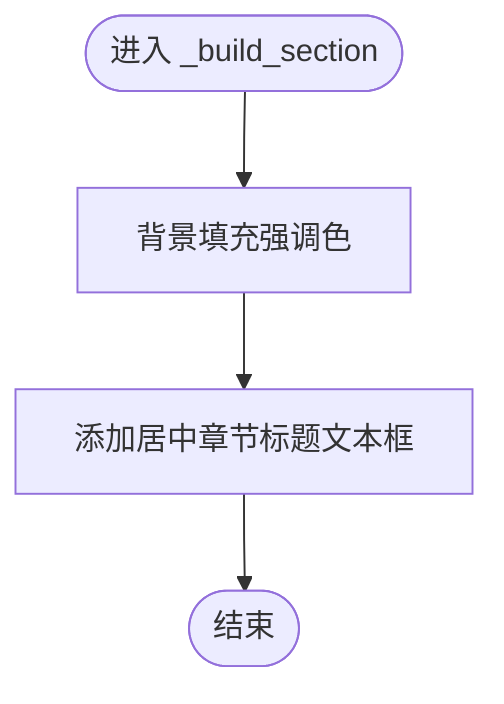

图表来源
- [ppt-engine/engine.py:61-70](file://ppt-engine/engine.py#L61-L70)

章节来源
- [ppt-engine/engine.py:61-70](file://ppt-engine/engine.py#L61-L70)

### 组件四：文本内容页布局（content_text）
- 顶部显示标题
- 内容区域以项目符号列表形式展示要点

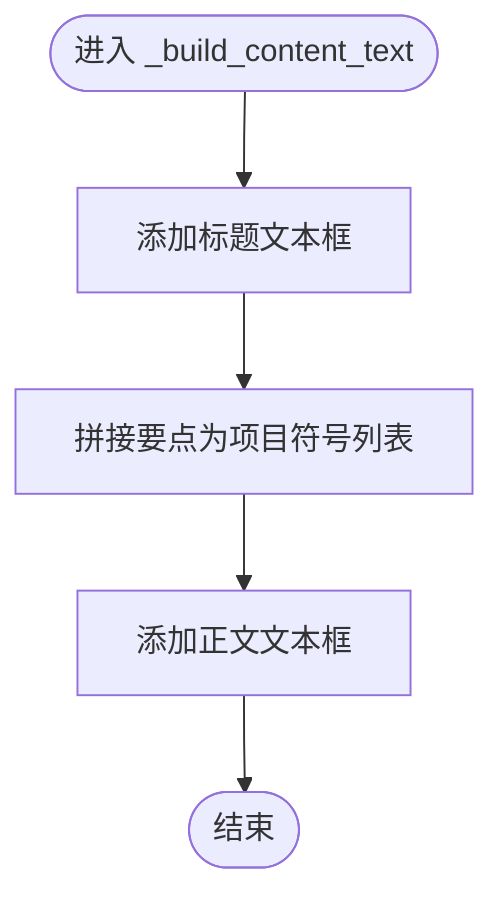

图表来源
- [ppt-engine/engine.py:72-79](file://ppt-engine/engine.py#L72-L79)

章节来源
- [ppt-engine/engine.py:72-79](file://ppt-engine/engine.py#L72-L79)

### 组件五：图片内容页布局（content_image）
- 左侧区域显示标题与前若干要点
- 右侧区域插入图片（若存在）

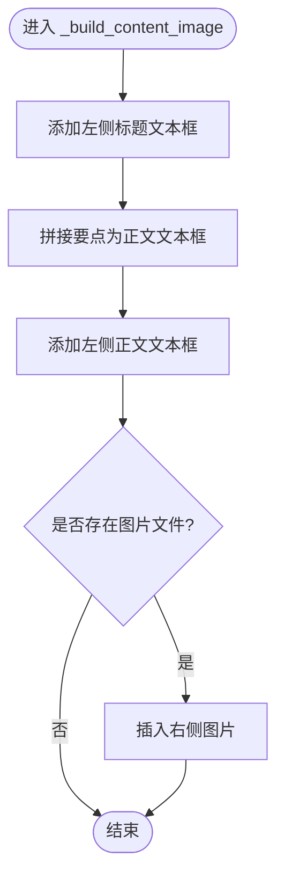

图表来源
- [ppt-engine/engine.py:81-91](file://ppt-engine/engine.py#L81-L91)

章节来源
- [ppt-engine/engine.py:81-91](file://ppt-engine/engine.py#L81-L91)

### 组件六：分割内容页布局（content_split）
- 标题居中
- 将要点分为左右两列，分别渲染

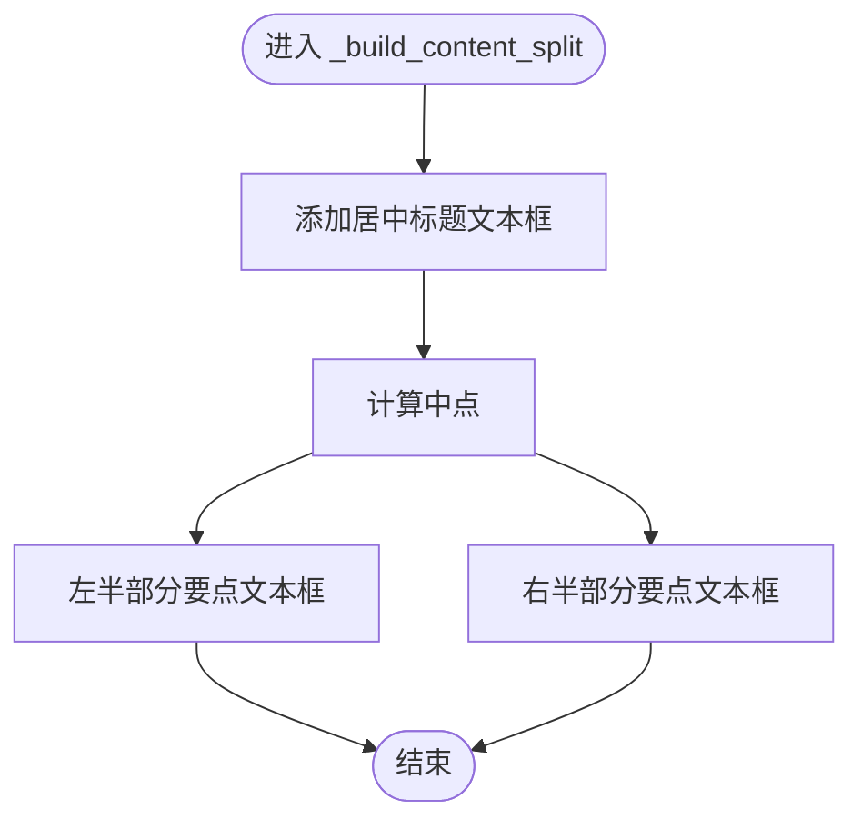

图表来源
- [ppt-engine/engine.py:93-110](file://ppt-engine/engine.py#L93-L110)

章节来源
- [ppt-engine/engine.py:93-110](file://ppt-engine/engine.py#L93-L110)

### 组件七：总结页布局（summary）
- 浅色背景
- 居中显示“总结”标题与要点摘要

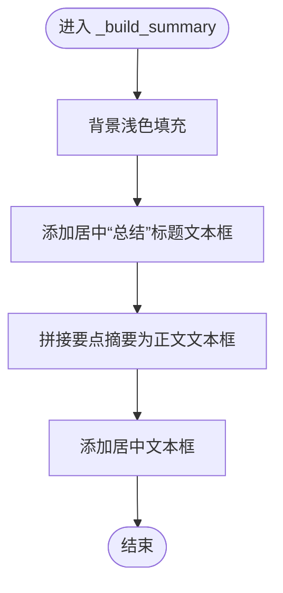

图表来源
- [ppt-engine/engine.py:112-122](file://ppt-engine/engine.py#L112-L122)

章节来源
- [ppt-engine/engine.py:112-122](file://ppt-engine/engine.py#L112-L122)

### 组件八：装配器（PPTAssemblerAgent）
- 将来自多个智能体的数据（故事、脚本、图像、动画、样式、音乐、模板）整合为统一的PPT渲染结构
- 通过布局映射将高层布局名转换为内部索引，并匹配当前页的图像与动画

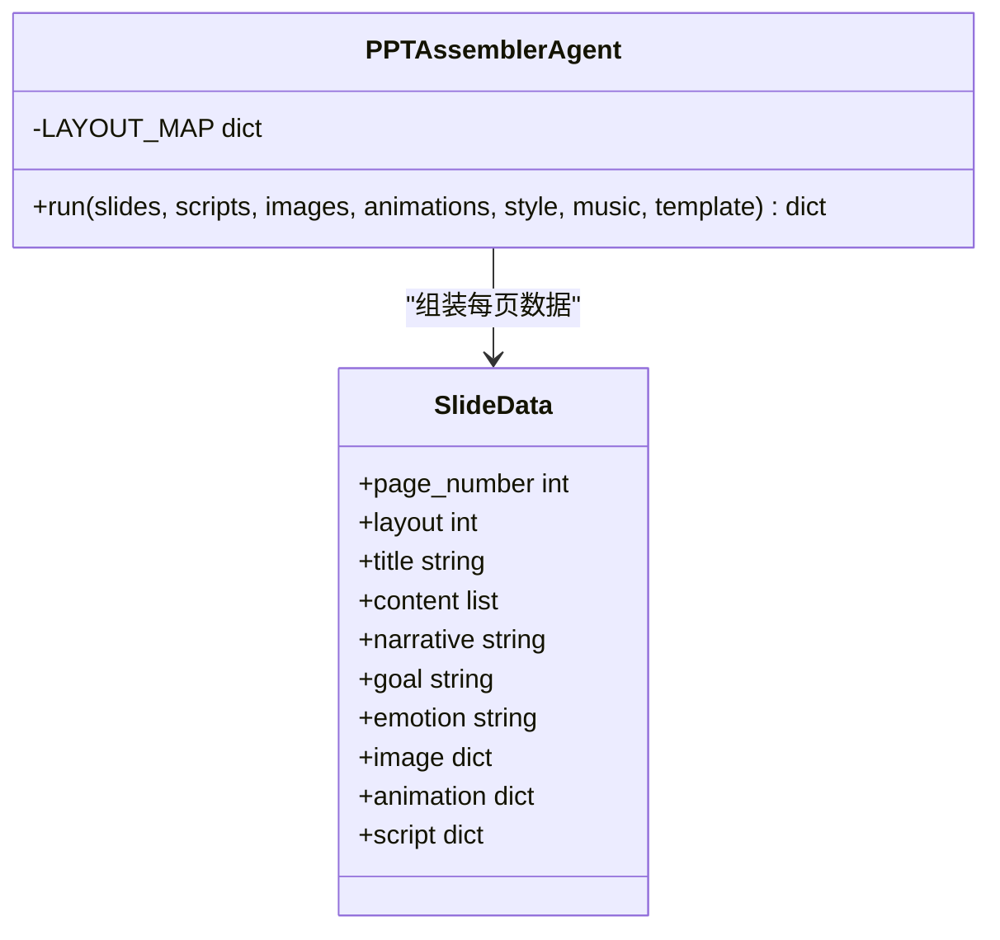

图表来源
- [backend/agents/assembler.py:4-88](file://backend/agents/assembler.py#L4-L88)

章节来源
- [backend/agents/assembler.py:7-51](file://backend/agents/assembler.py#L7-L51)
- [backend/agents/assembler.py:53-76](file://backend/agents/assembler.py#L53-L76)
- [backend/agents/assembler.py:78-88](file://backend/agents/assembler.py#L78-L88)

### 组件九：页面规划与布局类型
- 页面规划阶段产出每页的布局类型与内容要点
- 支持布局类型包括：封面、章节、文本内容、图片内容、分割内容、总结等

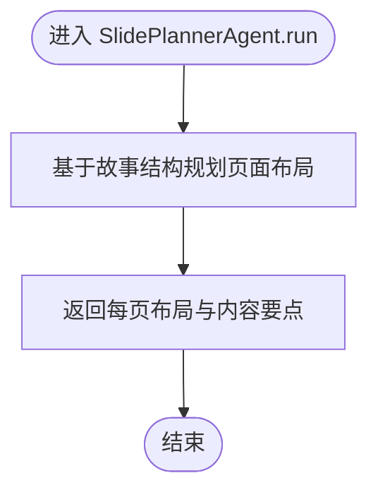

图表来源
- [backend/agents/slide_planner.py:9-31](file://backend/agents/slide_planner.py#L9-L31)

章节来源
- [backend/agents/slide_planner.py:5-31](file://backend/agents/slide_planner.py#L5-L31)

### 组件十：基础智能体与JSON输出
- 提供统一的对话接口与JSON解析能力，便于上游智能体稳定输出结构化数据

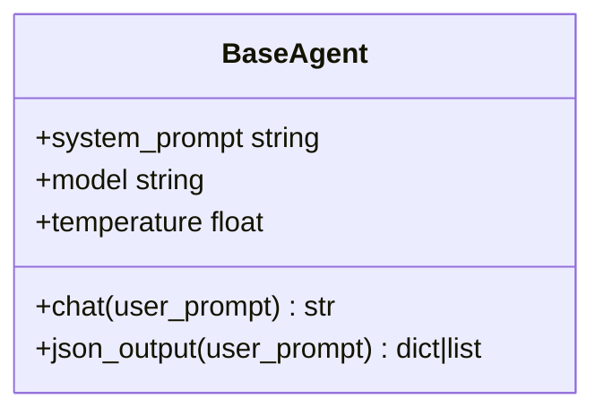

图表来源
- [backend/agents/base.py:5-24](file://backend/agents/base.py#L5-L24)

章节来源
- [backend/agents/base.py:10-23](file://backend/agents/base.py#L10-L23)

### 组件十一：模板选择与主题风格
- 模板选择：根据主题、课程类型与目的关键字匹配模板路径
- 视觉风格：提供色彩方案等样式参数，驱动布局构建器的颜色与背景

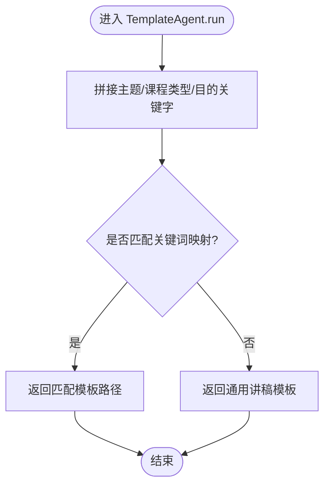

图表来源
- [backend/agents/template.py:8-32](file://backend/agents/template.py#L8-L32)

章节来源
- [backend/agents/template.py:15-30](file://backend/agents/template.py#L15-L30)
- [backend/agents/content.py:7-20](file://backend/agents/content.py#L7-L20)

## 依赖关系分析
- 编排器负责串联所有智能体与装配器，形成端到端流水线
- 装配器将多源数据聚合为布局引擎可消费的结构
- 布局引擎通过映射表选择具体构建器，完成PPT绘制

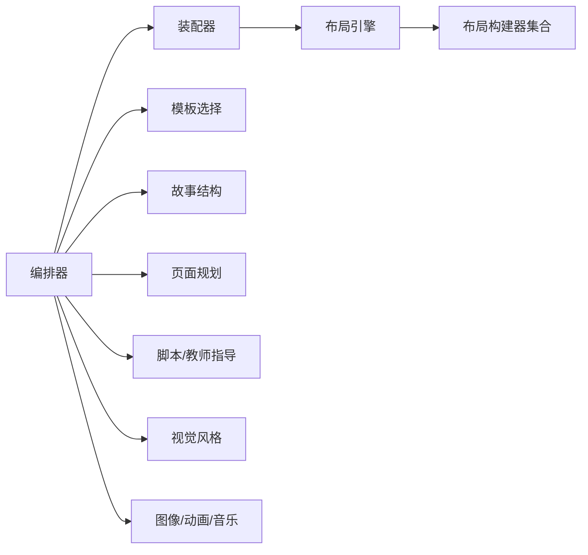

图表来源
- [backend/agents/orchestrator.py:1-17](file://backend/agents/orchestrator.py#L1-L17)
- [backend/agents/assembler.py:1-25](file://backend/agents/assembler.py#L1-L25)
- [ppt-engine/engine.py:15-22](file://ppt-engine/engine.py#L15-L22)

章节来源
- [backend/agents/orchestrator.py:19-55](file://backend/agents/orchestrator.py#L19-L55)
- [backend/agents/assembler.py:16-88](file://backend/agents/assembler.py#L16-L88)
- [ppt-engine/engine.py:124-147](file://ppt-engine/engine.py#L124-L147)

## 性能考虑
- 数据预处理与匹配：在装配器中按页号过滤图像与动画，避免全量扫描
- 布局选择：通过映射表快速定位构建器，减少分支判断开销
- 文本渲染：统一文本框工具，减少重复初始化成本
- 转场附加：仅在需要时附加转场元素，降低异常处理开销
- I/O优化：模板与图像路径校验提前完成，避免无效磁盘访问

## 故障排查指南
- JSON输出异常：确保智能体调用JSON输出接口并正确清洗模型回复
- 图像缺失：确认图像路径存在且可读，否则跳过插入
- 转场失败：转场附加为可选功能，异常时忽略并继续
- 任务状态：工作进程捕获异常并记录错误，便于前端查询

章节来源
- [backend/agents/base.py:20-23](file://backend/agents/base.py#L20-L23)
- [ppt-engine/engine.py:88-90](file://ppt-engine/engine.py#L88-L90)
- [ppt-engine/engine.py:150-158](file://ppt-engine/engine.py#L150-L158)
- [backend/workers/ppt_worker.py:20-23](file://backend/workers/ppt_worker.py#L20-L23)

## 结论
布局构建器系统通过“智能体流水线 + 布局引擎”的架构实现了从内容到PPT的自动化生成。其设计具备良好的扩展性与可维护性：新增布局只需在映射表中注册构建函数；通过样式与模板参数即可实现主题化定制；通过任务队列与API接口实现异步生成与状态查询。

## 附录

### 布局类型与构建器映射
- 封面页：cover → _build_cover
- 章节页：section → _build_section
- 文本内容页：content_text → _build_content_text
- 图片内容页：content_image → _build_content_image
- 分割内容页：content_split → _build_content_split
- 总结页：summary → _build_summary

章节来源
- [ppt-engine/engine.py:15-22](file://ppt-engine/engine.py#L15-L22)

### 参数传递与返回值规范
- 输入参数（装配器）：slides, scripts, images, animations, style, music, template
- 输出结构：包含样式、音乐、幻灯片列表与PPTX模式（模板、主题、幻灯片）
- 单页数据字段：页码、布局索引、标题、内容、叙事语、目标、情绪、图像（主图/背景）、动画（类型/时长/目标）、脚本

章节来源
- [backend/agents/assembler.py:16-88](file://backend/agents/assembler.py#L16-L88)

### 自定义布局开发步骤
- 在布局构建器集合中注册新布局名与构建函数
- 实现构建函数：接收slide、data、pptx，按需添加文本框、图片与背景
- 在装配器中将高层布局名映射到内部索引，或直接使用布局名
- 在页面规划阶段为目标页面指定新布局类型

章节来源
- [ppt-engine/engine.py:15-22](file://ppt-engine/engine.py#L15-L22)
- [backend/agents/slide_planner.py:6-7](file://backend/agents/slide_planner.py#L6-L7)
- [backend/agents/assembler.py:48-51](file://backend/agents/assembler.py#L48-L51)

### 布局组合技巧
- 使用分割布局将长列表拆分为左右两栏，提升可读性
- 在图片布局中配合背景图与前景图，增强层次感
- 利用强调色与主色区分章节与正文，保持视觉一致性
- 通过转场与动画增强演示节奏，但避免过度使用

### 与模板系统的集成
- 模板选择：根据主题与课程类型选择模板文件路径
- 主题注入：将样式参数注入到每页数据，驱动背景与文字颜色
- 导出：装配器输出包含模板路径的PPTX模式，交由导出环节生成文件

章节来源
- [backend/agents/template.py:8-32](file://backend/agents/template.py#L8-L32)
- [backend/agents/assembler.py:83-87](file://backend/agents/assembler.py#L83-L87)
- [backend/agents/orchestrator.py:24-25](file://backend/agents/orchestrator.py#L24-L25)

### 数据流与错误处理机制
- 数据流：内容 → 故事 → 页面规划 → 脚本/图像/动画/音乐 → 装配 → 布局构建 → 导出
- 错误处理：工作进程捕获异常并记录；转场附加失败时静默忽略；图像不存在时跳过插入

章节来源
- [backend/agents/orchestrator.py:19-55](file://backend/agents/orchestrator.py#L19-L55)
- [backend/workers/ppt_worker.py:20-23](file://backend/workers/ppt_worker.py#L20-L23)
- [ppt-engine/engine.py:150-158](file://ppt-engine/engine.py#L150-L158)