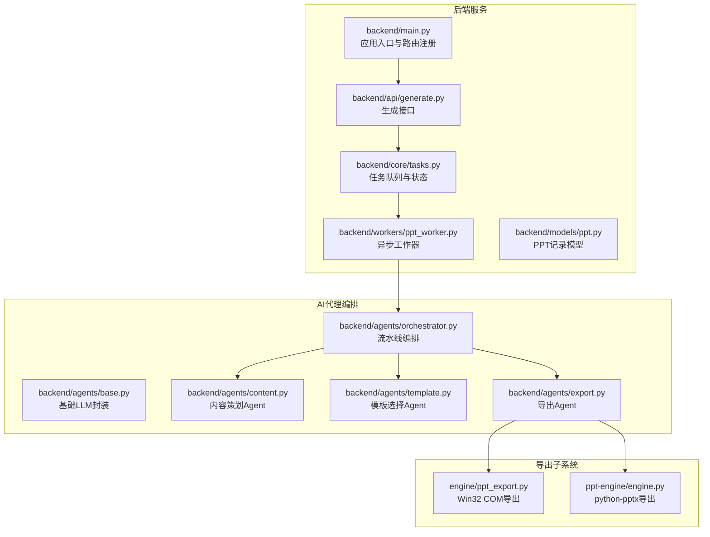
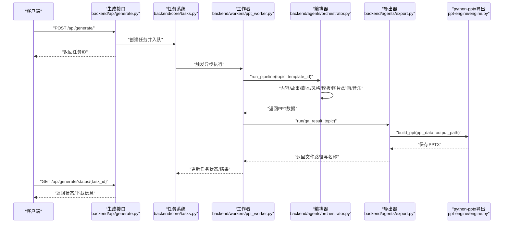
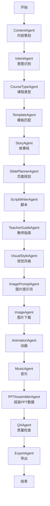
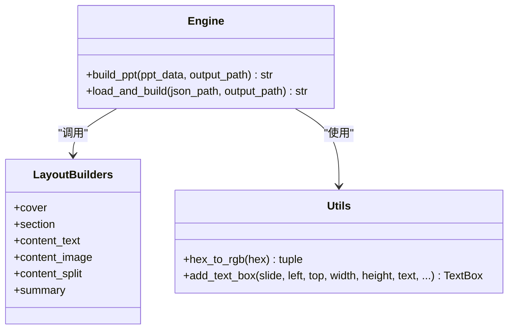
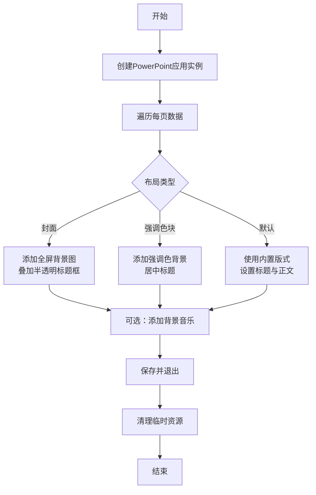
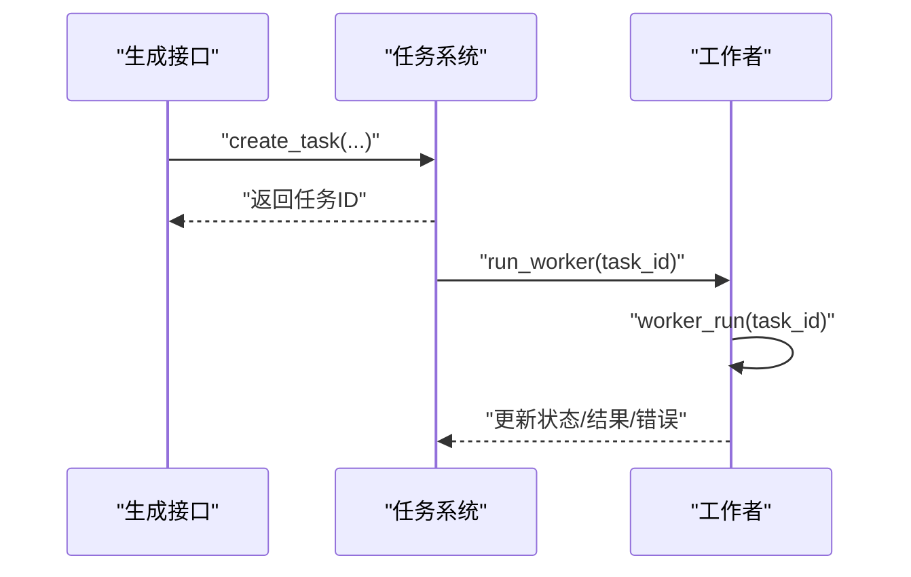
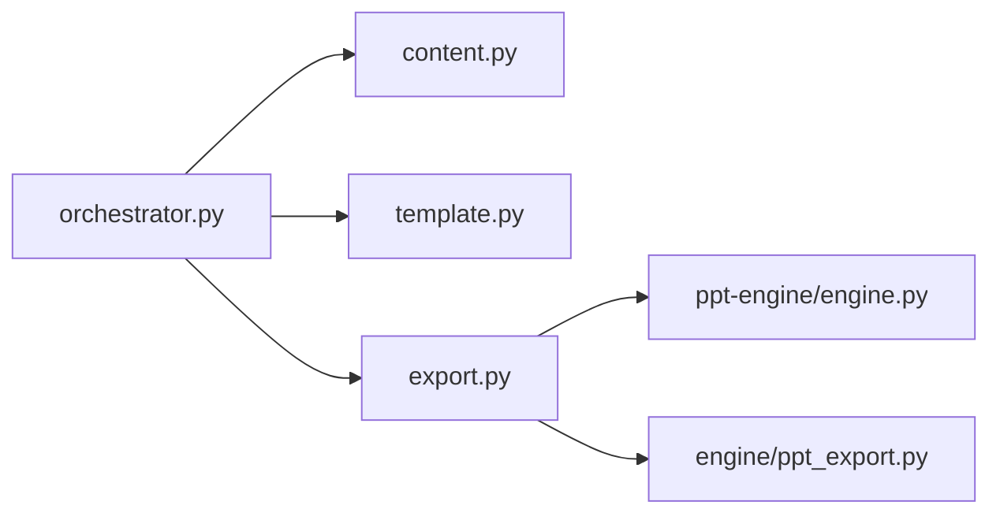

# 引擎架构设计

<cite>
**本文引用的文件**
- [backend/main.py](file://backend/main.py)
- [backend/core/config.py](file://backend/core/config.py)
- [backend/core/tasks.py](file://backend/core/tasks.py)
- [backend/api/generate.py](file://backend/api/generate.py)
- [backend/models/ppt.py](file://backend/models/ppt.py)
- [backend/agents/orchestrator.py](file://backend/agents/orchestrator.py)
- [backend/agents/base.py](file://backend/agents/base.py)
- [backend/agents/content.py](file://backend/agents/content.py)
- [backend/agents/slide.py](file://backend/agents/slide.py)
- [backend/agents/template.py](file://backend/agents/template.py)
- [backend/agents/export.py](file://backend/agents/export.py)
- [backend/workers/ppt_worker.py](file://backend/workers/ppt_worker.py)
- [engine/ppt_export.py](file://engine/ppt_export.py)
- [ppt-engine/engine.py](file://ppt-engine/engine.py)
</cite>

## 目录
1. [引言](#引言)
2. [项目结构](#项目结构)
3. [核心组件](#核心组件)
4. [架构总览](#架构总览)
5. [详细组件分析](#详细组件分析)
6. [依赖分析](#依赖分析)
7. [性能考虑](#性能考虑)
8. [故障排查指南](#故障排查指南)
9. [结论](#结论)
10. [附录](#附录)

## 引言
本技术文档面向“AI-PPT开源V3”项目的PPT引擎架构设计，系统性阐述后端服务、AI代理编排、模板与导出子系统之间的协作关系与数据流。文档重点覆盖以下方面：
- 引擎整体架构与核心设计理念
- Python-pptx 集成方式、幻灯片对象模型与布局管理机制
- 初始化流程、配置参数与扩展点设计
- 引擎与AI代理系统的数据交互模式、接口规范与错误处理机制
- 架构图表与时序图
- 性能特点、内存管理与并发处理能力
- 实际代码示例路径与最佳实践建议

## 项目结构
该项目采用前后端分离与多子系统协同的分层架构：
- 后端服务：基于FastAPI，提供生成任务调度、状态查询、下载等REST接口
- AI代理编排：以“流水线”形式串联内容策划、故事线构建、脚本写作、视觉风格、图片与动画、音乐、模板选择、质量检查与最终导出
- 导出子系统：包含两种导出路径（Win32 COM调用与python-pptx），分别用于Windows本地与跨平台通用导出
- 模板与样式：通过模板匹配与布局构建器实现可扩展的幻灯片布局与样式管理

**图表来源**
- [backend/main.py:16-40](file://backend/main.py#L16-L40)
- [backend/api/generate.py:20-52](file://backend/api/generate.py#L20-L52)
- [backend/core/tasks.py:14-33](file://backend/core/tasks.py#L14-L33)
- [backend/workers/ppt_worker.py:5-24](file://backend/workers/ppt_worker.py#L5-L24)
- [backend/agents/orchestrator.py:19-56](file://backend/agents/orchestrator.py#L19-L56)
- [backend/agents/export.py:10-65](file://backend/agents/export.py#L10-L65)
- [engine/ppt_export.py:92-257](file://engine/ppt_export.py#L92-L257)
- [ppt-engine/engine.py:124-166](file://ppt-engine/engine.py#L124-L166)

**章节来源**
- [backend/main.py:16-40](file://backend/main.py#L16-L40)
- [backend/api/generate.py:20-52](file://backend/api/generate.py#L20-L52)
- [backend/core/tasks.py:14-33](file://backend/core/tasks.py#L14-L33)
- [backend/workers/ppt_worker.py:5-24](file://backend/workers/ppt_worker.py#L5-L24)
- [backend/agents/orchestrator.py:19-56](file://backend/agents/orchestrator.py#L19-L56)
- [backend/agents/export.py:10-65](file://backend/agents/export.py#L10-L65)
- [engine/ppt_export.py:92-257](file://engine/ppt_export.py#L92-L257)
- [ppt-engine/engine.py:124-166](file://ppt-engine/engine.py#L124-L166)

## 核心组件
- 应用入口与路由
  - FastAPI应用在生命周期中完成数据库初始化，并注册用户、账单、模板、生成、下载等路由
  - 提供健康检查端点
- 任务系统
  - 基于内存字典的任务存储，支持创建任务、入队执行、查询状态
  - 工作者异步运行流水线，更新任务状态与结果
- 生成接口
  - 校验使用配额与请求合法性，创建任务并返回任务ID
  - 支持轮询任务状态，返回下载链接与进度
- AI代理编排
  - 以函数式流水线组织多个Agent，依次产出内容、故事线、脚本、教师指南、视觉风格、图片提示词、图片、动画、音乐、模板与最终PPT数据
- 导出子系统
  - python-pptx导出：读取或加载模板，按布局构建器渲染每页，保存为PPTX
  - Win32 COM导出：通过PowerPoint进程自动化生成PPTX，支持图片与音频资源下载

**章节来源**
- [backend/main.py:10-40](file://backend/main.py#L10-L40)
- [backend/api/generate.py:20-52](file://backend/api/generate.py#L20-L52)
- [backend/core/tasks.py:14-33](file://backend/core/tasks.py#L14-L33)
- [backend/workers/ppt_worker.py:5-24](file://backend/workers/ppt_worker.py#L5-L24)
- [backend/agents/orchestrator.py:19-56](file://backend/agents/orchestrator.py#L19-L56)
- [backend/agents/export.py:10-65](file://backend/agents/export.py#L10-L65)
- [ppt-engine/engine.py:124-166](file://ppt-engine/engine.py#L124-L166)
- [engine/ppt_export.py:92-257](file://engine/ppt_export.py#L92-L257)

## 架构总览
下图展示从HTTP请求到PPT生成与导出的全链路时序：

**图表来源**
- [backend/api/generate.py:20-52](file://backend/api/generate.py#L20-L52)
- [backend/core/tasks.py:14-33](file://backend/core/tasks.py#L14-L33)
- [backend/workers/ppt_worker.py:5-24](file://backend/workers/ppt_worker.py#L5-L24)
- [backend/agents/orchestrator.py:19-56](file://backend/agents/orchestrator.py#L19-L56)
- [backend/agents/export.py:10-65](file://backend/agents/export.py#L10-L65)
- [ppt-engine/engine.py:124-166](file://ppt-engine/engine.py#L124-L166)

## 详细组件分析

### 组件A：AI代理编排与流水线
- 职责
  - 将主题输入转化为完整的PPT数据结构，贯穿内容策划、故事线、脚本、教师指南、视觉风格、图片提示词、图片、动画、音乐与模板选择
  - 最终交由导出器进行PPTX生成
- 关键流程
  - 内容Agent解析主题，输出结构化内容元数据
  - 故事线Agent产出章节与段落结构
  - 脚本写作为每页提供讲稿文本
  - 视觉风格Agent确定配色与字体方案
  - 图片提示词Agent为每页生成关键词
  - 图片Agent批量下载图片资源
  - 动画Agent为每页分配入场动画
  - 音乐Agent生成背景音乐
  - 模板Agent根据主题关键字匹配模板
  - 质量检查Agent校验PPT数据完整性
  - 导出Agent将数据渲染为PPTX
- 扩展点
  - 新增Agent只需遵循统一的run接口，插入到编排器流水线中
  - 模板映射规则可按领域扩展

**图表来源**
- [backend/agents/orchestrator.py:19-56](file://backend/agents/orchestrator.py#L19-L56)
- [backend/agents/content.py:7-21](file://backend/agents/content.py#L7-L21)
- [backend/agents/template.py:7-33](file://backend/agents/template.py#L7-L33)
- [backend/agents/export.py:10-65](file://backend/agents/export.py#L10-L65)

**章节来源**
- [backend/agents/orchestrator.py:19-56](file://backend/agents/orchestrator.py#L19-L56)
- [backend/agents/content.py:7-21](file://backend/agents/content.py#L7-L21)
- [backend/agents/template.py:7-33](file://backend/agents/template.py#L7-L33)
- [backend/agents/export.py:10-65](file://backend/agents/export.py#L10-L65)

### 组件B：导出子系统（python-pptx）
- 设计理念
  - 以“布局构建器”为核心，将不同类型的幻灯片（封面、章节、正文、图文、左右分割、总结）抽象为可插拔的渲染函数
  - 使用Presentation对象管理幻灯片集合，按布局索引添加页面
- 数据模型与对象模型
  - 每页数据包含标题、内容列表、布局类型、样式、动画等字段
  - 布局构建器接收slide、data、prs三元组，直接操作shapes与文本框
- 样式与颜色
  - 通过RGBColor与十六进制颜色值统一管理主题色
  - 文本框支持字体、字号、加粗、对齐与自动换行
- 动画与过渡
  - 通过PPTX内部命名空间扩展添加过渡元素，设置持续时间
- 输出
  - 保存为PPTX文件，支持从JSON加载或直接传入数据

**图表来源**
- [ppt-engine/engine.py:124-166](file://ppt-engine/engine.py#L124-L166)
- [ppt-engine/engine.py:15-22](file://ppt-engine/engine.py#L15-L22)
- [ppt-engine/engine.py:25-44](file://ppt-engine/engine.py#L25-L44)

**章节来源**
- [ppt-engine/engine.py:124-166](file://ppt-engine/engine.py#L124-L166)
- [ppt-engine/engine.py:15-22](file://ppt-engine/engine.py#L15-L22)
- [ppt-engine/engine.py:25-44](file://ppt-engine/engine.py#L25-L44)

### 组件C：导出子系统（Win32 COM）
- 设计理念
  - 在Windows环境下通过PowerPoint自动化生成PPTX，便于复用现有模板与高级效果
- 资源管理
  - 下载图片与音频至临时目录，渲染完成后清理
- 线程与事件循环
  - 在独立线程中启动事件循环，避免阻塞主线程
- 输出
  - 保存为PPTX并返回文件路径与名称

**图表来源**
- [engine/ppt_export.py:92-257](file://engine/ppt_export.py#L92-L257)

**章节来源**
- [engine/ppt_export.py:92-257](file://engine/ppt_export.py#L92-L257)

### 组件D：任务系统与工作者
- 设计理念
  - 以内存字典模拟任务队列，支持异步工作者拉取任务并执行
- 生命周期
  - 创建任务：分配UUID，初始状态为“queued”
  - 入队执行：创建异步任务，标记为“running”
  - 完成/失败：更新状态、结果或错误信息
- 错误处理
  - 捕获异常并记录堆栈，保证任务状态一致性

**图表来源**
- [backend/core/tasks.py:14-33](file://backend/core/tasks.py#L14-L33)
- [backend/workers/ppt_worker.py:5-24](file://backend/workers/ppt_worker.py#L5-L24)

**章节来源**
- [backend/core/tasks.py:14-33](file://backend/core/tasks.py#L14-L33)
- [backend/workers/ppt_worker.py:5-24](file://backend/workers/ppt_worker.py#L5-L24)

### 组件E：配置与模型
- 配置项
  - 应用名、调试开关、第三方API密钥、数据库与Redis连接、JWT参数、计费相关阈值、输出与上传目录、代理地址
- 数据模型
  - PPT记录表包含用户ID、主题、页数、文件路径、文件名、状态、原始JSON等字段

**章节来源**
- [backend/core/config.py:4-34](file://backend/core/config.py#L4-L34)
- [backend/models/ppt.py:6-18](file://backend/models/ppt.py#L6-L18)

## 依赖分析
- 组件耦合
  - 编排器与各Agent松耦合，通过统一的run接口与JSON数据交换
  - 导出器与具体导出实现解耦，可通过配置切换
- 外部依赖
  - python-pptx：核心PPTX生成库
  - win32com（仅Win32导出）：PowerPoint自动化
  - 第三方图像与音频资源：图片下载器与在线音源
- 潜在环路
  - 无直接循环导入；编排器通过模块导入聚合，避免环状依赖

**图表来源**
- [backend/agents/orchestrator.py:19-56](file://backend/agents/orchestrator.py#L19-L56)
- [backend/agents/content.py:7-21](file://backend/agents/content.py#L7-L21)
- [backend/agents/template.py:7-33](file://backend/agents/template.py#L7-L33)
- [backend/agents/export.py:10-65](file://backend/agents/export.py#L10-L65)
- [ppt-engine/engine.py:124-166](file://ppt-engine/engine.py#L124-L166)
- [engine/ppt_export.py:92-257](file://engine/ppt_export.py#L92-L257)

**章节来源**
- [backend/agents/orchestrator.py:19-56](file://backend/agents/orchestrator.py#L19-L56)
- [backend/agents/export.py:10-65](file://backend/agents/export.py#L10-L65)
- [ppt-engine/engine.py:124-166](file://ppt-engine/engine.py#L124-L166)
- [engine/ppt_export.py:92-257](file://engine/ppt_export.py#L92-L257)

## 性能考虑
- 并发与异步
  - 任务系统基于asyncio创建任务，避免阻塞主线程
  - 导出器在Win32路径中使用独立线程与事件循环，防止COM阻塞
- I/O与资源
  - 图片与音频下载采用临时目录，完成后清理，降低磁盘污染
  - 模板加载失败回退到空演示，减少异常开销
- 内存管理
  - 每页渲染后不保留多余引用，及时释放中间对象
  - 任务完成后清理临时文件，避免内存泄漏
- 可扩展性
  - 布局构建器与Agent均为可插拔扩展点，便于按需增加新功能

## 故障排查指南
- 常见问题
  - 生成接口返回429：当日配额不足，需升级套餐
  - 任务状态长期为“queued”：工作者未启动或任务未入队
  - 导出失败：模板文件损坏或路径错误，导出器会回退到空演示
  - Win32导出异常：PowerPoint未安装或权限不足
- 排查步骤
  - 查看任务状态与错误字段
  - 检查输出目录权限与磁盘空间
  - 校验模板文件是否存在且可读
  - 在开发者模式下启用日志与断点
- 相关实现参考
  - 任务状态更新与异常捕获
  - 导出器模板加载与回退逻辑
  - Win32导出的资源清理与异常处理

**章节来源**
- [backend/api/generate.py:26-33](file://backend/api/generate.py#L26-L33)
- [backend/workers/ppt_worker.py:10-24](file://backend/workers/ppt_worker.py#L10-L24)
- [backend/agents/export.py:24-31](file://backend/agents/export.py#L24-L31)
- [engine/ppt_export.py:229-237](file://engine/ppt_export.py#L229-L237)

## 结论
该PPT引擎采用“流水线式AI代理编排 + 可插拔导出子系统”的架构设计，既保证了生成流程的可控与可扩展，又兼顾了跨平台与Windows环境下的高级特性。通过布局构建器与模板匹配机制，实现了内容与样式的解耦；通过任务系统与异步工作者，提供了良好的并发与可靠性保障。未来可在Agent生态、模板市场与资源缓存等方面进一步增强。

## 附录
- 初始化流程
  - 应用启动时完成数据库初始化与路由注册
  - 生成接口校验配额与请求合法性，创建任务并返回任务ID
  - 工作者拉取任务并执行流水线，导出器渲染PPTX
- 配置参数
  - 关键参数包括数据库URL、Redis连接、JWT密钥、输出目录、代理地址等
- 最佳实践
  - 将Agent与布局构建器保持纯函数式，便于测试与扩展
  - 对外部资源访问增加超时与重试策略
  - 在生产环境关闭调试模式并妥善管理密钥