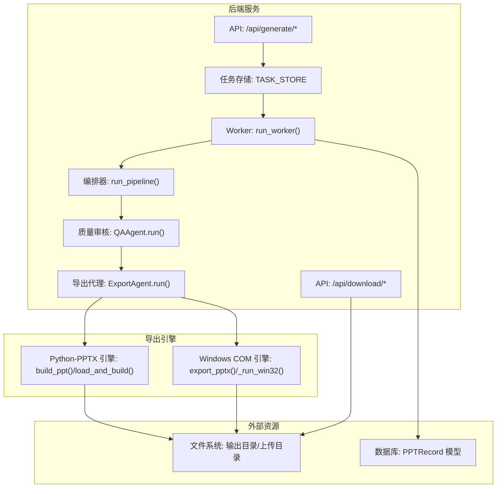
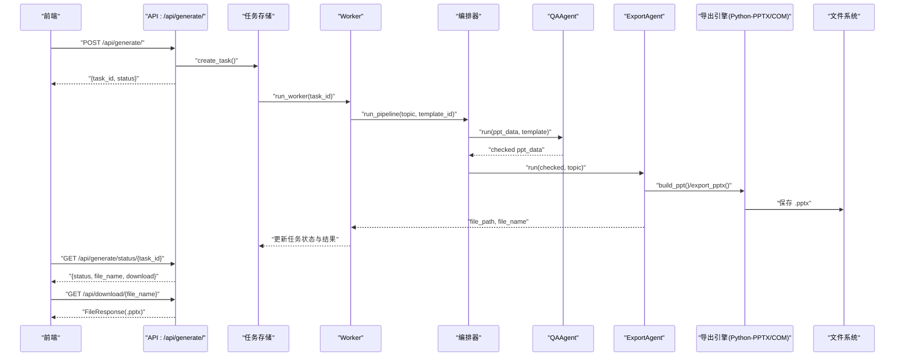
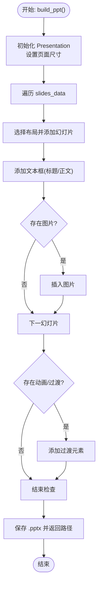
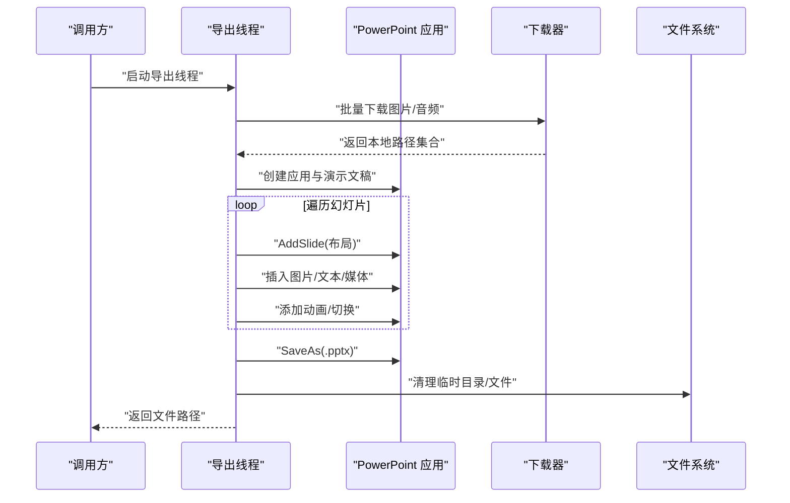
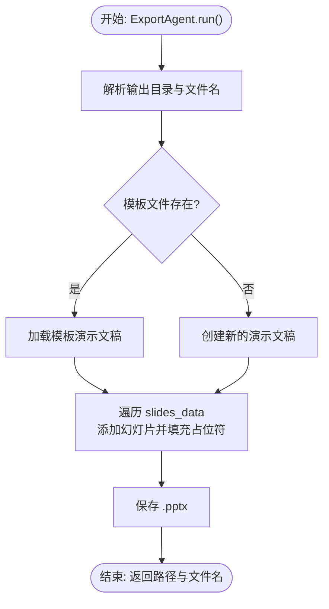
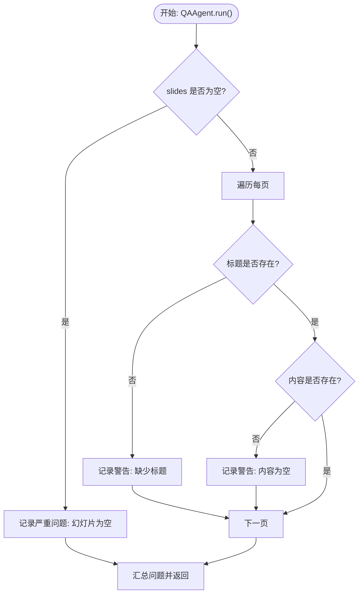
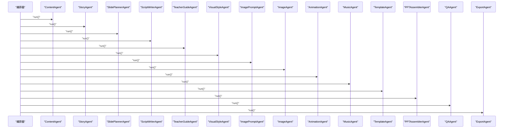
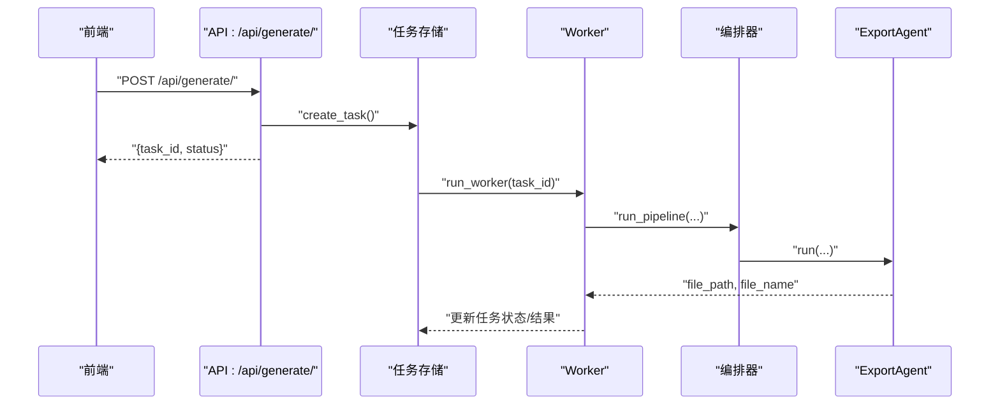
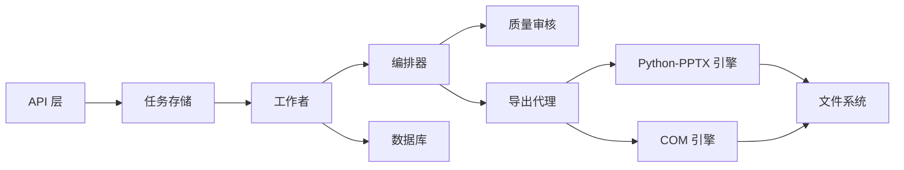

# 文件导出

<cite>
**本文引用的文件**
- [engine/ppt_export.py](file://engine/ppt_export.py)
- [ppt-engine/engine.py](file://ppt-engine/engine.py)
- [backend/agents/export.py](file://backend/agents/export.py)
- [backend/agents/assembler.py](file://backend/agents/assembler.py)
- [backend/agents/orchestrator.py](file://backend/agents/orchestrator.py)
- [backend/agents/qa.py](file://backend/agents/qa.py)
- [backend/workers/ppt_worker.py](file://backend/workers/ppt_worker.py)
- [backend/core/tasks.py](file://backend/core/tasks.py)
- [backend/api/generate.py](file://backend/api/generate.py)
- [backend/api/download.py](file://backend/api/download.py)
- [backend/core/config.py](file://backend/core/config.py)
- [backend/models/ppt.py](file://backend/models/ppt.py)
</cite>

## 目录
1. [引言](#引言)
2. [项目结构](#项目结构)
3. [核心组件](#核心组件)
4. [架构总览](#架构总览)
5. [详细组件分析](#详细组件分析)
6. [依赖分析](#依赖分析)
7. [性能考虑](#性能考虑)
8. [故障排查指南](#故障排查指南)
9. [结论](#结论)
10. [附录](#附录)

## 引言
本技术文档聚焦于文件导出系统，系统支持从结构化数据生成符合 PowerPoint 规范的 .pptx 文件，并提供导出参数配置、文件保存与路径管理、格式转换与元数据处理、兼容性保障、性能优化与内存管理、以及导出结果验证与错误处理机制。文档覆盖两条主要导出路径：基于 Python-PPTX 的纯 Python 导出（推荐用于跨平台与自动化）与基于 Windows PowerPoint COM 的导出（适合需要原生效果但仅限 Windows 环境）。同时给出导出配置指南、自定义流程扩展点与结果验证方法。

## 项目结构
系统由后端服务、导出引擎与前端交互组成，核心导出逻辑分布在以下模块：
- 后端 API：接收生成请求、调度任务、查询状态与提供下载
- 工作流编排：按顺序调用内容生成、模板选择、装配、质量审核与导出
- 导出实现：两种导出方式分别位于 engine/ppt_export.py（COM）与 ppt-engine/engine.py（Python-PPTX）
- 配置与存储：输出目录、上传目录、数据库模型与任务队列

图表来源
- [backend/api/generate.py:20-51](file://backend/api/generate.py#L20-L51)
- [backend/api/download.py:9-14](file://backend/api/download.py#L9-L14)
- [backend/workers/ppt_worker.py:5-24](file://backend/workers/ppt_worker.py#L5-L24)
- [backend/core/tasks.py:14-32](file://backend/core/tasks.py#L14-L32)
- [backend/agents/orchestrator.py:19-55](file://backend/agents/orchestrator.py#L19-L55)
- [backend/agents/qa.py:8-27](file://backend/agents/qa.py#L8-L27)
- [backend/agents/export.py:10-64](file://backend/agents/export.py#L10-L64)
- [ppt-engine/engine.py:124-165](file://ppt-engine/engine.py#L124-L165)
- [engine/ppt_export.py:245-256](file://engine/ppt_export.py#L245-L256)

章节来源
- [backend/api/generate.py:20-51](file://backend/api/generate.py#L20-L51)
- [backend/api/download.py:9-14](file://backend/api/download.py#L9-L14)
- [backend/workers/ppt_worker.py:5-24](file://backend/workers/ppt_worker.py#L5-L24)
- [backend/core/tasks.py:14-32](file://backend/core/tasks.py#L14-L32)
- [backend/agents/orchestrator.py:19-55](file://backend/agents/orchestrator.py#L19-L55)
- [backend/agents/qa.py:8-27](file://backend/agents/qa.py#L8-L27)
- [backend/agents/export.py:10-64](file://backend/agents/export.py#L10-L64)
- [ppt-engine/engine.py:124-165](file://ppt-engine/engine.py#L124-L165)
- [engine/ppt_export.py:245-256](file://engine/ppt_export.py#L245-L256)

## 核心组件
- 任务与工作流
  - 任务创建与运行：通过 create_task 创建任务并异步调度 run_worker，后者执行 run_pipeline 完成全流程
  - 编排器：按顺序调用内容、故事、规划、脚本、教师指南、风格、图像、动画、音乐与模板选择，最终装配为可导出结构
  - 质量审核：校验幻灯片数量、标题与内容完整性，输出问题清单
  - 导出代理：根据模板或默认布局生成 .pptx，支持模板继承与占位符填充
- 导出引擎
  - Python-PPTX 引擎：以布局构建器为核心，按布局类型绘制文本框、背景色与图片，设置过渡效果
  - Windows COM 引擎：使用 PowerPoint 应用程序对象创建演示文稿，下载图片与音频，按布局插入元素并应用动画与切换
- API 层
  - 生成接口：校验用户配额与输入有效性，返回任务 ID
  - 状态查询：返回任务状态、文件名与下载标记
  - 下载接口：提供 .pptx 文件下载
- 配置与持久化
  - 配置项：输出目录、上传目录、数据库连接、代理等
  - 数据模型：PPT 记录表，保存用户、主题、页数、文件路径与名称

章节来源
- [backend/core/tasks.py:14-32](file://backend/core/tasks.py#L14-L32)
- [backend/workers/ppt_worker.py:5-24](file://backend/workers/ppt_worker.py#L5-L24)
- [backend/agents/orchestrator.py:19-55](file://backend/agents/orchestrator.py#L19-L55)
- [backend/agents/qa.py:8-27](file://backend/agents/qa.py#L8-L27)
- [backend/agents/export.py:10-64](file://backend/agents/export.py#L10-L64)
- [ppt-engine/engine.py:124-165](file://ppt-engine/engine.py#L124-L165)
- [engine/ppt_export.py:92-236](file://engine/ppt_export.py#L92-L236)
- [backend/api/generate.py:20-51](file://backend/api/generate.py#L20-L51)
- [backend/api/download.py:9-14](file://backend/api/download.py#L9-L14)
- [backend/core/config.py:25-26](file://backend/core/config.py#L25-L26)
- [backend/models/ppt.py:6-17](file://backend/models/ppt.py#L6-L17)

## 架构总览
下图展示从前端到导出完成的关键交互序列，包括任务创建、工作流执行、导出与下载。

图表来源
- [backend/api/generate.py:20-51](file://backend/api/generate.py#L20-L51)
- [backend/api/download.py:9-14](file://backend/api/download.py#L9-L14)
- [backend/workers/ppt_worker.py:5-24](file://backend/workers/ppt_worker.py#L5-L24)
- [backend/agents/orchestrator.py:19-55](file://backend/agents/orchestrator.py#L19-L55)
- [backend/agents/qa.py:8-27](file://backend/agents/qa.py#L8-L27)
- [backend/agents/export.py:10-64](file://backend/agents/export.py#L10-L64)
- [ppt-engine/engine.py:124-165](file://ppt-engine/engine.py#L124-L165)
- [engine/ppt_export.py:245-256](file://engine/ppt_export.py#L245-L256)

## 详细组件分析

### 组件A：导出引擎（Python-PPTX）
- 功能概述
  - 使用 python-pptx 创建演示文稿，设置页面尺寸，按布局类型构建每页内容
  - 支持文本框、背景色、图片与简单过渡效果
- 关键流程
  - 解析输入数据，遍历幻灯片列表
  - 根据布局映射选择空白布局并添加幻灯片
  - 使用通用文本框构建函数写入标题与正文
  - 可选地为每页添加过渡效果
  - 保存为 .pptx 文件
- 复杂度与性能
  - 时间复杂度近似 O(S)（S 为幻灯片数量），空间复杂度与内容大小线性相关
  - 文本换行与字体设置在逐段落级别进行，避免大文本时的重复计算
- 错误处理
  - 对文件读取与保存进行异常捕获，失败时返回空路径或抛出上层处理
- 兼容性
  - 依赖标准 Office Open XML 规范，适用于主流 PowerPoint 版本

图表来源
- [ppt-engine/engine.py:124-165](file://ppt-engine/engine.py#L124-L165)
- [ppt-engine/engine.py:30-43](file://ppt-engine/engine.py#L30-L43)
- [ppt-engine/engine.py:46-121](file://ppt-engine/engine.py#L46-L121)

章节来源
- [ppt-engine/engine.py:124-165](file://ppt-engine/engine.py#L124-L165)
- [ppt-engine/engine.py:30-43](file://ppt-engine/engine.py#L30-L43)
- [ppt-engine/engine.py:46-121](file://ppt-engine/engine.py#L46-L121)

### 组件B：导出引擎（Windows COM）
- 功能概述
  - 通过 win32com 调用 PowerPoint 应用程序对象，动态创建演示文稿
  - 下载图片与音频资源，按布局插入图片、文本框与媒体对象
  - 应用内置动画与切换效果，保存为 .pptx
- 关键流程
  - 初始化 PowerPoint 应用与演示文稿
  - 批量下载图片与音频，建立关键词到文件的映射
  - 遍历幻灯片数据，按布局类型创建页面并插入元素
  - 设置动画与切换效果
  - 保存并退出应用，清理临时资源
- 复杂度与性能
  - 时间复杂度受图片/音频下载与 PowerPoint 渲染影响，整体 O(S + D)
  - 通过线程与异步轮询避免阻塞主线程
- 错误处理
  - 对下载、插入与应用效果进行异常捕获，确保资源清理
- 兼容性
  - 依赖本地安装的 Microsoft PowerPoint，需满足 COM 接口要求

图表来源
- [engine/ppt_export.py:92-236](file://engine/ppt_export.py#L92-L236)
- [engine/ppt_export.py:40-72](file://engine/ppt_export.py#L40-L72)
- [engine/ppt_export.py:75-89](file://engine/ppt_export.py#L75-L89)

章节来源
- [engine/ppt_export.py:92-236](file://engine/ppt_export.py#L92-L236)
- [engine/ppt_export.py:40-72](file://engine/ppt_export.py#L40-L72)
- [engine/ppt_export.py:75-89](file://engine/ppt_export.py#L75-L89)

### 组件C：导出代理（ExportAgent）
- 功能概述
  - 将装配后的结构化数据转换为 .pptx 文件
  - 支持加载模板文件作为基底，若失败则回退到新建演示文稿
  - 自动匹配布局索引，填充标题与内容占位符
- 关键流程
  - 解析输出目录与安全文件名
  - 加载模板或创建新演示文稿
  - 遍历幻灯片数据，按布局索引添加幻灯片
  - 填充标题与内容占位符，支持列表项拼接
  - 保存并返回文件路径与文件名

图表来源
- [backend/agents/export.py:10-64](file://backend/agents/export.py#L10-L64)

章节来源
- [backend/agents/export.py:10-64](file://backend/agents/export.py#L10-L64)

### 组件D：质量审核（QAAgent）
- 功能概述
  - 校验幻灯片数量、标题与内容完整性
  - 输出问题清单，供后续修复或阻断导出
- 关键流程
  - 检查幻灯片列表是否为空
  - 遍历每页，检查标题与内容字段
  - 归纳严重程度并返回审核结果

图表来源
- [backend/agents/qa.py:8-27](file://backend/agents/qa.py#L8-L27)

章节来源
- [backend/agents/qa.py:8-27](file://backend/agents/qa.py#L8-L27)

### 组件E：编排器（run_pipeline）
- 功能概述
  - 串联内容生成、故事、规划、脚本、教师指南、风格、图像、动画、音乐与模板选择
  - 装配为可导出结构，交由质量审核，再由导出代理生成 .pptx
- 关键流程
  - 依次调用各 Agent 获取中间产物
  - PPTAssemblerAgent 将多源数据整合为统一结构
  - QAAgent 进行完整性与一致性检查
  - ExportAgent 生成 .pptx 并返回路径与文件名

图表来源
- [backend/agents/orchestrator.py:19-55](file://backend/agents/orchestrator.py#L19-L55)
- [backend/agents/assembler.py:16-88](file://backend/agents/assembler.py#L16-L88)

章节来源
- [backend/agents/orchestrator.py:19-55](file://backend/agents/orchestrator.py#L19-L55)
- [backend/agents/assembler.py:16-88](file://backend/agents/assembler.py#L16-L88)

### 组件F：任务与工作流（Tasks/Worker/API）
- 功能概述
  - API 接收生成请求，校验配额与输入，创建任务并返回任务 ID
  - 任务存储在内存字典中，异步调度工作进程执行编排器
  - 工作者捕获异常并更新任务状态与错误信息
- 关键流程
  - 生成接口：校验用户配额与输入有效性，创建任务并立即返回
  - 状态查询：返回任务状态、文件名与下载标记
  - 下载接口：根据文件名定位输出目录中的 .pptx 并返回

图表来源
- [backend/api/generate.py:20-51](file://backend/api/generate.py#L20-L51)
- [backend/core/tasks.py:14-32](file://backend/core/tasks.py#L14-L32)
- [backend/workers/ppt_worker.py:5-24](file://backend/workers/ppt_worker.py#L5-L24)

章节来源
- [backend/api/generate.py:20-51](file://backend/api/generate.py#L20-L51)
- [backend/core/tasks.py:14-32](file://backend/core/tasks.py#L14-L32)
- [backend/workers/ppt_worker.py:5-24](file://backend/workers/ppt_worker.py#L5-L24)

## 依赖分析
- 组件耦合
  - 编排器依赖多个 Agent，形成清晰的职责边界
  - 导出代理与导出引擎解耦，可通过配置切换不同引擎
  - API 层仅依赖任务存储与工作者，不直接操作导出细节
- 外部依赖
  - Python-PPTX：用于纯 Python 导出
  - win32com：用于 Windows COM 导出
  - 数据库与文件系统：持久化任务与输出文件
- 潜在循环依赖
  - 当前结构未见循环导入；建议保持模块间单向依赖

图表来源
- [backend/api/generate.py:20-51](file://backend/api/generate.py#L20-L51)
- [backend/core/tasks.py:14-32](file://backend/core/tasks.py#L14-L32)
- [backend/workers/ppt_worker.py:5-24](file://backend/workers/ppt_worker.py#L5-L24)
- [backend/agents/orchestrator.py:19-55](file://backend/agents/orchestrator.py#L19-L55)
- [backend/agents/qa.py:8-27](file://backend/agents/qa.py#L8-L27)
- [backend/agents/export.py:10-64](file://backend/agents/export.py#L10-L64)
- [ppt-engine/engine.py:124-165](file://ppt-engine/engine.py#L124-L165)
- [engine/ppt_export.py:245-256](file://engine/ppt_export.py#L245-L256)

章节来源
- [backend/api/generate.py:20-51](file://backend/api/generate.py#L20-L51)
- [backend/core/tasks.py:14-32](file://backend/core/tasks.py#L14-L32)
- [backend/workers/ppt_worker.py:5-24](file://backend/workers/ppt_worker.py#L5-L24)
- [backend/agents/orchestrator.py:19-55](file://backend/agents/orchestrator.py#L19-L55)
- [backend/agents/qa.py:8-27](file://backend/agents/qa.py#L8-L27)
- [backend/agents/export.py:10-64](file://backend/agents/export.py#L10-L64)
- [ppt-engine/engine.py:124-165](file://ppt-engine/engine.py#L124-L165)
- [engine/ppt_export.py:245-256](file://engine/ppt_export.py#L245-L256)

## 性能考虑
- 导出路径选择
  - Python-PPTX：跨平台、易于部署、适合自动化与容器化场景
  - Windows COM：原生效果更佳，但受限于 Windows 环境与 PowerPoint 安装
- 资源管理
  - COM 导出会创建临时图片与音频文件，应在完成后清理
  - 图片下载采用去重查询集，限制并发与数量以降低网络开销
- 大文件处理
  - 分页生成与延迟加载图片，避免一次性占用过多内存
  - 控制幻灯片数量与图片分辨率，减少 .pptx 体积
- 并发与异步
  - 使用线程与异步轮询避免阻塞，提高吞吐量
  - 任务队列与工作者模式隔离耗时操作

## 故障排查指南
- 常见问题与定位
  - 任务状态长期为 pending：检查任务存储与工作者是否正常运行
  - 导出失败：查看工作者日志与异常栈，确认导出代理与引擎执行情况
  - 文件无法下载：确认输出目录配置与文件名正确性
  - COM 导出报错：检查 PowerPoint 是否安装、COM 接口可用性与权限
- 日志与监控
  - 工作者捕获异常并打印堆栈，便于定位具体环节
  - API 层返回错误信息，前端可据此提示用户
- 资源清理
  - COM 导出完成后删除临时目录与音频文件
  - 模板加载失败自动回退至新建演示文稿，避免中断

章节来源
- [backend/workers/ppt_worker.py:20-23](file://backend/workers/ppt_worker.py#L20-L23)
- [backend/api/generate.py:26-35](file://backend/api/generate.py#L26-L35)
- [backend/api/download.py:11-14](file://backend/api/download.py#L11-L14)
- [engine/ppt_export.py:229-236](file://engine/ppt_export.py#L229-L236)

## 结论
该导出系统提供了两条稳定可靠的导出路径：纯 Python 导出与 Windows COM 导出。通过清晰的编排与质量审核机制，确保输出文件的结构完整性与内容一致性。结合任务队列与异步工作流，系统具备良好的可扩展性与可维护性。建议在生产环境中优先采用 Python-PPTX 导出以提升跨平台能力，并在需要原生效果时启用 COM 导出。

## 附录

### 导出参数配置指南
- 输出目录与上传目录
  - 通过配置项设置输出目录与上传目录，确保服务有写权限
- 主题与样式
  - 在装配阶段传入风格信息，布局构建器据此设置颜色与字体
- 模板选择
  - 可指定模板文件路径，若无效则回退到默认布局
- 动画与过渡
  - 在装配阶段提供动画类型与目标，导出时应用到对应元素

章节来源
- [backend/core/config.py:25-26](file://backend/core/config.py#L25-L26)
- [backend/agents/assembler.py:78-88](file://backend/agents/assembler.py#L78-L88)
- [backend/agents/export.py:25-31](file://backend/agents/export.py#L25-L31)

### 文件保存策略与路径管理
- 文件命名
  - 使用安全的主题名与时间戳组合生成唯一文件名，避免非法字符
- 路径组织
  - 输出目录集中存放 .pptx 文件，便于统一管理与下载
- 模板与资源
  - 模板文件与图片/音频资源分离，便于版本控制与缓存

章节来源
- [backend/agents/export.py:15-18](file://backend/agents/export.py#L15-L18)
- [backend/core/config.py:25-26](file://backend/core/config.py#L25-L26)

### 质量控制与验证
- 结构完整性
  - 校验幻灯片数量、标题与内容字段，输出问题清单
- 兼容性检查
  - 通过 Python-PPTX 生成标准 .pptx，确保主流软件可打开
- 结果验证
  - 提供下载接口，前端可预览与二次校验

章节来源
- [backend/agents/qa.py:8-27](file://backend/agents/qa.py#L8-L27)
- [backend/api/download.py:9-14](file://backend/api/download.py#L9-L14)