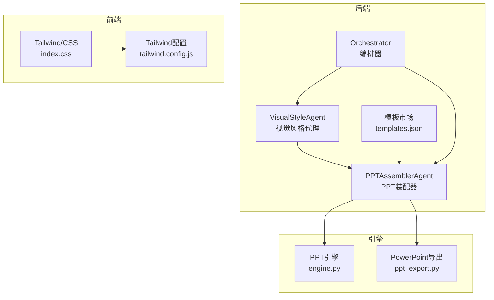
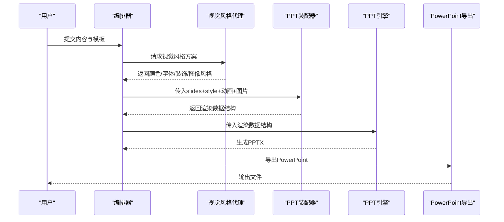
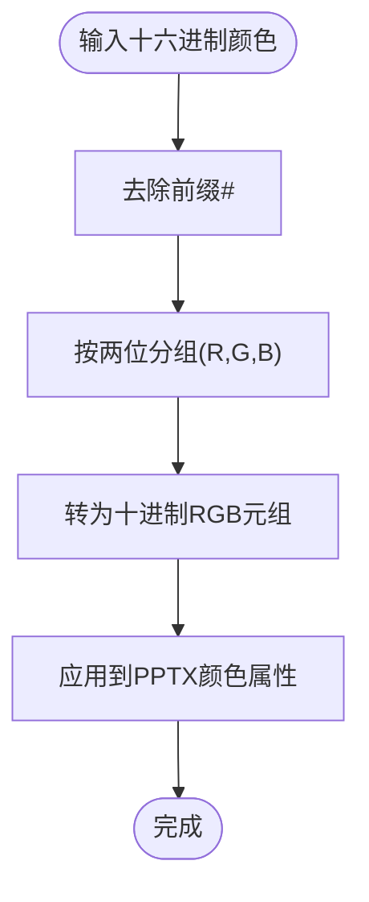
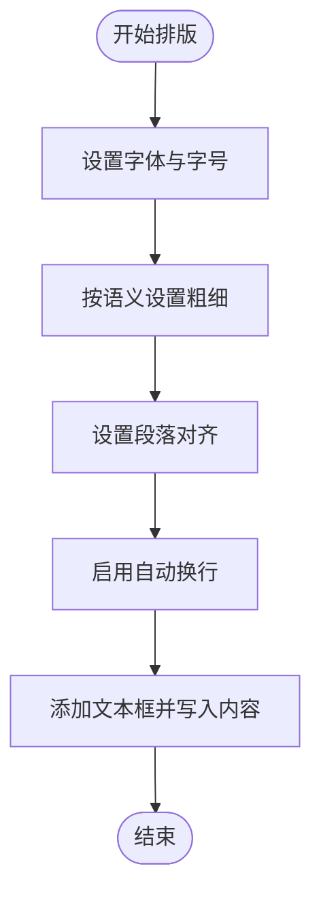
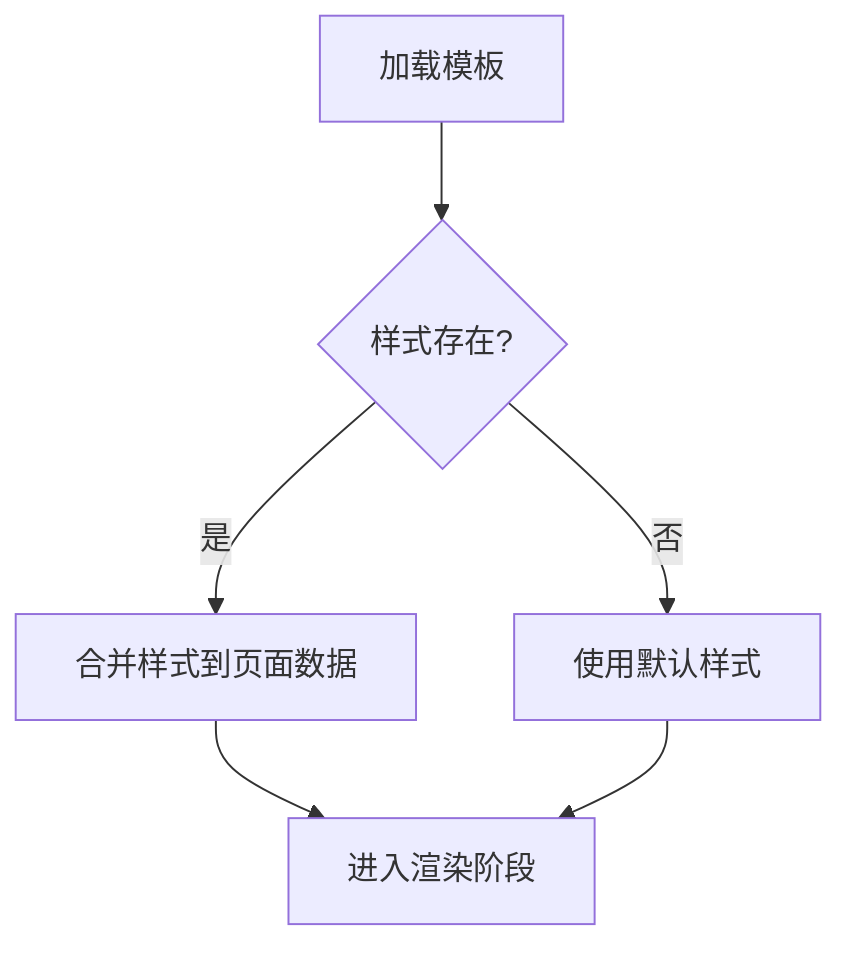
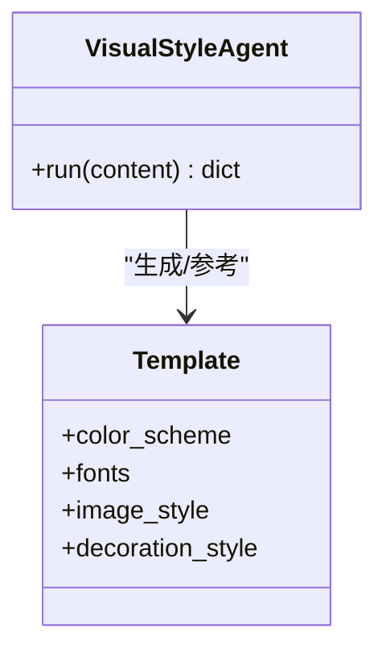
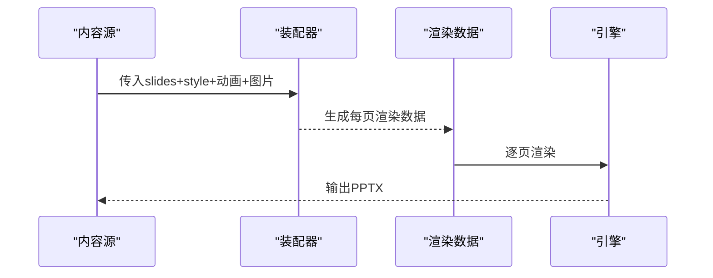
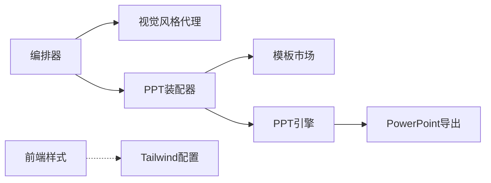

# 样式处理

<cite>
**本文引用的文件**
- [ppt-engine/engine.py](file://ppt-engine/engine.py)
- [engine/ppt_export.py](file://engine/ppt_export.py)
- [backend/agents/visual.py](file://backend/agents/visual.py)
- [backend/agents/assembler.py](file://backend/agents/assembler.py)
- [backend/agents/slide.py](file://backend/agents/slide.py)
- [backend/agents/orchestrator.py](file://backend/agents/orchestrator.py)
- [template-market/templates.json](file://template-market/templates.json)
- [frontend/src/index.css](file://frontend/src/index.css)
- [frontend/tailwind.config.js](file://frontend/tailwind.config.js)
- [backend/models/ppt.py](file://backend/models/ppt.py)
</cite>

## 目录
1. [简介](#简介)
2. [项目结构](#项目结构)
3. [核心组件](#核心组件)
4. [架构总览](#架构总览)
5. [详细组件分析](#详细组件分析)
6. [依赖分析](#依赖分析)
7. [性能考虑](#性能考虑)
8. [故障排查指南](#故障排查指南)
9. [结论](#结论)
10. [附录](#附录)

## 简介
本技术文档聚焦于样式处理系统，涵盖颜色系统、字体管理与排版规则的实现机制。文档从后端样式生成与模板装配、到前端UI样式与动画，再到PPT引擎中的颜色转换与文本排版，全面梳理样式在内容生成链路中的来源、传递、应用与优化策略。重点包括：
- 颜色系统：RGB颜色转换、十六进制颜色解析、颜色方案应用与覆盖
- 字体管理：字号控制、粗细调节、对齐方式与字体族选择
- 排版规则：布局构建器、段落格式、文本框尺寸与位置
- 样式继承与覆盖：全局样式注入、模板与主题优先级
- 主题开发与定制：模板市场、样式代理输出、样式装配
- 调试与性能：日志与错误处理、资源下载与线程安全、跨平台导出

## 项目结构
样式处理涉及多层协作：
- 后端样式生成：通过视觉风格代理输出统一的样式方案（颜色、字体、装饰风格）
- 模板与装配：将风格方案与内容结构合并为可渲染的PPT数据结构
- 引擎渲染：将数据结构映射为PPTX或PowerPoint对象模型
- 前端UI：Tailwind与CSS类提供界面交互与动画基础

图表来源
- [backend/agents/visual.py:1-34](file://backend/agents/visual.py#L1-L34)
- [backend/agents/assembler.py:1-89](file://backend/agents/assembler.py#L1-L89)
- [backend/agents/orchestrator.py:27-55](file://backend/agents/orchestrator.py#L27-L55)
- [template-market/templates.json:1-55](file://template-market/templates.json#L1-L55)
- [ppt-engine/engine.py:1-166](file://ppt-engine/engine.py#L1-L166)
- [engine/ppt_export.py:1-257](file://engine/ppt_export.py#L1-L257)
- [frontend/src/index.css:1-94](file://frontend/src/index.css#L1-L94)
- [frontend/tailwind.config.js:1-7](file://frontend/tailwind.config.js#L1-L7)

章节来源
- [backend/agents/orchestrator.py:27-55](file://backend/agents/orchestrator.py#L27-L55)
- [backend/agents/visual.py:1-34](file://backend/agents/visual.py#L1-L34)
- [backend/agents/assembler.py:1-89](file://backend/agents/assembler.py#L1-L89)
- [template-market/templates.json:1-55](file://template-market/templates.json#L1-L55)
- [ppt-engine/engine.py:1-166](file://ppt-engine/engine.py#L1-L166)
- [engine/ppt_export.py:1-257](file://engine/ppt_export.py#L1-L257)
- [frontend/src/index.css:1-94](file://frontend/src/index.css#L1-L94)
- [frontend/tailwind.config.js:1-7](file://frontend/tailwind.config.js#L1-L7)

## 核心组件
- 视觉风格代理：生成统一的样式方案（颜色、字体、图像风格、装饰风格）
- PPT装配器：将内容、动画、图片与样式整合为渲染数据结构
- PPT引擎：负责PPTX对象模型的颜色、字体、对齐与布局
- PowerPoint导出：基于Win32 COM接口进行PowerPoint对象模型操作
- 模板市场：内置主题模板，提供颜色与字体预设
- 前端样式：Tailwind与CSS类提供UI交互与动画基础

章节来源
- [backend/agents/visual.py:1-34](file://backend/agents/visual.py#L1-L34)
- [backend/agents/assembler.py:1-89](file://backend/agents/assembler.py#L1-L89)
- [ppt-engine/engine.py:1-166](file://ppt-engine/engine.py#L1-L166)
- [engine/ppt_export.py:1-257](file://engine/ppt_export.py#L1-L257)
- [template-market/templates.json:1-55](file://template-market/templates.json#L1-L55)
- [frontend/src/index.css:1-94](file://frontend/src/index.css#L1-L94)

## 架构总览
样式处理贯穿“内容生成—样式装配—引擎渲染”的链路。编排器协调各Agent产出样式方案，并将其注入到每页幻灯片的数据结构中；装配器将样式与内容、动画、图片合并；引擎将数据映射为PPTX或PowerPoint对象模型。

图表来源
- [backend/agents/orchestrator.py:27-55](file://backend/agents/orchestrator.py#L27-L55)
- [backend/agents/visual.py:1-34](file://backend/agents/visual.py#L1-L34)
- [backend/agents/assembler.py:1-89](file://backend/agents/assembler.py#L1-L89)
- [ppt-engine/engine.py:124-147](file://ppt-engine/engine.py#L124-L147)
- [engine/ppt_export.py:245-257](file://engine/ppt_export.py#L245-L257)

## 详细组件分析

### 颜色系统与十六进制解析
- 十六进制颜色解析：将形如“#RRGGBB”的字符串去除前缀并拆分为三元组，得到RGB值
- 颜色方案应用：从样式方案中读取主色、强调色等键值，按需应用到背景、文字、装饰等元素
- 颜色覆盖与回退：当样式缺失时使用默认值，确保渲染稳定性

图表来源
- [ppt-engine/engine.py:25-27](file://ppt-engine/engine.py#L25-L27)

章节来源
- [ppt-engine/engine.py:25-27](file://ppt-engine/engine.py#L25-L27)
- [ppt-engine/engine.py:46-69](file://ppt-engine/engine.py#L46-L69)
- [ppt-engine/engine.py:112-121](file://ppt-engine/engine.py#L112-L121)
- [engine/ppt_export.py:32-37](file://engine/ppt_export.py#L32-L37)

### 字体管理与排版规则
- 字号控制：标题、正文、副标题分别设定字号，保证层级清晰
- 粗细调节：标题加粗，正文常规
- 对齐方式：居中、左对齐等，依据布局与内容语义选择
- 字体族：统一使用中文字体族，提升跨平台一致性
- 文本框与段落：启用自动换行，设置段落对齐与字体属性

图表来源
- [ppt-engine/engine.py:30-43](file://ppt-engine/engine.py#L30-L43)
- [engine/ppt_export.py:138-150](file://engine/ppt_export.py#L138-L150)

章节来源
- [ppt-engine/engine.py:30-43](file://ppt-engine/engine.py#L30-L43)
- [engine/ppt_export.py:32-37](file://engine/ppt_export.py#L32-L37)
- [engine/ppt_export.py:138-150](file://engine/ppt_export.py#L138-L150)

### 样式继承与默认配置
- 全局样式注入：装配器将样式方案注入到每页数据结构，作为“默认样式”
- 模板优先级：模板市场提供颜色与字体预设，若未显式指定则采用模板默认
- 回退策略：当样式字段缺失时，使用引擎或装配器内的默认值，避免渲染失败

图表来源
- [backend/agents/assembler.py:78-88](file://backend/agents/assembler.py#L78-L88)
- [template-market/templates.json:1-55](file://template-market/templates.json#L1-L55)
- [ppt-engine/engine.py:132-140](file://ppt-engine/engine.py#L132-L140)

章节来源
- [backend/agents/assembler.py:78-88](file://backend/agents/assembler.py#L78-L88)
- [template-market/templates.json:1-55](file://template-market/templates.json#L1-L55)
- [ppt-engine/engine.py:132-140](file://ppt-engine/engine.py#L132-L140)

### 主题开发与样式定制
- 主题模板：模板市场提供多种主题，包含颜色方案与字体预设
- 视觉风格代理：根据主题、受众与情感基调生成统一的样式方案
- 定制指南：通过修改模板或覆盖样式字段实现主题化定制

图表来源
- [backend/agents/visual.py:1-34](file://backend/agents/visual.py#L1-L34)
- [template-market/templates.json:1-55](file://template-market/templates.json#L1-L55)

章节来源
- [backend/agents/visual.py:1-34](file://backend/agents/visual.py#L1-L34)
- [template-market/templates.json:1-55](file://template-market/templates.json#L1-L55)

### 样式与内容绑定、动态更新与批量操作
- 绑定方式：装配器将每页的标题、内容、图片、动画与样式组合为渲染数据
- 动态更新：运行时可替换样式字段，重新触发渲染流程
- 批量操作：对多页统一应用样式变更，或批量替换颜色方案

图表来源
- [backend/agents/assembler.py:16-88](file://backend/agents/assembler.py#L16-L88)
- [ppt-engine/engine.py:124-147](file://ppt-engine/engine.py#L124-L147)

章节来源
- [backend/agents/assembler.py:16-88](file://backend/agents/assembler.py#L16-L88)
- [ppt-engine/engine.py:124-147](file://ppt-engine/engine.py#L124-L147)

### 前端样式与动画
- Tailwind基础：通过Tailwind配置扫描前端目录，生成原子化样式
- 字体与动画：全局字体族与动画类，提供UI交互体验
- 与后端解耦：前端样式不影响PPT导出，仅用于Web界面展示

章节来源
- [frontend/src/index.css:1-94](file://frontend/src/index.css#L1-L94)
- [frontend/tailwind.config.js:1-7](file://frontend/tailwind.config.js#L1-L7)

## 依赖分析
- 组件耦合：编排器依赖视觉风格代理与装配器；装配器依赖模板市场；引擎依赖装配器输出
- 外部依赖：PPTX库、PowerPoint COM接口、图片与音频下载工具
- 潜在循环：当前文件间无直接循环依赖

图表来源
- [backend/agents/orchestrator.py:27-55](file://backend/agents/orchestrator.py#L27-L55)
- [backend/agents/assembler.py:1-89](file://backend/agents/assembler.py#L1-L89)
- [template-market/templates.json:1-55](file://template-market/templates.json#L1-L55)
- [ppt-engine/engine.py:1-166](file://ppt-engine/engine.py#L1-L166)
- [engine/ppt_export.py:1-257](file://engine/ppt_export.py#L1-L257)
- [frontend/src/index.css:1-94](file://frontend/src/index.css#L1-L94)
- [frontend/tailwind.config.js:1-7](file://frontend/tailwind.config.js#L1-L7)

章节来源
- [backend/agents/orchestrator.py:27-55](file://backend/agents/orchestrator.py#L27-L55)
- [backend/agents/assembler.py:1-89](file://backend/agents/assembler.py#L1-L89)
- [template-market/templates.json:1-55](file://template-market/templates.json#L1-L55)
- [ppt-engine/engine.py:1-166](file://ppt-engine/engine.py#L1-L166)
- [engine/ppt_export.py:1-257](file://engine/ppt_export.py#L1-L257)
- [frontend/src/index.css:1-94](file://frontend/src/index.css#L1-L94)
- [frontend/tailwind.config.js:1-7](file://frontend/tailwind.config.js#L1-L7)

## 性能考虑
- 颜色解析：十六进制解析为O(1)，开销极低
- 文本渲染：批量文本框创建与段落设置，注意避免过多小文本框导致渲染卡顿
- 图片与音频：异步下载与线程池导出，减少主线程阻塞
- 资源清理：临时目录与下载文件在完成后清理，避免磁盘占用
- 跨平台：PowerPoint导出依赖Windows COM，建议在Windows环境执行

章节来源
- [ppt-engine/engine.py:25-27](file://ppt-engine/engine.py#L25-L27)
- [engine/ppt_export.py:40-72](file://engine/ppt_export.py#L40-L72)
- [engine/ppt_export.py:239-257](file://engine/ppt_export.py#L239-L257)

## 故障排查指南
- 颜色异常：检查样式字段是否存在，确认十六进制格式正确
- 字体不生效：确认字体名称与系统可用字体一致，必要时回退至默认字体
- 动画无效：检查动画类型是否在映射表内，以及PowerPoint版本支持情况
- 导出失败：确认COM接口可用、PowerPoint已安装且有足够权限
- 资源下载失败：检查网络与下载库依赖，查看异常日志定位问题

章节来源
- [ppt-engine/engine.py:25-27](file://ppt-engine/engine.py#L25-L27)
- [engine/ppt_export.py:12-30](file://engine/ppt_export.py#L12-L30)
- [engine/ppt_export.py:92-237](file://engine/ppt_export.py#L92-L237)

## 结论
该样式处理系统以“统一风格方案—装配渲染—引擎导出”为主线，实现了颜色、字体与排版的规范化与可扩展化。通过模板市场与视觉风格代理，系统具备良好的主题化能力；通过装配器与引擎的分工，实现了内容与样式的高内聚、低耦合。建议在实际部署中关注跨平台导出限制、资源下载稳定性与样式回退策略，以获得更稳健的用户体验。

## 附录
- 默认样式配置：可在装配器与引擎中调整字体、字号与颜色默认值
- 样式覆盖规则：模板字段优先于全局样式，页面级样式优先于全局样式
- 主题开发步骤：定义模板颜色与字体、编写视觉风格代理、在装配器中合并样式

章节来源
- [backend/agents/assembler.py:78-88](file://backend/agents/assembler.py#L78-L88)
- [ppt-engine/engine.py:132-140](file://ppt-engine/engine.py#L132-L140)
- [template-market/templates.json:1-55](file://template-market/templates.json#L1-L55)