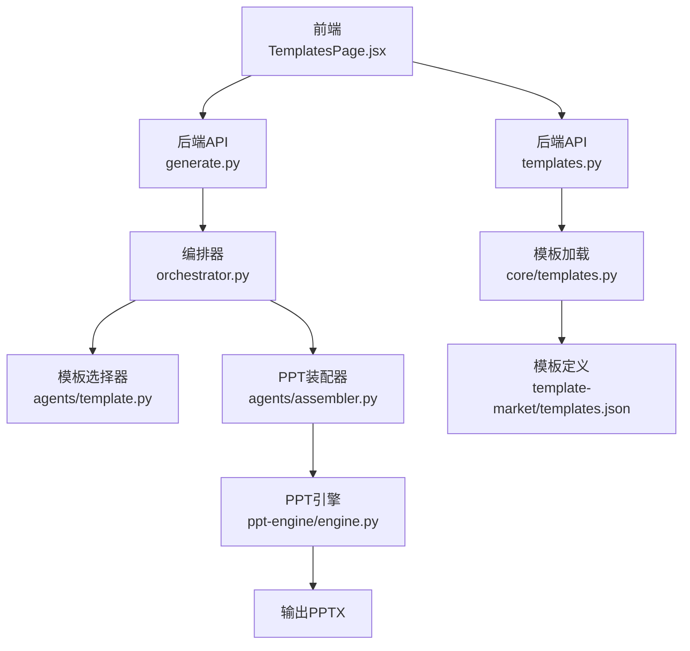
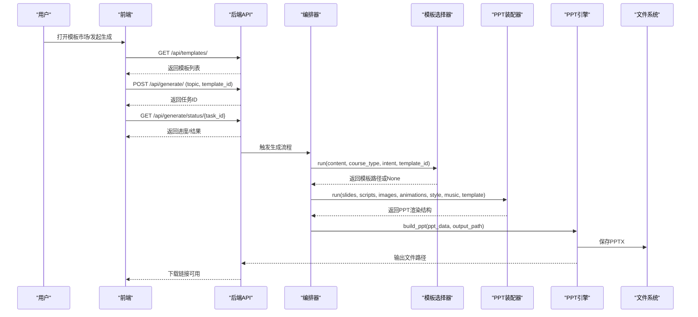
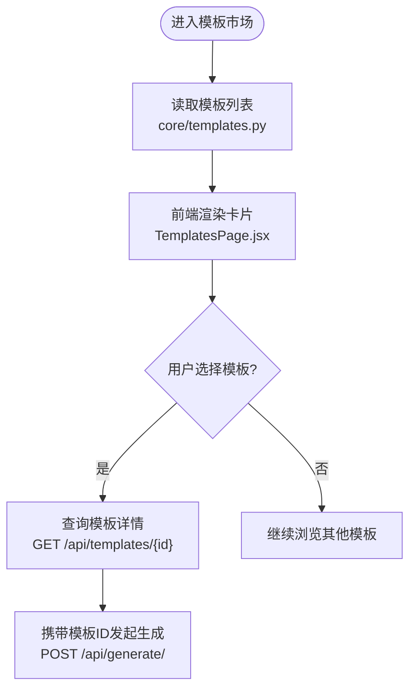
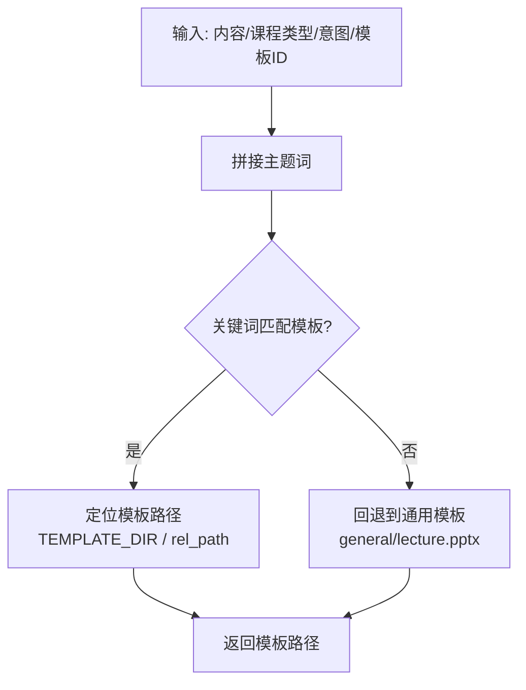
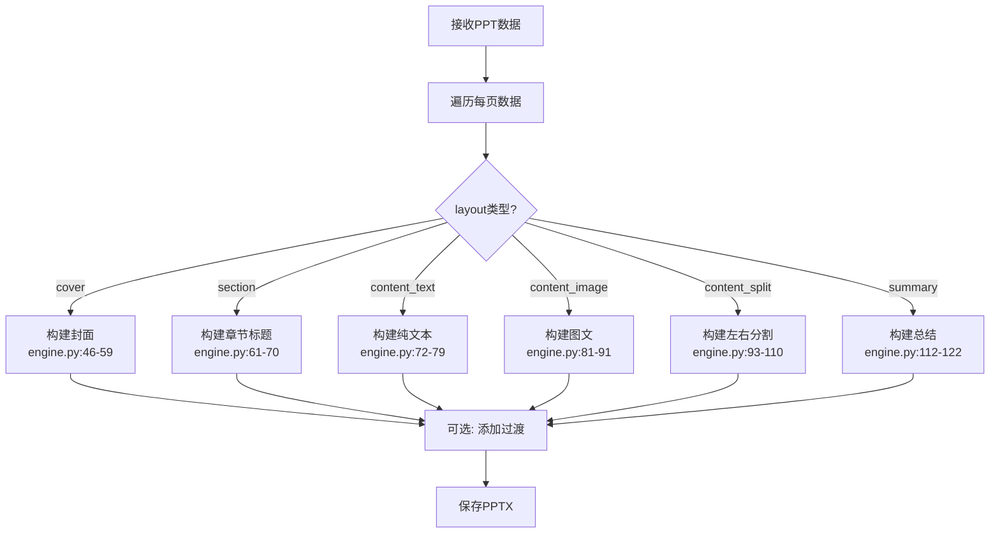
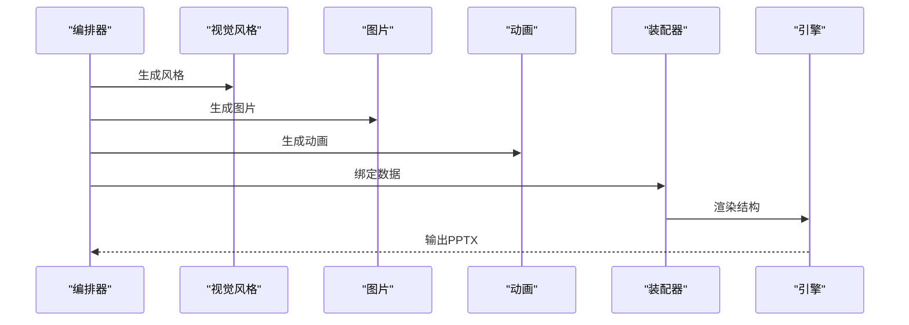
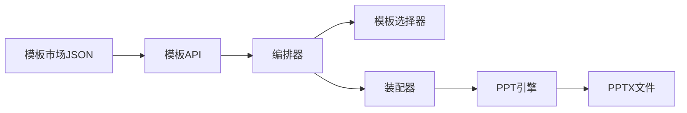

# 模板系统

<cite>
**本文引用的文件**
- [backend/agents/template.py](file://backend/agents/template.py)
- [backend/core/templates.py](file://backend/core/templates.py)
- [backend/api/templates.py](file://backend/api/templates.py)
- [ppt-engine/engine.py](file://ppt-engine/engine.py)
- [template-market/templates.json](file://template-market/templates.json)
- [backend/agents/assembler.py](file://backend/agents/assembler.py)
- [backend/agents/orchestrator.py](file://backend/agents/orchestrator.py)
- [frontend/src/pages/TemplatesPage.jsx](file://frontend/src/pages/TemplatesPage.jsx)
- [backend/api/generate.py](file://backend/api/generate.py)
- [engine/ppt_export.py](file://engine/ppt_export.py)
- [backend/models/ppt.py](file://backend/models/ppt.py)
- [backend/agents/base.py](file://backend/agents/base.py)
</cite>

## 目录
1. [简介](#简介)
2. [项目结构](#项目结构)
3. [核心组件](#核心组件)
4. [架构总览](#架构总览)
5. [详细组件分析](#详细组件分析)
6. [依赖关系分析](#依赖关系分析)
7. [性能考虑](#性能考虑)
8. [故障排除指南](#故障排除指南)
9. [结论](#结论)
10. [附录](#附录)

## 简介
本技术文档围绕“PPT模板系统”展开，系统通过模板市场提供可选模板，结合内容规划、视觉风格、图像与动画等元素，最终生成结构化PPT数据，并由引擎层渲染为PPTX文件。文档重点覆盖：
- 模板分类体系与模板加载机制
- 动态内容填充流程与布局规则
- 主题切换与颜色方案管理
- 模板开发与自定义步骤、模板验证流程
- 与AI生成内容的集成、数据绑定与动态更新
- 调试工具与故障排除方法

## 项目结构
系统采用前后端分离与多模块协作的架构：
- 后端（FastAPI）：负责模板市场接口、生成任务调度、任务状态管理与导出
- 引擎层（ppt-engine）：负责PPTX构建与布局渲染
- 模板市场（template-market）：提供模板元数据与颜色方案
- 前端（React）：展示模板市场、触发生成任务
- 其他辅助模块：任务队列、订阅与配额控制、数据库模型等

图表来源
- [frontend/src/pages/TemplatesPage.jsx:1-53](file://frontend/src/pages/TemplatesPage.jsx#L1-L53)
- [backend/api/generate.py:1-52](file://backend/api/generate.py#L1-L52)
- [backend/api/templates.py:1-20](file://backend/api/templates.py#L1-L20)
- [backend/agents/orchestrator.py:1-56](file://backend/agents/orchestrator.py#L1-L56)
- [backend/agents/template.py:1-33](file://backend/agents/template.py#L1-L33)
- [backend/agents/assembler.py:1-89](file://backend/agents/assembler.py#L1-L89)
- [ppt-engine/engine.py:1-166](file://ppt-engine/engine.py#L1-L166)
- [backend/core/templates.py:1-20](file://backend/core/templates.py#L1-L20)
- [template-market/templates.json:1-55](file://template-market/templates.json#L1-L55)

章节来源
- [frontend/src/pages/TemplatesPage.jsx:1-53](file://frontend/src/pages/TemplatesPage.jsx#L1-L53)
- [backend/api/generate.py:1-52](file://backend/api/generate.py#L1-L52)
- [backend/api/templates.py:1-20](file://backend/api/templates.py#L1-L20)
- [backend/agents/orchestrator.py:1-56](file://backend/agents/orchestrator.py#L1-L56)
- [backend/agents/template.py:1-33](file://backend/agents/template.py#L1-L33)
- [backend/agents/assembler.py:1-89](file://backend/agents/assembler.py#L1-L89)
- [ppt-engine/engine.py:1-166](file://ppt-engine/engine.py#L1-L166)
- [backend/core/templates.py:1-20](file://backend/core/templates.py#L1-L20)
- [template-market/templates.json:1-55](file://template-market/templates.json#L1-L55)

## 核心组件
- 模板市场与加载
  - 模板市场以JSON形式存储模板元数据，包含ID、名称、描述、分类、预览图、特性、价格层级、颜色方案、字体与装饰风格等字段
  - 后端提供模板列表与详情接口，供前端展示与用户选择
- 模板选择器
  - 根据输入内容、课程类型与意图关键词匹配模板路径，若无匹配则回退到通用讲授模板
- PPT装配器
  - 将多源AI产出（脚本、图片、动画、音乐、风格）整合为统一的PPT渲染结构，映射布局索引与页面级数据
- PPT引擎
  - 解析渲染结构，按布局构建幻灯片，应用颜色方案、字体与动画，保存为PPTX
- 生成与导出
  - 前端提交生成请求，后端创建异步任务并返回任务状态轮询接口；完成后提供下载链接

章节来源
- [backend/core/templates.py:1-20](file://backend/core/templates.py#L1-L20)
- [backend/api/templates.py:1-20](file://backend/api/templates.py#L1-L20)
- [backend/agents/template.py:1-33](file://backend/agents/template.py#L1-L33)
- [backend/agents/assembler.py:1-89](file://backend/agents/assembler.py#L1-L89)
- [ppt-engine/engine.py:1-166](file://ppt-engine/engine.py#L1-L166)
- [backend/api/generate.py:1-52](file://backend/api/generate.py#L1-L52)

## 架构总览
系统从用户输入开始，经由模板选择、内容装配、引擎渲染，最终输出PPTX文件。模板市场与模板选择器决定主题与颜色方案，装配器将多模态数据绑定到统一结构，引擎据此绘制布局。

图表来源
- [backend/api/generate.py:1-52](file://backend/api/generate.py#L1-L52)
- [backend/agents/orchestrator.py:1-56](file://backend/agents/orchestrator.py#L1-L56)
- [backend/agents/template.py:1-33](file://backend/agents/template.py#L1-L33)
- [backend/agents/assembler.py:1-89](file://backend/agents/assembler.py#L1-L89)
- [ppt-engine/engine.py:124-166](file://ppt-engine/engine.py#L124-L166)

## 详细组件分析

### 模板分类体系与模板加载机制
- 分类与特征
  - 模板按类别组织，如教育类、商业类等；每个模板包含特性标签（如教师指南、图片生成、动画、音乐等），用于指导后续AI模块的产出策略
- 颜色方案与字体
  - 每个模板定义主色、辅色、强调色、背景与文本色，以及标题与正文字体，作为引擎渲染的颜色与排版依据
- 加载与查询
  - 后端读取模板市场JSON，提供列表与按ID查询接口；前端在模板市场页展示模板卡片与价格层级

图表来源
- [backend/core/templates.py:1-20](file://backend/core/templates.py#L1-L20)
- [backend/api/templates.py:1-20](file://backend/api/templates.py#L1-L20)
- [frontend/src/pages/TemplatesPage.jsx:1-53](file://frontend/src/pages/TemplatesPage.jsx#L1-L53)
- [backend/api/generate.py:1-52](file://backend/api/generate.py#L1-L52)

章节来源
- [template-market/templates.json:1-55](file://template-market/templates.json#L1-L55)
- [backend/core/templates.py:1-20](file://backend/core/templates.py#L1-L20)
- [backend/api/templates.py:1-20](file://backend/api/templates.py#L1-L20)
- [frontend/src/pages/TemplatesPage.jsx:1-53](file://frontend/src/pages/TemplatesPage.jsx#L1-L53)
- [backend/api/generate.py:1-52](file://backend/api/generate.py#L1-L52)

### 模板加载与选择流程
- 关键逻辑
  - 模板选择器根据内容主题、课程类型与意图关键词进行匹配，优先返回匹配模板；若无匹配则使用通用讲授模板
  - 模板路径来自引擎模板目录，确保存在性校验后再返回
- 数据绑定
  - 选择器返回的模板路径会注入到PPT装配器的渲染结构中，作为模板文件来源

图表来源
- [backend/agents/template.py:7-33](file://backend/agents/template.py#L7-L33)

章节来源
- [backend/agents/template.py:1-33](file://backend/agents/template.py#L1-L33)

### 动态内容填充与布局规则
- 布局类型与构建器
  - 引擎定义多种布局构建器，包括封面、章节标题、纯文本、图文、左右分割、总结等
  - 每个构建器负责添加文本框、设置字体、字号、颜色、对齐与位置，并按需插入图片
- 颜色方案与主题
  - 布局可读取全局style中的color_scheme，按模板定义应用主色、强调色等
- 幻灯片尺寸与过渡
  - 统一幻灯片宽高；支持为每页添加过渡效果（基于配置）

图表来源
- [ppt-engine/engine.py:15-22](file://ppt-engine/engine.py#L15-L22)
- [ppt-engine/engine.py:46-122](file://ppt-engine/engine.py#L46-L122)
- [ppt-engine/engine.py:124-147](file://ppt-engine/engine.py#L124-L147)

章节来源
- [ppt-engine/engine.py:1-166](file://ppt-engine/engine.py#L1-L166)

### 主题切换与颜色方案管理
- 模板内颜色方案
  - 模板定义包含主色、辅色、强调色、背景与文本色，直接映射到引擎渲染的颜色应用
- 运行时主题合并
  - 装配器将style注入到每页数据中，引擎在构建时读取style.color_scheme并应用到对应元素
- 字体与装饰风格
  - 模板定义标题与正文字体，以及图像风格与装饰风格，影响渲染一致性

章节来源
- [template-market/templates.json:10-13](file://template-market/templates.json#L10-L13)
- [backend/agents/assembler.py:78-87](file://backend/agents/assembler.py#L78-L87)
- [ppt-engine/engine.py:50-53](file://ppt-engine/engine.py#L50-L53)
- [ppt-engine/engine.py:63-67](file://ppt-engine/engine.py#L63-L67)

### 模板开发指南与自定义步骤
- 创建新模板
  - 在模板市场JSON中新增模板条目，填写ID、名称、描述、分类、预览URL、特性、价格层级、颜色方案、字体与装饰风格
  - 在引擎模板目录准备对应的PPTX文件（建议与模板ID一致命名以便识别）
- 验证流程
  - 列表接口：GET /api/templates/ 确认模板出现在市场
  - 详情接口：GET /api/templates/{id} 确认字段完整
  - 生成测试：携带模板ID发起生成，检查输出是否符合预期
- 布局与内容
  - 在装配器中将AI产出（脚本、图片、动画、音乐、风格）映射到PPT渲染结构的字段
  - 在引擎中为新布局编写构建器函数，遵循现有模式（文本框、颜色、图片插入等）

章节来源
- [backend/api/templates.py:9-19](file://backend/api/templates.py#L9-L19)
- [backend/core/templates.py:7-19](file://backend/core/templates.py#L7-L19)
- [backend/agents/assembler.py:25-88](file://backend/agents/assembler.py#L25-L88)
- [ppt-engine/engine.py:15-22](file://ppt-engine/engine.py#L15-L22)

### 与AI生成内容的集成、数据绑定与动态更新
- 编排流水线
  - 从内容、意图、课程类型出发，经过故事规划、分镜设计、脚本写作、教师指南、视觉风格、图片提示、图片生成、动画与音乐等模块
  - 最终由装配器将各模块产物绑定到统一PPT结构
- 数据绑定
  - 装配器将页面号、标题、内容、叙述语、目标、情感、图片（主图与背景）、动画参数、脚本等字段映射到每页数据
  - 引擎在构建时读取这些字段并渲染
- 动态更新
  - 通过任务系统异步执行，前端轮询任务状态，完成后提供下载

图表来源
- [backend/agents/orchestrator.py:19-46](file://backend/agents/orchestrator.py#L19-L46)
- [backend/agents/assembler.py:16-88](file://backend/agents/assembler.py#L16-L88)
- [backend/api/generate.py:20-35](file://backend/api/generate.py#L20-L35)

章节来源
- [backend/agents/orchestrator.py:1-56](file://backend/agents/orchestrator.py#L1-L56)
- [backend/agents/assembler.py:1-89](file://backend/agents/assembler.py#L1-L89)
- [backend/api/generate.py:1-52](file://backend/api/generate.py#L1-L52)

### 引擎层（PPTX渲染）实现要点
- 文本框与样式
  - 统一使用文本框API，设置字形、字号、加粗、颜色与对齐
- 图片插入
  - 仅当文件存在时插入；限制显示区域与比例
- 动画与过渡
  - 支持多种入场动画与页面过渡；过渡通过底层XML扩展添加
- 输出
  - 默认输出为PPTX，路径可指定

章节来源
- [ppt-engine/engine.py:30-43](file://ppt-engine/engine.py#L30-L43)
- [ppt-engine/engine.py:88-90](file://ppt-engine/engine.py#L88-L90)
- [ppt-engine/engine.py:150-157](file://ppt-engine/engine.py#L150-L157)
- [ppt-engine/engine.py:160-166](file://ppt-engine/engine.py#L160-L166)

### 前端模板市场与生成入口
- 模板市场页
  - 请求模板列表并渲染卡片，展示名称、描述、特性标签与价格层级
  - 点击按钮跳转至生成页
- 生成流程
  - 提交主题与模板ID，创建异步任务，轮询任务状态，完成后提供下载

章节来源
- [frontend/src/pages/TemplatesPage.jsx:1-53](file://frontend/src/pages/TemplatesPage.jsx#L1-L53)
- [backend/api/generate.py:20-51](file://backend/api/generate.py#L20-L51)

### 任务系统与持久化
- 任务创建与状态
  - 生成接口创建任务并返回任务ID；状态接口返回状态、文件URL、下载标记、进度与错误信息
- 数据库记录
  - PPT记录模型包含用户ID、主题、页数、文件路径、文件名、状态与创建时间等字段

章节来源
- [backend/api/generate.py:20-51](file://backend/api/generate.py#L20-L51)
- [backend/models/ppt.py:1-18](file://backend/models/ppt.py#L1-L18)

## 依赖关系分析
- 组件耦合
  - 模板市场与引擎模板目录解耦：模板市场仅提供元数据，实际PPTX文件由引擎模板目录提供
  - 装配器与引擎强关联：装配器输出结构由引擎解析渲染
- 外部依赖
  - PowerPoint对象模型（win32com）用于实时渲染与导出（Windows环境）
  - Python-PPTX用于离线渲染与保存（跨平台）
- 可能的循环依赖
  - 当前模块间为单向依赖，未见循环导入

图表来源
- [backend/core/templates.py:1-20](file://backend/core/templates.py#L1-L20)
- [backend/api/templates.py:1-20](file://backend/api/templates.py#L1-L20)
- [backend/agents/orchestrator.py:1-56](file://backend/agents/orchestrator.py#L1-L56)
- [backend/agents/template.py:1-33](file://backend/agents/template.py#L1-L33)
- [backend/agents/assembler.py:1-89](file://backend/agents/assembler.py#L1-L89)
- [ppt-engine/engine.py:1-166](file://ppt-engine/engine.py#L1-L166)

章节来源
- [backend/core/templates.py:1-20](file://backend/core/templates.py#L1-L20)
- [backend/api/templates.py:1-20](file://backend/api/templates.py#L1-L20)
- [backend/agents/orchestrator.py:1-56](file://backend/agents/orchestrator.py#L1-L56)
- [backend/agents/template.py:1-33](file://backend/agents/template.py#L1-L33)
- [backend/agents/assembler.py:1-89](file://backend/agents/assembler.py#L1-L89)
- [ppt-engine/engine.py:1-166](file://ppt-engine/engine.py#L1-L166)

## 性能考虑
- 模板加载
  - 模板市场JSON读取为轻量操作；建议缓存模板列表于内存以减少IO
- 渲染性能
  - 文本框与图片插入为O(n)；尽量批量处理与避免重复计算
  - 过渡与动画数量应适度，避免过多效果导致播放卡顿
- 导出路径
  - Windows环境下使用PowerPoint对象模型导出可能较慢，建议在后台线程运行并异步通知
- IO与临时文件
  - 图片下载与音频下载会产生临时文件，应在完成后清理

## 故障排除指南
- 模板未显示或不可用
  - 检查模板市场JSON是否存在且格式正确
  - 确认模板ID与引擎模板目录中的文件名一致
- 生成失败或无输出
  - 查看任务状态接口的错误字段
  - 检查引擎渲染日志与异常捕获
- 颜色与字体不生效
  - 确认模板定义的颜色方案与字体字段完整
  - 检查装配器是否正确将style注入到每页数据
- 图片未插入
  - 确认图片文件路径存在且可访问
  - 检查引擎插入条件与文件扩展名判断

章节来源
- [backend/api/generate.py:38-51](file://backend/api/generate.py#L38-L51)
- [ppt-engine/engine.py:88-90](file://ppt-engine/engine.py#L88-L90)
- [backend/agents/assembler.py:78-87](file://backend/agents/assembler.py#L78-L87)

## 结论
该模板系统通过清晰的模板市场、灵活的模板选择与强大的装配器，实现了从AI内容到结构化PPT数据再到PPTX渲染的完整链路。模板的颜色方案与字体定义为统一视觉风格提供了基础，而布局构建器与动画/过渡机制保证了内容呈现的一致性与表现力。建议在生产环境中加强缓存、异步导出与资源清理，以提升整体性能与稳定性。

## 附录
- AI模型与提示词
  - 所有Agent均继承基础类，具备系统提示词与温度参数，便于统一管理与调优
- 示例与最佳实践
  - 新增模板时，优先完善模板市场JSON字段，再准备对应PPTX文件
  - 在装配器中保持字段命名一致性，便于引擎解析

章节来源
- [backend/agents/base.py:1-24](file://backend/agents/base.py#L1-L24)