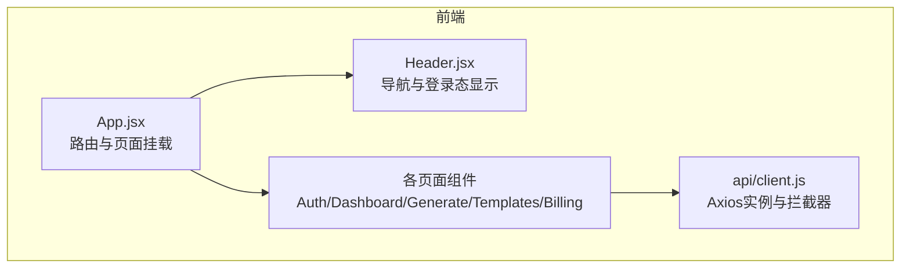
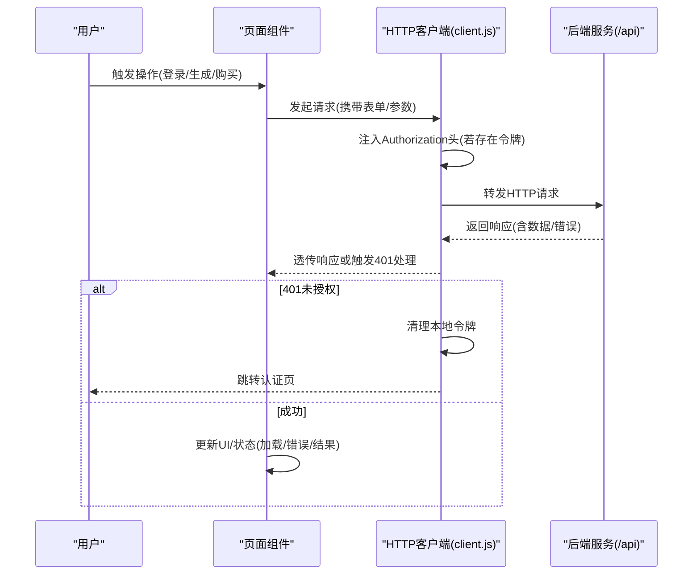
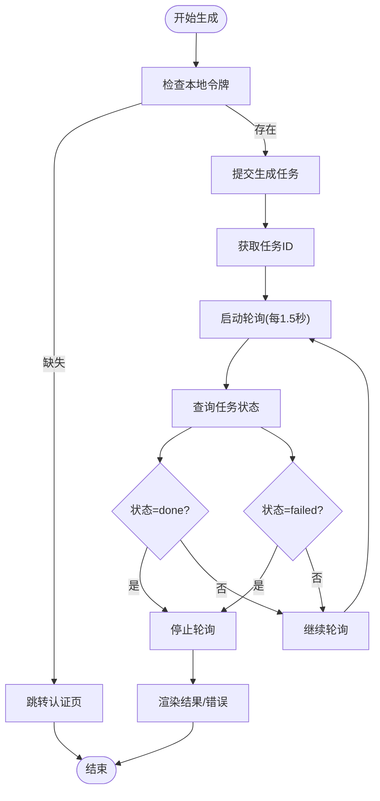
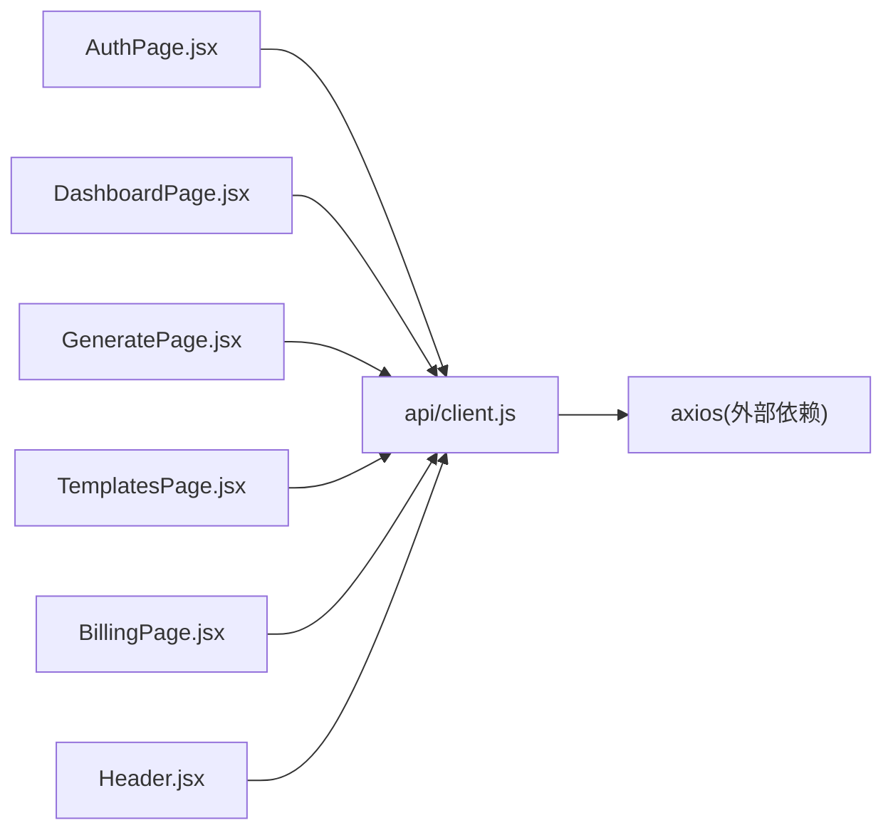

# API集成

<cite>
**本文引用的文件**
- [frontend/src/api/client.js](file://frontend/src/api/client.js)
- [frontend/src/pages/AuthPage.jsx](file://frontend/src/pages/AuthPage.jsx)
- [frontend/src/pages/DashboardPage.jsx](file://frontend/src/pages/DashboardPage.jsx)
- [frontend/src/pages/GeneratePage.jsx](file://frontend/src/pages/GeneratePage.jsx)
- [frontend/src/pages/BillingPage.jsx](file://frontend/src/pages/BillingPage.jsx)
- [frontend/src/pages/TemplatesPage.jsx](file://frontend/src/pages/TemplatesPage.jsx)
- [frontend/src/components/Header.jsx](file://frontend/src/components/Header.jsx)
- [frontend/package.json](file://frontend/package.json)
</cite>

## 目录
1. [简介](#简介)
2. [项目结构](#项目结构)
3. [核心组件](#核心组件)
4. [架构总览](#架构总览)
5. [详细组件分析](#详细组件分析)
6. [依赖关系分析](#依赖关系分析)
7. [性能与并发控制](#性能与并发控制)
8. [调试与故障排除](#调试与故障排除)
9. [结论](#结论)
10. [附录](#附录)

## 简介
本文件面向AI-PPT前端的API集成功能，系统性说明HTTP客户端配置、请求与响应拦截器、端点调用模式、认证与会话管理、错误处理策略、并发控制与轮询、以及下载与支付流程等。文档同时给出REST API使用要点、数据格式与状态码说明，并提供调试与性能优化建议。

## 项目结构
前端采用React + Vite构建，API封装集中在统一的HTTP客户端，页面组件按功能模块组织，路由在应用入口集中声明。核心API客户端位于前端源码目录，页面通过该客户端发起对后端服务的请求。

图表来源
- [frontend/src/App.jsx:14-33](file://frontend/src/App.jsx#L14-L33)
- [frontend/src/components/Header.jsx:12-59](file://frontend/src/components/Header.jsx#L12-L59)
- [frontend/src/api/client.js:1-28](file://frontend/src/api/client.js#L1-L28)

章节来源
- [frontend/src/App.jsx:14-33](file://frontend/src/App.jsx#L14-L33)
- [frontend/src/components/Header.jsx:12-59](file://frontend/src/components/Header.jsx#L12-L59)
- [frontend/src/api/client.js:1-28](file://frontend/src/api/client.js#L1-L28)

## 核心组件
- HTTP客户端与拦截器
  - 基础URL指向“/api”，统一代理转发至后端。
  - 请求拦截器自动注入本地存储中的访问令牌（若存在）。
  - 响应拦截器处理401未授权：清理本地令牌并跳转到认证页。
  - 默认超时设置为120秒，适用于长任务（如生成PPT）。
- 页面级API调用
  - 认证页：登录/注册接口，成功后写入访问令牌并跳转控制台。
  - 控制台：拉取用户信息；无令牌或失效则跳转认证页。
  - 生成页：提交生成任务、轮询任务状态、展示进度与结果。
  - 模板市场：拉取模板列表。
  - 支付页：创建结算会话并跳转第三方支付链接。
- 导航与会话
  - 头部根据本地令牌显示登录/控制台入口。
  - 页面在关键操作前检查令牌，确保受保护资源的安全访问。

章节来源
- [frontend/src/api/client.js:3-6](file://frontend/src/api/client.js#L3-L6)
- [frontend/src/api/client.js:8-14](file://frontend/src/api/client.js#L8-L14)
- [frontend/src/api/client.js:16-25](file://frontend/src/api/client.js#L16-L25)
- [frontend/src/pages/AuthPage.jsx:12-29](file://frontend/src/pages/AuthPage.jsx#L12-L29)
- [frontend/src/pages/DashboardPage.jsx:11-22](file://frontend/src/pages/DashboardPage.jsx#L11-L22)
- [frontend/src/pages/GeneratePage.jsx:19-68](file://frontend/src/pages/GeneratePage.jsx#L19-L68)
- [frontend/src/pages/TemplatesPage.jsx:11-15](file://frontend/src/pages/TemplatesPage.jsx#L11-L15)
- [frontend/src/pages/BillingPage.jsx:49-65](file://frontend/src/pages/BillingPage.jsx#L49-L65)
- [frontend/src/components/Header.jsx:13-55](file://frontend/src/components/Header.jsx#L13-L55)

## 架构总览
下图展示了前端API集成的整体交互：页面组件通过统一HTTP客户端发起请求，客户端负责注入令牌与处理通用错误，后端返回业务数据或错误信息，页面据此渲染UI或进行路由跳转。

图表来源
- [frontend/src/api/client.js:8-14](file://frontend/src/api/client.js#L8-L14)
- [frontend/src/api/client.js:16-25](file://frontend/src/api/client.js#L16-L25)
- [frontend/src/pages/AuthPage.jsx:12-29](file://frontend/src/pages/AuthPage.jsx#L12-L29)
- [frontend/src/pages/DashboardPage.jsx:11-22](file://frontend/src/pages/DashboardPage.jsx#L11-L22)
- [frontend/src/pages/GeneratePage.jsx:19-68](file://frontend/src/pages/GeneratePage.jsx#L19-L68)
- [frontend/src/pages/BillingPage.jsx:49-65](file://frontend/src/pages/BillingPage.jsx#L49-L65)

## 详细组件分析

### HTTP客户端与拦截器
- 客户端初始化
  - 基础URL设为“/api”，便于开发环境代理与生产反向代理统一转发。
  - 超时时间设为120秒，适配长耗时任务。
- 请求拦截器
  - 从本地存储读取令牌并在请求头添加Authorization字段。
- 响应拦截器
  - 对401错误进行全局处理：清除本地令牌并跳转认证页，避免后续请求继续失败。
  - 其他错误原样抛出，由调用方决定UI提示或重试策略。

章节来源
- [frontend/src/api/client.js:3-6](file://frontend/src/api/client.js#L3-L6)
- [frontend/src/api/client.js:8-14](file://frontend/src/api/client.js#L8-L14)
- [frontend/src/api/client.js:16-25](file://frontend/src/api/client.js#L16-L25)

### 认证与会话管理
- 登录/注册流程
  - 切换登录/注册模式，构造请求体，调用对应端点。
  - 成功后将访问令牌写入本地存储，随后跳转控制台。
- 用户信息拉取
  - 控制台页面在挂载时校验令牌，若不存在则跳转认证页；否则拉取用户信息并渲染。
- 未授权处理
  - 任何受保护接口返回401时，客户端统一清理令牌并跳转认证页。

章节来源
- [frontend/src/pages/AuthPage.jsx:12-29](file://frontend/src/pages/AuthPage.jsx#L12-L29)
- [frontend/src/pages/DashboardPage.jsx:11-22](file://frontend/src/pages/DashboardPage.jsx#L11-L22)
- [frontend/src/api/client.js:16-25](file://frontend/src/api/client.js#L16-L25)

### 生成任务与轮询
- 提交流程
  - 校验令牌与输入，提交生成任务，获取任务ID。
- 轮询策略
  - 启动定时器定期查询任务状态，更新进度文本。
  - 根据状态分支处理完成/失败场景，停止轮询并更新UI。
- 错误处理
  - 对429（超出生成次数）进行专门提示；其他异常统一捕获并提示。

图表来源
- [frontend/src/pages/GeneratePage.jsx:19-68](file://frontend/src/pages/GeneratePage.jsx#L19-L68)

章节来源
- [frontend/src/pages/GeneratePage.jsx:19-68](file://frontend/src/pages/GeneratePage.jsx#L19-L68)

### 模板市场与下载
- 模板列表
  - 首次进入页面时拉取模板列表并渲染，支持按价格等级区分可见性。
- 文件下载
  - 生成完成后提供下载链接，直接访问后端下载端点。

章节来源
- [frontend/src/pages/TemplatesPage.jsx:11-15](file://frontend/src/pages/TemplatesPage.jsx#L11-L15)
- [frontend/src/pages/GeneratePage.jsx:124-127](file://frontend/src/pages/GeneratePage.jsx#L124-L127)

### 支付与订阅
- 结算会话
  - 选择套餐后创建结算会话，后端返回第三方支付链接，前端跳转支付。
- 未授权处理
  - 若当前未登录，401时跳转认证页；其他错误弹窗提示。

章节来源
- [frontend/src/pages/BillingPage.jsx:49-65](file://frontend/src/pages/BillingPage.jsx#L49-L65)

### 导航与令牌联动
- 头部导航根据本地是否存在令牌显示登录或控制台入口。
- 页面在关键路径前置校验令牌，保证安全访问。

章节来源
- [frontend/src/components/Header.jsx:13-55](file://frontend/src/components/Header.jsx#L13-L55)
- [frontend/src/pages/DashboardPage.jsx:12-15](file://frontend/src/pages/DashboardPage.jsx#L12-L15)

## 依赖关系分析
- 组件耦合
  - 页面组件仅依赖统一HTTP客户端，降低对具体URL与头部细节的耦合。
  - 头部组件与页面组件通过路由与本地存储解耦。
- 外部依赖
  - Axios用于HTTP请求；react-router-dom用于路由与导航。
- 可能的改进
  - 将超时、重试、并发限制等配置抽象为可配置常量，便于统一管理与测试。

图表来源
- [frontend/src/pages/AuthPage.jsx](file://frontend/src/pages/AuthPage.jsx#L3)
- [frontend/src/pages/DashboardPage.jsx](file://frontend/src/pages/DashboardPage.jsx#L3)
- [frontend/src/pages/GeneratePage.jsx](file://frontend/src/pages/GeneratePage.jsx#L3)
- [frontend/src/pages/TemplatesPage.jsx](file://frontend/src/pages/TemplatesPage.jsx#L3)
- [frontend/src/pages/BillingPage.jsx](file://frontend/src/pages/BillingPage.jsx#L3)
- [frontend/src/components/Header.jsx](file://frontend/src/components/Header.jsx#L1)
- [frontend/src/api/client.js](file://frontend/src/api/client.js#L1)
- [frontend/package.json:11-18](file://frontend/package.json#L11-L18)

章节来源
- [frontend/package.json:11-18](file://frontend/package.json#L11-L18)

## 性能与并发控制
- 超时与长任务
  - 客户端默认超时120秒，适合生成类长任务；短请求可考虑更短超时以提升交互反馈。
- 轮询节流
  - 生成状态轮询间隔为1.5秒，建议结合任务规模动态调整，避免过度请求。
- 并发控制
  - 当前页面未显式限制并发请求；可在客户端层引入请求去重与并发上限策略，减少重复请求与服务器压力。
- 缓存策略
  - 对于模板列表等静态数据，可在页面层加入内存缓存与失效策略，减少重复拉取。
- 离线处理
  - 建议在客户端增加离线检测与提示，在网络恢复后自动重试失败请求。

[本节为通用性能建议，不直接分析具体文件]

## 调试与故障排除
- 常见问题定位
  - 401未授权：检查本地令牌是否过期或被清理；确认请求头是否正确附加。
  - 429频率限制：提示用户升级套餐或稍后再试。
  - 轮询异常：确认任务ID有效、后端状态接口可用、轮询逻辑未被意外中断。
- 开发调试
  - 在浏览器开发者工具Network面板观察请求头与响应状态码。
  - 在Console查看错误堆栈与响应数据结构。
- 建议的增强
  - 在客户端增加请求日志与错误上报，便于追踪问题。
  - 为关键页面增加加载态与骨架屏，改善用户体验。

章节来源
- [frontend/src/api/client.js:16-25](file://frontend/src/api/client.js#L16-L25)
- [frontend/src/pages/GeneratePage.jsx:49-58](file://frontend/src/pages/GeneratePage.jsx#L49-L58)
- [frontend/src/pages/BillingPage.jsx:59-63](file://frontend/src/pages/BillingPage.jsx#L59-L63)

## 结论
前端API集成以统一HTTP客户端为核心，通过请求/响应拦截器实现认证与通用错误处理，页面组件围绕令牌与路由实现安全访问。生成流程采用轮询与状态机式处理，模板与支付流程清晰明确。建议进一步完善并发控制、缓存与离线能力，并在客户端增加可观测性与错误上报，以提升稳定性与可维护性。

[本节为总结性内容，不直接分析具体文件]

## 附录

### REST API使用要点与状态码
- 基础URL
  - 所有请求均以前缀“/api”访问后端服务。
- 认证
  - 登录/注册成功后返回访问令牌；后续请求需在Authorization头中携带Bearer令牌。
- 端点与行为
  - 用户相关：登录/注册、获取当前用户信息。
  - 生成相关：提交生成任务、轮询任务状态、下载生成文件。
  - 模板相关：获取模板列表。
  - 支付相关：创建结算会话并跳转支付。
- 状态码
  - 200：成功。
  - 400：参数错误或业务错误（如详情信息）。
  - 401：未授权（客户端将清理令牌并跳转认证页）。
  - 404：资源不存在。
  - 429：请求过于频繁（如超出当日生成次数）。
  - 5xx：服务器内部错误。

章节来源
- [frontend/src/api/client.js:3-6](file://frontend/src/api/client.js#L3-L6)
- [frontend/src/api/client.js:16-25](file://frontend/src/api/client.js#L16-L25)
- [frontend/src/pages/AuthPage.jsx:17-21](file://frontend/src/pages/AuthPage.jsx#L17-L21)
- [frontend/src/pages/DashboardPage.jsx:16-21](file://frontend/src/pages/DashboardPage.jsx#L16-L21)
- [frontend/src/pages/GeneratePage.jsx:34-36](file://frontend/src/pages/GeneratePage.jsx#L34-L36)
- [frontend/src/pages/GeneratePage.jsx:40-53](file://frontend/src/pages/GeneratePage.jsx#L40-L53)
- [frontend/src/pages/TemplatesPage.jsx:12-14](file://frontend/src/pages/TemplatesPage.jsx#L12-L14)
- [frontend/src/pages/BillingPage.jsx:56-57](file://frontend/src/pages/BillingPage.jsx#L56-L57)

### WebSocket与实时更新
- 当前实现
  - 未发现WebSocket连接或事件监听代码。
- 建议
  - 如需实时通知或任务状态推送，可在客户端引入WebSocket连接与事件分发机制，并在页面层订阅相应事件。

[本小节为概念性建议，不直接分析具体文件]