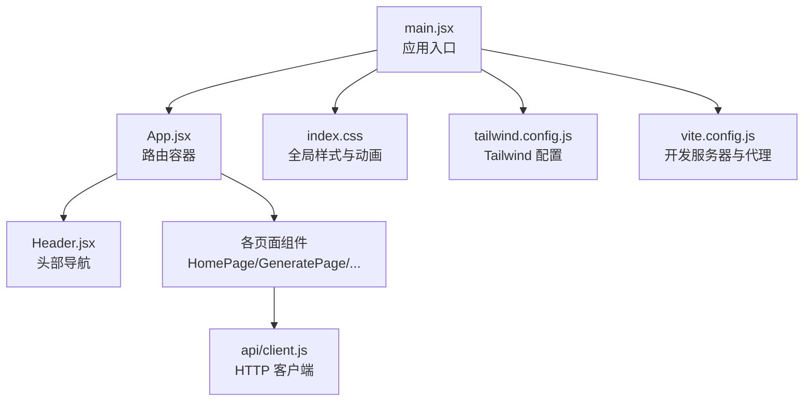
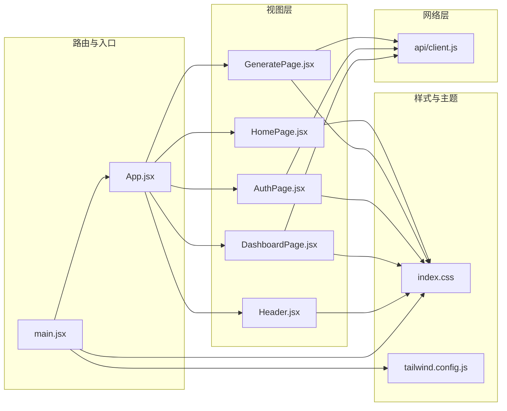
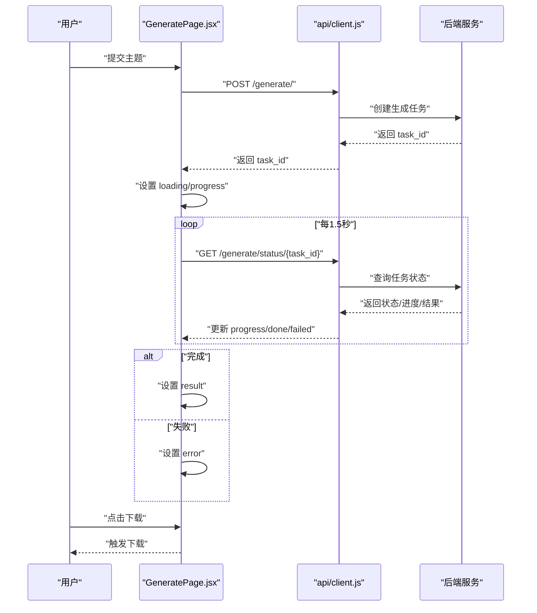
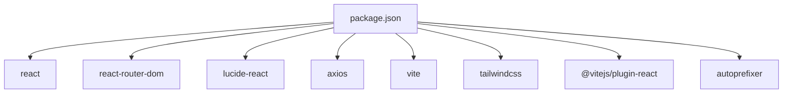

# UI组件库

<cite>
**本文引用的文件**
- [frontend/src/App.jsx](file://frontend/src/App.jsx)
- [frontend/src/main.jsx](file://frontend/src/main.jsx)
- [frontend/src/index.css](file://frontend/src/index.css)
- [frontend/tailwind.config.js](file://frontend/tailwind.config.js)
- [frontend/vite.config.js](file://frontend/vite.config.js)
- [frontend/package.json](file://frontend/package.json)
- [frontend/src/components/Header.jsx](file://frontend/src/components/Header.jsx)
- [frontend/src/pages/HomePage.jsx](file://frontend/src/pages/HomePage.jsx)
- [frontend/src/pages/GeneratePage.jsx](file://frontend/src/pages/GeneratePage.jsx)
- [frontend/src/pages/AuthPage.jsx](file://frontend/src/pages/AuthPage.jsx)
- [frontend/src/pages/DashboardPage.jsx](file://frontend/src/pages/DashboardPage.jsx)
- [frontend/src/api/client.js](file://frontend/src/api/client.js)
</cite>

## 目录
1. [简介](#简介)
2. [项目结构](#项目结构)
3. [核心组件](#核心组件)
4. [架构总览](#架构总览)
5. [详细组件分析](#详细组件分析)
6. [依赖关系分析](#依赖关系分析)
7. [性能考虑](#性能考虑)
8. [故障排查指南](#故障排查指南)
9. [结论](#结论)
10. [附录](#附录)

## 简介
本文件为 AI-PPT 前端 UI 组件库的系统化文档，聚焦通用 UI 组件的设计理念、视觉外观与交互行为，覆盖属性配置、事件处理、状态管理、可复用性与扩展性、样式系统与主题支持、响应式设计、组合模式与布局规范、无障碍访问与键盘导航、以及测试、性能优化与维护策略。文档以现有代码为依据，结合组件间的数据流与交互流程，提供可操作的集成指南与最佳实践。

## 项目结构
前端采用 React + Vite 构建，TailwindCSS 提供原子化样式与响应式栅格；路由基于 react-router-dom；全局样式通过自定义 CSS 类与 Tailwind 扩展实现统一风格。

图表来源
- [frontend/src/main.jsx:1-12](file://frontend/src/main.jsx#L1-L12)
- [frontend/src/App.jsx:14-33](file://frontend/src/App.jsx#L14-L33)
- [frontend/src/components/Header.jsx:12-60](file://frontend/src/components/Header.jsx#L12-L60)
- [frontend/src/pages/HomePage.jsx:5-15](file://frontend/src/pages/HomePage.jsx#L5-L15)
- [frontend/src/pages/GeneratePage.jsx:1-133](file://frontend/src/pages/GeneratePage.jsx#L1-L133)
- [frontend/src/api/client.js:1-28](file://frontend/src/api/client.js#L1-L28)
- [frontend/src/index.css:1-94](file://frontend/src/index.css#L1-L94)
- [frontend/tailwind.config.js:1-7](file://frontend/tailwind.config.js#L1-L7)
- [frontend/vite.config.js:1-9](file://frontend/vite.config.js#L1-L9)

章节来源
- [frontend/src/main.jsx:1-12](file://frontend/src/main.jsx#L1-L12)
- [frontend/src/App.jsx:14-33](file://frontend/src/App.jsx#L14-L33)
- [frontend/src/index.css:1-94](file://frontend/src/index.css#L1-L94)
- [frontend/tailwind.config.js:1-7](file://frontend/tailwind.config.js#L1-L7)
- [frontend/vite.config.js:1-9](file://frontend/vite.config.js#L1-L9)
- [frontend/package.json:1-26](file://frontend/package.json#L1-L26)

## 核心组件
- 头部导航 Header：提供站点 Logo、主导航项、登录态切换与高亮导航逻辑。
- 主页 HomePage：由多个业务区块组成，包括英雄区、统计卡片、特性展示、流程步骤与定价卡片。
- 生成页 GeneratePage：表单输入、异步任务轮询、进度反馈、结果展示与下载。
- 认证页 AuthPage：登录/注册切换、表单校验、错误提示与令牌存储。
- 仪表盘 DashboardPage：用户信息读取、额度使用进度条、快捷入口跳转。
- 全局样式与主题：通过自定义 CSS 类与 Tailwind 扩展实现渐变、卡片、按钮、悬停动画等统一风格。

章节来源
- [frontend/src/components/Header.jsx:12-60](file://frontend/src/components/Header.jsx#L12-L60)
- [frontend/src/pages/HomePage.jsx:5-178](file://frontend/src/pages/HomePage.jsx#L5-L178)
- [frontend/src/pages/GeneratePage.jsx:6-133](file://frontend/src/pages/GeneratePage.jsx#L6-L133)
- [frontend/src/pages/AuthPage.jsx:5-65](file://frontend/src/pages/AuthPage.jsx#L5-L65)
- [frontend/src/pages/DashboardPage.jsx:6-65](file://frontend/src/pages/DashboardPage.jsx#L6-L65)
- [frontend/src/index.css:8-94](file://frontend/src/index.css#L8-L94)

## 架构总览
整体采用“页面即组件”的组织方式，页面组件负责业务编排与状态管理，共享样式通过全局 CSS 与 Tailwind 实现一致性；API 通过 axios 封装统一注入认证头与 401 自动跳转。

图表来源
- [frontend/src/main.jsx:1-12](file://frontend/src/main.jsx#L1-L12)
- [frontend/src/App.jsx:14-33](file://frontend/src/App.jsx#L14-L33)
- [frontend/src/components/Header.jsx:12-60](file://frontend/src/components/Header.jsx#L12-L60)
- [frontend/src/pages/HomePage.jsx:5-178](file://frontend/src/pages/HomePage.jsx#L5-L178)
- [frontend/src/pages/GeneratePage.jsx:1-133](file://frontend/src/pages/GeneratePage.jsx#L1-L133)
- [frontend/src/pages/AuthPage.jsx:1-65](file://frontend/src/pages/AuthPage.jsx#L1-L65)
- [frontend/src/pages/DashboardPage.jsx:1-65](file://frontend/src/pages/DashboardPage.jsx#L1-L65)
- [frontend/src/api/client.js:1-28](file://frontend/src/api/client.js#L1-L28)
- [frontend/src/index.css:1-94](file://frontend/src/index.css#L1-L94)
- [frontend/tailwind.config.js:1-7](file://frontend/tailwind.config.js#L1-L7)

## 详细组件分析

### 头部导航 Header
- 设计理念：轻量玻璃拟态背景、动态高亮当前路由、移动端友好。
- 视觉外观：Logo 圆角渐变块、导航项悬停态、登录态下控制台链接、未登录时主按钮。
- 交互行为：使用 useLocation 判断当前路径，动态设置激活样式；根据本地存储 token 决定显示控制台或登录按钮。
- 可复用性：无副作用，仅依赖路由与图标库，可直接复用于其他页面。
- 扩展性：可通过传参扩展 NAV_ITEMS 或引入权限控制。
- 定制化：颜色、尺寸、图标均可通过 Tailwind 类名覆盖。

章节来源
- [frontend/src/components/Header.jsx:12-60](file://frontend/src/components/Header.jsx#L12-L60)

### 主页 HomePage
- 设计理念：信息分层清晰，强调“生成能力”“使用效果”“使用流程”“定价策略”。
- 视觉外观：渐变背景、卡片 hover 抬升与阴影、按钮主次态、网格布局。
- 交互行为：无复杂交互，主要通过链接跳转与卡片 hover 动画增强体验。
- 组合模式：由 Hero、Stats、Features、HowItWorks、Pricing 等子区块组合而成，便于按需裁剪。
- 响应式：使用 Tailwind 的响应式断点类实现多列布局自适应。

章节来源
- [frontend/src/pages/HomePage.jsx:5-178](file://frontend/src/pages/HomePage.jsx#L5-L178)

### 生成页 GeneratePage
- 设计理念：围绕“输入主题 → 异步生成 → 结果反馈”的闭环交互。
- 视觉外观：表单区域、加载指示、进度文本、成功/失败提示、下载按钮。
- 状态管理：
  - 表单字段：topic
  - 加载状态：loading
  - 结果：result
  - 错误：error
  - 进度：progress
  - 轮询句柄：pollRef
- 事件处理：
  - 提交表单：校验空值、检查 token、调用 /generate 接口，启动轮询
  - 轮询：定时请求 /generate/status/{task_id}，更新 progress，结束时根据状态设置 result 或 error
  - 清理：组件卸载时清理轮询
- 错误处理：429 限流提示、后端错误详情回显、异常场景统一兜底
- 可复用性：可抽取为通用“异步任务面板”组件，参数化接口地址与轮询间隔
- 定制化：进度文案、成功提示、下载链接均可通过 props 或插槽扩展

图表来源
- [frontend/src/pages/GeneratePage.jsx:19-68](file://frontend/src/pages/GeneratePage.jsx#L19-L68)
- [frontend/src/api/client.js:16-25](file://frontend/src/api/client.js#L16-L25)

章节来源
- [frontend/src/pages/GeneratePage.jsx:6-133](file://frontend/src/pages/GeneratePage.jsx#L6-L133)
- [frontend/src/api/client.js:1-28](file://frontend/src/api/client.js#L1-L28)

### 认证页 AuthPage
- 设计理念：登录/注册双态切换，最小化表单字段，即时错误提示。
- 视觉外观：卡片容器、渐变主按钮、切换链接。
- 状态管理：isLogin、form(username/email/password)、error、loading
- 事件处理：提交时根据 isLogin 选择不同接口，成功后写入 token 并跳转
- 可复用性：可抽象为“登录注册表单”组件，支持外部传入字段集合与验证规则

章节来源
- [frontend/src/pages/AuthPage.jsx:5-65](file://frontend/src/pages/AuthPage.jsx#L5-L65)

### 仪表盘 DashboardPage
- 设计理念：用户信息与额度使用概览，提供快捷入口。
- 视觉外观：卡片容器、进度条、入口卡片。
- 状态管理：user、loading
- 生命周期：进入页面检查 token，拉取用户信息，异常则清空 token 并跳转登录
- 可复用性：可抽取为“用户信息卡”组件，支持不同维度的额度展示

章节来源
- [frontend/src/pages/DashboardPage.jsx:6-65](file://frontend/src/pages/DashboardPage.jsx#L6-L65)

### 样式系统与主题
- 样式来源：
  - Tailwind 原子类：栅格、间距、边框、阴影、颜色
  - 自定义 CSS 类：gradient-*、card-hover、btn-*、stat-card、feature-card、glass、shimmer、float 等
- 主题支持：
  - 渐变色体系：primary/hero/card 等，统一品牌色
  - 悬停动画：统一的过渡时长与位移，提升交互质感
- 响应式设计：
  - 使用 md/lg 断点实现网格自适应
  - 移动端隐藏导航、按钮尺寸与内边距适配

章节来源
- [frontend/src/index.css:8-94](file://frontend/src/index.css#L8-L94)
- [frontend/tailwind.config.js:1-7](file://frontend/tailwind.config.js#L1-L7)

## 依赖关系分析
- 运行时依赖：React、react-router-dom、lucide-react、axios
- 构建工具：Vite、TailwindCSS、PostCSS
- 开发依赖：@vitejs/plugin-react、autoprefixer、tailwindcss、vite

图表来源
- [frontend/package.json:11-24](file://frontend/package.json#L11-L24)

章节来源
- [frontend/package.json:1-26](file://frontend/package.json#L1-L26)

## 性能考虑
- 组件渲染：
  - 合理拆分页面组件，避免不必要的重渲染
  - 使用 React.memo 或 useMemo/useCallback 优化频繁计算与子组件
- 网络请求：
  - 限制轮询频率与超时时间，及时清理轮询句柄
  - 对 429/401 等错误进行快速反馈，减少无效重试
- 样式与动画：
  - 控制动画数量与时长，避免在滚动或切换时造成掉帧
  - 使用 translate 替代改变布局属性的动画
- 构建与打包：
  - 启用 Tree Shaking 与按需导入图标
  - 生产构建开启压缩与分包策略

## 故障排查指南
- 无法登录/跳转登录页
  - 检查本地是否保存 token，确认 axios 请求拦截器是否注入 Authorization
  - 关注 401 响应拦截器是否触发跳转
- 生成任务长时间无响应
  - 检查轮询间隔与任务状态接口可用性
  - 查看 progress 字段是否更新，确认后端任务队列状态
- 页面样式异常
  - 确认 Tailwind content 路径是否包含当前页面文件
  - 检查自定义 CSS 类拼写与优先级
- 开发环境跨域
  - 检查 vite 代理配置是否指向后端服务端口

章节来源
- [frontend/src/api/client.js:8-25](file://frontend/src/api/client.js#L8-L25)
- [frontend/vite.config.js:6-6](file://frontend/vite.config.js#L6-L6)

## 结论
该 UI 组件库以简洁的页面组件为核心，配合统一的样式系统与响应式布局，实现了从登录认证到内容生成的完整业务闭环。组件具备良好的可复用性与扩展性，建议后续进一步抽象通用表单、卡片、模态等基础组件，并补充单元测试与端到端测试，持续优化交互细节与性能表现。

## 附录

### 组件属性与事件清单（摘要）
- Header
  - 属性：无（可扩展 NAV_ITEMS）
  - 事件：无（可扩展 onAction 回调）
- HomePage
  - 子区块：Hero、Stats、Features、HowItWorks、Pricing
  - 属性：无（可扩展数据源）
- GeneratePage
  - 状态：topic、loading、result、error、progress
  - 事件：onSubmit、onDownload
- AuthPage
  - 状态：isLogin、form、error、loading
  - 事件：onSubmit
- DashboardPage
  - 状态：user、loading
  - 事件：无

### 组合模式与布局规范
- 页面级组合：App.jsx 中集中路由与全局容器，页面组件作为业务容器
- 卡片组合：统计卡、特性卡、定价卡均采用统一圆角、阴影与悬停动画
- 布局规范：最大宽度容器、内外边距、栅格断点、按钮尺寸与图标大小保持一致

### 无障碍与键盘导航
- 建议：为按钮与链接添加明确的焦点样式；为图标添加可读性替代文本；为表单控件提供标签；为模态对话框设置 aria-modal 与焦点管理

### 测试方法与维护策略
- 单元测试：针对状态变更与事件回调进行断言
- 集成测试：模拟网络请求与轮询流程，覆盖成功/失败分支
- 端到端测试：覆盖登录、生成、下载等关键路径
- 维护策略：建立组件变更日志、定期审查样式冲突、监控第三方依赖安全通告