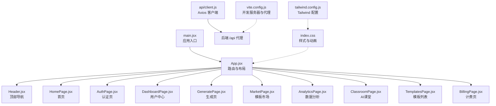
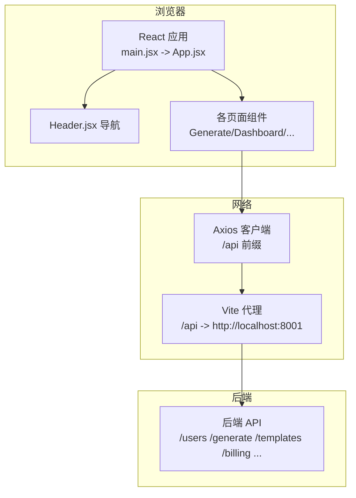
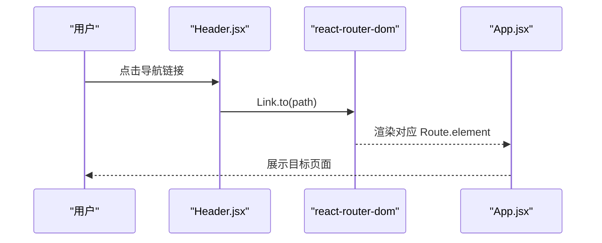
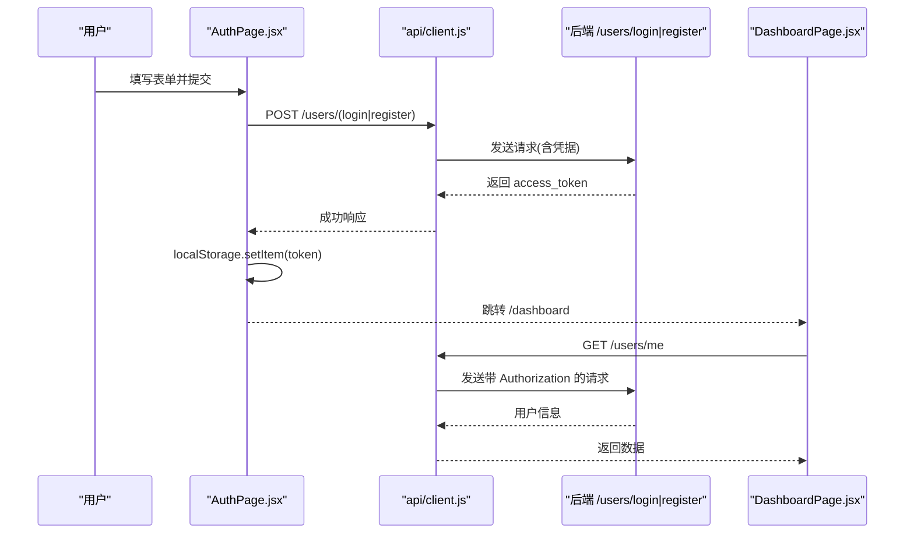
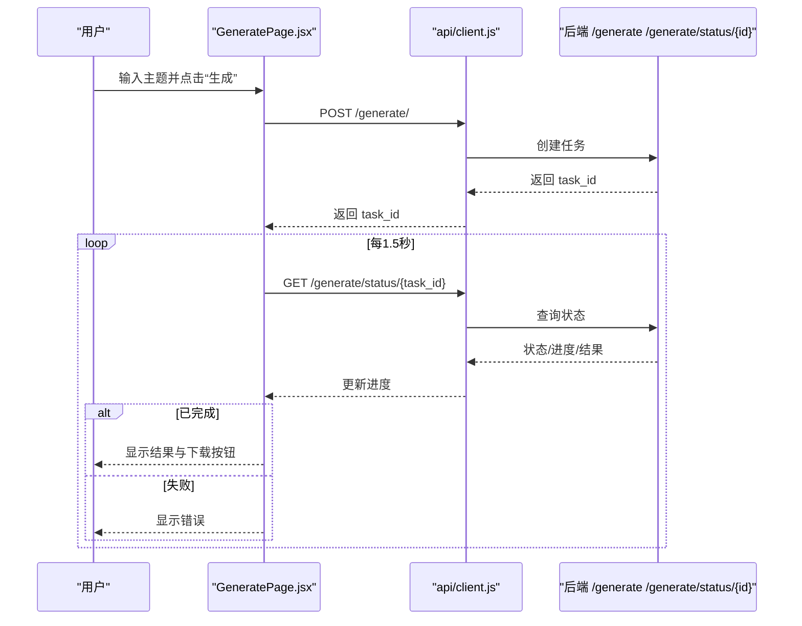
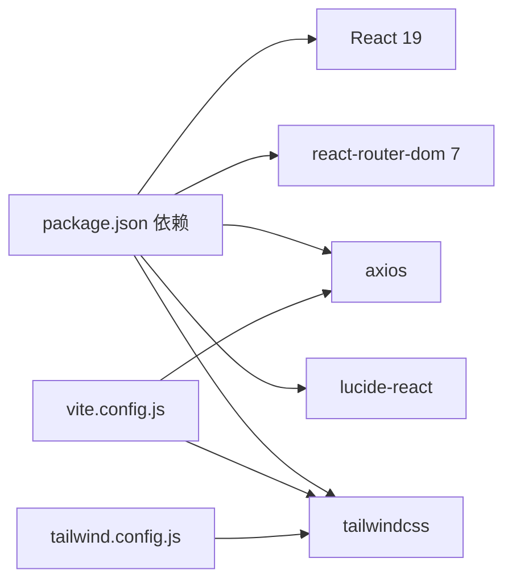

# 前端应用

<cite>
**本文引用的文件**
- [frontend/src/main.jsx](file://frontend/src/main.jsx)
- [frontend/src/App.jsx](file://frontend/src/App.jsx)
- [frontend/package.json](file://frontend/package.json)
- [frontend/vite.config.js](file://frontend/vite.config.js)
- [frontend/tailwind.config.js](file://frontend/tailwind.config.js)
- [frontend/src/index.css](file://frontend/src/index.css)
- [frontend/src/api/client.js](file://frontend/src/api/client.js)
- [frontend/src/components/Header.jsx](file://frontend/src/components/Header.jsx)
- [frontend/src/pages/HomePage.jsx](file://frontend/src/pages/HomePage.jsx)
- [frontend/src/pages/AuthPage.jsx](file://frontend/src/pages/AuthPage.jsx)
- [frontend/src/pages/DashboardPage.jsx](file://frontend/src/pages/DashboardPage.jsx)
- [frontend/src/pages/GeneratePage.jsx](file://frontend/src/pages/GeneratePage.jsx)
- [frontend/src/pages/MarketPage.jsx](file://frontend/src/pages/MarketPage.jsx)
- [frontend/src/pages/AnalyticsPage.jsx](file://frontend/src/pages/AnalyticsPage.jsx)
- [frontend/src/pages/ClassroomPage.jsx](file://frontend/src/pages/ClassroomPage.jsx)
- [frontend/src/pages/TemplatesPage.jsx](file://frontend/src/pages/TemplatesPage.jsx)
- [frontend/src/pages/BillingPage.jsx](file://frontend/src/pages/BillingPage.jsx)
</cite>

## 目录
1. [简介](#简介)
2. [项目结构](#项目结构)
3. [核心组件](#核心组件)
4. [架构总览](#架构总览)
5. [详细组件分析](#详细组件分析)
6. [依赖关系分析](#依赖关系分析)
7. [性能考虑](#性能考虑)
8. [故障排查指南](#故障排查指南)
9. [结论](#结论)
10. [附录](#附录)

## 简介
本文件为 AI-PPT 前端应用的全面技术文档，覆盖 React 应用结构、页面组件设计与状态管理、UI 组件的视觉与交互、API 集成与数据流、路由与导航、用户体验优化、组件属性与事件、样式与主题、响应式与无障碍、动画与过渡、跨浏览器与性能优化等。文档以“渐进加深”的方式组织，既面向开发者也便于非技术读者理解。

## 项目结构
前端采用 Vite + React 19 + TailwindCSS 架构，使用 react-router-dom v7 进行路由管理；通过 axios 封装统一 API 客户端，配置本地开发代理至后端服务。目录组织遵循“按页面与组件分层”的思路，入口在 main.jsx，根组件 App.jsx 定义路由与全局布局，页面组件位于 pages 目录，公共组件位于 components 目录，样式集中于 index.css，并通过 tailwind.config.js 扫描源码进行按需构建。

图表来源
- [frontend/src/main.jsx:1-12](file://frontend/src/main.jsx#L1-L12)
- [frontend/src/App.jsx:1-34](file://frontend/src/App.jsx#L1-L34)
- [frontend/src/api/client.js:1-28](file://frontend/src/api/client.js#L1-L28)
- [frontend/src/index.css:1-94](file://frontend/src/index.css#L1-L94)
- [frontend/tailwind.config.js:1-7](file://frontend/tailwind.config.js#L1-L7)
- [frontend/vite.config.js:1-9](file://frontend/vite.config.js#L1-L9)

章节来源
- [frontend/src/main.jsx:1-12](file://frontend/src/main.jsx#L1-L12)
- [frontend/src/App.jsx:1-34](file://frontend/src/App.jsx#L1-L34)
- [frontend/package.json:1-26](file://frontend/package.json#L1-L26)
- [frontend/vite.config.js:1-9](file://frontend/vite.config.js#L1-L9)
- [frontend/tailwind.config.js:1-7](file://frontend/tailwind.config.js#L1-L7)
- [frontend/src/index.css:1-94](file://frontend/src/index.css#L1-L94)

## 核心组件
- 应用入口与路由
  - 入口文件负责挂载 BrowserRouter 与根组件 App。
  - App.jsx 定义站点主路由与全局容器，包含 Header 与 Routes。
- 头部导航 Header
  - 响应式导航栏，根据当前路径高亮菜单项；根据登录状态显示“控制台”或“登录”入口。
  - 使用图标库 lucide-react 提供一致的视觉语言。
- 页面组件
  - 首页、认证、仪表盘、生成、模板市场、数据分析、AI课堂、模板列表、计费等页面，均以函数组件实现，配合状态钩子与副作用钩子完成交互与数据加载。
- API 客户端
  - axios 实例封装 base URL、请求头注入与 401 自动跳转逻辑，统一处理错误与鉴权。
- 样式与主题
  - TailwindCSS + 自定义 CSS 类实现渐变、卡片悬停、毛玻璃、动画等视觉效果；通过 tailwind.config.js 的 content 配置确保按需构建。

章节来源
- [frontend/src/main.jsx:1-12](file://frontend/src/main.jsx#L1-L12)
- [frontend/src/App.jsx:1-34](file://frontend/src/App.jsx#L1-L34)
- [frontend/src/components/Header.jsx:1-61](file://frontend/src/components/Header.jsx#L1-L61)
- [frontend/src/api/client.js:1-28](file://frontend/src/api/client.js#L1-L28)
- [frontend/src/index.css:1-94](file://frontend/src/index.css#L1-L94)

## 架构总览
前端采用“单页应用 + 后端直连”的架构：路由在前端解析，页面通过 axios 客户端调用后端 /api 接口；开发阶段通过 Vite 代理将 /api 请求转发至后端服务，生产环境由部署层统一反向代理。

图表来源
- [frontend/src/main.jsx:1-12](file://frontend/src/main.jsx#L1-L12)
- [frontend/src/App.jsx:1-34](file://frontend/src/App.jsx#L1-L34)
- [frontend/src/api/client.js:1-28](file://frontend/src/api/client.js#L1-L28)
- [frontend/vite.config.js:1-9](file://frontend/vite.config.js#L1-L9)

## 详细组件分析

### 路由与导航
- 路由定义集中在 App.jsx，包含首页、认证、仪表盘、生成、模板市场、数据分析、AI课堂、模板列表、计费等路径。
- Header.jsx 使用 useLocation 判断当前路径，动态高亮对应菜单项；根据是否存在 token 决定显示“控制台”或“登录”。

图表来源
- [frontend/src/App.jsx:19-29](file://frontend/src/App.jsx#L19-L29)
- [frontend/src/components/Header.jsx:30-44](file://frontend/src/components/Header.jsx#L30-L44)

章节来源
- [frontend/src/App.jsx:19-29](file://frontend/src/App.jsx#L19-L29)
- [frontend/src/components/Header.jsx:12-58](file://frontend/src/components/Header.jsx#L12-L58)

### 认证流程与状态管理
- 认证页支持登录/注册切换，提交成功后写入本地 token 并跳转仪表盘。
- 仪表盘页在挂载时校验 token 并拉取用户信息；若 401 或异常则清空 token 并跳转认证页。
- API 客户端拦截器统一注入 Authorization 头并在 401 时自动跳转认证页。

图表来源
- [frontend/src/pages/AuthPage.jsx:12-29](file://frontend/src/pages/AuthPage.jsx#L12-L29)
- [frontend/src/api/client.js:8-25](file://frontend/src/api/client.js#L8-L25)
- [frontend/src/pages/DashboardPage.jsx:11-22](file://frontend/src/pages/DashboardPage.jsx#L11-L22)

章节来源
- [frontend/src/pages/AuthPage.jsx:1-65](file://frontend/src/pages/AuthPage.jsx#L1-L65)
- [frontend/src/pages/DashboardPage.jsx:1-65](file://frontend/src/pages/DashboardPage.jsx#L1-L65)
- [frontend/src/api/client.js:1-28](file://frontend/src/api/client.js#L1-L28)

### 生成流程与任务轮询
- 生成页支持输入主题并提交生成任务；提交成功后定时轮询任务状态，更新进度与结果。
- 支持 429 限流提示与失败兜底；完成后提供下载链接。

图表来源
- [frontend/src/pages/GeneratePage.jsx:19-68](file://frontend/src/pages/GeneratePage.jsx#L19-L68)
- [frontend/src/api/client.js:1-28](file://frontend/src/api/client.js#L1-L28)

章节来源
- [frontend/src/pages/GeneratePage.jsx:1-133](file://frontend/src/pages/GeneratePage.jsx#L1-L133)
- [frontend/src/api/client.js:1-28](file://frontend/src/api/client.js#L1-L28)

### 数据展示与交互
- 首页包含英雄区、统计区、特性区、流程区与定价区，使用卡片、渐变与动画增强视觉层次。
- 数据分析页展示关键指标卡片与柱状趋势图、最近生成列表。
- AI课堂页展示课程卡片与播放入口。
- 模板市场与模板列表页分别展示模板网格与详情卡片，支持使用跳转。

章节来源
- [frontend/src/pages/HomePage.jsx:1-178](file://frontend/src/pages/HomePage.jsx#L1-L178)
- [frontend/src/pages/AnalyticsPage.jsx:1-73](file://frontend/src/pages/AnalyticsPage.jsx#L1-L73)
- [frontend/src/pages/ClassroomPage.jsx:1-62](file://frontend/src/pages/ClassroomPage.jsx#L1-L62)
- [frontend/src/pages/MarketPage.jsx:1-57](file://frontend/src/pages/MarketPage.jsx#L1-L57)
- [frontend/src/pages/TemplatesPage.jsx:1-53](file://frontend/src/pages/TemplatesPage.jsx#L1-L53)

### 计费与订阅
- 计费页展示多个套餐方案，支持跳转认证或发起结账流程；对 401 自动跳转认证页，其余错误弹窗提示。

章节来源
- [frontend/src/pages/BillingPage.jsx:1-106](file://frontend/src/pages/BillingPage.jsx#L1-L106)
- [frontend/src/api/client.js:16-25](file://frontend/src/api/client.js#L16-L25)

## 依赖关系分析
- 依赖与版本
  - React 19、react-router-dom 7、axios、lucide-react、TailwindCSS 及其工具链。
- 构建与开发
  - Vite 提供开发服务器与热更新；代理将 /api 转发至后端；PostCSS/Autoprefixer 保证样式兼容。
- 样式扫描
  - Tailwind 通过 content 配置扫描 HTML 与 JS 文件，仅打包实际使用的样式。

图表来源
- [frontend/package.json:11-24](file://frontend/package.json#L11-L24)
- [frontend/vite.config.js:1-9](file://frontend/vite.config.js#L1-L9)
- [frontend/tailwind.config.js:1-7](file://frontend/tailwind.config.js#L1-L7)

章节来源
- [frontend/package.json:1-26](file://frontend/package.json#L1-L26)
- [frontend/vite.config.js:1-9](file://frontend/vite.config.js#L1-L9)
- [frontend/tailwind.config.js:1-7](file://frontend/tailwind.config.js#L1-L7)

## 性能考虑
- 资源体积与按需加载
  - Tailwind 按需扫描 content，避免打包未使用样式；组件级懒加载可进一步优化首屏。
- 网络请求
  - 生成页采用轮询策略，建议在后端支持长轮询或 SSE 时替换为更高效的方式；对频繁请求增加节流/防抖。
- 动画与渲染
  - 卡片 hover 与 hero 浮动动画已在 CSS 中实现，注意在低端设备上适度减少动画强度。
- 缓存与离线
  - 对静态资源启用浏览器缓存；对用户信息与模板列表设置合理缓存策略。
- 图标与媒体
  - lucide-react 为轻量 SVG 图标库；模板预览建议使用懒加载与占位图。

## 故障排查指南
- 认证相关
  - 若出现 401，确认本地是否仍有 token；检查 API 客户端拦截器是否正确注入 Authorization。
- 生成失败
  - 检查任务 ID 是否返回；确认轮询间隔与状态字段命名；关注 429 限流提示。
- 路由跳转
  - 确认 Header 中的 Link.to 与 App.jsx 的 Route path 一致；检查 useLocation 的路径匹配。
- 样式异常
  - 确认 Tailwind 已正确扫描源文件；检查自定义类名拼写与优先级。

章节来源
- [frontend/src/api/client.js:8-25](file://frontend/src/api/client.js#L8-L25)
- [frontend/src/pages/GeneratePage.jsx:38-68](file://frontend/src/pages/GeneratePage.jsx#L38-L68)
- [frontend/src/App.jsx:19-29](file://frontend/src/App.jsx#L19-L29)
- [frontend/tailwind.config.js:3](file://frontend/tailwind.config.js#L3)

## 结论
该前端应用以清晰的路由结构、模块化的页面组件与统一的 API 客户端为基础，结合 TailwindCSS 与动画实现良好的视觉与交互体验。后续可在任务轮询优化、模板懒加载、缓存策略与无障碍细节方面持续改进，以提升性能与可用性。

## 附录

### 组件属性与事件清单
- Header.jsx
  - 属性：无（使用路由上下文）
  - 事件：点击导航链接触发路由跳转；根据 token 切换“控制台/登录”入口
- GeneratePage.jsx
  - 属性：无
  - 事件：表单提交、输入变更、轮询清理
  - 状态：topic、loading、result、error、progress
- DashboardPage.jsx
  - 属性：无
  - 事件：挂载时拉取用户信息
  - 状态：user、loading
- AuthPage.jsx
  - 属性：无
  - 事件：表单提交、切换登录/注册
  - 状态：isLogin、form、error、loading
- AnalyticsPage.jsx / ClassroomPage.jsx / MarketPage.jsx / TemplatesPage.jsx / BillingPage.jsx
  - 属性：无（部分使用本地常量或 props 注入）
  - 事件：点击卡片、按钮、跳转等

章节来源
- [frontend/src/components/Header.jsx:1-61](file://frontend/src/components/Header.jsx#L1-L61)
- [frontend/src/pages/GeneratePage.jsx:1-133](file://frontend/src/pages/GeneratePage.jsx#L1-L133)
- [frontend/src/pages/DashboardPage.jsx:1-65](file://frontend/src/pages/DashboardPage.jsx#L1-L65)
- [frontend/src/pages/AuthPage.jsx:1-65](file://frontend/src/pages/AuthPage.jsx#L1-L65)
- [frontend/src/pages/AnalyticsPage.jsx:1-73](file://frontend/src/pages/AnalyticsPage.jsx#L1-L73)
- [frontend/src/pages/ClassroomPage.jsx:1-62](file://frontend/src/pages/ClassroomPage.jsx#L1-L62)
- [frontend/src/pages/MarketPage.jsx:1-57](file://frontend/src/pages/MarketPage.jsx#L1-L57)
- [frontend/src/pages/TemplatesPage.jsx:1-53](file://frontend/src/pages/TemplatesPage.jsx#L1-L53)
- [frontend/src/pages/BillingPage.jsx:1-106](file://frontend/src/pages/BillingPage.jsx#L1-L106)

### 样式与主题定制
- 渐变与背景
  - gradient-primary、gradient-hero、gradient-card 等类用于统一视觉风格
- 卡片与悬停
  - card-hover、stat-card、feature-card 提供统一的阴影与位移动画
- 毛玻璃与闪烁
  - glass 提供模糊背景；shimmer 提供占位闪烁动画
- 动画
  - animate-float 与 animate-float-delayed 用于装饰性浮动动画
- 主题扩展
  - 在 tailwind.config.js 中扩展 theme；在 index.css 中新增自定义类

章节来源
- [frontend/src/index.css:9-94](file://frontend/src/index.css#L9-L94)
- [frontend/tailwind.config.js:2-6](file://frontend/tailwind.config.js#L2-L6)

### 响应式与无障碍
- 响应式
  - 使用 Tailwind 的 md/lg 断点适配桌面端布局；移动端保持简洁导航与卡片堆叠
- 无障碍
  - 建议：为按钮添加 aria-label；为图片提供替代文本；确保键盘可聚焦；为加载状态提供屏幕阅读器提示

### 跨浏览器兼容性
- PostCSS/Autoprefixer 已在构建链中；建议在 CI 中使用 Browserslist 指定目标范围
- 对较老浏览器，可考虑 polyfill（如 fetch/promise）与 CSS Grid 兼容方案

### 使用示例与最佳实践
- 示例
  - 在生成页输入主题后提交，观察进度条与最终下载按钮
  - 在认证页切换登录/注册，成功后进入仪表盘
- 最佳实践
  - 对高频接口增加缓存与去重
  - 对大图与模板预览采用懒加载
  - 对轮询任务在组件卸载时清理定时器