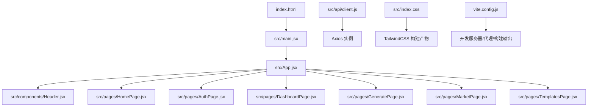
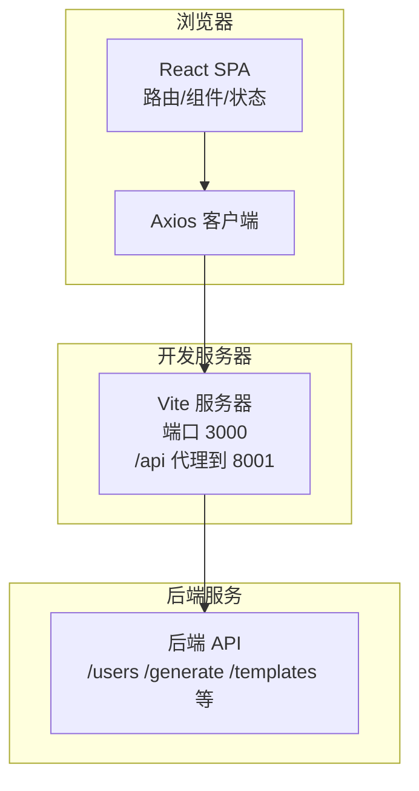
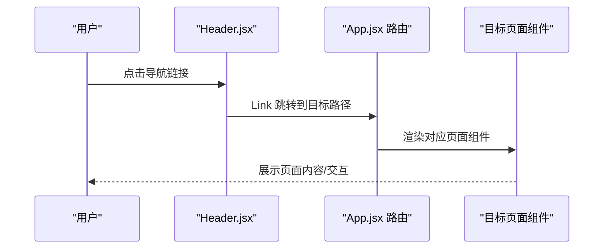
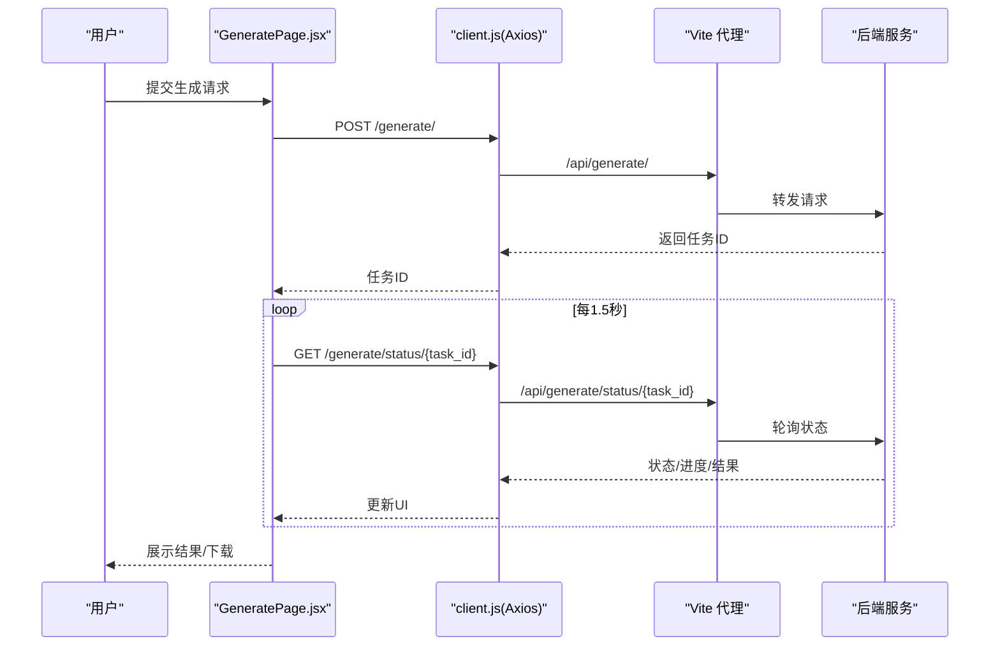
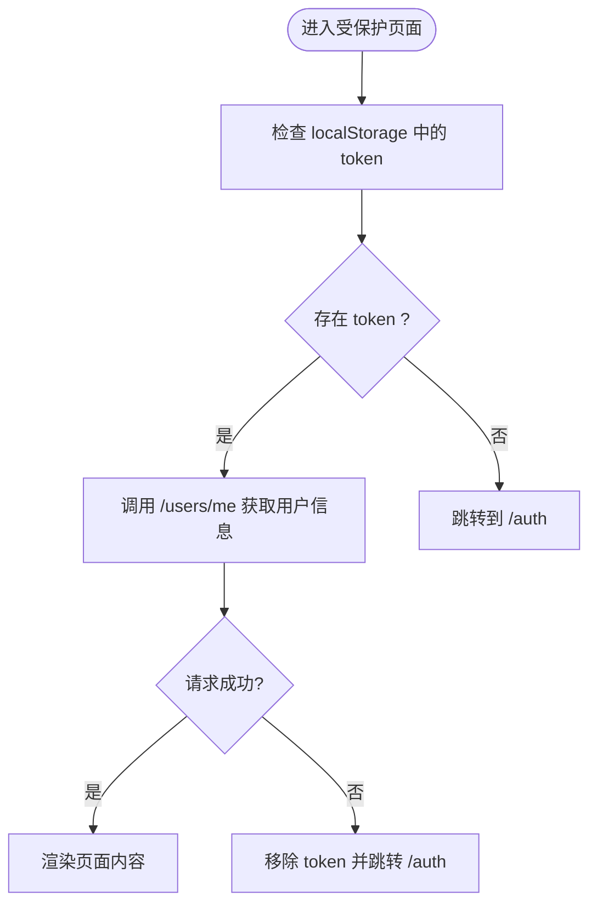
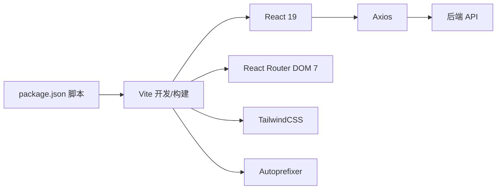

# 应用架构设计

<cite>
**本文引用的文件**
- [package.json](file://frontend/package.json)
- [vite.config.js](file://frontend/vite.config.js)
- [main.jsx](file://frontend/src/main.jsx)
- [App.jsx](file://frontend/src/App.jsx)
- [client.js](file://frontend/src/api/client.js)
- [Header.jsx](file://frontend/src/components/Header.jsx)
- [HomePage.jsx](file://frontend/src/pages/HomePage.jsx)
- [GeneratePage.jsx](file://frontend/src/pages/GeneratePage.jsx)
- [DashboardPage.jsx](file://frontend/src/pages/DashboardPage.jsx)
- [AuthPage.jsx](file://frontend/src/pages/AuthPage.jsx)
- [MarketPage.jsx](file://frontend/src/pages/MarketPage.jsx)
- [TemplatesPage.jsx](file://frontend/src/pages/TemplatesPage.jsx)
- [index.css](file://frontend/src/index.css)
- [tailwind.config.js](file://frontend/tailwind.config.js)
- [postcss.config.js](file://frontend/postcss.config.js)
- [index.html](file://frontend/index.html)
- [manifest.json](file://frontend/public/manifest.json)
</cite>

## 目录
1. [引言](#引言)
2. [项目结构](#项目结构)
3. [核心组件](#核心组件)
4. [架构总览](#架构总览)
5. [详细组件分析](#详细组件分析)
6. [依赖关系分析](#依赖关系分析)
7. [性能考虑](#性能考虑)
8. [故障排查指南](#故障排查指南)
9. [结论](#结论)
10. [附录](#附录)

## 引言
本文件面向AI-PPT前端应用，系统化梳理其React应用架构、组件层次、模块组织、构建与运行配置、路由与导航机制、状态与生命周期管理、错误处理与性能优化策略，并阐明与后端服务的数据交互路径与集成方式。文档同时提供开发与调试建议及构建流程说明，帮助开发者快速理解并高效迭代。

## 项目结构
前端采用Vite + React 19 + React Router 7 + TailwindCSS的现代技术栈，目录组织遵循“按功能域分层”的思路：
- 根级配置：package.json、vite.config.js、postcss.config.js、tailwind.config.js
- 入口与页面：index.html、src/main.jsx、src/App.jsx、src/pages/*.jsx
- 组件与样式：src/components/*.jsx、src/index.css
- API客户端：src/api/client.js
- 资源清单：public/manifest.json

**图表来源**
- [index.html:1-17](file://frontend/index.html#L1-L17)
- [main.jsx:1-12](file://frontend/src/main.jsx#L1-L12)
- [App.jsx:1-34](file://frontend/src/App.jsx#L1-L34)
- [client.js:1-28](file://frontend/src/api/client.js#L1-L28)
- [index.css:1-94](file://frontend/src/index.css#L1-L94)
- [vite.config.js:1-9](file://frontend/vite.config.js#L1-L9)

**章节来源**
- [package.json:1-26](file://frontend/package.json#L1-L26)
- [vite.config.js:1-9](file://frontend/vite.config.js#L1-L9)
- [tailwind.config.js:1-7](file://frontend/tailwind.config.js#L1-L7)
- [postcss.config.js:1-7](file://frontend/postcss.config.js#L1-L7)
- [index.html:1-17](file://frontend/index.html#L1-L17)

## 核心组件
- 应用入口与路由
  - 入口文件在index.html中挂载根节点，main.jsx负责渲染BrowserRouter与App；App.jsx集中声明路由与主布局。
- 导航与布局
  - Header.jsx提供全局导航、登录态切换与当前路由高亮。
- 页面组件
  - 主页、认证、仪表盘、生成、模板市场、课堂、分析、计费等页面按功能划分。
- API客户端
  - client.js封装axios实例，统一基地址、请求头注入与401自动跳转逻辑。

**章节来源**
- [main.jsx:1-12](file://frontend/src/main.jsx#L1-L12)
- [App.jsx:1-34](file://frontend/src/App.jsx#L1-L34)
- [Header.jsx:1-61](file://frontend/src/components/Header.jsx#L1-L61)
- [client.js:1-28](file://frontend/src/api/client.js#L1-L28)

## 架构总览
整体采用“前端SPA + 后端REST API + 反向代理”的架构模式：
- 前端通过Vite开发服务器提供静态资源与热更新；
- 本地开发时，Vite将/api前缀代理至后端服务（默认8001端口）；
- 前端通过Axios客户端访问后端接口，基于本地存储的token进行鉴权；
- 样式由TailwindCSS按需生成，PostCSS链路启用autoprefixer与tailwindcss插件。

**图表来源**
- [vite.config.js:1-9](file://frontend/vite.config.js#L1-L9)
- [client.js:1-28](file://frontend/src/api/client.js#L1-L28)

## 详细组件分析

### 路由与页面导航
- 路由配置集中在App.jsx，采用多级嵌套布局：Header位于顶层，main区域承载各页面路由。
- Header.jsx根据当前路径高亮导航项，并依据登录态显示“控制台”或“登录”入口。
- 页面组件职责清晰：主页展示产品信息与营销内容；认证页处理登录/注册；仪表盘拉取用户信息并展示额度；生成页负责提交任务、轮询状态与结果下载；模板市场与模板列表页分别用于浏览与选择模板。

**图表来源**
- [App.jsx:1-34](file://frontend/src/App.jsx#L1-L34)
- [Header.jsx:1-61](file://frontend/src/components/Header.jsx#L1-L61)

**章节来源**
- [App.jsx:1-34](file://frontend/src/App.jsx#L1-L34)
- [Header.jsx:1-61](file://frontend/src/components/Header.jsx#L1-L61)
- [HomePage.jsx:1-178](file://frontend/src/pages/HomePage.jsx#L1-L178)
- [AuthPage.jsx:1-65](file://frontend/src/pages/AuthPage.jsx#L1-L65)
- [DashboardPage.jsx:1-65](file://frontend/src/pages/DashboardPage.jsx#L1-L65)
- [GeneratePage.jsx:1-133](file://frontend/src/pages/GeneratePage.jsx#L1-L133)
- [MarketPage.jsx:1-57](file://frontend/src/pages/MarketPage.jsx#L1-L57)
- [TemplatesPage.jsx:1-53](file://frontend/src/pages/TemplatesPage.jsx#L1-L53)

### 生成流程与状态管理
- 用户在生成页输入主题并提交，若未登录则跳转认证页。
- 提交成功后记录任务ID，前端以固定间隔轮询任务状态，实时更新进度。
- 任务完成后展示结果摘要与下载链接；失败时提示错误原因。

**图表来源**
- [GeneratePage.jsx:1-133](file://frontend/src/pages/GeneratePage.jsx#L1-L133)
- [client.js:1-28](file://frontend/src/api/client.js#L1-L28)
- [vite.config.js:1-9](file://frontend/vite.config.js#L1-L9)

**章节来源**
- [GeneratePage.jsx:1-133](file://frontend/src/pages/GeneratePage.jsx#L1-L133)

### 认证与会话管理
- 认证页支持登录/注册切换，成功后将token写入localStorage。
- Axios拦截器在请求头注入Authorization，响应拦截器对401进行登出与跳转。
- 仪表盘与生成页在进入时检查token，缺失则跳转认证页。

**图表来源**
- [AuthPage.jsx:1-65](file://frontend/src/pages/AuthPage.jsx#L1-L65)
- [DashboardPage.jsx:1-65](file://frontend/src/pages/DashboardPage.jsx#L1-L65)
- [client.js:1-28](file://frontend/src/api/client.js#L1-L28)

**章节来源**
- [AuthPage.jsx:1-65](file://frontend/src/pages/AuthPage.jsx#L1-L65)
- [DashboardPage.jsx:1-65](file://frontend/src/pages/DashboardPage.jsx#L1-L65)
- [client.js:1-28](file://frontend/src/api/client.js#L1-L28)

### 样式与主题
- TailwindCSS通过postcss.config.js启用tailwindcss与autoprefixer，content范围覆盖index.html与src下所有JS/JSX文件。
- 自定义样式在index.css中定义渐变、卡片hover、毛玻璃、动画等通用类，提升一致性与复用性。
- manifest.json提供PWA元数据，增强移动端体验。

**章节来源**
- [tailwind.config.js:1-7](file://frontend/tailwind.config.js#L1-L7)
- [postcss.config.js:1-7](file://frontend/postcss.config.js#L1-L7)
- [index.css:1-94](file://frontend/src/index.css#L1-L94)
- [manifest.json:1-14](file://frontend/public/manifest.json#L1-L14)

## 依赖关系分析
- 构建与开发
  - Vite作为开发服务器与打包工具，配置了插件、端口与代理；package.json脚本提供dev/build/preview命令。
- 运行时依赖
  - React 19、React Router DOM 7、Axios、Lucide React图标库。
- 开发依赖
  - @vitejs/plugin-react、TailwindCSS、Autoprefixer、PostCSS。

**图表来源**
- [package.json:1-26](file://frontend/package.json#L1-L26)
- [vite.config.js:1-9](file://frontend/vite.config.js#L1-L9)
- [postcss.config.js:1-7](file://frontend/postcss.config.js#L1-L7)

**章节来源**
- [package.json:1-26](file://frontend/package.json#L1-L26)
- [vite.config.js:1-9](file://frontend/vite.config.js#L1-L9)

## 性能考虑
- 构建输出
  - Vite默认构建输出目录为dist，可通过outDir调整；建议在CI中开启压缩与资源指纹。
- 代码分割与懒加载
  - 对大型页面组件可引入路由级懒加载以减少首屏体积。
- 图标与资源
  - Lucide React按需引入，避免全量导入；图片资源建议使用WebP格式并提供尺寸与lazy属性。
- 样式体积
  - TailwindCSS按需扫描，确保content路径正确；避免在组件内动态拼接类名导致未使用的样式被保留。
- 缓存策略
  - 在生产环境配置合理的静态资源缓存头；对HTML采用短缓存，对JS/CSS采用长缓存。
- 网络与超时
  - Axios设置了较长的timeout，适合长时间任务；对高频请求可考虑增加节流与防抖。

[本节为通用指导，不直接分析具体文件，故无“章节来源”]

## 故障排查指南
- 无法访问后端接口
  - 检查Vite代理是否正确指向后端服务端口；确认防火墙与跨域设置。
- 401未授权
  - 检查localStorage中的token是否存在；确认响应拦截器是否触发跳转；核对后端JWT签名与过期策略。
- 页面空白或组件不渲染
  - 查看浏览器控制台错误；确认index.html中根节点id与main.jsx挂载点一致；检查路由路径与组件导出。
- 样式异常
  - 确认TailwindCSS已正确安装与扫描；检查content路径与构建产物；验证类名拼写。
- 构建失败
  - 清理node_modules与lock文件后重装依赖；确认Node版本与包管理器兼容。

**章节来源**
- [client.js:1-28](file://frontend/src/api/client.js#L1-L28)
- [vite.config.js:1-9](file://frontend/vite.config.js#L1-L9)
- [index.html:1-17](file://frontend/index.html#L1-L17)

## 结论
该前端应用以Vite为核心，结合React 19与React Router 7实现清晰的路由与组件化架构；通过Axios统一处理鉴权与错误，配合TailwindCSS提供一致的视觉体系。整体设计强调模块解耦、可维护性与开发效率，适配从个人到学校的多种使用场景。后续可在路由懒加载、PWA增强、构建优化等方面持续演进。

[本节为总结性内容，不直接分析具体文件，故无“章节来源”]

## 附录

### 开发环境配置与调试
- 启动开发服务器
  - 执行npm run dev，默认监听3000端口；代理/api到后端服务。
- 预览生产构建
  - 执行npm run build生成dist；npm run preview本地预览。
- 调试技巧
  - 使用React DevTools检查组件树与状态；利用Vite HMR观察变更；在Network面板监控API请求与状态码。

**章节来源**
- [package.json:1-26](file://frontend/package.json#L1-L26)
- [vite.config.js:1-9](file://frontend/vite.config.js#L1-L9)

### 数据流向与集成要点
- 前端通过client.js发起请求，统一处理鉴权与错误；后端返回任务ID后，前端轮询状态直至完成。
- 生成完成后提供下载链接，前端直接跳转后端下载接口。

**章节来源**
- [client.js:1-28](file://frontend/src/api/client.js#L1-L28)
- [GeneratePage.jsx:1-133](file://frontend/src/pages/GeneratePage.jsx#L1-L133)