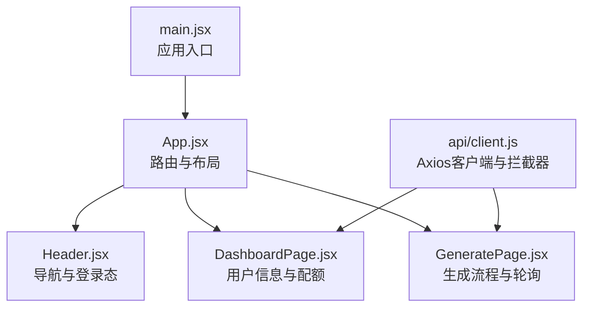
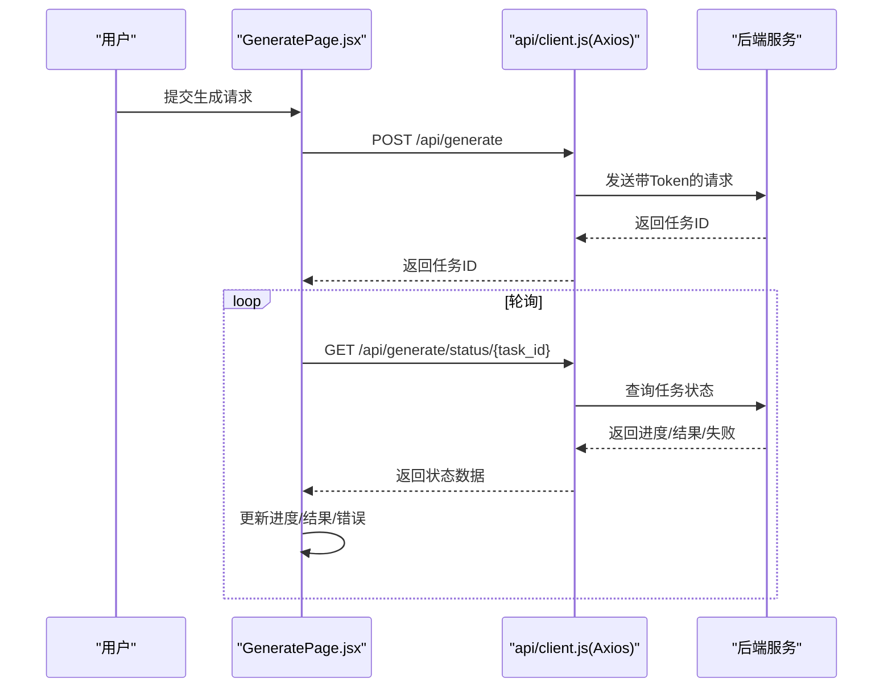
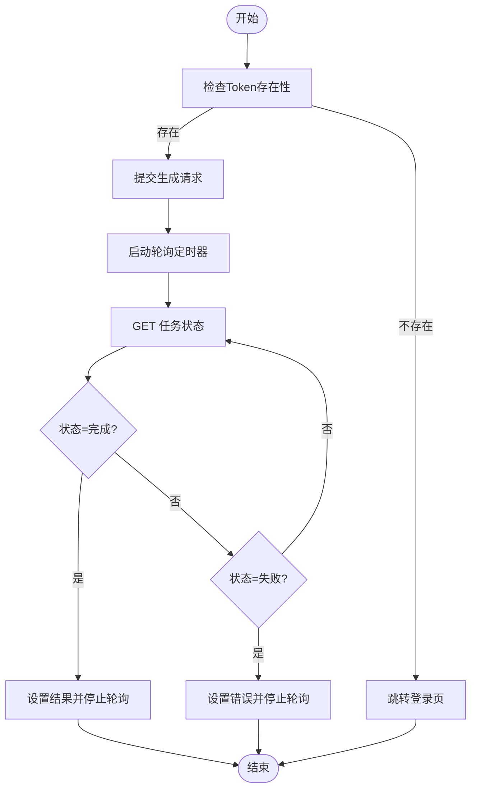
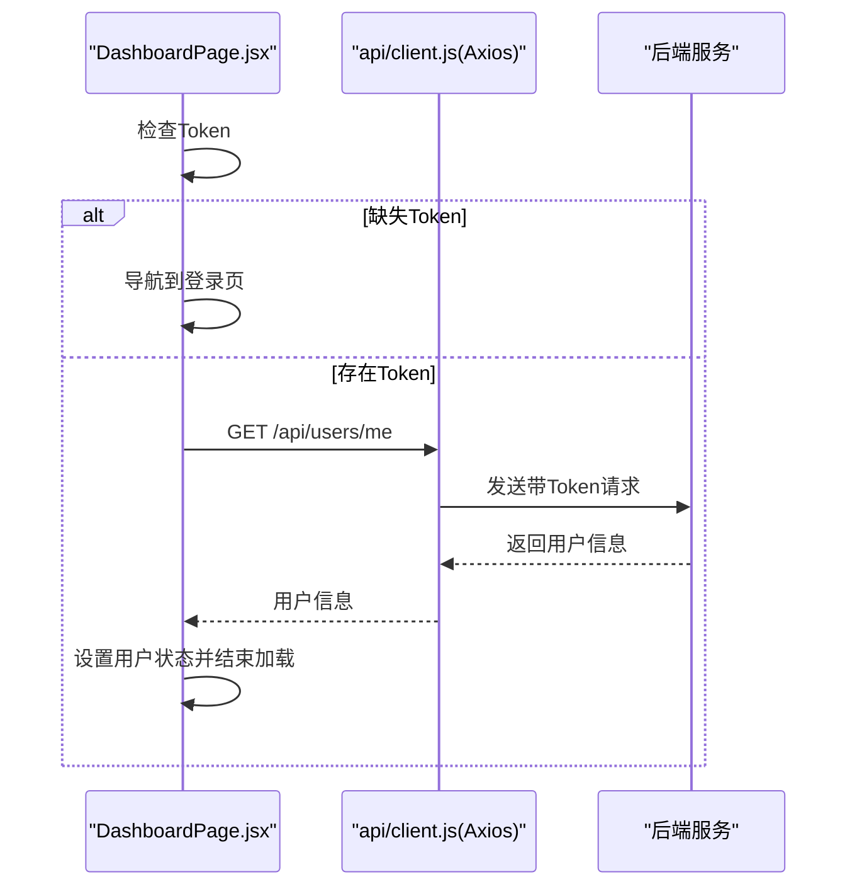
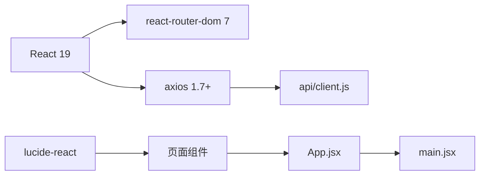

# 状态管理

<cite>
**本文引用的文件**
- [frontend/src/main.jsx](file://frontend/src/main.jsx)
- [frontend/src/App.jsx](file://frontend/src/App.jsx)
- [frontend/src/components/Header.jsx](file://frontend/src/components/Header.jsx)
- [frontend/src/pages/DashboardPage.jsx](file://frontend/src/pages/DashboardPage.jsx)
- [frontend/src/pages/GeneratePage.jsx](file://frontend/src/pages/GeneratePage.jsx)
- [frontend/src/api/client.js](file://frontend/src/api/client.js)
- [frontend/package.json](file://frontend/package.json)
</cite>

## 目录
1. [简介](#简介)
2. [项目结构](#项目结构)
3. [核心组件](#核心组件)
4. [架构总览](#架构总览)
5. [详细组件分析](#详细组件分析)
6. [依赖分析](#依赖分析)
7. [性能考虑](#性能考虑)
8. [故障排查指南](#故障排查指南)
9. [结论](#结论)
10. [附录](#附录)

## 简介
本文件聚焦于AI-PPT前端的状态管理现状与改进建议。当前仓库中的前端采用React函数式组件与受控表单，结合Axios拦截器实现基础的认证态与网络层状态处理；页面级状态以useState/ useEffect为主，未见集中式的全局状态库（如Zustand、Redux等）。本文从“应用状态组织结构、数据流向与更新机制”出发，系统梳理现有实现，并给出全局状态管理方案、本地状态处理、持久化存储、状态同步与一致性、订阅与变更通知、副作用处理、最佳实践、性能优化、内存管理、调试与时间旅行、迁移与备份、以及测试与质量保障建议。

## 项目结构
前端采用Vite构建，入口在main.jsx挂载BrowserRouter与App根组件；App负责路由分发至各页面；页面内通过React Hooks管理本地状态；API请求通过Axios实例封装并注入认证头与统一错误处理。

图表来源
- [frontend/src/main.jsx:1-12](file://frontend/src/main.jsx#L1-L12)
- [frontend/src/App.jsx:14-33](file://frontend/src/App.jsx#L14-L33)
- [frontend/src/components/Header.jsx:12-60](file://frontend/src/components/Header.jsx#L12-L60)
- [frontend/src/pages/DashboardPage.jsx:6-64](file://frontend/src/pages/DashboardPage.jsx#L6-L64)
- [frontend/src/pages/GeneratePage.jsx:6-132](file://frontend/src/pages/GeneratePage.jsx#L6-L132)
- [frontend/src/api/client.js:1-28](file://frontend/src/api/client.js#L1-L28)

章节来源
- [frontend/src/main.jsx:1-12](file://frontend/src/main.jsx#L1-L12)
- [frontend/src/App.jsx:14-33](file://frontend/src/App.jsx#L14-L33)
- [frontend/package.json:1-26](file://frontend/package.json#L1-L26)

## 核心组件
- 应用入口与路由
  - main.jsx使用BrowserRouter包裹App，确保路由能力可用。
  - App.jsx定义多页面路由，作为页面级状态容器的根节点。
- 页面级状态
  - DashboardPage.jsx：管理用户信息、加载状态、鉴权跳转。
  - GeneratePage.jsx：管理主题输入、生成状态、进度、结果与错误，配合轮询定时器。
- 全局网络与认证
  - api/client.js：Axios实例，自动注入Authorization头，统一处理401未授权并重定向到登录页。

章节来源
- [frontend/src/main.jsx:7-11](file://frontend/src/main.jsx#L7-L11)
- [frontend/src/App.jsx:19-29](file://frontend/src/App.jsx#L19-L29)
- [frontend/src/pages/DashboardPage.jsx:7-22](file://frontend/src/pages/DashboardPage.jsx#L7-L22)
- [frontend/src/pages/GeneratePage.jsx:7-17](file://frontend/src/pages/GeneratePage.jsx#L7-L17)
- [frontend/src/api/client.js:8-25](file://frontend/src/api/client.js#L8-L25)

## 架构总览
前端采用“页面级状态 + Axios拦截器”的轻量状态模型：页面组件负责UI状态与业务流程状态；Axios拦截器负责认证态与网络错误处理；localStorage用于令牌持久化。整体数据流为“用户交互 -> 组件状态更新 -> API调用 -> 响应处理 -> 状态回写”。

图表来源
- [frontend/src/pages/GeneratePage.jsx:19-68](file://frontend/src/pages/GeneratePage.jsx#L19-L68)
- [frontend/src/api/client.js:3-6](file://frontend/src/api/client.js#L3-L6)
- [frontend/src/api/client.js:16-25](file://frontend/src/api/client.js#L16-L25)

## 详细组件分析

### 生成页面（GeneratePage）状态流
- 输入与校验：受控输入框绑定主题，提交时进行非空校验。
- 请求与轮询：提交成功后启动定时器轮询任务状态，按状态更新进度或结果，异常时清理定时器并设置错误。
- 错误分支：429限流提示、网络异常兜底、失败状态处理。
- 清理策略：组件卸载时清理定时器，避免内存泄漏。

图表来源
- [frontend/src/pages/GeneratePage.jsx:19-68](file://frontend/src/pages/GeneratePage.jsx#L19-L68)

章节来源
- [frontend/src/pages/GeneratePage.jsx:7-132](file://frontend/src/pages/GeneratePage.jsx#L7-L132)

### 控制台页面（DashboardPage）状态流
- 鉴权与拉取：首次渲染检查Token，不存在则跳转登录；存在则调用用户信息接口，异常时移除Token并跳转登录。
- 加载与展示：加载期间显示加载动画，成功后展示用户信息与配额进度条。

图表来源
- [frontend/src/pages/DashboardPage.jsx:11-22](file://frontend/src/pages/DashboardPage.jsx#L11-L22)
- [frontend/src/api/client.js:8-25](file://frontend/src/api/client.js#L8-L25)

章节来源
- [frontend/src/pages/DashboardPage.jsx:6-64](file://frontend/src/pages/DashboardPage.jsx#L6-L64)

### 头部导航（Header）状态与路由联动
- 登录态：根据localStorage中的token决定显示“控制台”或“登录”按钮。
- 路由高亮：基于useLocation计算当前路径，动态切换导航项样式。
- 无全局状态：导航状态为纯视图态，不跨组件共享。

章节来源
- [frontend/src/components/Header.jsx:12-60](file://frontend/src/components/Header.jsx#L12-L60)

### API客户端（Axios拦截器）
- 请求拦截：自动附加Authorization头，提升用户体验与安全性。
- 响应拦截：统一处理401未授权，清除Token并跳转登录，避免重复逻辑散落各处。
- 超时配置：统一超时时间，平衡稳定性与响应速度。

章节来源
- [frontend/src/api/client.js:3-6](file://frontend/src/api/client.js#L3-L6)
- [frontend/src/api/client.js:8-25](file://frontend/src/api/client.js#L8-L25)

## 依赖分析
- React生态：React 19、react-router-dom 7、lucide-react图标库。
- 网络层：axios 1.7+，统一请求与响应处理。
- 构建工具：Vite 6，TailwindCSS、PostCSS、Autoprefixer。

图表来源
- [frontend/package.json:11-24](file://frontend/package.json#L11-L24)
- [frontend/src/api/client.js:1-28](file://frontend/src/api/client.js#L1-L28)

章节来源
- [frontend/package.json:1-26](file://frontend/package.json#L1-L26)

## 性能考虑
- 本地状态粒度控制
  - 将大对象拆分为细粒度状态，减少不必要的重渲染。
  - 使用useMemo/useCallback缓存昂贵计算与回调，避免重复渲染。
- 轮询与定时器
  - 在组件卸载时清理定时器，防止内存泄漏与无效请求。
  - 合理设置轮询间隔，避免频繁请求导致资源浪费。
- 网络层优化
  - 合理设置超时与重试策略，避免长时间阻塞UI线程。
  - 对高频请求进行去抖/节流处理。
- 图标与样式
  - lucide-react按需引入，避免打包冗余图标。
  - Tailwind类名复用，减少运行时样式计算开销。

## 故障排查指南
- 401未授权
  - 现象：登录后仍被重定向到登录页。
  - 排查：确认localStorage中token是否正确；检查请求头Authorization是否注入；确认后端签发与校验逻辑。
- 生成流程异常
  - 现象：提交后无进度或直接失败。
  - 排查：检查任务ID是否返回；轮询定时器是否启动与清理；后端任务状态接口是否稳定。
- 资源泄漏
  - 现象：页面切换后仍有定时器运行。
  - 排查：确认组件卸载时是否清理定时器；是否存在多个轮询实例。
- 路由与导航
  - 现象：导航高亮不生效或点击无反应。
  - 排查：确认路由配置与路径一致；检查useLocation使用是否正确。

章节来源
- [frontend/src/api/client.js:16-25](file://frontend/src/api/client.js#L16-L25)
- [frontend/src/pages/GeneratePage.jsx:15-17](file://frontend/src/pages/GeneratePage.jsx#L15-L17)

## 结论
当前前端采用“页面级状态 + Axios拦截器”的轻量方案，满足基础功能需求。若要支持更复杂的跨组件状态共享、历史回放与调试、强一致性的任务状态管理，建议引入集中式状态库（如Zustand），并配套持久化与中间件（如日志、撤销/重做）。同时完善单元测试与集成测试，确保状态变更可追踪、可验证、可回滚。

## 附录

### 全局状态管理方案（建议）
- 状态库选型
  - Zustand：轻量、易上手，适合中小型应用；支持中间件（日志、持久化、异步动作）。
  - Redux Toolkit：成熟生态，适合复杂状态与团队协作；需要额外学习成本。
- 认证与用户态
  - 将token与用户信息放入全局store；在请求拦截器中读取store状态，避免重复从localStorage读取。
- 任务与导出态
  - 将生成任务ID、进度、结果、错误统一纳入store；页面仅负责订阅与展示。
- 中间件与插件
  - 日志：记录Action与状态快照，便于问题定位。
  - 持久化：将关键状态序列化到localStorage或IndexedDB，刷新后恢复。
  - 异步：封装异步Action（如发起任务、轮询、下载），统一错误处理与重试。

### 本地状态与持久化
- 本地状态
  - 仅存放与当前页面/组件强相关且无需跨组件共享的状态（如表单输入、模态框开关）。
- 持久化策略
  - 关键态：token、用户偏好、最近任务ID。
  - 实现方式：localStorage（简单）、IndexedDB（大对象）、或状态库自带持久化中间件。
- 版本迁移
  - 为持久化数据添加版本号；升级时迁移旧字段，避免破坏性变更。

### 状态同步、冲突解决与一致性
- 同步策略
  - 事件驱动：通过状态库的订阅机制，组件自动响应状态变化。
  - 轮询降级：对实时性要求不高的场景，采用定时轮询并合并多次变更。
- 冲突解决
  - 幂等操作：确保重复提交不会产生副作用（如重复下载）。
  - 时间戳/版本号：对并发更新进行排序与覆盖控制。
- 一致性保证
  - 事务式更新：批量变更时一次性提交，避免部分更新。
  - 回滚策略：对不可逆操作提供撤销机制。

### 订阅、变更通知与副作用
- 订阅机制
  - 使用状态库的订阅API，按需监听关键字段；避免全量订阅导致的过度渲染。
- 变更通知
  - 通过中间件输出变更日志；在开发环境启用调试面板。
- 副作用处理
  - 将副作用（如网络请求、定时器、文件下载）封装为Action或Effect，集中管理生命周期。

### 调试、时间旅行与开发体验
- 调试工具
  - 浏览器扩展：React DevTools、Redux DevTools（如使用Redux）。
  - 状态快照：记录关键时间点的状态，便于回溯。
- 时间旅行调试
  - 通过中间件保存Action历史，支持回放与重放。
- 开发体验
  - 类型约束：为状态结构定义TypeScript类型，提升IDE提示与静态检查。
  - 分模块：按领域拆分状态模块，降低耦合。

### 迁移、版本兼容与备份
- 数据迁移
  - 升级时对旧字段进行映射与转换；提供降级策略。
- 版本兼容
  - 为持久化数据加入版本号；在读取时判断并迁移。
- 备份策略
  - 定期导出关键状态（如任务历史、偏好设置）；提供导入功能用于恢复。

### 测试与质量保证
- 单元测试
  - 对状态Reducer/Action进行纯函数测试；模拟副作用（如HTTP、定时器）。
- 集成测试
  - 端到端验证生成流程、登录态切换、错误处理与重试。
- 质量保障
  - ESLint/Prettier规范；TypeScript类型检查；覆盖率与回归测试。