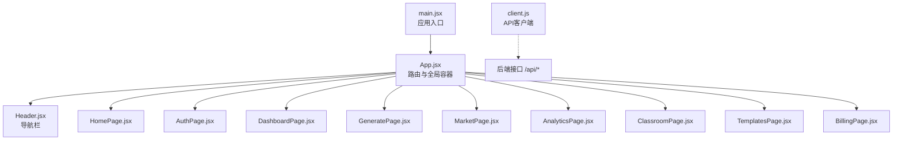
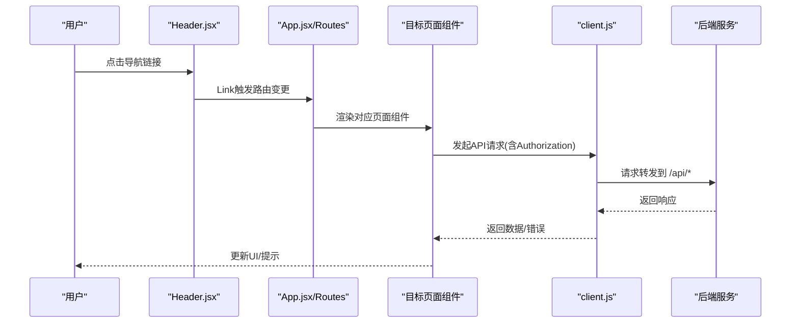
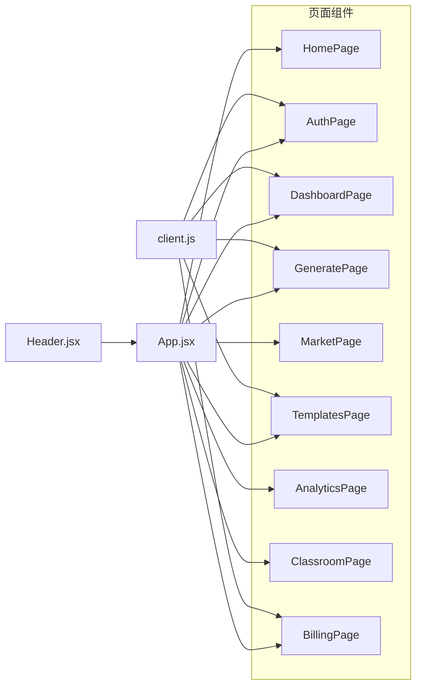

# 页面组件详解

<cite>
**本文引用的文件**
- [frontend/src/App.jsx](file://frontend/src/App.jsx)
- [frontend/src/main.jsx](file://frontend/src/main.jsx)
- [frontend/src/components/Header.jsx](file://frontend/src/components/Header.jsx)
- [frontend/src/api/client.js](file://frontend/src/api/client.js)
- [frontend/src/pages/HomePage.jsx](file://frontend/src/pages/HomePage.jsx)
- [frontend/src/pages/AuthPage.jsx](file://frontend/src/pages/AuthPage.jsx)
- [frontend/src/pages/DashboardPage.jsx](file://frontend/src/pages/DashboardPage.jsx)
- [frontend/src/pages/GeneratePage.jsx](file://frontend/src/pages/GeneratePage.jsx)
- [frontend/src/pages/MarketPage.jsx](file://frontend/src/pages/MarketPage.jsx)
- [frontend/src/pages/AnalyticsPage.jsx](file://frontend/src/pages/AnalyticsPage.jsx)
- [frontend/src/pages/ClassroomPage.jsx](file://frontend/src/pages/ClassroomPage.jsx)
- [frontend/src/pages/TemplatesPage.jsx](file://frontend/src/pages/TemplatesPage.jsx)
- [frontend/src/pages/BillingPage.jsx](file://frontend/src/pages/BillingPage.jsx)
- [frontend/package.json](file://frontend/package.json)
- [frontend/vite.config.js](file://frontend/vite.config.js)
- [frontend/tailwind.config.js](file://frontend/tailwind.config.js)
- [frontend/src/index.css](file://frontend/src/index.css)
</cite>

## 目录
1. [简介](#简介)
2. [项目结构](#项目结构)
3. [核心组件](#核心组件)
4. [架构总览](#架构总览)
5. [详细组件分析](#详细组件分析)
6. [依赖分析](#依赖分析)
7. [性能考虑](#性能考虑)
8. [故障排查指南](#故障排查指南)
9. [结论](#结论)
10. [附录](#附录)

## 简介
本文件面向AI-PPT前端页面组件，系统性梳理各页面组件的功能职责、UI设计与交互逻辑；阐明路由配置、参数传递与状态管理；解析页面间导航关系、数据共享与通信机制；给出页面加载优化、懒加载与性能监控建议；明确各页面组件的props定义、事件处理与回调；解释响应式布局与移动端适配；提供测试策略、错误处理与异常恢复机制，并附上最佳实践与参考路径。

## 项目结构
前端采用React + Vite + TailwindCSS技术栈，路由基于react-router-dom，API通过axios封装的client统一访问后端接口。应用入口在main.jsx中挂载BrowserRouter，根组件App集中声明路由与全局Header。

图表来源
- [frontend/src/main.jsx:1-12](file://frontend/src/main.jsx#L1-L12)
- [frontend/src/App.jsx:14-33](file://frontend/src/App.jsx#L14-L33)
- [frontend/src/components/Header.jsx:12-60](file://frontend/src/components/Header.jsx#L12-L60)
- [frontend/src/api/client.js:1-28](file://frontend/src/api/client.js#L1-L28)

章节来源
- [frontend/src/main.jsx:1-12](file://frontend/src/main.jsx#L1-L12)
- [frontend/src/App.jsx:14-33](file://frontend/src/App.jsx#L14-L33)
- [frontend/src/components/Header.jsx:12-60](file://frontend/src/components/Header.jsx#L12-L60)
- [frontend/src/api/client.js:1-28](file://frontend/src/api/client.js#L1-L28)

## 核心组件
- 应用入口与路由
  - 入口：main.jsx使用BrowserRouter包裹App，渲染根组件。
  - 根组件：App集中声明所有路由与全局容器，包含Header与主内容区域。
- 导航栏Header
  - 基于react-router的Link与useLocation高亮当前导航项。
  - 根据本地token显示登录/控制台按钮。
- API客户端client
  - 统一设置baseURL为“/api”，注入Authorization头。
  - 统一拦截401并跳转至登录页。

章节来源
- [frontend/src/main.jsx:7-11](file://frontend/src/main.jsx#L7-L11)
- [frontend/src/App.jsx:19-29](file://frontend/src/App.jsx#L19-L29)
- [frontend/src/components/Header.jsx:12-56](file://frontend/src/components/Header.jsx#L12-L56)
- [frontend/src/api/client.js:3-25](file://frontend/src/api/client.js#L3-L25)

## 架构总览
前端采用单页应用(SPA)架构，路由驱动页面切换；页面组件通过useNavigate/useLocation进行导航；API请求通过client.js统一封装，自动携带鉴权信息并处理未授权。

图表来源
- [frontend/src/components/Header.jsx:29-44](file://frontend/src/components/Header.jsx#L29-L44)
- [frontend/src/App.jsx:19-29](file://frontend/src/App.jsx#L19-L29)
- [frontend/src/api/client.js:8-25](file://frontend/src/api/client.js#L8-L25)

## 详细组件分析

### 首页 HomePage
- 功能职责
  - 展示产品亮点、统计数据、核心能力、三步生成流程与套餐对比。
- 用户界面设计
  - 使用渐变背景、卡片hover动效、统计卡片与特性卡片网格布局。
- 交互逻辑
  - 提供“开始生成PPT”和“进入系统”两个主要CTA，分别跳转至生成页与模板市场。
- 关键元素
  - HeroSection、StatsSection、FeaturesSection、HowItWorksSection、PricingSection。
- 参考路径
  - [frontend/src/pages/HomePage.jsx:17-54](file://frontend/src/pages/HomePage.jsx#L17-L54)
  - [frontend/src/pages/HomePage.jsx:56-73](file://frontend/src/pages/HomePage.jsx#L56-L73)
  - [frontend/src/pages/HomePage.jsx:75-99](file://frontend/src/pages/HomePage.jsx#L75-L99)
  - [frontend/src/pages/HomePage.jsx:101-123](file://frontend/src/pages/HomePage.jsx#L101-L123)
  - [frontend/src/pages/HomePage.jsx:125-156](file://frontend/src/pages/HomePage.jsx#L125-L156)

章节来源
- [frontend/src/pages/HomePage.jsx:5-15](file://frontend/src/pages/HomePage.jsx#L5-L15)

### 认证页 AuthPage
- 功能职责
  - 支持登录/注册切换，表单校验，调用后端/users/login与/users/register。
- 状态管理
  - 本地状态：isLogin、表单字段、错误信息、加载状态。
  - 本地存储：成功后写入token。
- 交互逻辑
  - 表单提交后根据模式选择接口，成功后跳转至/dashboard。
- 错误处理
  - 捕获后端错误并展示；保持表单可用。
- 参考路径
  - [frontend/src/pages/AuthPage.jsx:5-64](file://frontend/src/pages/AuthPage.jsx#L5-L64)

章节来源
- [frontend/src/pages/AuthPage.jsx:6-29](file://frontend/src/pages/AuthPage.jsx#L6-L29)

### 仪表盘 DashboardPage
- 功能职责
  - 展示用户信息、套餐与当日生成次数使用情况。
- 状态管理
  - 本地状态：user、loading。
  - 本地存储：token存在性决定是否允许访问。
- 交互逻辑
  - 无token则跳转登录；拉取用户信息失败则清除token并跳转登录。
- 参考路径
  - [frontend/src/pages/DashboardPage.jsx:6-64](file://frontend/src/pages/DashboardPage.jsx#L6-L64)

章节来源
- [frontend/src/pages/DashboardPage.jsx:11-22](file://frontend/src/pages/DashboardPage.jsx#L11-L22)

### 生成页 GeneratePage
- 功能职责
  - 输入主题，提交生成任务，轮询任务状态，展示结果与下载。
- 状态管理
  - 本地状态：topic、loading、result、error、progress。
  - 本地存储：token用于鉴权。
- 交互逻辑
  - 提交后启动轮询，按进度更新；完成后展示结果并提供下载链接。
- 错误处理
  - 429限流提示；状态查询失败提示；失败状态展示错误。
- 参考路径
  - [frontend/src/pages/GeneratePage.jsx:6-133](file://frontend/src/pages/GeneratePage.jsx#L6-L133)

章节来源
- [frontend/src/pages/GeneratePage.jsx:19-68](file://frontend/src/pages/GeneratePage.jsx#L19-L68)

### 模板市场 MarketPage
- 功能职责
  - 展示模板列表，支持搜索、预览与使用。
- 数据来源
  - 前端静态模板数组，后续应对接后端模板接口。
- 交互逻辑
  - 使用按钮跳转至生成页以使用模板。
- 参考路径
  - [frontend/src/pages/MarketPage.jsx:13-56](file://frontend/src/pages/MarketPage.jsx#L13-L56)

章节来源
- [frontend/src/pages/MarketPage.jsx:4-11](file://frontend/src/pages/MarketPage.jsx#L4-L11)

### 模板库 TemplatesPage
- 功能职责
  - 从后端拉取模板列表并展示，区分免费/Pro/学校版。
- 状态管理
  - 本地状态：templates、loading。
- 交互逻辑
  - 使用按钮跳转至生成页。
- 参考路径
  - [frontend/src/pages/TemplatesPage.jsx:6-52](file://frontend/src/pages/TemplatesPage.jsx#L6-L52)

章节来源
- [frontend/src/pages/TemplatesPage.jsx:11-15](file://frontend/src/pages/TemplatesPage.jsx#L11-L15)

### 数据分析 AnalyticsPage
- 功能职责
  - 展示关键指标卡片与最近生成记录。
- 数据来源
  - 前端静态数据，后续应对接后端统计接口。
- 参考路径
  - [frontend/src/pages/AnalyticsPage.jsx:18-72](file://frontend/src/pages/AnalyticsPage.jsx#L18-L72)

章节来源
- [frontend/src/pages/AnalyticsPage.jsx:4-16](file://frontend/src/pages/AnalyticsPage.jsx#L4-L16)

### AI课堂 ClassroomPage
- 功能职责
  - 展示AI课堂能力介绍与课程卡片。
- 数据来源
  - 前端静态数据，后续应对接后端课程接口。
- 参考路径
  - [frontend/src/pages/ClassroomPage.jsx:11-61](file://frontend/src/pages/ClassroomPage.jsx#L11-L61)

章节来源
- [frontend/src/pages/ClassroomPage.jsx:4-9](file://frontend/src/pages/ClassroomPage.jsx#L4-L9)

### 计费页 BillingPage
- 功能职责
  - 展示套餐列表与特性，点击购买跳转到支付流程。
- 交互逻辑
  - 处理免费计划跳转登录；其他计划调用后端创建支付会话并跳转收银台。
- 参考路径
  - [frontend/src/pages/BillingPage.jsx:46-105](file://frontend/src/pages/BillingPage.jsx#L46-L105)

章节来源
- [frontend/src/pages/BillingPage.jsx:49-65](file://frontend/src/pages/BillingPage.jsx#L49-L65)

## 依赖分析
- 路由与导航
  - App.jsx集中声明路由；Header.jsx提供导航项与当前页高亮。
- API依赖
  - 所有页面通过client.js发起请求，自动注入Authorization头。
- 样式与主题
  - TailwindCSS与自定义样式类实现响应式与动效。
- 外部依赖
  - React、react-router-dom、axios、lucide-react等。

图表来源
- [frontend/src/App.jsx:19-29](file://frontend/src/App.jsx#L19-L29)
- [frontend/src/components/Header.jsx:5-10](file://frontend/src/components/Header.jsx#L5-L10)
- [frontend/src/api/client.js:1-28](file://frontend/src/api/client.js#L1-L28)

章节来源
- [frontend/src/App.jsx:19-29](file://frontend/src/App.jsx#L19-L29)
- [frontend/src/components/Header.jsx:5-10](file://frontend/src/components/Header.jsx#L5-L10)
- [frontend/src/api/client.js:8-25](file://frontend/src/api/client.js#L8-L25)

## 性能考虑
- 页面加载优化
  - 使用骨架屏与占位符减少白屏时间（首页统计卡片、特性卡片网格布局已具备基础占位样式）。
  - 对于模板市场与模板库，建议在加载时显示占位卡片，避免闪烁。
- 懒加载实现
  - 将非首屏组件按需引入，例如将MarketPage、TemplatesPage等在路由命中时再动态导入。
- 性能监控
  - 在关键页面（如GeneratePage）增加埋点，记录任务提交、轮询间隔、下载完成等事件。
- 资源优化
  - 图标使用lucide-react，按需裁剪未使用的图标以减小包体积。
  - Tailwind按需扫描路径已在配置中声明，确保仅打包使用到的样式。

章节来源
- [frontend/src/pages/HomePage.jsx:56-73](file://frontend/src/pages/HomePage.jsx#L56-L73)
- [frontend/src/pages/MarketPage.jsx:27-53](file://frontend/src/pages/MarketPage.jsx#L27-L53)
- [frontend/src/pages/TemplatesPage.jsx:17](file://frontend/src/pages/TemplatesPage.jsx#L17)
- [frontend/package.json:11-24](file://frontend/package.json#L11-L24)
- [frontend/tailwind.config.js:2-6](file://frontend/tailwind.config.js#L2-L6)

## 故障排查指南
- 鉴权相关
  - 401未授权：client.js拦截器会清除token并跳转登录页。
  - 仪表盘与生成页在无token时主动跳转登录。
- 生成流程
  - 429限流：生成页对429进行专门提示，引导升级。
  - 轮询失败：捕获异常并提示查询失败。
- 计费流程
  - 401：BillingPage跳转登录；其他错误弹窗提示。
- 常见问题
  - 下载链接失效：确认后端download接口与文件名正确。
  - 模板列表为空：检查后端/templates接口返回格式。

章节来源
- [frontend/src/api/client.js:16-25](file://frontend/src/api/client.js#L16-L25)
- [frontend/src/pages/DashboardPage.jsx:11-22](file://frontend/src/pages/DashboardPage.jsx#L11-L22)
- [frontend/src/pages/GeneratePage.jsx:61-68](file://frontend/src/pages/GeneratePage.jsx#L61-L68)
- [frontend/src/pages/BillingPage.jsx:59-65](file://frontend/src/pages/BillingPage.jsx#L59-L65)

## 结论
本项目页面组件围绕“生成PPT”主线展开，配合认证、仪表盘、模板市场、计费等功能形成闭环。路由清晰、状态管理简洁、API封装统一。建议后续完善模板与统计接口的数据来源、增强错误提示与埋点监控，并对非首屏组件实施懒加载以提升性能。

## 附录

### 路由与参数传递
- 路由配置
  - App.jsx集中声明所有页面路由，包含首页、认证、仪表盘、生成、模板市场、数据分析、AI课堂、模板库、计费等。
- 参数传递
  - 当前页面间通过Link跳转，未见复杂参数传递；如需传参可扩展为useNavigate带state或URL参数。

章节来源
- [frontend/src/App.jsx:19-29](file://frontend/src/App.jsx#L19-L29)

### 状态管理与本地存储
- 本地状态
  - 各页面使用useState/useEffect管理自身状态（如AuthPage的表单、GeneratePage的任务轮询）。
- 本地存储
  - token存于localStorage，client.js自动注入Authorization头；401时清除token并跳转登录。

章节来源
- [frontend/src/pages/AuthPage.jsx:6-10](file://frontend/src/pages/AuthPage.jsx#L6-L10)
- [frontend/src/pages/GeneratePage.jsx:7-13](file://frontend/src/pages/GeneratePage.jsx#L7-L13)
- [frontend/src/api/client.js:8-25](file://frontend/src/api/client.js#L8-L25)

### 页面间导航与通信
- 导航关系
  - Header.jsx提供固定导航；首页提供多个CTA跳转至生成与市场。
- 通信机制
  - 通过路由跳转与本地存储token实现跨页面鉴权；模板库与模板市场通过跳转至生成页复用生成流程。

章节来源
- [frontend/src/components/Header.jsx:29-44](file://frontend/src/components/Header.jsx#L29-L44)
- [frontend/src/pages/HomePage.jsx:38-44](file://frontend/src/pages/HomePage.jsx#L38-L44)
- [frontend/src/pages/TemplatesPage.jsx:42-46](file://frontend/src/pages/TemplatesPage.jsx#L42-L46)

### props定义、事件处理与回调
- props定义
  - PricingCard、PricingCard、PricingCard等组件通过title、price、features、cta、ctaLink、featured等属性接收配置。
- 事件处理
  - 表单onSubmit、按钮onClick、输入onChange等常见事件在各页面中均有体现。
- 回调函数
  - useNavigate用于页面跳转；client.js拦截器作为全局回调处理401。

章节来源
- [frontend/src/pages/HomePage.jsx:158-177](file://frontend/src/pages/HomePage.jsx#L158-L177)
- [frontend/src/pages/AuthPage.jsx:37-59](file://frontend/src/pages/AuthPage.jsx#L37-L59)
- [frontend/src/pages/BillingPage.jsx:49-65](file://frontend/src/pages/BillingPage.jsx#L49-L65)

### 响应式布局与移动端适配
- 响应式断点
  - 使用Tailwind的md:、lg:等断点实现网格与布局自适应。
- 移动端适配
  - Header在小屏隐藏导航菜单，使用Link直达；页面内广泛使用flex与gap实现弹性布局。
- 动效与交互
  - 卡片hover动效、按钮渐变、加载动画等提升移动端体验。

章节来源
- [frontend/src/index.css:59-94](file://frontend/src/index.css#L59-L94)
- [frontend/src/components/Header.jsx:29-44](file://frontend/src/components/Header.jsx#L29-L44)
- [frontend/src/pages/HomePage.jsx:56-99](file://frontend/src/pages/HomePage.jsx#L56-L99)

### 测试策略
- 单元测试
  - 对页面组件的交互逻辑（如表单提交、轮询控制）编写测试用例。
- 集成测试
  - 模拟API响应与401场景，验证鉴权拦截与跳转逻辑。
- 端到端测试
  - 覆盖从登录到生成、下载的关键流程，确保链路稳定。

[本节为通用指导，不直接分析具体文件]

### 错误处理与异常恢复
- 统一错误处理
  - client.js拦截401并跳转登录；各页面对特定HTTP状态码（如429）进行针对性提示。
- 异常恢复
  - 生成页在轮询失败时清理定时器并提示；仪表盘在获取用户信息失败时清除token并跳转登录。

章节来源
- [frontend/src/api/client.js:16-25](file://frontend/src/api/client.js#L16-L25)
- [frontend/src/pages/GeneratePage.jsx:54-58](file://frontend/src/pages/GeneratePage.jsx#L54-L58)
- [frontend/src/pages/DashboardPage.jsx:18-21](file://frontend/src/pages/DashboardPage.jsx#L18-L21)

### 最佳实践
- 路由与导航
  - 将高频页面置于首屏，低频页面按需加载。
- 状态管理
  - 将跨页面共享的状态（如用户信息）集中于顶层组件或Context，避免重复请求。
- 性能
  - 对长列表使用虚拟滚动；对图片与图标资源进行压缩与懒加载。
- 安全
  - 严格校验后端返回数据结构；对敏感操作增加二次确认。

[本节为通用指导，不直接分析具体文件]