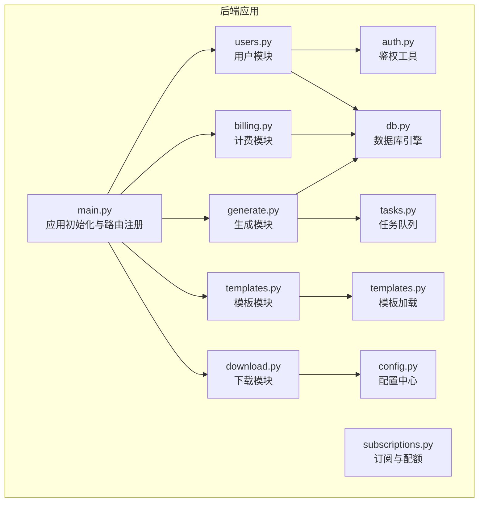
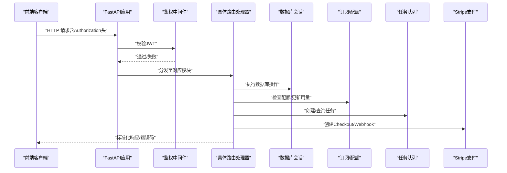
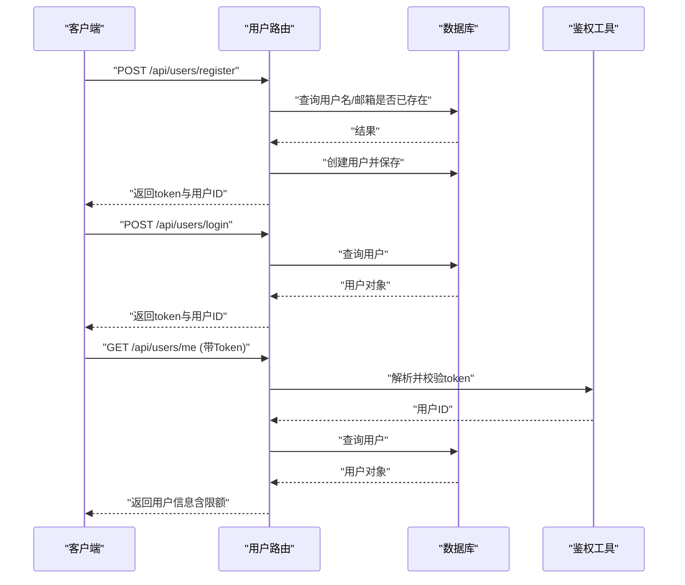
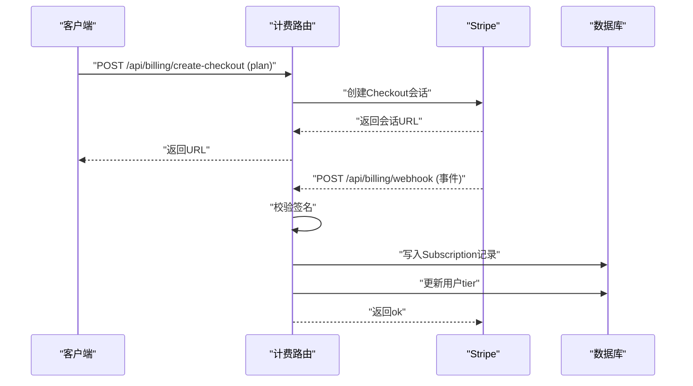
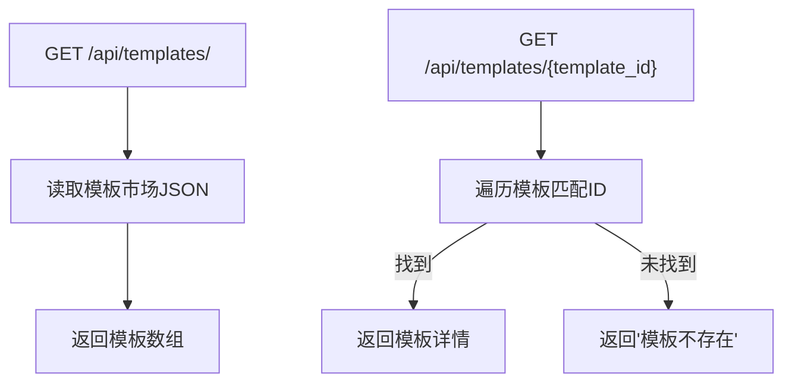
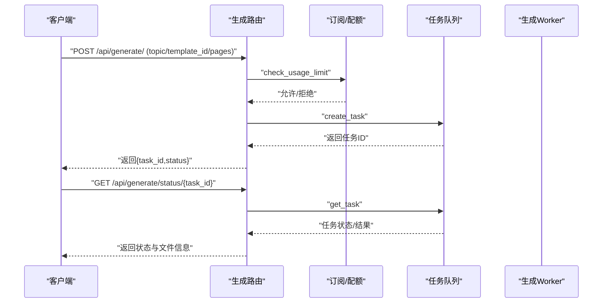
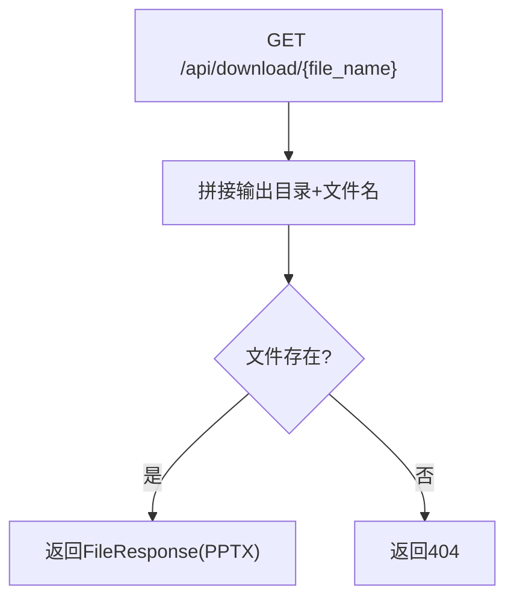
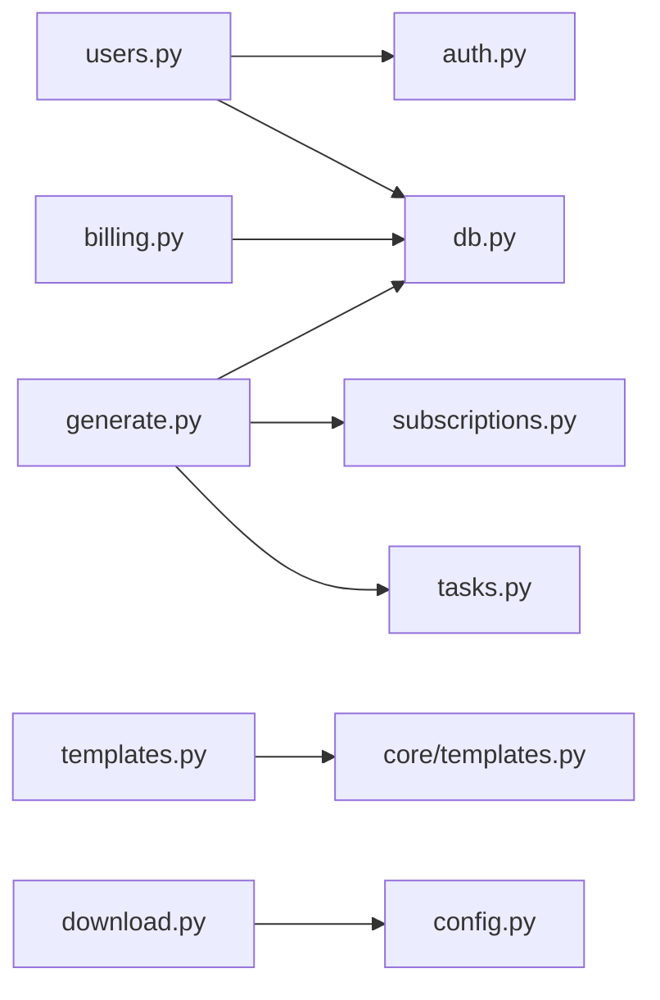

# API路由设计

<cite>
**本文引用的文件**
- [backend/main.py](file://backend/main.py)
- [backend/api/users.py](file://backend/api/users.py)
- [backend/api/billing.py](file://backend/api/billing.py)
- [backend/api/templates.py](file://backend/api/templates.py)
- [backend/api/generate.py](file://backend/api/generate.py)
- [backend/api/download.py](file://backend/api/download.py)
- [backend/core/auth.py](file://backend/core/auth.py)
- [backend/core/db.py](file://backend/core/db.py)
- [backend/core/subscriptions.py](file://backend/core/subscriptions.py)
- [backend/core/tasks.py](file://backend/core/tasks.py)
- [backend/core/templates.py](file://backend/core/templates.py)
- [backend/models/user.py](file://backend/models/user.py)
- [backend/models/ppt.py](file://backend/models/ppt.py)
- [backend/core/config.py](file://backend/core/config.py)
- [frontend/src/api/client.js](file://frontend/src/api/client.js)
</cite>

## 目录
1. [简介](#简介)
2. [项目结构](#项目结构)
3. [核心组件](#核心组件)
4. [架构总览](#架构总览)
5. [详细组件分析](#详细组件分析)
6. [依赖关系分析](#依赖关系分析)
7. [性能与可扩展性](#性能与可扩展性)
8. [故障排查指南](#故障排查指南)
9. [结论](#结论)
10. [附录：API使用示例与最佳实践](#附录api使用示例与最佳实践)

## 简介
本文件面向AI-PPT系统的API路由层，系统采用FastAPI构建，提供用户管理、计费订阅、模板市场、PPT生成与下载等能力。API遵循REST风格，统一使用HTTP方法与路径约定，结合JWT鉴权与数据库会话注入，确保请求校验、响应标准化与错误处理的一致性。本文档从架构、路由设计、数据流、错误处理到性能优化与最佳实践进行系统化说明。

## 项目结构
后端以模块化API Router组织功能域，主应用在启动时注册各模块路由，并统一挂载CORS中间件与静态资源。核心模块包括：
- 用户认证与授权：用户注册/登录、当前用户信息查询、JWT令牌签发与校验
- 计费订阅：创建Stripe Checkout会话、Webhook回调处理与订阅状态同步
- 模板市场：模板列表与详情读取
- 生成服务：提交生成任务、轮询任务状态
- 下载服务：基于文件名返回PPT文件

图表来源
- [backend/main.py:16-40](file://backend/main.py#L16-L40)
- [backend/api/users.py:11](file://backend/api/users.py#L11)
- [backend/api/billing.py:11](file://backend/api/billing.py#L11)
- [backend/api/templates.py:6](file://backend/api/templates.py#L6)
- [backend/api/generate.py:11](file://backend/api/generate.py#L11)
- [backend/api/download.py:6](file://backend/api/download.py#L6)
- [backend/core/auth.py:13](file://backend/core/auth.py#L13)
- [backend/core/subscriptions.py:10](file://backend/core/subscriptions.py#L10)
- [backend/core/tasks.py:5](file://backend/core/tasks.py#L5)
- [backend/core/templates.py:4](file://backend/core/templates.py#L4)
- [backend/core/config.py:4](file://backend/core/config.py#L4)
- [backend/core/db.py:1](file://backend/core/db.py#L1)

章节来源
- [backend/main.py:16-40](file://backend/main.py#L16-L40)

## 核心组件
- 应用入口与生命周期：通过lifespan在启动时初始化数据库；注册CORS与各模块路由；提供健康检查端点
- 路由前缀与标签：各模块以“/api/<domain>”命名空间组织，便于版本化与扩展
- 鉴权中间件：全局Bearer Token校验，未授权自动拒绝并返回401
- 数据库会话：每个请求注入异步会话，保证事务一致性与连接复用
- 配置中心：集中管理数据库、密钥、支付与输出目录等环境变量

章节来源
- [backend/main.py:10-40](file://backend/main.py#L10-L40)
- [backend/core/auth.py:47-57](file://backend/core/auth.py#L47-L57)
- [backend/core/db.py:13-27](file://backend/core/db.py#L13-L27)
- [backend/core/config.py:4-34](file://backend/core/config.py#L4-L34)

## 架构总览
下图展示API请求从客户端到后端处理链路，以及关键依赖关系：

图表来源
- [backend/main.py:22-34](file://backend/main.py#L22-L34)
- [backend/core/auth.py:47-57](file://backend/core/auth.py#L47-L57)
- [backend/api/generate.py:20-52](file://backend/api/generate.py#L20-L52)
- [backend/api/billing.py:14-80](file://backend/api/billing.py#L14-L80)
- [backend/core/subscriptions.py:46-58](file://backend/core/subscriptions.py#L46-L58)
- [backend/core/tasks.py:14-33](file://backend/core/tasks.py#L14-L33)

## 详细组件分析

### 用户管理模块（/api/users）
- 设计理念
  - 使用Pydantic模型定义注册/登录输入与用户响应模型，确保前后端数据契约一致
  - 注册时对用户名与邮箱唯一性进行校验，密码使用bcrypt哈希存储
  - 登录成功后签发JWT，包含过期时间与用户标识
  - “/me”接口返回用户等级、当日用量与限额，限额来自订阅等级映射
- 关键流程
  - 注册：接收用户名、邮箱、密码；查询重复；创建用户；保存；签发token
  - 登录：按用户名查询用户；校验密码；签发token
  - 查询当前用户：依赖鉴权中间件解析token，查询用户并组装响应
- 错误处理
  - 400：用户名/邮箱重复、无效密码
  - 401：用户名或密码错误
  - 404：用户不存在
- 安全要点
  - 密码哈希存储，不落库明文
  - JWT签名算法与密钥配置于配置中心
  - 所有受保护接口均需携带Authorization头

图表来源
- [backend/api/users.py:34-75](file://backend/api/users.py#L34-L75)
- [backend/core/auth.py:24-57](file://backend/core/auth.py#L24-L57)
- [backend/models/user.py:6-21](file://backend/models/user.py#L6-L21)

章节来源
- [backend/api/users.py:14-75](file://backend/api/users.py#L14-L75)
- [backend/core/auth.py:16-57](file://backend/core/auth.py#L16-L57)
- [backend/models/user.py:6-21](file://backend/models/user.py#L6-L21)

### 计费系统模块（/api/billing）
- 设计理念
  - 基于Stripe的订阅模式，支持月度/年度计划
  - 创建Checkout会话并返回跳转URL，前端引导用户完成支付
  - Webhook校验签名并处理事件，根据事件更新用户等级与订阅记录
- 关键流程
  - 创建Checkout：校验计划参数；调用Stripe创建会话；返回URL
  - Webhook：校验签名；处理“checkout.session.completed”事件；写入订阅记录；更新用户等级
- 错误处理
  - 400：签名无效、计划非法
  - 500：Stripe调用异常
- 安全要点
  - Stripe密钥与Webhook密钥配置于配置中心
  - Webhook必须严格校验签名

图表来源
- [backend/api/billing.py:14-80](file://backend/api/billing.py#L14-L80)
- [backend/core/config.py:18-23](file://backend/core/config.py#L18-L23)

章节来源
- [backend/api/billing.py:14-80](file://backend/api/billing.py#L14-L80)
- [backend/core/config.py:18-23](file://backend/core/config.py#L18-L23)

### 模板管理模块（/api/templates）
- 设计理念
  - 从模板市场JSON中读取模板列表与详情
  - 提供无鉴权的只读访问，便于前端渲染模板选择器
- 关键流程
  - 列表：读取模板市场JSON并返回
  - 详情：按ID匹配模板，不存在则返回错误提示
- 错误处理
  - 404：文件不存在（前端逻辑中）

图表来源
- [backend/api/templates.py:9-20](file://backend/api/templates.py#L9-L20)
- [backend/core/templates.py:7-20](file://backend/core/templates.py#L7-L20)

章节来源
- [backend/api/templates.py:9-20](file://backend/api/templates.py#L9-L20)
- [backend/core/templates.py:7-20](file://backend/core/templates.py#L7-L20)

### 生成服务模块（/api/generate）
- 设计理念
  - 异步任务驱动：提交生成请求后立即返回任务ID与初始状态
  - 通过任务状态轮询获取最终结果与下载链接
  - 集成订阅配额：每日生成次数上限由用户等级决定
- 关键流程
  - 提交生成：校验主题长度；检查配额；创建任务并返回任务ID
  - 查询状态：根据任务ID返回状态、文件信息、进度与错误
- 错误处理
  - 400：主题无效
  - 429：超出配额
  - 404：任务不存在
- 性能与可靠性
  - 任务存储在内存字典中，适合单实例部署；生产建议替换为Redis等持久化存储
  - 生成过程由独立worker异步执行，避免阻塞API

图表来源
- [backend/api/generate.py:20-52](file://backend/api/generate.py#L20-L52)
- [backend/core/subscriptions.py:46-58](file://backend/core/subscriptions.py#L46-L58)
- [backend/core/tasks.py:14-33](file://backend/core/tasks.py#L14-L33)

章节来源
- [backend/api/generate.py:14-52](file://backend/api/generate.py#L14-L52)
- [backend/core/subscriptions.py:42-58](file://backend/core/subscriptions.py#L42-L58)
- [backend/core/tasks.py:14-33](file://backend/core/tasks.py#L14-L33)

### 下载功能模块（/api/download）
- 设计理念
  - 基于文件名直接返回PPT文件，媒体类型设置为PPTX
  - 文件路径位于配置中心指定的输出目录
- 错误处理
  - 404：文件不存在

图表来源
- [backend/api/download.py:9-15](file://backend/api/download.py#L9-L15)
- [backend/core/config.py:25](file://backend/core/config.py#L25)

章节来源
- [backend/api/download.py:9-15](file://backend/api/download.py#L9-L15)
- [backend/core/config.py:25](file://backend/core/config.py#L25)

## 依赖关系分析
- 组件耦合
  - 各模块通过统一的依赖注入获取数据库会话，降低耦合度
  - 鉴权中间件集中处理Authorization头，路由层专注业务逻辑
  - 订阅模块与任务模块解耦，分别服务于配额控制与异步执行
- 外部依赖
  - Stripe用于支付；bcrypt/jwt用于安全；SQLAlchemy异步ORM用于数据持久化
- 可能的循环依赖
  - 当前结构清晰，未见循环导入；注意在路由中延迟导入可能的循环模块（如计费模块中的Stripe）

图表来源
- [backend/api/users.py:6-9](file://backend/api/users.py#L6-L9)
- [backend/api/generate.py:5-9](file://backend/api/generate.py#L5-L9)
- [backend/api/billing.py:3-9](file://backend/api/billing.py#L3-L9)
- [backend/api/templates.py:3](file://backend/api/templates.py#L3)
- [backend/api/download.py:4](file://backend/api/download.py#L4)
- [backend/core/auth.py:5-11](file://backend/core/auth.py#L5-L11)
- [backend/core/subscriptions.py:2-7](file://backend/core/subscriptions.py#L2-L7)
- [backend/core/tasks.py:3](file://backend/core/tasks.py#L3)
- [backend/core/templates.py:2](file://backend/core/templates.py#L2)
- [backend/core/config.py:25](file://backend/core/config.py#L25)

章节来源
- [backend/core/db.py:13-27](file://backend/core/db.py#L13-L27)
- [backend/core/auth.py:47-57](file://backend/core/auth.py#L47-L57)

## 性能与可扩展性
- 连接池与会话
  - 使用异步SQLAlchemy会话工厂，减少连接开销；建议在生产环境启用连接池参数优化
- 任务队列
  - 当前内存字典存储任务，适合开发测试；生产建议迁移到Redis或消息队列（如Celery），并拆分工作进程
- 缓存与限流
  - 可在路由层增加速率限制中间件，防止滥用
- 数据模型
  - 用户与订阅模型字段覆盖基础需求；如需追踪更细粒度的用量与行为，可在UsageRecord中扩展维度

[本节为通用指导，无需列出章节来源]

## 故障排查指南
- 401 未授权
  - 检查前端是否正确携带Authorization头；确认JWT密钥与算法配置；核对token是否过期
- 400 参数错误
  - 用户注册/登录：用户名/邮箱重复；计费：计划非法；生成：主题为空或过短
- 429 超出配额
  - 检查用户等级与当日用量；确认订阅状态与Webhook是否正确更新
- 404 任务/文件不存在
  - 确认任务ID有效；确认输出目录与文件名正确
- Stripe Webhook
  - 核对签名密钥与事件类型；检查回调地址与元数据字段

章节来源
- [backend/api/users.py:39-40](file://backend/api/users.py#L39-L40)
- [backend/api/billing.py:24-25](file://backend/api/billing.py#L24-L25)
- [backend/api/generate.py:31-32](file://backend/api/generate.py#L31-L32)
- [backend/api/generate.py:42](file://backend/api/generate.py#L42)
- [backend/api/download.py:12-13](file://backend/api/download.py#L12-L13)
- [backend/core/auth.py:42-44](file://backend/core/auth.py#L42-L44)

## 结论
该API路由系统以模块化与REST风格为核心，结合JWT鉴权、异步数据库与任务队列，实现了从用户管理到生成下载的完整闭环。通过明确的错误码与响应结构，提升了系统的可观测性与可维护性。建议在生产环境中完善任务持久化、速率限制与监控告警，并持续评估向后兼容与版本演进策略。

[本节为总结性内容，无需列出章节来源]

## 附录：API使用示例与最佳实践

### API版本控制与向后兼容
- 版本号位置：当前应用版本在根级健康检查中返回；建议在路由前缀中显式体现版本（如“/api/v3/users”）
- 兼容策略：新增字段采用可选；变更字段保持默认值；废弃字段保留但标记弃用并在未来版本移除
- 前向兼容：客户端应忽略未知字段；服务端对缺失字段使用默认值

章节来源
- [backend/main.py:37-40](file://backend/main.py#L37-L40)

### 请求验证与响应标准化
- 输入校验：使用Pydantic模型约束请求体字段类型与范围
- 响应格式：统一返回结构（如包含状态、数据或错误信息），便于前端统一处理
- 错误码：遵循HTTP语义（4xx客户端错误、5xx服务器错误）

章节来源
- [backend/api/users.py:14-32](file://backend/api/users.py#L14-L32)
- [backend/api/generate.py:14-18](file://backend/api/generate.py#L14-L18)

### 最佳实践清单
- 安全
  - 生产环境务必更换JWT密钥与算法；开启HTTPS与严格的CORS策略
  - 对敏感配置使用环境变量与密钥管理服务
- 性能
  - 将任务队列迁移至Redis/Celery；引入连接池与超时配置
  - 对热点接口增加缓存（如模板列表）
- 可观测性
  - 添加请求日志与错误追踪；暴露健康检查与指标端点
- 可靠性
  - 对外部依赖（Stripe）增加重试与熔断；对数据库操作使用事务封装

[本节为通用指导，无需列出章节来源]