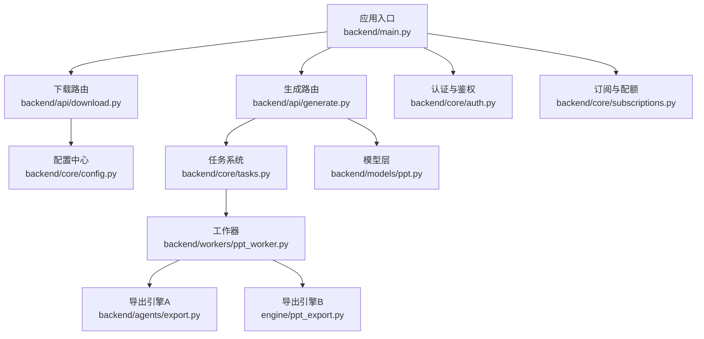
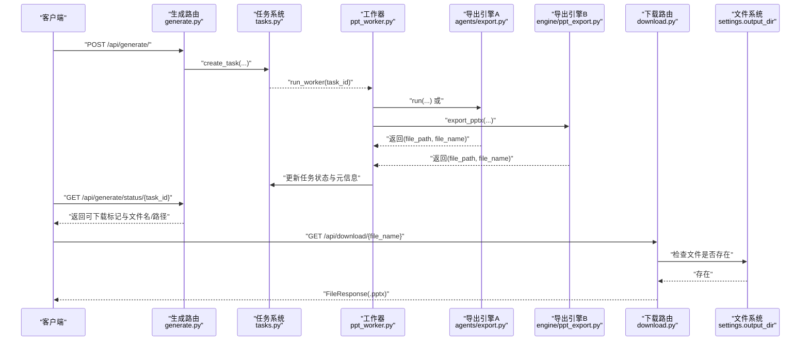
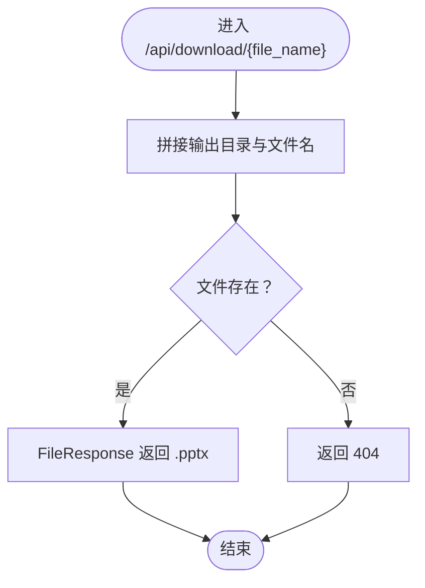
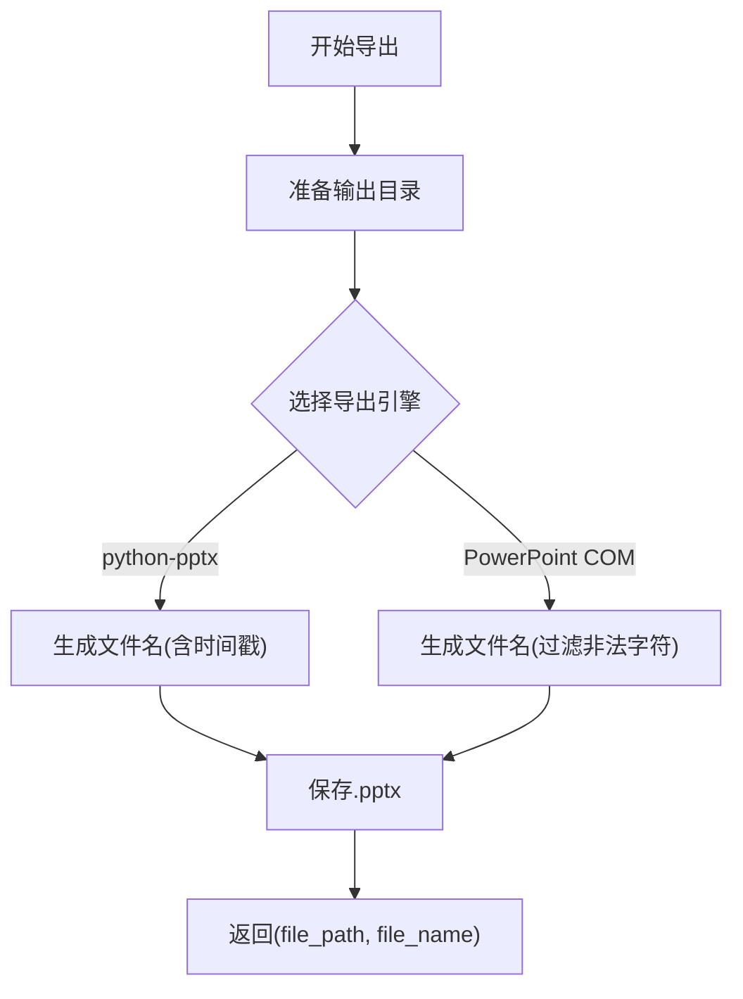
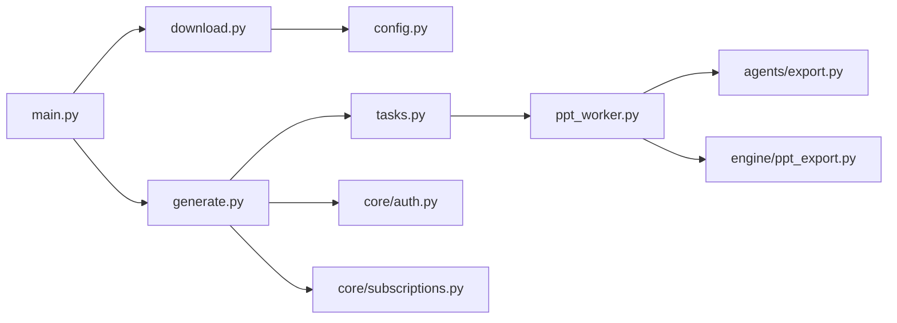

# 文件下载API

<cite>
**本文引用的文件**
- [backend/main.py](file://backend/main.py)
- [backend/api/download.py](file://backend/api/download.py)
- [backend/api/generate.py](file://backend/api/generate.py)
- [backend/workers/ppt_worker.py](file://backend/workers/ppt_worker.py)
- [backend/core/tasks.py](file://backend/core/tasks.py)
- [backend/core/config.py](file://backend/core/config.py)
- [backend/models/ppt.py](file://backend/models/ppt.py)
- [backend/agents/export.py](file://backend/agents/export.py)
- [engine/ppt_export.py](file://engine/ppt_export.py)
- [backend/core/auth.py](file://backend/core/auth.py)
- [backend/core/subscriptions.py](file://backend/core/subscriptions.py)
</cite>

## 目录
1. [简介](#简介)
2. [项目结构](#项目结构)
3. [核心组件](#核心组件)
4. [架构总览](#架构总览)
5. [详细组件分析](#详细组件分析)
6. [依赖分析](#依赖分析)
7. [性能考量](#性能考量)
8. [故障排查指南](#故障排查指南)
9. [结论](#结论)
10. [附录：下载API使用示例与最佳实践](#附录下载api使用示例与最佳实践)

## 简介
本文件下载API模块负责将后端生成的PPT文件通过HTTP接口安全地提供给用户下载。系统采用异步任务队列生成PPT，完成后在指定输出目录中存放文件，并通过下载路由提供下载能力。本文档将从架构、数据流、文件命名与存储、访问控制、下载链接与临时文件管理、过期清理策略、使用示例、性能优化、安全与防盗链、以及格式兼容性等方面进行系统化说明。

## 项目结构
与下载API直接相关的后端模块组织如下：
- 应用入口与路由挂载：在应用启动时注册下载路由与其他业务路由
- 下载路由：提供基于文件名的下载接口
- 生成与任务系统：异步生成PPT，维护任务状态，写入文件路径与名称
- 配置中心：集中管理输出目录等关键路径
- 模型层：持久化记录PPT生成结果（可选）
- 导出引擎：两种导出实现（基于第三方库与基于Windows PowerPoint COM）



图表来源
- [backend/main.py:16-34](file://backend/main.py#L16-L34)
- [backend/api/download.py:1-15](file://backend/api/download.py#L1-L15)
- [backend/api/generate.py:1-52](file://backend/api/generate.py#L1-L52)
- [backend/core/tasks.py:1-33](file://backend/core/tasks.py#L1-L33)
- [backend/workers/ppt_worker.py:1-24](file://backend/workers/ppt_worker.py#L1-L24)
- [backend/agents/export.py:1-65](file://backend/agents/export.py#L1-L65)
- [engine/ppt_export.py:1-257](file://engine/ppt_export.py#L1-L257)
- [backend/core/config.py:25-26](file://backend/core/config.py#L25-L26)
- [backend/models/ppt.py:1-18](file://backend/models/ppt.py#L1-L18)
- [backend/core/auth.py:47-57](file://backend/core/auth.py#L47-L57)
- [backend/core/subscriptions.py:46-58](file://backend/core/subscriptions.py#L46-L58)

章节来源
- [backend/main.py:16-34](file://backend/main.py#L16-L34)
- [backend/api/download.py:1-15](file://backend/api/download.py#L1-L15)
- [backend/api/generate.py:1-52](file://backend/api/generate.py#L1-L52)
- [backend/core/tasks.py:1-33](file://backend/core/tasks.py#L1-L33)
- [backend/workers/ppt_worker.py:1-24](file://backend/workers/ppt_worker.py#L1-L24)
- [backend/agents/export.py:1-65](file://backend/agents/export.py#L1-L65)
- [engine/ppt_export.py:1-257](file://engine/ppt_export.py#L1-L257)
- [backend/core/config.py:25-26](file://backend/core/config.py#L25-L26)
- [backend/models/ppt.py:1-18](file://backend/models/ppt.py#L1-L18)
- [backend/core/auth.py:47-57](file://backend/core/auth.py#L47-L57)
- [backend/core/subscriptions.py:46-58](file://backend/core/subscriptions.py#L46-L58)

## 核心组件
- 下载路由与响应
  - 路由前缀与标签：/api/download
  - GET /{file_name}：根据文件名拼接输出目录路径，校验文件存在性，返回FileResponse
  - 媒体类型：application/vnd.openxmlformats-officedocument.presentationml.presentation（.pptx）
- 生成与任务系统
  - 生成接口：POST /api/generate/ 创建异步任务，返回任务ID与初始状态
  - 状态查询：GET /api/generate/status/{task_id} 返回任务状态、文件名、文件路径、是否可下载等
  - 工作器：异步执行PPT生成，更新任务状态与文件元信息
- 配置中心
  - 输出目录：settings.output_dir
  - 上传目录：settings.upload_dir（用于其他用途）
- 导出引擎
  - 基于python-pptx的ExportAgent：生成带时间戳的文件名，保存到输出目录
  - 基于Windows PowerPoint COM的引擎：生成纯PPTX文件，清理临时图片与音频资源
- 认证与订阅
  - 生成接口需要登录态；按用户层级限制每日生成次数

章节来源
- [backend/api/download.py:1-15](file://backend/api/download.py#L1-L15)
- [backend/api/generate.py:1-52](file://backend/api/generate.py#L1-L52)
- [backend/workers/ppt_worker.py:1-24](file://backend/workers/ppt_worker.py#L1-L24)
- [backend/core/tasks.py:1-33](file://backend/core/tasks.py#L1-L33)
- [backend/core/config.py:25-26](file://backend/core/config.py#L25-L26)
- [backend/agents/export.py:1-65](file://backend/agents/export.py#L1-L65)
- [engine/ppt_export.py:245-256](file://engine/ppt_export.py#L245-L256)
- [backend/core/auth.py:47-57](file://backend/core/auth.py#L47-L57)
- [backend/core/subscriptions.py:46-58](file://backend/core/subscriptions.py#L46-L58)

## 架构总览
下图展示了从生成到下载的关键交互流程，包括任务调度、文件生成、状态更新与下载请求处理。



图表来源
- [backend/api/generate.py:20-51](file://backend/api/generate.py#L20-L51)
- [backend/core/tasks.py:8-28](file://backend/core/tasks.py#L8-L28)
- [backend/workers/ppt_worker.py:5-24](file://backend/workers/ppt_worker.py#L5-L24)
- [backend/agents/export.py:10-65](file://backend/agents/export.py#L10-L65)
- [engine/ppt_export.py:245-256](file://engine/ppt_export.py#L245-L256)
- [backend/api/download.py:9-14](file://backend/api/download.py#L9-L14)

## 详细组件分析

### 下载路由与文件响应
- 路由定义：/api/download/{file_name}
- 处理逻辑：
  - 将请求参数与配置中的输出目录拼接为绝对路径
  - 校验文件是否存在，不存在则抛出404
  - 使用FastAPI的FileResponse返回文件，设置Content-Disposition与媒体类型
- 安全要点：
  - 仅允许下载输出目录内的文件
  - 未做额外鉴权或来源校验（见“安全考虑”）



图表来源
- [backend/api/download.py:9-14](file://backend/api/download.py#L9-L14)
- [backend/core/config.py:25](file://backend/core/config.py#L25)

章节来源
- [backend/api/download.py:1-15](file://backend/api/download.py#L1-L15)
- [backend/core/config.py:25](file://backend/core/config.py#L25)

### 生成与任务系统
- 生成接口：
  - 参数：topic、template_id、pages
  - 校验：登录态、当日配额
  - 行为：创建任务并异步执行
- 任务状态：
  - 队列中 → 运行中 → 完成（写入file_path、file_name）或失败（记录错误）
- 状态查询接口：
  - 返回状态、文件名、文件路径、是否可下载、进度与错误信息

```mermaid
classDiagram
class GenerateRouter {
+post("/")
+get("/status/{task_id}")
}
class TaskSystem {
+create_task(...)
+get_task(id)
+run_worker(task_id)
}
class Worker {
+run_worker(task_id)
}
GenerateRouter --> TaskSystem : "创建/查询任务"
TaskSystem --> Worker : "调度执行"
```

图表来源
- [backend/api/generate.py:20-51](file://backend/api/generate.py#L20-L51)
- [backend/core/tasks.py:8-32](file://backend/core/tasks.py#L8-L32)
- [backend/workers/ppt_worker.py:5-24](file://backend/workers/ppt_worker.py#L5-L24)

章节来源
- [backend/api/generate.py:1-52](file://backend/api/generate.py#L1-L52)
- [backend/core/tasks.py:1-33](file://backend/core/tasks.py#L1-L33)
- [backend/workers/ppt_worker.py:1-24](file://backend/workers/ppt_worker.py#L1-L24)

### 导出引擎与文件命名
- 基于python-pptx的ExportAgent：
  - 输出目录：settings.output_dir
  - 文件命名：topic + 下划线 + 时间戳（秒级），扩展名为.pptx
  - 保存后返回(file_path, file_name)
- 基于Windows PowerPoint COM的引擎：
  - 输出目录：engine/ppt_export.py内常量指向项目根output目录
  - 文件命名：topic经字符过滤后截断，扩展名为.pptx
  - 保存后返回(file_path, file_name)，并清理临时图片与音频资源



图表来源
- [backend/agents/export.py:10-65](file://backend/agents/export.py#L10-L65)
- [engine/ppt_export.py:245-256](file://engine/ppt_export.py#L245-L256)

章节来源
- [backend/agents/export.py:1-65](file://backend/agents/export.py#L1-L65)
- [engine/ppt_export.py:1-257](file://engine/ppt_export.py#L1-L257)

### 存储路径管理与访问控制
- 存储路径：
  - 下载路由读取settings.output_dir作为根目录
  - 生成阶段将文件写入该目录
- 访问控制：
  - 下载路由未做鉴权或来源校验
  - 生成接口需登录态并通过订阅配额校验
- 建议改进：
  - 在下载路由增加鉴权与来源校验
  - 对外暴露的下载链接建议使用签名或一次性令牌

章节来源
- [backend/core/config.py:25-26](file://backend/core/config.py#L25-L26)
- [backend/api/download.py:11-14](file://backend/api/download.py#L11-L14)
- [backend/core/auth.py:47-57](file://backend/core/auth.py#L47-L57)
- [backend/core/subscriptions.py:46-58](file://backend/core/subscriptions.py#L46-L58)

### 下载链接生成机制与临时文件管理
- 链接生成：
  - 通过状态查询接口获得file_name与file_path
  - 前端以“/api/download/{file_name}”形式发起下载
- 临时文件管理：
  - PowerPoint COM导出会下载图片与音频到临时目录并在完成后清理
  - python-pptx导出不涉及外部临时资源
- 过期清理策略：
  - 当前未实现自动清理过期文件的机制
  - 建议引入定期扫描与删除策略（如保留最近N天）

章节来源
- [backend/api/generate.py:38-51](file://backend/api/generate.py#L38-L51)
- [engine/ppt_export.py:40-72](file://engine/ppt_export.py#L40-L72)
- [engine/ppt_export.py:229-236](file://engine/ppt_export.py#L229-L236)

### 文件传输优化与大文件处理
- 传输方式：
  - 使用FastAPI FileResponse进行流式传输
- 大文件建议：
  - 后端可结合分块传输或CDN
  - 前端可增加断点续传与进度条展示
  - 服务端可设置超时与并发限制

章节来源
- [backend/api/download.py:14](file://backend/api/download.py#L14)

### 安全考虑与防盗链机制
- 现状：
  - 下载路由未做鉴权与来源校验
  - 未对文件名进行严格白名单过滤
- 建议：
  - 引入JWT鉴权或一次性下载令牌
  - 限制文件名字符集与长度，避免路径穿越
  - 增加Referer校验或自定义Header校验
  - 对外暴露的URL加入随机标识与过期时间

章节来源
- [backend/api/download.py:9-14](file://backend/api/download.py#L9-L14)

### 文件格式支持与兼容性
- 默认格式：.pptx（Open XML Presentation）
- 媒体类型：application/vnd.openxmlformats-officedocument.presentationml.presentation
- 兼容性：
  - Windows PowerPoint、LibreOffice Impress、Google Slides均支持
  - 建议前端提示用户使用最新版本软件打开

章节来源
- [backend/api/download.py:14](file://backend/api/download.py#L14)

## 依赖分析
- 组件耦合：
  - 下载路由依赖配置中心提供的输出目录
  - 生成路由依赖任务系统与工作器
  - 工作器依赖具体导出引擎
- 外部依赖：
  - FastAPI（路由与响应）
  - SQLAlchemy（模型与数据库）
  - python-pptx（演示文稿生成）
  - Windows PowerPoint COM（可选，仅Windows）



图表来源
- [backend/api/download.py:1-15](file://backend/api/download.py#L1-L15)
- [backend/core/config.py:1-34](file://backend/core/config.py#L1-L34)
- [backend/api/generate.py:1-52](file://backend/api/generate.py#L1-L52)
- [backend/core/tasks.py:1-33](file://backend/core/tasks.py#L1-L33)
- [backend/workers/ppt_worker.py:1-24](file://backend/workers/ppt_worker.py#L1-L24)
- [backend/agents/export.py:1-65](file://backend/agents/export.py#L1-L65)
- [engine/ppt_export.py:1-257](file://engine/ppt_export.py#L1-L257)
- [backend/core/auth.py:1-57](file://backend/core/auth.py#L1-L57)
- [backend/core/subscriptions.py:1-58](file://backend/core/subscriptions.py#L1-L58)
- [backend/main.py:16-34](file://backend/main.py#L16-L34)

章节来源
- [backend/main.py:16-34](file://backend/main.py#L16-L34)
- [backend/api/download.py:1-15](file://backend/api/download.py#L1-L15)
- [backend/api/generate.py:1-52](file://backend/api/generate.py#L1-L52)
- [backend/core/tasks.py:1-33](file://backend/core/tasks.py#L1-L33)
- [backend/workers/ppt_worker.py:1-24](file://backend/workers/ppt_worker.py#L1-L24)
- [backend/agents/export.py:1-65](file://backend/agents/export.py#L1-L65)
- [engine/ppt_export.py:1-257](file://engine/ppt_export.py#L1-L257)
- [backend/core/config.py:1-34](file://backend/core/config.py#L1-L34)
- [backend/core/auth.py:1-57](file://backend/core/auth.py#L1-L57)
- [backend/core/subscriptions.py:1-58](file://backend/core/subscriptions.py#L1-L58)

## 性能考量
- 异步生成：通过任务队列与工作器异步执行，避免阻塞主线程
- 流式下载：FileResponse支持大文件分块传输
- 并发控制：建议在生产环境限制同时下载数量与超时时间
- 缓存策略：对于频繁访问的文件可引入CDN与缓存头

## 故障排查指南
- 404 文件不存在
  - 检查输出目录配置与文件名是否正确
  - 确认生成任务已完成且写入了file_name与file_path
- 401 无效令牌
  - 生成接口需要登录态，请确认携带正确的Authorization头
- 429 生成次数用尽
  - 用户当前层级的每日配额已用完，请升级或等待次日重置
- 导出异常
  - 查看工作器日志与任务error字段
  - 确认PowerPoint COM组件可用（Windows环境）

章节来源
- [backend/api/download.py:12-13](file://backend/api/download.py#L12-L13)
- [backend/core/auth.py:47-57](file://backend/core/auth.py#L47-L57)
- [backend/core/subscriptions.py:46-58](file://backend/core/subscriptions.py#L46-L58)
- [backend/workers/ppt_worker.py:20-23](file://backend/workers/ppt_worker.py#L20-L23)

## 结论
本下载API模块通过清晰的任务驱动与导出引擎，实现了PPT文件的生成与下载。当前设计简洁可靠，但在安全与可运维性方面仍有提升空间。建议尽快引入鉴权与来源校验、文件名白名单、临时资源清理与过期策略，并在生产环境配合CDN与限流措施，以保障稳定性与安全性。

## 附录：下载API使用示例与最佳实践
- 获取任务与状态
  - POST /api/generate/：提交生成请求，得到任务ID
  - GET /api/generate/status/{task_id}：轮询任务状态，直到可下载
- 下载文件
  - GET /api/download/{file_name}：下载对应文件
- 最佳实践
  - 生成前先调用状态接口确认可下载
  - 对外下载链接建议使用一次性令牌或签名URL
  - 大文件建议结合CDN与断点续传
  - 定期清理输出目录中的过期文件

章节来源
- [backend/api/generate.py:20-51](file://backend/api/generate.py#L20-L51)
- [backend/api/download.py:9-14](file://backend/api/download.py#L9-L14)