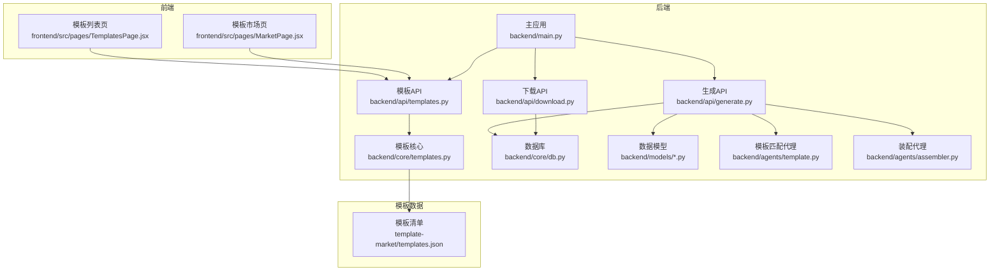
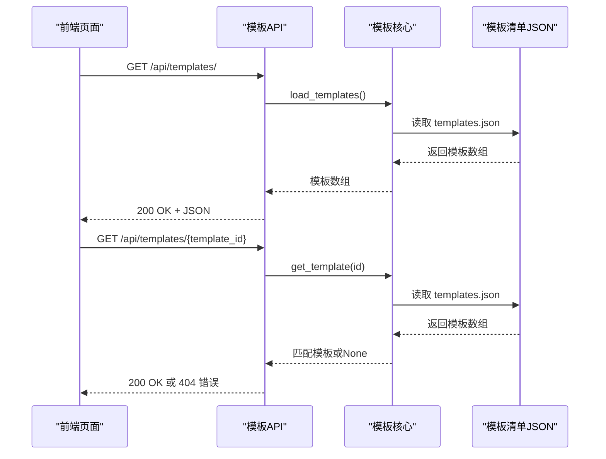
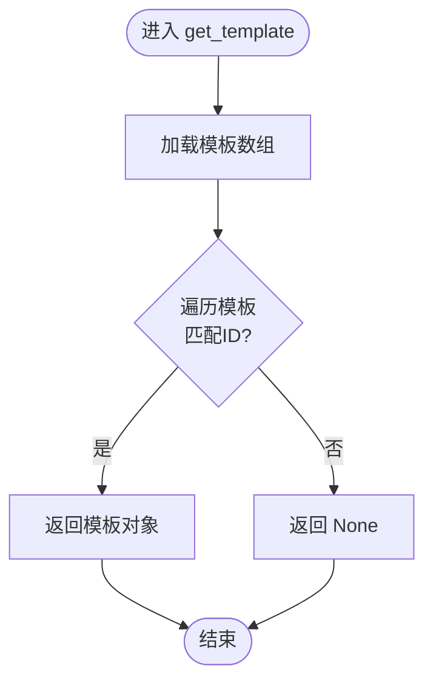
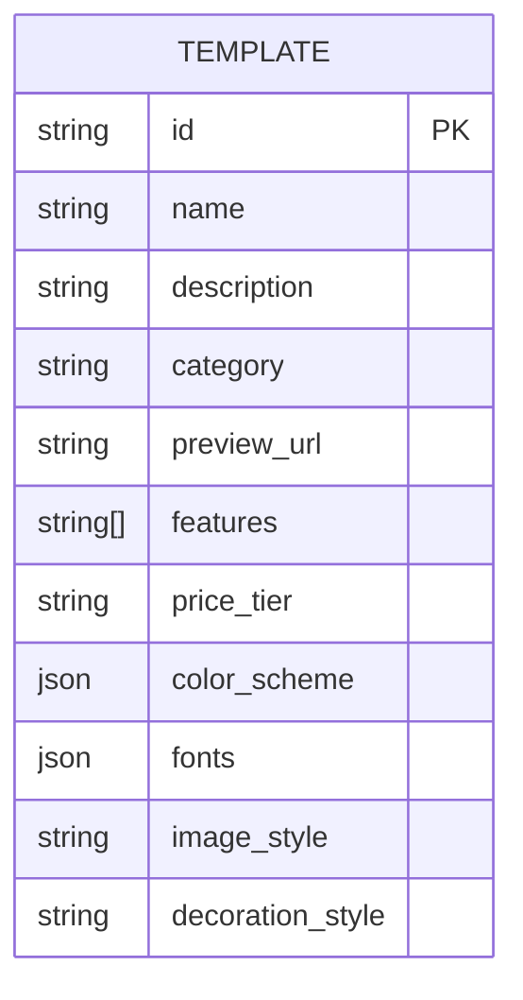
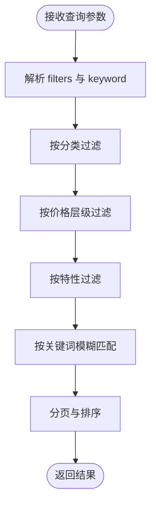
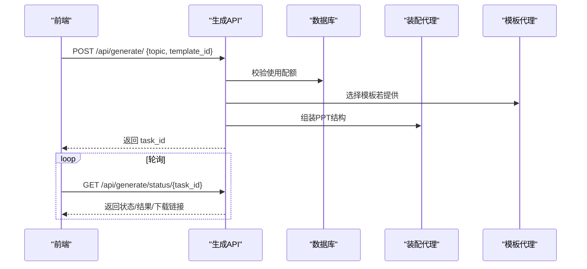
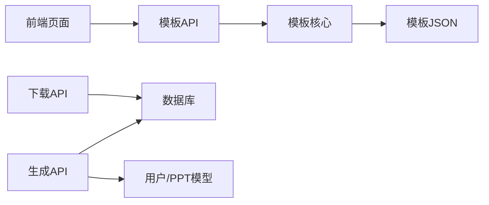

# 模板管理API

<cite>
**本文引用的文件**
- [backend/api/templates.py](file://backend/api/templates.py)
- [backend/core/templates.py](file://backend/core/templates.py)
- [template-market/templates.json](file://template-market/templates.json)
- [backend/main.py](file://backend/main.py)
- [frontend/src/pages/TemplatesPage.jsx](file://frontend/src/pages/TemplatesPage.jsx)
- [frontend/src/pages/MarketPage.jsx](file://frontend/src/pages/MarketPage.jsx)
- [backend/api/generate.py](file://backend/api/generate.py)
- [backend/api/download.py](file://backend/api/download.py)
- [backend/models/ppt.py](file://backend/models/ppt.py)
- [backend/models/user.py](file://backend/models/user.py)
- [backend/core/db.py](file://backend/core/db.py)
- [backend/agents/template.py](file://backend/agents/template.py)
- [backend/agents/assembler.py](file://backend/agents/assembler.py)
</cite>

## 目录
1. [简介](#简介)
2. [项目结构](#项目结构)
3. [核心组件](#核心组件)
4. [架构总览](#架构总览)
5. [详细组件分析](#详细组件分析)
6. [依赖分析](#依赖分析)
7. [性能考虑](#性能考虑)
8. [故障排查指南](#故障排查指南)
9. [结论](#结论)
10. [附录](#附录)

## 简介
本文件面向模板管理API模块，系统化梳理模板列表获取、模板详情查询与模板预览的实现机制；阐明模板分类体系、元数据管理与搜索能力；解释模板市场集成与下载流程；给出模板API使用示例（过滤、排序、分页）；说明模板数据结构设计与缓存策略；覆盖模板质量控制与版本管理建议；并讨论模板定制与个性化推荐的扩展方向。

## 项目结构
后端采用FastAPI框架，模板API位于独立路由下，模板数据来源于本地JSON文件；前端页面通过HTTP客户端调用模板API，并在生成完成后提供下载入口。核心模块包括：
- 路由层：模板API路由定义与注册
- 核心层：模板数据加载与查找逻辑
- 数据模型：用户与PPT记录的数据库表结构
- 生成与下载：基于任务队列的异步生成与文件下载
- 前端页面：模板市场展示与模板列表页

图表来源
- [backend/main.py:16-35](file://backend/main.py#L16-L35)
- [backend/api/templates.py:1-20](file://backend/api/templates.py#L1-L20)
- [backend/core/templates.py:1-20](file://backend/core/templates.py#L1-L20)
- [template-market/templates.json:1-55](file://template-market/templates.json#L1-L55)
- [backend/api/generate.py:1-52](file://backend/api/generate.py#L1-L52)
- [backend/api/download.py:1-15](file://backend/api/download.py#L1-L15)
- [backend/models/ppt.py:1-18](file://backend/models/ppt.py#L1-L18)
- [backend/models/user.py:1-21](file://backend/models/user.py#L1-L21)
- [backend/core/db.py:1-27](file://backend/core/db.py#L1-L27)
- [backend/agents/template.py:1-33](file://backend/agents/template.py#L1-L33)
- [backend/agents/assembler.py:1-89](file://backend/agents/assembler.py#L1-L89)
- [frontend/src/pages/TemplatesPage.jsx:1-53](file://frontend/src/pages/TemplatesPage.jsx#L1-L53)
- [frontend/src/pages/MarketPage.jsx:1-57](file://frontend/src/pages/MarketPage.jsx#L1-L57)

章节来源
- [backend/main.py:16-35](file://backend/main.py#L16-L35)
- [backend/api/templates.py:1-20](file://backend/api/templates.py#L1-L20)
- [backend/core/templates.py:1-20](file://backend/core/templates.py#L1-L20)
- [template-market/templates.json:1-55](file://template-market/templates.json#L1-L55)
- [frontend/src/pages/TemplatesPage.jsx:1-53](file://frontend/src/pages/TemplatesPage.jsx#L1-L53)
- [frontend/src/pages/MarketPage.jsx:1-57](file://frontend/src/pages/MarketPage.jsx#L1-L57)

## 核心组件
- 模板API路由：提供模板列表与详情接口，绑定到统一前缀路径
- 模板核心：从模板市场JSON文件读取模板清单，按ID检索模板
- 模板数据模型：模板清单JSON中包含ID、名称、描述、分类、预览URL、特性标签、价格层级、配色方案、字体、图像风格、装饰风格等字段
- 生成与下载：生成请求校验、任务创建、状态轮询、结果下载
- 前端页面：模板列表页直接拉取模板清单；模板市场页为占位展示（可替换为真实模板市场）

章节来源
- [backend/api/templates.py:9-20](file://backend/api/templates.py#L9-L20)
- [backend/core/templates.py:7-20](file://backend/core/templates.py#L7-L20)
- [template-market/templates.json:1-55](file://template-market/templates.json#L1-L55)
- [backend/api/generate.py:20-52](file://backend/api/generate.py#L20-L52)
- [backend/api/download.py:9-15](file://backend/api/download.py#L9-L15)
- [frontend/src/pages/TemplatesPage.jsx:11-15](file://frontend/src/pages/TemplatesPage.jsx#L11-L15)

## 架构总览
模板管理API采用“路由-核心-数据源”三层结构：
- 路由层负责HTTP协议与参数解析
- 核心层负责模板数据访问与简单业务逻辑
- 数据源为本地JSON文件，便于快速迭代与离线部署

图表来源
- [backend/api/templates.py:9-20](file://backend/api/templates.py#L9-L20)
- [backend/core/templates.py:7-20](file://backend/core/templates.py#L7-L20)
- [template-market/templates.json:1-55](file://template-market/templates.json#L1-L55)

## 详细组件分析

### 组件A：模板API与核心逻辑
- 接口职责
  - 列表接口：返回模板清单
  - 详情接口：根据ID返回单个模板，未找到时返回错误
- 实现要点
  - 列表：直接读取模板JSON
  - 详情：遍历模板数组进行ID匹配
- 性能与扩展
  - 当前为O(n)匹配，n为模板数量；如需高性能可引入内存缓存与索引
  - 支持分页与排序可通过核心层封装实现

图表来源
- [backend/core/templates.py:15-20](file://backend/core/templates.py#L15-L20)

章节来源
- [backend/api/templates.py:9-20](file://backend/api/templates.py#L9-L20)
- [backend/core/templates.py:7-20](file://backend/core/templates.py#L7-L20)

### 组件B：模板数据结构与分类系统
- 数据结构
  - 必填字段：id、name、description、category
  - 可选字段：preview_url、features、price_tier、color_scheme、fonts、image_style、decoration_style
- 分类与特性
  - category用于模板分类（如education、business）
  - features用于标注模板能力（如teacher_guide、animation、image_gen、music、voiceover）
- 元数据管理
  - 以JSON集中管理，便于版本化与发布
  - 可扩展字段（如评分、销量、作者）建议在后续版本加入

图表来源
- [template-market/templates.json:1-55](file://template-market/templates.json#L1-L55)

章节来源
- [template-market/templates.json:1-55](file://template-market/templates.json#L1-L55)

### 组件C：模板搜索与过滤（当前实现与扩展建议）
- 当前实现
  - 列表接口未内置搜索/过滤参数
- 扩展建议
  - 新增查询参数：category、price_tier、feature、keyword
  - 在核心层增加过滤函数，支持多条件组合
  - 对模板数组进行二次处理，返回筛选后的结果

图表来源
- [backend/api/templates.py:9-20](file://backend/api/templates.py#L9-L20)
- [backend/core/templates.py:7-20](file://backend/core/templates.py#L7-L20)

章节来源
- [backend/api/templates.py:9-20](file://backend/api/templates.py#L9-L20)
- [backend/core/templates.py:7-20](file://backend/core/templates.py#L7-L20)

### 组件D：模板预览与市场集成
- 预览URL
  - 模板JSON中提供preview_url字段，前端可直接渲染缩略图
- 市场集成
  - 前端模板市场页目前为静态占位；可替换为调用后端模板API并渲染真实模板
  - 下载按钮可结合生成与下载API完成“使用模板”的闭环

章节来源
- [template-market/templates.json:6-13](file://template-market/templates.json#L6-L13)
- [frontend/src/pages/MarketPage.jsx:13-56](file://frontend/src/pages/MarketPage.jsx#L13-L56)

### 组件E：模板选择与生成流程
- 模板选择
  - 前端模板列表页展示模板卡片，点击“使用此模板”跳转生成页
- 生成流程
  - 生成API接收topic与可选template_id，校验使用配额后创建任务
  - 前端轮询任务状态，完成后提供下载

图表来源
- [frontend/src/pages/TemplatesPage.jsx:42-46](file://frontend/src/pages/TemplatesPage.jsx#L42-L46)
- [backend/api/generate.py:20-52](file://backend/api/generate.py#L20-L52)
- [backend/agents/template.py:7-33](file://backend/agents/template.py#L7-L33)
- [backend/agents/assembler.py:16-89](file://backend/agents/assembler.py#L16-L89)

章节来源
- [frontend/src/pages/TemplatesPage.jsx:11-15](file://frontend/src/pages/TemplatesPage.jsx#L11-L15)
- [backend/api/generate.py:20-52](file://backend/api/generate.py#L20-L52)
- [backend/agents/template.py:7-33](file://backend/agents/template.py#L7-L33)
- [backend/agents/assembler.py:16-89](file://backend/agents/assembler.py#L16-L89)

### 组件F：模板下载机制
- 下载API
  - 根据文件名定位输出目录中的PPTX文件并返回下载响应
- 与生成流程衔接
  - 生成完成后，任务状态变为完成，前端可触发下载

章节来源
- [backend/api/download.py:9-15](file://backend/api/download.py#L9-L15)
- [backend/api/generate.py:38-52](file://backend/api/generate.py#L38-L52)

## 依赖分析
- 模块耦合
  - 模板API依赖模板核心；模板核心依赖模板JSON文件
  - 生成API依赖数据库、用户模型、订阅限制与任务系统
  - 前端页面依赖模板API
- 外部依赖
  - FastAPI、SQLAlchemy异步ORM、静态文件服务

图表来源
- [backend/api/templates.py:1-20](file://backend/api/templates.py#L1-L20)
- [backend/core/templates.py:1-20](file://backend/core/templates.py#L1-L20)
- [template-market/templates.json:1-55](file://template-market/templates.json#L1-L55)
- [backend/api/generate.py:1-52](file://backend/api/generate.py#L1-L52)
- [backend/api/download.py:1-15](file://backend/api/download.py#L1-L15)
- [backend/models/ppt.py:1-18](file://backend/models/ppt.py#L1-L18)
- [backend/models/user.py:1-21](file://backend/models/user.py#L1-L21)
- [backend/core/db.py:1-27](file://backend/core/db.py#L1-L27)
- [frontend/src/pages/TemplatesPage.jsx:1-53](file://frontend/src/pages/TemplatesPage.jsx#L1-L53)

章节来源
- [backend/api/templates.py:1-20](file://backend/api/templates.py#L1-L20)
- [backend/core/templates.py:1-20](file://backend/core/templates.py#L1-L20)
- [template-market/templates.json:1-55](file://template-market/templates.json#L1-L55)
- [backend/api/generate.py:1-52](file://backend/api/generate.py#L1-L52)
- [backend/api/download.py:1-15](file://backend/api/download.py#L1-L15)
- [backend/models/ppt.py:1-18](file://backend/models/ppt.py#L1-L18)
- [backend/models/user.py:1-21](file://backend/models/user.py#L1-L21)
- [backend/core/db.py:1-27](file://backend/core/db.py#L1-L27)
- [frontend/src/pages/TemplatesPage.jsx:1-53](file://frontend/src/pages/TemplatesPage.jsx#L1-L53)

## 性能考虑
- 模板列表读取
  - 当前每次请求均读取JSON文件，建议引入内存缓存与ETag/Last-Modified头，减少IO与带宽消耗
- 模板详情匹配
  - 当前为线性扫描，建议在核心层维护字典索引（按ID），将查找复杂度降为O(1)
- 搜索与过滤
  - 建议在核心层实现增量过滤器，避免前端重复处理
- 并发与限流
  - 生成API应结合用户等级与配额限制，防止资源滥用

## 故障排查指南
- 模板未找到
  - 检查模板ID是否正确；确认模板JSON中是否存在该ID
- 文件下载失败
  - 确认任务状态已完成且文件存在于输出目录；检查文件名与路径拼接逻辑
- 生成配额不足
  - 用户当日生成次数已达上限，需升级或等待重置
- CORS问题
  - 后端已启用CORS中间件，确保前端域名与请求头配置正确

章节来源
- [backend/api/templates.py:17-19](file://backend/api/templates.py#L17-L19)
- [backend/api/download.py:11-14](file://backend/api/download.py#L11-L14)
- [backend/api/generate.py:26-29](file://backend/api/generate.py#L26-L29)
- [backend/main.py:22-28](file://backend/main.py#L22-L28)

## 结论
模板管理API以简洁的JSON数据源为核心，提供了模板列表与详情的基础能力；结合生成与下载API，形成从模板浏览到PPT产出的完整链路。当前实现具备良好的可扩展性，可在不破坏现有结构的前提下引入搜索过滤、缓存优化、质量控制与个性化推荐等高级能力。

## 附录

### 模板API使用示例（路径参考）
- 获取模板列表
  - 请求：GET /api/templates/
  - 响应：模板数组
  - 参考：[backend/api/templates.py:9-11](file://backend/api/templates.py#L9-L11)
- 获取模板详情
  - 请求：GET /api/templates/{template_id}
  - 响应：模板对象或错误
  - 参考：[backend/api/templates.py:14-19](file://backend/api/templates.py#L14-L19)
- 生成PPT（可选指定模板）
  - 请求：POST /api/generate/ {topic, template_id?}
  - 响应：task_id
  - 参考：[backend/api/generate.py:20-35](file://backend/api/generate.py#L20-L35)
- 查询生成状态
  - 请求：GET /api/generate/status/{task_id}
  - 响应：状态、文件信息、下载标记
  - 参考：[backend/api/generate.py:38-51](file://backend/api/generate.py#L38-L51)
- 下载PPT
  - 请求：GET /api/download/{file_name}
  - 响应：文件流
  - 参考：[backend/api/download.py:9-14](file://backend/api/download.py#L9-L14)

### 模板数据结构字段说明
- id：模板唯一标识
- name：模板名称
- description：模板描述
- category：分类（如education、business）
- preview_url：预览图URL
- features：特性标签数组
- price_tier：价格层级（free/pro/school）
- color_scheme：主色、辅色、强调色、背景、文字
- fonts：标题与正文字体
- image_style：图像风格
- decoration_style：装饰风格

章节来源
- [template-market/templates.json:1-55](file://template-market/templates.json#L1-L55)

### 缓存策略建议
- 内存缓存
  - 在模板核心层缓存模板数组与按ID的映射表，设置TTL与失效策略
- 响应缓存
  - 对模板列表接口添加ETag/Cache-Control头，利用浏览器与反向代理缓存
- 渐进式更新
  - 提供模板清单变更通知或版本号字段，驱动客户端刷新

### 质量控制与版本管理
- 质量控制
  - 引入模板审核流程（人工/自动），对features、image_style、decoration_style进行合规性检查
- 版本管理
  - 在模板JSON中增加version字段，支持灰度发布与回滚
  - 生成API可记录使用的模板版本，便于统计与优化

### 个性化推荐（扩展建议）
- 用户画像
  - 基于用户历史使用模板、学科偏好、价格层级等构建画像
- 推荐算法
  - 协同过滤或基于内容的相似度计算，优先展示高分模板
- 展示策略
  - 在模板列表页顶部增加“为你推荐”区域，动态排序