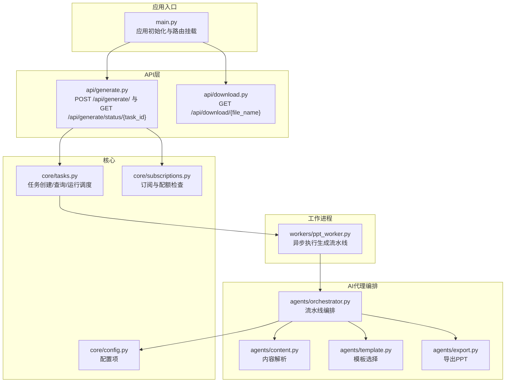
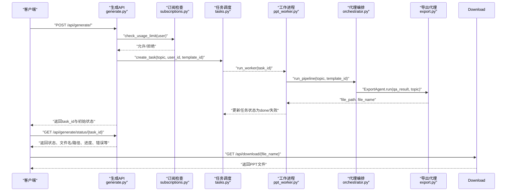
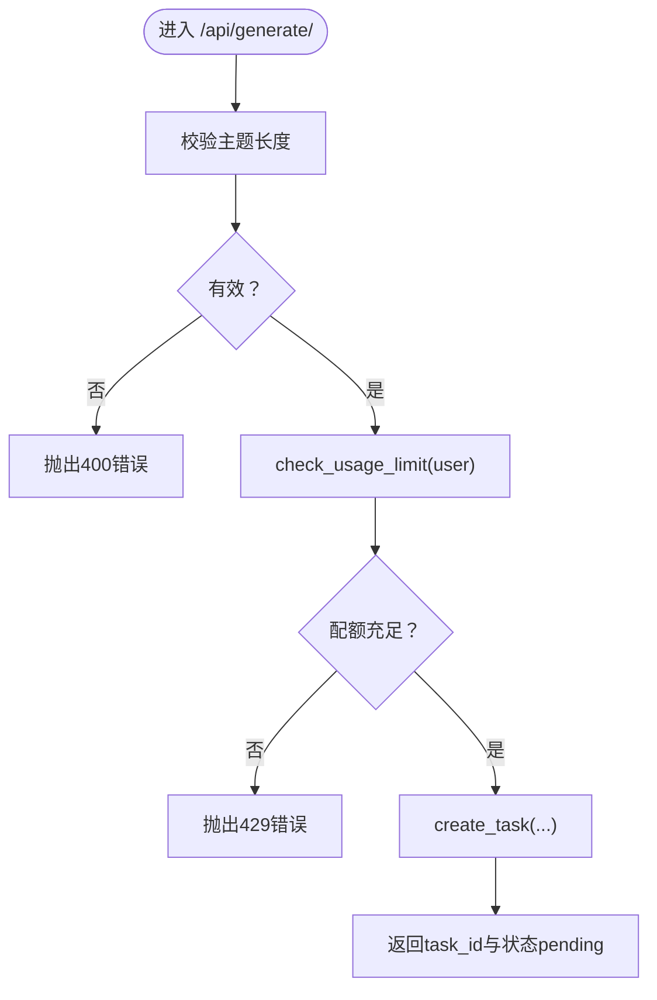
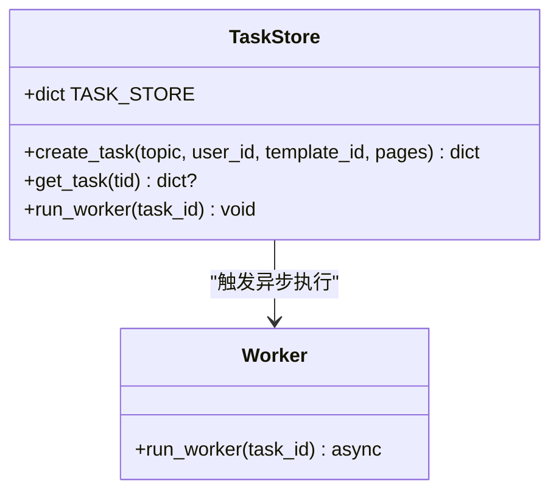
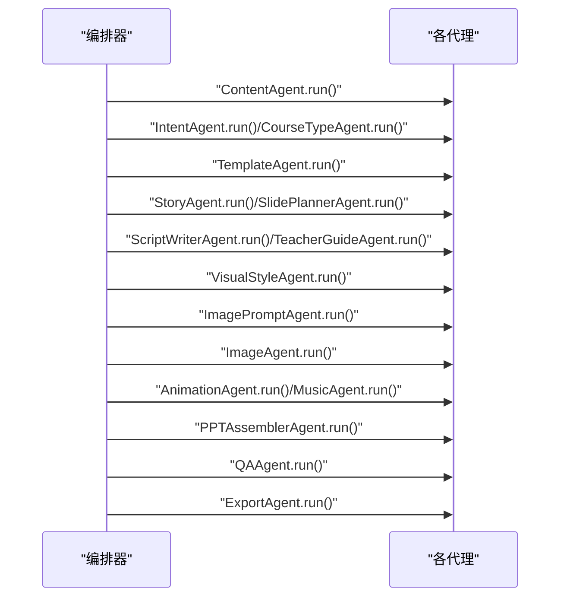
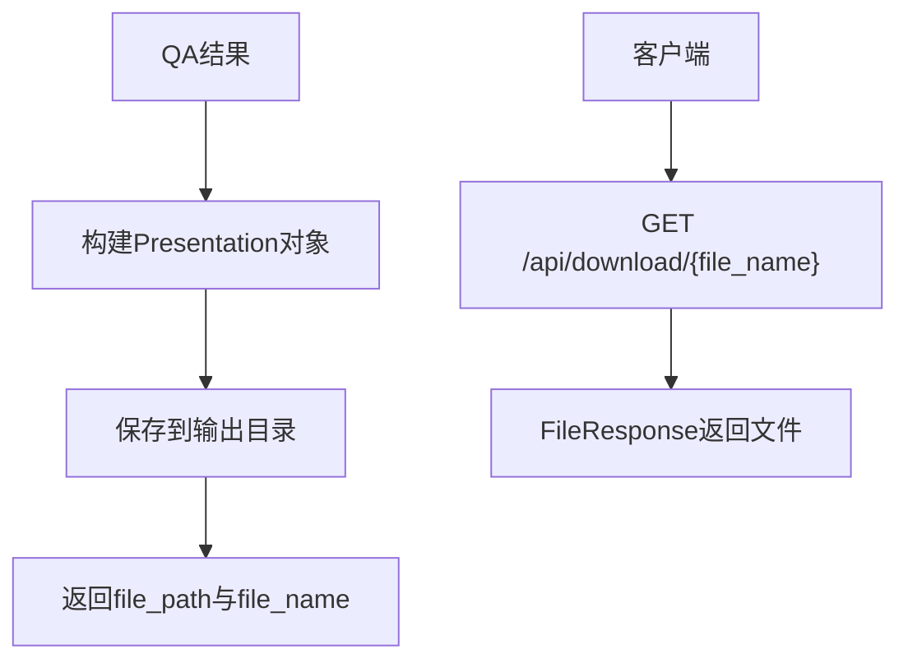
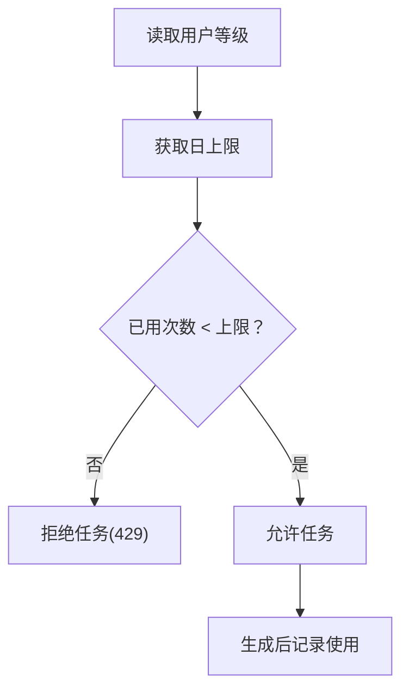
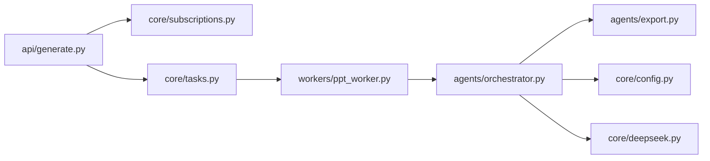

# 生成服务API

<cite>
**本文引用的文件**
- [backend/main.py](file://backend/main.py)
- [backend/api/generate.py](file://backend/api/generate.py)
- [backend/api/download.py](file://backend/api/download.py)
- [backend/core/tasks.py](file://backend/core/tasks.py)
- [backend/workers/ppt_worker.py](file://backend/workers/ppt_worker.py)
- [backend/agents/orchestrator.py](file://backend/agents/orchestrator.py)
- [backend/agents/content.py](file://backend/agents/content.py)
- [backend/agents/template.py](file://backend/agents/template.py)
- [backend/agents/export.py](file://backend/agents/export.py)
- [backend/core/deepseek.py](file://backend/core/deepseek.py)
- [backend/core/subscriptions.py](file://backend/core/subscriptions.py)
- [backend/models/ppt.py](file://backend/models/ppt.py)
- [backend/core/config.py](file://backend/core/config.py)
</cite>

## 目录
1. [简介](#简介)
2. [项目结构](#项目结构)
3. [核心组件](#核心组件)
4. [架构总览](#架构总览)
5. [详细组件分析](#详细组件分析)
6. [依赖分析](#依赖分析)
7. [性能考虑](#性能考虑)
8. [故障排查指南](#故障排查指南)
9. [结论](#结论)
10. [附录：API使用示例与最佳实践](#附录api使用示例与最佳实践)

## 简介
本文件面向“生成服务API”模块，系统性阐述从任务提交到结果下载的完整流程，覆盖异步任务处理、任务状态管理、AI代理编排、数据流与错误处理、性能优化与并发控制、质量控制与资源管理等主题。读者可据此快速理解并正确使用该模块。

## 项目结构
后端采用FastAPI应用入口，通过路由模块化暴露生成、下载、计费、模板与用户相关接口；核心生成逻辑由任务调度器与工作进程协作完成，并由AI代理流水线负责内容规划与PPT装配导出。

图示来源
- [backend/main.py:16-35](file://backend/main.py#L16-L35)
- [backend/api/generate.py:11-51](file://backend/api/generate.py#L11-L51)
- [backend/api/download.py:6-14](file://backend/api/download.py#L6-L14)
- [backend/core/tasks.py:5-32](file://backend/core/tasks.py#L5-L32)
- [backend/workers/ppt_worker.py:5-23](file://backend/workers/ppt_worker.py#L5-L23)
- [backend/agents/orchestrator.py:19-55](file://backend/agents/orchestrator.py#L19-L55)
- [backend/agents/content.py:4-20](file://backend/agents/content.py#L4-L20)
- [backend/agents/template.py:7-32](file://backend/agents/template.py#L7-L32)
- [backend/agents/export.py:10-64](file://backend/agents/export.py#L10-L64)
- [backend/core/config.py:4-33](file://backend/core/config.py#L4-L33)

章节来源
- [backend/main.py:16-35](file://backend/main.py#L16-L35)
- [backend/api/generate.py:11-51](file://backend/api/generate.py#L11-L51)
- [backend/api/download.py:6-14](file://backend/api/download.py#L6-L14)
- [backend/core/tasks.py:5-32](file://backend/core/tasks.py#L5-L32)
- [backend/workers/ppt_worker.py:5-23](file://backend/workers/ppt_worker.py#L5-L23)
- [backend/agents/orchestrator.py:19-55](file://backend/agents/orchestrator.py#L19-L55)
- [backend/agents/content.py:4-20](file://backend/agents/content.py#L4-L20)
- [backend/agents/template.py:7-32](file://backend/agents/template.py#L7-L32)
- [backend/agents/export.py:10-64](file://backend/agents/export.py#L10-L64)
- [backend/core/config.py:4-33](file://backend/core/config.py#L4-L33)

## 核心组件
- 应用入口与路由挂载：在应用生命周期中初始化数据库并挂载各路由模块，统一暴露健康检查、生成、下载、计费与模板接口。
- 生成API：接收主题、模板ID等参数，校验用户配额后创建异步任务并返回任务ID；提供状态查询接口以轮询任务进度与结果。
- 任务调度与存储：基于内存字典维护任务状态，创建任务后异步启动工作进程执行生成流水线。
- AI代理编排：按顺序调用内容解析、意图识别、课程类型、故事线、幻灯片规划、脚本写作、教师指南、视觉风格、图像提示、图像生成、动画、音乐、拼装、质量检查与导出等代理。
- 导出与下载：将最终PPT数据写入磁盘，提供下载接口供客户端获取文件。
- 订阅与配额：根据用户等级限制每日生成次数，记录使用行为。

章节来源
- [backend/main.py:10-39](file://backend/main.py#L10-L39)
- [backend/api/generate.py:20-51](file://backend/api/generate.py#L20-L51)
- [backend/core/tasks.py:14-32](file://backend/core/tasks.py#L14-L32)
- [backend/workers/ppt_worker.py:5-23](file://backend/workers/ppt_worker.py#L5-L23)
- [backend/agents/orchestrator.py:19-55](file://backend/agents/orchestrator.py#L19-L55)
- [backend/agents/export.py:10-64](file://backend/agents/export.py#L10-L64)
- [backend/core/subscriptions.py:46-57](file://backend/core/subscriptions.py#L46-L57)

## 架构总览
下图展示从HTTP请求到PPT导出的端到端流程，包括鉴权、配额检查、任务创建、异步执行、状态更新与结果下载。

图示来源
- [backend/api/generate.py:20-51](file://backend/api/generate.py#L20-L51)
- [backend/core/subscriptions.py:46-50](file://backend/core/subscriptions.py#L46-L50)
- [backend/core/tasks.py:14-28](file://backend/core/tasks.py#L14-L28)
- [backend/workers/ppt_worker.py:5-23](file://backend/workers/ppt_worker.py#L5-L23)
- [backend/agents/orchestrator.py:19-55](file://backend/agents/orchestrator.py#L19-L55)
- [backend/agents/export.py:10-64](file://backend/agents/export.py#L10-L64)
- [backend/api/download.py:9-14](file://backend/api/download.py#L9-L14)

## 详细组件分析

### 生成API（提交与状态查询）
- 提交任务：校验主题有效性与用户配额，创建任务并立即异步启动工作进程，返回任务ID与初始状态。
- 查询状态：根据任务ID返回当前状态、文件路径/名称、是否可下载、中间结果片段、进度与错误信息；若任务不存在则返回未找到。

图示来源
- [backend/api/generate.py:20-35](file://backend/api/generate.py#L20-L35)
- [backend/core/subscriptions.py:46-50](file://backend/core/subscriptions.py#L46-L50)
- [backend/core/tasks.py:14-28](file://backend/core/tasks.py#L14-L28)

章节来源
- [backend/api/generate.py:20-51](file://backend/api/generate.py#L20-L51)
- [backend/core/subscriptions.py:46-57](file://backend/core/subscriptions.py#L46-L57)

### 任务调度与状态管理
- 内存任务存储：全局字典保存任务元数据，包含状态、主题、用户ID、模板ID、页数、结果、错误等字段。
- 异步执行：创建任务后通过事件循环创建任务协程，避免阻塞请求线程。
- 状态流转：工作进程将任务置为运行态，成功时写入文件路径与结果，失败时记录错误并标记失败。

图示来源
- [backend/core/tasks.py:5-32](file://backend/core/tasks.py#L5-L32)
- [backend/workers/ppt_worker.py:5-23](file://backend/workers/ppt_worker.py#L5-L23)

章节来源
- [backend/core/tasks.py:5-32](file://backend/core/tasks.py#L5-L32)
- [backend/workers/ppt_worker.py:5-23](file://backend/workers/ppt_worker.py#L5-L23)

### AI代理编排与流水线
- 编排器顺序调用多个代理：内容解析 → 意图识别 → 课程类型 → 模板选择 → 故事线 → 幻灯片规划 → 脚本写作 → 教师指南 → 视觉风格 → 图像提示 → 图像生成 → 动画 → 音乐 → 组装 → 质量检查 → 导出。
- 每个代理封装特定职责，统一通过异步方法运行，便于扩展与替换。

图示来源
- [backend/agents/orchestrator.py:19-55](file://backend/agents/orchestrator.py#L19-L55)

章节来源
- [backend/agents/orchestrator.py:19-55](file://backend/agents/orchestrator.py#L19-L55)

### 导出与下载
- 导出：根据QA结果与模板生成PPT，保存至配置的输出目录，返回文件路径与文件名。
- 下载：根据文件名定位输出目录中的文件并返回二进制响应，支持断点续传与范围请求。

图示来源
- [backend/agents/export.py:10-64](file://backend/agents/export.py#L10-L64)
- [backend/api/download.py:9-14](file://backend/api/download.py#L9-L14)
- [backend/core/config.py:25](file://backend/core/config.py#L25)

章节来源
- [backend/agents/export.py:10-64](file://backend/agents/export.py#L10-L64)
- [backend/api/download.py:9-14](file://backend/api/download.py#L9-L14)
- [backend/core/config.py:25](file://backend/core/config.py#L25)

### 订阅与配额
- 配额规则：不同等级用户拥有不同的日生成上限；当达到上限时拒绝新任务。
- 使用记录：每次成功生成后增加使用计数并写入使用记录表。

图示来源
- [backend/core/subscriptions.py:46-57](file://backend/core/subscriptions.py#L46-L57)

章节来源
- [backend/core/subscriptions.py:46-57](file://backend/core/subscriptions.py#L46-L57)

### 数据模型与持久化
- PPT记录模型：用于持久化用户的PPT生成历史，包含主题、页数、文件路径、文件名、状态与创建时间等字段。

章节来源
- [backend/models/ppt.py:6-17](file://backend/models/ppt.py#L6-L17)

## 依赖分析
- 外部依赖：DeepSeek大模型API（用于代理的LLM推理）、Redis（配置中存在但当前未在生成链路直接使用）、数据库（SQLAlchemy异步会话）。
- 模块耦合：API层仅依赖任务调度与订阅模块；任务调度依赖工作进程；工作进程依赖编排器；编排器依赖各代理；导出依赖配置与文件系统。

图示来源
- [backend/api/generate.py:1-10](file://backend/api/generate.py#L1-L10)
- [backend/core/tasks.py:1-3](file://backend/core/tasks.py#L1-L3)
- [backend/workers/ppt_worker.py:1-2](file://backend/workers/ppt_worker.py#L1-L2)
- [backend/agents/orchestrator.py:1-16](file://backend/agents/orchestrator.py#L1-L16)
- [backend/agents/export.py:1-7](file://backend/agents/export.py#L1-L7)
- [backend/core/deepseek.py:1-3](file://backend/core/deepseek.py#L1-L3)
- [backend/core/config.py:4-27](file://backend/core/config.py#L4-L27)

章节来源
- [backend/api/generate.py:1-10](file://backend/api/generate.py#L1-L10)
- [backend/core/tasks.py:1-3](file://backend/core/tasks.py#L1-L3)
- [backend/workers/ppt_worker.py:1-2](file://backend/workers/ppt_worker.py#L1-L2)
- [backend/agents/orchestrator.py:1-16](file://backend/agents/orchestrator.py#L1-L16)
- [backend/agents/export.py:1-7](file://backend/agents/export.py#L1-L7)
- [backend/core/deepseek.py:1-3](file://backend/core/deepseek.py#L1-L3)
- [backend/core/config.py:4-27](file://backend/core/config.py#L4-L27)

## 性能考虑
- 异步非阻塞：使用事件循环创建任务协程，避免主线程阻塞，提升吞吐。
- I/O优先：导出与文件系统操作为I/O密集型，适合异步；LLM调用通过异步HTTP客户端进行，注意超时设置。
- 并发控制建议：
  - 当前实现为单实例内存任务存储，不支持跨实例共享；如需水平扩展，应将任务存储迁移到Redis或数据库，并引入消息队列（如Celery）实现分布式任务分发。
  - 对于高并发场景，建议限制同一用户短期内的任务创建速率，防止资源争用。
- 资源管理：
  - 控制单次生成的页数上限与图片/音频生成数量，避免内存与磁盘压力过大。
  - 输出目录容量监控与清理策略，定期回收旧文件。
- 缓存与复用：
  - 对热点模板与常用提示词进行缓存，减少重复计算与外部调用。
  - 将已完成的高质量PPT结果进行归档与复用（视业务需要）。

## 故障排查指南
- 常见错误与处理：
  - 主题无效：提交时校验失败，返回400；请确保主题非空且长度足够。
  - 配额不足：当日额度耗尽，返回429；引导用户升级或等待次日重置。
  - 任务不存在：状态查询返回404；确认task_id正确且任务尚未过期。
  - 生成失败：状态为failed，错误信息在响应中；查看工作进程日志定位具体代理环节。
- 日志与追踪：
  - 工作进程捕获异常并打印堆栈，便于定位问题；可在生产环境接入结构化日志系统。
- 文件下载失败：
  - 确认文件名与输出目录一致，文件是否存在；检查静态文件服务配置。

章节来源
- [backend/api/generate.py:26-35](file://backend/api/generate.py#L26-L35)
- [backend/api/generate.py:41-42](file://backend/api/generate.py#L41-L42)
- [backend/workers/ppt_worker.py:20-23](file://backend/workers/ppt_worker.py#L20-L23)
- [backend/api/download.py:11-13](file://backend/api/download.py#L11-L13)

## 结论
本模块通过轻量级异步任务调度与多代理编排，实现了从主题到PPT导出的完整链路。当前实现简洁高效，适合小规模部署；若需支撑更高并发与更稳健的分布式能力，建议引入消息队列与持久化任务存储，并完善限流与资源治理策略。

## 附录：API使用示例与最佳实践
- 任务提交
  - 请求：POST /api/generate/
  - 参数：topic（必填）、template_id（可选）、pages（可选）
  - 返回：task_id、status（初始为pending）
- 状态轮询
  - 请求：GET /api/generate/status/{task_id}
  - 返回：status、file_url、file_name、download（当状态为done时为true）、result、progress、error
- 结果获取
  - 请求：GET /api/download/{file_name}
  - 返回：PPT文件二进制流
- 最佳实践
  - 客户端应以指数退避策略轮询状态，避免频繁请求。
  - 在提交任务前先检查用户配额，减少无效请求。
  - 对于长任务，建议在前端显示预估耗时与阶段性进度（如可用）。
  - 生产环境务必配置稳定的输出目录与文件清理策略。

章节来源
- [backend/api/generate.py:20-51](file://backend/api/generate.py#L20-L51)
- [backend/api/download.py:9-14](file://backend/api/download.py#L9-L14)