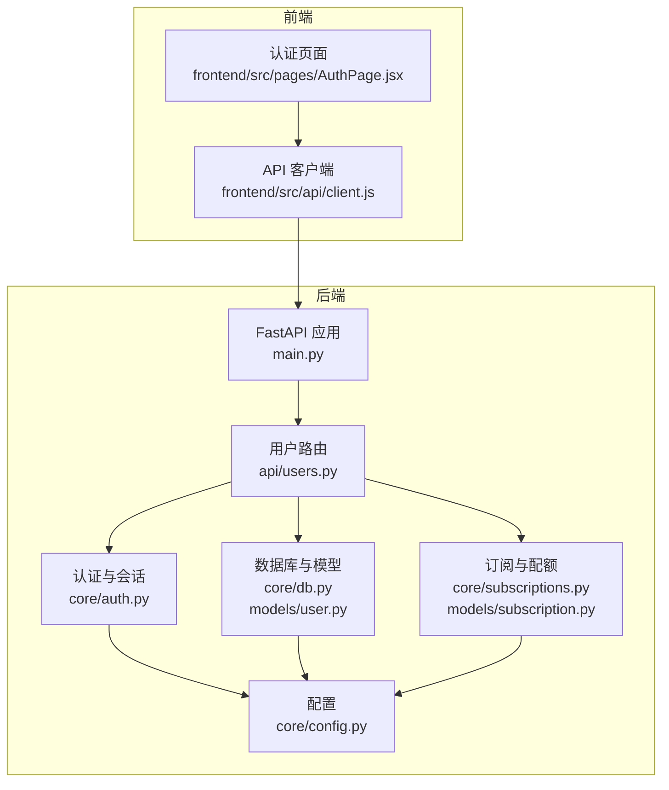
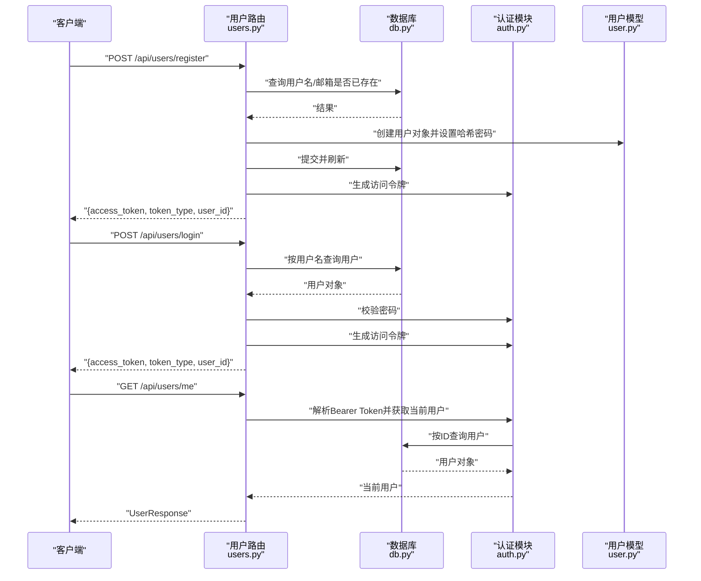
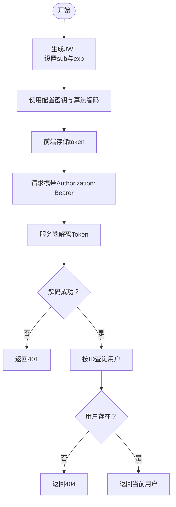
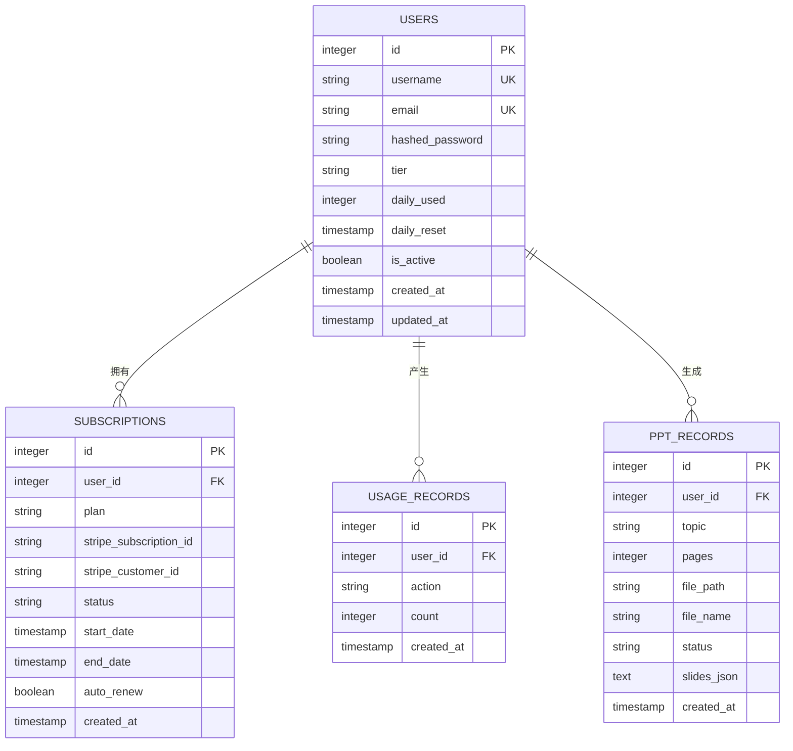
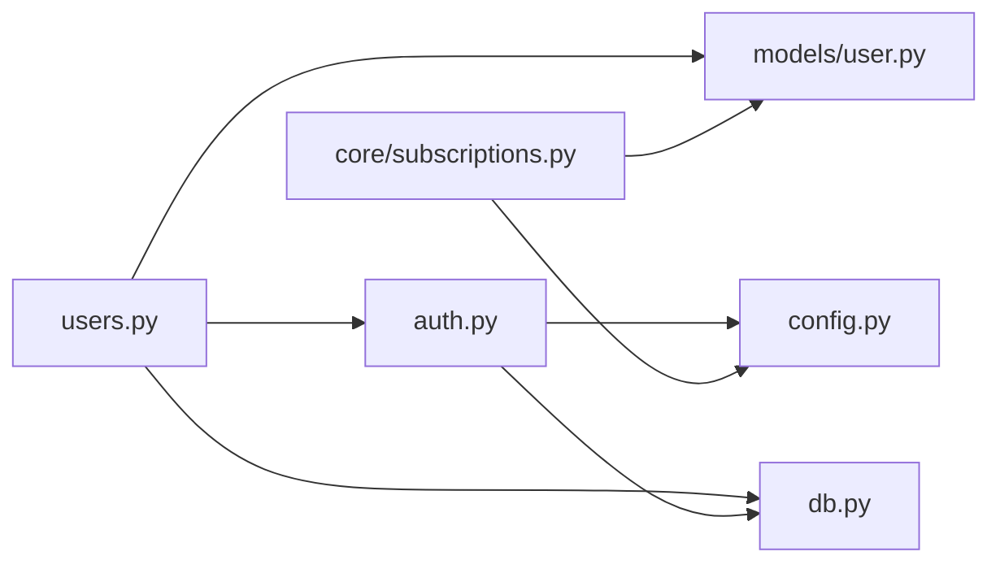

# 用户管理API

<cite>
**本文档引用的文件**
- [backend/api/users.py](file://backend/api/users.py)
- [backend/models/user.py](file://backend/models/user.py)
- [backend/core/auth.py](file://backend/core/auth.py)
- [backend/core/config.py](file://backend/core/config.py)
- [backend/core/db.py](file://backend/core/db.py)
- [backend/core/subscriptions.py](file://backend/core/subscriptions.py)
- [backend/models/subscription.py](file://backend/models/subscription.py)
- [backend/models/ppt.py](file://backend/models/ppt.py)
- [backend/main.py](file://backend/main.py)
- [frontend/src/api/client.js](file://frontend/src/api/client.js)
- [frontend/src/pages/AuthPage.jsx](file://frontend/src/pages/AuthPage.jsx)
</cite>

## 目录
1. [简介](#简介)
2. [项目结构](#项目结构)
3. [核心组件](#核心组件)
4. [架构总览](#架构总览)
5. [详细组件分析](#详细组件分析)
6. [依赖关系分析](#依赖关系分析)
7. [性能考量](#性能考量)
8. [故障排除指南](#故障排除指南)
9. [结论](#结论)
10. [附录](#附录)

## 简介
本文件为用户管理API模块的技术文档，聚焦于用户注册、登录与个人信息查询的完整实现流程。文档涵盖数据模型设计（RegisterRequest、LoginRequest、UserResponse）、字段验证规则与安全考虑、JWT令牌生成与验证机制、会话管理与权限控制、API使用示例（请求格式、响应结构、错误处理）、用户数据模型与数据库操作模式，以及安全最佳实践与常见问题解决方案。

## 项目结构
用户管理API位于后端FastAPI应用中，采用分层架构：
- 路由层：在用户路由中定义注册、登录、查询当前用户等接口
- 数据模型层：基于SQLAlchemy ORM定义用户表结构及扩展属性
- 认证与会话层：提供密码哈希、JWT签发与校验、当前用户解析
- 配置与数据库层：集中管理数据库连接、Redis、JWT密钥与算法、每日限额等配置
- 前端集成：Axios拦截器自动注入认证头，统一处理401未授权

图表来源
- [backend/main.py:16-35](file://backend/main.py#L16-L35)
- [backend/api/users.py:11-75](file://backend/api/users.py#L11-L75)
- [backend/core/auth.py:1-57](file://backend/core/auth.py#L1-L57)
- [backend/core/db.py:1-27](file://backend/core/db.py#L1-L27)
- [backend/models/user.py:1-21](file://backend/models/user.py#L1-L21)
- [backend/core/subscriptions.py:1-58](file://backend/core/subscriptions.py#L1-L58)
- [backend/models/subscription.py:1-29](file://backend/models/subscription.py#L1-L29)
- [backend/core/config.py:1-34](file://backend/core/config.py#L1-L34)
- [frontend/src/api/client.js:1-28](file://frontend/src/api/client.js#L1-L28)
- [frontend/src/pages/AuthPage.jsx:1-51](file://frontend/src/pages/AuthPage.jsx#L1-L51)

章节来源
- [backend/main.py:16-35](file://backend/main.py#L16-L35)
- [backend/api/users.py:11-75](file://backend/api/users.py#L11-L75)

## 核心组件
- 用户路由与控制器：提供注册、登录、查询当前用户三个接口，使用Pydantic模型进行输入校验，返回标准化响应
- 数据模型：User实体包含基础字段与订阅相关的配额字段；Subscription与UsageRecord用于追踪订阅状态与使用记录
- 认证与会话：bcrypt密码哈希与校验、JWT签发与解码、基于Bearer Token的当前用户解析
- 配置与数据库：异步SQLAlchemy引擎、依赖注入的数据库会话、JWT密钥与算法、每日限额映射
- 前端集成：Axios拦截器自动附加Authorization头，统一处理401未授权并跳转到认证页

章节来源
- [backend/api/users.py:14-32](file://backend/api/users.py#L14-L32)
- [backend/models/user.py:6-21](file://backend/models/user.py#L6-L21)
- [backend/core/auth.py:16-57](file://backend/core/auth.py#L16-L57)
- [backend/core/config.py:4-34](file://backend/core/config.py#L4-L34)
- [backend/core/db.py:13-27](file://backend/core/db.py#L13-L27)
- [backend/core/subscriptions.py:10-58](file://backend/core/subscriptions.py#L10-L58)
- [frontend/src/api/client.js:8-25](file://frontend/src/api/client.js#L8-L25)

## 架构总览
用户管理API遵循REST风格，采用以下交互流程：
- 注册：接收用户名、邮箱、密码，检查唯一性，创建用户并生成JWT
- 登录：根据用户名查找用户，校验密码，生成JWT
- 查询当前用户：通过Bearer Token解析当前用户，返回用户信息与配额上限

图表来源
- [backend/api/users.py:34-74](file://backend/api/users.py#L34-L74)
- [backend/core/auth.py:47-57](file://backend/core/auth.py#L47-L57)
- [backend/core/db.py:13-27](file://backend/core/db.py#L13-L27)
- [backend/models/user.py:6-21](file://backend/models/user.py#L6-L21)

## 详细组件分析

### 数据模型与验证规则
- RegisterRequest（注册请求）
  - 字段：username、email、password
  - 验证：email使用EmailStr类型约束；用户名与邮箱在数据库层面唯一约束
  - 安全：密码经bcrypt哈希存储，不保存明文
- LoginRequest（登录请求）
  - 字段：username、password
  - 验证：按用户名查询用户，校验密码哈希
- UserResponse（用户响应）
  - 字段：id、username、email、tier、daily_used、daily_limit
  - 来源：从User实体读取基础信息，并结合订阅层级计算daily_limit

章节来源
- [backend/api/users.py:14-32](file://backend/api/users.py#L14-L32)
- [backend/models/user.py:6-21](file://backend/models/user.py#L6-L21)
- [backend/core/subscriptions.py:42-43](file://backend/core/subscriptions.py#L42-L43)

### JWT令牌生成与验证机制
- 令牌生成
  - 使用HS256算法，密钥来自配置，有效期可配置
  - payload包含sub（用户ID）与exp（过期时间）
- 令牌验证
  - 解析时校验签名与算法，异常时返回401
  - 当前用户解析：从Authorization头提取Bearer Token，解码后查询用户是否存在且有效
- 会话管理
  - 前端通过localStorage存储token，在请求拦截器中自动附加Authorization头
  - 401响应时清理token并重定向至认证页

图表来源
- [backend/core/auth.py:24-44](file://backend/core/auth.py#L24-L44)
- [backend/core/auth.py:47-57](file://backend/core/auth.py#L47-L57)
- [frontend/src/api/client.js:8-25](file://frontend/src/api/client.js#L8-L25)

章节来源
- [backend/core/auth.py:24-57](file://backend/core/auth.py#L24-L57)
- [backend/core/config.py:14-16](file://backend/core/config.py#L14-L16)
- [frontend/src/api/client.js:8-25](file://frontend/src/api/client.js#L8-L25)

### 用户数据模型与数据库操作模式
- 用户表结构
  - 主键自增id
  - 唯一用户名与邮箱
  - 哈希密码字段
  - 订阅层级tier、当日使用计数daily_used、每日重置时间daily_reset
  - 激活状态is_active与时间戳created_at/updated_at
- 订阅与使用记录
  - Subscription：用户订阅计划、Stripe关联ID、状态、起止时间、自动续费
  - UsageRecord：用户行为记录（如生成PPT），用于统计与审计
- 数据库初始化
  - 应用启动时创建所有表（users、subscriptions、usage_records、ppt_records）

图表来源
- [backend/models/user.py:6-21](file://backend/models/user.py#L6-L21)
- [backend/models/subscription.py:6-29](file://backend/models/subscription.py#L6-L29)
- [backend/models/ppt.py:6-18](file://backend/models/ppt.py#L6-L18)
- [backend/core/db.py:21-27](file://backend/core/db.py#L21-L27)

章节来源
- [backend/models/user.py:6-21](file://backend/models/user.py#L6-L21)
- [backend/models/subscription.py:6-29](file://backend/models/subscription.py#L6-L29)
- [backend/models/ppt.py:6-18](file://backend/models/ppt.py#L6-L18)
- [backend/core/db.py:21-27](file://backend/core/db.py#L21-L27)

### API使用示例与错误处理
- 注册
  - 请求：POST /api/users/register
  - 请求体：{username, email, password}
  - 成功响应：{access_token, token_type, user_id}
  - 错误：400（用户名或邮箱已存在）
- 登录
  - 请求：POST /api/users/login
  - 请求体：{username, password}
  - 成功响应：{access_token, token_type, user_id}
  - 错误：401（用户名或密码错误）
- 查询当前用户
  - 请求：GET /api/users/me
  - 成功响应：UserResponse
  - 错误：401（无效token）、404（用户不存在）

章节来源
- [backend/api/users.py:34-74](file://backend/api/users.py#L34-L74)

### 权限控制与配额管理
- 权限控制
  - /api/users/me 接口依赖get_current_user中间件，要求Bearer Token有效且用户存在
- 配额管理
  - 不同订阅层级对应不同的每日限额
  - 实际使用计数daily_used与限额比较决定是否允许继续使用
  - 使用记录写入usage_records便于审计

章节来源
- [backend/api/users.py:64-74](file://backend/api/users.py#L64-L74)
- [backend/core/subscriptions.py:10-58](file://backend/core/subscriptions.py#L10-L58)

## 依赖关系分析
- 组件耦合
  - users路由依赖auth模块（密码哈希/校验、JWT）、db模块（数据库会话）、models.user（用户实体）
  - auth模块依赖config（密钥与算法）、db（用户查询）
  - subscriptions模块依赖models.user与config（限额映射）
- 外部依赖
  - bcrypt用于密码哈希
  - PyJWT用于令牌编码/解码
  - SQLAlchemy异步引擎与ORM
  - FastAPI路由与依赖注入

图表来源
- [backend/api/users.py:1-9](file://backend/api/users.py#L1-L9)
- [backend/core/auth.py:1-11](file://backend/core/auth.py#L1-L11)
- [backend/core/subscriptions.py:1-7](file://backend/core/subscriptions.py#L1-L7)
- [backend/core/config.py:1-34](file://backend/core/config.py#L1-L34)
- [backend/core/db.py:1-6](file://backend/core/db.py#L1-L6)
- [backend/models/user.py:1-3](file://backend/models/user.py#L1-L3)

## 性能考量
- 异步数据库：使用SQLAlchemy异步引擎与会话，减少阻塞，提升并发能力
- 密码哈希成本：bcrypt默认成本适中，可根据硬件调整以平衡安全性与性能
- JWT开销：令牌体积小，解码快速；建议避免在令牌中存放大体量数据
- 连接池：异步会话配置支持连接复用，注意在高并发场景下监控数据库连接数

## 故障排除指南
- 400 错误（注册）
  - 现象：用户名或邮箱已存在
  - 处理：修改用户名或邮箱后重试
- 401 错误（登录/查询当前用户）
  - 现象：用户名或密码错误；无效token；用户不存在
  - 处理：重新登录获取新token；确认Authorization头格式为Bearer
- 404 错误（查询当前用户）
  - 现象：token有效但用户被删除
  - 处理：重新注册或联系管理员
- 前端401自动跳转
  - 现象：响应拦截器检测到401，清除本地token并跳转认证页
  - 处理：确保登录成功后正确存储token

章节来源
- [backend/api/users.py:39,58,54](file://backend/api/users.py#L39,L58,L54)
- [backend/core/auth.py:41-44,54](file://backend/core/auth.py#L41-L44,L54)
- [frontend/src/api/client.js:16-25](file://frontend/src/api/client.js#L16-L25)

## 结论
用户管理API通过清晰的分层设计实现了安全、可扩展的用户生命周期管理。注册与登录流程严格遵循安全最佳实践，JWT令牌机制配合前端拦截器提供了良好的会话体验。订阅与配额体系为后续功能扩展奠定了基础。建议在生产环境中强化密钥管理、引入速率限制与审计日志，并对输入参数增加更细粒度的校验。

## 附录
- 配置项摘要
  - 数据库URL、Redis URL
  - JWT密钥、算法、过期分钟数
  - 免费与付费计划价格、输出目录、上传目录
- 前端集成要点
  - 自动附加Authorization头
  - 统一401处理逻辑
  - 认证页切换登录/注册

章节来源
- [backend/core/config.py:11-27](file://backend/core/config.py#L11-L27)
- [frontend/src/api/client.js:3-6](file://frontend/src/api/client.js#L3-L6)