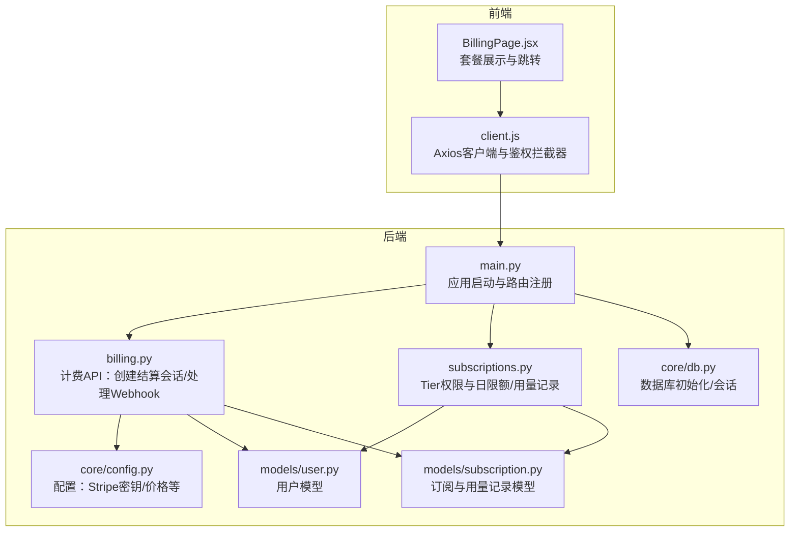
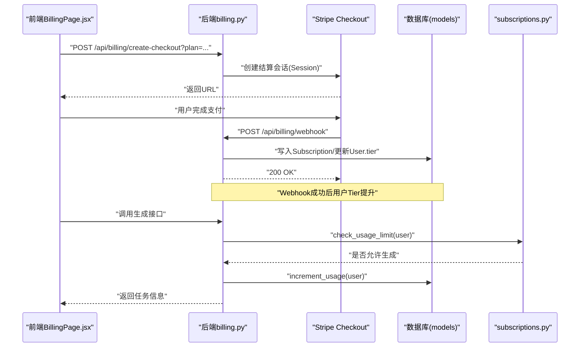
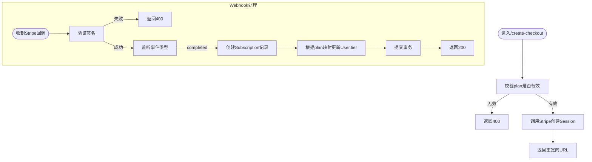
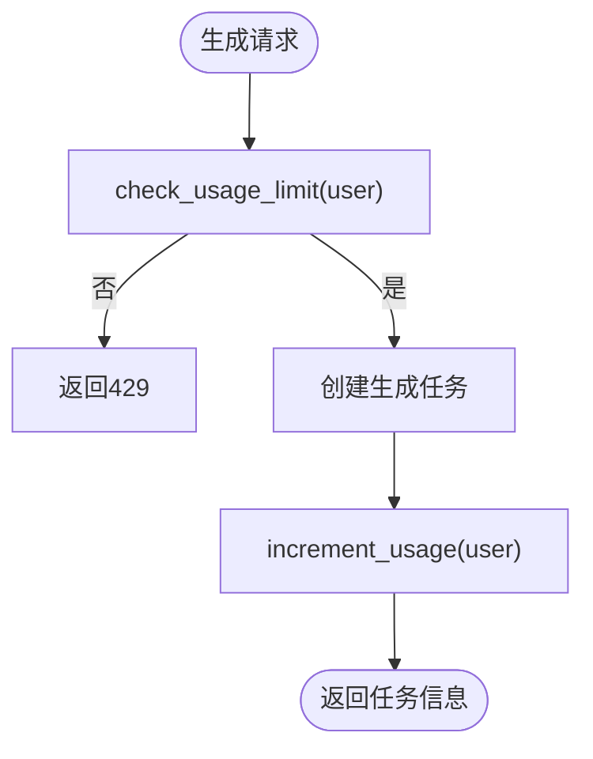
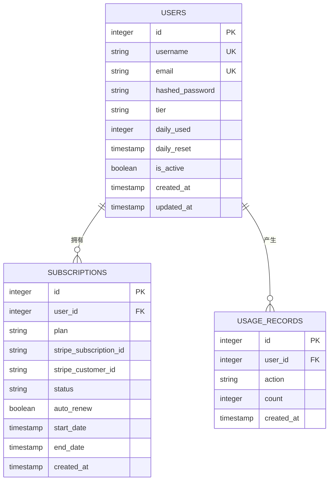
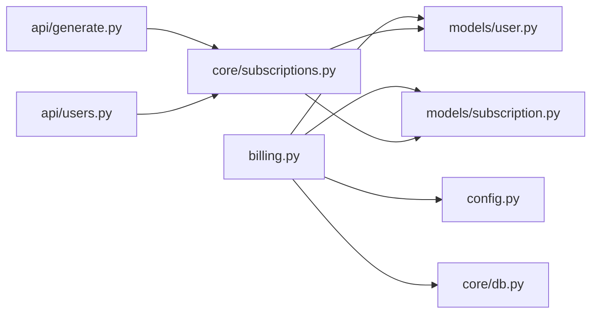

# 计费系统API

<cite>
**本文引用的文件列表**
- [billing.py](file://backend/api/billing.py)
- [subscriptions.py](file://backend/core/subscriptions.py)
- [subscription.py](file://backend/models/subscription.py)
- [user.py](file://backend/models/user.py)
- [config.py](file://backend/core/config.py)
- [auth.py](file://backend/core/auth.py)
- [db.py](file://backend/core/db.py)
- [generate.py](file://backend/api/generate.py)
- [users.py](file://backend/api/users.py)
- [main.py](file://backend/main.py)
- [BillingPage.jsx](file://frontend/src/pages/BillingPage.jsx)
- [client.js](file://frontend/src/api/client.js)
</cite>

## 目录
1. [简介](#简介)
2. [项目结构](#项目结构)
3. [核心组件](#核心组件)
4. [架构总览](#架构总览)
5. [详细组件分析](#详细组件分析)
6. [依赖关系分析](#依赖关系分析)
7. [性能考量](#性能考量)
8. [故障排查指南](#故障排查指南)
9. [结论](#结论)
10. [附录](#附录)

## 简介
本文件为计费系统API模块的技术文档，覆盖订阅管理、支付处理与套餐升级的完整实现流程；深入说明Stripe支付集成的配置与使用，包括Webhook处理与支付状态同步；阐述免费版、Pro版、学校版三层用户权限与使用限制；提供计费API的使用示例与数据模型设计，并包含支付安全与故障恢复机制说明。

## 项目结构
后端采用FastAPI + SQLAlchemy异步ORM，计费相关代码集中在以下模块：
- API层：billing.py 提供订阅创建与Webhook入口
- 核心服务：subscriptions.py 定义Tier权限与日使用量控制
- 数据模型：models/user.py、models/subscription.py 定义用户与订阅/用量记录
- 配置：core/config.py 存放Stripe密钥与价格配置
- 路由注册：main.py 将billing路由纳入应用

图表来源
- [main.py:16-35](file://backend/main.py#L16-L35)
- [billing.py:11-79](file://backend/api/billing.py#L11-L79)
- [subscriptions.py:10-57](file://backend/core/subscriptions.py#L10-L57)
- [user.py:6-21](file://backend/models/user.py#L6-L21)
- [subscription.py:6-29](file://backend/models/subscription.py#L6-L29)
- [config.py:4-34](file://backend/core/config.py#L4-L34)
- [db.py:21-27](file://backend/core/db.py#L21-L27)
- [BillingPage.jsx:46-105](file://frontend/src/pages/BillingPage.jsx#L46-L105)
- [client.js:3-28](file://frontend/src/api/client.js#L3-L28)

章节来源
- [main.py:16-35](file://backend/main.py#L16-L35)
- [billing.py:11-79](file://backend/api/billing.py#L11-L79)
- [subscriptions.py:10-57](file://backend/core/subscriptions.py#L10-L57)
- [user.py:6-21](file://backend/models/user.py#L6-L21)
- [subscription.py:6-29](file://backend/models/subscription.py#L6-L29)
- [config.py:4-34](file://backend/core/config.py#L4-L34)
- [db.py:21-27](file://backend/core/db.py#L21-L27)
- [BillingPage.jsx:46-105](file://frontend/src/pages/BillingPage.jsx#L46-L105)
- [client.js:3-28](file://frontend/src/api/client.js#L3-L28)

## 核心组件
- 计费API路由器：提供“创建结算会话”和“Stripe Webhook”两个端点，负责与Stripe交互并更新用户Tier与订阅状态。
- Tier权限与限额：通过字典映射不同Tier的每日生成上限与功能集合，并在生成PPT时进行检查。
- 用户与订阅模型：用户表含tier/daily_used字段；订阅表记录Stripe关联ID与状态；用量记录用于审计与统计。
- 配置管理：集中存放Stripe私钥、Webhook密钥、价格等配置项。
- 权限中间件：基于JWT的鉴权，确保只有登录用户可访问计费与生成接口。

章节来源
- [billing.py:11-79](file://backend/api/billing.py#L11-L79)
- [subscriptions.py:10-57](file://backend/core/subscriptions.py#L10-L57)
- [user.py:6-21](file://backend/models/user.py#L6-L21)
- [subscription.py:6-29](file://backend/models/subscription.py#L6-L29)
- [config.py:4-34](file://backend/core/config.py#L4-L34)
- [auth.py:47-56](file://backend/core/auth.py#L47-L56)

## 架构总览
下图展示了从前端到后端的计费流程：用户在前端页面选择套餐，后端调用Stripe创建结算会话；Stripe回调后端Webhook完成订阅创建与用户Tier提升；后续生成PPT时根据Tier进行限额与功能控制。

图表来源
- [BillingPage.jsx:49-65](file://frontend/src/pages/BillingPage.jsx#L49-L65)
- [billing.py:14-43](file://backend/api/billing.py#L14-L43)
- [billing.py:45-79](file://backend/api/billing.py#L45-L79)
- [subscriptions.py:46-57](file://backend/core/subscriptions.py#L46-L57)
- [subscription.py:6-29](file://backend/models/subscription.py#L6-L29)
- [user.py:6-21](file://backend/models/user.py#L6-L21)

## 详细组件分析

### 计费API：创建结算会话与Webhook
- 创建结算会话
  - 输入参数：plan（pro_monthly/pro_yearly/school_yearly），当前登录用户
  - 行为：校验plan有效性，调用Stripe创建订阅型结算会话，设置成功/取消回调地址与metadata（包含user_id与plan）
  - 返回：重定向URL
- Webhook处理
  - 输入：请求体与签名头
  - 行为：验证签名，监听checkout.session.completed事件；解析metadata中的user_id与plan；创建Subscription记录并更新User.tier；返回ok
  - 错误处理：签名无效返回400；异常返回500

图表来源
- [billing.py:14-43](file://backend/api/billing.py#L14-L43)
- [billing.py:45-79](file://backend/api/billing.py#L45-L79)

章节来源
- [billing.py:14-43](file://backend/api/billing.py#L14-L43)
- [billing.py:45-79](file://backend/api/billing.py#L45-L79)

### Tier权限与使用限制
- Tier映射
  - free：每日3次，基础导出
  - pro：每日100次，扩展功能集
  - school：无限次，高级功能集（含API接入、自定义模板等）
- 使用限制检查
  - 每次生成前检查用户当日已用次数是否超过Tier限制
  - 超限时返回429
- 用量记录
  - 成功生成后增加daily_used并写入UsageRecord

图表来源
- [subscriptions.py:46-57](file://backend/core/subscriptions.py#L46-L57)
- [generate.py:20-35](file://backend/api/generate.py#L20-L35)
- [subscription.py:21-29](file://backend/models/subscription.py#L21-L29)

章节来源
- [subscriptions.py:10-57](file://backend/core/subscriptions.py#L10-L57)
- [generate.py:20-35](file://backend/api/generate.py#L20-L35)
- [subscription.py:21-29](file://backend/models/subscription.py#L21-L29)

### 数据模型设计
- 用户模型（users）
  - 关键字段：tier（默认free）、daily_used（默认0）、daily_reset（重置时间）
- 订阅模型（subscriptions）
  - 关键字段：user_id、plan、stripe_subscription_id、stripe_customer_id、status、auto_renew、start_date/end_date
- 用量记录模型（usage_records）
  - 关键字段：user_id、action、count、created_at

图表来源
- [user.py:6-21](file://backend/models/user.py#L6-L21)
- [subscription.py:6-29](file://backend/models/subscription.py#L6-L29)

章节来源
- [user.py:6-21](file://backend/models/user.py#L6-L21)
- [subscription.py:6-29](file://backend/models/subscription.py#L6-L29)

### 前端计费页面与API调用
- 套餐展示：免费、Pro月付、Pro年付、学校版
- 调用流程：点击“升级/联系开通”，调用后端创建结算会话接口，拿到URL后跳转至Stripe完成支付
- 鉴权：前端Axios自动携带Bearer Token；401时自动跳转登录页

章节来源
- [BillingPage.jsx:46-105](file://frontend/src/pages/BillingPage.jsx#L46-L105)
- [client.js:3-28](file://frontend/src/api/client.js#L3-L28)

## 依赖关系分析
- billing依赖
  - core/config：读取Stripe密钥与Webhook密钥
  - models/user与models/subscription：写入订阅与更新用户Tier
  - SQLAlchemy异步会话：事务提交
- subscriptions依赖
  - models/user与models/subscription：读取/写入用量
  - 配置常量：Tier限额映射
- generate依赖
  - subscriptions：使用check_usage_limit/increment_usage
- users依赖
  - subscriptions：获取每日限额用于响应

图表来源
- [billing.py:14-79](file://backend/api/billing.py#L14-L79)
- [subscriptions.py:10-57](file://backend/core/subscriptions.py#L10-L57)
- [generate.py:20-35](file://backend/api/generate.py#L20-L35)
- [users.py:65-74](file://backend/api/users.py#L65-L74)
- [config.py:4-34](file://backend/core/config.py#L4-L34)
- [db.py:21-27](file://backend/core/db.py#L21-L27)

章节来源
- [billing.py:14-79](file://backend/api/billing.py#L14-L79)
- [subscriptions.py:10-57](file://backend/core/subscriptions.py#L10-L57)
- [generate.py:20-35](file://backend/api/generate.py#L20-L35)
- [users.py:65-74](file://backend/api/users.py#L65-L74)
- [config.py:4-34](file://backend/core/config.py#L4-L34)
- [db.py:21-27](file://backend/core/db.py#L21-L27)

## 性能考量
- 异步数据库：使用SQLAlchemy异步引擎与session，降低I/O阻塞
- 限额检查：每次生成前进行内存级判断，避免多余数据库查询
- 日限额重置：建议在定时任务中按自然日重置daily_used与daily_reset，以保证准确性
- Webhook幂等性：当前实现未显式去重，建议在数据库层面为stripe_subscription_id建立唯一索引并在Webhook中做幂等处理

## 故障排查指南
- Stripe Webhook签名失败
  - 现象：返回400
  - 排查：确认stripe-signature头是否存在；核对Webhook密钥与环境变量一致
- 支付成功但用户Tier未更新
  - 现象：用户仍为free
  - 排查：确认Webhook端点可达且未被防火墙拦截；检查metadata中user_id与plan是否正确；查看数据库Subscription与User.tier是否更新
- 生成接口频繁返回429
  - 现象：提示“今日生成次数已用完”
  - 排查：确认用户Tier与daily_used；检查定时重置逻辑；确认increment_usage是否正常执行
- 前端401跳转
  - 现象：调用计费或生成接口时自动跳转登录
  - 排查：确认本地存储token是否过期或被清理；后端JWT密钥是否变更

章节来源
- [billing.py:45-79](file://backend/api/billing.py#L45-L79)
- [generate.py:20-35](file://backend/api/generate.py#L20-L35)
- [client.js:16-25](file://frontend/src/api/client.js#L16-L25)

## 结论
该计费系统通过Stripe订阅型结算会话完成支付闭环，结合Tier权限与日使用量控制，实现了从免费到学校版的分层能力开放。Webhook确保支付状态与用户Tier同步，生成流程在限额与功能上体现差异化价值。建议进一步完善Webhook幂等与日限额重置机制，以增强稳定性与一致性。

## 附录

### 计费API使用示例（路径与要点）
- 创建结算会话
  - 方法与路径：POST /api/billing/create-checkout
  - 参数：plan（pro_monthly/pro_yearly/school_yearly）
  - 返回：url（跳转至Stripe完成支付）
  - 参考路径：[billing.py:14-43](file://backend/api/billing.py#L14-L43)
- 处理Webhook
  - 方法与路径：POST /api/billing/webhook
  - 请求头：stripe-signature
  - 行为：验证签名，处理checkout.session.completed事件，创建订阅并更新用户Tier
  - 参考路径：[billing.py:45-79](file://backend/api/billing.py#L45-L79)
- 生成PPT（受Tier限制）
  - 方法与路径：POST /api/generate/
  - 行为：检查限额，创建任务，成功后增加用量
  - 参考路径：[generate.py:20-35](file://backend/api/generate.py#L20-L35)
- 查询用户信息（含日限额）
  - 方法与路径：GET /api/users/me
  - 返回：tier、daily_used、daily_limit
  - 参考路径：[users.py:64-74](file://backend/api/users.py#L64-L74)

### Stripe集成配置要点
- 配置项
  - stripe_secret_key：用于创建结算会话与Webhook验证
  - stripe_webhook_secret：用于验证回调签名
  - 参考路径：[config.py:18-19](file://backend/core/config.py#L18-L19)
- 回调地址
  - 成功/取消回调URL在创建会话时指定
  - 参考路径：[billing.py:36-37](file://backend/api/billing.py#L36-L37)

### 支付安全与合规建议
- Webhook签名验证：必须校验stripe-signature头
- 仅处理已知事件类型，避免未知事件导致逻辑分支
- 对重复回调进行幂等处理（如按stripe_subscription_id去重）
- 保护敏感配置，使用环境变量注入
- 审计与监控：记录Webhook事件ID与处理结果，便于追踪与复盘