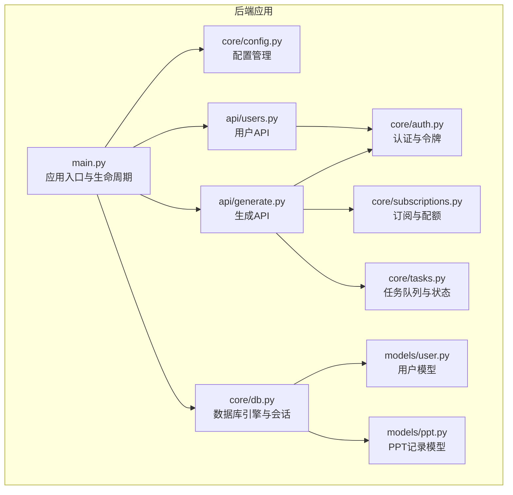
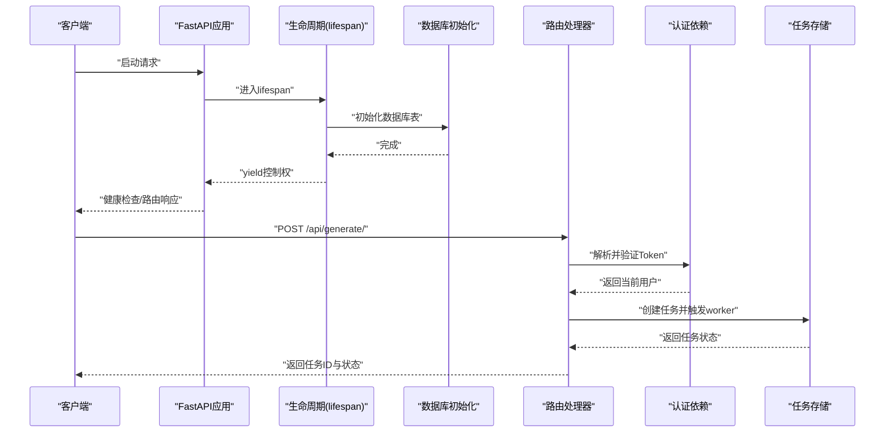
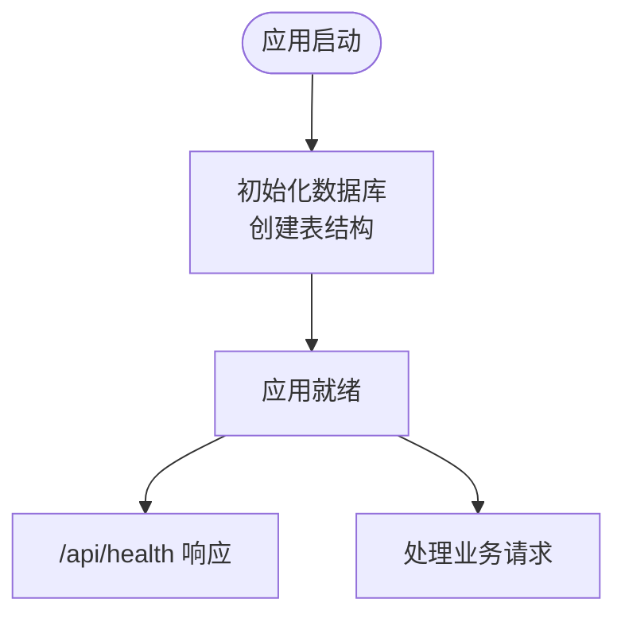
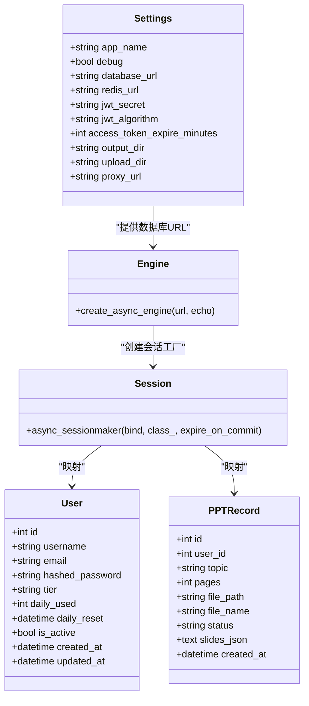
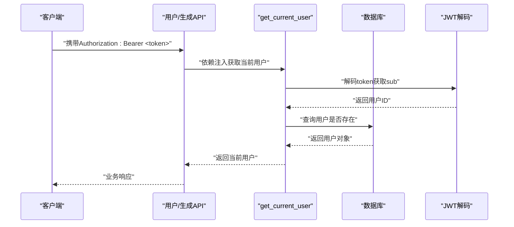
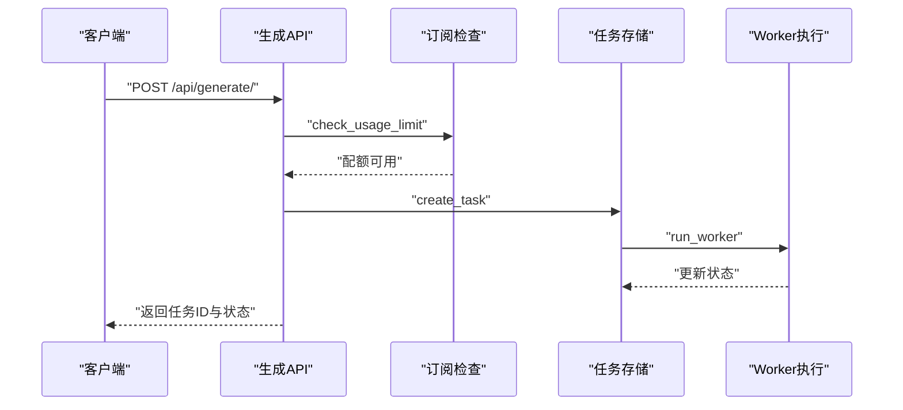
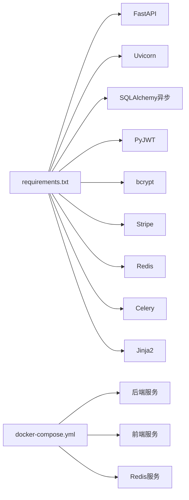

# FastAPI应用配置

<cite>
**本文档引用的文件**
- [backend/main.py](file://backend/main.py)
- [backend/core/config.py](file://backend/core/config.py)
- [backend/core/db.py](file://backend/core/db.py)
- [backend/core/auth.py](file://backend/core/auth.py)
- [backend/core/subscriptions.py](file://backend/core/subscriptions.py)
- [backend/core/tasks.py](file://backend/core/tasks.py)
- [backend/api/users.py](file://backend/api/users.py)
- [backend/api/generate.py](file://backend/api/generate.py)
- [backend/models/user.py](file://backend/models/user.py)
- [backend/models/ppt.py](file://backend/models/ppt.py)
- [backend/requirements.txt](file://backend/requirements.txt)
- [deployment/docker-compose.yml](file://deployment/docker-compose.yml)
</cite>

## 目录
1. [简介](#简介)
2. [项目结构](#项目结构)
3. [核心组件](#核心组件)
4. [架构总览](#架构总览)
5. [详细组件分析](#详细组件分析)
6. [依赖关系分析](#依赖关系分析)
7. [性能考虑](#性能考虑)
8. [故障排除指南](#故障排除指南)
9. [结论](#结论)
10. [附录](#附录)

## 简介
本文件面向AI-PPT项目的FastAPI后端应用，系统性梳理其配置与运行机制，重点覆盖以下方面：
- 应用生命周期管理（lifespan钩子）
- CORS中间件配置与跨域策略
- 路由注册机制与模块化组织
- 启动时数据库初始化流程
- 静态文件服务配置现状与扩展建议
- 配置管理系统（环境变量加载、设置验证）
- 安全配置（认证、授权、令牌管理）
- 性能优化策略与部署注意事项
- 故障排除与最佳实践

## 项目结构
后端采用分层与模块化设计：核心配置与数据库在core目录；业务API在api目录；数据模型在models目录；任务调度与工作进程在workers目录；部署使用docker-compose编排。

图表来源
- [backend/main.py:1-40](file://backend/main.py#L1-L40)
- [backend/core/config.py:1-34](file://backend/core/config.py#L1-L34)
- [backend/core/db.py:1-27](file://backend/core/db.py#L1-L27)
- [backend/core/auth.py:1-57](file://backend/core/auth.py#L1-L57)
- [backend/core/subscriptions.py:1-58](file://backend/core/subscriptions.py#L1-L58)
- [backend/core/tasks.py:1-33](file://backend/core/tasks.py#L1-L33)
- [backend/api/users.py:1-75](file://backend/api/users.py#L1-L75)
- [backend/api/generate.py:1-52](file://backend/api/generate.py#L1-L52)
- [backend/models/user.py:1-21](file://backend/models/user.py#L1-L21)
- [backend/models/ppt.py:1-18](file://backend/models/ppt.py#L1-L18)

章节来源
- [backend/main.py:1-40](file://backend/main.py#L1-L40)
- [backend/core/config.py:1-34](file://backend/core/config.py#L1-L34)
- [backend/core/db.py:1-27](file://backend/core/db.py#L1-L27)
- [backend/api/users.py:1-75](file://backend/api/users.py#L1-L75)
- [backend/api/generate.py:1-52](file://backend/api/generate.py#L1-L52)
- [backend/models/user.py:1-21](file://backend/models/user.py#L1-L21)
- [backend/models/ppt.py:1-18](file://backend/models/ppt.py#L1-L18)

## 核心组件
- 应用生命周期管理：通过lifespan钩子在应用启动时执行数据库初始化，确保表结构就绪后再对外提供服务。
- 中间件：启用CORS中间件，允许任意来源、凭证、方法与头，便于前端开发调试。
- 路由注册：集中导入并注册用户、计费、模板、生成、下载等路由模块。
- 配置管理：基于pydantic-settings的Settings类，支持从.env文件加载环境变量，并提供默认值与类型校验。
- 数据库：异步SQLAlchemy引擎与会话工厂，统一提供依赖注入。
- 认证与授权：基于JWT的Bearer Token方案，结合依赖注入获取当前用户。
- 任务系统：内存中的任务存储与异步worker触发，支撑PPT生成的后台处理。
- 模型定义：用户与PPT记录的ORM模型，支撑权限控制与使用统计。

章节来源
- [backend/main.py:10-40](file://backend/main.py#L10-L40)
- [backend/core/config.py:4-34](file://backend/core/config.py#L4-L34)
- [backend/core/db.py:1-27](file://backend/core/db.py#L1-L27)
- [backend/core/auth.py:1-57](file://backend/core/auth.py#L1-L57)
- [backend/core/tasks.py:1-33](file://backend/core/tasks.py#L1-L33)
- [backend/models/user.py:1-21](file://backend/models/user.py#L1-L21)
- [backend/models/ppt.py:1-18](file://backend/models/ppt.py#L1-L18)

## 架构总览
下图展示了应用启动到请求处理的关键路径，包括生命周期钩子、中间件、路由与数据库交互。

图表来源
- [backend/main.py:10-40](file://backend/main.py#L10-L40)
- [backend/core/auth.py:47-57](file://backend/core/auth.py#L47-L57)
- [backend/api/generate.py:20-52](file://backend/api/generate.py#L20-L52)
- [backend/core/tasks.py:8-28](file://backend/core/tasks.py#L8-L28)

## 详细组件分析

### 应用生命周期管理
- 使用asynccontextmanager定义lifespan钩子，在应用启动时调用init_db进行数据库初始化，随后yield控制权给应用，保证所有路由可用。
- 健康检查接口用于快速验证应用状态与版本信息。

图表来源
- [backend/main.py:10-20](file://backend/main.py#L10-L20)
- [backend/core/db.py:21-27](file://backend/core/db.py#L21-L27)
- [backend/main.py:37-40](file://backend/main.py#L37-L40)

章节来源
- [backend/main.py:10-20](file://backend/main.py#L10-L20)
- [backend/core/db.py:21-27](file://backend/core/db.py#L21-L27)
- [backend/main.py:37-40](file://backend/main.py#L37-L40)

### CORS中间件配置
- 允许任意来源、凭证、HTTP方法与头，便于本地联调与跨域访问。
- 建议在生产环境中限制allow_origins为具体域名，避免安全风险。

章节来源
- [backend/main.py:22-28](file://backend/main.py#L22-L28)

### 路由注册机制
- 在应用实例上集中include_router，分别注册用户、计费、模板、生成、下载等模块路由。
- 路由前缀与标签按功能域划分，提升可维护性。

章节来源
- [backend/main.py:30-34](file://backend/main.py#L30-L34)
- [backend/api/users.py:11](file://backend/api/users.py#L11)
- [backend/api/generate.py:11](file://backend/api/generate.py#L11)

### 配置管理系统
- Settings类继承BaseSettings，提供默认值与类型约束；通过Config.env_file指定.env文件位置。
- 支持的关键配置项包括：应用名称、调试模式、第三方API密钥、数据库URL、Redis连接、JWT参数、Stripe密钥、配额与价格、输出/上传目录、代理地址等。
- 建议在生产环境通过环境变量覆盖默认值，并确保敏感信息不硬编码在代码中。

章节来源
- [backend/core/config.py:4-34](file://backend/core/config.py#L4-L34)

### 数据库初始化与依赖注入
- 异步SQLAlchemy引擎与会话工厂在core/db.py中定义，get_db提供依赖注入。
- init_db在lifespan中调用，使用metadata.create_all创建所有模型对应的表。
- 用户与PPT记录模型定义了字段与外键关系，支撑权限与使用统计。

图表来源
- [backend/core/config.py:4-34](file://backend/core/config.py#L4-L34)
- [backend/core/db.py:1-27](file://backend/core/db.py#L1-L27)
- [backend/models/user.py:1-21](file://backend/models/user.py#L1-L21)
- [backend/models/ppt.py:1-18](file://backend/models/ppt.py#L1-L18)

章节来源
- [backend/core/db.py:1-27](file://backend/core/db.py#L1-L27)
- [backend/models/user.py:1-21](file://backend/models/user.py#L1-L21)
- [backend/models/ppt.py:1-18](file://backend/models/ppt.py#L1-L18)

### 认证与授权
- 使用HTTPBearer进行令牌传递，解码JWT获取用户ID并查询数据库确认用户存在。
- 密码采用bcrypt哈希存储，登录时比对哈希值。
- 令牌有效期由配置项控制，默认为一天。

图表来源
- [backend/core/auth.py:47-57](file://backend/core/auth.py#L47-L57)
- [backend/api/users.py:64-75](file://backend/api/users.py#L64-L75)
- [backend/api/generate.py:20-52](file://backend/api/generate.py#L20-L52)

章节来源
- [backend/core/auth.py:1-57](file://backend/core/auth.py#L1-L57)
- [backend/api/users.py:64-75](file://backend/api/users.py#L64-L75)
- [backend/api/generate.py:20-52](file://backend/api/generate.py#L20-L52)

### 任务系统与生成流程
- create_task在内存中创建任务并立即触发worker异步执行。
- 生成API在检查配额后创建任务，返回任务ID与初始状态。
- 状态查询接口根据任务ID返回进度、结果与下载链接。

图表来源
- [backend/api/generate.py:20-52](file://backend/api/generate.py#L20-L52)
- [backend/core/subscriptions.py:46-58](file://backend/core/subscriptions.py#L46-L58)
- [backend/core/tasks.py:14-28](file://backend/core/tasks.py#L14-L28)

章节来源
- [backend/api/generate.py:20-52](file://backend/api/generate.py#L20-L52)
- [backend/core/subscriptions.py:46-58](file://backend/core/subscriptions.py#L46-L58)
- [backend/core/tasks.py:14-28](file://backend/core/tasks.py#L14-L28)

### 静态文件服务配置
- 当前代码未显式挂载StaticFiles服务静态资源。
- 如需提供静态文件（如生成的PPT下载），可在main.py中添加mount逻辑，并结合配置中的output_dir与upload_dir。

章节来源
- [backend/main.py:1-40](file://backend/main.py#L1-L40)
- [backend/core/config.py:25-27](file://backend/core/config.py#L25-L27)

## 依赖关系分析
- 运行时依赖通过requirements.txt声明，包含FastAPI、Uvicorn、SQLAlchemy异步驱动、PyJWT、bcrypt、Stripe SDK、Redis、Celery、Jinja2等。
- docker-compose将后端、前端与Redis服务编排，挂载输出与数据卷，便于开发与部署。

图表来源
- [backend/requirements.txt:1-22](file://backend/requirements.txt#L1-L22)
- [deployment/docker-compose.yml:1-46](file://deployment/docker-compose.yml#L1-L46)

章节来源
- [backend/requirements.txt:1-22](file://backend/requirements.txt#L1-L22)
- [deployment/docker-compose.yml:1-46](file://deployment/docker-compose.yml#L1-L46)

## 性能考虑
- 数据库连接：使用异步引擎与会话工厂，减少阻塞；在高并发场景建议引入连接池参数调优与读写分离。
- 任务执行：worker异步执行，避免阻塞主请求线程；建议将任务存储迁移到Redis以支持多实例共享与持久化。
- 缓存策略：利用Redis缓存热点数据（如用户配额、模板元数据）与会话信息，降低数据库压力。
- 日志与监控：开启调试日志仅限开发环境；生产环境建议接入结构化日志与指标采集。
- 静态资源：将生成的PPT与图片托管至CDN或独立静态服务器，减轻后端I/O压力。

## 故障排除指南
- 数据库无法连接
  - 检查database_url是否正确，确认数据库服务可达。
  - 确认init_db在lifespan中执行成功，查看启动日志。
- JWT无效或过期
  - 核对jwt_secret与算法配置，确保前后端一致。
  - 检查access_token_expire_minutes是否过短导致频繁失效。
- 生成任务无响应
  - 确认worker被触发且任务状态更新。
  - 检查任务存储是否持久化（当前为内存存储，重启即丢失）。
- CORS跨域问题
  - 生产环境请明确allow_origins白名单，避免通配符带来的安全风险。
- 权重限制与配额
  - 检查用户tier与daily_used是否正确更新，确认UsageRecord插入逻辑。

章节来源
- [backend/core/db.py:21-27](file://backend/core/db.py#L21-L27)
- [backend/core/auth.py:24-44](file://backend/core/auth.py#L24-L44)
- [backend/core/tasks.py:8-28](file://backend/core/tasks.py#L8-L28)
- [backend/core/subscriptions.py:46-58](file://backend/core/subscriptions.py#L46-L58)

## 结论
该FastAPI应用通过清晰的生命周期管理、模块化的路由组织与完善的配置体系，实现了从认证授权到任务生成的完整链路。建议在生产环境中强化CORS与安全配置、迁移任务存储至Redis、完善静态文件服务与监控告警，以进一步提升稳定性与可维护性。

## 附录

### 实际代码示例（路径指引）
- 扩展用户注册接口以支持额外字段与校验
  - 参考路径：[backend/api/users.py:34-51](file://backend/api/users.py#L34-L51)
- 添加静态文件服务（示例思路）
  - 参考路径：[backend/main.py:1-40](file://backend/main.py#L1-L40)，结合配置项output_dir与upload_dir
- 自定义中间件（示例思路）
  - 参考路径：[backend/main.py:22-28](file://backend/main.py#L22-L28)，在CORSMiddleware之前/之后添加自定义中间件
- 任务持久化（示例思路）
  - 参考路径：[backend/core/tasks.py:5-28](file://backend/core/tasks.py#L5-L28)，替换为Redis存储与worker监听

### 最佳实践建议
- 环境管理：使用.env文件管理配置，生产环境通过容器环境变量注入，避免提交敏感信息。
- 安全加固：限制CORS白名单、强制HTTPS、定期轮换JWT密钥、最小权限原则。
- 可观测性：集成日志、指标与追踪，设置健康检查与告警阈值。
- 部署优化：使用Gunicorn/Uvicorn多进程/多协程部署，合理设置并发与超时参数。