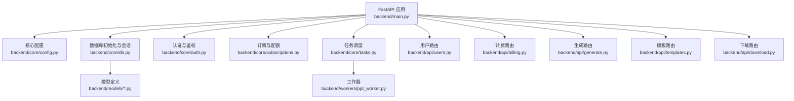
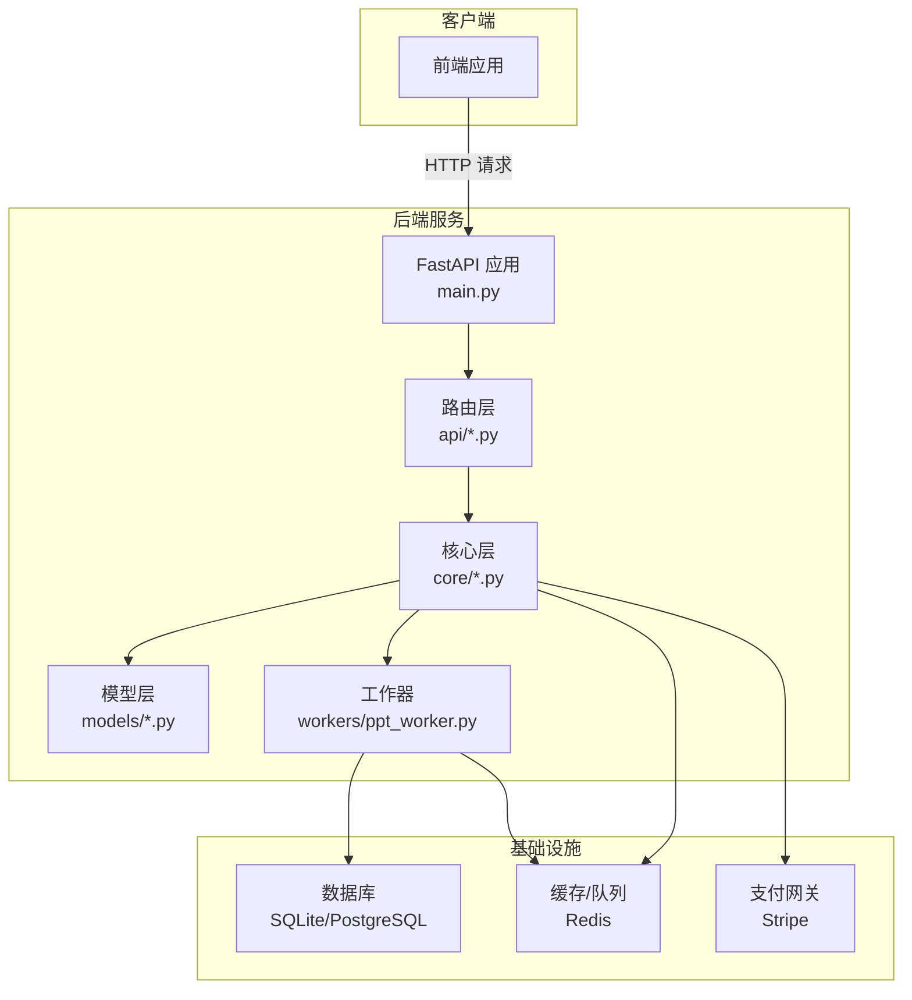
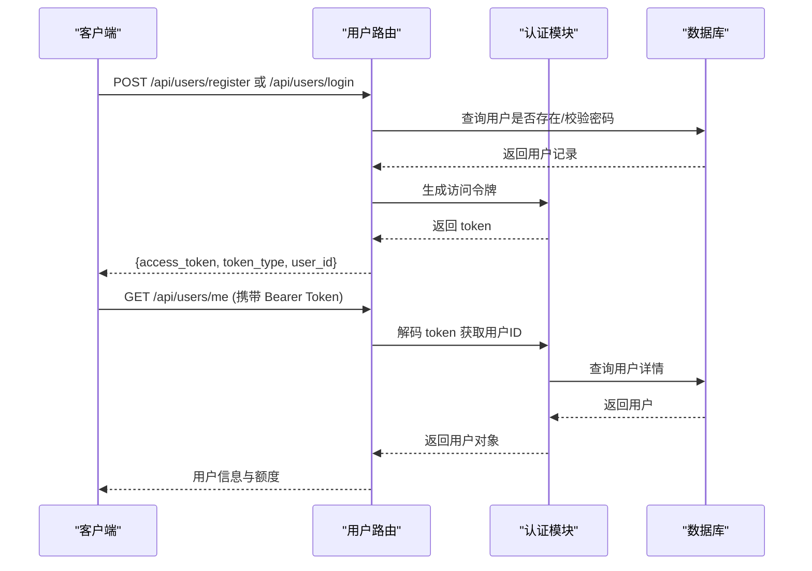
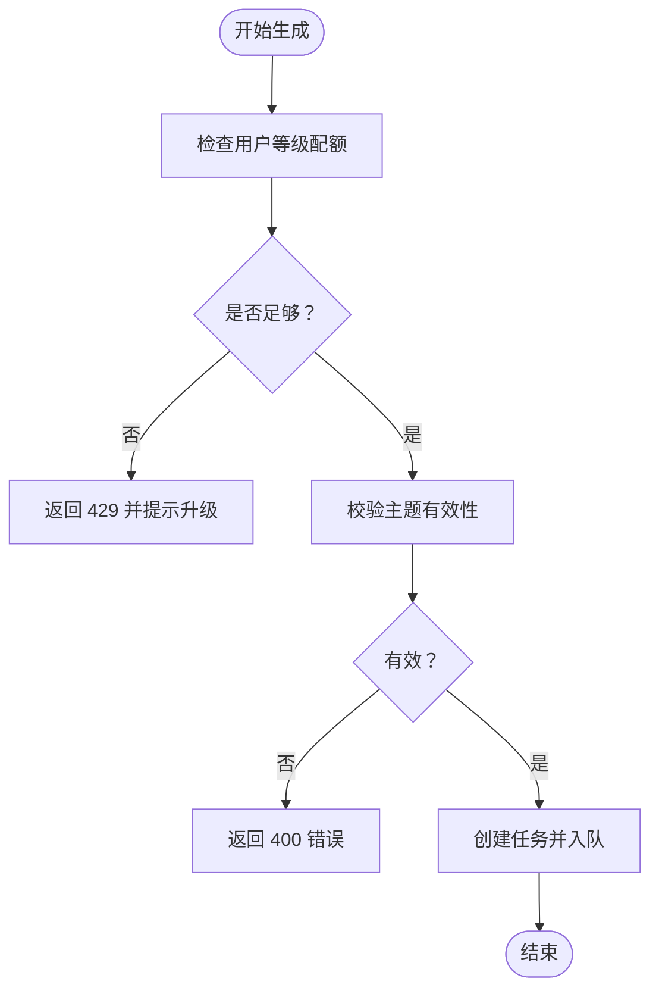
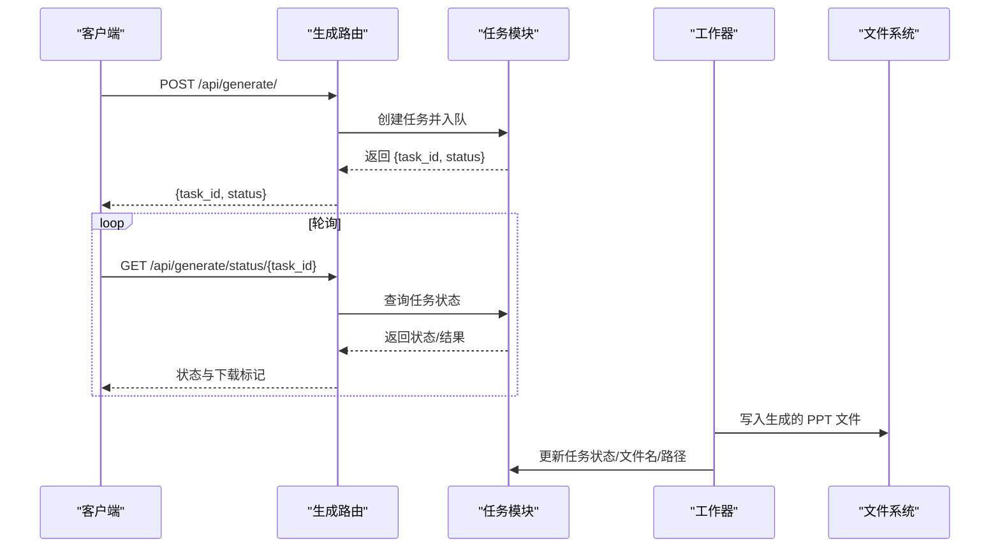
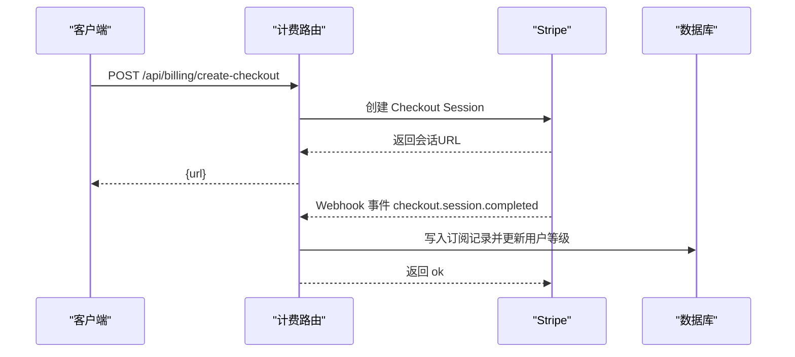
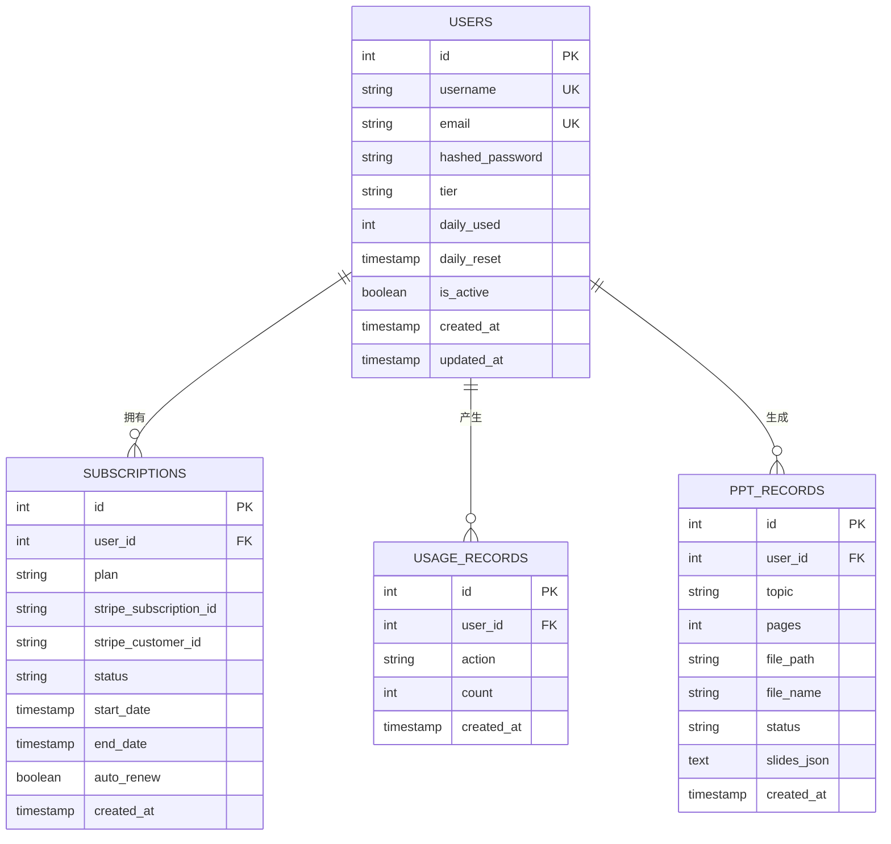
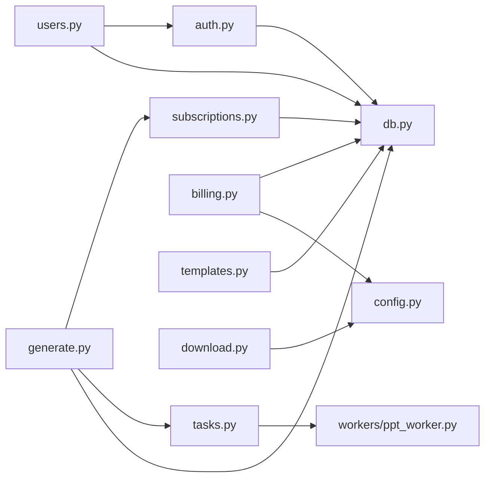

# 后端服务

<cite>
**本文引用的文件**
- [backend/main.py](file://backend/main.py)
- [backend/demo_local.py](file://backend/demo_local.py)
- [backend/core/config.py](file://backend/core/config.py)
- [backend/core/db.py](file://backend/core/db.py)
- [backend/core/auth.py](file://backend/core/auth.py)
- [backend/core/subscriptions.py](file://backend/core/subscriptions.py)
- [backend/core/tasks.py](file://backend/core/tasks.py)
- [backend/api/users.py](file://backend/api/users.py)
- [backend/api/billing.py](file://backend/api/billing.py)
- [backend/api/generate.py](file://backend/api/generate.py)
- [backend/api/templates.py](file://backend/api/templates.py)
- [backend/api/download.py](file://backend/api/download.py)
- [backend/models/user.py](file://backend/models/user.py)
- [backend/models/ppt.py](file://backend/models/ppt.py)
- [backend/models/subscription.py](file://backend/models/subscription.py)
- [backend/workers/ppt_worker.py](file://backend/workers/ppt_worker.py)
</cite>

## 目录
1. [简介](#简介)
2. [项目结构](#项目结构)
3. [核心组件](#核心组件)
4. [架构总览](#架构总览)
5. [详细组件分析](#详细组件分析)
6. [依赖关系分析](#依赖关系分析)
7. [性能与并发特性](#性能与并发特性)
8. [故障排查指南](#故障排查指南)
9. [结论](#结论)
10. [附录：API 接口文档](#附录api-接口文档)

## 简介
本项目是 AI-PPT 后端服务，基于 FastAPI 构建，提供用户管理、认证授权、订阅计费、PPT 生成任务调度与下载等能力。系统采用异步数据库访问（SQLAlchemy Async）、JWT 认证、本地内存任务队列与 Celery/Redis 的可扩展架构思路，并通过模板市场与引擎模块完成 PPT 内容生成。

## 项目结构
后端主要目录与职责概览：
- backend/main.py：应用入口，注册中间件与路由，健康检查
- backend/core/*：核心配置、数据库、认证、订阅策略、任务调度
- backend/api/*：用户、计费、生成、模板、下载等业务路由
- backend/models/*：用户、PPT 记录、订阅与用量记录的 ORM 模型
- backend/workers/ppt_worker.py：PPT 异步生成工作器（与 Celery/Redis 集成点）
- backend/demo_local.py：演示脚本，展示如何调用引擎构建 PPT

图表来源
- [backend/main.py:1-40](file://backend/main.py#L1-L40)
- [backend/core/config.py:1-34](file://backend/core/config.py#L1-L34)
- [backend/core/db.py:1-27](file://backend/core/db.py#L1-L27)
- [backend/core/auth.py:1-57](file://backend/core/auth.py#L1-L57)
- [backend/core/subscriptions.py:1-58](file://backend/core/subscriptions.py#L1-L58)
- [backend/core/tasks.py:1-33](file://backend/core/tasks.py#L1-L33)
- [backend/api/users.py:1-75](file://backend/api/users.py#L1-L75)
- [backend/api/billing.py:1-80](file://backend/api/billing.py#L1-L80)
- [backend/api/generate.py:1-52](file://backend/api/generate.py#L1-L52)
- [backend/api/templates.py:1-20](file://backend/api/templates.py#L1-L20)
- [backend/api/download.py:1-15](file://backend/api/download.py#L1-L15)
- [backend/models/user.py:1-21](file://backend/models/user.py#L1-L21)
- [backend/models/ppt.py:1-18](file://backend/models/ppt.py#L1-L18)
- [backend/models/subscription.py:1-29](file://backend/models/subscription.py#L1-L29)
- [backend/workers/ppt_worker.py](file://backend/workers/ppt_worker.py)

章节来源
- [backend/main.py:1-40](file://backend/main.py#L1-L40)
- [backend/core/config.py:1-34](file://backend/core/config.py#L1-L34)

## 核心组件
- 应用生命周期与中间件
  - 使用 lifespan 在启动时初始化数据库
  - 注册 CORS 中间件，允许任意来源跨域
  - 包含用户、计费、模板、生成、下载路由
- 配置中心
  - 读取 .env 文件，集中管理数据库、Redis、JWT、Stripe、输出目录等配置
- 数据库层
  - 基于 SQLAlchemy Async 的异步引擎与会话工厂
  - 初始化所有模型表结构
- 认证与授权
  - bcrypt 密码哈希与校验
  - JWT 令牌签发与解码，Bearer 方式鉴权
  - 依赖注入获取当前用户
- 订阅与配额
  - 不同等级（free/pro/school）的日生成上限与功能差异
  - 用量记录与每日重置逻辑
- 任务调度
  - 本地内存任务存储与异步执行
  - 与工作器对接，支持状态查询与结果回传

章节来源
- [backend/main.py:10-40](file://backend/main.py#L10-L40)
- [backend/core/config.py:4-34](file://backend/core/config.py#L4-L34)
- [backend/core/db.py:1-27](file://backend/core/db.py#L1-L27)
- [backend/core/auth.py:1-57](file://backend/core/auth.py#L1-L57)
- [backend/core/subscriptions.py:10-58](file://backend/core/subscriptions.py#L10-L58)
- [backend/core/tasks.py:1-33](file://backend/core/tasks.py#L1-L33)

## 架构总览
整体架构由“Web 层（FastAPI）—业务层（API 路由）—核心层（认证/订阅/任务）—数据层（ORM/数据库/Redis）”构成。生成流程采用异步任务队列思想：前端提交生成请求后，后端返回任务 ID；工作器在后台异步执行生成，状态通过内存存储或 Redis 查询。

图表来源
- [backend/main.py:16-39](file://backend/main.py#L16-L39)
- [backend/api/generate.py:20-35](file://backend/api/generate.py#L20-L35)
- [backend/core/tasks.py:14-28](file://backend/core/tasks.py#L14-L28)
- [backend/workers/ppt_worker.py](file://backend/workers/ppt_worker.py)

## 详细组件分析

### 用户管理与认证授权
- 路由与模型
  - 用户注册/登录：校验唯一性、密码哈希、签发 JWT
  - 当前用户信息：返回用户等级、日使用量与限额
- 认证流程
  - 客户端携带 Authorization: Bearer <token>
  - 服务端解码 JWT 获取用户 ID，从数据库加载用户对象
- 安全要点
  - 密码使用 bcrypt 存储
  - JWT 秘钥与算法在配置中集中管理
  - 401/404 细化错误提示

图表来源
- [backend/api/users.py:34-74](file://backend/api/users.py#L34-L74)
- [backend/core/auth.py:47-56](file://backend/core/auth.py#L47-L56)
- [backend/core/db.py:13-18](file://backend/core/db.py#L13-L18)

章节来源
- [backend/api/users.py:1-75](file://backend/api/users.py#L1-L75)
- [backend/core/auth.py:1-57](file://backend/core/auth.py#L1-L57)

### 订阅与配额控制
- 策略
  - 不同等级拥有不同日生成上限与功能集合
  - 生成请求前检查配额，不足则拒绝
  - 成功生成后记录用量并持久化
- 关键函数
  - 获取等级限额与功能列表
  - 检查是否超出当日配额
  - 增加用量并写入用量记录

图表来源
- [backend/api/generate.py:20-35](file://backend/api/generate.py#L20-L35)
- [backend/core/subscriptions.py:46-57](file://backend/core/subscriptions.py#L46-L57)

章节来源
- [backend/core/subscriptions.py:10-58](file://backend/core/subscriptions.py#L10-L58)
- [backend/api/generate.py:1-52](file://backend/api/generate.py#L1-L52)

### 任务调度与异步生成
- 设计
  - 任务以字典形式存储在内存（可替换为 Redis/Celery）
  - 提交后立即返回任务 ID 与初始状态
  - 前端轮询 /api/generate/status/{task_id} 获取进度/结果
- 工作器
  - 从任务存储取出任务，异步执行生成
  - 更新状态、文件路径、错误信息等字段
- 可扩展性
  - 将 TASK_STORE 替换为 Redis/数据库
  - 将 run_worker 迁移至 Celery Worker，结合 Redis Broker

图表来源
- [backend/api/generate.py:20-51](file://backend/api/generate.py#L20-L51)
- [backend/core/tasks.py:14-32](file://backend/core/tasks.py#L14-L32)
- [backend/workers/ppt_worker.py](file://backend/workers/ppt_worker.py)

章节来源
- [backend/core/tasks.py:1-33](file://backend/core/tasks.py#L1-L33)
- [backend/api/generate.py:1-52](file://backend/api/generate.py#L1-L52)

### 计费与 Webhook
- 结账创建
  - 根据计划映射价格，调用 Stripe 创建会话
  - 返回前端跳转 URL
- Webhook 处理
  - 校验签名，解析事件类型
  - 订单完成后创建订阅记录并更新用户等级
- 安全
  - 使用配置中的 webhook 秘钥进行验证
  - 对异常场景返回明确错误

图表来源
- [backend/api/billing.py:14-79](file://backend/api/billing.py#L14-L79)
- [backend/core/config.py:18-19](file://backend/core/config.py#L18-L19)

章节来源
- [backend/api/billing.py:1-80](file://backend/api/billing.py#L1-L80)
- [backend/core/config.py:18-19](file://backend/core/config.py#L18-L19)

### 模板市场与下载
- 模板列表与详情
  - 加载模板目录并返回给前端
- 下载
  - 校验输出目录下文件是否存在
  - 返回二进制流供浏览器下载

章节来源
- [backend/api/templates.py:1-20](file://backend/api/templates.py#L1-L20)
- [backend/api/download.py:1-15](file://backend/api/download.py#L1-L15)

### 数据模型设计
- 用户表
  - 字段：自增主键、用户名/邮箱唯一、哈希密码、等级、日使用量与重置时间、活跃状态、时间戳
- PPT 记录表
  - 字段：外键关联用户、主题、页数、文件路径/名称、状态、幻灯片 JSON、时间戳
- 订阅与用量
  - 订阅：外键用户、计划、Stripe 订阅/客户 ID、状态、起止时间、自动续费、时间戳
  - 用量记录：动作类型、数量、时间戳

图表来源
- [backend/models/user.py:6-21](file://backend/models/user.py#L6-L21)
- [backend/models/ppt.py:6-18](file://backend/models/ppt.py#L6-L18)
- [backend/models/subscription.py:6-29](file://backend/models/subscription.py#L6-L29)

章节来源
- [backend/models/user.py:1-21](file://backend/models/user.py#L1-L21)
- [backend/models/ppt.py:1-18](file://backend/models/ppt.py#L1-L18)
- [backend/models/subscription.py:1-29](file://backend/models/subscription.py#L1-L29)

## 依赖关系分析
- 组件耦合
  - API 路由依赖认证、订阅、任务与数据库会话
  - 认证依赖配置与数据库
  - 任务模块依赖工作器与存储（可替换为 Redis/Celery）
  - 计费依赖 Stripe SDK 与数据库
- 外部依赖
  - 数据库：SQLAlchemy Async（SQLite/PostgreSQL）
  - 缓存/队列：Redis（当前为内存存储，建议迁移）
  - 支付：Stripe
  - 加密：bcrypt、PyJWT
- 潜在循环依赖
  - 当前未发现直接循环导入；注意避免在 core 与 api 之间互相导入

图表来源
- [backend/api/users.py:1-75](file://backend/api/users.py#L1-L75)
- [backend/api/generate.py:1-52](file://backend/api/generate.py#L1-L52)
- [backend/api/billing.py:1-80](file://backend/api/billing.py#L1-L80)
- [backend/api/templates.py:1-20](file://backend/api/templates.py#L1-L20)
- [backend/api/download.py:1-15](file://backend/api/download.py#L1-L15)
- [backend/core/auth.py:1-57](file://backend/core/auth.py#L1-L57)
- [backend/core/subscriptions.py:1-58](file://backend/core/subscriptions.py#L1-L58)
- [backend/core/tasks.py:1-33](file://backend/core/tasks.py#L1-L33)
- [backend/core/config.py:1-34](file://backend/core/config.py#L1-L34)
- [backend/workers/ppt_worker.py](file://backend/workers/ppt_worker.py)

章节来源
- [backend/core/db.py:1-27](file://backend/core/db.py#L1-L27)
- [backend/core/config.py:1-34](file://backend/core/config.py#L1-L34)

## 性能与并发特性
- 异步数据库
  - 使用 SQLAlchemy Async 降低阻塞，提升高并发下的吞吐
- 任务执行
  - 本地内存任务存储适合小规模测试；生产环境建议迁移到 Redis + Celery
- 缓存与限流
  - 可在任务状态查询与用户信息上引入 Redis 缓存
  - 配额检查可在缓存中做原子计数，减少数据库压力
- I/O 密集
  - PPT 生成涉及磁盘写入与外部服务调用，应尽量异步化并设置超时

[本节为通用指导，不直接分析具体文件]

## 故障排查指南
- 认证失败
  - 确认 Authorization 头格式为 Bearer <token>
  - 检查 JWT 秘钥、算法与过期时间配置
  - 核对用户是否存在且未被禁用
- 生成受限
  - 检查用户等级与日配额
  - 确认主题长度与格式
- 任务状态异常
  - 核对任务 ID 是否正确
  - 若使用内存存储，确认服务重启导致的任务丢失
- 下载失败
  - 确认输出目录与文件名
  - 检查文件是否存在与权限

章节来源
- [backend/core/auth.py:35-56](file://backend/core/auth.py#L35-L56)
- [backend/api/generate.py:26-32](file://backend/api/generate.py#L26-L32)
- [backend/api/download.py:10-14](file://backend/api/download.py#L10-L14)

## 结论
本后端服务以 FastAPI 为核心，围绕用户、认证、订阅、任务与数据模型构建了清晰的分层架构。通过异步数据库与可替换的任务存储，系统具备良好的扩展性。建议在生产环境中：
- 将任务存储迁移至 Redis/Celery
- 引入缓存与限流策略
- 完善监控与日志
- 增强安全与合规（如 HTTPS、CSRF、速率限制）

[本节为总结性内容，不直接分析具体文件]

## 附录：API 接口文档

- 健康检查
  - 方法：GET
  - 路径：/api/health
  - 认证：无需
  - 响应：应用名称与版本

- 用户
  - 注册
    - 方法：POST
    - 路径：/api/users/register
    - 认证：无需
    - 请求体：用户名、邮箱、密码
    - 响应：访问令牌、类型与用户 ID
  - 登录
    - 方法：POST
    - 路径：/api/users/login
    - 认证：无需
    - 请求体：用户名、密码
    - 响应：访问令牌、类型与用户 ID
  - 当前用户
    - 方法：GET
    - 路径：/api/users/me
    - 认证：Bearer
    - 响应：用户信息与等级、日使用量与限额

- 计费
  - 创建结账会话
    - 方法：POST
    - 路径：/api/billing/create-checkout
    - 认证：Bearer
    - 参数：plan（pro_monthly/pro_yearly/school_yearly）
    - 响应：跳转 URL
  - Webhook
    - 方法：POST
    - 路径：/api/billing/webhook
    - 认证：Stripe 签名校验
    - 请求：事件负载与签名头
    - 响应：ok

- 生成
  - 提交生成任务
    - 方法：POST
    - 路径：/api/generate/
    - 认证：Bearer
    - 请求体：主题、模板 ID（可选）、页数（可选）
    - 响应：任务 ID 与初始状态
  - 查询任务状态
    - 方法：GET
    - 路径：/api/generate/status/{task_id}
    - 认证：Bearer
    - 响应：状态、文件名/路径、是否可下载、结果与进度、错误信息

- 模板
  - 列出模板
    - 方法：GET
    - 路径：/api/templates/
    - 认证：无需
    - 响应：模板列表
  - 模板详情
    - 方法：GET
    - 路径：/api/templates/{template_id}
    - 认证：无需
    - 响应：模板详情或错误

- 下载
  - 下载 PPT
    - 方法：GET
    - 路径：/api/download/{file_name}
    - 认证：无需
    - 响应：PPT 文件流

章节来源
- [backend/main.py:37-39](file://backend/main.py#L37-L39)
- [backend/api/users.py:34-74](file://backend/api/users.py#L34-L74)
- [backend/api/billing.py:14-79](file://backend/api/billing.py#L14-L79)
- [backend/api/generate.py:20-51](file://backend/api/generate.py#L20-L51)
- [backend/api/templates.py:9-19](file://backend/api/templates.py#L9-L19)
- [backend/api/download.py:9-14](file://backend/api/download.py#L9-L14)