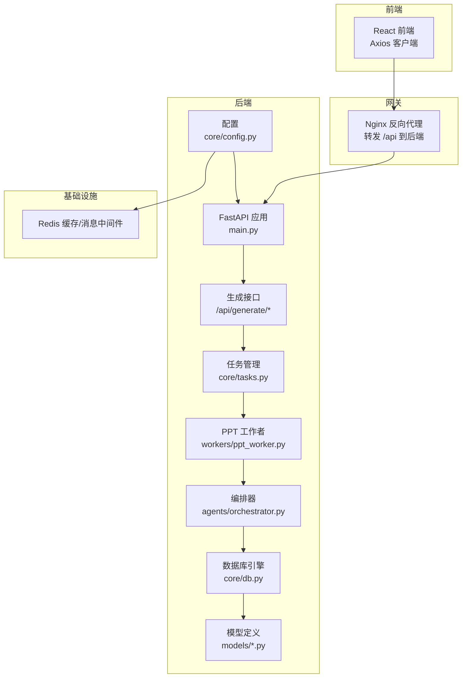
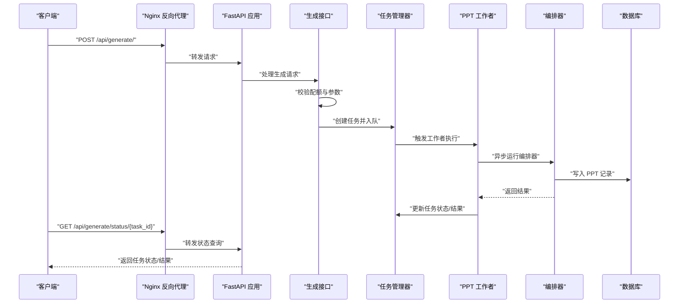
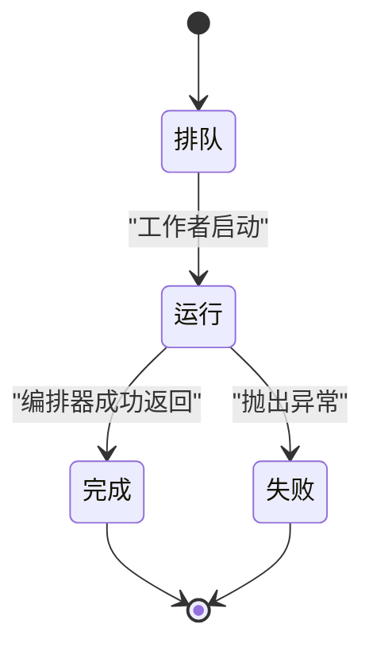
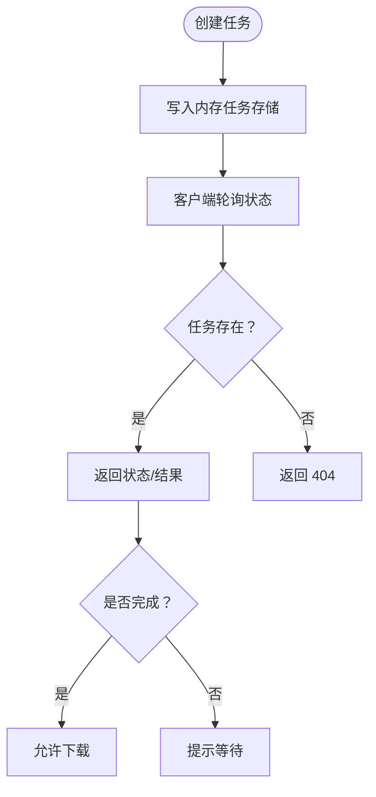
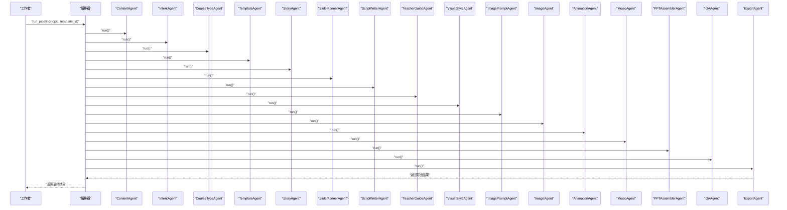
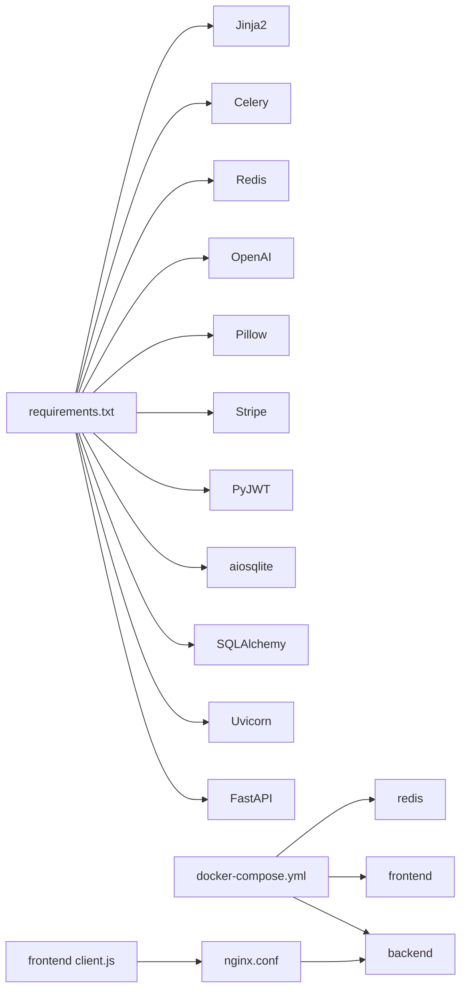

# 异步任务处理

<cite>
**本文引用的文件**
- [backend/core/tasks.py](file://backend/core/tasks.py)
- [backend/workers/ppt_worker.py](file://backend/workers/ppt_worker.py)
- [backend/api/generate.py](file://backend/api/generate.py)
- [backend/main.py](file://backend/main.py)
- [backend/core/config.py](file://backend/core/config.py)
- [backend/core/db.py](file://backend/core/db.py)
- [backend/models/ppt.py](file://backend/models/ppt.py)
- [backend/models/subscription.py](file://backend/models/subscription.py)
- [backend/core/subscriptions.py](file://backend/core/subscriptions.py)
- [backend/agents/orchestrator.py](file://backend/agents/orchestrator.py)
- [backend/Dockerfile](file://backend/Dockerfile)
- [backend/requirements.txt](file://backend/requirements.txt)
- [deployment/docker-compose.yml](file://deployment/docker-compose.yml)
- [deployment/nginx.conf](file://deployment/nginx.conf)
- [frontend/src/api/client.js](file://frontend/src/api/client.js)
- [media-service/image_gen.py](file://media-service/image_gen.py)
- [media-service/audio_gen.py](file://media-service/audio_gen.py)
</cite>

## 目录
1. [简介](#简介)
2. [项目结构](#项目结构)
3. [核心组件](#核心组件)
4. [架构总览](#架构总览)
5. [详细组件分析](#详细组件分析)
6. [依赖分析](#依赖分析)
7. [性能考量](#性能考量)
8. [故障排查指南](#故障排查指南)
9. [结论](#结论)
10. [附录](#附录)

## 简介
本技术文档聚焦于 AI-PPT 的异步任务处理系统，系统采用轻量级内存态任务存储与本地事件循环驱动的任务执行模型，结合 FastAPI 提供任务提交与状态查询接口，并通过 Redis 作为可选外部缓存与消息中间件基础设施。文档将深入解析任务生命周期、状态跟踪、结果存储、错误重试与超时策略、任务分发与并发控制、监控与性能分析以及优化与成本控制建议。

## 项目结构
后端以 FastAPI 应用为核心入口，提供生成任务的提交与状态查询接口；任务本身由本地协程驱动的工作者执行，任务元数据保存在内存字典中；数据库用于持久化用户、订阅与 PPT 记录；部署层通过 Docker Compose 启动后端、前端与 Redis；Nginx 作为反向代理转发 /api 请求至后端；前端通过 Axios 客户端访问后端接口。

图表来源
- [backend/main.py:16-40](file://backend/main.py#L16-L40)
- [backend/api/generate.py:20-52](file://backend/api/generate.py#L20-L52)
- [backend/core/tasks.py:8-33](file://backend/core/tasks.py#L8-L33)
- [backend/workers/ppt_worker.py:5-24](file://backend/workers/ppt_worker.py#L5-L24)
- [backend/agents/orchestrator.py:19-56](file://backend/agents/orchestrator.py#L19-L56)
- [backend/core/db.py:5-27](file://backend/core/db.py#L5-L27)
- [backend/models/ppt.py:6-18](file://backend/models/ppt.py#L6-L18)
- [backend/core/config.py:11-12](file://backend/core/config.py#L11-L12)
- [deployment/docker-compose.yml:31-39](file://deployment/docker-compose.yml#L31-L39)
- [deployment/nginx.conf:12-20](file://deployment/nginx.conf#L12-L20)

章节来源
- [backend/main.py:16-40](file://backend/main.py#L16-L40)
- [deployment/docker-compose.yml:31-39](file://deployment/docker-compose.yml#L31-L39)
- [deployment/nginx.conf:12-20](file://deployment/nginx.conf#L12-L20)

## 核心组件
- 任务管理器：负责创建任务、维护任务状态、触发工作者执行。
- PPT 工作者：从任务存储读取任务并异步运行编排器，更新任务状态与结果。
- 编排器：按顺序调用内容、模板、脚本、图片、动画、音乐等子代理，最终导出 PPT 并返回结果。
- 生成接口：接收请求，校验配额，创建任务并返回任务 ID。
- 数据库与模型：持久化用户、订阅与 PPT 记录。
- 配置与环境：数据库与 Redis 连接字符串、输出目录等。
- 媒体服务：图片搜索与背景音乐下载（异步 HTTP 客户端）。

章节来源
- [backend/core/tasks.py:8-33](file://backend/core/tasks.py#L8-L33)
- [backend/workers/ppt_worker.py:5-24](file://backend/workers/ppt_worker.py#L5-L24)
- [backend/agents/orchestrator.py:19-56](file://backend/agents/orchestrator.py#L19-L56)
- [backend/api/generate.py:20-52](file://backend/api/generate.py#L20-L52)
- [backend/core/db.py:5-27](file://backend/core/db.py#L5-L27)
- [backend/models/ppt.py:6-18](file://backend/models/ppt.py#L6-L18)
- [backend/core/config.py:11-12](file://backend/core/config.py#L11-L12)
- [media-service/image_gen.py:6-26](file://media-service/image_gen.py#L6-L26)
- [media-service/audio_gen.py:12-34](file://media-service/audio_gen.py#L12-L34)

## 架构总览
系统采用“请求即任务”的模式：客户端提交生成请求，后端创建任务并立即启动工作者异步执行；工作者在运行过程中更新任务状态与结果；客户端轮询状态接口获取进度与结果。Redis 在当前代码中未被直接使用，但配置中已预留连接地址，可作为后续扩展的消息中间件或缓存层。

图表来源
- [backend/api/generate.py:20-52](file://backend/api/generate.py#L20-L52)
- [backend/core/tasks.py:8-33](file://backend/core/tasks.py#L8-L33)
- [backend/workers/ppt_worker.py:5-24](file://backend/workers/ppt_worker.py#L5-L24)
- [backend/agents/orchestrator.py:19-56](file://backend/agents/orchestrator.py#L19-L56)
- [backend/core/db.py:21-27](file://backend/core/db.py#L21-L27)
- [deployment/nginx.conf:12-20](file://deployment/nginx.conf#L12-L20)

## 详细组件分析

### 任务生命周期与状态机
- 任务创建：生成接口校验用户配额与输入参数后，调用任务管理器创建任务，设置初始状态为“排队”。
- 任务执行：工作者从任务存储读取任务，将其状态更新为“运行”，随后异步执行编排器。
- 结果回填：编排器成功完成后，工作者将文件路径、文件名与完整结果写回任务；异常时记录错误信息并标记为“失败”。

图表来源
- [backend/core/tasks.py:14-28](file://backend/core/tasks.py#L14-L28)
- [backend/workers/ppt_worker.py:8-23](file://backend/workers/ppt_worker.py#L8-L23)

章节来源
- [backend/core/tasks.py:8-33](file://backend/core/tasks.py#L8-L33)
- [backend/workers/ppt_worker.py:5-24](file://backend/workers/ppt_worker.py#L5-L24)

### 任务状态跟踪与结果存储
- 内存态任务存储：使用全局字典保存任务元数据，包含任务 ID、状态、主题、用户 ID、模板 ID、页面数、结果与错误信息。
- 状态查询接口：根据任务 ID 返回状态、文件路径、文件名、是否可下载、结果摘要与错误详情。
- 数据库存储：PPT 记录模型持久化生成结果，便于后续下载与审计。

图表来源
- [backend/core/tasks.py:5-33](file://backend/core/tasks.py#L5-L33)
- [backend/api/generate.py:38-52](file://backend/api/generate.py#L38-L52)
- [backend/models/ppt.py:6-18](file://backend/models/ppt.py#L6-L18)

章节来源
- [backend/core/tasks.py:5-33](file://backend/core/tasks.py#L5-L33)
- [backend/api/generate.py:38-52](file://backend/api/generate.py#L38-L52)
- [backend/models/ppt.py:6-18](file://backend/models/ppt.py#L6-L18)

### PPT 生成任务的编排流程
编排器按顺序调用多个代理组件，形成完整的 PPT 生成流水线：内容生成 → 意图识别 → 课程类型 → 模板选择 → 故事线 → 分镜规划 → 脚本写作 → 教师指导 → 视觉风格 → 图片提示 → 图片生成 → 动画 → 音乐 → 组装 → 质量检查 → 导出。

图表来源
- [backend/agents/orchestrator.py:19-56](file://backend/agents/orchestrator.py#L19-L56)

章节来源
- [backend/agents/orchestrator.py:19-56](file://backend/agents/orchestrator.py#L19-L56)

### 任务分发、负载均衡与并发控制
- 本地事件循环：工作者通过事件循环创建任务并执行，适合单进程场景。
- 并发模型：工作者内部未显式限制并发数量，实际并发取决于事件循环与异步 I/O 行为。
- 扩展建议：若需多进程/多实例扩展，可在现有基础上引入 Celery 与 Redis 作为消息中间件，实现跨进程任务分发与负载均衡。

章节来源
- [backend/workers/ppt_worker.py:5-24](file://backend/workers/ppt_worker.py#L5-L24)
- [backend/core/tasks.py:8-11](file://backend/core/tasks.py#L8-L11)

### 错误重试与超时处理
- 错误捕获：工作者在执行编排器时捕获异常，将任务状态置为“失败”，并将错误信息写回任务。
- 超时策略：当前实现未显式设置超时时间；建议在编排器或工作者中增加超时控制，避免长时间阻塞。
- 重试机制：当前未实现自动重试；建议在引入 Celery 后利用其内置重试与死信队列能力。

章节来源
- [backend/workers/ppt_worker.py:20-23](file://backend/workers/ppt_worker.py#L20-L23)

### Redis 使用现状与扩展
- 当前使用：配置中定义了 Redis 连接地址，但代码中未直接使用 Redis。
- 推荐用途：作为 Celery 的 broker/back-end，实现任务队列、分布式调度与状态持久化；也可作为应用缓存加速热点数据访问。

章节来源
- [backend/core/config.py:11-12](file://backend/core/config.py#L11-L12)
- [backend/requirements.txt:19-20](file://backend/requirements.txt#L19-L20)

### 媒体服务与异步 I/O
- 图片生成：基于异步 HTTP 客户端批量抓取图片，支持并发请求与目录组织。
- 音乐下载：随机选择背景音乐并异步下载到本地，具备缓存命中逻辑。

章节来源
- [media-service/image_gen.py:6-26](file://media-service/image_gen.py#L6-L26)
- [media-service/audio_gen.py:12-34](file://media-service/audio_gen.py#L12-L34)

## 依赖分析
- 后端运行时：Python 3.12，FastAPI，Uvicorn，SQLAlchemy，aiosqlite，PyJWT，Stripe，Pillow，OpenAI，Redis，Celery，Jinja2。
- 部署与网络：Docker Compose 启动后端、前端与 Redis；Nginx 反向代理 /api 请求。
- 前端交互：Axios 客户端统一注入认证头，设置超时与 401 自动跳转。

图表来源
- [backend/requirements.txt:1-22](file://backend/requirements.txt#L1-L22)
- [deployment/docker-compose.yml:31-39](file://deployment/docker-compose.yml#L31-L39)
- [deployment/nginx.conf:12-20](file://deployment/nginx.conf#L12-L20)
- [frontend/src/api/client.js:3-27](file://frontend/src/api/client.js#L3-L27)

章节来源
- [backend/requirements.txt:1-22](file://backend/requirements.txt#L1-L22)
- [deployment/docker-compose.yml:31-39](file://deployment/docker-compose.yml#L31-L39)
- [deployment/nginx.conf:12-20](file://deployment/nginx.conf#L12-L20)
- [frontend/src/api/client.js:3-27](file://frontend/src/api/client.js#L3-L27)

## 性能考量
- I/O 密集优化：编排器与媒体服务均为异步 I/O，充分利用事件循环提升吞吐。
- 并发控制：建议在工作者中增加并发上限，避免同时过多任务占用 CPU/内存。
- 资源隔离：将图片与音频下载独立为外部服务，减少主流程阻塞。
- 缓存策略：对重复的图片与模板进行缓存，降低重复生成开销。
- 数据库写入：批量写入与事务合并，减少锁竞争与磁盘 IO。

## 故障排查指南
- 任务状态异常
  - 症状：状态长期为“排队”或“运行”。
  - 排查：确认工作者是否被正确触发；检查事件循环是否正常运行。
- 生成失败
  - 症状：状态为“失败”，错误信息为空。
  - 排查：查看工作者日志与异常堆栈；确认编排器各阶段输入输出。
- 下载链接无效
  - 症状：状态为“完成”，但文件路径为空。
  - 排查：确认导出阶段是否成功；核对输出目录权限与路径。
- Redis 相关问题
  - 症状：无法连接或性能异常。
  - 排查：检查 Redis 连接地址与认证；评估内存与持久化策略。
- 前端请求失败
  - 症状：状态查询返回连接被拒绝。
  - 排查：确认 Nginx 是否正确代理 /api；后端服务是否启动；容器网络连通性。

章节来源
- [backend/workers/ppt_worker.py:20-23](file://backend/workers/ppt_worker.py#L20-L23)
- [deployment/nginx.conf:12-20](file://deployment/nginx.conf#L12-L20)
- [frontend/vite.err:1-4](file://frontend/vite.err#L1-L4)

## 结论
当前系统以轻量内存任务存储与本地事件循环为基础，实现了 PPT 异步生成的核心能力。为进一步提升可靠性与可扩展性，建议引入 Celery + Redis 实现分布式任务队列与状态持久化，完善超时与重试机制，并结合缓存与并发控制策略优化整体性能与成本。

## 附录
- 部署与运行
  - 使用 Docker Compose 启动后端、前端与 Redis。
  - Nginx 将 /api 请求转发至后端服务。
  - 前端通过 Axios 客户端访问后端接口。
- 配置项参考
  - 数据库 URL、Redis URL、输出目录、上传目录、代理地址等。
- 媒体服务
  - 图片搜索与下载、背景音乐下载，均采用异步 HTTP 客户端实现。

章节来源
- [deployment/docker-compose.yml:31-39](file://deployment/docker-compose.yml#L31-L39)
- [deployment/nginx.conf:12-20](file://deployment/nginx.conf#L12-L20)
- [frontend/src/api/client.js:3-27](file://frontend/src/api/client.js#L3-L27)
- [backend/core/config.py:11-27](file://backend/core/config.py#L11-L27)
- [media-service/image_gen.py:6-26](file://media-service/image_gen.py#L6-L26)
- [media-service/audio_gen.py:12-34](file://media-service/audio_gen.py#L12-L34)