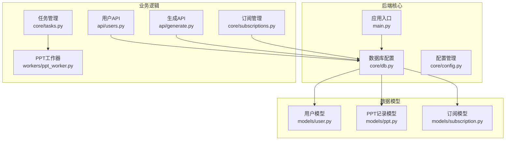
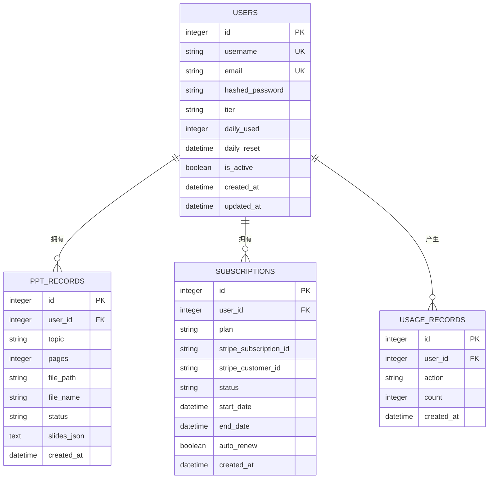
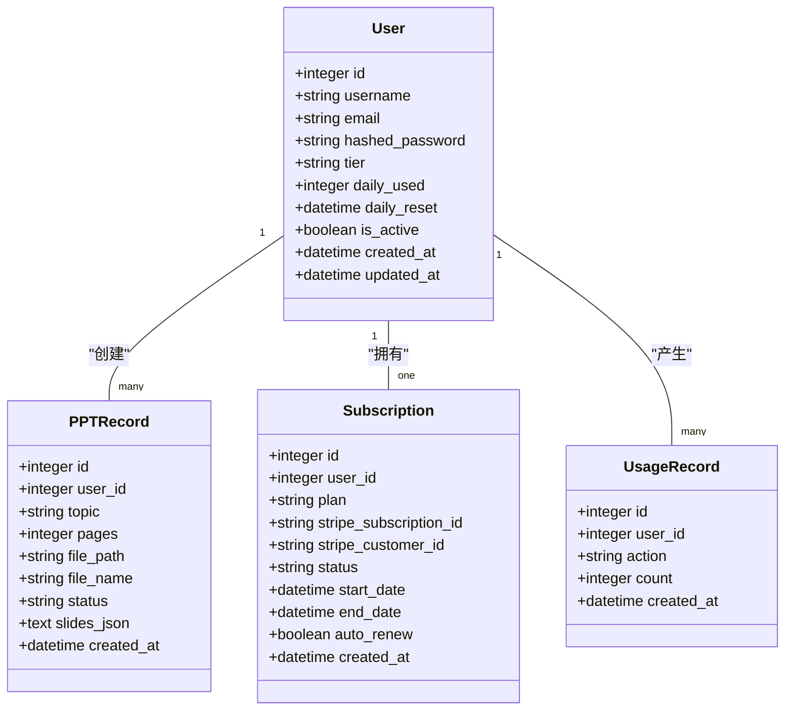
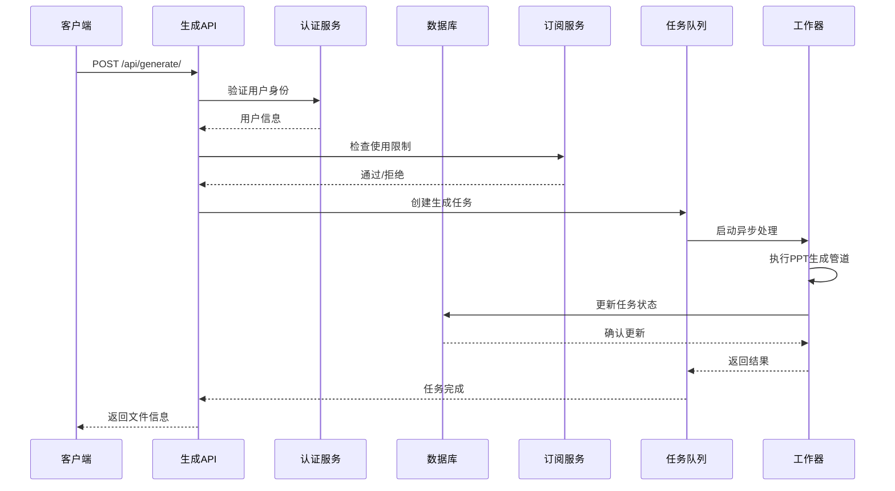
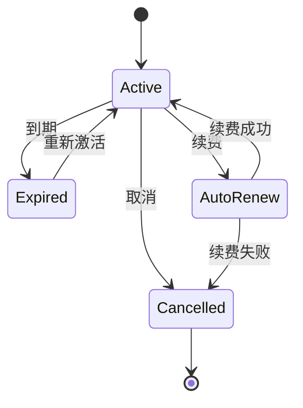
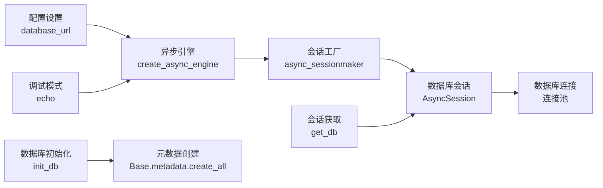
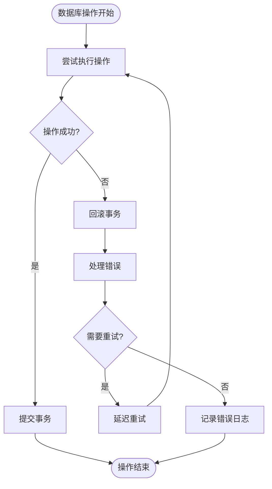

# 数据库关系设计

<cite>
**本文档引用的文件**
- [db.py](file://backend/core/db.py)
- [config.py](file://backend/core/config.py)
- [user.py](file://backend/models/user.py)
- [ppt.py](file://backend/models/ppt.py)
- [subscription.py](file://backend/models/subscription.py)
- [users.py](file://backend/api/users.py)
- [generate.py](file://backend/api/generate.py)
- [subscriptions.py](file://backend/core/subscriptions.py)
- [tasks.py](file://backend/core/tasks.py)
- [ppt_worker.py](file://backend/workers/ppt_worker.py)
- [main.py](file://backend/main.py)
- [requirements.txt](file://backend/requirements.txt)
</cite>

## 目录
1. [引言](#引言)
2. [项目结构](#项目结构)
3. [核心组件](#核心组件)
4. [架构概览](#架构概览)
5. [详细组件分析](#详细组件分析)
6. [依赖关系分析](#依赖关系分析)
7. [性能考虑](#性能考虑)
8. [故障排除指南](#故障排除指南)
9. [结论](#结论)

## 引言

本文件为AI-PPT项目的数据库关系设计技术文档，专注于实体间的一对一、一对多、多对多关系映射与实现方式。文档深入解释了外键约束、引用完整性保证和关系维护策略，阐述了数据库连接管理、会话生命周期和事务处理机制，并提供了异步数据库操作、连接池配置和并发控制的实现细节。同时包含关系查询优化、JOIN策略和性能调优建议，以及数据一致性保证和错误处理机制。

## 项目结构

AI-PPT项目采用分层架构，数据库相关代码主要分布在以下目录：
- `backend/core/`: 核心数据库配置和会话管理
- `backend/models/`: SQLAlchemy ORM模型定义
- `backend/api/`: API端点实现
- `backend/core/`: 订阅管理和任务调度
- `backend/workers/`: 异步任务执行器

**图表来源**
- [db.py:1-27](file://backend/core/db.py#L1-L27)
- [config.py:1-34](file://backend/core/config.py#L1-L34)
- [user.py:1-21](file://backend/models/user.py#L1-L21)
- [ppt.py:1-18](file://backend/models/ppt.py#L1-L18)
- [subscription.py:1-29](file://backend/models/subscription.py#L1-L29)

**章节来源**
- [main.py:1-40](file://backend/main.py#L1-L40)
- [db.py:1-27](file://backend/core/db.py#L1-L27)
- [config.py:1-34](file://backend/core/config.py#L1-L34)

## 核心组件

### 数据库引擎与会话管理

项目使用SQLAlchemy 2.0的异步功能，通过`create_async_engine`创建异步数据库引擎，支持SQLite和PostgreSQL等数据库。

关键特性：
- 异步连接池管理
- 自动会话生命周期控制
- 连接超时和重试机制
- 调试模式下的SQL日志输出

### 模型定义规范

所有ORM模型继承自统一的Base类，确保一致的元数据管理和表结构定义。

**章节来源**
- [db.py:1-27](file://backend/core/db.py#L1-L27)
- [config.py:11](file://backend/core/config.py#L11)
- [requirements.txt:7-10](file://backend/requirements.txt#L7-L10)

## 架构概览

AI-PPT的数据库架构基于以下核心关系设计：

**图表来源**
- [user.py:6-21](file://backend/models/user.py#L6-L21)
- [ppt.py:6-18](file://backend/models/ppt.py#L6-L18)
- [subscription.py:6-19](file://backend/models/subscription.py#L6-L19)
- [subscription.py:21-29](file://backend/models/subscription.py#L21-L29)

## 详细组件分析

### 用户管理系统

用户系统是整个数据库关系的核心，负责用户身份认证、权限管理和使用统计。

#### 实体关系映射

**图表来源**
- [user.py:6-21](file://backend/models/user.py#L6-L21)
- [ppt.py:6-18](file://backend/models/ppt.py#L6-L18)
- [subscription.py:6-19](file://backend/models/subscription.py#L6-L19)
- [subscription.py:21-29](file://backend/models/subscription.py#L21-L29)

#### 外键约束与引用完整性

系统通过外键约束确保数据完整性：
- `PPTRecord.user_id` → `User.id` (级联删除)
- `Subscription.user_id` → `User.id` (级联删除)
- `UsageRecord.user_id` → `User.id` (级联删除)

这些约束保证了当用户被删除时，相关的PPT记录、订阅信息和使用记录也会被自动清理。

**章节来源**
- [ppt.py:10](file://backend/models/ppt.py#L10)
- [subscription.py:10](file://backend/models/subscription.py#L10)
- [subscription.py:25](file://backend/models/subscription.py#L25)

### PPT生成系统

PPT生成系统实现了从用户请求到最终文件输出的完整流程。

#### 生成流程序列图

**图表来源**
- [generate.py:20-35](file://backend/api/generate.py#L20-L35)
- [users.py:34-51](file://backend/api/users.py#L34-L51)
- [subscriptions.py:46-57](file://backend/core/subscriptions.py#L46-L57)
- [tasks.py:14-28](file://backend/core/tasks.py#L14-L28)
- [ppt_worker.py:5-24](file://backend/workers/ppt_worker.py#L5-L24)

#### 使用统计与配额管理

系统实现了基于用户层级的使用配额控制：

| 用户层级 | 日生成限制 | 特性权限 |
|---------|-----------|---------|
| Free | 3次/天 | 基础导出 |
| Pro | 100次/天 | 基础导出、教师指南、图片生成、动画、音乐 |
| School | 9999次/天 | 所有特性 |

**章节来源**
- [subscriptions.py:10-35](file://backend/core/subscriptions.py#L10-L35)
- [subscriptions.py:46-57](file://backend/core/subscriptions.py#L46-L57)

### 订阅与计费系统

订阅系统提供了灵活的付费方案和使用记录追踪。

#### 订阅状态流转

**图表来源**
- [subscription.py:14](file://backend/models/subscription.py#L14)

**章节来源**
- [subscription.py:6-19](file://backend/models/subscription.py#L6-L19)
- [subscription.py:21-29](file://backend/models/subscription.py#L21-L29)

## 依赖关系分析

### 数据库连接管理

项目采用异步连接池管理，通过以下组件实现：

**图表来源**
- [db.py:5](file://backend/core/db.py#L5)
- [db.py:6](file://backend/core/db.py#L6)
- [db.py:13-18](file://backend/core/db.py#L13-L18)
- [db.py:21-26](file://backend/core/db.py#L21-L26)

### 并发控制与事务处理

系统通过以下机制确保数据一致性和并发安全：

1. **异步事务管理**: 使用`AsyncSession`确保异步环境下的事务安全
2. **连接池配置**: 默认连接池大小适配单机部署需求
3. **会话生命周期**: 自动化的会话创建和销毁
4. **原子性操作**: 关键业务操作在单个事务中执行

**章节来源**
- [db.py:13-18](file://backend/core/db.py#L13-L18)
- [users.py:35-49](file://backend/api/users.py#L35-L49)
- [subscriptions.py:53-57](file://backend/core/subscriptions.py#L53-L57)

## 性能考虑

### 查询优化策略

1. **索引设计**
   - 用户名和邮箱字段建立唯一索引
   - 外键字段建立普通索引
   - 时间戳字段建立索引用于时间范围查询

2. **查询模式优化**
   - 使用`select()`进行精确字段选择
   - 避免N+1查询问题
   - 合理使用`joinedload`和`selectinload`

3. **缓存策略**
   - 用户会话信息缓存
   - 计费计划信息缓存
   - 频繁访问的静态配置

### 连接池配置建议

对于生产环境，建议调整以下参数：

| 参数 | 开发环境 | 生产环境 | 说明 |
|------|----------|----------|------|
| pool_size | 5 | 20 | 连接池大小 |
| max_overflow | 10 | 30 | 超量连接数 |
| pool_recycle | 3600 | 1800 | 连接回收时间 |
| pool_pre_ping | True | True | 连接健康检查 |

### 异步操作优化

1. **批量操作**: 对于大量数据操作，使用批量插入和更新
2. **流式查询**: 对大数据集使用流式查询避免内存溢出
3. **并发限制**: 控制同时运行的任务数量防止资源耗尽

## 故障排除指南

### 常见数据库问题

1. **连接超时**
   - 检查网络连接稳定性
   - 调整连接超时参数
   - 监控连接池使用情况

2. **死锁问题**
   - 确保事务操作按固定顺序执行
   - 缩短事务持续时间
   - 避免在事务中执行长时间操作

3. **内存泄漏**
   - 确保会话正确关闭
   - 检查长生命周期对象引用
   - 定期清理未使用的连接

### 错误处理机制

系统实现了多层次的错误处理：

**图表来源**
- [users.py:35-49](file://backend/api/users.py#L35-L49)
- [subscriptions.py:53-57](file://backend/core/subscriptions.py#L53-L57)

**章节来源**
- [users.py:34-61](file://backend/api/users.py#L34-L61)
- [ppt_worker.py:20-24](file://backend/workers/ppt_worker.py#L20-L24)

## 结论

AI-PPT项目的数据库关系设计体现了清晰的层次化架构和严格的外键约束体系。通过异步数据库操作和连接池管理，系统能够有效处理高并发场景下的数据访问需求。用户、PPT记录、订阅和使用记录之间的关系设计合理，既满足了业务需求，又保证了数据的一致性和完整性。

建议在生产环境中进一步完善：
1. 添加数据库监控和性能分析工具
2. 实现更精细的连接池配置
3. 增加数据备份和恢复机制
4. 优化复杂查询的索引策略
5. 实施更完善的错误处理和重试机制

该设计为AI-PPT系统的稳定运行奠定了坚实的数据库基础，为未来的功能扩展和性能优化提供了良好的架构支撑。