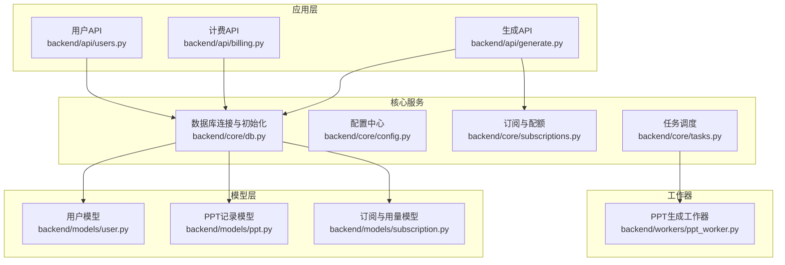
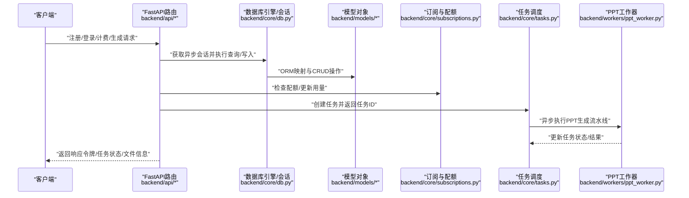
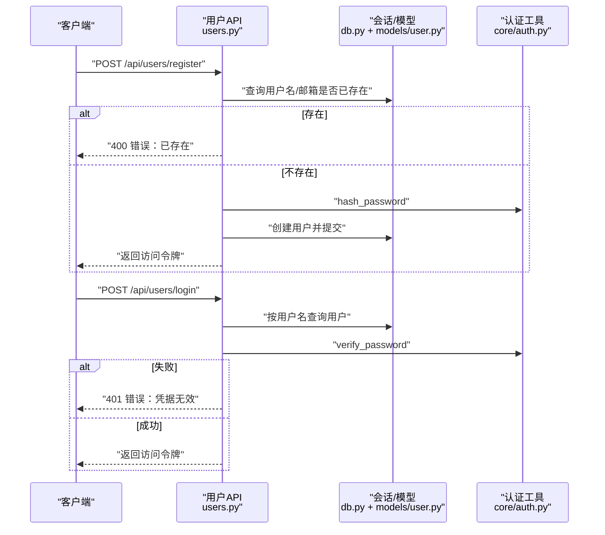
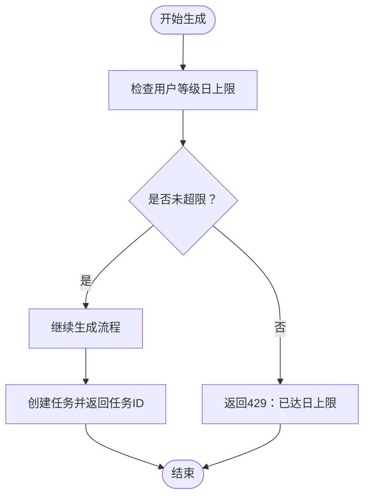
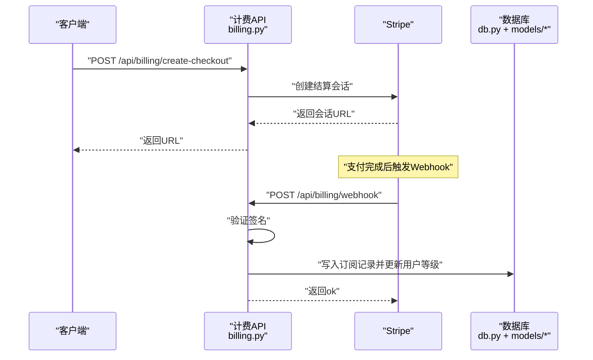
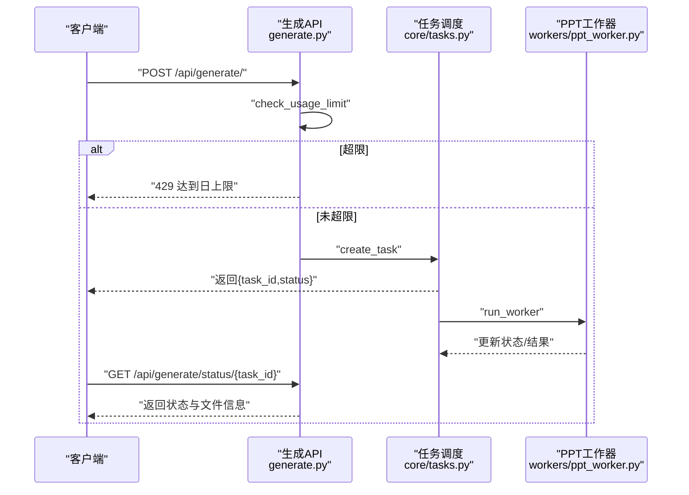
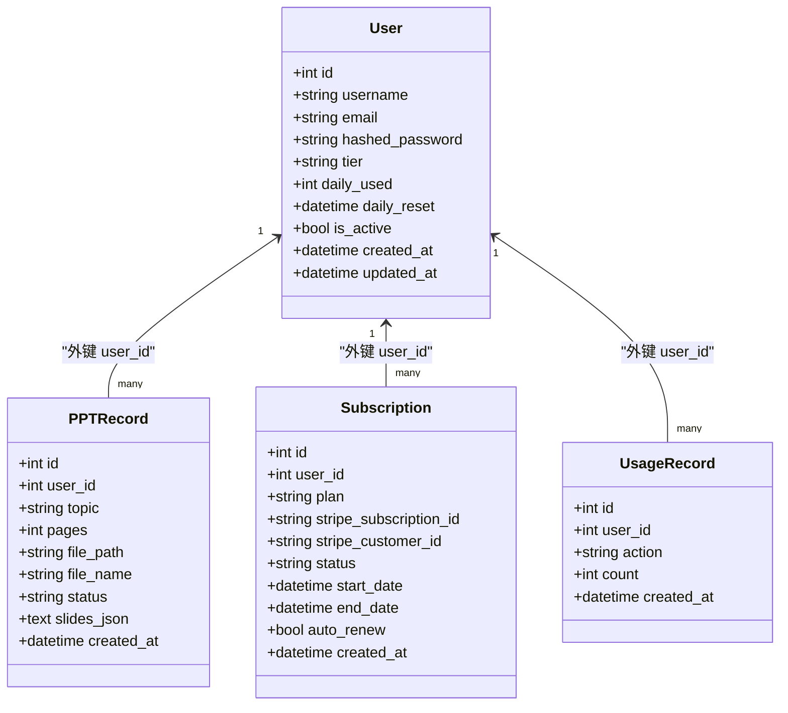
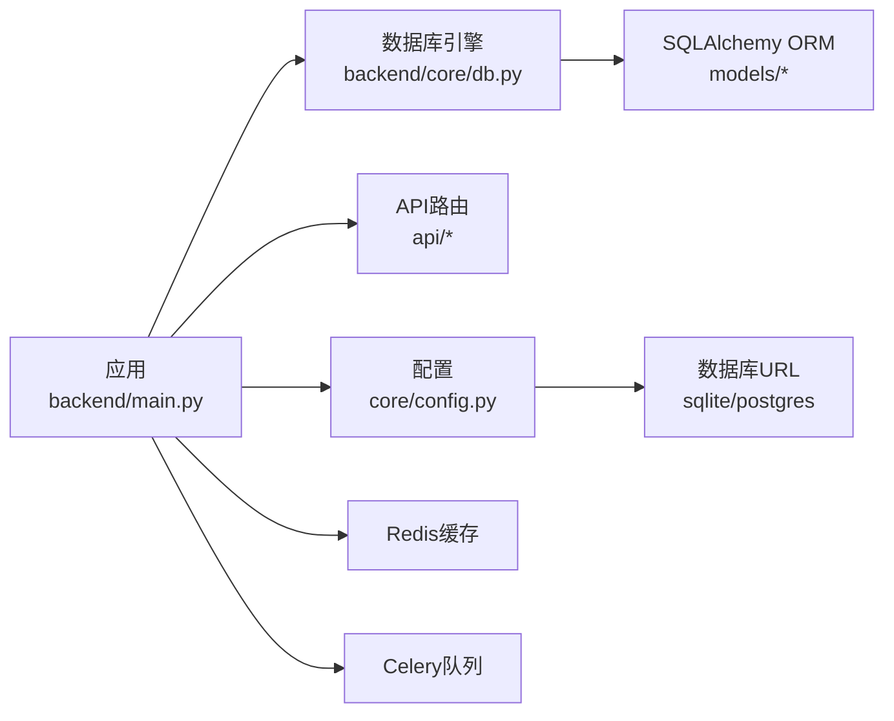

# 数据库设计

<cite>
**本文引用的文件**
- [backend/models/user.py](file://backend/models/user.py)
- [backend/models/ppt.py](file://backend/models/ppt.py)
- [backend/models/subscription.py](file://backend/models/subscription.py)
- [backend/core/db.py](file://backend/core/db.py)
- [backend/core/config.py](file://backend/core/config.py)
- [backend/api/users.py](file://backend/api/users.py)
- [backend/api/billing.py](file://backend/api/billing.py)
- [backend/api/generate.py](file://backend/api/generate.py)
- [backend/core/subscriptions.py](file://backend/core/subscriptions.py)
- [backend/main.py](file://backend/main.py)
- [backend/core/tasks.py](file://backend/core/tasks.py)
- [backend/workers/ppt_worker.py](file://backend/workers/ppt_worker.py)
- [backend/requirements.txt](file://backend/requirements.txt)
</cite>

## 目录
1. [简介](#简介)
2. [项目结构](#项目结构)
3. [核心组件](#核心组件)
4. [架构总览](#架构总览)
5. [详细组件分析](#详细组件分析)
6. [依赖分析](#依赖分析)
7. [性能考量](#性能考量)
8. [故障排查指南](#故障排查指南)
9. [结论](#结论)
10. [附录](#附录)

## 简介
本文件面向AI-PPT后端系统的数据库设计，系统采用异步SQLAlchemy与FastAPI构建，使用SQLite（开发）或PostgreSQL（生产）作为主数据库，并通过Stripe进行订阅计费集成。本文档从模型设计、实体关系、索引与查询优化、数据完整性、迁移与备份、数据访问模式与ORM使用、性能优化以及数据安全与合规等方面进行全面说明。

## 项目结构
数据库相关的核心位置集中在以下模块：
- 模型层：位于 backend/models，定义用户、PPT记录、订阅与用量记录等核心实体
- 配置与连接：位于 backend/core，包含数据库URL、Redis、JWT、Stripe等配置及异步引擎与会话管理
- API层：位于 backend/api，提供用户注册登录、计费、生成PPT等接口
- 任务与工作器：位于 backend/core 与 backend/workers，负责异步任务调度与执行
- 启动与生命周期：位于 backend/main.py，应用启动时自动初始化数据库

图表来源
- [backend/api/users.py:1-75](file://backend/api/users.py#L1-L75)
- [backend/api/billing.py:1-80](file://backend/api/billing.py#L1-L80)
- [backend/api/generate.py:1-52](file://backend/api/generate.py#L1-L52)
- [backend/core/db.py:1-27](file://backend/core/db.py#L1-L27)
- [backend/core/config.py:1-34](file://backend/core/config.py#L1-L34)
- [backend/core/subscriptions.py:1-58](file://backend/core/subscriptions.py#L1-L58)
- [backend/core/tasks.py:1-33](file://backend/core/tasks.py#L1-L33)
- [backend/models/user.py:1-21](file://backend/models/user.py#L1-L21)
- [backend/models/ppt.py:1-18](file://backend/models/ppt.py#L1-L18)
- [backend/models/subscription.py:1-29](file://backend/models/subscription.py#L1-L29)
- [backend/workers/ppt_worker.py:1-24](file://backend/workers/ppt_worker.py#L1-L24)

章节来源
- [backend/main.py:1-40](file://backend/main.py#L1-L40)
- [backend/core/db.py:1-27](file://backend/core/db.py#L1-L27)
- [backend/core/config.py:1-34](file://backend/core/config.py#L1-L34)

## 核心组件
本节对数据库模型进行逐个剖析，包括字段设计、约束与业务含义。

- 用户表（users）
  - 主键：自增整数ID
  - 唯一约束：用户名、邮箱
  - 字段要点：哈希密码存储、用户等级（tier）、日生成计数（daily_used）、日重置时间（daily_reset）、活跃状态（is_active）、创建/更新时间戳
  - 业务意义：支撑认证、配额控制、计费等级映射

- PPT记录表（ppt_records）
  - 主键：自增整数ID
  - 外键：user_id 引用 users.id
  - 字段要点：主题、页数、文件路径/名称、状态、幻灯片JSON、创建时间
  - 业务意义：持久化生成结果与元信息，支持下载与状态查询

- 订阅表（subscriptions）
  - 主键：自增整数ID
  - 外键：user_id 引用 users.id
  - 字段要点：计划类型、Stripe订阅/客户ID、状态、起止时间、自动续费、创建时间
  - 业务意义：与Stripe集成，维护用户订阅生命周期

- 用量记录表（usage_records）
  - 主键：自增整数ID
  - 外键：user_id 引用 users.id
  - 字段要点：动作类型（如generate_ppt）、计数、创建时间
  - 业务意义：审计与统计每日用量

章节来源
- [backend/models/user.py:6-21](file://backend/models/user.py#L6-L21)
- [backend/models/ppt.py:6-18](file://backend/models/ppt.py#L6-L18)
- [backend/models/subscription.py:6-29](file://backend/models/subscription.py#L6-L29)

## 架构总览
下图展示数据库初始化、请求处理与任务执行的关键流程。

图表来源
- [backend/api/users.py:34-75](file://backend/api/users.py#L34-L75)
- [backend/api/billing.py:14-80](file://backend/api/billing.py#L14-L80)
- [backend/api/generate.py:20-52](file://backend/api/generate.py#L20-L52)
- [backend/core/db.py:13-27](file://backend/core/db.py#L13-L27)
- [backend/core/subscriptions.py:46-58](file://backend/core/subscriptions.py#L46-L58)
- [backend/core/tasks.py:14-33](file://backend/core/tasks.py#L14-L33)
- [backend/workers/ppt_worker.py:5-24](file://backend/workers/ppt_worker.py#L5-L24)

## 详细组件分析

### 用户模型与认证流程
- 注册流程要点
  - 校验用户名与邮箱唯一性
  - 密码经哈希后存入
  - 成功后签发访问令牌
- 登录流程要点
  - 通过用户名检索用户
  - 校验哈希密码
  - 成功后签发访问令牌
- 用户信息接口
  - 返回当前用户等级、当日已用次数与限额（限额来自订阅模块）

图表来源
- [backend/api/users.py:34-75](file://backend/api/users.py#L34-L75)
- [backend/models/user.py:6-21](file://backend/models/user.py#L6-L21)

章节来源
- [backend/api/users.py:14-75](file://backend/api/users.py#L14-L75)
- [backend/models/user.py:6-21](file://backend/models/user.py#L6-L21)

### 订阅与用量控制
- 配额与功能矩阵
  - 免费：日上限3次，基础导出
  - Pro：日上限100次，扩展功能集
  - School：日上限极高，完整功能集
- 用量检查与更新
  - 生成请求前检查当日用量是否超限
  - 成功生成后增加用量并记录用量明细

图表来源
- [backend/core/subscriptions.py:42-58](file://backend/core/subscriptions.py#L42-L58)
- [backend/api/generate.py:26-35](file://backend/api/generate.py#L26-L35)

章节来源
- [backend/core/subscriptions.py:10-58](file://backend/core/subscriptions.py#L10-L58)
- [backend/api/generate.py:20-52](file://backend/api/generate.py#L20-L52)

### 计费与Webhook集成
- 创建结算会话
  - 根据计划类型映射价格（分）
  - 返回Stripe会话URL供前端跳转
- Webhook处理
  - 验证签名
  - 处理“checkout.session.completed”事件
  - 写入订阅记录并根据计划更新用户等级

图表来源
- [backend/api/billing.py:14-80](file://backend/api/billing.py#L14-L80)
- [backend/models/subscription.py:6-19](file://backend/models/subscription.py#L6-L19)
- [backend/models/user.py:14-16](file://backend/models/user.py#L14-L16)

章节来源
- [backend/api/billing.py:14-80](file://backend/api/billing.py#L14-L80)
- [backend/models/subscription.py:6-19](file://backend/models/subscription.py#L6-L19)

### PPT生成与任务执行
- 生成入口
  - 校验主题有效性与配额
  - 创建任务并返回任务ID
- 任务状态查询
  - 返回状态、文件信息、进度与错误
- 工作器执行
  - 异步运行生成流水线
  - 更新任务状态与结果

图表来源
- [backend/api/generate.py:20-52](file://backend/api/generate.py#L20-L52)
- [backend/core/tasks.py:14-33](file://backend/core/tasks.py#L14-L33)
- [backend/workers/ppt_worker.py:5-24](file://backend/workers/ppt_worker.py#L5-L24)

章节来源
- [backend/api/generate.py:20-52](file://backend/api/generate.py#L20-L52)
- [backend/core/tasks.py:14-33](file://backend/core/tasks.py#L14-L33)
- [backend/workers/ppt_worker.py:5-24](file://backend/workers/ppt_worker.py#L5-L24)

### 数据模型类图

图表来源
- [backend/models/user.py:6-21](file://backend/models/user.py#L6-L21)
- [backend/models/ppt.py:6-18](file://backend/models/ppt.py#L6-L18)
- [backend/models/subscription.py:6-29](file://backend/models/subscription.py#L6-L29)

## 依赖分析
- 数据库驱动与ORM
  - SQLAlchemy 2.x + 异步引擎
  - SQLite（开发）与PostgreSQL（生产）驱动（通过URL切换）
- 迁移工具
  - Alembic用于数据库迁移管理
- 缓存与队列
  - Redis用于缓存（非数据库但与数据访问相关）
  - Celery用于后台任务队列（与任务调度配合）

图表来源
- [backend/main.py:1-40](file://backend/main.py#L1-L40)
- [backend/core/db.py:1-27](file://backend/core/db.py#L1-L27)
- [backend/core/config.py:11-12](file://backend/core/config.py#L11-L12)
- [backend/requirements.txt:7-21](file://backend/requirements.txt#L7-L21)

章节来源
- [backend/requirements.txt:1-22](file://backend/requirements.txt#L1-L22)
- [backend/core/config.py:11-12](file://backend/core/config.py#L11-L12)

## 性能考量
- 连接与会话
  - 使用异步引擎与长存活会话，减少连接开销
  - 在请求作用域内复用会话，避免频繁创建销毁
- 查询优化
  - 对高频查询字段（用户名、邮箱、user_id）建立索引（见后续索引策略）
  - 避免N+1查询，优先使用join或批量查询
- 任务与并发
  - 生成任务通过异步工作器执行，避免阻塞请求线程
  - 使用Celery可进一步提升并发与可靠性
- 缓存策略
  - 将热点配置与用户等级缓存至Redis，降低数据库压力
- IO与文件
  - 输出与上传目录分离，避免数据库承担文件存储压力

## 故障排查指南
- 初始化失败
  - 确认数据库URL正确且驱动可用（SQLite或PostgreSQL）
  - 检查权限与路径（Windows路径需注意转义）
- 认证失败
  - 核对用户名是否存在，密码是否匹配
  - 检查令牌过期与算法配置
- 计费异常
  - 校验Stripe密钥与Webhook签名
  - 查看订阅记录与用户等级更新是否一致
- 生成失败
  - 检查任务状态与错误信息
  - 关注工作器日志与代理设置

章节来源
- [backend/core/db.py:21-27](file://backend/core/db.py#L21-L27)
- [backend/api/users.py:54-61](file://backend/api/users.py#L54-L61)
- [backend/api/billing.py:45-80](file://backend/api/billing.py#L45-L80)
- [backend/api/generate.py:38-52](file://backend/api/generate.py#L38-L52)

## 结论
本数据库设计围绕用户、PPT记录、订阅与用量四大核心实体展开，结合异步ORM与任务系统，满足高并发场景下的生成与计费需求。通过明确的配额控制、清晰的实体关系与可扩展的迁移方案，系统具备良好的可维护性与演进空间。建议在生产环境完善索引、引入缓存与队列、强化监控与备份策略。

## 附录

### 表结构与字段设计要点
- users
  - 主键：id
  - 唯一：username、email
  - 字段：hashed_password、tier、daily_used、daily_reset、is_active、created_at、updated_at
- ppt_records
  - 主键：id；外键：user_id → users.id
  - 字段：topic、pages、file_path、file_name、status、slides_json、created_at
- subscriptions
  - 主键：id；外键：user_id → users.id
  - 字段：plan、stripe_subscription_id、stripe_customer_id、status、start_date、end_date、auto_renew、created_at
- usage_records
  - 主键：id；外键：user_id → users.id
  - 字段：action、count、created_at

章节来源
- [backend/models/user.py:6-21](file://backend/models/user.py#L6-L21)
- [backend/models/ppt.py:6-18](file://backend/models/ppt.py#L6-L18)
- [backend/models/subscription.py:6-29](file://backend/models/subscription.py#L6-L29)

### 索引策略与查询优化建议
- 建议索引
  - users(username)、users(email)：加速登录与去重
  - ppt_records(user_id)：按用户查询历史
  - subscriptions(user_id)：按用户查询订阅
  - usage_records(user_id)：按用户统计用量
- 查询优化
  - 使用select().options(joinedload/contains_eager)避免N+1
  - 分页查询与LIMIT/OFFSET控制结果规模
  - 对高频过滤字段添加复合索引（如status+created_at）

### 数据完整性与一致性
- 外键约束：确保引用完整性（user_id指向users.id）
- 唯一约束：用户名与邮箱唯一
- 默认值与非空：合理设置默认值与NOT NULL约束
- 并发控制：使用事务包裹关键写入（如配额更新与用量记录）

### 迁移管理与版本控制
- 使用Alembic进行迁移脚本管理
- 迁移命令示例（概念性说明）
  - 初始化：alembic init
  - 生成迁移：alembic revision --autogenerate -m "描述"
  - 应用迁移：alembic upgrade head
- 版本回滚与灰度发布策略

### 备份与恢复策略
- 定期备份数据库文件（SQLite）或逻辑/物理备份（PostgreSQL）
- 备份保留周期与异地存放
- 恢复演练与RTO/RPO目标设定

### 数据访问模式与ORM使用
- 使用异步会话管理，每个请求一个会话实例
- 通过依赖注入获取会话，避免全局状态
- 批量写入与事务提交，确保原子性
- 模型字段尽量使用合适的数据类型与长度限制

### 性能优化建议
- 连接池参数调优（最大连接数、空闲回收）
- 读写分离与只读副本（针对报表与历史查询）
- CDN与静态资源分离，减轻数据库IO
- 监控慢查询与热点表，针对性优化

### 数据安全、隐私与合规
- 密码存储：使用强哈希算法（bcrypt），不存储明文
- 令牌安全：JWT密钥定期轮换，短有效期，HTTPS传输
- 敏感数据：Stripe密钥与数据库URL置于环境变量中
- 隐私保护：仅收集必要信息，遵循最小化原则；提供删除与导出功能
- 合规要求：遵守所在地区数据保护法规（如GDPR/CCPA），提供透明的隐私政策与用户权利说明