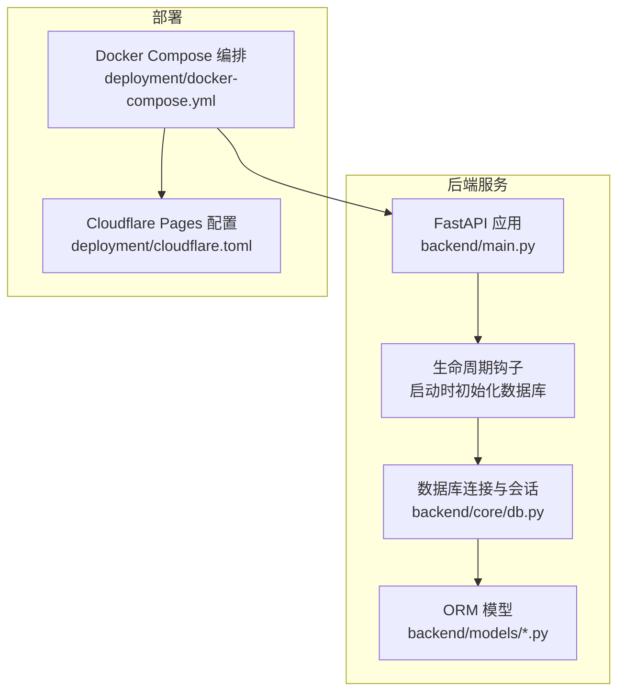
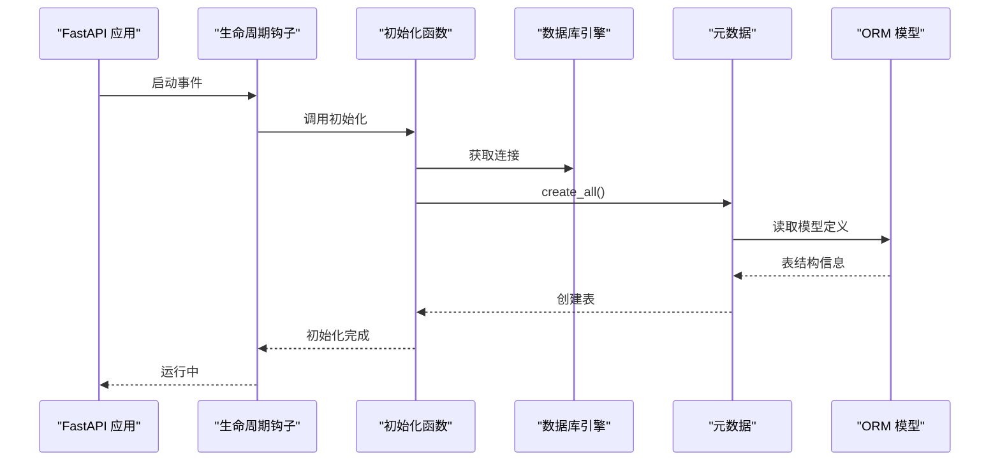
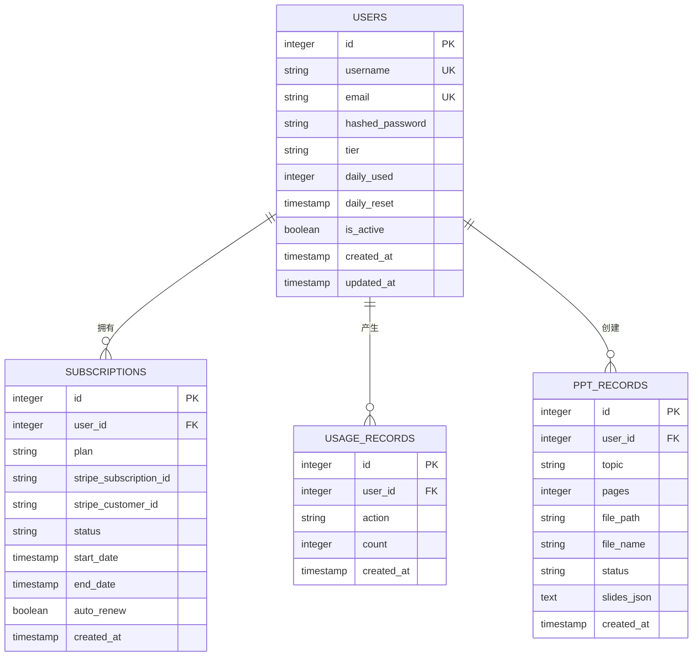
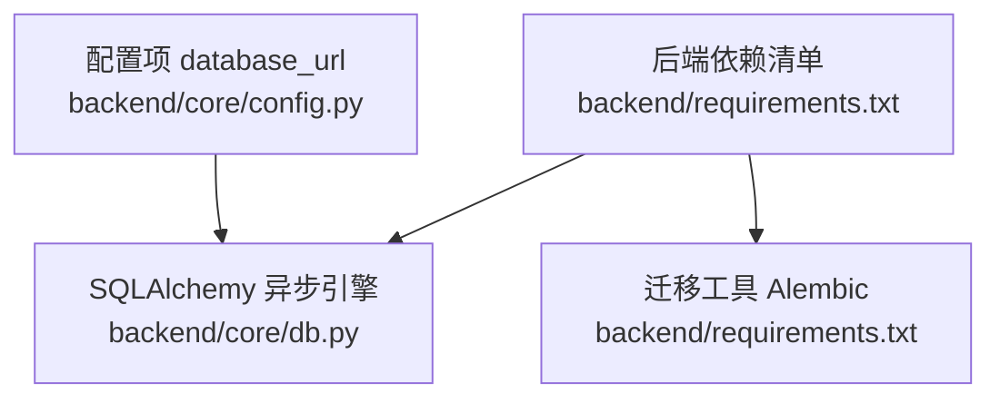

# 数据库迁移管理

<cite>
**本文档引用的文件**
- [backend/core/db.py](file://backend/core/db.py)
- [backend/main.py](file://backend/main.py)
- [backend/models/user.py](file://backend/models/user.py)
- [backend/models/ppt.py](file://backend/models/ppt.py)
- [backend/models/subscription.py](file://backend/models/subscription.py)
- [backend/core/config.py](file://backend/core/config.py)
- [backend/requirements.txt](file://backend/requirements.txt)
- [deployment/docker-compose.yml](file://deployment/docker-compose.yml)
- [deployment/cloudflare.toml](file://deployment/cloudflare.toml)
</cite>

## 目录
1. [简介](#简介)
2. [项目结构](#项目结构)
3. [核心组件](#核心组件)
4. [架构总览](#架构总览)
5. [详细组件分析](#详细组件分析)
6. [依赖分析](#依赖分析)
7. [性能考虑](#性能考虑)
8. [故障排除指南](#故障排除指南)
9. [结论](#结论)
10. [附录](#附录)

## 简介
本指南面向AI-PPT项目的数据库迁移管理，围绕版本控制、迁移脚本编写与变更管理流程展开；深入说明数据迁移策略、向后兼容性与破坏性变更处理；阐述迁移执行、回滚机制与风险控制；解释生产环境迁移、蓝绿部署与零停机更新策略；提供迁移测试、验证与监控方案，并总结最佳实践与常见问题及解决方案。

当前仓库已引入迁移工具依赖（Alembic），但未发现现有迁移脚本目录；数据库初始化通过应用启动时自动创建表结构完成。本文在不改变现有实现的前提下，给出可落地的迁移管理方案与实施步骤。

## 项目结构
AI-PPT采用前后端分离架构，数据库层基于SQLAlchemy异步引擎，模型定义位于models目录，应用入口在backend/main.py中完成生命周期初始化与路由注册。部署通过docker-compose编排，前端静态资源由Cloudflare Pages托管。

**图表来源**
- [backend/main.py:10-20](file://backend/main.py#L10-L20)
- [backend/core/db.py:5-26](file://backend/core/db.py#L5-L26)
- [deployment/docker-compose.yml:1-46](file://deployment/docker-compose.yml#L1-L46)
- [deployment/cloudflare.toml:1-20](file://deployment/cloudflare.toml#L1-L20)

**章节来源**
- [backend/main.py:1-40](file://backend/main.py#L1-L40)
- [backend/core/db.py:1-27](file://backend/core/db.py#L1-L27)
- [deployment/docker-compose.yml:1-46](file://deployment/docker-compose.yml#L1-L46)
- [deployment/cloudflare.toml:1-20](file://deployment/cloudflare.toml#L1-L20)

## 核心组件
- 数据库引擎与会话：使用SQLAlchemy异步引擎与会话工厂，支持SQLite与PostgreSQL等驱动，具备调试输出开关。
- ORM模型：用户、订阅与用量记录、PPT生成记录等核心实体，定义字段类型、约束与默认值。
- 应用生命周期：FastAPI应用在启动阶段调用初始化函数，自动创建所有模型对应的表结构。
- 迁移工具：requirements中包含Alembic，为后续迁移脚本化奠定基础。

**章节来源**
- [backend/core/db.py:1-27](file://backend/core/db.py#L1-L27)
- [backend/models/user.py:1-21](file://backend/models/user.py#L1-L21)
- [backend/models/subscription.py:1-29](file://backend/models/subscription.py#L1-L29)
- [backend/models/ppt.py:1-18](file://backend/models/ppt.py#L1-L18)
- [backend/main.py:10-20](file://backend/main.py#L10-L20)
- [backend/requirements.txt:7-8](file://backend/requirements.txt#L7-L8)

## 架构总览
下图展示从应用启动到数据库初始化的整体流程，以及迁移管理在系统中的位置。

**图表来源**
- [backend/main.py:10-20](file://backend/main.py#L10-L20)
- [backend/core/db.py:21-26](file://backend/core/db.py#L21-L26)

## 详细组件分析

### 数据库初始化与版本控制现状
- 当前实现：应用启动时调用初始化函数，基于ORM模型元数据一次性创建所有表。
- 版本控制缺失：未发现迁移脚本目录，无法进行增量版本演进与回滚。
- 风险点：直接依赖模型定义创建表，缺乏对历史数据库的兼容性与回滚能力。

**章节来源**
- [backend/main.py:10-20](file://backend/main.py#L10-L20)
- [backend/core/db.py:21-26](file://backend/core/db.py#L21-L26)

### ORM模型与数据结构
- 用户模型：包含身份认证、计费等级、日使用量与重置时间、活跃状态等字段。
- 订阅模型：关联用户，记录计划、支付平台标识、状态、有效期与自动续费。
- 用量记录模型：按用户与动作维度统计使用次数。
- PPT记录模型：记录生成任务的元数据、状态与结果路径。

**图表来源**
- [backend/models/user.py:6-20](file://backend/models/user.py#L6-L20)
- [backend/models/subscription.py:6-28](file://backend/models/subscription.py#L6-L28)
- [backend/models/ppt.py:6-17](file://backend/models/ppt.py#L6-L17)

**章节来源**
- [backend/models/user.py:1-21](file://backend/models/user.py#L1-L21)
- [backend/models/subscription.py:1-29](file://backend/models/subscription.py#L1-L29)
- [backend/models/ppt.py:1-18](file://backend/models/ppt.py#L1-L18)

### 迁移脚本编写与变更管理流程
- 基于Alembic的脚手架：在项目根目录初始化Alembic配置，生成版本化迁移脚本目录。
- 变更管理流程：
  - 设计阶段：明确变更范围、影响面与回退策略。
  - 开发阶段：编写正向迁移脚本与逆向回滚脚本，确保幂等与可重复。
  - 测试阶段：在隔离环境中执行迁移，验证数据完整性与业务功能。
  - 部署阶段：灰度发布，逐步扩大流量，监控异常指标。
  - 回滚阶段：若出现严重问题，按预设回滚脚本回退至稳定版本。
- 版本命名：采用语义化版本号或时间戳前缀，配合简要描述，便于追溯。

[本节为概念性内容，无需“章节来源”]

### 数据迁移策略、向后兼容性与破坏性变更处理
- 向后兼容性：
  - 新增非空字段需提供默认值或分阶段上线。
  - 字段重命名与删除需保留过渡期，旧字段可标记弃用。
  - 外键约束变更应谨慎，优先通过索引与应用层校验保证一致性。
- 破坏性变更处理：
  - 使用临时表或新表承载新结构，批量迁移数据后原子切换。
  - 对大表进行在线DDL（如分区、列式存储）以降低锁竞争。
  - 严格区分只读副本与主库，避免写入阻塞。

[本节为概念性内容，无需“章节来源”]

### 迁移执行、回滚机制与风险控制
- 执行策略：
  - 单实例或单主库场景：选择维护窗口执行，提前备份。
  - 多实例场景：采用蓝绿或滚动更新，先在备用实例上验证。
- 回滚机制：
  - 逆向迁移脚本必须与正向脚本一一对应，覆盖所有DDL与DML。
  - 回滚前冻结写入，回滚后验证数据一致性与接口可用性。
- 风险控制：
  - 引入“暂停点”：在关键步骤前进行人工确认。
  - 设置超时与重试上限，失败即告警并自动回滚。
  - 建立“影子环境”：与生产一致的数据副本用于演练。

[本节为概念性内容，无需“章节来源”]

### 生产环境迁移、蓝绿部署与零停机更新
- 蓝绿部署：
  - 准备两套环境（蓝/绿），切换流量时仅变更指向。
  - 在目标环境先执行迁移与全量回归测试，再切换流量。
- 零停机更新：
  - 通过连接池与事务隔离，避免长事务阻塞。
  - 对热点表采用只读副本分流，减少主库压力。
- 容器化与编排：
  - 使用Compose或Kubernetes管理多实例，结合健康检查与就绪探针。
  - 将数据库卷与持久化存储分离，确保迁移过程数据安全。

**章节来源**
- [deployment/docker-compose.yml:1-46](file://deployment/docker-compose.yml#L1-L46)

### 迁移测试、验证与监控方案
- 测试策略：
  - 单元测试：针对迁移脚本的幂等性与边界条件。
  - 集成测试：在隔离数据库中完整跑通迁移与业务流程。
  - 回归测试：验证关键接口与报表数据一致性。
- 验证清单：
  - DDL是否成功、索引是否可用、外键是否生效。
  - 数据是否完整迁移、默认值与约束是否正确。
  - 性能回归：慢查询、锁等待、连接数峰值。
- 监控指标：
  - 迁移耗时、失败率、回滚次数。
  - 数据库连接数、QPS、锁等待时长、慢查询数量。
  - 应用错误率、响应时间、业务关键指标（如生成成功率）。

[本节为概念性内容，无需“章节来源”]

### 最佳实践与常见问题
- 最佳实践：
  - 始终编写逆向脚本；对大表迁移分批进行；在低峰时段执行。
  - 使用事务包裹迁移，失败即回滚；对关键变更设置人工审批。
  - 保持模型与迁移脚本同步，避免“漂移”。
- 常见问题与解决方案：
  - 迁移卡住：检查锁等待与长事务，必要时终止会话并重试。
  - 数据不一致：核对源表与目标表结构，补充缺失索引。
  - 回滚失败：确认逆向脚本覆盖所有正向变更，必要时手工修复。

[本节为概念性内容，无需“章节来源”]

## 依赖分析
- 运行时依赖：FastAPI、SQLAlchemy、Alembic、asyncpg/aiosqlite、Redis等。
- 数据库驱动：根据配置选择PostgreSQL或SQLite；生产建议使用PostgreSQL。
- 部署依赖：Docker Compose编排后端、前端与Redis；Cloudflare Pages托管前端静态资源。

**图表来源**
- [backend/requirements.txt:1-22](file://backend/requirements.txt#L1-L22)
- [backend/core/db.py:1-6](file://backend/core/db.py#L1-L6)
- [backend/core/config.py:11](file://backend/core/config.py#L11)

**章节来源**
- [backend/requirements.txt:1-22](file://backend/requirements.txt#L1-L22)
- [backend/core/config.py:1-34](file://backend/core/config.py#L1-L34)
- [backend/core/db.py:1-27](file://backend/core/db.py#L1-L27)

## 性能考虑
- 迁移期间的性能影响：大表重建、索引重建、批量更新可能引发锁竞争与IO压力。
- 优化建议：
  - 分批处理：按主键范围切分，逐批迁移。
  - 并行化：在不影响一致性的前提下并行处理不同分片。
  - 降载：临时关闭非关键后台任务，降低并发。
  - 监控：实时观察慢查询与锁等待，及时调整策略。

[本节为一般性指导，无需“章节来源”]

## 故障排除指南
- 启动时数据库初始化失败：
  - 检查数据库URL与凭据；确认驱动安装（asyncpg/aiosqlite）。
  - 查看调试输出（echo开关）定位具体SQL错误。
- 迁移脚本执行异常：
  - 校验脚本语法与上下文；确保目标数据库版本兼容。
  - 使用dry-run模式预演，确认无副作用后再正式执行。
- 数据不一致：
  - 对比源表与目标表结构；补充缺失索引或约束。
  - 重新执行部分迁移批次，确保幂等性。

**章节来源**
- [backend/core/config.py:11](file://backend/core/config.py#L11)
- [backend/core/db.py:5](file://backend/core/db.py#L5)
- [backend/requirements.txt:9](file://backend/requirements.txt#L9)

## 结论
当前AI-PPT项目尚未启用正式的数据库迁移体系，但已具备使用Alembic的基础设施。建议尽快建立脚手架、制定变更流程与回滚预案，并在测试环境充分验证后，逐步在生产环境落地零停机迁移策略。通过严格的版本控制、兼容性设计与监控告警，确保数据库演进的安全与稳定。

[本节为总结性内容，无需“章节来源”]

## 附录

### 快速实施步骤（基于现有仓库）
- 初始化Alembic：
  - 在项目根目录运行初始化命令，生成迁移脚本目录与配置文件。
- 生成初始迁移：
  - 基于现有模型生成初始版本脚本，确保与当前数据库状态一致。
- 编写后续迁移：
  - 每次模型变更均配套正向与逆向迁移脚本，提交到版本控制。
- 部署与验证：
  - 在容器编排中增加迁移任务或在启动前执行迁移；完成后进行健康检查与回归测试。

[本节为概念性内容，无需“章节来源”]