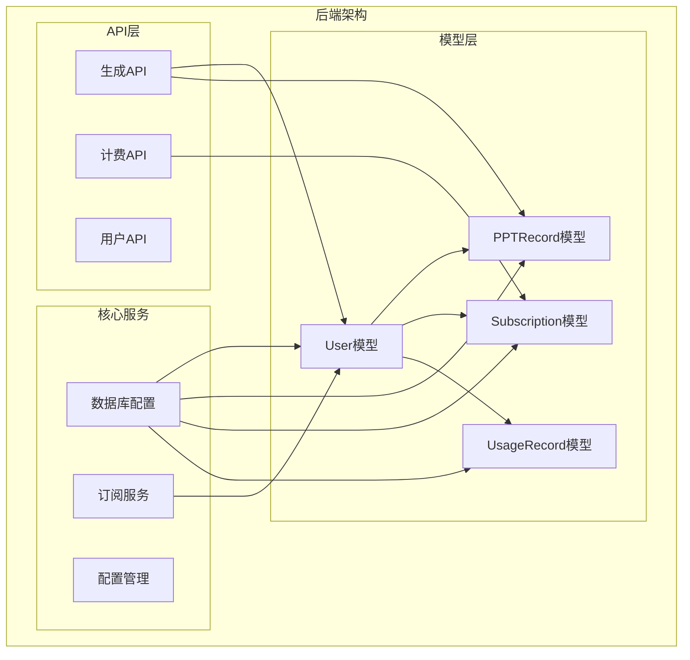
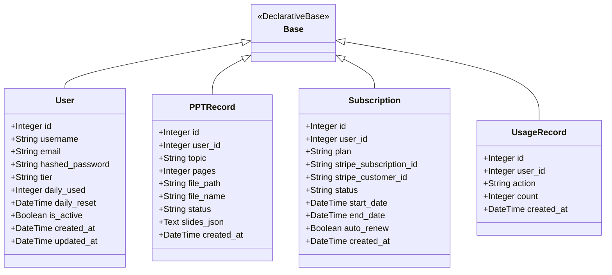
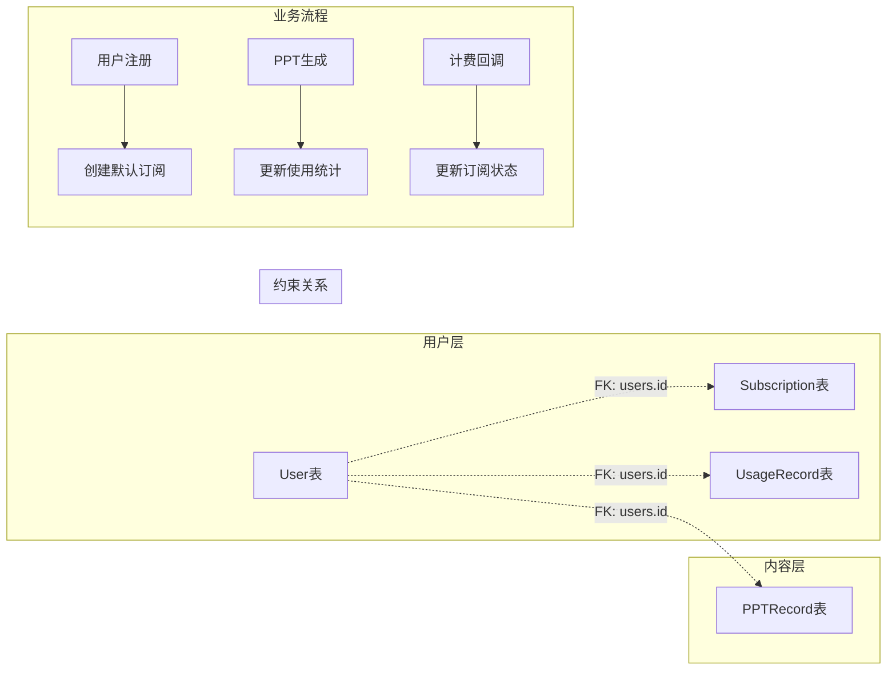
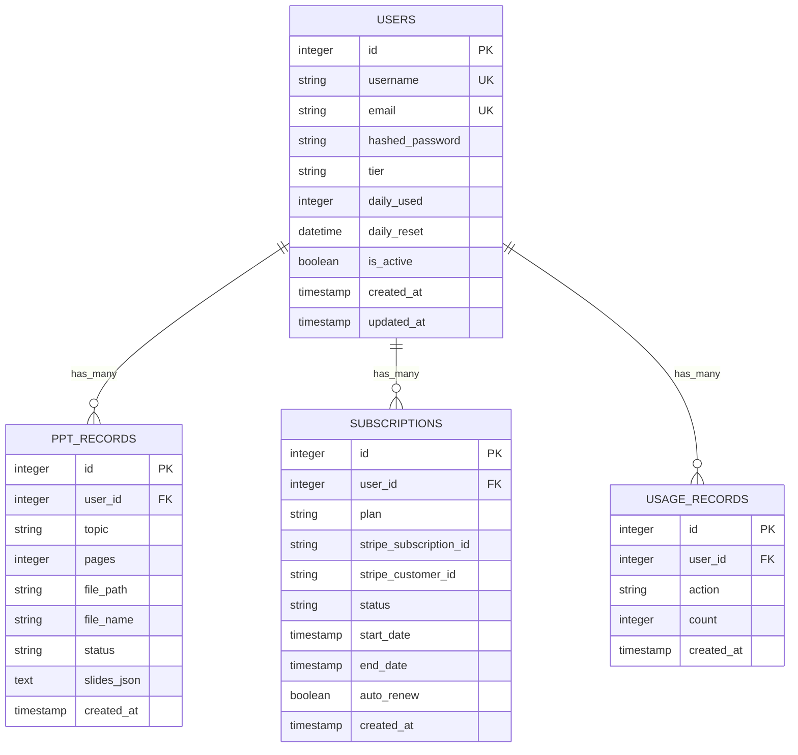

# 核心数据模型

<cite>
**本文档引用的文件**
- [backend/models/user.py](file://backend/models/user.py)
- [backend/models/ppt.py](file://backend/models/ppt.py)
- [backend/models/subscription.py](file://backend/models/subscription.py)
- [backend/core/db.py](file://backend/core/db.py)
- [backend/core/config.py](file://backend/core/config.py)
- [backend/core/subscriptions.py](file://backend/core/subscriptions.py)
- [backend/api/generate.py](file://backend/api/generate.py)
- [backend/api/users.py](file://backend/api/users.py)
- [backend/api/billing.py](file://backend/api/billing.py)
</cite>

## 目录
1. [简介](#简介)
2. [项目结构](#项目结构)
3. [核心组件](#核心组件)
4. [架构概览](#架构概览)
5. [详细组件分析](#详细组件分析)
6. [依赖关系分析](#依赖关系分析)
7. [性能考量](#性能考量)
8. [故障排除指南](#故障排除指南)
9. [结论](#结论)
10. [附录](#附录)

## 简介

AI-PPT项目采用基于SQLAlchemy的异步ORM架构，构建了完整的用户管理、PPT生成记录、订阅管理和使用统计系统。本技术文档深入解析四个核心数据模型的设计原理和实现细节，包括用户模型(User)、PPT记录模型(PPTRecord)、订阅模型(Subscription)和使用记录模型(UsageRecord)。

该系统采用SQLite作为默认数据库，支持异步数据库连接和事务处理，通过分层架构实现了清晰的数据访问模式和业务逻辑分离。

## 项目结构

AI-PPT项目采用模块化架构，核心数据模型位于`backend/models/`目录下，数据库配置和会话管理位于`backend/core/`目录下。

**图表来源**
- [backend/models/user.py:1-21](file://backend/models/user.py#L1-L21)
- [backend/models/ppt.py:1-18](file://backend/models/ppt.py#L1-L18)
- [backend/models/subscription.py:1-29](file://backend/models/subscription.py#L1-L29)
- [backend/core/db.py:1-27](file://backend/core/db.py#L1-L27)

**章节来源**
- [backend/core/db.py:1-27](file://backend/core/db.py#L1-L27)
- [backend/core/config.py:1-34](file://backend/core/config.py#L1-L34)

## 核心组件

AI-PPT项目的核心数据模型由四个相互关联的实体组成，每个模型都遵循统一的设计原则：明确的字段定义、严格的约束条件、合理的默认值设置和完善的生命周期管理。

### 数据库基础架构

系统采用SQLAlchemy异步ORM框架，通过`DeclarativeBase`基类实现模型定义，并使用`AsyncSession`提供异步数据库操作能力。

**图表来源**
- [backend/models/user.py:6-21](file://backend/models/user.py#L6-L21)
- [backend/models/ppt.py:6-18](file://backend/models/ppt.py#L6-L18)
- [backend/models/subscription.py:6-29](file://backend/models/subscription.py#L6-L29)

**章节来源**
- [backend/models/user.py:1-21](file://backend/models/user.py#L1-L21)
- [backend/models/ppt.py:1-18](file://backend/models/ppt.py#L1-L18)
- [backend/models/subscription.py:1-29](file://backend/models/subscription.py#L1-L29)

## 架构概览

AI-PPT的数据模型架构体现了清晰的分层设计和强一致性的数据管理策略。系统通过外键约束确保数据完整性，通过级联操作实现数据的一致性维护。

**图表来源**
- [backend/models/user.py:10-12](file://backend/models/user.py#L10-L12)
- [backend/models/ppt.py:10](file://backend/models/ppt.py#L10)
- [backend/models/subscription.py:10](file://backend/models/subscription.py#L10)
- [backend/models/subscription.py:25](file://backend/models/subscription.py#L25)

## 详细组件分析

### 用户模型(User)

用户模型是整个系统的核心实体，负责管理用户身份信息、账户状态和使用配额。

#### 字段定义与约束

| 字段名 | 类型 | 约束 | 默认值 | 描述 |
|--------|------|--------|--------|------|
| id | Integer | 主键, 自增 | - | 用户唯一标识符 |
| username | String(50) | 唯一, 非空 | - | 用户名，唯一约束 |
| email | String(255) | 唯一, 非空 | - | 邮箱地址，唯一约束 |
| hashed_password | String(255) | 非空 | - | 加密后的密码 |
| tier | String(20) | - | "free" | 用户等级：free/pro/school |
| daily_used | Integer | - | 0 | 当日已使用次数 |
| daily_reset | DateTime | 可空 | - | 日使用量重置时间 |
| is_active | Boolean | - | True | 账户激活状态 |
| created_at | DateTime | 服务器默认值 | now() | 创建时间 |
| updated_at | DateTime | 更新时默认值 | now() | 最后更新时间 |

#### 验证规则

- 用户名长度限制在50字符以内，必须唯一且非空
- 邮箱格式验证，必须唯一且非空
- 密码必须进行哈希加密存储
- 等级字段支持枚举值："free"、"pro"、"school"
- 日使用量默认为0，需要配合定时任务重置

#### 生命周期管理

用户模型通过SQLAlchemy的`server_default`和`onupdate`特性实现自动时间戳管理，确保数据变更的可追溯性。

**章节来源**
- [backend/models/user.py:6-21](file://backend/models/user.py#L6-L21)
- [backend/api/users.py:34-51](file://backend/api/users.py#L34-L51)

### PPT记录模型(PPTRecord)

PPT记录模型用于跟踪用户的PPT生成历史和当前状态。

#### 字段定义与约束

| 字段名 | 类型 | 约束 | 默认值 | 描述 |
|--------|------|--------|--------|------|
| id | Integer | 主键, 自增 | - | 记录唯一标识符 |
| user_id | Integer | 外键(users.id), 非空 | - | 关联用户ID |
| topic | String(255) | 非空 | - | PPT主题内容 |
| pages | Integer | - | 0 | 幻灯片数量 |
| file_path | String(500) | 可空 | - | 文件存储路径 |
| file_name | String(255) | 可空 | - | 文件原始名称 |
| status | String(20) | - | "completed" | 生成状态 |
| slides_json | Text | 可空 | - | 幻灯片数据JSON |
| created_at | DateTime | 服务器默认值 | now() | 创建时间 |

#### 状态管理

PPT记录支持多种状态：
- "completed": 生成完成
- "processing": 正在处理中
- "failed": 生成失败

#### 外键关系

PPT记录通过`user_id`字段与用户模型建立一对一关系，实现用户生成历史的完整追踪。

**章节来源**
- [backend/models/ppt.py:6-18](file://backend/models/ppt.py#L6-L18)
- [backend/api/generate.py:20-35](file://backend/api/generate.py#L20-L35)

### 订阅模型(Subscription)

订阅模型管理用户的付费计划和计费状态，支持Stripe集成。

#### 字段定义与约束

| 字段名 | 类型 | 约束 | 默认值 | 描述 |
|--------|------|--------|--------|------|
| id | Integer | 主键, 自增 | - | 订阅唯一标识符 |
| user_id | Integer | 外键(users.id), 非空 | - | 关联用户ID |
| plan | String(20) | 非空 | - | 计费计划类型 |
| stripe_subscription_id | String(255) | 可空 | - | Stripe订阅ID |
| stripe_customer_id | String(255) | 可空 | - | Stripe客户ID |
| status | String(20) | - | "active" | 订阅状态 |
| start_date | DateTime | 服务器默认值 | now() | 开始日期 |
| end_date | DateTime | 可空 | - | 结束日期 |
| auto_renew | Boolean | - | True | 自动续费标志 |
| created_at | DateTime | 服务器默认值 | now() | 创建时间 |

#### 计费计划类型

支持的计划类型：
- "pro_monthly": 专业版月付
- "pro_yearly": 专业版年付  
- "school_yearly": 学校版年付

#### 状态管理

订阅状态包括：
- "active": 激活状态
- "canceled": 已取消
- "past_due": 逾期未付款

**章节来源**
- [backend/models/subscription.py:6-19](file://backend/models/subscription.py#L6-L19)
- [backend/api/billing.py:58-79](file://backend/api/billing.py#L58-L79)

### 使用记录模型(UsageRecord)

使用记录模型用于追踪用户的操作行为和使用统计。

#### 字段定义与约束

| 字段名 | 类型 | 约束 | 默认值 | 描述 |
|--------|------|--------|--------|------|
| id | Integer | 主键, 自增 | - | 记录唯一标识符 |
| user_id | Integer | 外键(users.id), 非空 | - | 关联用户ID |
| action | String(50) | 非空 | - | 操作类型描述 |
| count | Integer | - | 1 | 操作次数 |
| created_at | DateTime | 服务器默认值 | now() | 创建时间 |

#### 操作类型

支持的操作类型：
- "generate_ppt": 生成PPT
- "export_ppt": 导出PPT
- "download_template": 下载模板

#### 统计功能

使用记录模型与用户模型的日使用量配合，实现精细化的使用统计和配额控制。

**章节来源**
- [backend/models/subscription.py:21-29](file://backend/models/subscription.py#L21-L29)
- [backend/core/subscriptions.py:53-57](file://backend/core/subscriptions.py#L53-L57)

## 依赖关系分析

AI-PPT系统的数据模型之间建立了清晰的依赖关系，通过外键约束确保数据一致性。

**图表来源**
- [backend/models/user.py:6-21](file://backend/models/user.py#L6-L21)
- [backend/models/ppt.py:6-18](file://backend/models/ppt.py#L6-L18)
- [backend/models/subscription.py:6-29](file://backend/models/subscription.py#L6-L29)

### 外键约束与级联操作

系统通过SQLAlchemy的外键机制实现以下约束关系：

1. **用户到PPT记录**: 一对多关系，删除用户时需要先删除其所有PPT记录
2. **用户到订阅**: 一对多关系，用户可以有多个订阅记录
3. **用户到使用记录**: 一对多关系，记录用户的操作历史

### 数据完整性保证

- 所有外键字段都设置了`nullable=False`，确保引用完整性
- 用户名和邮箱字段具有唯一约束，防止重复注册
- 时间戳字段使用服务器默认值，确保数据一致性

**章节来源**
- [backend/core/db.py:21-26](file://backend/core/db.py#L21-L26)
- [backend/models/user.py:10-12](file://backend/models/user.py#L10-L12)

## 性能考量

### 数据库优化策略

1. **索引设计**: 建议为常用查询字段添加索引
   - `users.username`: 支持快速用户查找
   - `users.email`: 支持邮箱登录
   - `ppt_records.user_id`: 支持用户历史查询
   - `usage_records.user_id`: 支持使用统计查询

2. **查询优化**: 
   - 使用批量查询减少数据库往返
   - 实施分页查询避免大数据集加载
   - 缓存热点数据如用户等级和配额限制

3. **连接池管理**:
   - 异步连接池提高并发性能
   - 合理设置连接超时和最大连接数

### 内存使用优化

- 使用流式查询处理大结果集
- 及时释放数据库连接和会话
- 避免不必要的对象加载

## 故障排除指南

### 常见问题诊断

1. **数据库连接失败**
   - 检查`database_url`配置是否正确
   - 验证SQLite数据库文件权限
   - 确认数据库文件路径存在

2. **模型初始化错误**
   - 确保所有模型文件都已导入
   - 检查数据库迁移脚本
   - 验证表结构是否匹配

3. **外键约束冲突**
   - 检查相关表的数据完整性
   - 确认删除顺序是否正确
   - 验证数据类型是否匹配

### 调试技巧

- 启用数据库调试模式查看SQL语句
- 使用数据库客户端工具检查表结构
- 实施详细的日志记录

**章节来源**
- [backend/core/config.py:11](file://backend/core/config.py#L11)
- [backend/core/db.py:13-18](file://backend/core/db.py#L13-L18)

## 结论

AI-PPT的核心数据模型设计体现了现代Web应用的最佳实践，通过清晰的实体关系、严格的约束条件和完善的生命周期管理，为系统的稳定运行提供了坚实基础。

### 设计优势

1. **模块化设计**: 每个模型职责明确，便于维护和扩展
2. **数据完整性**: 通过外键约束和验证规则确保数据质量
3. **异步支持**: 采用异步ORM框架提升并发性能
4. **配置灵活**: 通过配置文件支持不同环境部署

### 技术亮点

- 统一的字段命名规范和约束设计
- 完善的时间戳管理机制
- 灵活的订阅和使用统计系统
- 清晰的错误处理和异常管理

## 附录

### 配置参数说明

| 参数名 | 类型 | 默认值 | 描述 |
|--------|------|--------|------|
| database_url | String | sqlite+aiosqlite:///data/pptv3.db | 数据库连接字符串 |
| free_daily_limit | Integer | 3 | 免费用户的每日生成限制 |
| pro_monthly_price | Float | 29.00 | 专业版月费 |
| school_yearly_price | Float | 2999.00 | 学校版年费 |

### 扩展建议

1. **模型扩展**:
   - 添加用户偏好设置表
   - 实现模板收藏功能
   - 增加生成历史版本管理

2. **性能优化**:
   - 实施数据库分表策略
   - 添加缓存层减少数据库压力
   - 优化查询索引策略

3. **功能增强**:
   - 支持多租户架构
   - 实现审计日志功能
   - 添加数据备份和恢复机制

**章节来源**
- [backend/core/config.py:21-23](file://backend/core/config.py#L21-L23)
- [backend/core/subscriptions.py:10-35](file://backend/core/subscriptions.py#L10-L35)