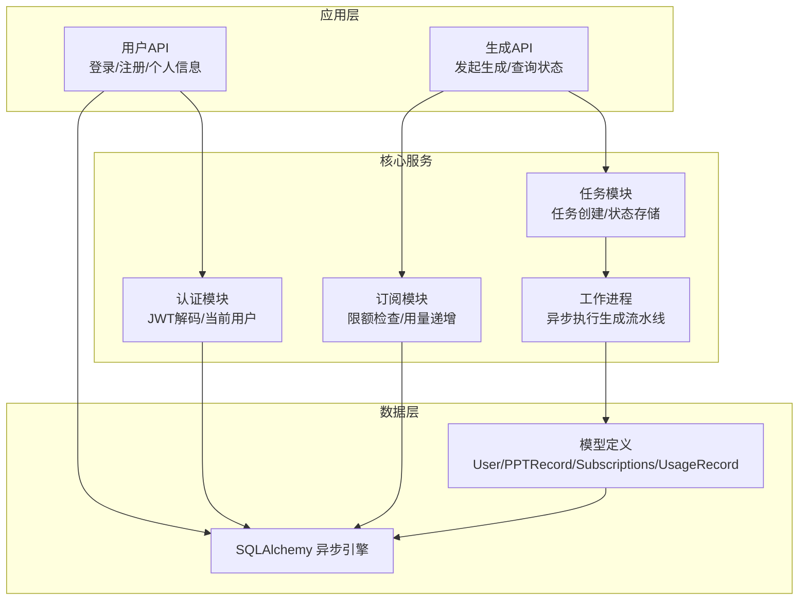
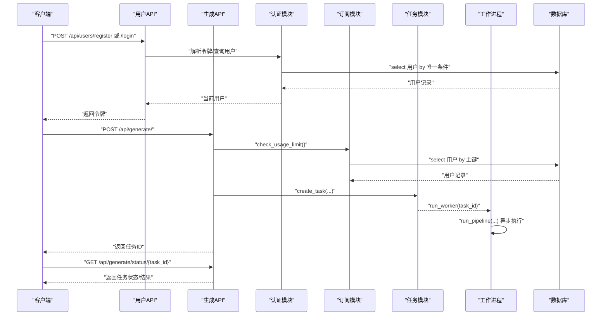
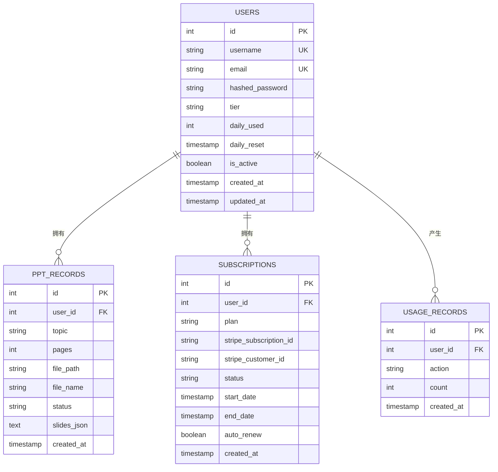
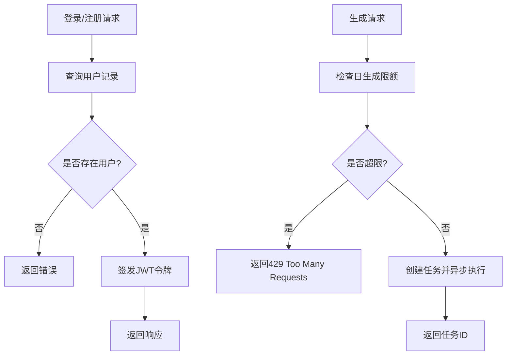
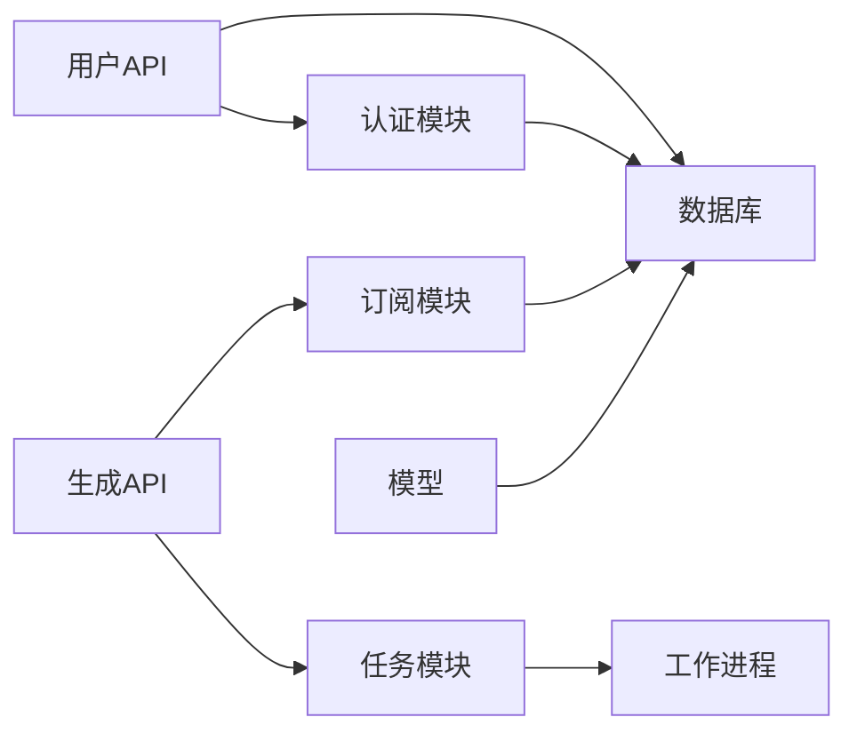

# 索引与性能优化

<cite>
**本文引用的文件**
- [backend/core/db.py](file://backend/core/db.py)
- [backend/core/config.py](file://backend/core/config.py)
- [backend/models/user.py](file://backend/models/user.py)
- [backend/models/ppt.py](file://backend/models/ppt.py)
- [backend/models/subscription.py](file://backend/models/subscription.py)
- [backend/api/users.py](file://backend/api/users.py)
- [backend/api/generate.py](file://backend/api/generate.py)
- [backend/core/auth.py](file://backend/core/auth.py)
- [backend/core/subscriptions.py](file://backend/core/subscriptions.py)
- [backend/core/tasks.py](file://backend/core/tasks.py)
- [backend/workers/ppt_worker.py](file://backend/workers/ppt_worker.py)
- [backend/requirements.txt](file://backend/requirements.txt)
</cite>

## 目录
1. 引言
2. 项目结构
3. 核心组件
4. 架构总览
5. 详细组件分析
6. 依赖分析
7. 性能考量
8. 故障排查指南
9. 结论
10. 附录

## 引言
本文件面向AI-PPT项目的数据库索引与性能优化，结合现有代码库中的数据库模型、查询路径与运行时行为，系统性地给出索引设计原则、索引类型选择、查询性能分析、执行计划优化、慢查询识别、数据库参数调优、缓存策略、连接池优化、数据分区与归档、存储优化、监控指标、性能基准测试与容量规划建议，并提供故障排查与瓶颈定位方法。

## 项目结构
后端采用FastAPI + SQLAlchemy异步ORM + 关系型数据库（默认SQLite/可替换为PostgreSQL）的架构。数据库初始化在应用启动阶段完成，用户、PPT记录、订阅与用量记录构成主要数据表；认证与鉴权通过JWT实现；生成流程通过任务队列与工作进程异步执行。

图示来源
- [backend/api/users.py:1-75](file://backend/api/users.py#L1-L75)
- [backend/api/generate.py:1-52](file://backend/api/generate.py#L1-L52)
- [backend/core/auth.py:1-57](file://backend/core/auth.py#L1-L57)
- [backend/core/subscriptions.py:1-58](file://backend/core/subscriptions.py#L1-L58)
- [backend/core/tasks.py:1-33](file://backend/core/tasks.py#L1-L33)
- [backend/workers/ppt_worker.py:1-24](file://backend/workers/ppt_worker.py#L1-L24)
- [backend/core/db.py:1-27](file://backend/core/db.py#L1-L27)
- [backend/models/user.py:1-21](file://backend/models/user.py#L1-L21)
- [backend/models/ppt.py:1-18](file://backend/models/ppt.py#L1-L18)
- [backend/models/subscription.py:1-29](file://backend/models/subscription.py#L1-L29)

章节来源
- [backend/core/db.py:1-27](file://backend/core/db.py#L1-L27)
- [backend/core/config.py:1-34](file://backend/core/config.py#L1-L34)
- [backend/models/user.py:1-21](file://backend/models/user.py#L1-L21)
- [backend/models/ppt.py:1-18](file://backend/models/ppt.py#L1-L18)
- [backend/models/subscription.py:1-29](file://backend/models/subscription.py#L1-L29)
- [backend/api/users.py:1-75](file://backend/api/users.py#L1-L75)
- [backend/api/generate.py:1-52](file://backend/api/generate.py#L1-L52)
- [backend/core/auth.py:1-57](file://backend/core/auth.py#L1-L57)
- [backend/core/subscriptions.py:1-58](file://backend/core/subscriptions.py#L1-L58)
- [backend/core/tasks.py:1-33](file://backend/core/tasks.py#L1-L33)
- [backend/workers/ppt_worker.py:1-24](file://backend/workers/ppt_worker.py#L1-L24)
- [backend/requirements.txt:1-22](file://backend/requirements.txt#L1-L22)

## 核心组件
- 数据库引擎与会话：异步SQLAlchemy引擎与会话工厂，支持调试输出与连接生命周期管理。
- 模型层：用户、PPT记录、订阅、用量记录，定义主键、外键、字段约束与默认值。
- 认证与授权：基于JWT的令牌签发与校验，依赖数据库查询当前用户。
- 订阅与配额：按用户等级限制日生成次数，使用用量记录追踪。
- 任务与工作进程：内存级任务存储，异步执行生成流水线。
- API层：用户注册/登录、生成请求、状态查询等接口。

章节来源
- [backend/core/db.py:1-27](file://backend/core/db.py#L1-L27)
- [backend/models/user.py:1-21](file://backend/models/user.py#L1-L21)
- [backend/models/ppt.py:1-18](file://backend/models/ppt.py#L1-L18)
- [backend/models/subscription.py:1-29](file://backend/models/subscription.py#L1-L29)
- [backend/core/auth.py:1-57](file://backend/core/auth.py#L1-L57)
- [backend/core/subscriptions.py:1-58](file://backend/core/subscriptions.py#L1-L58)
- [backend/core/tasks.py:1-33](file://backend/core/tasks.py#L1-L33)
- [backend/workers/ppt_worker.py:1-24](file://backend/workers/ppt_worker.py#L1-L24)
- [backend/api/users.py:1-75](file://backend/api/users.py#L1-L75)
- [backend/api/generate.py:1-52](file://backend/api/generate.py#L1-L52)

## 架构总览
下图展示从API到数据库与工作进程的整体调用链路，以及关键查询点。

图示来源
- [backend/api/users.py:34-61](file://backend/api/users.py#L34-L61)
- [backend/core/auth.py:47-56](file://backend/core/auth.py#L47-L56)
- [backend/api/generate.py:20-35](file://backend/api/generate.py#L20-L35)
- [backend/core/subscriptions.py:46-50](file://backend/core/subscriptions.py#L46-L50)
- [backend/core/tasks.py:14-28](file://backend/core/tasks.py#L14-L28)
- [backend/workers/ppt_worker.py:5-24](file://backend/workers/ppt_worker.py#L5-L24)

## 详细组件分析

### 数据库模型与索引设计原则
- 用户表（users）
  - 主键：id（自增）
  - 唯一键：username、email
  - 查询热点：按username登录、按id查询当前用户
  - 建议索引：username、email（唯一索引已由ORM/DDL保证），id为主键无需额外索引
- PPT记录表（ppt_records）
  - 主键：id
  - 外键：user_id → users.id
  - 字段：topic、pages、file_path、file_name、status、created_at
  - 查询热点：按user_id分页查询个人历史、按status筛选待处理/已完成
  - 建议索引：user_id（外键）、status、created_at（时间范围过滤）
- 订阅表（subscriptions）
  - 主键：id
  - 外键：user_id → users.id
  - 查询热点：按user_id查询当前有效订阅
  - 建议索引：user_id（外键）、status、start_date/end_date（范围查询）
- 用量记录表（usage_records）
  - 主键：id
  - 外键：user_id → users.id
  - 查询热点：按user_id与时间窗口统计用量
  - 建议索引：user_id、created_at（复合索引支持按用户+时间聚合）

图示来源
- [backend/models/user.py:6-21](file://backend/models/user.py#L6-L21)
- [backend/models/ppt.py:6-18](file://backend/models/ppt.py#L6-L18)
- [backend/models/subscription.py:6-29](file://backend/models/subscription.py#L6-L29)

章节来源
- [backend/models/user.py:1-21](file://backend/models/user.py#L1-L21)
- [backend/models/ppt.py:1-18](file://backend/models/ppt.py#L1-L18)
- [backend/models/subscription.py:1-29](file://backend/models/subscription.py#L1-L29)

### 查询路径与执行计划优化
- 登录/注册查询
  - 路径：用户API → 认证模块 → 数据库查询
  - 优化要点：确保username/email上有唯一索引；避免SELECT全字段，仅取必要字段
- 生成请求
  - 路径：生成API → 订阅模块 → 任务模块 → 工作进程
  - 优化要点：限额检查与用量记录写入应原子化；任务状态存储在内存字典中，注意高并发下的竞争条件
- 生成状态查询
  - 路径：生成API → 任务模块 → 返回状态
  - 优化要点：状态查询为O(1)，无需数据库

图示来源
- [backend/api/users.py:34-61](file://backend/api/users.py#L34-L61)
- [backend/core/auth.py:47-56](file://backend/core/auth.py#L47-L56)
- [backend/api/generate.py:20-35](file://backend/api/generate.py#L20-L35)
- [backend/core/subscriptions.py:46-50](file://backend/core/subscriptions.py#L46-L50)
- [backend/core/tasks.py:14-28](file://backend/core/tasks.py#L14-L28)

章节来源
- [backend/api/users.py:1-75](file://backend/api/users.py#L1-L75)
- [backend/core/auth.py:1-57](file://backend/core/auth.py#L1-L57)
- [backend/api/generate.py:1-52](file://backend/api/generate.py#L1-L52)
- [backend/core/subscriptions.py:1-58](file://backend/core/subscriptions.py#L1-L58)
- [backend/core/tasks.py:1-33](file://backend/core/tasks.py#L1-L33)

### 慢查询识别与定位
- 可能的慢查询场景
  - 用户登录：按username查询，若未命中唯一索引或存在锁争用，可能变慢
  - 生成限额检查：按用户主键查询，通常快速；但若daily_used更新频繁且未使用事务隔离，可能出现竞态
  - PPT历史列表：按user_id排序分页，若缺少索引或排序字段未建索引，分页扫描成本高
- 定位手段
  - 开启SQL调试输出（当前设置支持echo），观察实际SQL与耗时
  - 在高频查询处增加EXPLAIN/ANALYZE（如PostgreSQL），关注索引使用与回表情况
  - 对分页查询添加LIMIT/OFFSET，避免全表扫描

章节来源
- [backend/core/db.py:5](file://backend/core/db.py#L5)
- [backend/api/users.py:54-61](file://backend/api/users.py#L54-L61)
- [backend/core/subscriptions.py:53-57](file://backend/core/subscriptions.py#L53-L57)
- [backend/models/ppt.py:9-17](file://backend/models/ppt.py#L9-L17)

### 数据库参数调优
- 连接池参数（以SQLAlchemy异步引擎为例）
  - pool_size：根据并发请求数与数据库承载能力设定
  - max_overflow：超出pool_size后的溢出连接数
  - pool_recycle/pool_pre_ping：保持连接有效性，减少断连重试
- SQLite与PostgreSQL差异
  - SQLite：默认文件型，适合开发/小规模；生产建议PostgreSQL，具备更强并发与索引能力
  - PostgreSQL：启用autovacuum、合理设置shared_buffers/buffer_pool_size、开启查询分析器
- 配置参考
  - 当前使用异步驱动（aiosqlite/asyncpg），需确保连接池参数与部署环境匹配

章节来源
- [backend/core/db.py:5](file://backend/core/db.py#L5)
- [backend/core/config.py:11](file://backend/core/config.py#L11)
- [backend/requirements.txt:9-10](file://backend/requirements.txt#L9-L10)

### 缓存策略
- Redis连接配置（用于会话/令牌/临时数据缓存）
  - 当前配置项：redis_url
  - 建议用途：短期令牌缓存、会话状态、热点查询结果缓存、任务状态轻量存储
- 缓存命中与失效
  - 对高频读取的用户信息、订阅状态、模板元数据进行缓存
  - 设置合理的TTL，避免脏读；对写操作采用“先删后写”或“写后失效”

章节来源
- [backend/core/config.py:12](file://backend/core/config.py#L12)
- [backend/requirements.txt:19](file://backend/requirements.txt#L19)

### 连接池优化
- 异步引擎与会话
  - 使用AsyncEngine与AsyncSession，避免阻塞I/O
  - 会话关闭在上下文结束时自动触发，确保资源释放
- 并发与事务
  - 将限额检查与用量记录写入放在同一事务内，防止竞态
  - 对批量写入（如大量用量记录）考虑批量提交

章节来源
- [backend/core/db.py:13-18](file://backend/core/db.py#L13-L18)
- [backend/core/subscriptions.py:53-57](file://backend/core/subscriptions.py#L53-L57)

### 数据分区、归档与存储优化
- 分区策略
  - 按时间分区：PPT记录与用量记录按created_at分区，便于清理与统计
  - 按用户分区：大用户量场景可考虑水平拆分用户表或记录表
- 归档策略
  - 将历史用量记录定期归档至冷存储，保留最近N天的明细
  - 对过期订阅与无效任务进行清理
- 存储优化
  - 文本字段（如slides_json）可考虑压缩存储
  - 文件路径与名称字段避免冗余，统一管理媒体存储

章节来源
- [backend/models/ppt.py:15-17](file://backend/models/ppt.py#L15-L17)
- [backend/models/subscription.py:25-28](file://backend/models/subscription.py#L25-L28)

### 监控指标与基准测试
- 指标建议
  - QPS/TPS：每秒请求与事务数
  - 响应时间：P95/P99延迟
  - 数据库指标：连接数、缓存命中率、慢查询数、锁等待
  - 应用指标：任务队列长度、工作进程吞吐、Redis命中率
- 基准测试
  - 使用压力测试工具模拟并发登录/生成/查询
  - 逐步提升并发，观察数据库与应用的拐点
- 容量规划
  - 基于峰值QPS与响应时间目标，反推连接池大小与实例规格
  - 预留20%-30%缓冲，应对流量波动

[本节为通用指导，不直接分析具体文件]

### 故障排查指南
- 登录失败/401
  - 检查JWT密钥与算法配置
  - 核对令牌格式与过期时间
- 429限流
  - 检查用户等级与daily_used更新逻辑
  - 确认事务隔离级别与并发写入一致性
- 任务状态异常
  - 检查任务字典是否被意外清空
  - 观察工作进程异常堆栈与磁盘IO
- 数据库连接问题
  - 检查数据库URL与驱动版本
  - 开启echo观察SQL执行与错误

章节来源
- [backend/core/auth.py:35-44](file://backend/core/auth.py#L35-L44)
- [backend/api/generate.py:26-29](file://backend/api/generate.py#L26-L29)
- [backend/core/subscriptions.py:53-57](file://backend/core/subscriptions.py#L53-L57)
- [backend/core/tasks.py:31-33](file://backend/core/tasks.py#L31-L33)
- [backend/workers/ppt_worker.py:20-24](file://backend/workers/ppt_worker.py#L20-L24)
- [backend/core/db.py:5](file://backend/core/db.py#L5)

## 依赖分析
- 组件耦合
  - API层依赖认证、订阅、任务模块
  - 任务模块依赖工作进程与生成流水线
  - 认证与订阅模块依赖数据库模型
- 外部依赖
  - SQLAlchemy异步引擎与驱动（aiosqlite/asyncpg）
  - Redis（可选）
  - JWT与加密库

图示来源
- [backend/api/users.py:1-75](file://backend/api/users.py#L1-L75)
- [backend/api/generate.py:1-52](file://backend/api/generate.py#L1-L52)
- [backend/core/auth.py:1-57](file://backend/core/auth.py#L1-L57)
- [backend/core/subscriptions.py:1-58](file://backend/core/subscriptions.py#L1-L58)
- [backend/core/tasks.py:1-33](file://backend/core/tasks.py#L1-L33)
- [backend/workers/ppt_worker.py:1-24](file://backend/workers/ppt_worker.py#L1-L24)
- [backend/core/db.py:1-27](file://backend/core/db.py#L1-L27)
- [backend/models/user.py:1-21](file://backend/models/user.py#L1-L21)
- [backend/models/ppt.py:1-18](file://backend/models/ppt.py#L1-L18)
- [backend/models/subscription.py:1-29](file://backend/models/subscription.py#L1-L29)

章节来源
- [backend/requirements.txt:1-22](file://backend/requirements.txt#L1-L22)

## 性能考量
- 索引策略
  - 为高频过滤字段建立单列索引（如user_id、status、created_at）
  - 为多条件组合查询建立复合索引（如user_id+created_at）
- 查询优化
  - 避免SELECT *，仅取必要字段
  - 对分页查询使用覆盖索引，减少回表
  - 使用EXISTS替代COUNT(*)判断存在性
- 缓存与降载
  - 对热点读取加Redis缓存
  - 对写密集场景采用批量提交与幂等设计
- 连接池与并发
  - 合理设置连接池上限与回收周期
  - 使用异步I/O降低阻塞

[本节为通用指导，不直接分析具体文件]

## 故障排查指南
- 常见问题与定位步骤
  - 登录失败：核对令牌签名与用户存在性
  - 429限流：检查daily_used与事务一致性
  - 任务未完成：检查任务字典与工作进程异常
  - 数据库错误：开启echo，查看SQL与驱动报错
- 解决方案
  - 补充缺失索引，优化慢查询
  - 调整连接池参数，避免连接枯竭
  - 引入Redis缓存热点数据
  - 对写操作使用事务与重试机制

章节来源
- [backend/core/auth.py:35-44](file://backend/core/auth.py#L35-L44)
- [backend/api/generate.py:26-29](file://backend/api/generate.py#L26-L29)
- [backend/core/subscriptions.py:53-57](file://backend/core/subscriptions.py#L53-L57)
- [backend/core/tasks.py:31-33](file://backend/core/tasks.py#L31-L33)
- [backend/workers/ppt_worker.py:20-24](file://backend/workers/ppt_worker.py#L20-L24)
- [backend/core/db.py:5](file://backend/core/db.py#L5)

## 结论
通过对AI-PPT项目数据库模型与查询路径的系统分析，建议优先完善索引覆盖、优化慢查询、引入Redis缓存、调整连接池参数，并建立完善的监控与容量规划体系。在生产环境中，推荐使用PostgreSQL替代SQLite，配合分区与归档策略，持续进行性能压测与指标观测，确保系统在高并发场景下的稳定性与可扩展性。

## 附录
- 快速检查清单
  - 是否为user_id、status、created_at等常用过滤字段建立索引
  - 是否对高频读取的数据加入Redis缓存
  - 是否开启数据库echo进行慢查询定位
  - 是否对写密集操作使用事务与批量提交
  - 是否对任务状态与热点数据进行缓存与降载

[本节为通用指导，不直接分析具体文件]