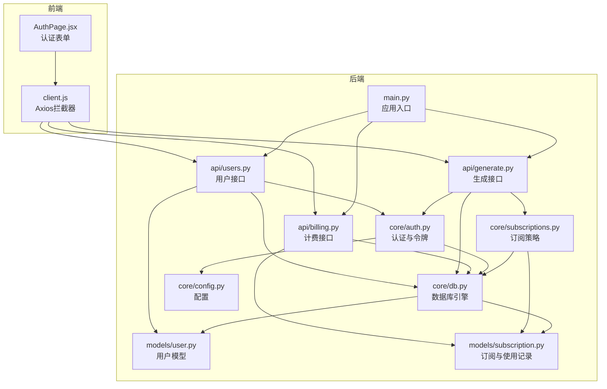
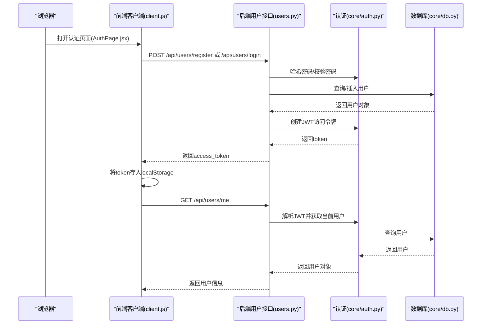
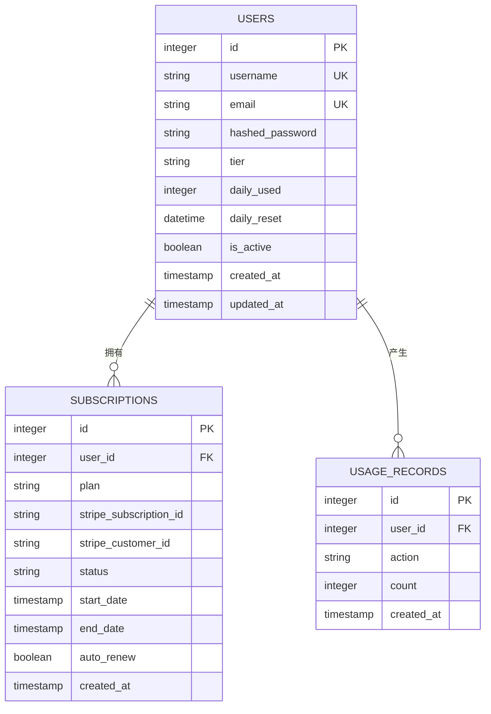
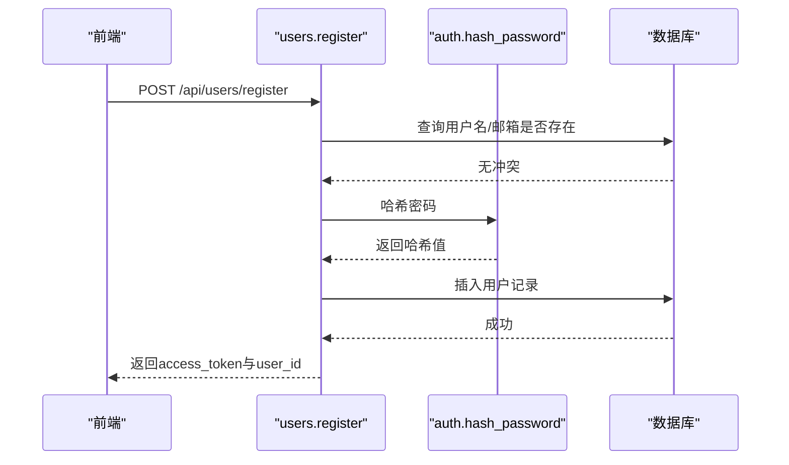
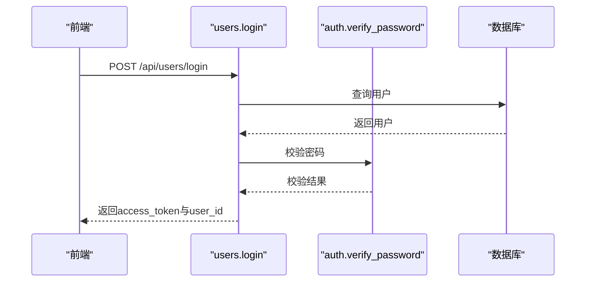
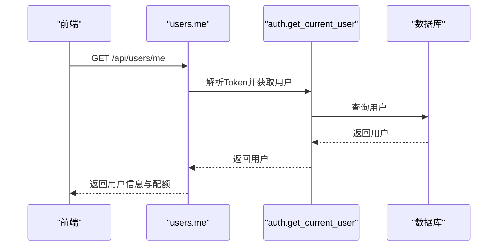
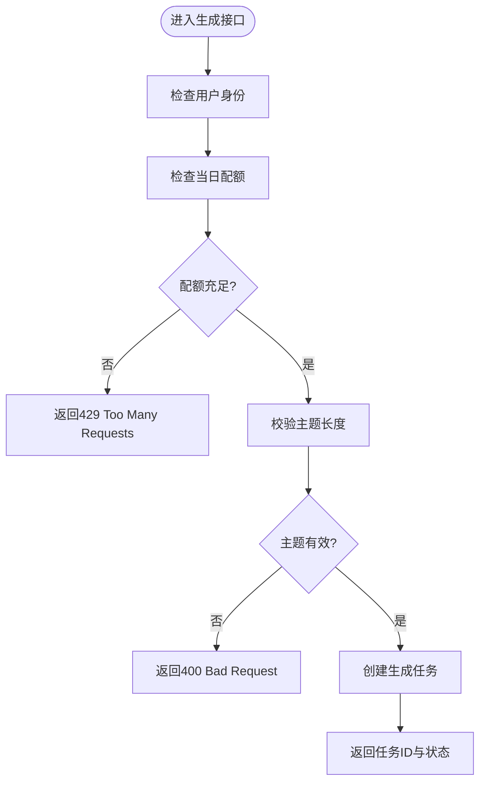
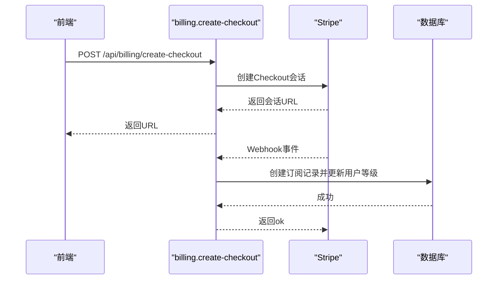
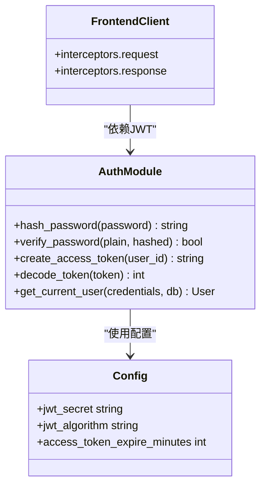
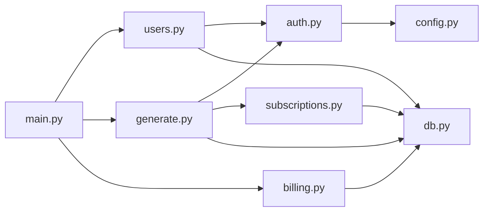

# 用户管理系统

<cite>
**本文档引用的文件**
- [backend/models/user.py](file://backend/models/user.py)
- [backend/models/subscription.py](file://backend/models/subscription.py)
- [backend/api/users.py](file://backend/api/users.py)
- [backend/api/generate.py](file://backend/api/generate.py)
- [backend/api/billing.py](file://backend/api/billing.py)
- [backend/core/auth.py](file://backend/core/auth.py)
- [backend/core/db.py](file://backend/core/db.py)
- [backend/core/config.py](file://backend/core/config.py)
- [backend/core/subscriptions.py](file://backend/core/subscriptions.py)
- [backend/main.py](file://backend/main.py)
- [frontend/src/pages/AuthPage.jsx](file://frontend/src/pages/AuthPage.jsx)
- [frontend/src/api/client.js](file://frontend/src/api/client.js)
</cite>

## 目录
1. [简介](#简介)
2. [项目结构](#项目结构)
3. [核心组件](#核心组件)
4. [架构总览](#架构总览)
5. [详细组件分析](#详细组件分析)
6. [依赖关系分析](#依赖关系分析)
7. [性能考量](#性能考量)
8. [故障排除指南](#故障排除指南)
9. [结论](#结论)
10. [附录](#附录)

## 简介
本文件面向AI-PPT项目的用户管理系统，系统采用FastAPI后端与React前端，基于SQLAlchemy ORM进行数据库建模，使用bcrypt进行密码哈希，JWT进行会话认证，并通过Stripe实现订阅与计费。用户模型支持基础认证、每日配额限制与订阅等级联动，前端通过Axios拦截器自动注入认证头并处理401未授权重定向。

## 项目结构
后端采用分层架构：
- models：数据模型（用户、订阅、使用记录）
- api：路由与业务接口（用户、生成、计费等）
- core：通用能力（数据库连接、认证、配置、订阅策略）
- frontend：React单页应用，负责用户认证与交互

图表来源
- [backend/main.py:1-40](file://backend/main.py#L1-L40)
- [backend/api/users.py:1-75](file://backend/api/users.py#L1-L75)
- [backend/api/generate.py:1-52](file://backend/api/generate.py#L1-L52)
- [backend/api/billing.py:1-80](file://backend/api/billing.py#L1-L80)
- [backend/core/auth.py:1-57](file://backend/core/auth.py#L1-L57)
- [backend/core/db.py:1-27](file://backend/core/db.py#L1-L27)
- [backend/core/config.py:1-34](file://backend/core/config.py#L1-L34)
- [backend/core/subscriptions.py:1-58](file://backend/core/subscriptions.py#L1-L58)
- [backend/models/user.py:1-21](file://backend/models/user.py#L1-L21)
- [backend/models/subscription.py:1-29](file://backend/models/subscription.py#L1-L29)
- [frontend/src/pages/AuthPage.jsx:1-65](file://frontend/src/pages/AuthPage.jsx#L1-L65)
- [frontend/src/api/client.js:1-28](file://frontend/src/api/client.js#L1-L28)

章节来源
- [backend/main.py:1-40](file://backend/main.py#L1-L40)
- [backend/core/db.py:1-27](file://backend/core/db.py#L1-L27)

## 核心组件
- 用户模型（User）：包含唯一用户名、邮箱、哈希密码、订阅等级、当日用量、活跃状态及时间戳字段。
- 认证模块（Auth）：提供密码哈希/校验、JWT签发/解码、当前用户解析。
- 数据库模块（DB）：异步SQLAlchemy引擎与会话工厂，初始化元数据。
- 配置模块（Config）：集中管理应用配置，包括数据库URL、JWT密钥、过期时间、Stripe密钥等。
- 订阅策略（Subscriptions）：定义不同等级的每日限额与功能集合，提供使用检查与用量递增。
- 用户接口（Users API）：注册、登录、获取当前用户信息。
- 生成接口（Generate API）：在用户认证基础上执行生成任务前进行配额检查。
- 计费接口（Billing API）：创建Stripe Checkout会话与Webhook处理，同步用户订阅状态与等级。

章节来源
- [backend/models/user.py:6-21](file://backend/models/user.py#L6-L21)
- [backend/core/auth.py:16-56](file://backend/core/auth.py#L16-L56)
- [backend/core/db.py:5-27](file://backend/core/db.py#L5-L27)
- [backend/core/config.py:4-34](file://backend/core/config.py#L4-L34)
- [backend/core/subscriptions.py:10-58](file://backend/core/subscriptions.py#L10-L58)
- [backend/api/users.py:14-75](file://backend/api/users.py#L14-L75)
- [backend/api/generate.py:20-52](file://backend/api/generate.py#L20-L52)
- [backend/api/billing.py:14-80](file://backend/api/billing.py#L14-L80)

## 架构总览
系统采用前后端分离模式，前端通过HTTP请求调用后端接口，后端通过依赖注入获取数据库会话与当前用户，认证通过JWT Bearer Token传递。

图表来源
- [frontend/src/pages/AuthPage.jsx:12-29](file://frontend/src/pages/AuthPage.jsx#L12-L29)
- [frontend/src/api/client.js:8-25](file://frontend/src/api/client.js#L8-L25)
- [backend/api/users.py:34-74](file://backend/api/users.py#L34-L74)
- [backend/core/auth.py:47-56](file://backend/core/auth.py#L47-L56)
- [backend/core/db.py:13-18](file://backend/core/db.py#L13-L18)

## 详细组件分析

### 用户模型设计与关系映射
- 字段定义
  - 主键：自增整数ID
  - 唯一约束：用户名、邮箱
  - 密码：存储哈希值
  - 订阅等级：字符串，默认“free”
  - 当日用量：整数，默认0；用于每日配额控制
  - 活跃状态：布尔，默认True
  - 时间戳：创建与更新时间，自动维护
- 关系映射
  - 用户与订阅：一对多（用户拥有多个订阅记录）
  - 用户与使用记录：一对多（用户产生多次使用记录）

图表来源
- [backend/models/user.py:6-21](file://backend/models/user.py#L6-L21)
- [backend/models/subscription.py:6-29](file://backend/models/subscription.py#L6-L29)

章节来源
- [backend/models/user.py:6-21](file://backend/models/user.py#L6-L21)
- [backend/models/subscription.py:6-29](file://backend/models/subscription.py#L6-L29)

### 用户注册流程
- 输入参数：用户名、邮箱、密码
- 业务逻辑：
  - 校验用户名或邮箱是否已存在
  - 对密码进行哈希处理
  - 写入数据库并返回新用户对象
  - 生成JWT访问令牌
- 返回：访问令牌、令牌类型、用户ID

图表来源
- [backend/api/users.py:34-51](file://backend/api/users.py#L34-L51)
- [backend/core/auth.py:16-17](file://backend/core/auth.py#L16-L17)
- [backend/core/db.py:13-18](file://backend/core/db.py#L13-L18)

章节来源
- [backend/api/users.py:34-51](file://backend/api/users.py#L34-L51)

### 用户登录流程
- 输入参数：用户名、密码
- 业务逻辑：
  - 根据用户名查询用户
  - 校验密码哈希
  - 生成JWT访问令牌
- 返回：访问令牌、令牌类型、用户ID

图表来源
- [backend/api/users.py:54-61](file://backend/api/users.py#L54-L61)
- [backend/core/auth.py:20-21](file://backend/core/auth.py#L20-L21)
- [backend/core/db.py:13-18](file://backend/core/db.py#L13-L18)

章节来源
- [backend/api/users.py:54-61](file://backend/api/users.py#L54-L61)

### 获取当前用户信息流程
- 接口：GET /api/users/me
- 业务逻辑：
  - 通过Bearer Token解析当前用户
  - 查询用户信息并返回
  - 同时返回该用户的订阅等级与当日配额上限

图表来源
- [backend/api/users.py:64-74](file://backend/api/users.py#L64-L74)
- [backend/core/auth.py:47-56](file://backend/core/auth.py#L47-L56)
- [backend/core/subscriptions.py:42-43](file://backend/core/subscriptions.py#L42-L43)

章节来源
- [backend/api/users.py:64-74](file://backend/api/users.py#L64-L74)

### 生成PPT的配额控制流程
- 接口：POST /api/generate/
- 业务逻辑：
  - 需要已登录用户
  - 检查当日生成次数是否超过配额
  - 校验主题有效性
  - 创建生成任务并返回任务ID
- 配额策略：根据订阅等级设定每日上限，使用记录与增量由订阅模块维护

图表来源
- [backend/api/generate.py:20-35](file://backend/api/generate.py#L20-L35)
- [backend/core/subscriptions.py:46-57](file://backend/core/subscriptions.py#L46-L57)

章节来源
- [backend/api/generate.py:20-35](file://backend/api/generate.py#L20-L35)
- [backend/core/subscriptions.py:46-57](file://backend/core/subscriptions.py#L46-L57)

### 订阅与计费流程
- 创建Checkout会话：根据计划价格创建Stripe会话，返回跳转URL
- Webhook处理：接收Stripe事件，创建订阅记录并更新用户等级

图表来源
- [backend/api/billing.py:14-42](file://backend/api/billing.py#L14-L42)
- [backend/api/billing.py:45-79](file://backend/api/billing.py#L45-L79)
- [backend/models/subscription.py:6-19](file://backend/models/subscription.py#L6-L19)

章节来源
- [backend/api/billing.py:14-42](file://backend/api/billing.py#L14-L42)
- [backend/api/billing.py:45-79](file://backend/api/billing.py#L45-L79)

### 密码加密与会话管理
- 密码加密：bcrypt对明文密码加盐哈希存储
- 会话管理：JWT Bearer Token，包含用户ID与过期时间
- 安全策略：前端拦截器自动附加Authorization头；401时清除本地token并重定向到登录页

图表来源
- [backend/core/auth.py:16-56](file://backend/core/auth.py#L16-L56)
- [backend/core/config.py:14-16](file://backend/core/config.py#L14-L16)
- [frontend/src/api/client.js:8-25](file://frontend/src/api/client.js#L8-L25)

章节来源
- [backend/core/auth.py:16-56](file://backend/core/auth.py#L16-L56)
- [frontend/src/api/client.js:8-25](file://frontend/src/api/client.js#L8-L25)

### 用户权限体系与访问控制
- 身份认证：所有受保护接口均需Bearer Token
- 当前用户解析：通过解码JWT获取用户ID并查询数据库
- 访问控制：前端在401时自动清理token并跳转至登录页

章节来源
- [backend/core/auth.py:47-56](file://backend/core/auth.py#L47-L56)
- [frontend/src/api/client.js:16-25](file://frontend/src/api/client.js#L16-L25)

### 用户数据验证规则与业务逻辑
- 注册：用户名与邮箱唯一性校验；密码哈希存储
- 登录：用户名存在且密码匹配
- 生成：主题长度校验；配额不足返回429
- 计费：计划有效性校验；Webhook签名验证

章节来源
- [backend/api/users.py:34-61](file://backend/api/users.py#L34-L61)
- [backend/api/generate.py:26-32](file://backend/api/generate.py#L26-L32)
- [backend/api/billing.py:24-56](file://backend/api/billing.py#L24-L56)

## 依赖关系分析
- 组件耦合
  - 用户接口依赖认证模块与数据库
  - 生成接口依赖认证模块、订阅策略与任务模块
  - 计费接口依赖Stripe SDK与数据库
- 外部依赖
  - bcrypt：密码哈希
  - jwt：令牌编码/解码
  - SQLAlchemy：ORM与异步会话
  - Stripe：支付与Webhook
- 可能的循环依赖
  - 当前模块间通过函数依赖避免直接循环导入

图表来源
- [backend/api/users.py:1-11](file://backend/api/users.py#L1-L11)
- [backend/api/generate.py:1-11](file://backend/api/generate.py#L1-L11)
- [backend/api/billing.py:1-11](file://backend/api/billing.py#L1-L11)
- [backend/core/auth.py:1-11](file://backend/core/auth.py#L1-L11)
- [backend/core/subscriptions.py:1-7](file://backend/core/subscriptions.py#L1-L7)
- [backend/core/db.py:1-6](file://backend/core/db.py#L1-L6)
- [backend/main.py:30-34](file://backend/main.py#L30-L34)

章节来源
- [backend/api/users.py:1-11](file://backend/api/users.py#L1-L11)
- [backend/api/generate.py:1-11](file://backend/api/generate.py#L1-L11)
- [backend/api/billing.py:1-11](file://backend/api/billing.py#L1-L11)
- [backend/core/auth.py:1-11](file://backend/core/auth.py#L1-L11)
- [backend/core/subscriptions.py:1-7](file://backend/core/subscriptions.py#L1-L7)
- [backend/core/db.py:1-6](file://backend/core/db.py#L1-L6)
- [backend/main.py:30-34](file://backend/main.py#L30-L34)

## 性能考量
- 异步数据库：使用SQLAlchemy异步引擎，减少阻塞
- 令牌过期：合理设置过期时间，平衡安全性与用户体验
- 配额控制：在生成接口前置检查，避免无效任务创建
- 前端拦截器：统一处理认证头与401重定向，降低重复代码

## 故障排除指南
- 400 错误（注册/登录/生成）
  - 注册：用户名或邮箱已存在
  - 登录：用户名或密码错误
  - 生成：主题无效或超出配额
- 401 未授权
  - 前端拦截器会清除本地token并跳转登录页
- 429 过多请求
  - 当日生成次数已达上限，请升级订阅
- Stripe Webhook
  - 确认签名密钥正确，事件类型处理逻辑完备

章节来源
- [backend/api/users.py:39-61](file://backend/api/users.py#L39-L61)
- [backend/api/generate.py:26-32](file://backend/api/generate.py#L26-L32)
- [frontend/src/api/client.js:16-25](file://frontend/src/api/client.js#L16-L25)
- [backend/api/billing.py:53-79](file://backend/api/billing.py#L53-L79)

## 结论
用户管理系统围绕用户模型、认证与会话、订阅与配额控制构建，前后端协作清晰，具备良好的扩展性。建议在生产环境中强化以下方面：完善用户信息更新与删除流程、增加更细粒度的角色与权限控制、加强输入验证与速率限制、优化配额重置逻辑与审计日志。

## 附录
- 前端认证页面与Axios拦截器示例路径
  - [frontend/src/pages/AuthPage.jsx:12-29](file://frontend/src/pages/AuthPage.jsx#L12-L29)
  - [frontend/src/api/client.js:8-25](file://frontend/src/api/client.js#L8-L25)
- 应用入口与路由挂载
  - [backend/main.py:30-34](file://backend/main.py#L30-L34)