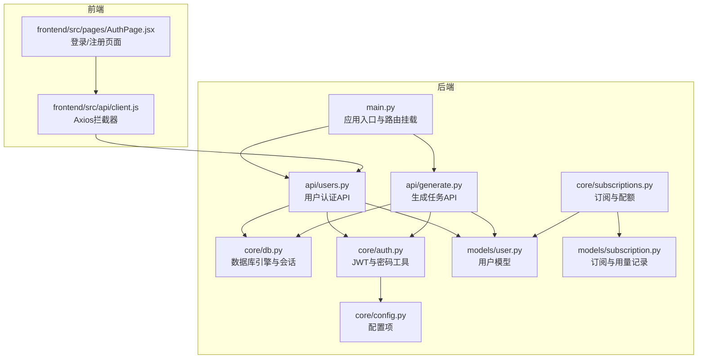
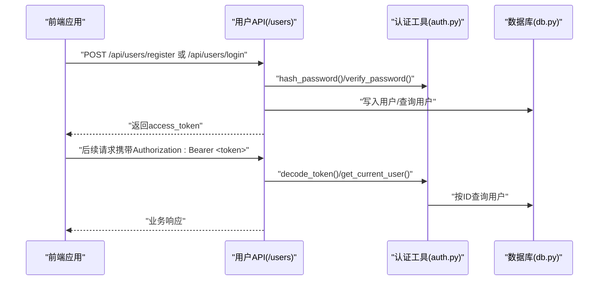
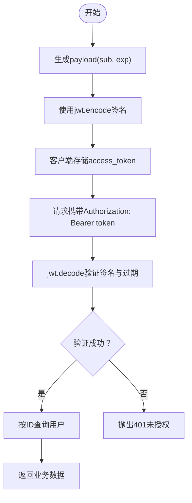
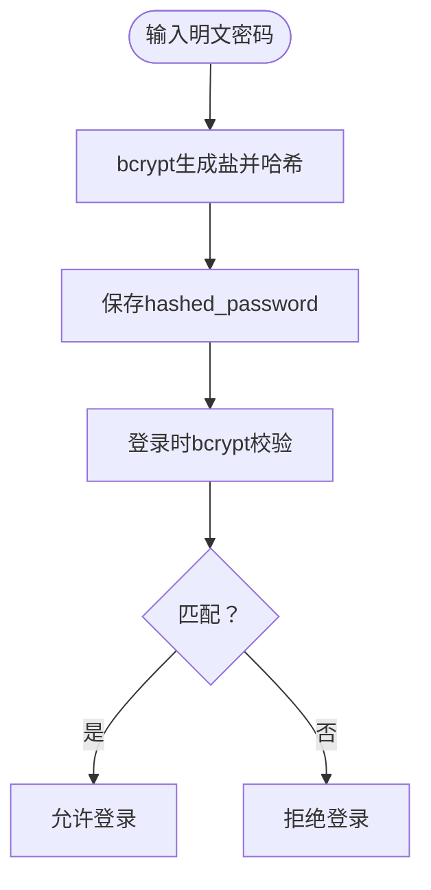
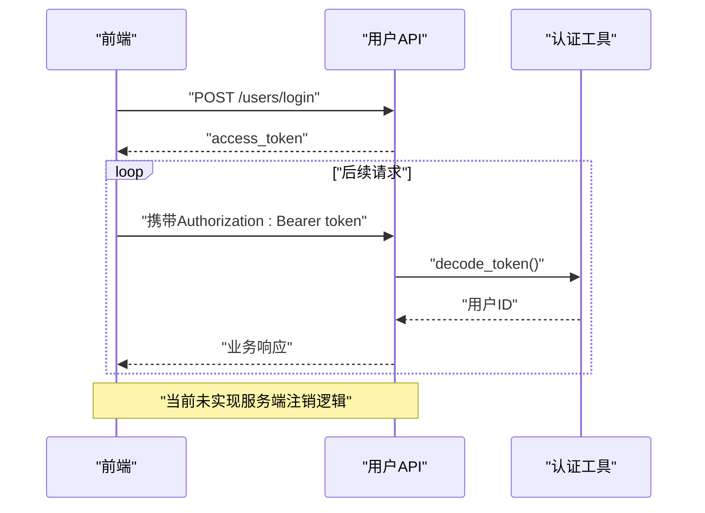
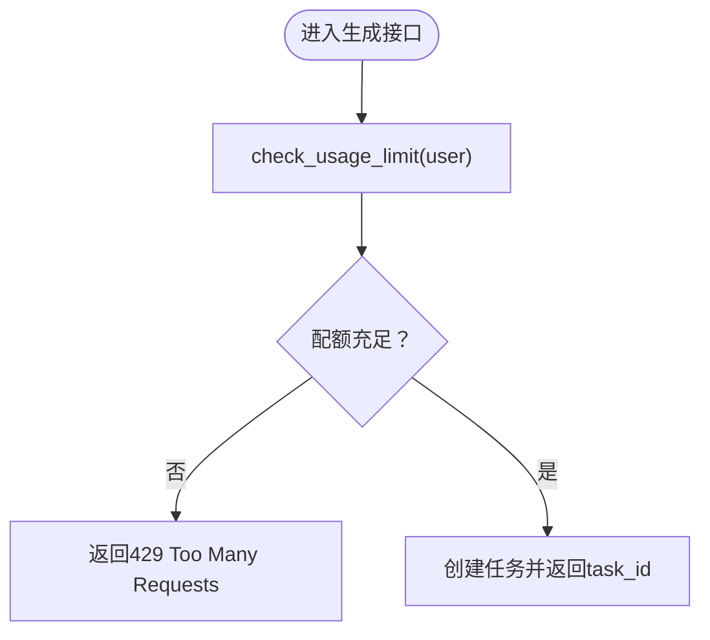
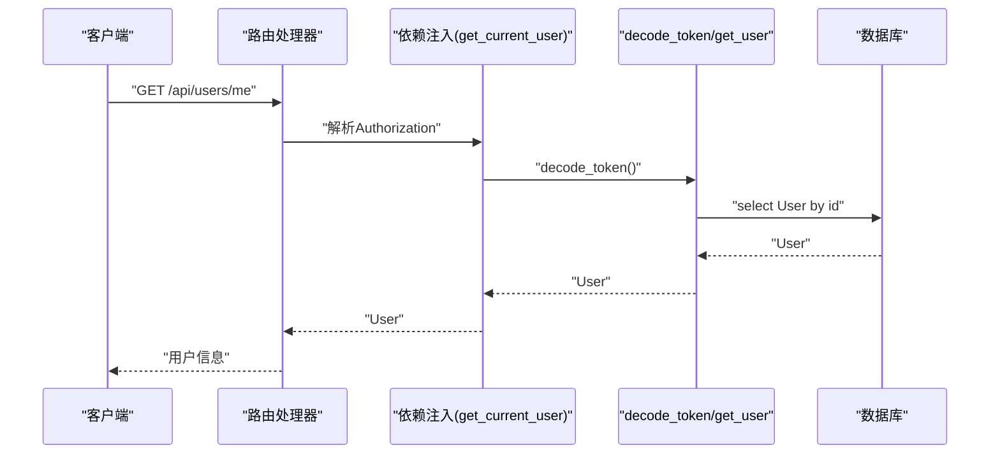
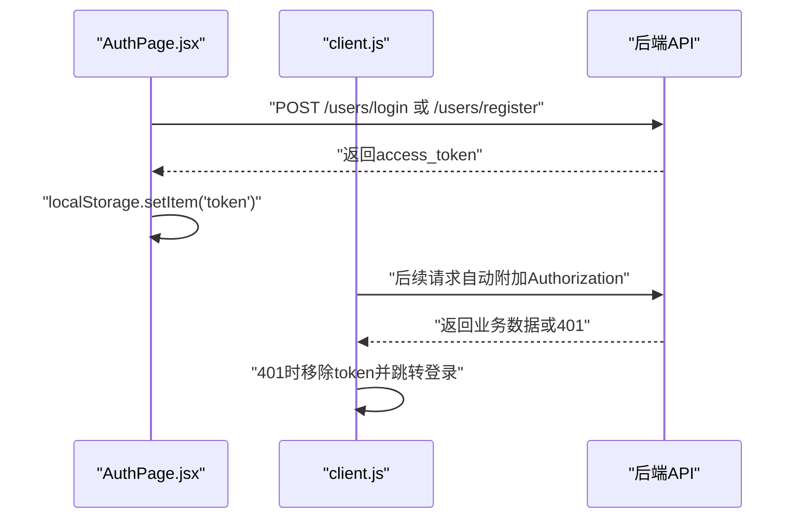
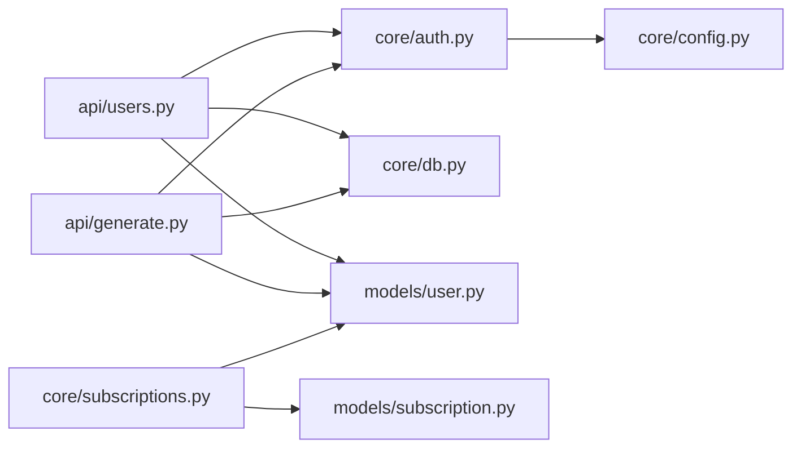

# 认证授权机制

<cite>
**本文引用的文件**
- [backend/core/auth.py](file://backend/core/auth.py)
- [backend/api/users.py](file://backend/api/users.py)
- [backend/models/user.py](file://backend/models/user.py)
- [backend/core/config.py](file://backend/core/config.py)
- [backend/core/db.py](file://backend/core/db.py)
- [backend/main.py](file://backend/main.py)
- [backend/api/generate.py](file://backend/api/generate.py)
- [backend/core/subscriptions.py](file://backend/core/subscriptions.py)
- [backend/models/subscription.py](file://backend/models/subscription.py)
- [frontend/src/api/client.js](file://frontend/src/api/client.js)
- [frontend/src/pages/AuthPage.jsx](file://frontend/src/pages/AuthPage.jsx)
- [backend/Dockerfile](file://backend/Dockerfile)
</cite>

## 目录
1. [引言](#引言)
2. [项目结构](#项目结构)
3. [核心组件](#核心组件)
4. [架构总览](#架构总览)
5. [详细组件分析](#详细组件分析)
6. [依赖分析](#依赖分析)
7. [性能考虑](#性能考虑)
8. [故障排除指南](#故障排除指南)
9. [结论](#结论)
10. [附录](#附录)

## 引言
本文件面向AI-PPT项目的认证授权系统，围绕后端FastAPI服务与前端React应用的协作，系统性梳理JWT令牌生成、验证与过期处理；密码哈希与安全存储；用户会话与令牌生命周期；权限控制与资源访问限制；以及认证中间件的实现与使用方式。同时给出安全加固建议与常见问题排查方法，帮助开发者在生产环境中安全稳定地运行认证体系。

## 项目结构
认证授权相关代码主要分布在以下模块：
- 后端核心：认证工具（JWT、bcrypt）、数据库连接与模型、全局配置
- API层：用户注册/登录、个人信息查询、生成任务接口（含使用配额校验）
- 前端：Axios拦截器统一注入Bearer Token，401自动跳转登录页

图表来源
- [backend/main.py:16-34](file://backend/main.py#L16-L34)
- [backend/api/users.py:11-74](file://backend/api/users.py#L11-L74)
- [backend/api/generate.py:11-51](file://backend/api/generate.py#L11-L51)
- [backend/core/auth.py:13-56](file://backend/core/auth.py#L13-L56)
- [backend/core/db.py:5-26](file://backend/core/db.py#L5-L26)
- [backend/core/config.py:4-33](file://backend/core/config.py#L4-L33)
- [backend/core/subscriptions.py:10-57](file://backend/core/subscriptions.py#L10-L57)
- [backend/models/user.py:6-20](file://backend/models/user.py#L6-L20)
- [backend/models/subscription.py:6-27](file://backend/models/subscription.py#L6-L27)
- [frontend/src/api/client.js:3-25](file://frontend/src/api/client.js#L3-L25)
- [frontend/src/pages/AuthPage.jsx:5-28](file://frontend/src/pages/AuthPage.jsx#L5-L28)

章节来源
- [backend/main.py:16-34](file://backend/main.py#L16-L34)
- [backend/core/db.py:5-26](file://backend/core/db.py#L5-L26)
- [backend/core/config.py:4-33](file://backend/core/config.py#L4-L33)

## 核心组件
- JWT工具与中间件
  - 使用HTTP Bearer方案，通过依赖注入获取当前用户
  - 提供密码哈希、密码校验、访问令牌签发、令牌解码与用户解析
- 用户模型与数据库
  - 存储用户名、邮箱、哈希密码、等级、日使用计数与时间戳
- 配置中心
  - 定义JWT密钥、算法、过期分钟数、数据库URL、Redis URL等
- 订阅与配额
  - 按等级定义每日生成上限与功能清单，执行使用量递增与限额检查
- 前端拦截器
  - 自动从本地存储读取token并注入Authorization头；401时清理token并跳转登录页

章节来源
- [backend/core/auth.py:13-56](file://backend/core/auth.py#L13-L56)
- [backend/models/user.py:6-20](file://backend/models/user.py#L6-L20)
- [backend/core/config.py:4-33](file://backend/core/config.py#L4-L33)
- [backend/core/subscriptions.py:10-57](file://backend/core/subscriptions.py#L10-L57)
- [frontend/src/api/client.js:3-25](file://frontend/src/api/client.js#L3-L25)

## 架构总览
下图展示从浏览器到后端API的认证流程，包括注册/登录、令牌发放、请求携带与鉴权解析。

图表来源
- [backend/api/users.py:34-61](file://backend/api/users.py#L34-L61)
- [backend/core/auth.py:16-56](file://backend/core/auth.py#L16-L56)
- [backend/core/db.py:13-18](file://backend/core/db.py#L13-L18)

## 详细组件分析

### JWT令牌生成、验证与过期处理
- 令牌生成
  - 以用户ID作为sub字段，设置UTC过期时间，使用HS256算法与配置密钥进行签名
- 令牌验证
  - 解析并校验签名与过期时间；异常时抛出未授权错误
- 过期策略
  - 过期分钟数由配置项控制，默认约一天；可结合刷新策略扩展（当前仓库未实现）

图表来源
- [backend/core/auth.py:24-44](file://backend/core/auth.py#L24-L44)
- [backend/core/config.py:14-16](file://backend/core/config.py#L14-L16)

章节来源
- [backend/core/auth.py:24-44](file://backend/core/auth.py#L24-L44)
- [backend/core/config.py:14-16](file://backend/core/config.py#L14-L16)

### 密码哈希、盐值处理与安全存储
- 哈希算法
  - 使用bcrypt对明文密码加盐哈希，返回字符串形式存储于数据库
- 存储模型
  - 用户表包含hashed_password字段，确保明文不落库
- 校验流程
  - 登录时使用bcrypt校验输入明文与存储哈希是否匹配

图表来源
- [backend/core/auth.py:16-21](file://backend/core/auth.py#L16-L21)
- [backend/models/user.py:12](file://backend/models/user.py#L12)

章节来源
- [backend/core/auth.py:16-21](file://backend/core/auth.py#L16-L21)
- [backend/models/user.py:12](file://backend/models/user.py#L12)

### 用户会话管理、令牌过期与安全注销
- 会话管理
  - 采用无状态JWT，服务端不维护会话；每次请求携带令牌
- 令牌过期
  - 通过exp字段控制；过期后需重新登录获取新令牌
- 安全注销
  - 当前未实现服务端黑名单或会话失效机制；可在Redis中维护黑名单或引入刷新令牌配合服务端存储

图表来源
- [backend/api/users.py:54-61](file://backend/api/users.py#L54-L61)
- [backend/core/auth.py:35-56](file://backend/core/auth.py#L35-L56)

章节来源
- [backend/api/users.py:54-61](file://backend/api/users.py#L54-L61)
- [backend/core/auth.py:35-56](file://backend/core/auth.py#L35-L56)

### 权限控制、角色验证与资源访问限制
- 角色与功能
  - 用户等级（free/pro/school）决定每日生成上限与可用功能集合
- 资源访问限制
  - 生成任务接口在执行前检查当日使用配额；超出则返回429
- 功能开关
  - 可基于等级动态启用/禁用特定能力（例如导出、图像生成、动画等）

图表来源
- [backend/api/generate.py:20-35](file://backend/api/generate.py#L20-L35)
- [backend/core/subscriptions.py:46-50](file://backend/core/subscriptions.py#L46-L50)

章节来源
- [backend/api/generate.py:20-35](file://backend/api/generate.py#L20-L35)
- [backend/core/subscriptions.py:10-57](file://backend/core/subscriptions.py#L10-L57)

### 认证中间件实现细节与使用示例
- 中间件实现
  - 通过HTTP Bearer方案，依赖注入获取Authorization凭证并解析
  - 在路由处理器中以依赖参数形式获取当前用户对象
- 使用示例
  - 用户API：注册/登录后返回access_token；个人中心接口依赖当前用户
  - 生成API：所有受保护接口均依赖get_current_user，自动完成鉴权

图表来源
- [backend/api/users.py:64-74](file://backend/api/users.py#L64-L74)
- [backend/core/auth.py:47-56](file://backend/core/auth.py#L47-L56)

章节来源
- [backend/api/users.py:64-74](file://backend/api/users.py#L64-L74)
- [backend/core/auth.py:47-56](file://backend/core/auth.py#L47-L56)

### 前端集成与安全交互
- Axios拦截器
  - 请求前自动注入Authorization头；响应401时清除本地token并跳转登录页
- 登录页面
  - 注册/登录成功后将access_token存入localStorage，并跳转仪表盘

图表来源
- [frontend/src/pages/AuthPage.jsx:12-28](file://frontend/src/pages/AuthPage.jsx#L12-L28)
- [frontend/src/api/client.js:8-25](file://frontend/src/api/client.js#L8-L25)

章节来源
- [frontend/src/pages/AuthPage.jsx:12-28](file://frontend/src/pages/AuthPage.jsx#L12-L28)
- [frontend/src/api/client.js:8-25](file://frontend/src/api/client.js#L8-L25)

## 依赖分析
- 组件耦合
  - API层依赖认证工具与数据库会话；认证工具依赖配置与数据库；订阅模块依赖用户与用量记录模型
- 外部依赖
  - bcrypt用于密码哈希；PyJWT用于令牌编解码；SQLAlchemy异步ORM用于数据持久化
- 潜在循环依赖
  - 当前模块间为单向依赖，未见循环导入风险

图表来源
- [backend/api/users.py:6-8](file://backend/api/users.py#L6-L8)
- [backend/api/generate.py:5-8](file://backend/api/generate.py#L5-L8)
- [backend/core/auth.py:9-11](file://backend/core/auth.py#L9-L11)
- [backend/core/subscriptions.py:4-6](file://backend/core/subscriptions.py#L4-L6)

章节来源
- [backend/api/users.py:6-8](file://backend/api/users.py#L6-L8)
- [backend/api/generate.py:5-8](file://backend/api/generate.py#L5-L8)
- [backend/core/auth.py:9-11](file://backend/core/auth.py#L9-L11)
- [backend/core/subscriptions.py:4-6](file://backend/core/subscriptions.py#L4-L6)

## 性能考虑
- 数据库连接
  - 使用异步引擎与会话池，减少I/O阻塞；注意在高并发场景下适当调整连接池大小
- JWT开销
  - HS256算法轻量高效；令牌体积小，适合高频请求场景
- 缓存与配额
  - 可在Redis中缓存用户等级与配额，降低数据库压力；到期或变更时同步更新
- 前端拦截器
  - 避免重复发送无效token；在401时及时清理，防止无效重试

## 故障排除指南
- 401未授权
  - 检查前端是否正确注入Authorization头；确认令牌未过期；核对服务端密钥与算法配置
- 用户不存在
  - get_current_user在数据库未找到用户时返回404；检查用户ID与令牌一致性
- 密码校验失败
  - 确认bcrypt哈希存储与校验流程一致；避免明文密码出现
- 429配额耗尽
  - 检查用户等级与当日使用计数；必要时引导用户升级
- CORS与部署
  - 生产环境应收紧allow_origins白名单；容器暴露端口与网络策略需与Nginx/反向代理一致

章节来源
- [backend/core/auth.py:40-44](file://backend/core/auth.py#L40-L44)
- [backend/api/users.py:58-59](file://backend/api/users.py#L58-L59)
- [backend/api/generate.py:26-29](file://backend/api/generate.py#L26-L29)
- [backend/Dockerfile:12-14](file://backend/Dockerfile#L12-L14)

## 结论
本认证授权体系以JWT为核心，结合bcrypt密码哈希与SQLAlchemy异步ORM，实现了简洁高效的无状态认证。前端通过Axios拦截器统一处理令牌注入与401自动跳转，提升了用户体验。建议在生产环境中补充服务端注销机制（如黑名单或刷新令牌）、强化CORS与HTTPS、完善审计与监控，以进一步提升安全性与稳定性。

## 附录
- 关键配置项
  - jwt_secret、jwt_algorithm、access_token_expire_minutes、database_url、redis_url
- 数据模型要点
  - 用户表包含唯一用户名/邮箱与hashed_password；订阅与用量记录支持等级与配额管理
- 前端注意事项
  - 仅在内存中临时存储token；401时务必清理本地存储并跳转登录页

章节来源
- [backend/core/config.py:14-16](file://backend/core/config.py#L14-L16)
- [backend/models/user.py:10-12](file://backend/models/user.py#L10-L12)
- [frontend/src/api/client.js:19-22](file://frontend/src/api/client.js#L19-L22)