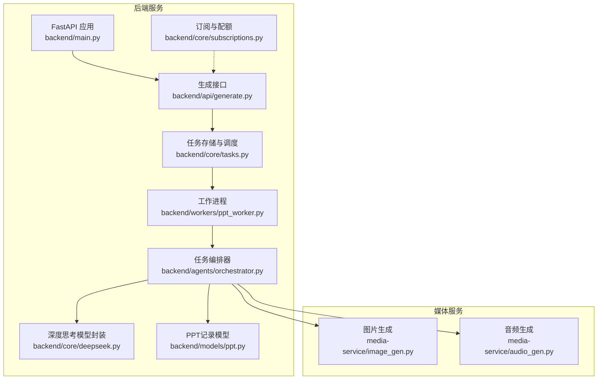
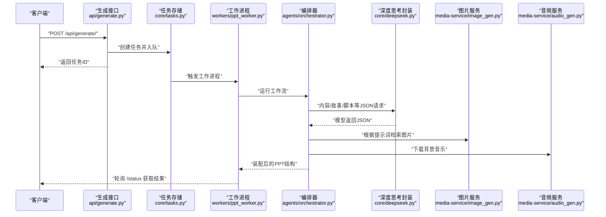
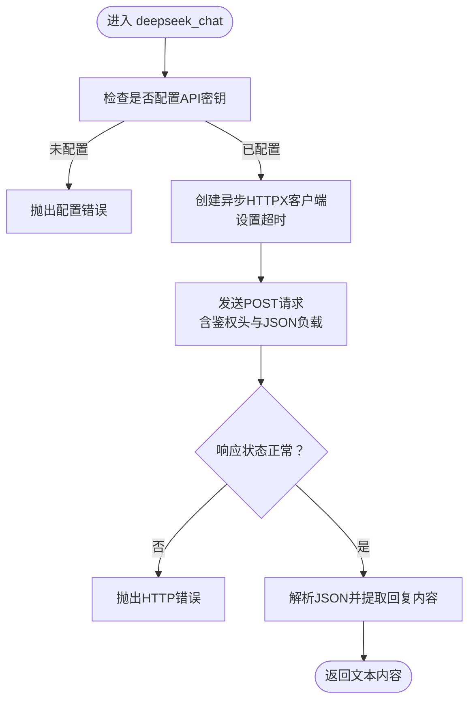
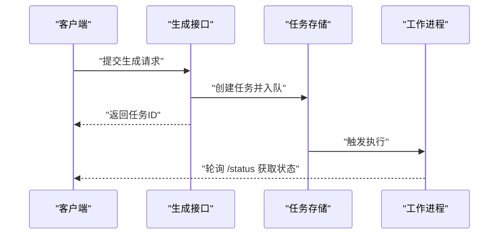
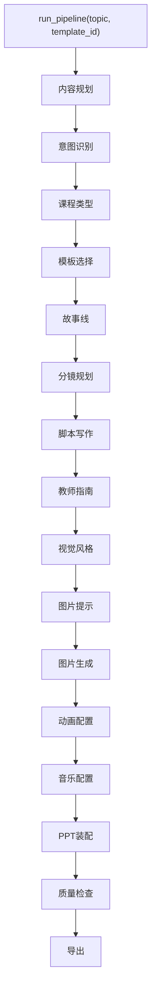
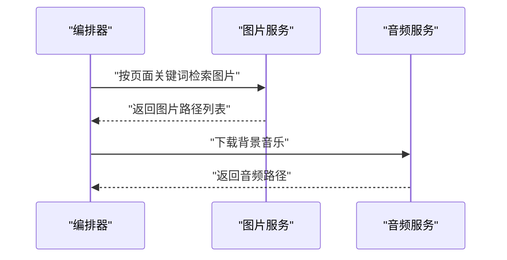
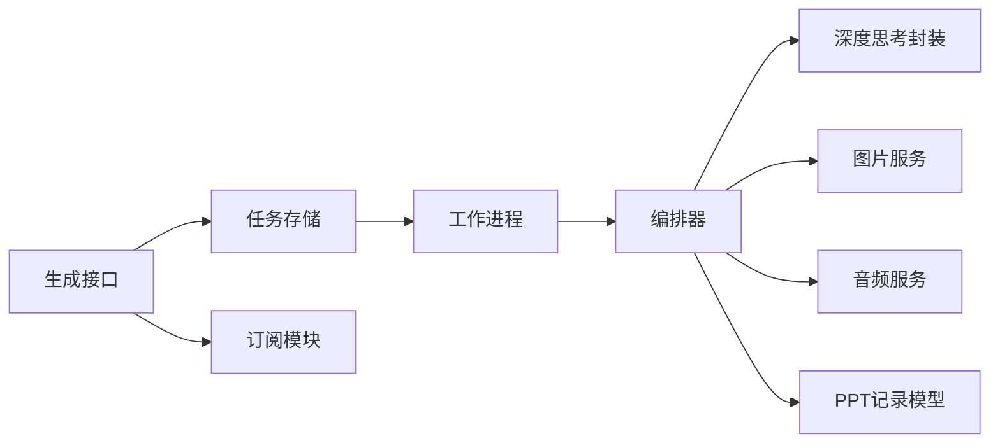

# AI服务集成

<cite>
**本文引用的文件**
- [backend/main.py](file://backend/main.py)
- [backend/core/deepseek.py](file://backend/core/deepseek.py)
- [backend/api/generate.py](file://backend/api/generate.py)
- [backend/core/config.py](file://backend/core/config.py)
- [backend/media-service/image_gen.py](file://media-service/image_gen.py)
- [backend/media-service/audio_gen.py](file://media-service/audio_gen.py)
- [backend/core/tasks.py](file://backend/core/tasks.py)
- [backend/workers/ppt_worker.py](file://backend/workers/ppt_worker.py)
- [backend/agents/orchestrator.py](file://backend/agents/orchestrator.py)
- [backend/agents/assembler.py](file://backend/agents/assembler.py)
- [backend/agents/content.py](file://backend/agents/content.py)
- [backend/agents/story.py](file://backend/agents/story.py)
- [backend/agents/template.py](file://backend/agents/template.py)
- [backend/models/ppt.py](file://backend/models/ppt.py)
- [backend/core/subscriptions.py](file://backend/core/subscriptions.py)
</cite>

## 目录
1. [引言](#引言)
2. [项目结构](#项目结构)
3. [核心组件](#核心组件)
4. [架构总览](#架构总览)
5. [详细组件分析](#详细组件分析)
6. [依赖分析](#依赖分析)
7. [性能考虑](#性能考虑)
8. [故障排查指南](#故障排查指南)
9. [结论](#结论)
10. [附录](#附录)

## 引言
本技术文档面向AI服务集成场景，聚焦于以DeepSeek为代表的外部大模型服务在本项目中的集成方式，涵盖API认证、请求封装、响应解析、错误处理与超时控制；同时梳理与图像生成、音频生成服务的协作机制、任务调度与结果整合流程；并给出配置管理、密钥管理、成本控制策略，以及限流、速率限制与并发控制的实现思路。文档还提供监控指标、日志记录与故障诊断方法，并附上可直接定位到源码位置的集成示例路径与性能优化建议。

## 项目结构
后端采用FastAPI作为入口，通过路由模块化组织业务接口；核心能力由“任务编排器”驱动，将内容规划、故事线设计、幻灯片脚本、视觉风格、图片与动画、音乐等子代理串联成完整工作流；媒体服务独立负责图片检索与背景音乐下载；配置集中于设置类，密钥与环境变量通过环境文件注入。

图表来源
- [backend/main.py:16-40](file://backend/main.py#L16-L40)
- [backend/api/generate.py:1-52](file://backend/api/generate.py#L1-L52)
- [backend/core/tasks.py:1-33](file://backend/core/tasks.py#L1-L33)
- [backend/workers/ppt_worker.py:1-24](file://backend/workers/ppt_worker.py#L1-L24)
- [backend/agents/orchestrator.py:1-56](file://backend/agents/orchestrator.py#L1-L56)
- [backend/core/deepseek.py:1-40](file://backend/core/deepseek.py#L1-L40)
- [backend/core/subscriptions.py:1-58](file://backend/core/subscriptions.py#L1-L58)
- [backend/models/ppt.py:1-18](file://backend/models/ppt.py#L1-L18)
- [media-service/image_gen.py:1-26](file://media-service/image_gen.py#L1-L26)
- [media-service/audio_gen.py:1-34](file://media-service/audio_gen.py#L1-L34)

章节来源
- [backend/main.py:16-40](file://backend/main.py#L16-L40)
- [backend/api/generate.py:1-52](file://backend/api/generate.py#L1-L52)
- [backend/core/tasks.py:1-33](file://backend/core/tasks.py#L1-L33)
- [backend/workers/ppt_worker.py:1-24](file://backend/workers/ppt_worker.py#L1-L24)
- [backend/agents/orchestrator.py:1-56](file://backend/agents/orchestrator.py#L1-L56)
- [backend/core/deepseek.py:1-40](file://backend/core/deepseek.py#L1-L40)
- [backend/core/subscriptions.py:1-58](file://backend/core/subscriptions.py#L1-L58)
- [backend/models/ppt.py:1-18](file://backend/models/ppt.py#L1-L18)
- [media-service/image_gen.py:1-26](file://media-service/image_gen.py#L1-L26)
- [media-service/audio_gen.py:1-34](file://media-service/audio_gen.py#L1-L34)

## 核心组件
- FastAPI应用与路由：统一健康检查、CORS跨域、各业务路由挂载。
- 生成接口：接收主题、模板ID等参数，校验配额后创建异步任务并返回任务ID。
- 任务编排器：按顺序执行内容规划、故事线、脚本、教师指南、风格、图片提示、图片、动画、音乐、装配、质量检查、导出等步骤。
- 深度思考封装：统一的异步HTTP客户端，支持超时、鉴权头、JSON解析与错误处理。
- 媒体服务：图片检索与下载、背景音乐下载。
- 配置中心：集中管理密钥、数据库、Redis、JWT、Stripe、输出目录、代理等。
- 订阅与配额：基于用户等级的每日生成次数限制与使用计数。
- PPT记录模型：持久化生成结果元数据。

章节来源
- [backend/main.py:16-40](file://backend/main.py#L16-L40)
- [backend/api/generate.py:14-52](file://backend/api/generate.py#L14-L52)
- [backend/agents/orchestrator.py:19-56](file://backend/agents/orchestrator.py#L19-L56)
- [backend/core/deepseek.py:9-40](file://backend/core/deepseek.py#L9-L40)
- [media-service/image_gen.py:6-26](file://media-service/image_gen.py#L6-L26)
- [media-service/audio_gen.py:12-34](file://media-service/audio_gen.py#L12-L34)
- [backend/core/config.py:4-34](file://backend/core/config.py#L4-L34)
- [backend/core/subscriptions.py:42-58](file://backend/core/subscriptions.py#L42-L58)
- [backend/models/ppt.py:6-18](file://backend/models/ppt.py#L6-L18)

## 架构总览
下图展示从API请求到最终PPT导出的端到端流程，包括与外部模型服务及媒体服务的交互点。

图表来源
- [backend/api/generate.py:20-35](file://backend/api/generate.py#L20-L35)
- [backend/core/tasks.py:14-28](file://backend/core/tasks.py#L14-L28)
- [backend/workers/ppt_worker.py:5-24](file://backend/workers/ppt_worker.py#L5-L24)
- [backend/agents/orchestrator.py:19-56](file://backend/agents/orchestrator.py#L19-L56)
- [backend/core/deepseek.py:9-40](file://backend/core/deepseek.py#L9-L40)
- [media-service/image_gen.py:19-26](file://media-service/image_gen.py#L19-L26)
- [media-service/audio_gen.py:12-34](file://media-service/audio_gen.py#L12-L34)

## 详细组件分析

### 深度思考（DeepSeek）集成
- 认证与请求封装
  - 使用HTTPX异步客户端，设置连接与读取超时，携带Bearer Token鉴权头。
  - 请求体包含模型名、消息列表与温度参数。
- 响应处理
  - 正常响应解析为JSON，提取第一条回复内容；JSON模式封装会自动清理代码块标记并解析为字典。
- 错误与超时
  - 对底层HTTP异常进行统一抛出；调用方需捕获并处理。
- 配置与密钥
  - 通过配置类读取环境变量中的API密钥；未配置时显式报错。

图表来源
- [backend/core/deepseek.py:9-33](file://backend/core/deepseek.py#L9-L33)

章节来源
- [backend/core/deepseek.py:9-40](file://backend/core/deepseek.py#L9-L40)
- [backend/core/config.py:8-10](file://backend/core/config.py#L8-L10)

### 生成接口与任务调度
- 接口职责
  - 校验主题有效性与当日配额；创建任务并返回任务ID。
- 任务生命周期
  - 任务存储为内存字典；工作进程异步拉起执行；状态更新与结果回填。
- 状态查询
  - 支持轮询获取状态、文件路径、进度、错误信息等。

图表来源
- [backend/api/generate.py:20-51](file://backend/api/generate.py#L20-L51)
- [backend/core/tasks.py:14-33](file://backend/core/tasks.py#L14-L33)
- [backend/workers/ppt_worker.py:5-24](file://backend/workers/ppt_worker.py#L5-L24)

章节来源
- [backend/api/generate.py:14-52](file://backend/api/generate.py#L14-L52)
- [backend/core/tasks.py:14-33](file://backend/core/tasks.py#L14-L33)
- [backend/workers/ppt_worker.py:5-24](file://backend/workers/ppt_worker.py#L5-L24)

### 编排器与代理协作
- 编排器顺序执行内容规划、意图识别、课程类型、模板选择、故事线、分镜、脚本、教师指南、视觉风格、图片提示、图片、动画、音乐、装配、质量检查、导出等步骤。
- 装配器将各来源数据整合为PPT渲染结构，映射布局索引与多媒体元素。

图表来源
- [backend/agents/orchestrator.py:19-56](file://backend/agents/orchestrator.py#L19-L56)
- [backend/agents/assembler.py:16-89](file://backend/agents/assembler.py#L16-L89)

章节来源
- [backend/agents/orchestrator.py:19-56](file://backend/agents/orchestrator.py#L19-L56)
- [backend/agents/assembler.py:4-89](file://backend/agents/assembler.py#L4-L89)

### 图像与音频生成服务
- 图片服务
  - 基于关键词检索并下载图片，按页面号归档；并发批量下载。
- 音频服务
  - 提供固定列表的背景音乐URL，随机或指定曲目下载，带本地缓存避免重复下载。

图表来源
- [media-service/image_gen.py:19-26](file://media-service/image_gen.py#L19-L26)
- [media-service/audio_gen.py:12-34](file://media-service/audio_gen.py#L12-L34)

章节来源
- [media-service/image_gen.py:6-26](file://media-service/image_gen.py#L6-L26)
- [media-service/audio_gen.py:12-34](file://media-service/audio_gen.py#L12-L34)

### 配置管理与密钥管理
- 配置项
  - 大模型密钥、数据库URL、Redis、JWT、Stripe、免费/付费配额、输出目录、上传目录、代理等。
- 密钥注入
  - 通过环境文件加载；生产环境务必使用安全的密钥管理与轮换策略。
- 成本控制
  - 结合配额限制与用量计数，避免超额使用导致成本激增。

章节来源
- [backend/core/config.py:4-34](file://backend/core/config.py#L4-L34)

### 订阅与配额控制
- 等级与限额
  - 免费、专业、学校三种等级，每日生成次数不同。
- 用量检查
  - 生成前检查用户当日已用次数与等级上限。
- 用量递增
  - 成功生成后写入用量记录并更新计数。

章节来源
- [backend/core/subscriptions.py:10-58](file://backend/core/subscriptions.py#L10-L58)
- [backend/api/generate.py:26-29](file://backend/api/generate.py#L26-L29)

### 数据模型与导出
- PPT记录模型
  - 记录用户、主题、页数、文件路径、名称、状态与创建时间等字段，便于前端展示与下载。

章节来源
- [backend/models/ppt.py:6-18](file://backend/models/ppt.py#L6-L18)

## 依赖分析
- 组件耦合
  - 生成接口仅依赖任务存储与订阅模块；任务存储再委派给工作进程；工作进程调用编排器；编排器内部聚合多个代理与媒体服务。
- 外部依赖
  - HTTPX用于异步HTTP通信；bing_image_downloader用于图片检索（需安装）；SoundHelix提供背景音乐资源。
- 可能的循环依赖
  - 当前文件间无明显循环导入；编排器通过字符串导入避免循环引用风险。

图表来源
- [backend/api/generate.py:1-52](file://backend/api/generate.py#L1-L52)
- [backend/core/tasks.py:1-33](file://backend/core/tasks.py#L1-L33)
- [backend/workers/ppt_worker.py:1-24](file://backend/workers/ppt_worker.py#L1-L24)
- [backend/agents/orchestrator.py:1-56](file://backend/agents/orchestrator.py#L1-L56)
- [backend/core/deepseek.py:1-40](file://backend/core/deepseek.py#L1-L40)
- [backend/core/subscriptions.py:1-58](file://backend/core/subscriptions.py#L1-L58)
- [backend/models/ppt.py:1-18](file://backend/models/ppt.py#L1-L18)
- [media-service/image_gen.py:1-26](file://media-service/image_gen.py#L1-L26)
- [media-service/audio_gen.py:1-34](file://media-service/audio_gen.py#L1-L34)

## 性能考虑
- 异步I/O优先：HTTP请求与文件IO均采用异步，降低阻塞。
- 并发控制：图片检索使用gather并发下载，建议结合信号量限制最大并发数，避免触发第三方服务限流。
- 超时与重试：为外部服务设置合理超时；对可重试的网络错误增加指数退避重试。
- 缓存策略：音频下载具备本地缓存；图片检索可引入本地缓存与CDN加速。
- 资源池：对HTTPX客户端复用连接池，减少握手开销。
- 日志与追踪：为每个任务分配唯一ID，贯穿全链路日志，便于定位瓶颈。

## 故障排查指南
- 健康检查
  - 访问健康端点确认服务可用性与版本信息。
- 任务状态
  - 通过状态接口查看任务状态、错误信息与进度，定位失败环节。
- 模型服务问题
  - 检查密钥配置、网络连通性与超时设置；关注HTTP状态码与响应体。
- 媒体服务问题
  - 图片检索失败通常为第三方服务不可用或关键词不匹配；音频下载失败多为网络超时或磁盘权限。
- 配额与订阅
  - 若出现429，请检查用户等级与当日用量；必要时引导用户升级。

章节来源
- [backend/main.py:37-40](file://backend/main.py#L37-L40)
- [backend/api/generate.py:38-51](file://backend/api/generate.py#L38-L51)
- [backend/core/deepseek.py:15-16](file://backend/core/deepseek.py#L15-L16)
- [media-service/image_gen.py:15-16](file://media-service/image_gen.py#L15-L16)
- [media-service/audio_gen.py:32-33](file://media-service/audio_gen.py#L32-L33)

## 结论
本项目以异步任务驱动的编排器为核心，将外部大模型服务与媒体服务能力有机整合，形成从内容规划到PPT导出的完整流水线。通过严格的配置管理、订阅配额与任务状态跟踪，实现了可控的成本与稳定的用户体验。建议在生产环境中进一步完善并发控制、重试与超时策略、缓存与CDN优化，并建立完善的监控与告警体系。

## 附录
- 实际集成示例路径
  - 深度思考封装与调用：[backend/core/deepseek.py:9-40](file://backend/core/deepseek.py#L9-L40)
  - 生成接口与任务创建：[backend/api/generate.py:20-35](file://backend/api/generate.py#L20-L35)
  - 任务状态查询：[backend/api/generate.py:38-51](file://backend/api/generate.py#L38-L51)
  - 工作进程与编排器：[backend/workers/ppt_worker.py:5-24](file://backend/workers/ppt_worker.py#L5-L24)、[backend/agents/orchestrator.py:19-56](file://backend/agents/orchestrator.py#L19-L56)
  - 图片与音频服务：[media-service/image_gen.py:19-26](file://media-service/image_gen.py#L19-L26)、[media-service/audio_gen.py:12-34](file://media-service/audio_gen.py#L12-L34)
  - 配置与密钥：[backend/core/config.py:4-34](file://backend/core/config.py#L4-L34)
  - 订阅与配额：[backend/core/subscriptions.py:42-58](file://backend/core/subscriptions.py#L42-L58)
  - PPT记录模型：[backend/models/ppt.py:6-18](file://backend/models/ppt.py#L6-L18)