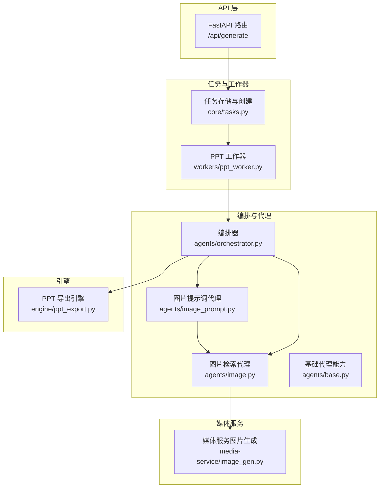
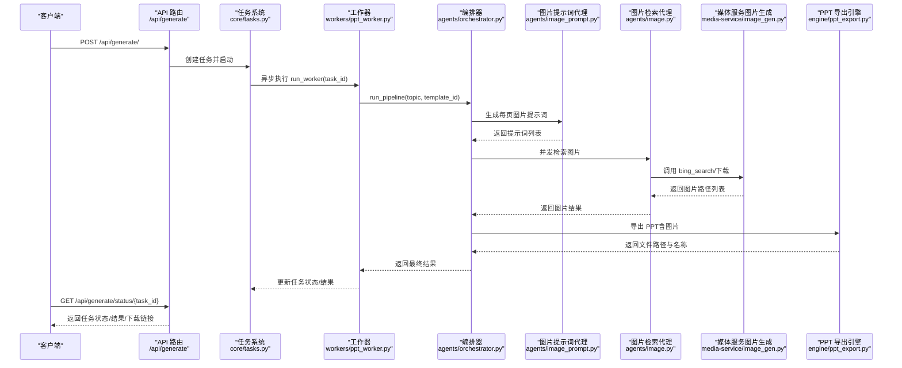
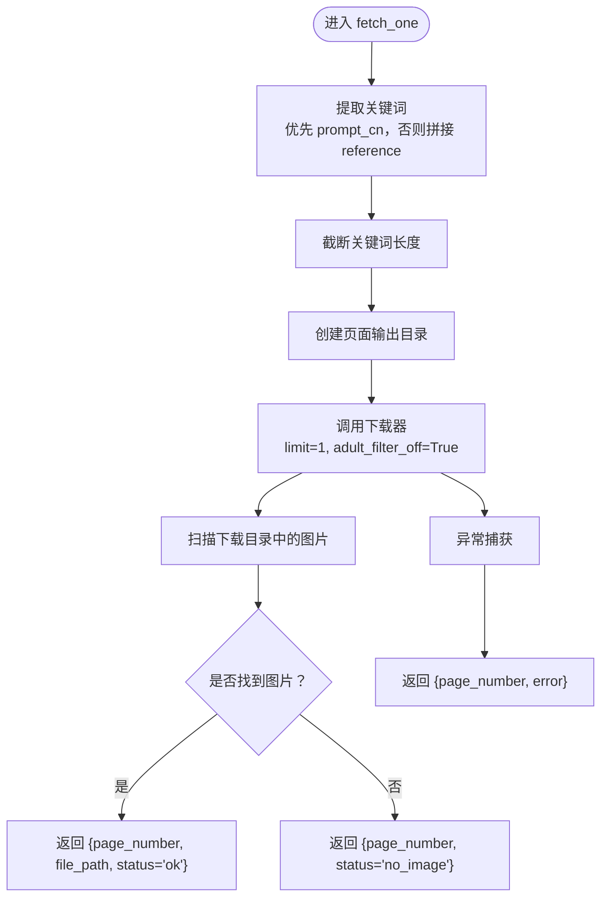
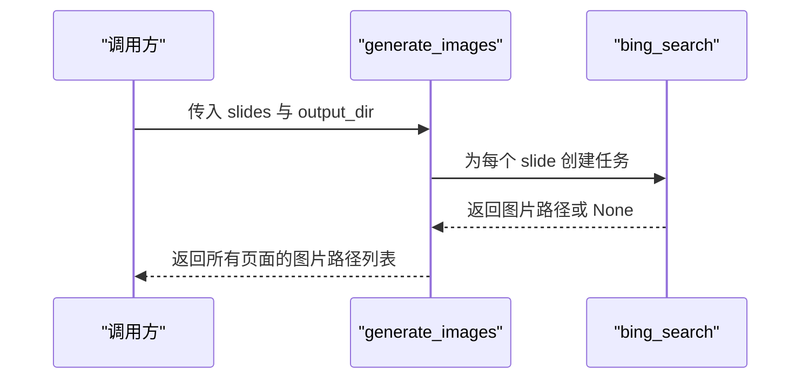
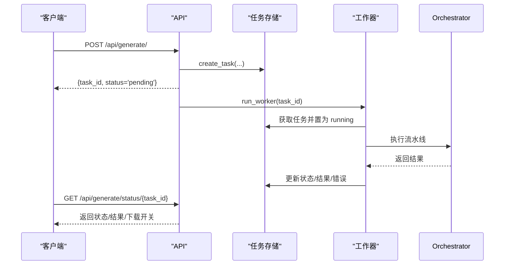
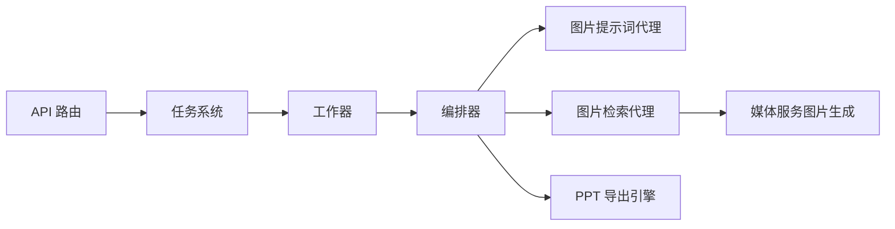

# 图像生成服务

<cite>
**本文引用的文件**
- [backend/agents/image.py](file://backend/agents/image.py)
- [backend/agents/image_prompt.py](file://backend/agents/image_prompt.py)
- [backend/agents/orchestrator.py](file://backend/agents/orchestrator.py)
- [backend/agents/base.py](file://backend/agents/base.py)
- [backend/agents/slide.py](file://backend/agents/slide.py)
- [backend/agents/visual.py](file://backend/agents/visual.py)
- [backend/agents/template.py](file://backend/agents/template.py)
- [backend/api/generate.py](file://backend/api/generate.py)
- [backend/core/tasks.py](file://backend/core/tasks.py)
- [backend/workers/ppt_worker.py](file://backend/workers/ppt_worker.py)
- [media-service/image_gen.py](file://media-service/image_gen.py)
- [engine/ppt_export.py](file://engine/ppt_export.py)
- [backend/models/ppt.py](file://backend/models/ppt.py)
- [backend/core/config.py](file://backend/core/config.py)
</cite>

## 目录
1. [简介](#简介)
2. [项目结构](#项目结构)
3. [核心组件](#核心组件)
4. [架构总览](#架构总览)
5. [详细组件分析](#详细组件分析)
6. [依赖关系分析](#依赖关系分析)
7. [性能考虑](#性能考虑)
8. [故障排查指南](#故障排查指南)
9. [结论](#结论)
10. [附录](#附录)

## 简介
本文件面向“图像生成服务”的技术实现，聚焦于以下目标：
- 深入解析 Bing 图片搜索集成机制：关键词提取、搜索参数配置、图片下载流程
- 阐述异步图片生成的架构设计：并发处理、错误处理、资源管理
- 解释图片搜索算法工作原理：关键词组合策略、搜索限制、结果过滤
- 提供图片生成的配置项、参数设置与返回值格式说明
- 说明与 PPT 引擎的数据交互方式与图片存储策略
- 给出常见问题（搜索失败、网络超时、图片质量）的解决方案与使用模式

## 项目结构
该服务位于后端子系统中，围绕“代理（Agent）+ 工作流编排（Orchestrator）+ 异步任务（Task）+ API 接口（FastAPI）”的分层组织：
- 代理层：负责具体业务能力（提示词工程、图片检索、PPT装配等）
- 编排层：按顺序串联各代理，形成完整的 PPT 生成流水线
- 异步任务层：以队列化的方式调度长耗时任务，支持状态查询
- API 层：对外暴露生成入口与状态查询接口
- 媒体服务：独立的图片生成模块，提供基于 Bing 的异步下载能力
- 引擎层：负责最终导出 PowerPoint 并进行图片下载与放置

图表来源
- [backend/api/generate.py:1-52](file://backend/api/generate.py#L1-L52)
- [backend/core/tasks.py:1-33](file://backend/core/tasks.py#L1-L33)
- [backend/workers/ppt_worker.py:1-24](file://backend/workers/ppt_worker.py#L1-L24)
- [backend/agents/orchestrator.py:1-56](file://backend/agents/orchestrator.py#L1-L56)
- [backend/agents/image_prompt.py:1-29](file://backend/agents/image_prompt.py#L1-L29)
- [backend/agents/image.py:1-41](file://backend/agents/image.py#L1-L41)
- [backend/agents/base.py:1-24](file://backend/agents/base.py#L1-L24)
- [media-service/image_gen.py:1-26](file://media-service/image_gen.py#L1-L26)
- [engine/ppt_export.py:1-257](file://engine/ppt_export.py#L1-L257)

章节来源
- [backend/api/generate.py:1-52](file://backend/api/generate.py#L1-L52)
- [backend/core/tasks.py:1-33](file://backend/core/tasks.py#L1-L33)
- [backend/workers/ppt_worker.py:1-24](file://backend/workers/ppt_worker.py#L1-L24)
- [backend/agents/orchestrator.py:1-56](file://backend/agents/orchestrator.py#L1-L56)
- [backend/agents/image_prompt.py:1-29](file://backend/agents/image_prompt.py#L1-L29)
- [backend/agents/image.py:1-41](file://backend/agents/image.py#L1-L41)
- [backend/agents/base.py:1-24](file://backend/agents/base.py#L1-L24)
- [media-service/image_gen.py:1-26](file://media-service/image_gen.py#L1-L26)
- [engine/ppt_export.py:1-257](file://engine/ppt_export.py#L1-L257)

## 核心组件
- 图片提示词代理（ImagePromptAgent）：为每页 PPT 生成高质量英文/中文提示词，包含风格、构图、光线、氛围等要素，作为后续图片检索的关键输入
- 图片检索代理（ImageAgent）：基于提示词或参考关键词，调用 Bing 下载器进行图片检索与本地保存，支持并发抓取与错误兜底
- 媒体服务图片生成（media-service/image_gen.py）：提供异步图片生成函数，按页面号组织输出目录，限制关键词长度与数量，统一返回图片路径
- 编排器（Orchestrator）：串联内容生成、故事板、脚本、教师指南、视觉风格、图片提示词、图片检索、动画、音乐与最终装配导出
- 异步任务系统（core/tasks.py + workers/ppt_worker.py）：创建任务、异步执行、维护任务状态与结果，供 API 查询
- API 入口（backend/api/generate.py）：提供生成请求与状态查询接口，校验用户配额与输入有效性

章节来源
- [backend/agents/image_prompt.py:1-29](file://backend/agents/image_prompt.py#L1-L29)
- [backend/agents/image.py:1-41](file://backend/agents/image.py#L1-L41)
- [media-service/image_gen.py:1-26](file://media-service/image_gen.py#L1-L26)
- [backend/agents/orchestrator.py:1-56](file://backend/agents/orchestrator.py#L1-L56)
- [backend/core/tasks.py:1-33](file://backend/core/tasks.py#L1-L33)
- [backend/workers/ppt_worker.py:1-24](file://backend/workers/ppt_worker.py#L1-L24)
- [backend/api/generate.py:1-52](file://backend/api/generate.py#L1-L52)

## 架构总览
下图展示从 API 请求到图片生成与 PPT 导出的全链路：

图表来源
- [backend/api/generate.py:1-52](file://backend/api/generate.py#L1-L52)
- [backend/core/tasks.py:1-33](file://backend/core/tasks.py#L1-L33)
- [backend/workers/ppt_worker.py:1-24](file://backend/workers/ppt_worker.py#L1-L24)
- [backend/agents/orchestrator.py:1-56](file://backend/agents/orchestrator.py#L1-L56)
- [backend/agents/image_prompt.py:1-29](file://backend/agents/image_prompt.py#L1-L29)
- [backend/agents/image.py:1-41](file://backend/agents/image.py#L1-L41)
- [media-service/image_gen.py:1-26](file://media-service/image_gen.py#L1-L26)
- [engine/ppt_export.py:1-257](file://engine/ppt_export.py#L1-L257)

## 详细组件分析

### 图片提示词生成（ImagePromptAgent）
- 角色定位：为每页 PPT 生成可直接用于 AI 图像生成器（如 SDXL/DALL-E 3）的提示词，包含英文与中文参考、风格、宽高比、参考关键词等字段
- 输入：幻灯片列表与视觉风格配置
- 输出：每页对应的提示词对象（page_number、prompt_en、prompt_cn、style、aspect_ratio、reference）
- 关键点：通过 JSON 输出约束模型严格返回结构化数据；提示词包含风格、构图、光线、氛围等维度，提升图片检索命中率

章节来源
- [backend/agents/image_prompt.py:1-29](file://backend/agents/image_prompt.py#L1-L29)

### 图片检索代理（ImageAgent）
- 角色定位：接收提示词，构造关键词，调用 Bing 下载器进行图片下载，按页面号组织输出目录，返回图片路径与状态
- 关键流程：
  - 从提示词中优先取中文提示词，否则回退到参考关键词拼接
  - 截断关键词长度至限定范围
  - 为每页创建独立子目录，下载单张图片
  - 收集下载结果，返回 page_number、file_path、status 或 error
- 错误处理：捕获异常并返回错误信息，避免中断整体流程
- 并发策略：对多个页面并行发起下载任务，使用 gather 聚合结果

图表来源
- [backend/agents/image.py:10-40](file://backend/agents/image.py#L10-L40)

章节来源
- [backend/agents/image.py:1-41](file://backend/agents/image.py#L1-L41)

### 媒体服务图片生成（media-service/image_gen.py）
- 提供两个异步函数：
  - bing_search：按关键词列表与页面号下载图片，限制关键词数量与长度，返回图片绝对路径或空
  - generate_images：遍历所有页面，为每个页面创建独立任务并发执行 bing_search，并聚合结果
- 参数与行为：
  - 关键词截断：仅取前若干个并限制总长度
  - 输出目录：按页面号命名子目录，便于后续装配
  - 并发：使用 asyncio.gather 并行下载，提高吞吐
  - 容错：单个页面失败不影响其他页面

图表来源
- [media-service/image_gen.py:6-25](file://media-service/image_gen.py#L6-L25)

章节来源
- [media-service/image_gen.py:1-26](file://media-service/image_gen.py#L1-L26)

### 编排器（Orchestrator）
- 串行调用多个代理，形成完整流水线：内容 → 故事板 → 讲稿 → 教师指南 → 视觉风格 → 图片提示词 → 图片检索 → 动画 → 音乐 → 装配 → 质检 → 导出
- 在图片检索阶段，既可使用 ImageAgent（基于提示词），也可使用媒体服务 generate_images（更通用的批量下载）

章节来源
- [backend/agents/orchestrator.py:1-56](file://backend/agents/orchestrator.py#L1-L56)

### 异步任务系统与 API
- 任务创建：API 接收生成请求，校验配额与输入，创建任务并立即返回任务 ID 与初始状态
- 任务执行：后台工作器拉取任务，运行编排器，更新任务状态与结果
- 状态查询：API 提供状态查询接口，返回任务状态、文件信息、进度与错误详情

图表来源
- [backend/api/generate.py:20-51](file://backend/api/generate.py#L20-L51)
- [backend/core/tasks.py:14-32](file://backend/core/tasks.py#L14-L32)
- [backend/workers/ppt_worker.py:5-24](file://backend/workers/ppt_worker.py#L5-L24)

章节来源
- [backend/api/generate.py:1-52](file://backend/api/generate.py#L1-L52)
- [backend/core/tasks.py:1-33](file://backend/core/tasks.py#L1-L33)
- [backend/workers/ppt_worker.py:1-24](file://backend/workers/ppt_worker.py#L1-L24)

### 与 PPT 引擎的数据交互与图片存储策略
- 数据交互：
  - 编排器在完成图片检索后，将图片路径列表传递给装配阶段，最终由导出引擎写入 PPT
  - 导出引擎内部也具备图片下载能力，会根据主题与每页关键词集合进行批量下载并缓存到临时目录
- 存储策略：
  - 本地输出目录由配置决定，图片按页面号分目录存放，便于后续读取与清理
  - 导出引擎在完成后清理临时下载目录与音频缓存文件

章节来源
- [backend/agents/orchestrator.py:32-46](file://backend/agents/orchestrator.py#L32-L46)
- [engine/ppt_export.py:40-72](file://engine/ppt_export.py#L40-L72)
- [backend/core/config.py:25-27](file://backend/core/config.py#L25-L27)

## 依赖关系分析
- 组件耦合：
  - ImageAgent 与媒体服务模块存在功能重叠，均可实现图片下载；建议统一使用媒体服务模块以减少重复逻辑
  - Orchestrator 对多个代理强依赖，需确保提示词质量与关键词构造策略稳定
- 外部依赖：
  - Bing 图片下载器：用于图片检索与下载
  - Windows PowerPoint COM：用于导出 PPT（仅在特定平台可用）
  - FastAPI/SQLAlchemy：用于 API 与数据库访问
- 潜在循环依赖：当前未发现直接循环导入，但代理间调用链较长，应避免在代理内直接耦合底层引擎细节

图表来源
- [backend/api/generate.py:1-52](file://backend/api/generate.py#L1-L52)
- [backend/core/tasks.py:1-33](file://backend/core/tasks.py#L1-L33)
- [backend/workers/ppt_worker.py:1-24](file://backend/workers/ppt_worker.py#L1-L24)
- [backend/agents/orchestrator.py:1-56](file://backend/agents/orchestrator.py#L1-L56)
- [backend/agents/image.py:1-41](file://backend/agents/image.py#L1-L41)
- [media-service/image_gen.py:1-26](file://media-service/image_gen.py#L1-L26)
- [engine/ppt_export.py:1-257](file://engine/ppt_export.py#L1-L257)

章节来源
- [backend/api/generate.py:1-52](file://backend/api/generate.py#L1-L52)
- [backend/core/tasks.py:1-33](file://backend/core/tasks.py#L1-L33)
- [backend/workers/ppt_worker.py:1-24](file://backend/workers/ppt_worker.py#L1-L24)
- [backend/agents/orchestrator.py:1-56](file://backend/agents/orchestrator.py#L1-L56)
- [backend/agents/image.py:1-41](file://backend/agents/image.py#L1-L41)
- [media-service/image_gen.py:1-26](file://media-service/image_gen.py#L1-L26)
- [engine/ppt_export.py:1-257](file://engine/ppt_export.py#L1-L257)

## 性能考虑
- 并发优化：
  - 使用 asyncio.gather 并行下载图片，显著缩短总耗时
  - 控制并发度：根据网络带宽与目标站点限速策略调整任务数量
- 资源管理：
  - 为每页单独创建输出目录，避免文件冲突与便于清理
  - 导出引擎在完成后清理临时目录与缓存文件，防止磁盘占用增长
- 关键词策略：
  - 限制关键词数量与长度，降低无效请求与超时概率
  - 合理选择关键词来源（提示词优先、回退到参考关键词），提升命中率
- 网络稳定性：
  - 设置合理的超时时间与重试策略（可在调用层扩展）
  - 对下载器异常进行快速失败与记录日志，避免阻塞整体流程

## 故障排查指南
- 图片搜索失败
  - 现象：返回 no_image 或 error 字段
  - 排查要点：检查关键词构造是否合理、是否超过长度限制、网络是否可达
  - 参考路径：[backend/agents/image.py:14-36](file://backend/agents/image.py#L14-L36)
- 网络超时
  - 现象：下载器抛出异常或返回 None
  - 排查要点：确认代理/防火墙设置、DNS 解析、目标站点可用性
  - 参考路径：[media-service/image_gen.py:6-16](file://media-service/image_gen.py#L6-L16)
- 图片质量不佳
  - 现象：下载到的图片不符合预期
  - 排查要点：优化提示词质量、增加关键词多样性、尝试不同风格参数
  - 参考路径：[backend/agents/image_prompt.py:5-28](file://backend/agents/image_prompt.py#L5-L28)
- 任务状态异常
  - 现象：状态长期 pending 或 failed
  - 排查要点：查看任务存储与工作器日志，确认编排器执行链是否中断
  - 参考路径：[backend/core/tasks.py:14-32](file://backend/core/tasks.py#L14-L32), [backend/workers/ppt_worker.py:5-24](file://backend/workers/ppt_worker.py#L5-L24)
- 导出失败或图片未嵌入
  - 现象：PPT 成功生成但无图片
  - 排查要点：确认图片路径有效、导出引擎临时目录清理策略、Windows COM 权限
  - 参考路径：[engine/ppt_export.py:40-72](file://engine/ppt_export.py#L40-L72)

章节来源
- [backend/agents/image.py:14-36](file://backend/agents/image.py#L14-L36)
- [media-service/image_gen.py:6-16](file://media-service/image_gen.py#L6-L16)
- [backend/agents/image_prompt.py:5-28](file://backend/agents/image_prompt.py#L5-L28)
- [backend/core/tasks.py:14-32](file://backend/core/tasks.py#L14-L32)
- [backend/workers/ppt_worker.py:5-24](file://backend/workers/ppt_worker.py#L5-L24)
- [engine/ppt_export.py:40-72](file://engine/ppt_export.py#L40-L72)

## 结论
本图像生成服务通过“提示词工程 + Bing 搜索 + 并行下载 + 编排装配”的方式，实现了端到端的异步图片生成与 PPT 导出。其优势在于：
- 明确的职责分离与可扩展的代理体系
- 强大的并发能力与完善的错误处理
- 清晰的任务状态管理与 API 可观测性
建议后续优化方向：
- 统一图片下载实现（优先使用媒体服务模块）
- 增加可配置的关键词策略与搜索参数
- 加强日志与监控，提升可观测性与可运维性

## 附录

### 配置选项与参数设置
- 输出目录与上传目录：用于控制图片与中间文件的存储位置
- 代理地址：可选的网络代理，便于跨地域访问
- 示例路径：[backend/core/config.py:25-27](file://backend/core/config.py#L25-L27)

章节来源
- [backend/core/config.py:25-27](file://backend/core/config.py#L25-L27)

### 返回值格式说明
- 图片检索返回：
  - 成功：包含 page_number、file_path、status
  - 失败：包含 page_number、error
  - 无图：包含 page_number、status=no_image
  - 参考路径：[backend/agents/image.py:29-36](file://backend/agents/image.py#L29-L36)
- API 状态查询返回：
  - 包含 status、file_url、file_name、download、result、progress、error
  - 参考路径：[backend/api/generate.py:38-51](file://backend/api/generate.py#L38-L51)

章节来源
- [backend/agents/image.py:29-36](file://backend/agents/image.py#L29-L36)
- [backend/api/generate.py:38-51](file://backend/api/generate.py#L38-L51)