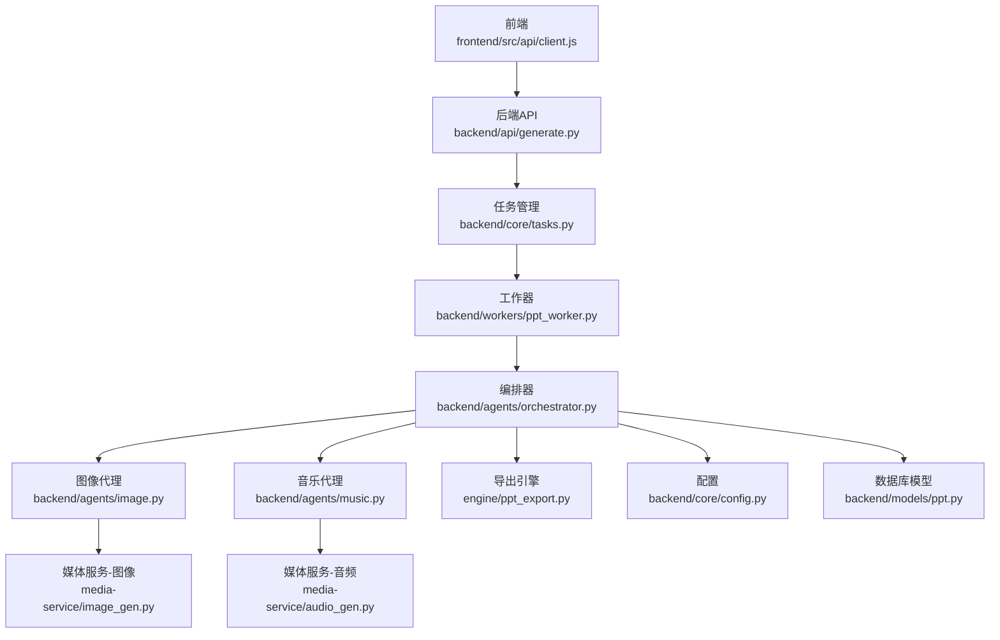
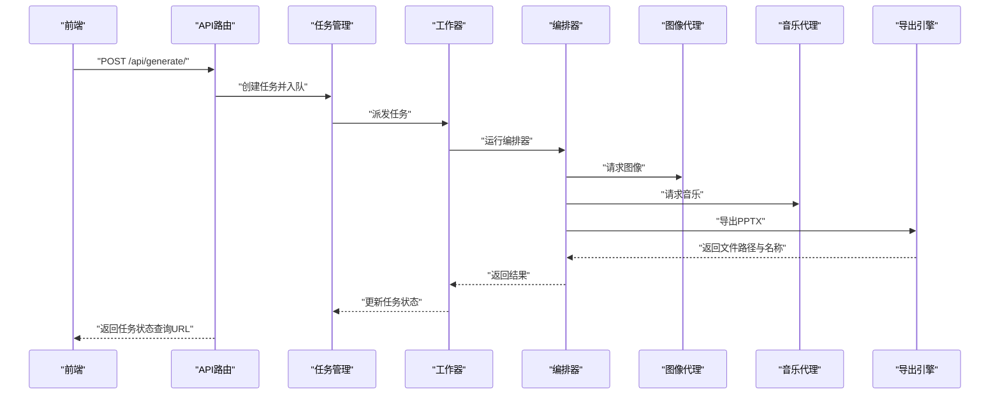
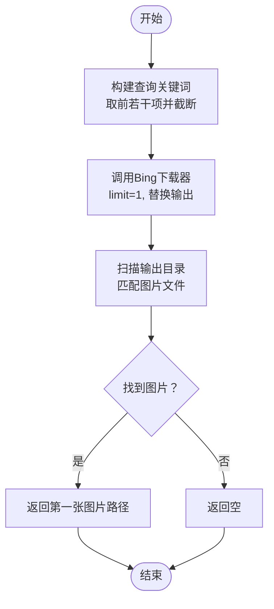
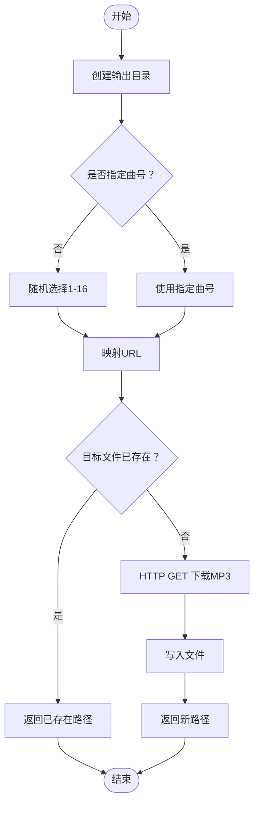
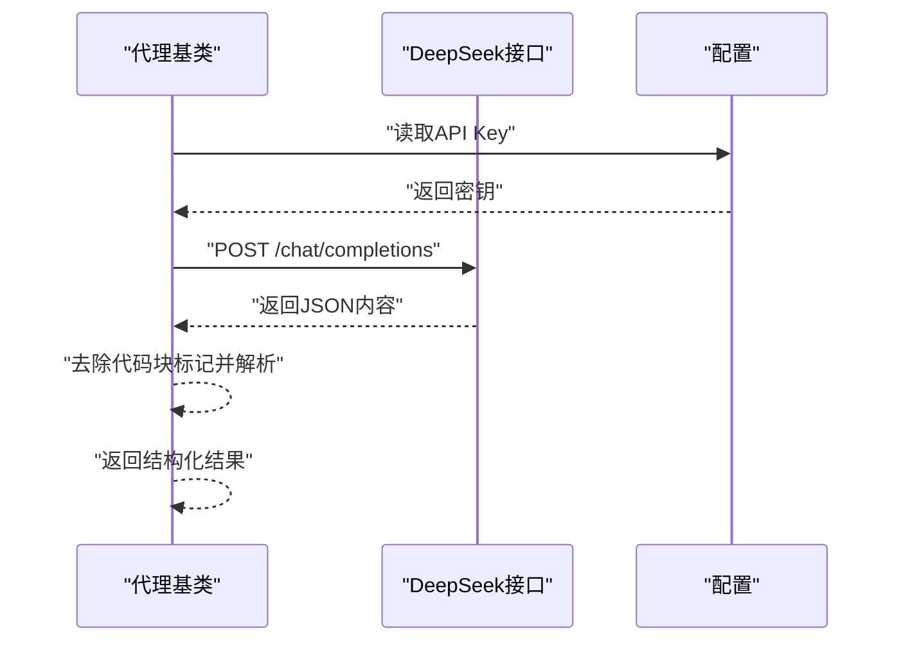
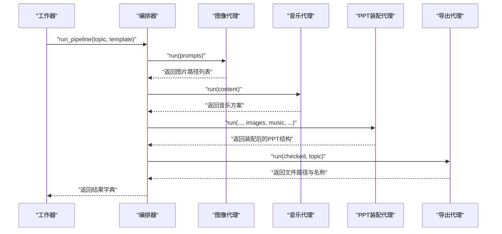
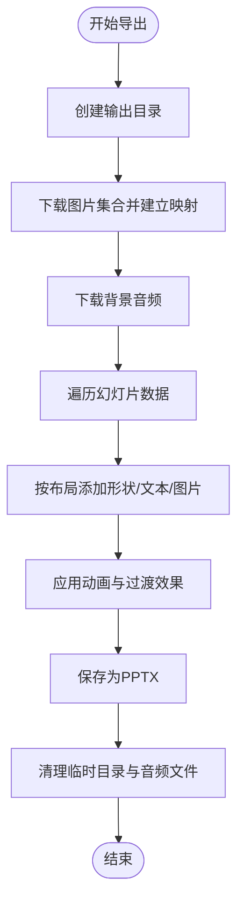
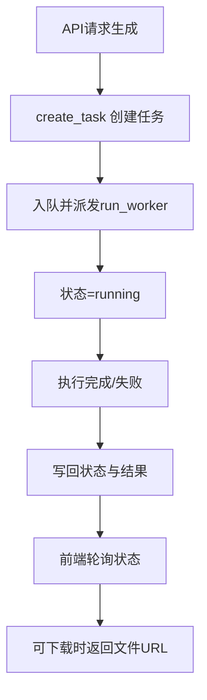
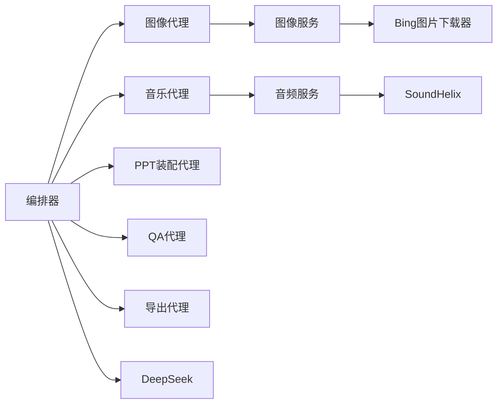

# 媒体服务

<cite>
**本文引用的文件**
- [image_gen.py](file://media-service/image_gen.py)
- [audio_gen.py](file://media-service/audio_gen.py)
- [deepseek.py](file://backend/core/deepseek.py)
- [base.py](file://backend/agents/base.py)
- [image.py](file://backend/agents/image.py)
- [music.py](file://backend/agents/music.py)
- [config.py](file://backend/core/config.py)
- [generate.py](file://backend/api/generate.py)
- [ppt_worker.py](file://backend/workers/ppt_worker.py)
- [ppt_export.py](file://engine/ppt_export.py)
- [orchestrator.py](file://backend/agents/orchestrator.py)
- [ppt.py](file://backend/models/ppt.py)
- [tasks.py](file://backend/core/tasks.py)
- [client.js](file://frontend/src/api/client.js)
</cite>

## 目录
1. [简介](#简介)
2. [项目结构](#项目结构)
3. [核心组件](#核心组件)
4. [架构总览](#架构总览)
5. [详细组件分析](#详细组件分析)
6. [依赖关系分析](#依赖关系分析)
7. [性能考量](#性能考量)
8. [故障排查指南](#故障排查指南)
9. [结论](#结论)
10. [附录](#附录)

## 简介
本技术文档聚焦于媒体服务系统在“AI PPT OS V3”中的实现，涵盖图像生成与音频生成两大模块，以及与AI服务提供商（DeepSeek、Bing图片搜索）的集成方式、任务调度与导出流程、前端API客户端、配置与环境变量、以及常见问题与性能优化建议。文档以循序渐进的方式呈现从高层架构到代码级细节，并通过多种Mermaid图表帮助读者建立直观理解。

## 项目结构
媒体服务相关代码主要分布在以下位置：
- 后端核心与代理层：backend/core、backend/agents
- 前端API客户端：frontend/src/api
- 导出引擎：engine
- 媒体服务脚本：media-service
- 任务与工作器：backend/core/tasks.py、backend/workers/ppt_worker.py
- API路由：backend/api/generate.py
- 数据模型：backend/models/ppt.py

**图表来源**
- [client.js:1-28](file://frontend/src/api/client.js#L1-L28)
- [generate.py:1-52](file://backend/api/generate.py#L1-L52)
- [tasks.py:1-33](file://backend/core/tasks.py#L1-L33)
- [ppt_worker.py:1-24](file://backend/workers/ppt_worker.py#L1-L24)
- [orchestrator.py:1-56](file://backend/agents/orchestrator.py#L1-L56)
- [image.py:1-41](file://backend/agents/image.py#L1-L41)
- [music.py:1-29](file://backend/agents/music.py#L1-L29)
- [image_gen.py:1-26](file://media-service/image_gen.py#L1-L26)
- [audio_gen.py:1-34](file://media-service/audio_gen.py#L1-L34)
- [ppt_export.py:1-257](file://engine/ppt_export.py#L1-L257)
- [config.py:1-34](file://backend/core/config.py#L1-L34)
- [ppt.py:1-18](file://backend/models/ppt.py#L1-L18)

**章节来源**
- [generate.py:1-52](file://backend/api/generate.py#L1-L52)
- [tasks.py:1-33](file://backend/core/tasks.py#L1-L33)
- [ppt_worker.py:1-24](file://backend/workers/ppt_worker.py#L1-L24)
- [orchestrator.py:1-56](file://backend/agents/orchestrator.py#L1-L56)
- [image.py:1-41](file://backend/agents/image.py#L1-L41)
- [music.py:1-29](file://backend/agents/music.py#L1-L29)
- [image_gen.py:1-26](file://media-service/image_gen.py#L1-L26)
- [audio_gen.py:1-34](file://media-service/audio_gen.py#L1-L34)
- [ppt_export.py:1-257](file://engine/ppt_export.py#L1-L257)
- [config.py:1-34](file://backend/core/config.py#L1-L34)
- [ppt.py:1-18](file://backend/models/ppt.py#L1-L18)
- [client.js:1-28](file://frontend/src/api/client.js#L1-L28)

## 核心组件
- 图像生成服务：封装Bing图片搜索下载逻辑，支持并发批量生成，返回本地文件路径或空。
- 音频生成服务：基于SoundHelix免费曲目，支持随机或指定曲号下载，具备缓存命中与重试机制。
- AI服务集成：通过DeepSeek Chat接口进行结构化JSON输出，作为各代理（Agent）的核心推理能力。
- 编排与导出：编排器串联内容规划、脚本写作、视觉风格、图像与音乐装配，最终由导出引擎生成PPTX。
- 任务与状态：基于内存字典的任务存储，配合工作器异步执行，API提供状态查询。
- 配置与环境：集中式配置类，读取.env文件，统一管理API密钥、输出目录、数据库与Redis等。

**章节来源**
- [image_gen.py:6-26](file://media-service/image_gen.py#L6-L26)
- [audio_gen.py:12-34](file://media-service/audio_gen.py#L12-L34)
- [deepseek.py:9-40](file://backend/core/deepseek.py#L9-L40)
- [base.py:5-24](file://backend/agents/base.py#L5-L24)
- [orchestrator.py:19-56](file://backend/agents/orchestrator.py#L19-L56)
- [ppt_export.py:245-257](file://engine/ppt_export.py#L245-L257)
- [tasks.py:5-33](file://backend/core/tasks.py#L5-L33)
- [config.py:4-34](file://backend/core/config.py#L4-L34)

## 架构总览
媒体服务采用“代理（Agent）+ 编排器 + 导出引擎”的分层架构。前端通过API触发生成任务，后端将任务放入内存队列并交由工作器异步执行；编排器按顺序调用各代理完成内容与媒体装配，最后由导出引擎生成PPTX文件并清理临时资源。

**图表来源**
- [generate.py:20-35](file://backend/api/generate.py#L20-L35)
- [tasks.py:14-28](file://backend/core/tasks.py#L14-L28)
- [ppt_worker.py:5-24](file://backend/workers/ppt_worker.py#L5-L24)
- [orchestrator.py:19-56](file://backend/agents/orchestrator.py#L19-L56)
- [image.py:10-41](file://backend/agents/image.py#L10-L41)
- [music.py:9-29](file://backend/agents/music.py#L9-L29)
- [ppt_export.py:245-257](file://engine/ppt_export.py#L245-L257)

## 详细组件分析

### 图像生成服务
- 功能概述
  - 支持并发批量从Bing图片搜索下载图片，按幻灯片页号组织输出目录。
  - 返回每个幻灯片对应的本地图片路径，若失败则返回空。
- 关键点
  - 使用异步gather并发执行，提升吞吐。
  - 对关键词长度与查询范围做限制，避免API滥用。
  - 输出目录按页号命名，便于后续装配与清理。
- 复杂度
  - 并发度等于幻灯片数量，时间复杂度近似O(N)，受网络与磁盘IO影响。
- 错误处理
  - 异常捕获并返回None，保证整体流程不中断。
- 使用模式
  - 在编排器中调用，传入幻灯片列表与输出根目录，得到文件路径数组。

**图表来源**
- [image_gen.py:6-26](file://media-service/image_gen.py#L6-L26)

**章节来源**
- [image_gen.py:6-26](file://media-service/image_gen.py#L6-L26)

### 音频生成服务
- 功能概述
  - 提供随机或指定曲号的背景音乐下载，使用SoundHelix公开曲目。
  - 若目标文件已存在则直接返回路径，避免重复下载。
- 关键点
  - 使用httpx异步客户端，设置超时，确保稳定性。
  - 输出目录默认为output/audio，可自定义。
- 复杂度
  - 单次下载O(1)，缓存命中O(1)。
- 使用模式
  - 在音乐代理中调用，返回曲目信息用于PPT装配。

**图表来源**
- [audio_gen.py:12-34](file://media-service/audio_gen.py#L12-L34)

**章节来源**
- [audio_gen.py:12-34](file://media-service/audio_gen.py#L12-L34)

### AI服务集成（DeepSeek）
- 功能概述
  - 封装DeepSeek Chat Completions接口，支持普通文本回复与JSON解析。
  - 统一鉴权头与超时配置，异常时抛出错误。
- 关键点
  - 通过配置类读取API Key，未配置时报错。
  - JSON解析去除代码块标记，确保返回结构化数据。
- 使用模式
  - 代理基类通过chat/json_output方法间接调用，保障所有代理的一致行为。

**图表来源**
- [deepseek.py:9-40](file://backend/core/deepseek.py#L9-L40)
- [base.py:10-24](file://backend/agents/base.py#L10-L24)
- [config.py:8](file://backend/core/config.py#L8)

**章节来源**
- [deepseek.py:9-40](file://backend/core/deepseek.py#L9-L40)
- [base.py:10-24](file://backend/agents/base.py#L10-L24)
- [config.py:8](file://backend/core/config.py#L8)

### 编排器与PPT装配
- 功能概述
  - 按顺序调用内容规划、故事线、幻灯片计划、脚本、教师指南、视觉风格、图像与音乐装配、QA与导出。
  - 最终返回文件路径、名称及附加元数据。
- 关键点
  - 模块化设计，每个Agent职责单一，便于扩展与替换。
  - 导出阶段负责PPTX生成与临时资源清理。
- 使用模式
  - 工作器启动编排器，接收结果并写回任务状态。

**图表来源**
- [ppt_worker.py:10-24](file://backend/workers/ppt_worker.py#L10-L24)
- [orchestrator.py:19-56](file://backend/agents/orchestrator.py#L19-L56)

**章节来源**
- [ppt_worker.py:10-24](file://backend/workers/ppt_worker.py#L10-L24)
- [orchestrator.py:19-56](file://backend/agents/orchestrator.py#L19-L56)

### 导出引擎（PPTX）
- 功能概述
  - 负责将装配好的幻灯片数据转换为PPTX文件，支持动画与过渡效果映射。
  - 内部下载图片与音频，生成后清理临时资源。
- 关键点
  - 使用Windows COM自动化（win32com）创建PPT对象，按布局插入文本框与图片。
  - 动画与过渡映射表统一管理，便于扩展。
  - 输出目录固定在工程根output，文件名基于主题名安全化处理。
- 性能与可靠性
  - 通过线程与事件循环分离，避免阻塞主线程。
  - 清理逻辑覆盖异常分支，确保临时文件被回收。

**图表来源**
- [ppt_export.py:40-90](file://engine/ppt_export.py#L40-L90)
- [ppt_export.py:92-237](file://engine/ppt_export.py#L92-L237)
- [ppt_export.py:245-257](file://engine/ppt_export.py#L245-L257)

**章节来源**
- [ppt_export.py:40-90](file://engine/ppt_export.py#L40-L90)
- [ppt_export.py:92-237](file://engine/ppt_export.py#L92-L237)
- [ppt_export.py:245-257](file://engine/ppt_export.py#L245-L257)

### 任务与状态管理
- 功能概述
  - 任务以内存字典形式存储，包含状态、主题、用户ID、模板ID、结果与错误信息。
  - 工作器异步执行，API提供状态查询接口。
- 关键点
  - create_task生成唯一ID并入队，run_worker派发任务。
  - get_task用于前端轮询状态，返回任务详情与下载链接准备情况。

**图表来源**
- [tasks.py:14-33](file://backend/core/tasks.py#L14-L33)
- [ppt_worker.py:5-24](file://backend/workers/ppt_worker.py#L5-L24)
- [generate.py:20-52](file://backend/api/generate.py#L20-L52)

**章节来源**
- [tasks.py:14-33](file://backend/core/tasks.py#L14-L33)
- [ppt_worker.py:5-24](file://backend/workers/ppt_worker.py#L5-L24)
- [generate.py:20-52](file://backend/api/generate.py#L20-L52)

### 配置与环境
- 功能概述
  - 集中式配置类，支持从.env文件加载，包含AI服务密钥、数据库与Redis连接、JWT参数、配额与价格、输出与上传目录、代理地址等。
- 关键点
  - 未配置的敏感字段（如DeepSeek API Key）会导致运行期报错，需在部署时补齐。
  - 输出目录与上传目录用于媒体资源持久化与前端访问。

**章节来源**
- [config.py:4-34](file://backend/core/config.py#L4-L34)

### 前端API客户端
- 功能概述
  - 基于axios创建带基础URL与超时的客户端，自动注入JWT Token并在401时跳转登录。
- 关键点
  - baseURL指向后端API前缀，便于统一管理路由。
  - 请求拦截器增强安全性与用户体验。

**章节来源**
- [client.js:1-28](file://frontend/src/api/client.js#L1-L28)

## 依赖关系分析
- 组件耦合
  - 编排器对各Agent强依赖，但通过统一接口解耦具体实现。
  - 导出引擎依赖外部COM组件与第三方下载源，需在Windows环境下运行。
- 外部依赖
  - DeepSeek Chat API、Bing图片下载器、SoundHelix音频源。
- 潜在环路
  - 当前结构无显式循环导入，但导出引擎与编排器之间存在单向调用链。

**图表来源**
- [orchestrator.py:1-16](file://backend/agents/orchestrator.py#L1-L16)
- [image.py:1-41](file://backend/agents/image.py#L1-L41)
- [music.py:1-29](file://backend/agents/music.py#L1-L29)
- [image_gen.py:1-26](file://media-service/image_gen.py#L1-L26)
- [audio_gen.py:1-34](file://media-service/audio_gen.py#L1-L34)
- [deepseek.py:1-40](file://backend/core/deepseek.py#L1-L40)

**章节来源**
- [orchestrator.py:1-16](file://backend/agents/orchestrator.py#L1-L16)
- [image.py:1-41](file://backend/agents/image.py#L1-L41)
- [music.py:1-29](file://backend/agents/music.py#L1-L29)
- [image_gen.py:1-26](file://media-service/image_gen.py#L1-L26)
- [audio_gen.py:1-34](file://media-service/audio_gen.py#L1-L34)
- [deepseek.py:1-40](file://backend/core/deepseek.py#L1-L40)

## 性能考量
- 并发与I/O
  - 图像与音频下载均采用异步方式，建议在高并发场景下结合限流与重试策略，避免第三方服务限速。
- 缓存策略
  - 音频下载具备本地缓存命中逻辑；图像下载可引入本地缓存目录与哈希索引，减少重复下载。
- 导出性能
  - 导出引擎使用线程隔离与事件循环，避免阻塞；建议在服务器端启用多进程或容器化部署，提升吞吐。
- 网络与代理
  - 配置文件提供代理地址，可在受限网络环境中启用；注意代理延迟对整体性能的影响。
- 存储与CDN
  - 输出目录建议挂载到高性能存储或CDN，结合静态资源域名加速下载；对PPTX与媒体文件开启压缩与缓存头。

[本节为通用指导，无需列出章节来源]

## 故障排查指南
- 无法生成PPT
  - 检查任务状态接口是否返回成功，查看错误字段与堆栈日志。
  - 确认导出引擎依赖的COM组件是否可用（仅Windows）。
- 图像为空
  - 检查Bing下载器是否正常，确认关键词长度与查询范围；查看输出目录是否存在图片。
- 音频下载失败
  - 检查网络连通性与代理配置；确认目标曲目URL可访问。
- AI服务报错
  - 确认DeepSeek API Key已正确配置；检查请求超时与限流。
- 前端鉴权失败
  - 确认Token存在且未过期；401时前端会自动跳转登录页。

**章节来源**
- [ppt_worker.py:20-24](file://backend/workers/ppt_worker.py#L20-L24)
- [generate.py:38-52](file://backend/api/generate.py#L38-L52)
- [image_gen.py:15](file://media-service/image_gen.py#L15)
- [audio_gen.py:32](file://media-service/audio_gen.py#L32)
- [deepseek.py:15](file://backend/core/deepseek.py#L15)
- [client.js:18-25](file://frontend/src/api/client.js#L18-L25)

## 结论
媒体服务通过清晰的分层架构与模块化代理，实现了从内容规划到PPTX导出的完整链路。图像与音频服务分别对接Bing与SoundHelix，借助异步I/O与缓存策略提升性能。编排器与导出引擎的协作确保了可扩展性与可维护性。建议在生产环境中完善限流、缓存与CDN策略，并加强监控与告警体系。

[本节为总结性内容，无需列出章节来源]

## 附录

### API定义（生成任务）
- 路径与方法
  - POST /api/generate/
  - GET /api/generate/status/{task_id}
- 请求体（POST）
  - topic: 主题字符串（必填）
  - template_id: 模板ID（可选）
  - pages: 页数（可选）
- 响应
  - POST：返回task_id与初始状态
  - GET：返回状态、文件URL、文件名、下载标志、结果与进度、错误信息

**章节来源**
- [generate.py:14-52](file://backend/api/generate.py#L14-L52)

### 配置项概览
- 必填项
  - deepseek_api_key：DeepSeek API密钥
- 常用项
  - database_url：数据库连接串
  - redis_url：Redis连接串
  - output_dir：输出目录
  - upload_dir：上传目录
  - proxy_url：代理地址
  - jwt_secret/algorithm/expiry：JWT相关
  - stripe相关：订阅计费密钥与Webhook密钥
  - 配额与价格：免费日限额、Pro月价、学校年价

**章节来源**
- [config.py:4-34](file://backend/core/config.py#L4-L34)

### 数据模型（PPT记录）
- 字段
  - id、user_id、topic、pages、file_path、file_name、status、slides_json、created_at
- 用途
  - 记录生成任务的元数据与结果，便于检索与展示。

**章节来源**
- [ppt.py:6-18](file://backend/models/ppt.py#L6-L18)