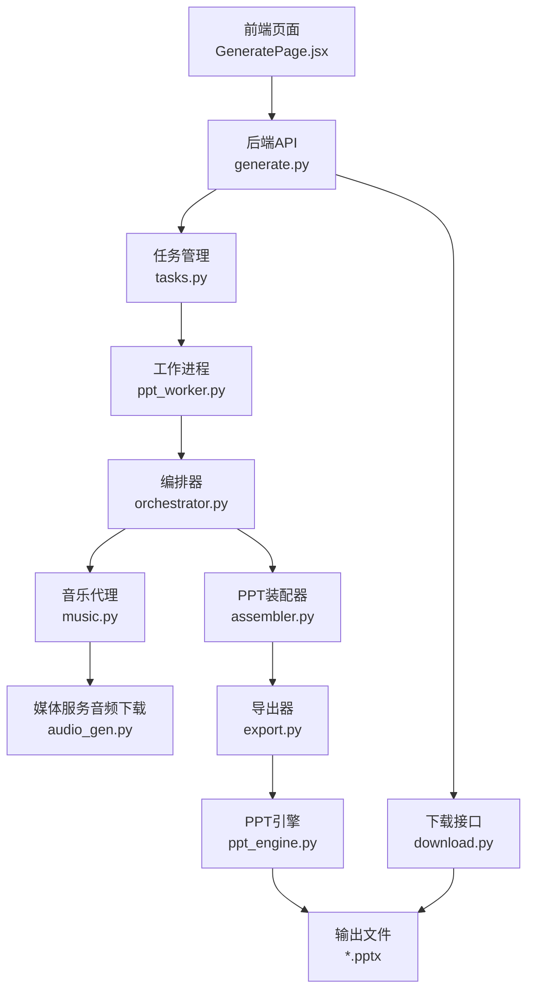
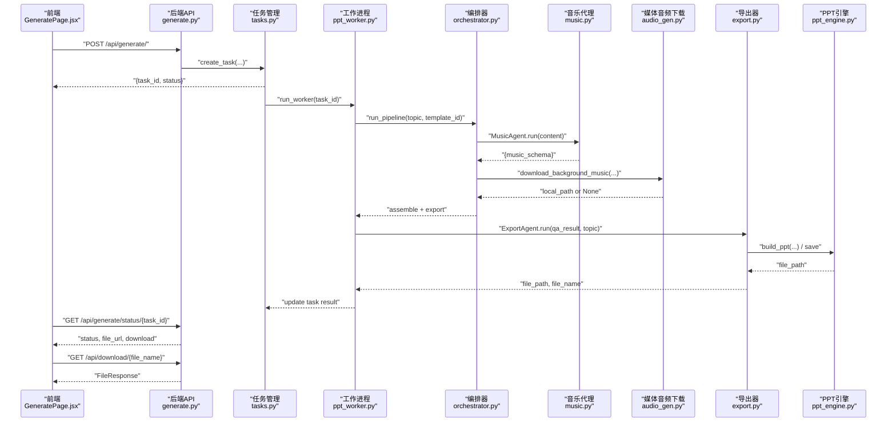
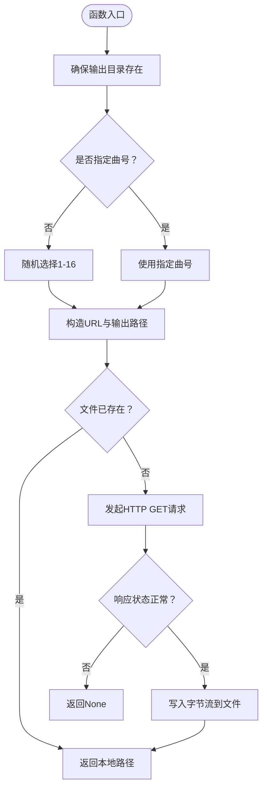
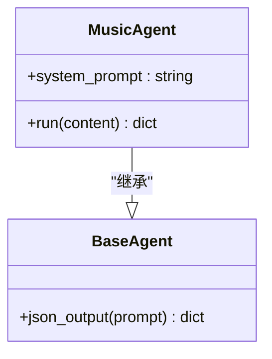
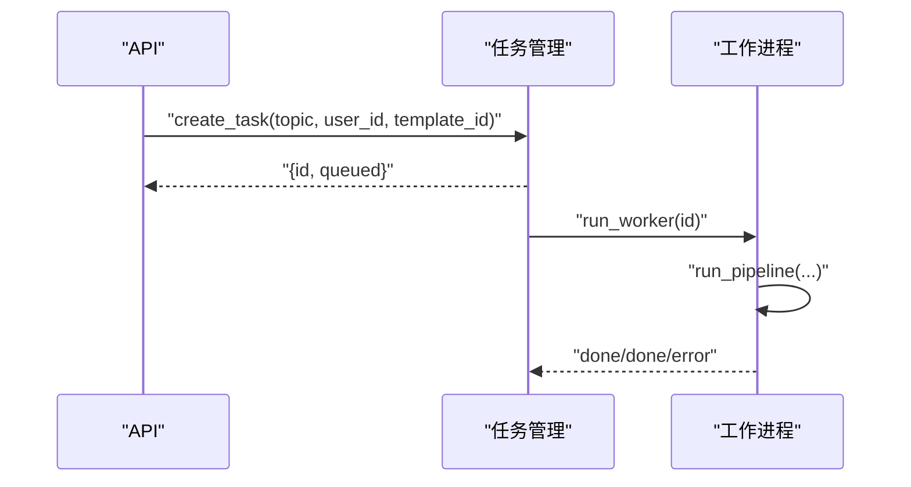
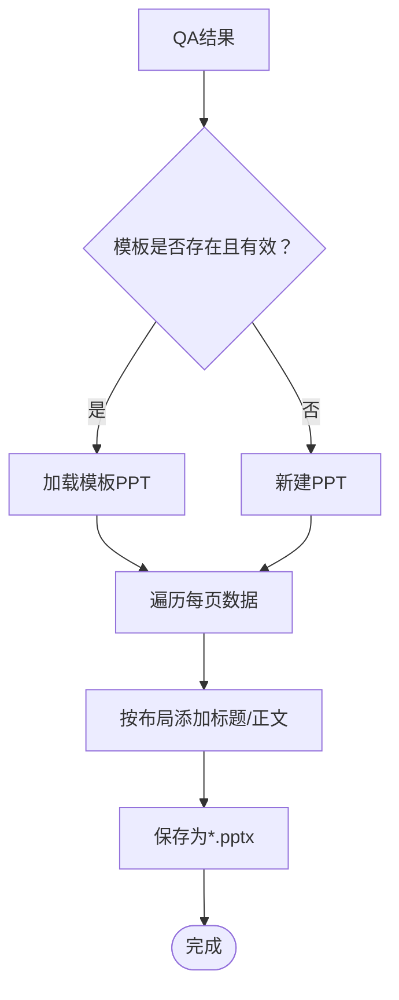
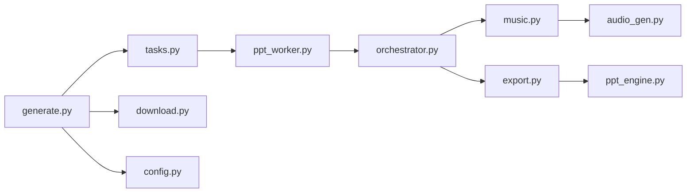

# 音频生成服务

<cite>
**本文引用的文件**
- [audio_gen.py](file://media-service/audio_gen.py)
- [music.py](file://backend/agents/music.py)
- [orchestrator.py](file://backend/agents/orchestrator.py)
- [generate.py](file://backend/api/generate.py)
- [download.py](file://backend/api/download.py)
- [tasks.py](file://backend/core/tasks.py)
- [ppt_worker.py](file://backend/workers/ppt_worker.py)
- [config.py](file://backend/core/config.py)
- [export.py](file://backend/agents/export.py)
- [ppt_engine.py](file://ppt-engine/engine.py)
- [ppt_export.py](file://engine/ppt_export.py)
- [main.py](file://backend/main.py)
- [GeneratePage.jsx](file://frontend/src/pages/GeneratePage.jsx)
</cite>

## 目录
1. [简介](#简介)
2. [项目结构](#项目结构)
3. [核心组件](#核心组件)
4. [架构总览](#架构总览)
5. [详细组件分析](#详细组件分析)
6. [依赖关系分析](#依赖关系分析)
7. [性能考虑](#性能考虑)
8. [故障排查指南](#故障排查指南)
9. [结论](#结论)
10. [附录](#附录)

## 简介
本文件面向音频生成服务，系统性梳理后端与媒体服务在音频下载、PPT装配与导出中的协作路径，覆盖以下主题：
- 音频合成与音效处理：当前仓库以“背景音乐下载”为主，未见内置TTS或音频合成逻辑；可扩展接入第三方TTS服务或本地模型。
- 质量控制机制：通过任务队列、状态轮询与导出阶段的PPT结构校验实现质量保障。
- 文件生成流程：从API请求到任务调度、PPT装配、导出与下载。
- 缓存策略与CDN分发：仓库未实现本地缓存与CDN分发；建议在媒体服务层引入缓存与CDN。
- 配置参数与输出格式：基于现有配置项与PPT导出能力进行说明。
- 与PPT引擎的集成：通过装配器注入音乐元数据，导出阶段由PPT引擎写入幻灯片布局与内容。
- 错误处理与重试：基于任务状态机与异常捕获实现基础容错。

## 项目结构
音频生成服务涉及后端API、任务调度、PPT装配与导出、前端轮询等模块，整体围绕“任务驱动”的异步流水线展开。

图示来源
- [generate.py:1-52](file://backend/api/generate.py#L1-L52)
- [tasks.py:1-33](file://backend/core/tasks.py#L1-L33)
- [ppt_worker.py:1-24](file://backend/workers/ppt_worker.py#L1-L24)
- [orchestrator.py:1-56](file://backend/agents/orchestrator.py#L1-L56)
- [music.py:1-29](file://backend/agents/music.py#L1-L29)
- [audio_gen.py:1-34](file://media-service/audio_gen.py#L1-L34)
- [export.py:1-65](file://backend/agents/export.py#L1-L65)
- [ppt_engine.py:1-166](file://ppt-engine/engine.py#L1-L166)
- [download.py:1-15](file://backend/api/download.py#L1-L15)

章节来源
- [main.py:1-40](file://backend/main.py#L1-L40)
- [generate.py:1-52](file://backend/api/generate.py#L1-L52)
- [tasks.py:1-33](file://backend/core/tasks.py#L1-L33)
- [ppt_worker.py:1-24](file://backend/workers/ppt_worker.py#L1-L24)
- [orchestrator.py:1-56](file://backend/agents/orchestrator.py#L1-L56)
- [music.py:1-29](file://backend/agents/music.py#L1-L29)
- [audio_gen.py:1-34](file://media-service/audio_gen.py#L1-L34)
- [export.py:1-65](file://backend/agents/export.py#L1-L65)
- [ppt_engine.py:1-166](file://ppt-engine/engine.py#L1-L166)
- [download.py:1-15](file://backend/api/download.py#L1-L15)

## 核心组件
- 音频下载服务（媒体侧）：提供随机或指定编号的背景音乐下载，避免重复下载，支持超时与异常兜底。
- 音乐代理（后端智能体）：根据内容主题与情感曲线生成音乐方案，返回可播放的曲目信息与播放参数。
- 任务与工作流：API接收请求后创建任务，后台异步执行编排器流水线，最终导出PPT并提供下载。
- 导出与PPT引擎：导出器负责生成PPT对象并保存；PPT引擎负责布局构建与过渡效果。

章节来源
- [audio_gen.py:12-34](file://media-service/audio_gen.py#L12-L34)
- [music.py:9-28](file://backend/agents/music.py#L9-L28)
- [generate.py:20-35](file://backend/api/generate.py#L20-L35)
- [tasks.py:14-28](file://backend/core/tasks.py#L14-L28)
- [ppt_worker.py:5-24](file://backend/workers/ppt_worker.py#L5-L24)
- [export.py:10-65](file://backend/agents/export.py#L10-L65)
- [ppt_engine.py:124-166](file://ppt-engine/engine.py#L124-L166)

## 架构总览
音频生成服务采用“请求-任务-编排-导出”的异步架构。前端提交生成请求，后端创建任务并交由工作进程执行；工作进程调用编排器，其中音乐代理产出音乐方案，媒体服务按需下载背景音乐；随后装配器将音乐元数据注入PPT结构，导出器生成PPT文件，前端通过下载接口获取结果。

图示来源
- [GeneratePage.jsx:19-43](file://frontend/src/pages/GeneratePage.jsx#L19-L43)
- [generate.py:20-35](file://backend/api/generate.py#L20-L35)
- [tasks.py:8-28](file://backend/core/tasks.py#L8-L28)
- [ppt_worker.py:10-23](file://backend/workers/ppt_worker.py#L10-L23)
- [orchestrator.py:35-41](file://backend/agents/orchestrator.py#L35-L41)
- [music.py:9-28](file://backend/agents/music.py#L9-L28)
- [audio_gen.py:12-34](file://media-service/audio_gen.py#L12-L34)
- [export.py:10-65](file://backend/agents/export.py#L10-L65)
- [ppt_engine.py:124-166](file://ppt-engine/engine.py#L124-L166)
- [download.py:9-15](file://backend/api/download.py#L9-L15)

## 详细组件分析

### 组件A：音频下载服务（媒体侧）
职责
- 提供背景音乐下载能力，支持随机或指定曲目编号。
- 基于本地文件缓存避免重复下载。
- 异常安全：网络请求失败时返回空值，不中断主流程。

复杂度与性能
- 时间复杂度：O(1)，单次HTTP GET与文件IO。
- 空间复杂度：O(1)，仅缓存文件路径。
- 可优化点：并发下载、断点续传、CDN加速、预热缓存。

图示来源
- [audio_gen.py:12-34](file://media-service/audio_gen.py#L12-L34)

章节来源
- [audio_gen.py:12-34](file://media-service/audio_gen.py#L12-L34)

### 组件B：音乐代理（后端智能体）
职责
- 根据内容主题与情感曲线生成音乐方案，返回曲目编号、URL、音量、跨页播放等参数。
- 输出严格遵循JSON结构，便于后续装配与导出。

复杂度与性能
- 时间复杂度：O(1)，主要为LLM调用与JSON解析。
- 可优化点：提示词工程、缓存热门主题的音乐方案、多模态情感映射。

图示来源
- [music.py:5-28](file://backend/agents/music.py#L5-L28)

章节来源
- [music.py:5-28](file://backend/agents/music.py#L5-L28)

### 组件C：任务与工作流
职责
- API层创建任务并返回任务ID。
- 任务管理器维护内存态的任务表，异步触发工作进程。
- 工作进程执行编排器流水线，更新任务状态与结果。

图示来源
- [generate.py:20-35](file://backend/api/generate.py#L20-L35)
- [tasks.py:14-28](file://backend/core/tasks.py#L14-L28)
- [ppt_worker.py:5-24](file://backend/workers/ppt_worker.py#L5-L24)

章节来源
- [generate.py:20-35](file://backend/api/generate.py#L20-L35)
- [tasks.py:14-28](file://backend/core/tasks.py#L14-L28)
- [ppt_worker.py:5-24](file://backend/workers/ppt_worker.py#L5-L24)

### 组件D：导出与PPT引擎
职责
- 导出器根据PPT数据结构生成PPT对象并保存为文件。
- PPT引擎负责布局构建、占位符填充与过渡效果。

图示来源
- [export.py:10-65](file://backend/agents/export.py#L10-L65)
- [ppt_engine.py:124-166](file://ppt-engine/engine.py#L124-L166)

章节来源
- [export.py:10-65](file://backend/agents/export.py#L10-L65)
- [ppt_engine.py:124-166](file://ppt-engine/engine.py#L124-L166)

### 组件E：与PPT引擎的集成与同步
说明
- 音乐元数据由音乐代理生成并通过装配器注入PPT结构。
- 当前仓库未发现直接在PPT中嵌入音频轨道的实现；如需音频播放，可参考旧版引擎脚本中通过COM接口插入音频的方式。

章节来源
- [orchestrator.py:35-41](file://backend/agents/orchestrator.py#L35-L41)
- [ppt_export.py:75-90](file://engine/ppt_export.py#L75-L90)
- [ppt_export.py:156-167](file://engine/ppt_export.py#L156-L167)

## 依赖关系分析
- 模块耦合
  - API依赖任务管理；任务管理依赖工作进程；工作进程依赖编排器；编排器依赖音乐代理与媒体服务。
  - 导出器与PPT引擎解耦，便于替换不同导出策略。
- 外部依赖
  - httpx用于异步HTTP请求。
  - python-pptx用于PPT对象操作。
  - FastAPI用于API路由与静态文件服务。

图示来源
- [generate.py:1-52](file://backend/api/generate.py#L1-L52)
- [tasks.py:1-33](file://backend/core/tasks.py#L1-L33)
- [ppt_worker.py:1-24](file://backend/workers/ppt_worker.py#L1-24)
- [orchestrator.py:1-56](file://backend/agents/orchestrator.py#L1-L56)
- [music.py:1-29](file://backend/agents/music.py#L1-L29)
- [audio_gen.py:1-34](file://media-service/audio_gen.py#L1-L34)
- [export.py:1-65](file://backend/agents/export.py#L1-L65)
- [ppt_engine.py:1-166](file://ppt-engine/engine.py#L1-L166)
- [download.py:1-15](file://backend/api/download.py#L1-L15)
- [config.py:1-34](file://backend/core/config.py#L1-L34)

章节来源
- [generate.py:1-52](file://backend/api/generate.py#L1-L52)
- [tasks.py:1-33](file://backend/core/tasks.py#L1-L33)
- [ppt_worker.py:1-24](file://backend/workers/ppt_worker.py#L1-L24)
- [orchestrator.py:1-56](file://backend/agents/orchestrator.py#L1-L56)
- [music.py:1-29](file://backend/agents/music.py#L1-L29)
- [audio_gen.py:1-34](file://media-service/audio_gen.py#L1-L34)
- [export.py:1-65](file://backend/agents/export.py#L1-L65)
- [ppt_engine.py:1-166](file://ppt-engine/engine.py#L1-L166)
- [download.py:1-15](file://backend/api/download.py#L1-L15)
- [config.py:1-34](file://backend/core/config.py#L1-L34)

## 性能考虑
- 并发与限流
  - 使用异步HTTP客户端减少I/O阻塞。
  - 任务队列按ID调度，避免重复执行。
- 缓存与CDN
  - 建议在媒体服务层增加磁盘/Redis缓存，命中则跳过下载。
  - 对外提供CDN访问地址，缩短首屏加载时间。
- 导出优化
  - 批量写入PPT对象，减少多次IO。
  - 合理选择布局索引，避免越界回退带来的额外开销。
- 前端轮询
  - 建议指数退避与最大重试次数，降低无效请求。

## 故障排查指南
- 常见问题
  - 任务未执行：检查任务管理器是否正确创建与触发工作进程。
  - 下载失败：确认网络可达与超时设置合理；查看异常日志。
  - 导出失败：检查模板路径有效性与PPT对象构建逻辑。
- 排查步骤
  - 查看任务状态与错误字段。
  - 校验输出目录权限与磁盘空间。
  - 检查FastAPI路由注册与静态文件挂载。

章节来源
- [ppt_worker.py:10-23](file://backend/workers/ppt_worker.py#L10-L23)
- [tasks.py:8-28](file://backend/core/tasks.py#L8-L28)
- [download.py:9-15](file://backend/api/download.py#L9-L15)

## 结论
当前音频生成服务以“背景音乐下载”为核心，结合LLM生成的音乐方案与PPT装配导出形成完整流水线。若需实现TTS与音频合成，可在媒体服务层扩展或接入外部服务；同时建议引入缓存与CDN以提升性能与用户体验。

## 附录

### 配置参数与输出格式
- 配置项
  - 输出目录：用于存放生成的PPT文件。
  - 上传目录：用于临时文件与中间产物。
  - 代理地址：可选，用于网络请求。
- 输出格式
  - 默认输出为PPTX文件，文件名包含主题与时间戳。

章节来源
- [config.py:25-27](file://backend/core/config.py#L25-L27)
- [export.py:11-18](file://backend/agents/export.py#L11-L18)

### 与PPT引擎的集成要点
- 音乐元数据通过装配器注入PPT结构，便于后续导出阶段统一处理。
- 若需在PPT中嵌入音频轨道，可参考旧版引擎脚本中的COM接口方法。

章节来源
- [orchestrator.py:35-41](file://backend/agents/orchestrator.py#L35-L41)
- [ppt_export.py:156-167](file://engine/ppt_export.py#L156-L167)