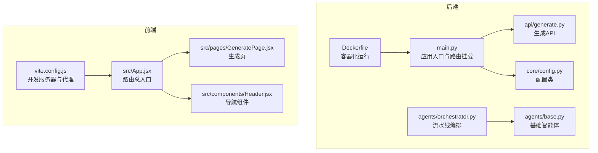
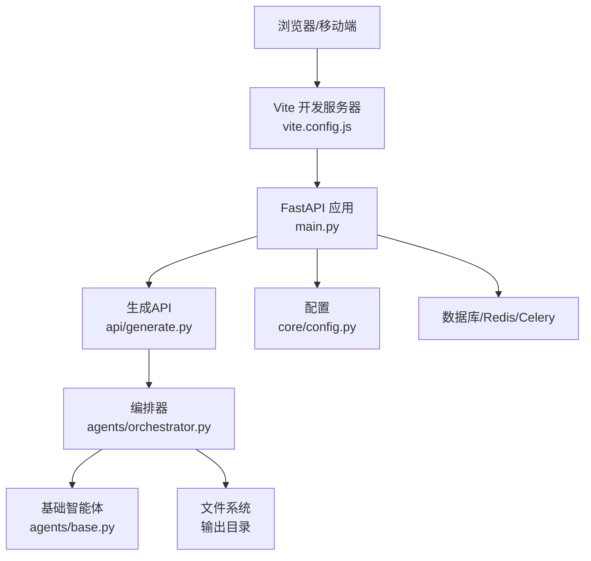
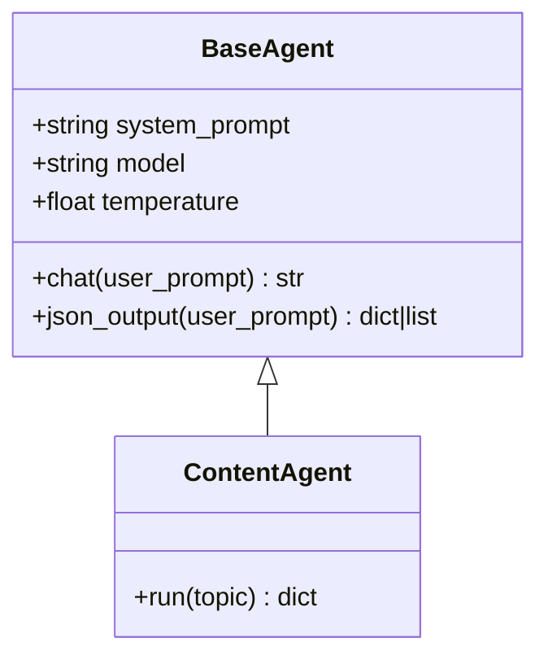
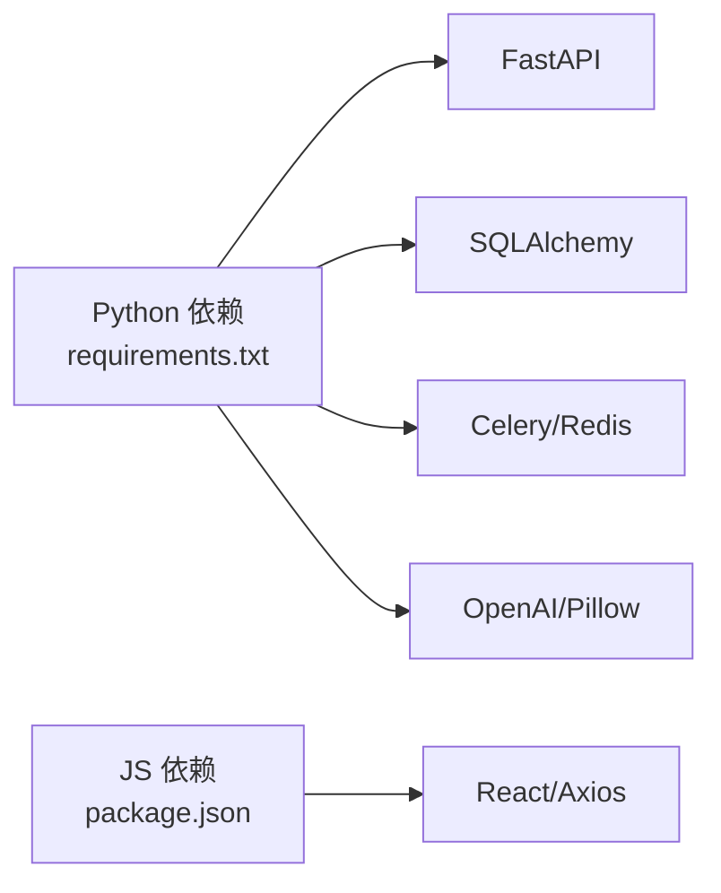
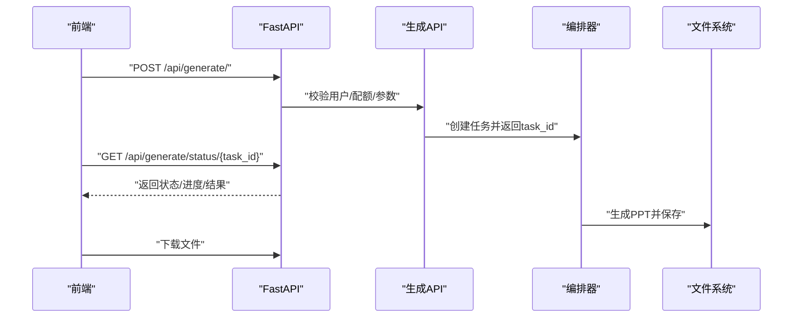

# 代码规范

<cite>
**本文引用的文件**
- [backend/main.py](file://backend/main.py)
- [backend/demo_local.py](file://backend/demo_local.py)
- [backend/requirements.txt](file://backend/requirements.txt)
- [backend/core/config.py](file://backend/core/config.py)
- [backend/api/generate.py](file://backend/api/generate.py)
- [backend/agents/orchestrator.py](file://backend/agents/orchestrator.py)
- [backend/agents/base.py](file://backend/agents/base.py)
- [backend/agents/content.py](file://backend/agents/content.py)
- [backend/Dockerfile](file://backend/Dockerfile)
- [frontend/src/App.jsx](file://frontend/src/App.jsx)
- [frontend/src/components/Header.jsx](file://frontend/src/components/Header.jsx)
- [frontend/src/pages/GeneratePage.jsx](file://frontend/src/pages/GeneratePage.jsx)
- [frontend/package.json](file://frontend/package.json)
- [frontend/vite.config.js](file://frontend/vite.config.js)
</cite>

## 目录
1. [引言](#引言)
2. [项目结构](#项目结构)
3. [核心组件](#核心组件)
4. [架构总览](#架构总览)
5. [详细组件分析](#详细组件分析)
6. [依赖分析](#依赖分析)
7. [性能考虑](#性能考虑)
8. [故障排查指南](#故障排查指南)
9. [结论](#结论)
10. [附录](#附录)

## 引言
本指南面向AI-PPT项目，旨在统一后端（Python/FastAPI）、前端（React/Vite）与AI代理模块的开发规范，涵盖代码风格、命名约定、导入顺序、注释与文档字符串、API与异常处理模式、组件与Hook使用、状态管理、文件与目录命名、模块导入规则、格式化工具配置以及代码审查清单与质量检查标准。本文所有要求均基于仓库现有实现提炼而来，并结合工程实践给出可操作建议。

## 项目结构
- 后端采用分层与功能域划分：核心配置与数据库在 core，业务API在 api，AI代理在 agents，模型在 models，任务与工作器在 workers，入口在 main.py。
- 前端采用路由驱动的页面与组件分离：App集中路由，各页面组件独立，公共UI组件位于 components。
- AI代理模块以“智能体”为单位组织，通过编排器串联形成流水线。

图表来源
- [backend/main.py:1-40](file://backend/main.py#L1-L40)
- [backend/core/config.py:1-34](file://backend/core/config.py#L1-L34)
- [backend/api/generate.py:1-52](file://backend/api/generate.py#L1-L52)
- [backend/agents/orchestrator.py:1-56](file://backend/agents/orchestrator.py#L1-L56)
- [backend/agents/base.py:1-24](file://backend/agents/base.py#L1-L24)
- [backend/Dockerfile:1-15](file://backend/Dockerfile#L1-L15)
- [frontend/src/App.jsx:1-34](file://frontend/src/App.jsx#L1-L34)
- [frontend/src/pages/GeneratePage.jsx:1-133](file://frontend/src/pages/GeneratePage.jsx#L1-L133)
- [frontend/src/components/Header.jsx:1-61](file://frontend/src/components/Header.jsx#L1-L61)
- [frontend/vite.config.js:1-9](file://frontend/vite.config.js#L1-L9)

章节来源
- [backend/main.py:1-40](file://backend/main.py#L1-L40)
- [frontend/src/App.jsx:1-34](file://frontend/src/App.jsx#L1-L34)

## 核心组件
- 应用入口与生命周期：使用 lifespan 管理数据库初始化；注册跨域中间件；集中挂载路由。
- 配置系统：基于 Pydantic Settings 的强类型配置，支持从 .env 文件加载。
- 生成API：接收主题参数，校验使用配额与请求有效性，创建异步任务并返回任务ID；轮询查询任务状态。
- 代理编排：按内容策划、故事编排、脚本写作、视觉风格、图片与动画、导出等步骤串行编排。
- 基础智能体：封装通用对话与JSON解析能力，便于各Agent复用。
- 前端路由与页面：App集中路由，页面组件负责交互逻辑，Header负责导航与登录态判断。
- 开发与构建：Vite开发服务器，本地代理到后端；Dockerfile定义镜像与启动命令。

章节来源
- [backend/main.py:10-40](file://backend/main.py#L10-L40)
- [backend/core/config.py:4-34](file://backend/core/config.py#L4-L34)
- [backend/api/generate.py:14-52](file://backend/api/generate.py#L14-L52)
- [backend/agents/orchestrator.py:19-56](file://backend/agents/orchestrator.py#L19-L56)
- [backend/agents/base.py:5-24](file://backend/agents/base.py#L5-L24)
- [frontend/src/App.jsx:14-34](file://frontend/src/App.jsx#L14-L34)
- [frontend/src/components/Header.jsx:12-61](file://frontend/src/components/Header.jsx#L12-L61)
- [frontend/vite.config.js:4-8](file://frontend/vite.config.js#L4-L8)
- [backend/Dockerfile:12-15](file://backend/Dockerfile#L12-L15)

## 架构总览
后端通过FastAPI提供REST接口，前端通过Axios调用后端API，Vite代理将前端请求转发至后端。AI代理模块通过编排器串联多个子智能体，最终生成PPT并落盘。

图表来源
- [backend/main.py:16-39](file://backend/main.py#L16-L39)
- [backend/api/generate.py:20-52](file://backend/api/generate.py#L20-L52)
- [backend/agents/orchestrator.py:19-56](file://backend/agents/orchestrator.py#L19-L56)
- [backend/agents/base.py:10-24](file://backend/agents/base.py#L10-L24)
- [backend/core/config.py:4-34](file://backend/core/config.py#L4-L34)
- [frontend/vite.config.js:6-6](file://frontend/vite.config.js#L6-L6)

## 详细组件分析

### Python 后端代码风格与规范
- 命名约定
  - 模块与包：小写短横线或下划线，避免混合；如 core、api、agents。
  - 类名：大驼峰；如 Settings、BaseAgent。
  - 函数与方法：小写下划线；如 run、chat。
  - 常量：全大写加下划线；如 DEFAULT_MODEL。
  - 变量：小写下划线；如 task_id、user_id。
- 导入顺序
  - 标准库优先；第三方库次之；项目内相对导入最后。
  - 同类导入按字母序排列，不同类别空一行分隔。
- 注释与文档字符串
  - 函数/方法/类需有简洁的英文文档字符串，说明用途、参数、返回值与异常。
  - 复杂逻辑处添加行内注释，解释为什么而非是什么。
- 错误处理
  - 使用HTTPException抛出明确错误码与消息；在API层统一捕获并返回。
  - 对外部服务调用增加超时与重试策略建议。
- 数据模型与Pydantic
  - 所有API请求/响应尽量使用Pydantic模型，确保字段约束与序列化一致。
- 异步与并发
  - 使用async/await，避免阻塞I/O；数据库会话与外部服务调用应异步化。
- 文件与路径
  - 配置中统一管理输出目录、上传目录等路径，避免硬编码。

章节来源
- [backend/api/generate.py:14-52](file://backend/api/generate.py#L14-L52)
- [backend/agents/base.py:5-24](file://backend/agents/base.py#L5-L24)
- [backend/core/config.py:4-34](file://backend/core/config.py#L4-L34)

### FastAPI 特定规范
- 路由定义
  - 使用APIRouter定义模块化路由，设置前缀与标签，便于聚合与文档生成。
  - 路由函数命名清晰，如 generate_ppt、get_status。
- 依赖注入
  - 使用Depends注入认证用户、数据库会话等；保持依赖粒度小且可测试。
- 异常处理
  - 在业务层抛出HTTPException，错误信息对用户友好但不泄露内部细节。
- 生命周期
  - 使用lifespan进行数据库初始化与清理，避免重复连接。
- CORS与静态资源
  - 明确允许的源、方法与头；生产环境建议限制更严格。
- 健康检查
  - 提供轻量级健康端点，返回应用名称与版本。

章节来源
- [backend/main.py:16-40](file://backend/main.py#L16-L40)
- [backend/api/generate.py:11-11](file://backend/api/generate.py#L11-L11)
- [backend/api/generate.py:20-52](file://backend/api/generate.py#L20-L52)

### AI 代理模块组织与接口设计
- 组织原则
  - 每个Agent专注单一职责，提供run方法作为统一入口。
  - 共享能力抽象到BaseAgent，如对话与JSON解析。
  - 编排器按固定顺序串联Agent，保证数据流稳定。
- 接口设计
  - 输入/输出尽量使用Pydantic模型或字典结构，便于测试与契约约束。
  - Agent间传递的数据需明确键名与类型，避免隐式约定。
  - JSON输出需严格清洗与校验，防止解析失败。

图表来源
- [backend/agents/base.py:5-24](file://backend/agents/base.py#L5-L24)
- [backend/agents/content.py:4-21](file://backend/agents/content.py#L4-L21)

章节来源
- [backend/agents/orchestrator.py:19-56](file://backend/agents/orchestrator.py#L19-L56)
- [backend/agents/base.py:5-24](file://backend/agents/base.py#L5-L24)
- [backend/agents/content.py:7-21](file://backend/agents/content.py#L7-L21)

### React 前端代码规范
- 组件命名
  - 页面组件以Page结尾，如 GeneratePage；通用组件以名词或动词开头，如 Header。
- Hook 使用
  - 将副作用逻辑抽离到自定义Hook；在页面组件中仅做组合与渲染。
  - 清理定时器与订阅，避免内存泄漏。
- 状态管理
  - 表单与局部状态使用useState；全局状态建议使用Context或轻量状态库。
  - 请求状态（loading、error、result）三元组模式，提升可读性。
- 路由与导航
  - App集中声明路由；页面组件内使用useNavigate进行条件跳转。
- 样式与图标
  - 使用Tailwind类名，保持一致性；图标库统一引入与尺寸控制。
- API 客户端
  - Axios实例集中配置拦截器与超时；错误分支明确区分业务错误与网络错误。

章节来源
- [frontend/src/App.jsx:14-34](file://frontend/src/App.jsx#L14-L34)
- [frontend/src/components/Header.jsx:12-61](file://frontend/src/components/Header.jsx#L12-L61)
- [frontend/src/pages/GeneratePage.jsx:6-133](file://frontend/src/pages/GeneratePage.jsx#L6-L133)
- [frontend/package.json:11-24](file://frontend/package.json#L11-L24)

### 文件命名与目录结构原则
- 后端
  - 包：小写短横线或下划线；模块：小写下划线；常量：UPPER_CASE。
  - API模块按功能域命名，如 generate.py、users.py。
  - 配置文件：core/config.py；模型：models/*.py；代理：agents/*.py。
- 前端
  - 页面：pages/*Page.jsx；组件：components/*/*.jsx；API客户端：api/client.js。
  - 根入口：src/main.jsx/App.jsx；样式：src/index.css。
- 文档与配置
  - Dockerfile、requirements.txt、package.json、vite.config.js等置于根目录或对应目录。

章节来源
- [backend/main.py:1-40](file://backend/main.py#L1-L40)
- [frontend/src/App.jsx:1-34](file://frontend/src/App.jsx#L1-L34)
- [frontend/vite.config.js:1-9](file://frontend/vite.config.js#L1-L9)
- [backend/requirements.txt:1-22](file://backend/requirements.txt#L1-L22)

### 模块导入规则
- Python
  - 标准库 > 第三方库 > 项目内相对导入；同组内按字母序排序。
  - 避免循环导入；必要时延迟导入或重构依赖关系。
- JavaScript/TypeScript
  - 标准库/内置 > 第三方 > 内部模块；同组内按字母序。
  - 绝对路径优于相对路径；统一使用扩展名。

章节来源
- [backend/main.py:1-8](file://backend/main.py#L1-L8)
- [frontend/src/App.jsx:1-13](file://frontend/src/App.jsx#L1-L13)

### 代码格式化工具配置
- Python
  - Black：统一缩进与行宽；建议行宽不超过100字符。
  - isort：标准化导入顺序与分组。
  - Flake8/Pyflakes：补充PEP8检查与未使用导入检测。
  - Pydantic v2：配合模型字段校验与序列化。
- JavaScript/TypeScript
  - Prettier：统一代码风格。
  - ESLint：结合React Hooks规则与import/order规则。
  - Tailwind CSS：配合Purge与构建优化。
- Docker
  - 在容器内安装依赖并暴露端口；CMD启动uvicorn指向应用对象。

章节来源
- [backend/Dockerfile:1-15](file://backend/Dockerfile#L1-L15)
- [frontend/package.json:6-24](file://frontend/package.json#L6-L24)

### 文档字符串与API注释标准
- 函数/方法/类
  - 必须包含简要说明、参数说明、返回值说明与可能抛出的异常。
- API
  - 在OpenAPI/Swagger中体现请求/响应模型；为每个端点提供简短描述与示例。
- 代理模块
  - 为每个Agent.run方法提供输入输出说明与典型JSON示例。

章节来源
- [backend/agents/base.py:10-24](file://backend/agents/base.py#L10-L24)
- [backend/agents/content.py:7-21](file://backend/agents/content.py#L7-L21)
- [backend/api/generate.py:14-52](file://backend/api/generate.py#L14-L52)

### 代码审查清单与质量检查
- Python
  - 是否遵循PEP8与Black格式化；导入顺序是否isort；是否有未使用的变量/导入。
  - 异常处理是否完整；是否使用HTTPException并提供明确错误信息。
  - 配置是否集中管理；敏感信息是否来自环境变量。
  - 异步函数是否正确使用；数据库会话是否正确关闭。
- JavaScript
  - 是否使用ESLint与Prettier；Hook使用是否合理；是否存在未清理的副作用。
  - Axios拦截器是否统一；错误分支是否覆盖。
- 通用
  - 是否存在魔法数字/字符串；路径与URL是否集中配置；日志与调试信息是否适当。
  - Docker构建是否最小化；端口与卷是否合理映射。

章节来源
- [backend/main.py:16-40](file://backend/main.py#L16-L40)
- [backend/api/generate.py:20-52](file://backend/api/generate.py#L20-L52)
- [frontend/src/pages/GeneratePage.jsx:19-68](file://frontend/src/pages/GeneratePage.jsx#L19-L68)

## 依赖分析
- 后端依赖
  - Web框架：FastAPI + Uvicorn。
  - 数据库：SQLAlchemy + AsyncIO；迁移工具Alembic。
  - 认证与加密：PyJWT + passlib。
  - 任务队列：Celery + Redis。
  - AI与多媒体：OpenAI、Pillow、python-pptx、bing-image-downloader。
- 前端依赖
  - React生态：React、React Router、Axios。
  - 构建与样式：Vite、Tailwind CSS、PostCSS。

图表来源
- [backend/requirements.txt:1-22](file://backend/requirements.txt#L1-L22)
- [frontend/package.json:11-24](file://frontend/package.json#L11-L24)

章节来源
- [backend/requirements.txt:1-22](file://backend/requirements.txt#L1-L22)
- [frontend/package.json:11-24](file://frontend/package.json#L11-L24)

## 性能考虑
- 异步化：数据库与外部API调用必须异步；避免阻塞事件循环。
- 连接池：数据库与Redis连接应复用与限流；避免频繁创建销毁。
- 缓存：热点数据与中间结果使用Redis缓存；注意键空间管理。
- 任务队列：耗时操作放入Celery后台任务；提供进度上报与重试机制。
- 前端：懒加载非关键页面；减少不必要的重渲染；使用虚拟滚动处理长列表。
- 构建优化：Vite生产构建开启压缩与Tree Shaking；Tailwind按需清理未使用样式。

## 故障排查指南
- 后端
  - 健康检查：访问 /api/health 确认应用可用。
  - 数据库：确认数据库URL与驱动；检查连接池大小与超时。
  - 代理：核对编排器各Agent输出键是否一致；逐步打印中间结果定位问题。
  - 任务：查看Celery日志与Redis队列；确认任务ID与状态键。
- 前端
  - 代理：确认Vite代理配置与后端端口一致；检查CORS设置。
  - 路由：确认路由路径与页面组件映射；检查条件渲染。
  - 状态：检查请求状态三元组更新逻辑；避免竞态条件。
- 通用
  - 日志：后端记录关键链路日志；前端记录错误边界与网络错误。
  - 环境：核对 .env 与环境变量；敏感信息不可硬编码。

章节来源
- [backend/main.py:37-40](file://backend/main.py#L37-L40)
- [backend/api/generate.py:38-52](file://backend/api/generate.py#L38-L52)
- [frontend/vite.config.js:6-6](file://frontend/vite.config.js#L6-L6)
- [frontend/src/pages/GeneratePage.jsx:19-68](file://frontend/src/pages/GeneratePage.jsx#L19-L68)

## 结论
本规范以现有代码库为基础，提出统一的Python/FastAPI、React/Vite与AI代理模块开发标准，强调可维护性、可测试性与可观测性。建议团队在CI中集成格式化与静态检查工具，持续改进代码质量与交付效率。

## 附录
- 示例流程：前端提交生成请求 → 后端校验与配额 → 创建任务 → 前端轮询状态 → 返回结果与下载链接。

图表来源
- [backend/api/generate.py:20-52](file://backend/api/generate.py#L20-L52)
- [backend/agents/orchestrator.py:19-56](file://backend/agents/orchestrator.py#L19-L56)
- [frontend/src/pages/GeneratePage.jsx:38-68](file://frontend/src/pages/GeneratePage.jsx#L38-L68)