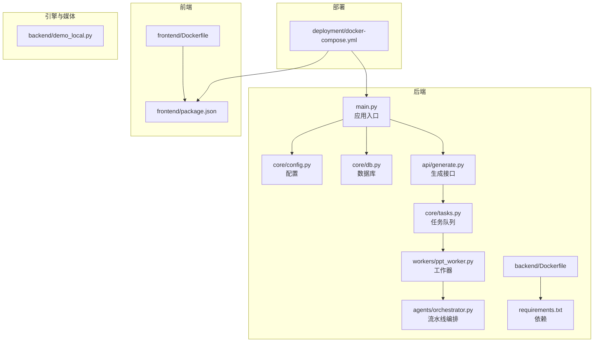
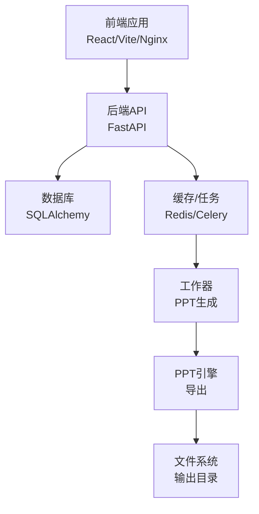
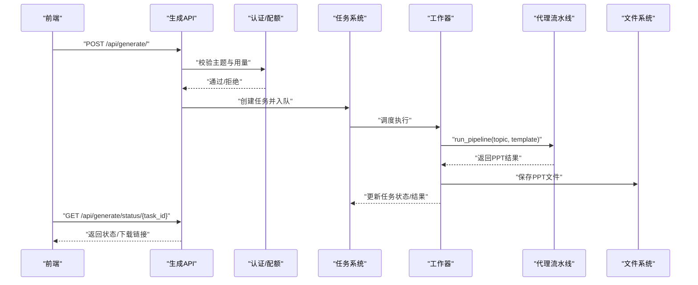
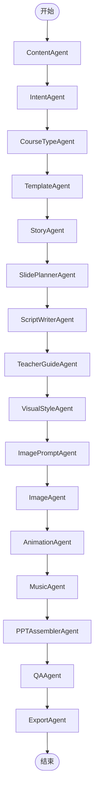
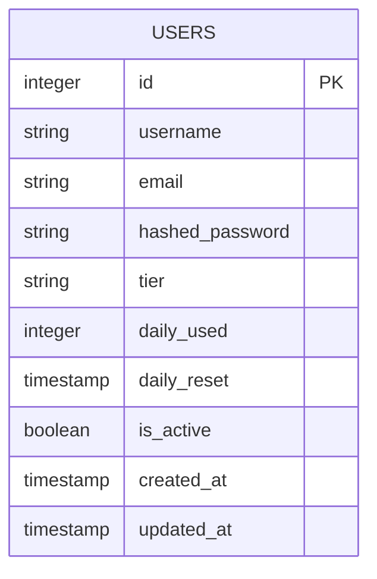
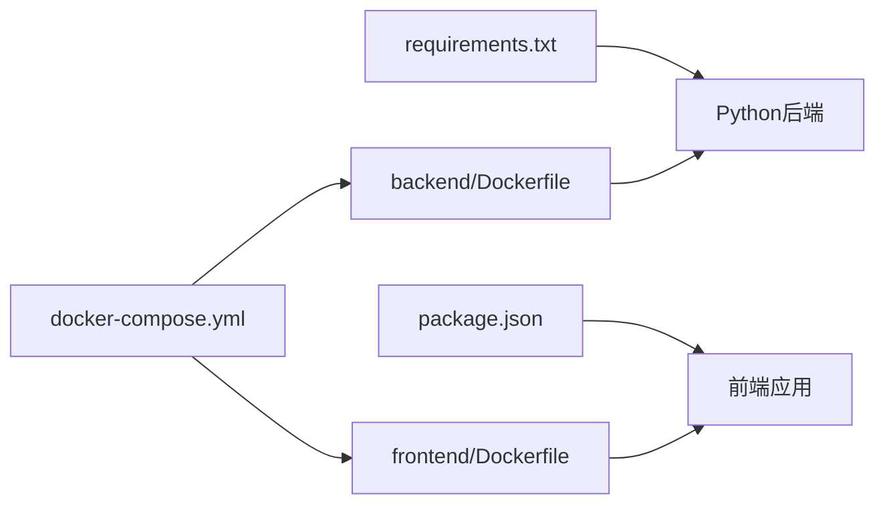

# 开发指南

<cite>
**本文引用的文件**
- [backend/main.py](file://backend/main.py)
- [backend/requirements.txt](file://backend/requirements.txt)
- [backend/core/config.py](file://backend/core/config.py)
- [backend/core/db.py](file://backend/core/db.py)
- [backend/models/user.py](file://backend/models/user.py)
- [backend/core/tasks.py](file://backend/core/tasks.py)
- [backend/workers/ppt_worker.py](file://backend/workers/ppt_worker.py)
- [backend/agents/orchestrator.py](file://backend/agents/orchestrator.py)
- [backend/api/generate.py](file://backend/api/generate.py)
- [backend/Dockerfile](file://backend/Dockerfile)
- [frontend/package.json](file://frontend/package.json)
- [frontend/Dockerfile](file://frontend/Dockerfile)
- [deployment/docker-compose.yml](file://deployment/docker-compose.yml)
- [backend/demo_local.py](file://backend/demo_local.py)
</cite>

## 目录
1. [简介](#简介)
2. [项目结构](#项目结构)
3. [核心组件](#核心组件)
4. [架构总览](#架构总览)
5. [详细组件分析](#详细组件分析)
6. [依赖分析](#依赖分析)
7. [性能考虑](#性能考虑)
8. [故障排查指南](#故障排查指南)
9. [结论](#结论)
10. [附录](#附录)

## 简介
本开发指南面向AI-PPT项目的后端与前端开发者，覆盖开发环境搭建、IDE配置、调试工具、代码规范、项目结构原则、测试策略、Git工作流、分支管理与代码审查标准、新功能开发流程、提交规范、文档更新要求、依赖管理与版本控制、包发布流程、性能测试与安全审计、代码质量检查以及常见问题排查与调试技巧。目标是帮助团队在统一规范下高效协作，确保系统稳定性与可维护性。

## 项目结构
项目采用前后端分离架构，后端基于FastAPI提供REST API，使用异步SQLAlchemy进行数据库访问；前端基于React与Vite构建，通过Nginx容器化部署；整体通过Docker Compose编排运行。核心目录职责如下：
- backend：后端服务（FastAPI + 异步数据库 + Celery风格的任务队列 + 代理流水线）
- frontend：前端应用（React + Vite + TailwindCSS）
- deployment：容器编排与静态资源配置
- engine/ppt-engine：PPT引擎（演示用途）
- media-service：媒体生成（音频/图像）
- data/output：数据与输出目录（持久卷）

图表来源
- [backend/main.py:1-40](file://backend/main.py#L1-L40)
- [backend/core/config.py:1-34](file://backend/core/config.py#L1-L34)
- [backend/core/db.py:1-27](file://backend/core/db.py#L1-L27)
- [backend/core/tasks.py:1-33](file://backend/core/tasks.py#L1-L33)
- [backend/workers/ppt_worker.py:1-24](file://backend/workers/ppt_worker.py#L1-L24)
- [backend/agents/orchestrator.py:1-56](file://backend/agents/orchestrator.py#L1-L56)
- [backend/api/generate.py:1-52](file://backend/api/generate.py#L1-L52)
- [backend/requirements.txt:1-22](file://backend/requirements.txt#L1-L22)
- [backend/Dockerfile:1-15](file://backend/Dockerfile#L1-L15)
- [frontend/package.json:1-26](file://frontend/package.json#L1-L26)
- [frontend/Dockerfile:1-13](file://frontend/Dockerfile#L1-L13)
- [deployment/docker-compose.yml:1-46](file://deployment/docker-compose.yml#L1-L46)
- [backend/demo_local.py:1-24](file://backend/demo_local.py#L1-L24)

章节来源
- [backend/main.py:1-40](file://backend/main.py#L1-L40)
- [deployment/docker-compose.yml:1-46](file://deployment/docker-compose.yml#L1-L46)

## 核心组件
- 应用入口与生命周期：后端通过FastAPI应用注册中间件与路由，并在生命周期中初始化数据库。
- 配置管理：使用Pydantic Settings加载环境变量，集中管理API密钥、数据库连接、Redis、JWT、Stripe等配置项。
- 数据库层：异步SQLAlchemy引擎与会话管理，支持SQLite与PostgreSQL（通过URL切换）。
- 模型定义：用户模型包含订阅与配额相关字段，支撑用量限制与计费逻辑。
- 任务系统：内存中的任务存储与事件循环调度，触发PPT生成工作器执行流水线。
- 工作器：封装异步执行流程，负责调用代理流水线并将结果写回任务状态。
- 代理流水线：内容、意图、课程类型、故事、幻灯片规划、脚本、教师指南、视觉风格、图片提示、图片、动画、音乐、模板、装配与导出的链式处理。
- 生成API：接收请求参数，校验主题有效性，检查用量配额，创建任务并返回任务状态。
- 前端与容器化：React应用通过Vite构建，Nginx容器化部署；后端与前端通过Docker Compose编排。

章节来源
- [backend/main.py:1-40](file://backend/main.py#L1-L40)
- [backend/core/config.py:1-34](file://backend/core/config.py#L1-L34)
- [backend/core/db.py:1-27](file://backend/core/db.py#L1-L27)
- [backend/models/user.py:1-21](file://backend/models/user.py#L1-L21)
- [backend/core/tasks.py:1-33](file://backend/core/tasks.py#L1-L33)
- [backend/workers/ppt_worker.py:1-24](file://backend/workers/ppt_worker.py#L1-L24)
- [backend/agents/orchestrator.py:1-56](file://backend/agents/orchestrator.py#L1-L56)
- [backend/api/generate.py:1-52](file://backend/api/generate.py#L1-L52)

## 架构总览
系统采用“API网关/应用层 + 任务队列 + 代理流水线 + 导出引擎”的分层设计。前端通过HTTP与后端交互，后端通过任务队列异步执行复杂PPT生成流程，最终将结果落盘并通过下载接口提供。

图表来源
- [backend/main.py:16-34](file://backend/main.py#L16-L34)
- [backend/core/tasks.py:8-28](file://backend/core/tasks.py#L8-L28)
- [backend/workers/ppt_worker.py:5-24](file://backend/workers/ppt_worker.py#L5-L24)
- [backend/agents/orchestrator.py:19-55](file://backend/agents/orchestrator.py#L19-L55)
- [deployment/docker-compose.yml:31-39](file://deployment/docker-compose.yml#L31-L39)

## 详细组件分析

### 组件A：生成API与任务编排
该组件负责接收前端请求，校验输入与配额，创建任务并返回任务ID，随后由工作器异步执行PPT生成流水线。

图表来源
- [backend/api/generate.py:20-51](file://backend/api/generate.py#L20-L51)
- [backend/core/tasks.py:14-32](file://backend/core/tasks.py#L14-L32)
- [backend/workers/ppt_worker.py:5-24](file://backend/workers/ppt_worker.py#L5-L24)
- [backend/agents/orchestrator.py:19-55](file://backend/agents/orchestrator.py#L19-L55)

章节来源
- [backend/api/generate.py:1-52](file://backend/api/generate.py#L1-L52)
- [backend/core/tasks.py:1-33](file://backend/core/tasks.py#L1-L33)
- [backend/workers/ppt_worker.py:1-24](file://backend/workers/ppt_worker.py#L1-L24)
- [backend/agents/orchestrator.py:1-56](file://backend/agents/orchestrator.py#L1-L56)

### 组件B：代理流水线与导出
流水线按顺序调用多个代理完成内容理解、模板选择、故事与脚本生成、视觉与媒体元素生成、装配与导出。

图表来源
- [backend/agents/orchestrator.py:19-55](file://backend/agents/orchestrator.py#L19-L55)

章节来源
- [backend/agents/orchestrator.py:1-56](file://backend/agents/orchestrator.py#L1-L56)

### 组件C：数据库模型与配置
- 用户模型包含基础信息、订阅等级、日用量与重置时间戳等字段，支撑免费与付费用户的差异化配额。
- 配置类集中管理应用名称、调试开关、第三方API密钥、数据库URL、Redis连接、JWT参数、Stripe密钥与Webhook、限额与价格、输出与上传路径、代理地址等。

图表来源
- [backend/models/user.py:6-21](file://backend/models/user.py#L6-L21)

章节来源
- [backend/models/user.py:1-21](file://backend/models/user.py#L1-L21)
- [backend/core/config.py:1-34](file://backend/core/config.py#L1-L34)

## 依赖分析
- 后端依赖：FastAPI、Uvicorn、Pydantic、SQLAlchemy、Alembic、asyncpg/aiosqlite、JWT、Passlib、Stripe、python-pptx、Pillow、OpenAI、Redis、Celery、Jinja2等。
- 前端依赖：React、ReactDOM、Axios、React Router、TailwindCSS、Vite、PostCSS等。
- 容器化：后端Python 3.12 Slim镜像，前端Node 22 Alpine + Nginx镜像；Docker Compose编排后端、前端与Redis服务。

图表来源
- [backend/requirements.txt:1-22](file://backend/requirements.txt#L1-L22)
- [frontend/package.json:1-26](file://frontend/package.json#L1-L26)
- [deployment/docker-compose.yml:1-46](file://deployment/docker-compose.yml#L1-L46)
- [backend/Dockerfile:1-15](file://backend/Dockerfile#L1-L15)
- [frontend/Dockerfile:1-13](file://frontend/Dockerfile#L1-L13)

章节来源
- [backend/requirements.txt:1-22](file://backend/requirements.txt#L1-L22)
- [frontend/package.json:1-26](file://frontend/package.json#L1-L26)
- [deployment/docker-compose.yml:1-46](file://deployment/docker-compose.yml#L1-L46)
- [backend/Dockerfile:1-15](file://backend/Dockerfile#L1-L15)
- [frontend/Dockerfile:1-13](file://frontend/Dockerfile#L1-L13)

## 性能考虑
- 异步I/O：后端使用异步SQLAlchemy与异步依赖注入，降低阻塞风险。
- 任务队列：通过内存任务存储与事件循环调度，避免主线程阻塞；建议在生产环境替换为Redis/Celery以提升可靠性与扩展性。
- 缓存与并发：Redis用于任务状态与缓存，建议对热点查询与模板渲染结果做缓存。
- 数据库优化：合理索引与批量操作，避免N+1查询；使用连接池与超时控制。
- 媒体生成：图片与音频生成可能耗时较长，建议异步化与限流，结合CDN加速下载。
- 前端性能：Vite构建优化、按需加载、Tailwind按需裁剪、Nginx压缩与缓存。

## 故障排查指南
- 健康检查：后端提供健康端点，用于快速确认服务可用性与版本信息。
- 日志与追踪：工作器捕获异常并打印堆栈，便于定位生成失败原因。
- 配置验证：检查环境变量是否正确加载，尤其是数据库URL、API密钥与输出目录。
- 任务状态：通过任务状态接口查看任务进度、错误信息与下载链接。
- 容器编排：确认Docker Compose网络与卷挂载，确保输出与数据目录持久化。

章节来源
- [backend/main.py:37-40](file://backend/main.py#L37-L40)
- [backend/workers/ppt_worker.py:20-24](file://backend/workers/ppt_worker.py#L20-L24)
- [backend/api/generate.py:38-51](file://backend/api/generate.py#L38-L51)
- [deployment/docker-compose.yml:10-15](file://deployment/docker-compose.yml#L10-L15)

## 结论
本指南提供了从开发环境到部署运维的全链路实践建议。建议团队在现有基础上完善测试体系、引入生产级任务队列与监控告警、强化安全审计与代码质量门禁，持续迭代以保障系统的高可用与高性能。

## 附录

### 开发环境搭建与IDE配置
- Python后端
  - 使用Python 3.12，安装依赖：pip install -r backend/requirements.txt
  - 推荐IDE：VSCode或PyCharm，启用Pylance/PyCharm内置lint与格式化
  - 调试：使用Uvicorn启动本地服务，或在IDE中配置FastAPI调试
- 前端
  - 使用Node 22，安装依赖：npm install
  - 推荐IDE：VSCode，启用ESLint、Prettier与Tailwind插件
  - 调试：npm run dev，浏览器断点调试
- 容器化
  - Docker Compose一键启动：docker-compose up
  - 如需单独构建：docker-compose build

章节来源
- [backend/requirements.txt:1-22](file://backend/requirements.txt#L1-L22)
- [frontend/package.json:1-26](file://frontend/package.json#L1-L26)
- [deployment/docker-compose.yml:1-46](file://deployment/docker-compose.yml#L1-L46)
- [backend/Dockerfile:1-15](file://backend/Dockerfile#L1-L15)
- [frontend/Dockerfile:1-13](file://frontend/Dockerfile#L1-L13)

### 代码规范与命名约定
- Python
  - 风格：PEP 8，使用Black与isort进行格式化与导入排序
  - 类型注解：函数与方法参数/返回值均应标注类型
  - 模块组织：按功能拆分模块，避免循环依赖
  - 错误处理：明确异常类型与错误码，记录上下文
- JavaScript/TypeScript
  - ESLint + Prettier，开启严格模式
  - React组件命名采用帕斯卡命名法，Hook以use开头
  - 路由与API命名语义化，避免魔法字符串
- 文件与目录
  - 后端：按功能域划分agents、api、core、models、workers
  - 前端：按页面与组件拆分src/pages与src/components

### 测试策略
- 单元测试
  - 后端：针对代理与工具函数编写pytest用例，使用模拟对象隔离外部依赖
  - 前端：针对组件与Hook编写Jest用例，覆盖边界条件与错误分支
- 集成测试
  - API：使用TestClient或pytest+HTTPX验证端到端流程
  - 任务系统：模拟任务队列，验证状态流转与错误恢复
- 性能测试
  - 使用Locust或自定义压测脚本，评估并发生成能力
- 安全审计
  - 依赖扫描：pip-audit、npm audit
  - 静态分析：Bandit（Python）、ESLint（JS）
  - 机密泄露：移除硬编码密钥，使用环境变量与密钥管理服务

### Git工作流程、分支管理与代码审查
- 分支策略
  - 主干：main（受保护），仅允许合并请求
  - 功能分支：feature/xxx，修复分支：fix/xxx
  - 发布分支：release/vX.Y.Z，热修复：hotfix/xxx
- 提交规范
  - 类型：feat、fix、docs、style、refactor、test、chore
  - 示例：feat(api): 添加生成任务状态查询接口
- 代码审查
  - 至少一名Reviewer同意，CI通过，无未解决评论方可合并
  - 关注安全性、性能、可读性与测试覆盖率

### 新功能开发流程
- 需求评审 → 设计方案（含API与数据模型） → 分支开发 → 单元测试 → 集成测试 → 文档更新 → 代码审查 → 合并主干 → 部署验证

### 依赖管理与版本控制
- 后端：requirements.txt锁定版本，定期同步上游更新并运行安全扫描
- 前端：package.json锁定版本，使用npm audit与Snyk扫描
- 版本号：遵循语义化版本，变更日志记录重大改动
- 发布流程：打标签 → CI构建 → 产物归档 → 更新CHANGELOG

### 包发布流程
- 后端：构建Docker镜像，推送至镜像仓库，更新Compose配置
- 前端：构建静态资源，Nginx部署，配置CDN与HTTPS
- 部署：Kubernetes或容器编排平台，滚动更新与回滚策略

### 常见问题与调试技巧
- 无法连接数据库：检查数据库URL与驱动，确认容器内可达
- 生成任务卡住：查看任务状态与工作器日志，确认代理依赖可用
- CORS跨域：确认后端CORS中间件配置与前端请求头
- Redis不可用：检查Redis服务状态与连接URL
- 输出目录权限：确认容器内写权限与卷挂载路径