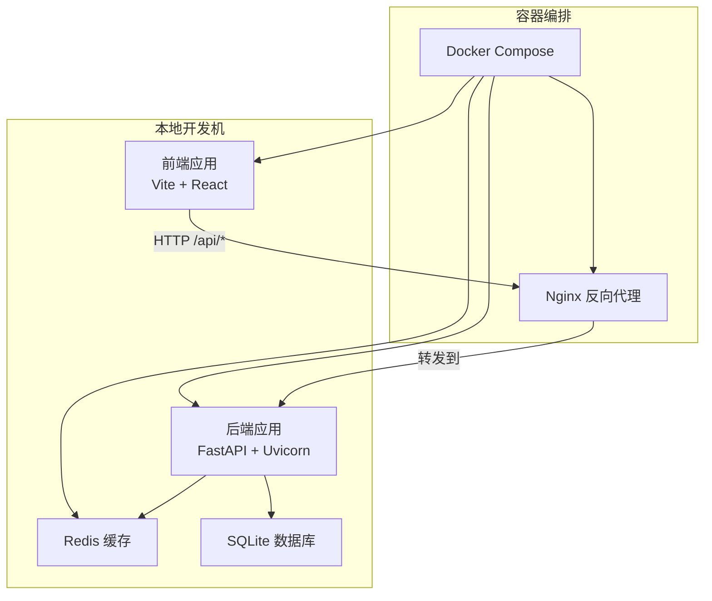
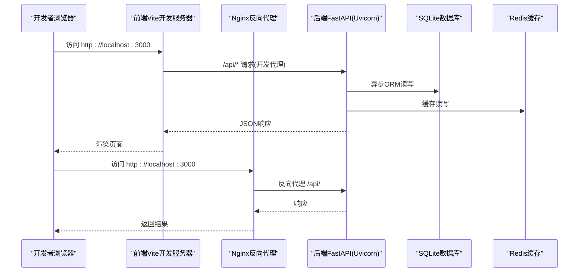
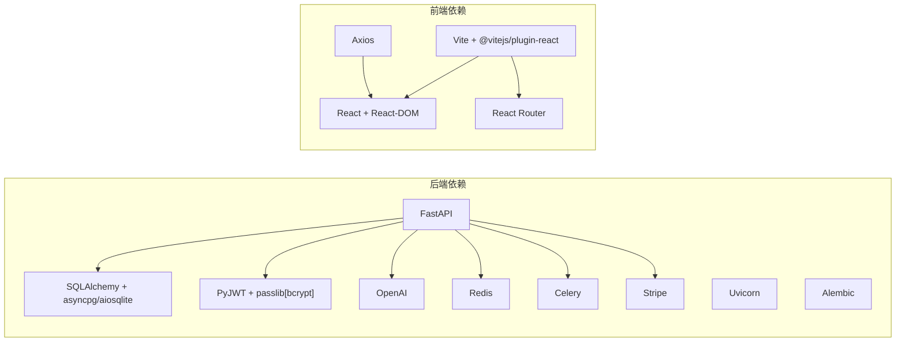

# 开发环境搭建

<cite>
**本文引用的文件**
- [backend/requirements.txt](file://backend/requirements.txt)
- [frontend/package.json](file://frontend/package.json)
- [backend/Dockerfile](file://backend/Dockerfile)
- [deployment/docker-compose.yml](file://deployment/docker-compose.yml)
- [backend/main.py](file://backend/main.py)
- [backend/core/config.py](file://backend/core/config.py)
- [backend/core/db.py](file://backend/core/db.py)
- [backend/core/auth.py](file://backend/core/auth.py)
- [frontend/vite.config.js](file://frontend/vite.config.js)
- [frontend/src/api/client.js](file://frontend/src/api/client.js)
- [deployment/nginx.conf](file://deployment/nginx.conf)
- [backend/demo_local.py](file://backend/demo_local.py)
</cite>

## 目录
1. [简介](#简介)
2. [项目结构](#项目结构)
3. [核心组件](#核心组件)
4. [架构总览](#架构总览)
5. [详细组件分析](#详细组件分析)
6. [依赖关系分析](#依赖关系分析)
7. [性能考虑](#性能考虑)
8. [故障排除指南](#故障排除指南)
9. [结论](#结论)
10. [附录](#附录)

## 简介
本指南面向AI-PPT项目的开发者，提供从零开始搭建本地开发环境的完整流程，涵盖Python后端、Node.js前端、Docker容器化、数据库与缓存服务、环境变量与API密钥配置、以及开发服务器启动与常见问题排查。内容基于仓库中的实际配置文件进行梳理，确保可操作性与一致性。

## 项目结构
项目采用前后端分离架构，后端使用FastAPI + SQLAlchemy异步ORM，前端使用Vite + React，通过Docker Compose统一编排运行时服务（后端、前端、Redis），并通过Nginx作为反向代理对外提供HTTP服务。

图表来源
- [deployment/docker-compose.yml:1-46](file://deployment/docker-compose.yml#L1-L46)
- [deployment/nginx.conf:1-26](file://deployment/nginx.conf#L1-L26)
- [backend/main.py:1-40](file://backend/main.py#L1-L40)

章节来源
- [deployment/docker-compose.yml:1-46](file://deployment/docker-compose.yml#L1-L46)
- [deployment/nginx.conf:1-26](file://deployment/nginx.conf#L1-L26)

## 核心组件
- 后端服务：基于FastAPI构建REST API，支持CORS、静态资源挂载、健康检查端点，并在启动时初始化数据库。
- 前端服务：基于Vite + React，开发时通过代理将/api前缀请求转发至后端。
- 容器编排：使用Docker Compose编排后端、前端、Redis三类服务；Nginx负责反向代理与静态资源分发。
- 配置系统：后端使用pydantic-settings加载.env环境变量，集中管理数据库、Redis、JWT、Stripe等配置项。
- 认证与授权：基于JWT的Bearer Token认证，结合bcrypt密码哈希与SQLAlchemy异步会话。

章节来源
- [backend/main.py:1-40](file://backend/main.py#L1-L40)
- [backend/core/config.py:1-34](file://backend/core/config.py#L1-L34)
- [backend/core/db.py:1-27](file://backend/core/db.py#L1-L27)
- [backend/core/auth.py:1-57](file://backend/core/auth.py#L1-L57)
- [frontend/vite.config.js:1-9](file://frontend/vite.config.js#L1-L9)
- [frontend/src/api/client.js:1-28](file://frontend/src/api/client.js#L1-L28)

## 架构总览
下图展示本地开发与容器化运行时的关键交互路径，包括开发阶段的直连模式与生产部署的反向代理模式。

图表来源
- [frontend/vite.config.js:1-9](file://frontend/vite.config.js#L1-L9)
- [deployment/nginx.conf:1-26](file://deployment/nginx.conf#L1-L26)
- [backend/main.py:1-40](file://backend/main.py#L1-L40)
- [backend/core/db.py:1-27](file://backend/core/db.py#L1-L27)
- [backend/core/config.py:1-34](file://backend/core/config.py#L1-L34)

## 详细组件分析

### Python后端环境准备
- Python版本要求：推荐使用Python 3.12（容器镜像已采用python:3.12-slim）。若需本地开发，建议使用3.9及以上版本。
- 虚拟环境：建议使用venv或conda创建隔离环境，避免全局包冲突。
- 依赖安装：在backend目录执行pip安装命令，安装requirements.txt中声明的所有依赖。
- 运行方式：可直接运行Uvicorn启动后端服务，或通过Docker Compose启动容器化后端。

章节来源
- [backend/Dockerfile:1-15](file://backend/Dockerfile#L1-L15)
- [backend/requirements.txt:1-22](file://backend/requirements.txt#L1-L22)

### Node.js与前端依赖
- Node.js版本：项目使用Vite 6.x，建议使用Node 18+ LTS版本以获得最佳兼容性。
- 包管理工具：项目使用npm脚本，亦可使用yarn或pnpm（需自行替换命令）。
- 依赖安装：在frontend目录执行npm install安装依赖。
- 开发服务器：执行npm run dev启动Vite开发服务器，默认监听3000端口。
- 代理配置：开发代理将/api前缀转发至后端（默认8001端口），请确保后端已启动。

章节来源
- [frontend/package.json:1-26](file://frontend/package.json#L1-L26)
- [frontend/vite.config.js:1-9](file://frontend/vite.config.js#L1-L9)

### Docker与Docker Compose
- 镜像构建：
  - 后端镜像：基于python:3.12-slim，复制requirements.txt并安装依赖，暴露8000端口，CMD启动Uvicorn。
  - 前端镜像：基于node:alpine，复制package*.json后安装依赖，构建产物输出至dist。
- 容器编排：
  - 后端服务：映射8000端口，挂载output与data目录，加载.env环境变量。
  - 前端服务：映射3000端口，依赖后端服务启动。
  - Redis服务：使用redis:7-alpine镜像，持久化数据卷redis_data，映射6379端口。
- 启动与停止：
  - 在deployment目录执行docker compose up -d启动所有服务。
  - 使用docker compose down停止并移除容器。
- Nginx反向代理：容器内运行Nginx，将/api请求转发至后端服务，静态资源由Nginx提供。

章节来源
- [backend/Dockerfile:1-15](file://backend/Dockerfile#L1-L15)
- [deployment/docker-compose.yml:1-46](file://deployment/docker-compose.yml#L1-L46)
- [deployment/nginx.conf:1-26](file://deployment/nginx.conf#L1-L26)

### 数据库与缓存
- 数据库：默认使用SQLite（异步驱动），数据库文件位于项目data目录下。如需切换为PostgreSQL，请在环境变量中提供PostgreSQL连接字符串，并调整依赖与引擎配置。
- 缓存：默认使用Redis，可通过环境变量配置连接地址。容器编排中已提供独立redis服务。
- 初始化：后端启动时自动创建表结构（metadata.create_all）。

章节来源
- [backend/core/config.py:1-34](file://backend/core/config.py#L1-L34)
- [backend/core/db.py:1-27](file://backend/core/db.py#L1-L27)
- [deployment/docker-compose.yml:31-39](file://deployment/docker-compose.yml#L31-L39)

### 环境变量与API密钥
- 环境文件：后端通过pydantic-settings从.env文件加载配置，建议在项目根目录创建.env并按需填写以下关键项：
  - AI模型API密钥：deepseek_api_key、openai_api_key
  - 数据库连接：database_url（默认SQLite）
  - Redis连接：redis_url（默认redis://localhost:6379/0）
  - JWT密钥与算法：jwt_secret、jwt_algorithm、access_token_expire_minutes
  - 支付宝相关：stripe_secret_key、stripe_webhook_secret
  - 输出与上传目录：output_dir、upload_dir
  - 代理地址：proxy_url
- 前端Axios客户端：通过拦截器自动注入Authorization头，登录成功后将token存储于localStorage。

章节来源
- [backend/core/config.py:1-34](file://backend/core/config.py#L1-L34)
- [frontend/src/api/client.js:1-28](file://frontend/src/api/client.js#L1-L28)

### 开发服务器启动
- 方式一：本地直连
  - 后端：在backend目录启动Uvicorn（参考Docker CMD），默认监听0.0.0.0:8000。
  - 前端：在frontend目录启动Vite开发服务器，默认监听0.0.0.0:3000。
  - 代理：前端开发代理将/api转发至后端（默认8001端口），请确保后端已启动。
- 方式二：容器化
  - 在deployment目录执行docker compose up -d启动后端、前端、Redis与Nginx。
  - 访问http://localhost:3000进入前端页面，/api请求由Nginx代理至后端。

章节来源
- [backend/main.py:1-40](file://backend/main.py#L1-L40)
- [frontend/vite.config.js:1-9](file://frontend/vite.config.js#L1-L9)
- [deployment/docker-compose.yml:1-46](file://deployment/docker-compose.yml#L1-L46)
- [deployment/nginx.conf:1-26](file://deployment/nginx.conf#L1-L26)

### IDE配置建议
- VS Code
  - 推荐插件：Python（含Pylance/Debugger）、ESLint、Prettier、Tailwind CSS IntelliSense。
  - Python解释器：指向虚拟环境中Python可执行文件。
  - 前端调试：使用浏览器扩展配合Vite开发服务器进行断点调试。
- PyCharm
  - 选择正确的Python解释器与项目SDK。
  - 配置运行/调试配置：后端使用Uvicorn入口，前端使用npm run dev脚本。
- 通用建议
  - 统一代码格式化与lint规则（Python使用black/isort，JS使用eslint+prettier）。
  - 在.env中配置敏感信息，避免提交至版本控制。

## 依赖关系分析
后端依赖主要分为Web框架、数据库与迁移、认证与令牌、第三方服务集成（OpenAI、Stripe、Redis、Celery等）。前端依赖React生态与构建工具链。

图表来源
- [backend/requirements.txt:1-22](file://backend/requirements.txt#L1-L22)
- [frontend/package.json:1-26](file://frontend/package.json#L1-L26)

章节来源
- [backend/requirements.txt:1-22](file://backend/requirements.txt#L1-L22)
- [frontend/package.json:1-26](file://frontend/package.json#L1-L26)

## 性能考虑
- 数据库：SQLite适合开发测试，生产建议迁移到PostgreSQL以提升并发与稳定性。
- 缓存：合理利用Redis缓存热点数据与任务队列，减少重复计算与IO压力。
- 并发：后端使用异步SQLAlchemy与FastAPI，注意避免阻塞操作，必要时使用Celery后台任务。
- 构建优化：前端生产构建开启压缩与Tree-shaking，减少首屏加载时间。

## 故障排除指南
- 健康检查失败
  - 症状：访问/api/health返回异常或超时。
  - 排查：确认后端服务已启动且端口未被占用；检查CORS配置与路由注册。
- 前端无法访问后端接口
  - 症状：浏览器Network面板显示/api请求失败。
  - 排查：确认Vite开发代理已启用并将/api转发至后端；若使用容器化，确认Nginx代理配置正确。
- 数据库连接错误
  - 症状：启动时报数据库连接失败。
  - 排查：检查database_url是否正确；若使用PostgreSQL，确认驱动与连接串格式；确保数据目录存在且有写权限。
- Redis连接失败
  - 症状：任务队列或缓存功能异常。
  - 排查：确认Redis服务已启动并映射端口；检查redis_url配置；容器环境下确认网络连通。
- JWT认证失败
  - 症状：401未授权或Token解析错误。
  - 排查：确认jwt_secret与算法一致；检查前端是否正确携带Authorization头；核对后端解码逻辑。
- Docker容器无法启动
  - 症状：compose日志报错或容器反复重启。
  - 排查：查看容器日志；确认端口未被占用；检查.env文件与挂载目录权限；重建镜像并清理缓存。

章节来源
- [backend/main.py:37-40](file://backend/main.py#L37-L40)
- [frontend/vite.config.js:6-6](file://frontend/vite.config.js#L6-L6)
- [backend/core/config.py:11-12](file://backend/core/config.py#L11-L12)
- [backend/core/auth.py:35-44](file://backend/core/auth.py#L35-L44)
- [deployment/docker-compose.yml:1-46](file://deployment/docker-compose.yml#L1-L46)

## 结论
通过本指南，您可以在本地快速搭建AI-PPT项目的开发环境，理解容器化编排与前后端协作机制，并掌握常见问题的排查方法。建议在正式开发前完成环境变量与API密钥的配置，并根据团队规范完善代码风格与安全策略。

## 附录

### 环境变量清单（示例）
- 应用基础
  - app_name
  - debug
- AI服务
  - deepseek_api_key
  - openai_api_key
- 数据库
  - database_url（默认SQLite）
- 缓存
  - redis_url（默认Redis）
- 安全
  - jwt_secret、jwt_algorithm、access_token_expire_minutes
- 支付
  - stripe_secret_key、stripe_webhook_secret
- 文件与代理
  - output_dir、upload_dir、proxy_url

章节来源
- [backend/core/config.py:1-34](file://backend/core/config.py#L1-L34)

### 本地演示脚本
- 后端演示：提供一个本地演示脚本用于生成PPT，便于验证PPT引擎与输出目录配置。

章节来源
- [backend/demo_local.py:1-24](file://backend/demo_local.py#L1-L24)